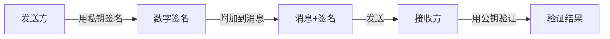
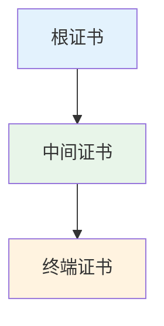
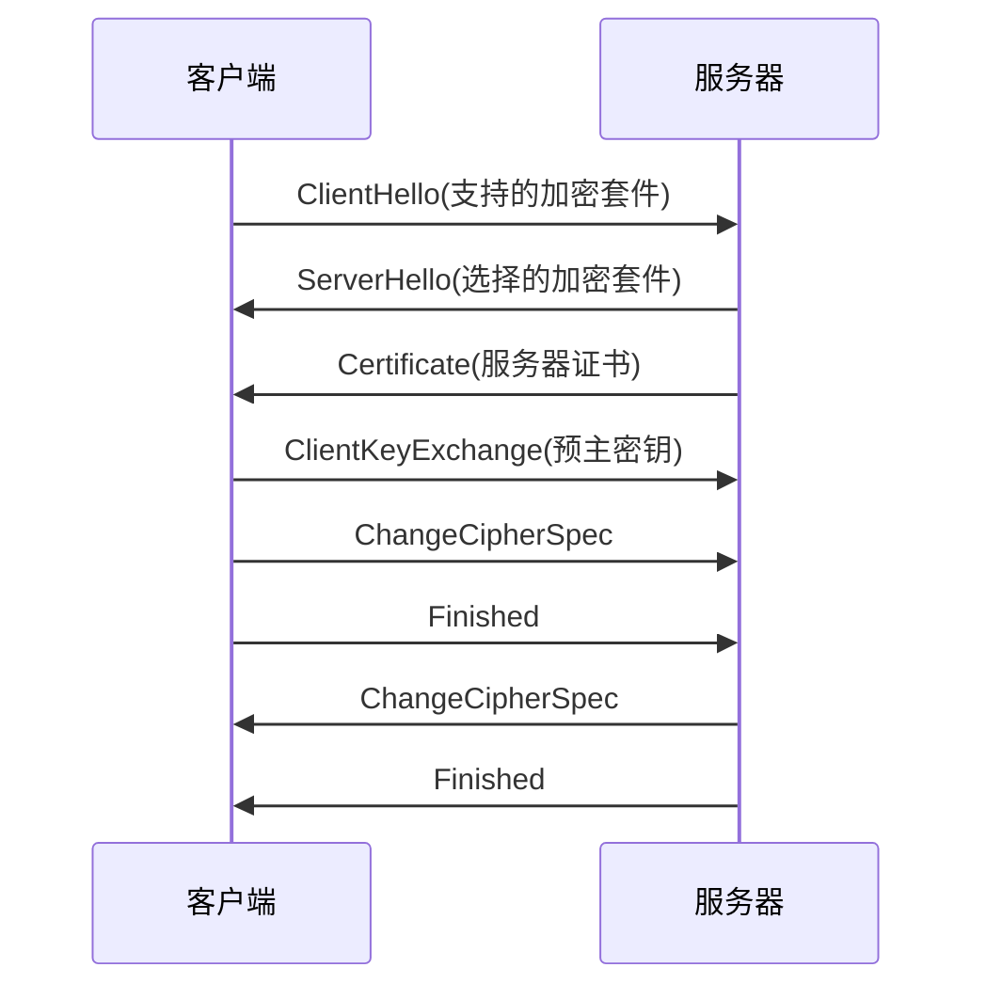
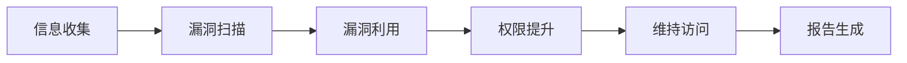
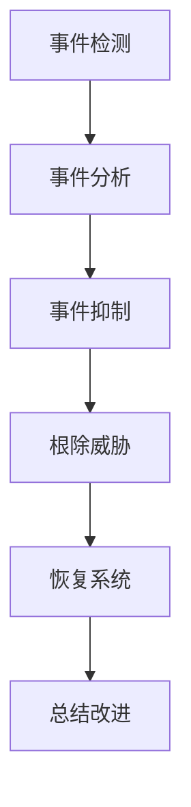

# 计算机安全

## 概述

计算机安全是保护计算机系统硬件、软件、数据不因偶然或恶意的原因而遭到破坏、更改、泄露或失效的技术和管理措施。

!!! note "计算机安全定义"
    计算机安全包括物理安全、运行安全和信息安全三个方面。

## 安全的三个方面

### 1. 物理安全

    <strong>物理安全</strong>
    
保护计算机设备、设施(含网络)以及其他媒体免遭地震、水灾、火灾、有害气体和其他环境事故破坏。

**措施:**

- 机房安全
- 设备防盗
- 电源保护
- 环境控制

### 2. 运行安全

    <strong>运行安全</strong>
    
保证系统正常运行,避免因系统的崩溃和失效而对系统存储、处理和传输的信息造成破坏和损失。

**措施:**

- 系统备份
- 故障恢复
- 应急响应
- 风险管理

### 3. 信息安全

    <strong>信息安全</strong>
    
防止信息财产被故意地或偶然地非授权泄露、更改、破坏或使信息被非法辨识、控制。

**目标:**

- 机密性: 信息不被泄露
- 完整性: 信息不被篡改
- 可用性: 信息可被授权访问
- 真实性: 信息来源可信
- 不可否认性: 行为不可抵赖

## 常见安全威胁

!!! warning "常见安全威胁"
    计算机系统面临的各种威胁。

### 1. 恶意软件

    <strong>恶意软件</strong>
    
故意设计来危害计算机系统的软件。

**类型:**

- **病毒**: 感染其他程序,自我复制
- **蠕虫**: 自我复制,通过网络传播
- **特洛伊木马**: 伪装成合法程序
- **勒索软件**: 加密文件,勒索赎金

### 2. 网络攻击

    <strong>网络攻击</strong>
    
通过网络对计算机系统发起的攻击。

**类型:**

- **DoS/DDoS**: 拒绝服务攻击
- **中间人攻击**: 窃听和篡改通信
- **SQL注入**: 注入恶意SQL代码
- **XSS攻击**: 跨站脚本攻击

### 3. 社会工程学

    <strong>社会工程学</strong>
    
利用人性弱点进行攻击。

**类型:**

- **钓鱼攻击**: 伪装成可信来源
- **假冒攻击**: 冒充他人身份
- **诱饵攻击**: 利用好奇心或贪婪

## 安全防护技术

!!! success "安全防护技术"
    保护计算机系统的各种技术手段。

### 1. 加密技术

    <strong>加密技术</strong>
    
将明文转换为密文,保护数据机密性。

**类型:**

- **对称加密**: 使用相同密钥(DES, AES)
- **非对称加密**: 使用公钥和私钥(RSA, ECC)
- **哈希函数**: 单向加密(MD5, SHA)

### 2. 认证技术

    <strong>认证技术</strong>
    
验证用户或系统身份。

**方式:**

- **口令认证**: 用户名和密码
- **生物认证**: 指纹、人脸、虹膜
- **证书认证**: 数字证书
- **多因素认证**: 组合多种方式

### 3. 访问控制

    <strong>访问控制</strong>
    
控制用户对资源的访问权限。

**模型:**

- **DAC**: 自主访问控制
- **MAC**: 强制访问控制
- **RBAC**: 基于角色的访问控制

### 4. 防火墙

    <strong>防火墙</strong>
    
在网络边界检查和控制流量。

**类型:**

- **包过滤防火墙**: 检查数据包
- **状态检测防火墙**: 跟踪连接状态
- **应用层防火墙**: 检查应用层数据

### 5. 入侵检测

    <strong>入侵检测系统(IDS)</strong>
    
检测和响应入侵行为。

**类型:**

- **基于签名的检测**: 匹配已知攻击模式
- **基于异常的检测**: 检测异常行为

## 安全管理

!!! info "安全管理"
    安全不仅是技术问题,更是管理问题。

### 安全策略

- 制定安全政策
- 实施安全培训
- 建立应急响应
- 定期安全审计

### 安全标准

- ISO 27001: 信息安全管理体系
- 等保2.0: 中国网络安全等级保护
- PCI DSS: 支付卡行业数据安全标准

## 密码学基础

!!! info "密码学"
    研究信息加密和解密的科学,是信息安全的核心技术。

### 对称加密

    <strong>对称加密</strong>
    
加密和解密使用相同密钥的加密算法。

**常见算法:**

- **DES**: 数据加密标准,56位密钥,已不安全
- **3DES**: 三重DES,较安全
- **AES**: 高级加密标准,128/192/256位密钥,目前最安全
- **RC4**: 流加密算法,已不安全

**优点:**

- 加密解密速度快
- 适合大量数据加密

**缺点:**

- 密钥分发困难
- 密钥管理复杂

### 非对称加密

    <strong>非对称加密</strong>
    
使用公钥和私钥的加密算法。

**常见算法:**

- **RSA**: 基于大数分解难题
- **ECC**: 椭圆曲线加密,效率更高
- **ElGamal**: 基于离散对数难题

**应用:**

- 数字签名
- 密钥交换
- 身份认证

**优点:**

- 密钥分发简单
- 支持数字签名

**缺点:**

- 计算速度慢
- 不适合大量数据加密

### 哈希函数

!!! tip "哈希函数"
    将任意长度数据映射为固定长度摘要的单向函数。

**常见算法:**

- **MD5**: 128位摘要,已不安全
- **SHA-1**: 160位摘要,已不安全
- **SHA-256**: 256位摘要,安全
- **SHA-3**: 最新标准,安全

**特点:**

- 单向性: 不可逆
- 抗碰撞性: 难以找到相同摘要的输入
- 固定长度输出

**应用:**

- 数据完整性校验
- 数字签名
- 密码存储

### 数字签名

    <strong>数字签名</strong>
    
证明消息来源和完整性的技术。

**过程:**

**作用:**

- 身份认证: 证明发送方身份
- 完整性: 检测消息是否被篡改
- 不可否认: 发送方不能否认发送

## PKI与数字证书

!!! warning "PKI(公钥基础设施)"
    支持公钥加密和数字签名的安全基础设施。

### 数字证书

    <strong>数字证书</strong>
    
由CA签发的证明公钥所有者身份的电子文件。

**内容:**

- 公钥
- 证书所有者信息
- CA信息
- 有效期
- CA的数字签名

**证书链:**

### CA(证书颁发机构)

**功能:**

- 验证申请者身份
- 签发数字证书
- 管理证书生命周期
- 发布证书撤销列表(CRL)

## 网络安全协议

### SSL/TLS

    <strong>SSL/TLS</strong>
    
传输层安全协议,保护网络通信安全。

**功能:**

- 加密通信数据
- 身份认证
- 数据完整性保护

**握手过程:**

### IPSec

!!! success "IPSec"
    网络层安全协议,保护IP通信。

**两种模式:**

- **传输模式**: 只加密数据载荷
- **隧道模式**: 加密整个IP包

**协议:**

- **AH(Authentication Header)**: 提供认证和完整性
- **ESP(Encapsulating Security Payload)**: 提供加密、认证和完整性

## 安全攻防技术

### 渗透测试

    <strong>渗透测试</strong>
    
模拟攻击者对系统进行安全测试。

**流程:**

**方法:**

- 黑盒测试: 无内部信息
- 白盒测试: 有完整信息
- 灰盒测试: 部分信息

### 常见漏洞

!!! info "常见安全漏洞"
    Web应用常见的安全漏洞。

#### 1. SQL注入

**原理:** 通过输入恶意SQL代码操纵数据库。

**防护:**

- 使用参数化查询
- 输入验证
- 最小权限原则

#### 2. XSS(跨站脚本攻击)

**原理:** 注入恶意脚本到网页。

**防护:**

- 输出编码
- 内容安全策略(CSP)
- 输入验证

#### 3. CSRF(跨站请求伪造)

**原理:** 伪造用户请求。

**防护:**

- CSRF Token
- 验证Referer
- SameSite Cookie

#### 4. 文件上传漏洞

**原理:** 上传恶意文件执行代码。

**防护:**

- 文件类型验证
- 文件内容检查
- 存储隔离

## 安全运维

### 安全审计

    <strong>安全审计</strong>
    
记录和分析系统活动,发现安全问题。

**内容:**

- 用户行为审计
- 系统事件审计
- 网络流量审计
- 应用日志审计

### 应急响应

!!! warning "应急响应"
    安全事件发生后的处理流程。

**流程:**

**关键步骤:**

1. **准备**: 建立应急响应团队和预案
2. **检测**: 发现和确认安全事件
3. **抑制**: 限制事件影响范围
4. **根除**: 消除威胁源
5. **恢复**: 恢复系统正常运行
6. **总结**: 分析原因,改进防护

### 安全加固

    <strong>安全加固</strong>
    
提高系统安全性的配置和措施。

**系统加固:**

- 关闭不必要服务
- 更新补丁
- 配置防火墙
- 设置强密码策略

**应用加固:**

- 输入验证
- 输出编码
- 错误处理
- 安全配置

## 参考资料

- [计算机安全 百度百科](https://baike.baidu.com/item/计算机安全)
- [应用密码学](https://book.douban.com/subject/1088420/)
- [Web安全攻防](https://book.douban.com/subject/26374348/)
- [OWASP Top 10](https://owasp.org/Top10/)
