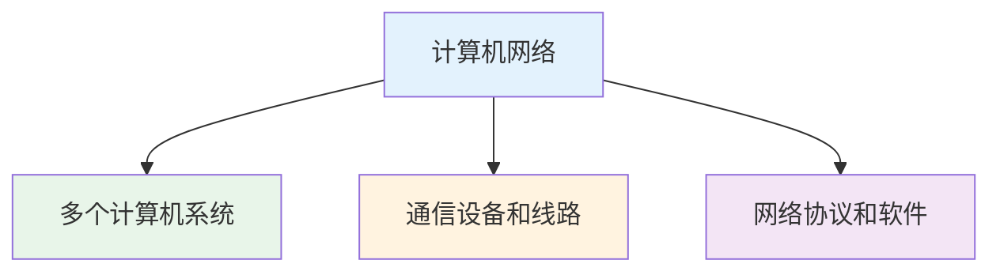
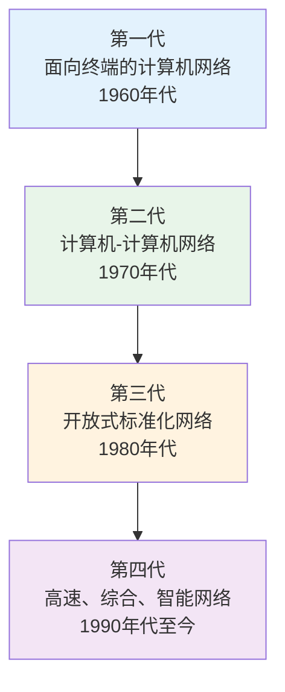
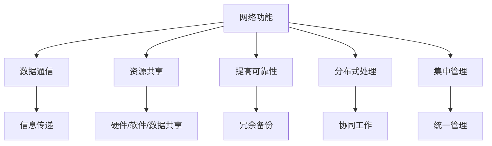

# 计算机网络

## 概述

!!! note "计算机网络定义"
    将分散在不同地点且具有独立功能的多个计算机系统,利用通信设备和线路相互连接起来,在网络协议和软件的支持下进行数据通信,实现资源共享的计算机系统的集合。

### 计算机网络三要素

### 计算机网络的目的

!!! tip "核心目的"
    实现资源的共享,包括硬件资源、软件资源和数据资源。

## 计算机网络的发展历程

### 第一代:面向终端的计算机网络(1960年代)

    <strong>面向终端的网络</strong>
    
终端通过通信线路连接到中心计算机,实现远程访问。

**特点:**

- 以单台中心计算机为中心
- 终端无独立处理能力
- 线路利用率低
- 代表: SAGE系统、SABRE系统

### 第二代:计算机-计算机网络(1970年代)

!!! info "计算机-计算机网络"
    多台具有独立处理能力的计算机通过通信线路互联。

**特点:**

- 多台计算机互联
- 计算机具有独立处理能力
- 实现资源共享
- 代表: ARPANET

### 第三代:开放式标准化网络(1980年代)

    <strong>开放式标准化网络</strong>
    
统一网络体系结构,实现不同网络互联。

**特点:**

- 统一的网络体系结构
- 开放式标准协议
- 实现网络互联
- 代表: OSI参考模型、TCP/IP协议

### 第四代:高速、综合、智能网络(1990年代至今)

**特点:**

- 高速化: 千兆、万兆网络
- 综合化: 多业务融合
- 智能化: 自动配置、管理
- 代表: Internet、物联网、5G

## 计算机网络的基本组成

### 网络硬件

    <strong>网络硬件组成</strong>

- **网络服务器**: 提供网络服务的计算机
- **网络工作站**: 用户使用的计算机
- **传输介质**: 双绞线、光纤、无线等
- **网络设备**: 路由器、交换机、集线器等

### 网络软件

!!! warning "网络软件组成"
    支持网络运行的软件系统。

- **网络操作系统**: Windows Server、Linux、Unix
- **通信软件**: 实现数据传输
- **通信协议**: TCP/IP、HTTP、FTP等

## 计算机网络的功能

### 1. 数据通信

    <strong>数据通信</strong>
    
实现计算机之间的信息传递。</p