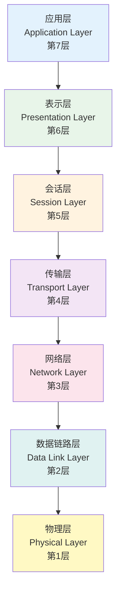
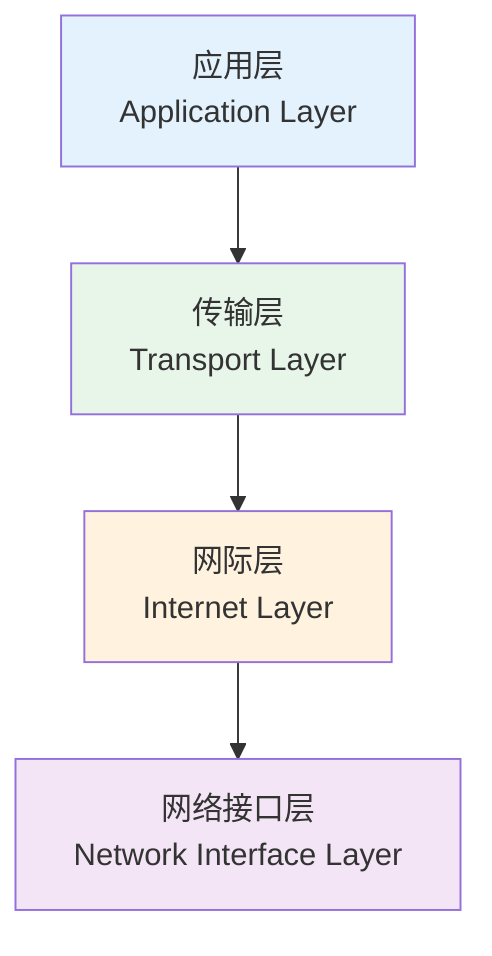
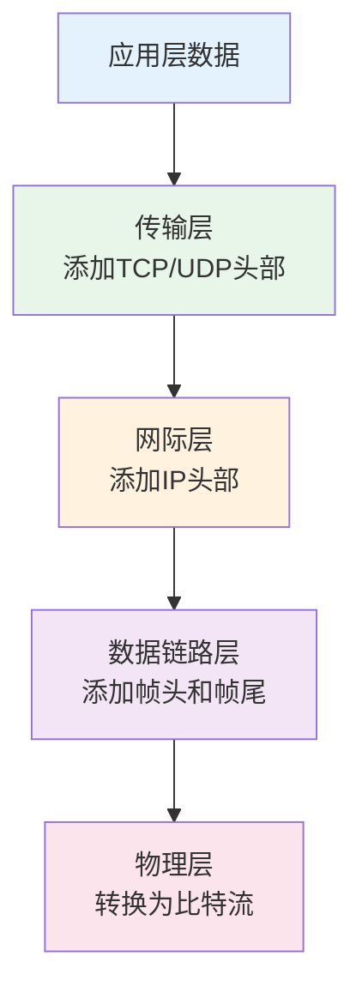

# 网络体系结构

## 概述

!!! note "网络体系结构"
    计算机网络各层及其协议的集合,是网络及其部件所应完成功能的精确定义。

## OSI参考模型

    <strong>OSI七层模型</strong>
    
开放系统互连参考模型,国际标准化组织(ISO)制定的网络体系结构标准。

### OSI模型结构

### 各层功能详解

#### 1. 物理层(Physical Layer)

!!! tip "物理层"
    传输比特流,定义物理传输介质、电气特性、机械特性等。

**功能:**

- 定义电压电平
- 定义数据传输速率
- 定义物理连接器规格
- 定义传输模式(单工、半双工、全双工)

**设备:** 中继器、集线器、网线

#### 2. 数据链路层(Data Link Layer)

    <strong>数据链路层</strong>
    
将比特流组装成帧,提供节点到节点的传输。

**功能:**

- 帧的封装与解封装
- 物理地址(MAC)寻址
- 差错检测
- 流量控制

**子层:**

- **逻辑链路控制(LLC)**: 提供服务接口
- **介质访问控制(MAC)**: 控制介质访问

**设备:** 网桥、交换机

#### 3. 网络层(Network Layer)

!!! info "网络层"
    提供端到端的逻辑通信,实现路由选择。

**功能:**

- 逻辑地址(IP)寻址
- 路由选择
- 分组转发
- 拥塞控制

**设备:** 路由器

#### 4. 传输层(Transport Layer)

    <strong>传输层</strong>
    
提供端到端的可靠或不可靠数据传输。

**功能:**

- 分段与重组
- 端口寻址
- 连接管理
- 流量控制
- 差错控制

**协议:** TCP、UDP

#### 5. 会话层(Session Layer)

!!! warning "会话层"
    建立、管理和终止会话连接。

**功能:**

- 会话建立与终止
- 会话同步
- 会话管理

#### 6. 表示层(Presentation Layer)

    <strong>表示层</strong>
    
处理数据的表示、安全和压缩。

**功能:**

- 数据格式转换
- 数据加密解密
- 数据压缩解压

#### 7. 应用层(Application Layer)

!!! success "应用层"
    为应用程序提供网络服务接口。

**功能:**

- 提供网络服务
- 用户接口

**协议:** HTTP、FTP、SMTP、DNS等

## TCP/IP参考模型

    <strong>TCP/IP四层模型</strong>
    
Internet实际使用的体系结构,是OSI模型的简化实现。

### TCP/IP模型结构

### 各层功能

#### 1. 应用层

**功能:** 提供各种网络应用服务

**协议:**

- HTTP: 超文本传输协议
- FTP: 文件传输协议
- SMTP: 简单邮件传输协议
- DNS: 域名系统
- Telnet: 远程登录

#### 2. 传输层

!!! tip "传输层协议"
    提供端到端的数据传输服务。

**TCP(传输控制协议):**

- 面向连接
- 可靠传输
- 流量控制
- 拥塞控制

**UDP(用户数据报协议):**

- 无连接
- 不可靠传输
- 高效快速

#### 3. 网际层

    <strong>网际层</strong>
    
负责主机到主机的数据传输。

**协议:**

- IP: 网际协议
- ICMP: Internet控制消息协议
- IGMP: Internet组管理协议
- ARP: 地址解析协议
- RARP: 反向地址解析协议

#### 4. 网络接口层

**功能:**

- 处理物理传输
- 封装和解封装数据帧
- 与物理网络交互

## OSI与TCP/IP对比

    <table style="width: 100%; border-collapse: collapse; margin: 10px 0;">
        <tr style="background-color: #4CAF50; color: white;">
            <th style="padding: 10px; border: 1px solid #ddd;">对比项</th>
            <th style="padding: 10px; border: 1px solid #ddd;">OSI模型</th>
            <th style="padding: 10px; border: 1px solid #ddd;">TCP/IP模型</th>
        </tr>
        <tr>
            <td style="padding: 10px; border: 1px solid #ddd;">层数</td>
            <td style="padding: 10px; border: 1px solid #ddd;">7层</td>
            <td style="padding: 10px; border: 1px solid #ddd;">4层</td>
        </tr>
        <tr style="background-color: #f9f9f9;">
            <td style="padding: 10px; border: 1px solid #ddd;">理论基础</td>
            <td style="padding: 10px; border: 1px solid #ddd;">理论模型</td>
            <td style="padding: 10px; border: 1px solid #ddd;">实际应用</td>
        </tr>
        <tr>
            <td style="padding: 10px; border: 1px solid #ddd;">协议开发</td>
            <td style="padding: 10px; border: 1px solid #ddd;">先有模型后有协议</td>
            <td style="padding: 10px; border: 1px solid #ddd;">先有协议后有模型</td>
        </tr>
        <tr style="background-color: #f9f9f9;">
            <td style="padding: 10px; border: 1px solid #ddd;">应用范围</td>
            <td style="padding: 10px; border: 1px solid #ddd;">理论参考</td>
            <td style="padding: 10px; border: 1px solid #ddd;">Internet实际使用</td>
        </tr>
    </table>

## 数据封装过程

!!! info "封装过程"
    数据从应用层向下传递时,每一层都会添加自己的协议头部(和尾部),最终在物理层转换为比特流传输。

## 参考资料

- [OSI模型 百度百科](https://baike.baidu.com/item/OSI模型)
- [TCP/IP协议 百度百科](https://baike.baidu.com/item/TCP/IP协议)
