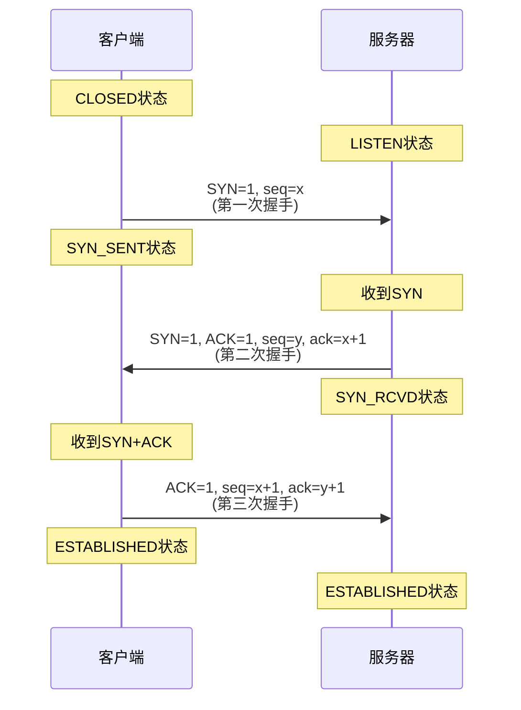
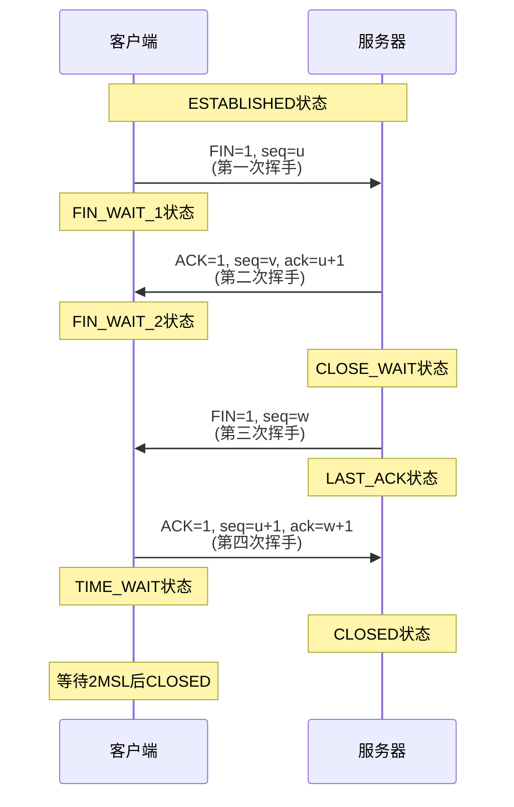
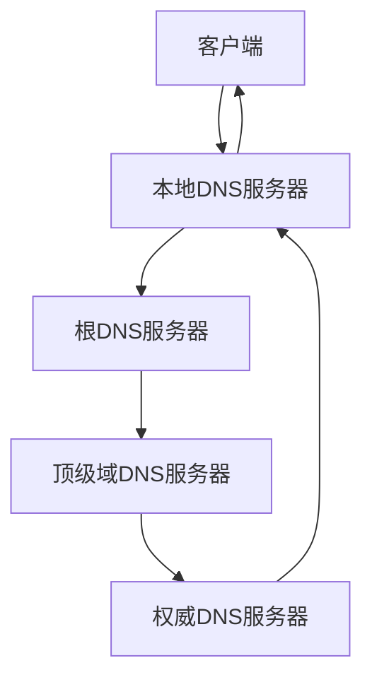

# 网络协议

## 概述

!!! note "网络协议"
    为进行网络中的数据交换而建立的规则、标准或约定。网络协议由语法、语义和时序三个要素组成。

## TCP协议

    <strong>TCP(传输控制协议)</strong>
    
面向连接的、可靠的传输层协议,提供全双工的字节流传输服务。

### TCP特点

- **面向连接**: 通信前需建立连接
- **可靠传输**: 保证数据无差错、不丢失、不重复、按序到达
- **面向字节流**: 以字节为单位传输
- **全双工通信**: 双向同时传输
- **流量控制**: 防止发送方淹没接收方
- **拥塞控制**: 防止网络拥塞

### TCP连接建立 - 三次握手

!!! tip "三次握手作用"
    - 确认双方的接收和发送能力
    - 协商初始序列号
    - 防止失效的连接请求

### TCP连接释放 - 四次挥手

### TCP可靠传输机制

    <strong>可靠传输机制</strong>

**1. 序号与确认**

- 每个字节都有序号
- 确认号表示期望收到的下一个字节序号
- 累积确认

**2. 重传机制**

- 超时重传: RTO(Retransmission Timeout)
- 快速重传: 收到3个重复ACK

**3. 流量控制**

- 滑动窗口机制
- 接收窗口(rwnd)
- 发送窗口 = min(rwnd, cwnd)

**4. 拥塞控制**

!!! warning "拥塞控制算法"
    防止过多数据注入网络。

- **慢开始**: 指数增长
- **拥塞避免**: 线性增长
- **快速重传**: 收到3个重复ACK
- **快速恢复**: 拥塞窗口减半

## UDP协议

    <strong>UDP(用户数据报协议)</strong>
    
无连接的、不可靠的传输层协议,提供高效的数据传输服务。

### UDP特点

- **无连接**: 不需要建立连接
- **不可靠**: 不保证数据到达
- **面向报文**: 保留报文边界
- **无拥塞控制**: 网络拥塞时不会降低发送速率
- **支持一对多**: 支持广播、多播

### UDP应用场景

- 实时音视频传输
- DNS查询
- 在线游戏
- SNMP网络管理

## HTTP协议

!!! info "HTTP(超文本传输协议)"
    应用层协议,用于Web浏览器和Web服务器之间的通信。

### HTTP版本

    <table style="width: 100%; border-collapse: collapse; margin: 10px 0;">
        <tr style="background-color: #4CAF50; color: white;">
            <th style="padding: 10px; border: 1px solid #ddd;">版本</th>
            <th style="padding: 10px; border: 1px solid #ddd;">特点</th>
            <th style="padding: 10px; border: 1px solid #ddd;">连接方式</th>
        </tr>
        <tr>
            <td style="padding: 10px; border: 1px solid #ddd;">HTTP/1.0</td>
            <td style="padding: 10px; border: 1px solid #ddd;">短连接,每次请求新建连接</td>
            <td style="padding: 10px; border: 1px solid #ddd;">非持久连接</td>
        </tr>
        <tr style="background-color: #f9f9f9;">
            <td style="padding: 10px; border: 1px solid #ddd;">HTTP/1.1</td>
            <td style="padding: 10px; border: 1px solid #ddd;">持久连接,管道化请求</td>
            <td style="padding: 10px; border: 1px solid #ddd;">持久连接</td>
        </tr>
        <tr>
            <td style="padding: 10px; border: 1px solid #ddd;">HTTP/2</td>
            <td style="padding: 10px; border: 1px solid #ddd;">多路复用,头部压缩,服务器推送</td>
            <td style="padding: 10px; border: 1px solid #ddd;">多路复用</td>
        </tr>
        <tr style="background-color: #f9f9f9;">
            <td style="padding: 10px; border: 1px solid #ddd;">HTTP/3</td>
            <td style="padding: 10px; border: 1px solid #ddd;">基于QUIC协议,使用UDP</td>
            <td style="padding: 10px; border: 1px solid #ddd;">UDP连接</td>
        </tr>
    </table>

### HTTP请求方法

    <strong>HTTP请求方法</strong>

- **GET**: 获取资源
- **POST**: 提交数据
- **PUT**: 更新资源
- **DELETE**: 删除资源
- **HEAD**: 获取响应头
- **OPTIONS**: 查询支持的方法

### HTTP状态码

!!! success "HTTP状态码分类"
    表示HTTP请求的处理结果。

- **1xx**: 信息性状态码
- **2xx**: 成功状态码
    - 200 OK: 请求成功
    - 201 Created: 资源创建成功
- **3xx**: 重定向状态码
    - 301 Moved Permanently: 永久重定向
    - 302 Found: 临时重定向
- **4xx**: 客户端错误
    - 400 Bad Request: 请求错误
    - 404 Not Found: 资源不存在
- **5xx**: 服务器错误
    - 500 Internal Server Error: 服务器内部错误
    - 503 Service Unavailable: 服务不可用

## 其他重要协议

### IP协议

    <strong>IP(网际协议)</strong>
    
网络层核心协议,负责主机间的数据传输。

**功能:**

- 寻址和路由
- 分片和重组
- 生存时间控制

### ICMP协议

!!! warning "ICMP(Internet控制消息协议)"
    用于网络诊断和错误报告。

**应用:**

- Ping: 测试连通性
- Traceroute: 跟踪路由

### DNS协议

    <strong>DNS(域名系统)</strong>
    
将域名解析为IP地址。

**解析过程:**

## 参考资料

- [TCP协议 百度百科](https://baike.baidu.com/item/TCP)
- [HTTP协议 百度百科](https://baike.baidu.com/item/HTTP)
- [计算机网络:自顶向下方法](https://book.douban.com/subject/3028655/)
