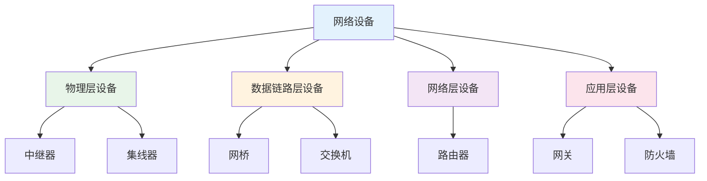
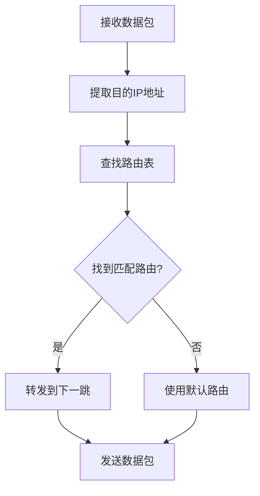

# 网络设备

## 概述

!!! note "网络设备"
    用于连接、转发和管理网络数据的硬件设备,是构建计算机网络的基础设施。

## 网络设备分类

## 物理层设备

### 1. 中继器(Repeater)

    <strong>中继器</strong>
    
工作在物理层,对信号进行放大和转发,延长网络传输距离。

**功能:**

- 信号放大
- 信号整形
- 延长传输距离

**特点:**

- 只有两个端口
- 不识别帧和包
- 对所有信号进行转发
- 不能连接不同类型的网络

**应用:** 扩展局域网覆盖范围

### 2. 集线器(Hub)

!!! tip "集线器"
    多端口中继器,工作在物理层,将信号广播到所有端口。

**功能:**

- 多端口信号放大
- 信号广播
- 简单的网络连接

**特点:**

- 多端口设备
- 共享带宽
- 广播方式转发
- 所有端口在同一冲突域

**缺点:**

- 带宽利用率低
- 容易产生冲突
- 安全性差

## 数据链路层设备

### 1. 网桥(Bridge)

    <strong>网桥</strong>
    
工作在数据链路层,根据MAC地址转发帧,连接两个网段。

**功能:**

- 帧的转发和过滤
- MAC地址学习
- 分隔冲突域

**工作原理:**

1. 学习: 记录源MAC地址和端口对应关系
2. 转发: 根据目的MAC地址查表转发
3. 过滤: 目的地址在同一端口则过滤
4. 广播: 目的地址未知则广播

### 2. 交换机(Switch)

!!! info "交换机"
    多端口网桥,工作在数据链路层,根据MAC地址表智能转发帧。

**功能:**

- 多端口帧转发
- MAC地址学习
- 分隔冲突域
- 支持VLAN
- 支持生成树协议

**交换方式:**

- **存储转发**: 接收完整帧后转发,可检测错误
- **直通转发**: 接收帧头后立即转发,速度快
- **无碎片转发**: 接收64字节后转发

**交换机类型:**

    <table style="width: 100%; border-collapse: collapse; margin: 10px 0;">
        <tr style="background-color: #4CAF50; color: white;">
            <th style="padding: 10px; border: 1px solid #ddd;">类型</th>
            <th style="padding: 10px; border: 1px solid #ddd;">特点</th>
            <th style="padding: 10px; border: 1px solid #ddd;">应用</th>
        </tr>
        <tr>
            <td style="padding: 10px; border: 1px solid #ddd;">二层交换机</td>
            <td style="padding: 10px; border: 1px solid #ddd;">基于MAC地址转发</td>
            <td style="padding: 10px; border: 1px solid #ddd;">局域网接入</td>
        </tr>
        <tr style="background-color: #f9f9f9;">
            <td style="padding: 10px; border: 1px solid #ddd;">三层交换机</td>
            <td style="padding: 10px; border: 1px solid #ddd;">支持路由功能</td>
            <td style="padding: 10px; border: 1px solid #ddd;">VLAN间路由</td>
        </tr>
        <tr>
            <td style="padding: 10px; border: 1px solid #ddd;">多层交换机</td>
            <td style="padding: 10px; border: 1px solid #ddd;">支持四层及以上</td>
            <td style="padding: 10px; border: 1px solid #ddd;">高级网络功能</td>
        </tr>
    </table>

## 网络层设备

### 路由器(Router)

    <strong>路由器</strong>
    
工作在网络层,根据路由表转发数据包,实现网络互联。

**功能:**

- 路由选择
- 分组转发
- 分隔广播域
- 连接不同网络
- NAT(网络地址转换)

**路由选择过程:**

**路由协议:**

!!! warning "路由协议"
    路由器之间交换路由信息的协议。

- **RIP**: 距离向量协议,跳数限制15
- **OSPF**: 链路状态协议,适合大型网络
- **BGP**: 路径向量协议,用于自治系统间

## 应用层设备

### 1. 网关(Gateway)

    <strong>网关</strong>
    
工作在应用层,实现不同协议之间的转换。

**功能:**

- 协议转换
- 数据格式转换
- 网络互联

**类型:**

- 应用网关: 特定应用协议转换
- 传输网关: 传输层协议转换

### 2. 防火墙(Firewall)

!!! success "防火墙"
    网络安全设备,控制网络流量,保护内部网络。

**功能:**

- 访问控制
- 流量过滤
- NAT转换
- VPN支持

**类型:**

- **包过滤防火墙**: 基于IP和端口过滤
- **状态检测防火墙**: 跟踪连接状态
- **应用层防火墙**: 深度包检测

## 传输介质

### 有线传输介质

    <strong>有线传输介质</strong>

**1. 双绞线**

- 非屏蔽双绞线(UTP): 成本低,应用广
- 屏蔽双绞线(STP): 抗干扰强
- 分类: Cat5、Cat5e、Cat6、Cat6a、Cat7

**2. 同轴电缆**

- 粗同轴电缆: 早期以太网使用
- 细同轴电缆: 成本较低

**3. 光纤**

!!! info "光纤"
    利用光的全反射原理传输光信号。

- **单模光纤**: 传输距离远,成本高
- **多模光纤**: 传输距离近,成本低

**优点:**

- 带宽大
- 抗干扰强
- 传输距离远
- 安全性高

### 无线传输介质

    <strong>无线传输介质</strong>

- **无线电波**: 全向传播,穿透能力强
- **微波**: 定向传播,需要视距
- **红外线**: 短距离通信
- **激光**: 高速传输,需要视距

## 网络设备选择

!!! tip "设备选择原则"
    根据网络规模和需求选择合适的网络设备。

**小型网络:**

- 交换机: 二层交换机
- 路由器: 家用路由器

**中型网络:**

- 交换机: 三层交换机
- 路由器: 企业级路由器

**大型网络:**

- 交换机: 多层交换机
- 路由器: 高端路由器
- 防火墙: 企业级防火墙

## 参考资料

- [网络设备 百度百科](https://baike.baidu.com/item/网络设备)
- [计算机网络设备](https://book.douban.com/subject/1234567/)
