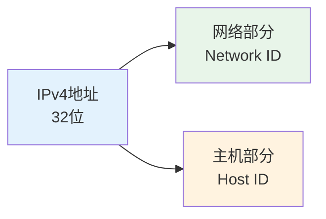
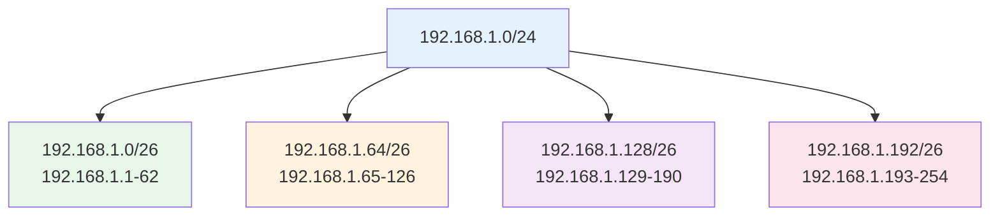
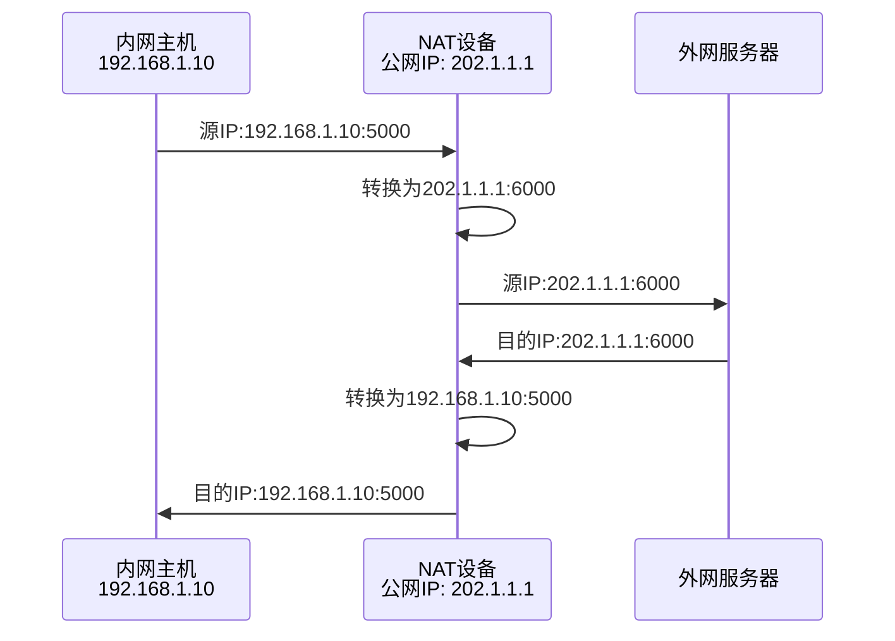

# IP地址与子网

## 概述

!!! note "IP地址"
    IP地址是网络中设备的逻辑地址,用于在网络中唯一标识一个设备。IP地址工作在网络层,是网络通信的基础。

## IPv4地址

    <strong>IPv4地址</strong>
    
32位二进制地址,通常用点分十进制表示,如192.168.1.1。

### IPv4地址结构

**表示方式:**

- 二进制: 11000000.10101000.00000001.00000001
- 十进制: 192.168.1.1
- 每段范围: 0-255

### IPv4地址分类

    <table style="width: 100%; border-collapse: collapse; margin: 10px 0;">
        <tr style="background-color: #4CAF50; color: white;">
            <th style="padding: 10px; border: 1px solid #ddd;">类别</th>
            <th style="padding: 10px; border: 1px solid #ddd;">地址范围</th>
            <th style="padding: 10px; border: 1px solid #ddd;">网络位/主机位</th>
            <th style="padding: 10px; border: 1px solid #ddd;">网络数</th>
            <th style="padding: 10px; border: 1px solid #ddd;">主机数/网络</th>
        </tr>
        <tr>
            <td style="padding: 10px; border: 1px solid #ddd;">A类</td>
            <td style="padding: 10px; border: 1px solid #ddd;">1.0.0.0 ~ 126.255.255.255</td>
            <td style="padding: 10px; border: 1px solid #ddd;">8位/24位</td>
            <td style="padding: 10px; border: 1px solid #ddd;">126</td>
            <td style="padding: 10px; border: 1px solid #ddd;">16,777,214</td>
        </tr>
        <tr style="background-color: #f9f9f9;">
            <td style="padding: 10px; border: 1px solid #ddd;">B类</td>
            <td style="padding: 10px; border: 1px solid #ddd;">128.0.0.0 ~ 191.255.255.255</td>
            <td style="padding: 10px; border: 1px solid #ddd;">16位/16位</td>
            <td style="padding: 10px; border: 1px solid #ddd;">16,384</td>
            <td style="padding: 10px; border: 1px solid #ddd;">65,534</td>
        </tr>
        <tr>
            <td style="padding: 10px; border: 1px solid #ddd;">C类</td>
            <td style="padding: 10px; border: 1px solid #ddd;">192.0.0.0 ~ 223.255.255.255</td>
            <td style="padding: 10px; border: 1px solid #ddd;">24位/8位</td>
            <td style="padding: 10px; border: 1px solid #ddd;">2,097,152</td>
            <td style="padding: 10px; border: 1px solid #ddd;">254</td>
        </tr>
        <tr style="background-color: #f9f9f9;">
            <td style="padding: 10px; border: 1px solid #ddd;">D类</td>
            <td style="padding: 10px; border: 1px solid #ddd;">224.0.0.0 ~ 239.255.255.255</td>
            <td style="padding: 10px; border: 1px solid #ddd;">多播地址</td>
            <td style="padding: 10px; border: 1px solid #ddd;">-</td>
            <td style="padding: 10px; border: 1px solid #ddd;">-</td>
        </tr>
        <tr>
            <td style="padding: 10px; border: 1px solid #ddd;">E类</td>
            <td style="padding: 10px; border: 1px solid #ddd;">240.0.0.0 ~ 255.255.255.255</td>
            <td style="padding: 10px; border: 1px solid #ddd;">保留地址</td>
            <td style="padding: 10px; border: 1px solid #ddd;">-</td>
            <td style="padding: 10px; border: 1px solid #ddd;">-</td>
        </tr>
    </table>

### 特殊IPv4地址

!!! tip "特殊IP地址"
    具有特殊用途的IP地址。

- **0.0.0.0**: 本机默认地址
- **127.0.0.1**: 本地回环地址(localhost)
- **255.255.255.255**: 受限广播地址
- **私有地址**: 内网使用,不能在Internet上路由
    - A类私有: 10.0.0.0 ~ 10.255.255.255
    - B类私有: 172.16.0.0 ~ 172.31.255.255
    - C类私有: 192.168.0.0 ~ 192.168.255.255

## 子网掩码

    <strong>子网掩码</strong>
    
用于区分IP地址的网络部分和主机部分。

### 子网掩码表示

**1. 点分十进制表示**

- 255.0.0.0 (A类默认)
- 255.255.0.0 (B类默认)
- 255.255.255.0 (C类默认)

**2. CIDR表示法**

- /8 (255.0.0.0)
- /16 (255.255.0.0)
- /24 (255.255.255.0)

### 子网划分

!!! info "子网划分"
    将一个网络划分为多个子网,提高IP地址利用率。

**计算方法:**

1. 确定需要的子网数
2. 计算需要的子网位数: 2^n >= 子网数
3. 从主机位借n位作为子网位
4. 计算新的子网掩码

**示例:**

将192.168.1.0/24划分为4个子网

## IPv6地址

    <strong>IPv6地址</strong>
    
128位地址,解决IPv4地址枯竭问题。

### IPv6地址表示

**格式:** 8组16位十六进制数,用冒号分隔

**示例:** 2001:0db8:85a3:0000:0000:8a2e:0370:7334

**简化规则:**

1. 每组前导0可以省略
2. 连续的0组可以用::表示(只能使用一次)

**简化后:** 2001:db8:85a3::8a2e:370:7334

### IPv6地址类型

!!! warning "IPv6地址类型"
    IPv6定义了多种地址类型。

**1. 单播地址(Unicast)**

- 全球单播地址: 相当于IPv4公网地址
- 链路本地地址: fe80::/10
- 唯一本地地址: fc00::/7

**2. 任播地址(Anycast)**

- 一组接口的标识符
- 发送到最近的一个接口

**3. 多播地址(Multicast)**

- ff00::/8
- 一组接口的标识符

### IPv6优势

    <strong>IPv6优势</strong>

- **地址空间大**: 2^128个地址
- **自动配置**: 无状态自动配置
- **安全性**: 内置IPSec
- **QoS支持**: 流标签
- **简化头部**: 提高处理效率

## 网络地址转换(NAT)

!!! success "NAT(网络地址转换)"
    将私有IP地址转换为公网IP地址,解决IPv4地址不足问题。

### NAT类型

**1. 静态NAT**

- 一对一映射
- 固定映射关系

**2. 动态NAT**

- 地址池映射
- 动态分配

**3. NAPT/PAT**

- 端口地址转换
- 多对一映射
- 最常用方式

### NAT工作原理

## IP地址规划

    <strong>IP地址规划原则</strong>

### 规划原则

1. **层次化设计**: 核心层、汇聚层、接入层
2. **连续性**: 地址连续,便于聚合
3. **扩展性**: 预留地址空间
4. **安全性**: 合理划分安全区域

### VLSM(可变长子网掩码)

!!! info "VLSM"
    允许使用不同大小的子网,提高地址利用率。

**应用场景:**

- 不同规模的网络
- 点对点链路使用/30
- 大网络使用较小掩码

## 参考资料

- [IP地址 百度百科](https://baike.baidu.com/item/IP地址)
- [IPv6 百度百科](https://baike.baidu.com/item/IPv6)
- [子网掩码 百度百科](https://baike.baidu.com/item/子网掩码)
