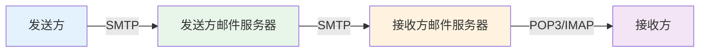
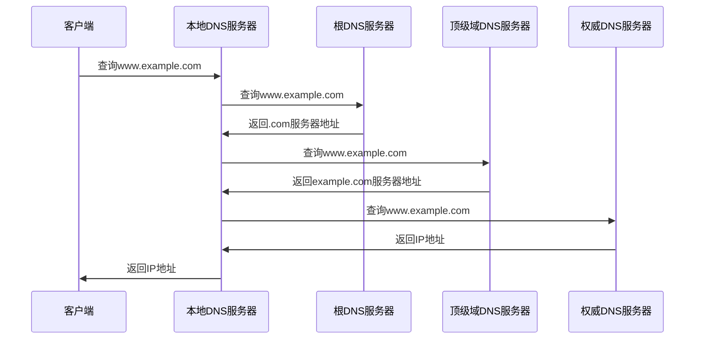
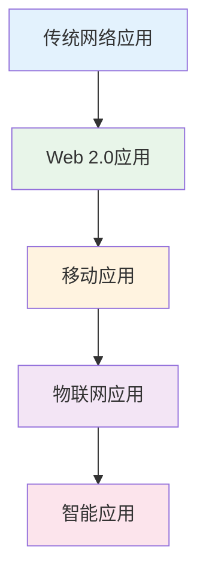

# 网络应用

## 概述

!!! note "网络应用"
    基于计算机网络提供的通信服务而开发的各种应用程序,是用户直接使用的网络服务。

## Web应用

### 万维网(WWW)

    <strong>万维网(World Wide Web)</strong>
    
基于Internet的信息系统,通过超链接将全球信息资源连接起来。

**组成:**

- **Web服务器**: 存储和提供网页
- **Web浏览器**: 请求和显示网页
- **HTTP协议**: 传输协议
- **URL**: 统一资源定位符

### URL结构

!!! tip "URL组成"
    URL描述了网上资源的访问方式和位置。

**格式:** `协议://主机名[:端口]/路径/文件名?参数#锚点`

**示例:**

- `http://www.example.com/index.html`
- `https://www.example.com:443/path/page.html?id=123#section`

### Web技术

    <table style="width: 100%; border-collapse: collapse; margin: 10px 0;">
        <tr style="background-color: #4CAF50; color: white;">
            <th style="padding: 10px; border: 1px solid #ddd;">技术</th>
            <th style="padding: 10px; border: 1px solid #ddd;">作用</th>
            <th style="padding: 10px; border: 1px solid #ddd;">示例</th>
        </tr>
        <tr>
            <td style="padding: 10px; border: 1px solid #ddd;">HTML</td>
            <td style="padding: 10px; border: 1px solid #ddd;">网页结构</td>
            <td style="padding: 10px; border: 1px solid #ddd;">定义页面内容</td>
        </tr>
        <tr style="background-color: #f9f9f9;">
            <td style="padding: 10px; border: 1px solid #ddd;">CSS</td>
            <td style="padding: 10px; border: 1px solid #ddd;">网页样式</td>
            <td style="padding: 10px; border: 1px solid #ddd;">定义页面外观</td>
        </tr>
        <tr>
            <td style="padding: 10px; border: 1px solid #ddd;">JavaScript</td>
            <td style="padding: 10px; border: 1px solid #ddd;">网页交互</td>
            <td style="padding: 10px; border: 1px solid #ddd;">实现动态效果</td>
        </tr>
        <tr style="background-color: #f9f9f9;">
            <td style="padding: 10px; border: 1px solid #ddd;">AJAX</td>
            <td style="padding: 10px; border: 1px solid #ddd;">异步通信</td>
            <td style="padding: 10px; border: 1px solid #ddd;">无刷新更新</td>
        </tr>
    </table>

## 电子邮件

### 电子邮件系统

    <strong>电子邮件系统</strong>
    
通过网络实现异地传送和接收信息的通信系统。

### 邮件地址格式

**格式:** `<用户名>@<邮件服务器域名>`

**示例:** `user@example.com`

### 邮件协议

!!! info "邮件协议"
    电子邮件系统使用的协议。

**1. SMTP(简单邮件传输协议)**

- 用途: 发送邮件
- 端口: 25
- 特点: 推送协议

**2. POP3(邮局协议第3版)**

- 用途: 接收邮件
- 端口: 110
- 特点: 拉取协议,下载后删除

**3. IMAP(Internet邮件访问协议)**

- 用途: 接收邮件
- 端口: 143
- 特点: 服务器端管理,多设备同步

### 邮件传输过程

## 文件传输

### FTP(文件传输协议)

    <strong>FTP(文件传输协议)</strong>
    
用于在网络上进行文件传输的标准协议。

**工作方式:**

- **控制连接**: 传输FTP命令,端口21
- **数据连接**: 传输文件数据,端口20

**传输模式:**

- **主动模式**: 服务器主动连接客户端
- **被动模式**: 客户端主动连接服务器

**基本命令:**

- USER: 用户名
- PASS: 密码
- LIST: 列出文件
- RETR: 下载文件
- STOR: 上传文件

## 域名系统(DNS)

### DNS功能

!!! warning "DNS(域名系统)"
    将域名解析为IP地址的分布式数据库系统。

**作用:**

- 域名到IP地址的映射
- IP地址到域名的反向解析
- 邮件服务器定位

### 域名结构

    <strong>域名层次结构</strong>

**格式:** `主机名.三级域名.二级域名.顶级域名`

**示例:** `www.tsinghua.edu.cn`

- cn: 国家顶级域名(中国)
- edu: 二级域名(教育机构)
- tsinghua: 三级域名(清华大学)
- www: 主机名(Web服务器)

### DNS解析过程

## 远程登录

### Telnet

    <strong>Telnet</strong>
    
远程登录协议,允许用户远程访问服务器。

**特点:**

- 端口: 23
- 明文传输,不安全
- 已被SSH取代

### SSH(安全外壳协议)

!!! success "SSH"
    加密的远程登录协议,提供安全的远程访问。

**特点:**

- 端口: 22
- 加密传输
- 支持密钥认证
- 支持SFTP、SCP

## 即时通信

### 即时通信应用

    <strong>即时通信(IM)</strong>
    
实时进行文字、语音、视频通信的应用。

**功能:**

- 即时消息
- 文件传输
- 语音通话
- 视频通话
- 群组聊天

**协议:**

- XMPP: 可扩展消息和出席协议
- SIP: 会话发起协议
- WebRTC: Web实时通信

## 流媒体应用

### 流媒体技术

!!! info "流媒体"
    在网络上实时传输音频、视频等多媒体内容。

**特点:**

- 边下载边播放
- 实时传输
- 支持直播

**协议:**

- RTSP: 实时流协议
- RTP: 实时传输协议
- RTMP: 实时消息协议
- HLS: HTTP直播流

## P2P应用

### P2P技术

    <strong>P2P(对等网络)</strong>
    
每个节点既是客户端又是服务器。

**特点:**

- 去中心化
- 资源共享
- 高扩展性

**应用:**

- 文件共享: BitTorrent
- 语音通信: Skype
- 区块链: Bitcoin

## 网络应用发展趋势

!!! tip "发展趋势"
    - **移动化**: 移动互联网应用
    - **智能化**: AI驱动的应用
    - **实时化**: 实时通信和协作
    - **个性化**: 个性化推荐和服务

## 参考资料

- [网络应用 百度百科](https://baike.baidu.com/item/网络应用)
- [HTTP协议 百度百科](https://baike.baidu.com/item/HTTP)
- [DNS 百度百科](https://baike.baidu.com/item/DNS)
