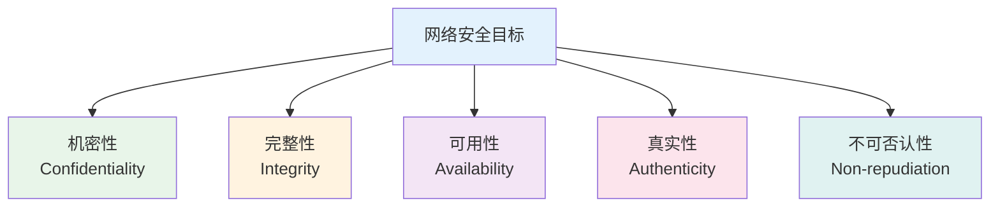
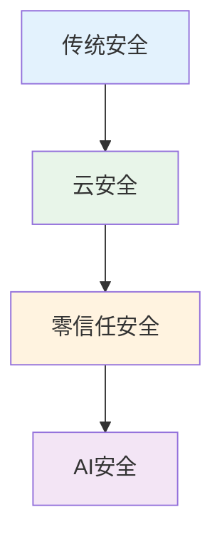

# 网络安全

## 概述

!!! note "网络安全"
    保护网络系统中的硬件、软件和数据不因偶然或恶意的原因而遭到破坏、更改和泄露,保障网络系统正常运行。

## 网络安全目标

    <strong>网络安全基本目标</strong>

### 1. 机密性

!!! tip "机密性"
    信息不被泄露给非授权的用户、实体或过程。

**实现方式:**

- 数据加密
- 访问控制
- 信息隐藏

### 2. 完整性

    <strong>完整性</strong>
    
信息在存储或传输过程中不被篡改、破坏。

**实现方式:**

- 数字签名
- 哈希校验
- 消息认证码(MAC)

### 3. 可用性

!!! info "可用性"
    授权实体在需要时可以访问和使用信息。

**保障措施:**

- 冗余备份
- 负载均衡
- 容灾恢复

## 常见网络威胁

### 1. 恶意软件

    <strong>恶意软件(Malware)</strong>
    
故意设计来危害计算机系统的软件。

**类型:**

- **病毒(Virus)**: 感染其他程序,自我复制
- **蠕虫(Worm)**: 自我复制,通过网络传播
- **特洛伊木马(Trojan)**: 伪装成合法程序
- **勒索软件(Ransomware)**: 加密文件,勒索赎金
- **间谍软件(Spyware)**: 窃取用户信息

### 2. 网络攻击

!!! warning "网络攻击"
    通过网络对计算机系统发起的攻击。

**攻击类型:**

**1. DoS/DDoS攻击**

- 拒绝服务攻击
- 使目标系统无法提供服务
- 分布式攻击更难防御

**2. 中间人攻击(MITM)**

- 窃听和篡改通信
- 伪装成通信双方
- 破坏通信机密性

**3. SQL注入**

- 注入恶意SQL代码
- 绕过身份验证
- 窃取或破坏数据

**4. XSS攻击(跨站脚本)**

- 注入恶意脚本
- 在用户浏览器执行
- 窃取用户信息

**5. CSRF攻击(跨站请求伪造)**

- 伪造用户请求
- 利用用户身份
- 执行未授权操作

### 3. 社会工程学

    <strong>社会工程学</strong>
    
利用人性弱点进行攻击。

**攻击方式:**

- **钓鱼攻击(Phishing)**: 伪装成可信来源
- **假冒攻击**: 冒充他人身份
- **诱饵攻击**: 利用好奇心或贪婪

## 网络安全防护技术

### 1. 加密技术

!!! success "加密技术"
    将明文转换为密文,保护数据机密性。

**对称加密:**

- DES、3DES、AES
- 加密解密使用相同密钥
- 速度快,适合大量数据

**非对称加密:**

- RSA、ECC
- 使用公钥和私钥
- 速度慢,适合少量数据

**哈希函数:**

- MD5、SHA-1、SHA-256
- 单向加密,不可逆
- 用于数据完整性校验

### 2. 认证技术

    <strong>认证技术</strong>
    
验证用户或系统身份。

**认证方式:**

- **口令认证**: 用户名和密码
- **生物认证**: 指纹、人脸、虹膜
- **证书认证**: 数字证书
- **多因素认证(MFA)**: 组合多种方式

### 3. 访问控制

!!! info "访问控制"
    控制用户对资源的访问权限。

**访问控制模型:**

- **DAC(自主访问控制)**: 资源所有者决定权限
- **MAC(强制访问控制)**: 系统强制控制权限
- **RBAC(基于角色的访问控制)**: 通过角色分配权限

### 4. 防火墙

    <strong>防火墙</strong>
    
在网络边界检查和控制流量。

**防火墙类型:**

- **包过滤防火墙**: 基于IP和端口过滤
- **状态检测防火墙**: 跟踪连接状态
- **应用层防火墙**: 深度包检测

**防火墙功能:**

- 访问控制
- NAT转换
- VPN支持
- 入侵检测

### 5. 入侵检测系统(IDS)

!!! warning "入侵检测系统"
    检测和响应入侵行为。

**检测方式:**

- **基于签名的检测**: 匹配已知攻击模式
- **基于异常的检测**: 检测异常行为

**IDS类型:**

- **NIDS(网络入侵检测)**: 监控网络流量
- **HIDS(主机入侵检测)**: 监控主机活动

### 6. VPN(虚拟专用网络)

    <strong>VPN</strong>
    
在公网上建立安全的专用网络通道。

**VPN协议:**

- **PPTP**: 点对点隧道协议
- **L2TP**: 第二层隧道协议
- **IPSec**: IP安全协议
- **SSL VPN**: 基于SSL的VPN

**VPN应用:**

- 远程访问
- 站点互联
- 数据加密传输

## 网络安全协议

### SSL/TLS

!!! success "SSL/TLS"
    传输层安全协议,保护网络通信安全。

**功能:**

- 数据加密
- 身份认证
- 数据完整性

**应用:**

- HTTPS: 安全的HTTP
- FTPS: 安全的FTP
- SMTPS: 安全的邮件传输

### IPSec

    <strong>IPSec</strong>
    
网络层安全协议。

**协议组成:**

- **AH(认证头)**: 提供认证和完整性
- **ESP(封装安全载荷)**: 提供加密、认证和完整性

**工作模式:**

- 传输模式: 只加密数据载荷
- 隧道模式: 加密整个IP包

## 网络安全管理

### 安全策略

!!! tip "安全策略"
    网络安全管理的指导原则。

**内容:**

- 安全政策制定
- 安全培训教育
- 应急响应预案
- 定期安全审计

### 安全标准

    <table style="width: 100%; border-collapse: collapse; margin: 10px 0;">
        <tr style="background-color: #4CAF50; color: white;">
            <th style="padding: 10px; border: 1px solid #ddd;">标准</th>
            <th style="padding: 10px; border: 1px solid #ddd;">内容</th>
            <th style="padding: 10px; border: 1px solid #ddd;">应用</th>
        </tr>
        <tr>
            <td style="padding: 10px; border: 1px solid #ddd;">ISO 27001</td>
            <td style="padding: 10px; border: 1px solid #ddd;">信息安全管理体系</td>
            <td style="padding: 10px; border: 1px solid #ddd;">企业安全管理</td>
        </tr>
        <tr style="background-color: #f9f9f9;">
            <td style="padding: 10px; border: 1px solid #ddd;">等保2.0</td>
            <td style="padding: 10px; border: 1px solid #ddd;">网络安全等级保护</td>
            <td style="padding: 10px; border: 1px solid #ddd;">中国网络安全</td>
        </tr>
        <tr>
            <td style="padding: 10px; border: 1px solid #ddd;">PCI DSS</td>
            <td style="padding: 10px; border: 1px solid #ddd;">支付卡行业数据安全标准</td>
            <td style="padding: 10px; border: 1px solid #ddd;">金融行业</td>
        </tr>
    </table>

### 安全运维

!!! warning "安全运维"
    保障网络安全的日常运维工作。

**工作内容:**

- 安全监控
- 漏洞扫描
- 补丁管理
- 日志审计
- 应急响应

## 网络安全发展趋势

!!! info "发展趋势"
    - **云安全**: 云环境下的安全防护
    - **零信任**: 不信任任何用户和设备
    - **AI安全**: 利用AI进行安全防护
    - **DevSecOps**: 开发运维安全一体化

## 参考资料

- [网络安全 百度百科](https://baike.baidu.com/item/网络安全)
- [信息安全 百度百科](https://baike.baidu.com/item/信息安全)
- [OWASP Top 10](https://owasp.org/Top10/)
