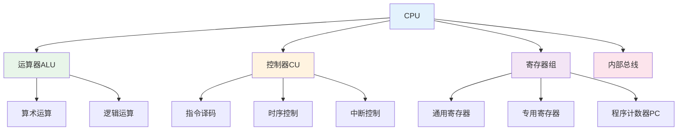
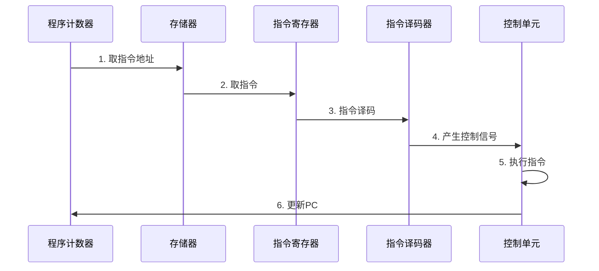
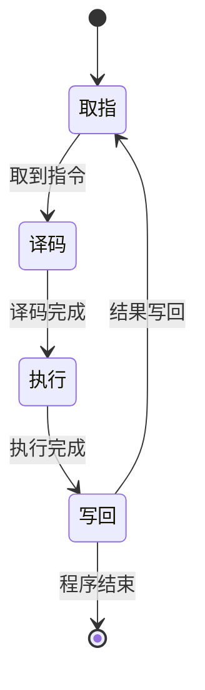

# CPU结构

## 概述

!!! note "CPU结构"
    CPU由运算器、控制器和寄存器组三大部分组成,通过内部总线连接,共同完成指令的执行。

## CPU基本组成

## 运算器

    <strong>运算器(Arithmetic Logic Unit, ALU)</strong>
    
执行各种算术运算和逻辑运算的部件,是CPU的数据处理中心。

### 运算器组成

**1. 算术逻辑单元(ALU)**

!!! tip "算术逻辑单元"
    核心运算部件,执行各种运算。

**功能:**

- 算术运算: 加、减、乘、除
- 逻辑运算: 与、或、非、异或
- 移位操作: 左移、右移、循环移位
- 比较运算: 等于、大于、小于

**2. 累加器(ACC)**

    <strong>累加器</strong>
    
存放运算数据和运算结果的寄存器。

**作用:**

- 存放操作数
- 存放运算结果
- 与ALU直接连接

**3. 状态寄存器(PSW)**

!!! info "状态寄存器"
    存放运算结果的状态标志。

**标志位:**

- **ZF(零标志)**: 结果为零时置1
- **SF(符号标志)**: 结果为负时置1
- **CF(进位标志)**: 运算有进位时置1
- **OF(溢出标志)**: 运算溢出时置1
- **PF(奇偶标志)**: 结果中1的个数为偶数时置1

### 运算器工作流程

## 控制器

    <strong>控制器(Control Unit, CU)</strong>
    
指挥和协调计算机各部件工作的指挥中心,是CPU的控制中心。

### 控制器组成

**1. 程序计数器(PC)**

!!! warning "程序计数器"
    存放下一条指令的地址,自动加1指向下一指令。

**功能:**

- 存放指令地址
- 自动增量
- 支持跳转指令

**2. 指令寄存器(IR)**

    <strong>指令寄存器</strong>
    
存放当前正在执行的指令。

**作用:**

- 存放指令代码
- 提供给指令译码器
- 保持指令执行期间不变

**3. 指令译码器(ID)**

!!! success "指令译码器"
    分析指令功能,产生控制信号。

**功能:**

- 识别指令操作码
- 确定指令类型
- 产生控制信号

**4. 时序发生器**

    <strong>时序发生器</strong>
    
产生时序控制信号。

**功能:**

- 产生时钟信号
- 产生节拍信号
- 控制指令执行时序

**5. 操作控制器**

!!! info "操作控制器"
    根据指令译码结果产生各种控制信号。

**控制方式:**

- **硬布线控制**: 由组合逻辑电路产生控制信号
- **微程序控制**: 由微指令产生控制信号

### 控制器工作流程

## 寄存器组

    <strong>寄存器组</strong>
    
CPU内部的高速存储单元,用于暂存数据和地址。

### 寄存器分类

**1. 通用寄存器**

!!! tip "通用寄存器"
    存放操作数和运算结果。

**常见通用寄存器(x86架构):**

- **AX(累加器)**: 算术运算
- **BX(基址寄存器)**: 地址索引
- **CX(计数寄存器)**: 循环计数
- **DX(数据寄存器)**: I/O操作
- **SI(源变址寄存器)**: 源操作数地址
- **DI(目的变址寄存器)**: 目的操作数地址

**2. 专用寄存器**

    <table style="width: 100%; border-collapse: collapse; margin: 10px 0;">
        <tr style="background-color: #4CAF50; color: white;">
            <th style="padding: 10px; border: 1px solid #ddd;">寄存器</th>
            <th style="padding: 10px; border: 1px solid #ddd;">名称</th>
            <th style="padding: 10px; border: 1px solid #ddd;">功能</th>
        </tr>
        <tr>
            <td style="padding: 10px; border: 1px solid #ddd;">PC</td>
            <td style="padding: 10px; border: 1px solid #ddd;">程序计数器</td>
            <td style="padding: 10px; border: 1px solid #ddd;">存放下一条指令地址</td>
        </tr>
        <tr style="background-color: #f9f9f9;">
            <td style="padding: 10px; border: 1px solid #ddd;">IR</td>
            <td style="padding: 10px; border: 1px solid #ddd;">指令寄存器</td>
            <td style="padding: 10px; border: 1px solid #ddd;">存放当前指令</td>
        </tr>
        <tr>
            <td style="padding: 10px; border: 1px solid #ddd;">MAR</td>
            <td style="padding: 10px; border: 1px solid #ddd;">存储器地址寄存器</td>
            <td style="padding: 10px; border: 1px solid #ddd;">存放访问存储器的地址</td>
        </tr>
        <tr style="background-color: #f9f9f9;">
            <td style="padding: 10px; border: 1px solid #ddd;">MDR</td>
            <td style="padding: 10px; border: 1px solid #ddd;">存储器数据寄存器</td>
            <td style="padding: 10px; border: 1px solid #ddd;">存放读写存储器的数据</td>
        </tr>
        <tr>
            <td style="padding: 10px; border: 1px solid #ddd;">PSW</td>
            <td style="padding: 10px; border: 1px solid #ddd;">状态寄存器</td>
            <td style="padding: 10px; border: 1px solid #ddd;">存放状态标志</td>
        </tr>
    </table>

**3. 段寄存器(x86架构)**

!!! warning "段寄存器"
    用于内存分段管理。

- **CS(代码段)**: 存放代码段基地址
- **DS(数据段)**: 存放数据段基地址
- **SS(堆栈段)**: 存放堆栈段基地址
- **ES(附加段)**: 存放附加段基地址

## CPU工作原理

### 指令执行周期

### 指令执行过程

    <strong>指令执行步骤</strong>

**1. 取指周期(Fetch)**

- 根据PC从存储器取出指令
- 指令送入IR
- PC自动加1

**2. 译码周期(Decode)**

- 分析IR中的指令
- 识别操作码和地址码
- 产生控制信号

**3. 执行周期(Execute)**

- 根据控制信号执行操作
- 完成算术或逻辑运算
- 或完成数据传输

**4. 写回周期(Writeback)**

- 将运算结果写回寄存器或存储器
- 更新状态标志
- 准备执行下一条指令

## 现代CPU技术

### 多核技术

!!! success "多核CPU"
    在一个芯片上集成多个CPU核心。

**优点:**

- 提高并行处理能力
- 降低功耗
- 提高性能价格比

**挑战:**

- 核间通信
- Cache一致性
- 负载均衡

### 超线程技术

    <strong>超线程技术(Hyper-Threading)</strong>
    
一个物理核心模拟两个逻辑核心。

**原理:**

- 利用CPU资源空闲时间
- 同时执行多个线程
- 提高资源利用率

## 参考资料

- [CPU结构 百度百科](https://baike.baidu.com/item/CPU结构)
- [计算机组成原理](https://baike.baidu.com/item/计算机组成原理)
