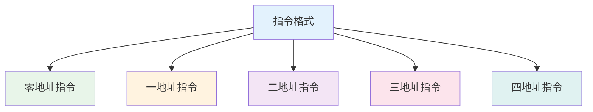

# 指令系统

## 概述

!!! note "指令系统"
    指令系统是CPU所能执行的全部指令的集合,是计算机硬件和软件的主要界面。

## 指令格式

    <strong>指令基本格式</strong>
    
指令 = 操作码(OP) + 地址码(AD)

### 指令字长度

- **单字长指令**: 指令长度等于机器字长
- **半字长指令**: 指令长度等于半个机器字长
- **双字长指令**: 指令长度等于两个机器字长

### 地址码格式

**1. 零地址指令**

!!! tip "零地址指令"
    无操作数指令,用于停机、空操作等。

**格式:** `OP`

**示例:** HLT(停机)、NOP(空操作)

**2. 一地址指令**

    <strong>一地址指令</strong>
    
单操作数指令,操作数既是源又是目的。

**格式:** `OP A1`

**示例:** INC AX(加1)、DEC AX(减1)

**3. 二地址指令**

!!! info "二地址指令"
    双操作数指令,最常用的指令格式。

**格式:** `OP A1, A2`

**功能:** (A1) OP (A2) → A1

**示例:** ADD AX, BX(加法)、MOV AX, BX(传送)

**4. 三地址指令**

    <strong>三地址指令</strong>
    
两个源操作数,一个目的操作数。

**格式:** `OP A1, A2, A3`

**功能:** (A2) OP (A3) → A1

## 寻址方式

!!! warning "寻址方式"
    确定操作数有效地址的方法。

### 1. 立即寻址

    <strong>立即寻址</strong>
    
操作数直接包含在指令中。

**格式:** `OP #n`

**示例:** `MOV AX, #100`

**特点:**

- 速度快,无需访问内存
- 操作数固定,灵活性差

### 2. 直接寻址

!!! success "直接寻址"
    指令中直接给出操作数的内存地址。

**格式:** `OP (ADDR)`

**示例:** `MOV AX, (1000H)`

**特点:**

- 直观简单
- 地址固定,灵活性差
- 寻址范围受指令长度限制

### 3. 间接寻址

    <strong>间接寻址</strong>
    
指令给出的是操作数地址的地址。

**格式:** `OP ((ADDR))`

**特点:**

- 寻址范围大
- 需要多次访问内存
- 速度较慢

### 4. 寄存器寻址

!!! info "寄存器寻址"
    操作数存放在寄存器中。

**格式:** `OP R`

**示例:** `MOV AX, BX`

**特点:**

- 速度快,无需访问内存
- 寻址范围受寄存器数量限制

### 5. 寄存器间接寻址

    <strong>寄存器间接寻址</strong>
    
寄存器中存放操作数的内存地址。

**格式:** `OP (R)`

**示例:** `MOV AX, (BX)`

**特点:**

- 寻址范围大
- 比间接寻址快

### 6. 变址寻址

!!! tip "变址寻址"
    有效地址 = 变址寄存器内容 + 形式地址

**格式:** `OP (R + D)`

**示例:** `MOV AX, 100(BX)`

**应用:** 数组访问、循环处理

### 7. 基址寻址

    <strong>基址寻址</strong>
    
有效地址 = 基址寄存器内容 + 形式地址

**应用:** 多道程序设计、重定位

### 8. 相对寻址

!!! warning "相对寻址"
    有效地址 = PC内容 + 形式地址

**应用:** 转移指令、位置无关代码

## 指令类型

    <table style="width: 100%; border-collapse: collapse; margin: 10px 0;">
        <tr style="background-color: #4CAF50; color: white;">
            <th style="padding: 10px; border: 1px solid #ddd;">类型</th>
            <th style="padding: 10px; border: 1px solid #ddd;">功能</th>
            <th style="padding: 10px; border: 1px solid #ddd;">示例</th>
        </tr>
        <tr>
            <td style="padding: 10px; border: 1px solid #ddd;">数据传送</td>
            <td style="padding: 10px; border: 1px solid #ddd;">在寄存器/存储器间传送数据</td>
            <td style="padding: 10px; border: 1px solid #ddd;">MOV、PUSH、POP</td>
        </tr>
        <tr style="background-color: #f9f9f9;">
            <td style="padding: 10px; border: 1px solid #ddd;">算术运算</td>
            <td style="padding: 10px; border: 1px solid #ddd;">执行算术运算</td>
            <td style="padding: 10px; border: 1px solid #ddd;">ADD、SUB、MUL、DIV</td>
        </tr>
        <tr>
            <td style="padding: 10px; border: 1px solid #ddd;">逻辑运算</td>
            <td style="padding: 10px; border: 1px solid #ddd;">执行逻辑运算</td>
            <td style="padding: 10px; border: 1px solid #ddd;">AND、OR、NOT、XOR</td>
        </tr>
        <tr style="background-color: #f9f9f9;">
            <td style="padding: 10px; border: 1px solid #ddd;">移位操作</td>
            <td style="padding: 10px; border: 1px solid #ddd;">执行移位操作</td>
            <td style="padding: 10px; border: 1px solid #ddd;">SHL、SHR、ROL、ROR</td>
        </tr>
        <tr>
            <td style="padding: 10px; border: 1px solid #ddd;">转移指令</td>
            <td style="padding: 10px; border: 1px solid #ddd;">改变程序执行顺序</td>
            <td style="padding: 10px; border: 1px solid #ddd;">JMP、CALL、RET</td>
        </tr>
        <tr style="background-color: #f9f9f9;">
            <td style="padding: 10px; border: 1px solid #ddd;">控制指令</td>
            <td style="padding: 10px; border: 1px solid #ddd;">控制CPU状态</td>
            <td style="padding: 10px; border: 1px solid #ddd;">HLT、NOP、CLI、STI</td>
        </tr>
    </table>

## CISC与RISC

### CISC(复杂指令集计算机)

!!! success "CISC特点"
    - 指令系统复杂,指令数量多
    - 指令格式多样,长度不固定
    - 寻址方式复杂
    - 代表: x86架构

### RISC(精简指令集计算机)

    <strong>RISC特点</strong>
    <ul style="margin: 5px 0;">
        <li>指令系统简单,指令数量少</li>
        <li>指令格式固定,长度统一</li>
        <li>寻址方式简单</li>
        <li>代表: ARM、MIPS、RISC-V</li>
    </ul>

## 参考资料

- [指令系统 百度百科](https://baike.baidu.com/item/指令系统)
- [寻址方式 百度百科](https://baike.baidu.com/item/寻址方式)
