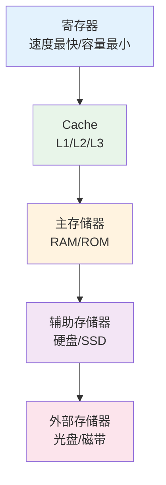

# 存储系统

## 概述

!!! note "存储系统"
    存储系统是计算机系统中用于存储数据和程序的部件,采用层次化结构,从高速小容量到低速大容量。

## 存储器层次结构

## 主存储器

    <strong>主存储器(内存)</strong>
    
临时存储数据和指令,供CPU直接访问。

### RAM(随机存取存储器)

!!! tip "RAM类型"
    可读可写的易失性存储器。

**1. SRAM(静态RAM)**

- 用触发器存储信息
- 速度快,用作Cache
- 集成度低,成本高
- 不需要刷新

**2. DRAM(动态RAM)**

    <strong>DRAM</strong>
    
用电容存储信息,需要定期刷新。

- 用电容存储信息
- 速度较慢,用作主存
- 集成度高,成本低
- 需要定期刷新(2ms)

### ROM(只读存储器)

!!! info "ROM类型"
    只读的非易失性存储器。

- **MROM**: 掩膜ROM,出厂时写入
- **PROM**: 可编程ROM,一次性写入
- **EPROM**: 可擦除可编程ROM,紫外线擦除
- **EEPROM**: 电可擦除可编程ROM,电擦除
- **Flash**: 闪存,快速电擦除

## 高速缓存(Cache)

    <strong>Cache</strong>
    
位于CPU和主存之间,缓解速度不匹配问题。

### 局部性原理

!!! warning "局部性原理"
    程序执行呈现局部性规律。

- **时间局部性**: 最近访问的数据可能再次访问
- **空间局部性**: 访问数据的邻近数据可能被访问

### Cache映射方式

**1. 直接映射**

    <strong>直接映射</strong>
    
每个主存块只能映射到Cache的一个特定行。

**公式:** `Cache行号 = 主存块号 mod Cache行数`

**特点:**

- 硬件简单
- 冲突率高
- 灵活性差

**2. 全相联映射**

!!! success "全相联映射"
    主存块可以映射到Cache的任意行。

**特点:**

- 灵活性高
- 冲突率低
- 硬件复杂

**3. 组相联映射**

    <strong>组相联映射</strong>
    
主存块映射到Cache的一个特定组,组内全相联。

**特点:**

- 折中方案
- 性能较好
- 应用最广

### 替换算法

!!! info "Cache替换算法"
    Cache满时,决定替换哪一行。

- **RAND**: 随机替换
- **FIFO**: 先进先出
- **LRU**: 最近最少使用(最常用)
- **LFU**: 最不经常使用

## 虚拟存储器

    <strong>虚拟存储器</strong>
    
逻辑上扩充内存容量,允许程序部分装入内存执行。

### 实现方式

**1. 请求分页**

- 按页为单位调入
- 页面大小固定
- 页表管理

**2. 请求分段**

- 按段为单位调入
- 段大小可变
- 段表管理

**3. 段页式**

- 先分段,再分页
- 结合两者优点

### 页面置换算法

    <table style="width: 100%; border-collapse: collapse; margin: 10px 0;">
        <tr style="background-color: #4CAF50; color: white;">
            <th style="padding: 10px; border: 1px solid #ddd;">算法</th>
            <th style="padding: 10px; border: 1px solid #ddd;">说明</th>
            <th style="padding: 10px; border: 1px solid #ddd;">特点</th>
        </tr>
        <tr>
            <td style="padding: 10px; border: 1px solid #ddd;">OPT</td>
            <td style="padding: 10px; border: 1px solid #ddd;">最佳置换</td>
            <td style="padding: 10px; border: 1px solid #ddd;">理论最优,无法实现</td>
        </tr>
        <tr style="background-color: #f9f9f9;">
            <td style="padding: 10px; border: 1px solid #ddd;">FIFO</td>
            <td style="padding: 10px; border: 1px solid #ddd;">先进先出</td>
            <td style="padding: 10px; border: 1px solid #ddd;">简单,可能异常</td>
        </tr>
        <tr>
            <td style="padding: 10px; border: 1px solid #ddd;">LRU</td>
            <td style="padding: 10px; border: 1px solid #ddd;">最近最少使用</td>
            <td style="padding: 10px; border: 1px solid #ddd;">性能好,开销大</td>
        </tr>
        <tr style="background-color: #f9f9f9;">
            <td style="padding: 10px; border: 1px solid #ddd;">Clock</td>
            <td style="padding: 10px; border: 1px solid #ddd;">时钟算法</td>
            <td style="padding: 10px; border: 1px solid #ddd;">LRU近似,开销小</td>
        </tr>
    </table>

## 存储器性能指标

!!! tip "主要性能指标"
    - **存储容量**: 存储器能存储的信息总量
    - **存取时间**: 从启动到完成一次存取的时间
    - **存储周期**: 连续两次存取的最小时间间隔
    - **带宽**: 单位时间内传输的数据量

## 参考资料

- [存储器 百度百科](https://baike.baidu.com/item/存储器)
- [Cache 百度百科](https://baike.baidu.com/item/Cache)
