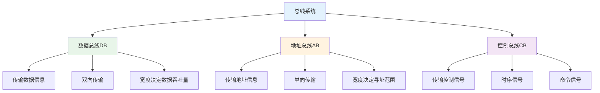

# 总线系统

## 概述

!!! note "总线"
    总线是计算机各种功能部件之间传送信息的公共通信干线,是CPU、内存、输入输出设备传递信息的公用通道。

## 总线组成



## 总线分类

### 按层次结构分类

<div style="background-color: #E3F2FD; padding: 15px; margin: 10px 0; border-left: 4px solid #2196F3; border-radius: 5px;">
    <strong>按层次分类</strong>
</div>

**1. 内部总线**

!!! tip "内部总线"
    CPU芯片内部连接各元件的总线。

**特点:**

- 速度最快
- 连接ALU、寄存器、控制器等
- 数据带宽高

**2. 系统总线**

<div style="background-color: #E8F5E9; padding: 15px; margin: 10px 0; border-left: 4px solid #4CAF50; border-radius: 5px;">
    <strong>系统总线</strong>
    <p style="margin: 5px 0;">连接CPU、存储器和各种I/O模块等主要部件。</p>
</div>

**常见标准:**

- **ISA总线**: 工业标准结构总线
- **PCI总线**: 外设部件互连标准总线
- **PCI-E总线**: PCI Express,高速串行总线

**3. 通信总线**

!!! info "通信总线"
    用于计算机系统之间或计算机与外部设备之间的通信。

**常见标准:**

- **USB**: 通用串行总线
- **RS-232**: 串行通信接口
- **IEEE 1394**: 高速串行总线

### 按功能分类

<div style="overflow-x: auto;">
    <table style="width: 100%; border-collapse: collapse; margin: 10px 0;">
        <tr style="background-color: #4CAF50; color: white;">
            <th style="padding: 10px; border: 1px solid #ddd;">总线类型</th>
            <th style="padding: 10px; border: 1px solid #ddd;">功能</th>
            <th style="padding: 10px; border: 1px solid #ddd;">特点</th>
        </tr>
        <tr>
            <td style="padding: 10px; border: 1px solid #ddd;">数据总线</td>
            <td style="padding: 10px; border: 1px solid #ddd;">传输数据</td>
            <td style="padding: 10px; border: 1px solid #ddd;">双向传输</td>
        </tr>
        <tr style="background-color: #f9f9f9;">
            <td style="padding: 10px; border: 1px solid #ddd;">地址总线</td>
            <td style="padding: 10px; border: 1px solid #ddd;">传输地址</td>
            <td style="padding: 10px; border: 1px solid #ddd;">单向传输</td>
        </tr>
        <tr>
            <td style="padding: 10px; border: 1px solid #ddd;">控制总线</td>
            <td style="padding: 10px; border: 1px solid #ddd;">传输控制信号</td>
            <td style="padding: 10px; border: 1px solid #ddd;">部分双向</td>
        </tr>
    </table>
</div>

## 总线性能指标

### 总线宽度

<div style="background-color: #FFF3E0; padding: 15px; margin: 10px 0; border-left: 4px solid #FF9800; border-radius: 5px;">
    <strong>总线宽度</strong>
    <p style="margin: 5px 0;">数据总线的位数。</p>
</div>

**常见宽度:**

- 8位、16位、32位、64位

**影响:**

- 决定一次传输的数据量
- 影响数据传输速率

### 总线频率

!!! warning "总线频率"
    总线工作的时钟频率。

**单位:** Hz(赫兹)

**常见频率:**

- 33MHz、66MHz、100MHz、133MHz

### 总线带宽

<div style="background-color: #F3E5F5; padding: 15px; margin: 10px 0; border-left: 4px solid #9C27B0; border-radius: 5px;">
    <strong>总线带宽</strong>
    <p style="margin: 5px 0;">单位时间内传输的数据量。</p>
</div>

**计算公式:**

```
总线带宽 = 总线宽度 × 总线频率 / 8
```

**示例:**

```
假设总线宽度为64位,总线频率为100MHz
总线带宽 = 64 × 100 × 10^6 / 8 = 800 MB/s
```

## 总线仲裁

!!! success "总线仲裁"
    多个主设备请求总线时,决定使用权的机制。

### 集中式仲裁

**1. 链式查询方式**

<div style="background-color: #FCE4EC; padding: 15px; margin: 10px 0; border-left: 4px solid #E91E63; border-radius: 5px;">
    <strong>链式查询</strong>
    <p style="margin: 5px 0;">总线请求信号串行通过各设备。</p>
</div>

**特点:**

- 硬件简单
- 优先级固定
- 对电路故障敏感

**2. 计数器定时查询方式**

!!! info "计数器定时查询"
    用计数器确定优先级。

**特点:**

- 优先级可变
- 灵活性好
- 控制复杂

**3. 独立请求方式**

<div style="background-color: #E0F2F1; padding: 15px; margin: 10px 0; border-left: 4px solid #00BCD4; border-radius: 5px;">
    <strong>独立请求</strong>
    <p style="margin: 5px 0;">每个设备有独立的请求和响应线。</p>
</div>

**特点:**

- 响应速度快
- 优先级灵活
- 硬件复杂

### 分布式仲裁

!!! tip "分布式仲裁"
    不需要中央仲裁器,各设备自己决定。

## 总线定时

### 同步定时

<div style="background-color: #FFF9C4; padding: 15px; margin: 10px 0; border-left: 4px solid #FFC107; border-radius: 5px;">
    <strong>同步定时</strong>
    <p style="margin: 5px 0;">使用统一时钟信号控制传输。</p>
</div>

**特点:**

- 控制简单
- 速度快
- 要求设备速度一致

### 异步定时

!!! warning "异步定时"
    使用应答信号控制传输。

**特点:**

- 灵活性好
- 适应不同速度设备
- 控制复杂

## 参考资料

- [总线 百度百科](https://baike.baidu.com/item/总线)
- [计算机总线](https://baike.baidu.com/item/计算机总线)
