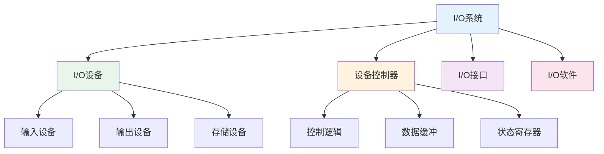
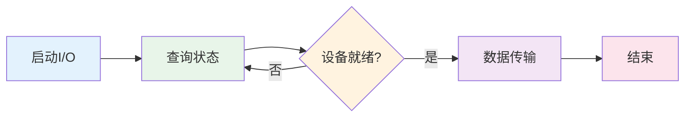
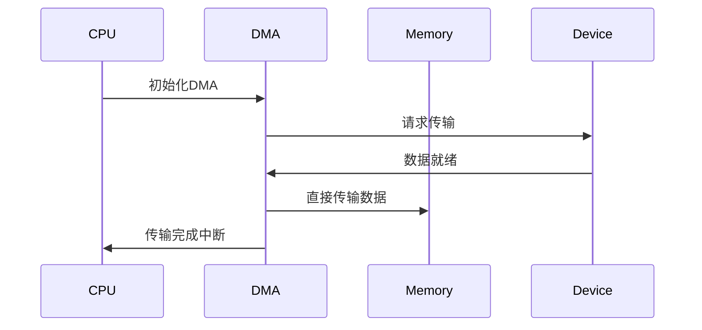

# I/O系统

## 概述

!!! note "I/O系统"
    输入输出系统是计算机系统中实现数据输入、输出和存储的子系统,包括I/O设备、设备控制器和I/O软件。

## I/O系统组成

## I/O设备分类

### 输入设备

    <strong>输入设备</strong>
    
将外部信息转换为计算机能识别的形式。

**常见设备:**

- **键盘**: 文本输入
- **鼠标**: 指针控制
- **扫描仪**: 图像输入
- **麦克风**: 音频输入
- **摄像头**: 视频输入

### 输出设备

!!! tip "输出设备"
    将计算机处理结果转换为外部形式。

**常见设备:**

- **显示器**: 图像显示
- **打印机**: 文档打印
- **音响**: 音频输出
- **投影仪**: 大屏显示

### 存储设备

    <strong>存储设备</strong>
    
用于永久存储数据的外部存储器。

**常见设备:**

- **硬盘(HDD)**: 磁盘存储
- **固态硬盘(SSD)**: 闪存存储
- **光盘**: CD、DVD、蓝光
- **U盘**: 便携式存储

## I/O控制方式

### 1. 程序查询方式

!!! info "程序查询方式"
    CPU不断查询设备状态,直到设备就绪。

**特点:**

- 实现简单
- CPU利用率低
- 适合低速设备

### 2. 程序中断方式

    <strong>程序中断方式</strong>
    
设备就绪时向CPU发出中断请求。

**中断处理过程:**

1. 设备就绪,发出中断请求
2. CPU响应中断
3. 保护现场
4. 执行中断服务程序
5. 恢复现场
6. 返回断点

**特点:**

- CPU利用率高
- 响应及时
- 适合中低速设备

### 3. DMA方式

!!! warning "DMA(直接存储器访问)"
    数据直接在内存和I/O设备间传输,无需CPU干预。

**DMA传输过程:**

**特点:**

- 传输速度快
- CPU开销小
- 适合高速块传输

### 4. 通道方式

    <strong>通道方式</strong>
    
专用I/O处理器,独立执行I/O程序。

**通道类型:**

- **字节多路通道**: 多个低速设备分时共享
- **选择通道**: 独占通道,高速设备
- **数组多路通道**: 多个高速设备分时共享

**特点:**

- CPU负担最小
- 并行处理能力强
- 适合大量I/O操作

## I/O控制方式比较

    <table style="width: 100%; border-collapse: collapse; margin: 10px 0;">
        <tr style="background-color: #4CAF50; color: white;">
            <th style="padding: 10px; border: 1px solid #ddd;">方式</th>
            <th style="padding: 10px; border: 1px solid #ddd;">CPU干预</th>
            <th style="padding: 10px; border: 1px solid #ddd;">传输速度</th>
            <th style="padding: 10px; border: 1px solid #ddd;">适用设备</th>
        </tr>
        <tr>
            <td style="padding: 10px; border: 1px solid #ddd;">程序查询</td>
            <td style="padding: 10px; border: 1px solid #ddd;">全程干预</td>
            <td style="padding: 10px; border: 1px solid #ddd;">慢</td>
            <td style="padding: 10px; border: 1px solid #ddd;">低速设备</td>
        </tr>
        <tr style="background-color: #f9f9f9;">
            <td style="padding: 10px; border: 1px solid #ddd;">程序中断</td>
            <td style="padding: 10px; border: 1px solid #ddd;">部分干预</td>
            <td style="padding: 10px; border: 1px solid #ddd;">中</td>
            <td style="padding: 10px; border: 1px solid #ddd;">中低速设备</td>
        </tr>
        <tr>
            <td style="padding: 10px; border: 1px solid #ddd;">DMA</td>
            <td style="padding: 10px; border: 1px solid #ddd;">开始和结束</td>
            <td style="padding: 10px; border: 1px solid #ddd;">快</td>
            <td style="padding: 10px; border: 1px solid #ddd;">高速块设备</td>
        </tr>
        <tr style="background-color: #f9f9f9;">
            <td style="padding: 10px; border: 1px solid #ddd;">通道</td>
            <td style="padding: 10px; border: 1px solid #ddd;">最少</td>
            <td style="padding: 10px; border: 1px solid #ddd;">最快</td>
            <td style="padding: 10px; border: 1px solid #ddd;">大量I/O</td>
        </tr>
    </table>

## I/O缓冲技术

!!! success "缓冲技术"
    在内存中开辟缓冲区,缓解CPU与I/O设备速度不匹配。

### 缓冲类型

**1. 单缓冲**

    <strong>单缓冲</strong>
    
设置一个缓冲区。

**2. 双缓冲**

!!! info "双缓冲"
    设置两个缓冲区,交替使用。

**3. 循环缓冲**

    <strong>循环缓冲</strong>
    
多个缓冲区组成循环队列。

**4. 缓冲池**

!!! tip "缓冲池"
    公用缓冲区集合,供多个进程共享。

## SPOOLing技术

    <strong>SPOOLing(假脱机)</strong>
    
利用磁盘作为缓冲,实现虚拟设备。

**组成:**

- **输入井**: 模拟脱机输入的磁盘区域
- **输出井**: 模拟脱机输出的磁盘区域
- **输入缓冲区**: 内存中的输入缓冲
- **输出缓冲区**: 内存中的输出缓冲

**优点:**

- 提高I/O速度
- 将独占设备变为共享设备
- 实现虚拟设备

## 参考资料

- [I/O系统 百度百科](https://baike.baidu.com/item/输入输出系统)
- [DMA 百度百科](https://baike.baidu.com/item/DMA)
