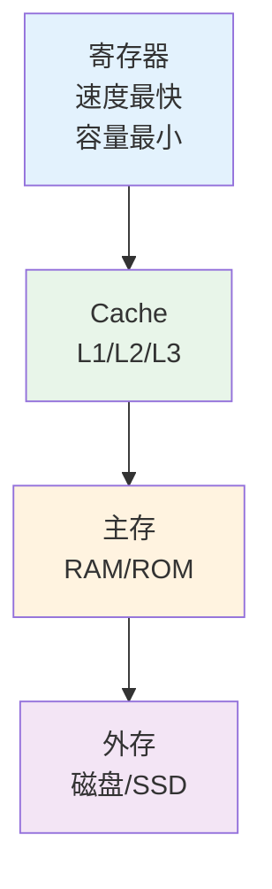

# 存储器概述

## 概述

!!! note "存储器"
    存储器是计算机系统中用于存储数据和程序的部件,是计算机的重要组成部分。

## 存储器作用

    <strong>存储器作用</strong>
    <ul style="margin: 5px 0;">
        <li>存储程序和数据</li>
        <li>实现信息的记忆功能</li>
        <li>提供写入和读出能力</li>
        <li>支持计算机的自动运行</li>
    </ul>

## 存储器分类

### 按存储介质分类

!!! tip "按介质分类"
    - **半导体存储器**: RAM、ROM、Flash
    - **磁表面存储器**: 磁盘、磁带
    - **磁芯存储器**: 早期存储器
    - **光盘存储器**: CD、DVD、蓝光

### 按存取方式分类

    <strong>按存取方式分类</strong>

- **随机存取存储器(RAM)**: 任意地址读写
- **只读存储器(ROM)**: 只能读不能写
- **顺序存取存储器(SAM)**: 磁带
- **直接存取存储器(DAM)**: 磁盘

### 按作用分类

!!! info "按作用分类"
    - **高速缓冲存储器(Cache)**: CPU内部或紧耦合
    - **主存储器**: 内存,存放正在运行的程序
    - **辅助存储器**: 外存,存放大量数据

## 存储器层次结构

## 存储器性能指标

    <strong>主要性能指标</strong>

- **存储容量**: 存储二进制信息的总量
- **存取时间**: 从启动到完成操作的时间
- **存储周期**: 连续两次操作的最小间隔
- **存储器带宽**: 单位时间传送的数据量

## 存储器原理

!!! warning "存储原理"
    - **半导体存储**: 利用触发器或电容存储
    - **磁存储**: 利用磁化方向存储
    - **光存储**: 利用凹坑和平面存储

## 参考资料

- [存储器 百度百科](https://baike.baidu.com/item/存储器)
- [计算机组成原理详细](https://blog.csdn.net/weixin_42303403/article/details/129932204)
