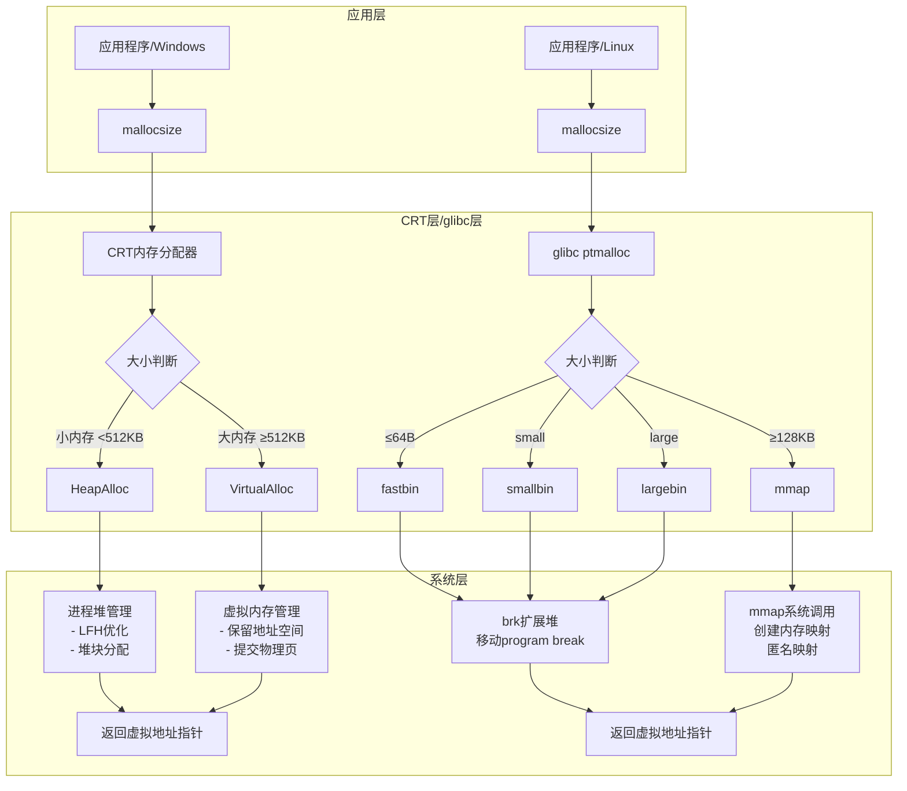

# 系统内存管理

## 一、 Windows内存管理

参考链接：

- [Windows 系统编程——内存管理](https://blog.csdn.net/charlie114514191/article/details/151953191) 
- [Windows的内存管理机制](https://blog.csdn.net/Albert_weiku/article/details/125482902) 
- [C++内存分配实例](https://blog.csdn.net/vsooda/article/details/8992446) 
- [windows内存管理操作](https://blog.csdn.net/jj6666djdbbd/article/details/127738751) 


Windows使用虚拟内存系统，每个进程都有自己独立的虚拟地址空间。在32位系统中，虚拟地址空间通常为4GB（2^32字节），其中一部分为用户空间，一部分为内核空间。在64位系统中，虚拟地址空间非常大（2^64字节），但实际使用的只是其中一部分。

### 1.1 Windows内存管理主要涉及以下几个概念：

- <span style="color:red"><b>物理内存</b></span>：插在电脑主板上的内存条。是固定的，内存条的容量有多大，内存就有多大。
- <span style="color:red"><b>虚拟内存</b></span>：每个进程的虚拟地址空间被划分成多个大小相同的块，称为页面（通常为4KB）。操作系统通过页面映射将虚拟地址映射到物理内存或磁盘上的页面文件。虚拟内存实际就是在硬盘上划分一块页面文件，充当内存。当程序在运行时，有一部分资源还没有用上或者同时打开几个程序却只操作其中一个程序时，系统没必要将程序所有的资源都塞在物理内存中，于是，系统将这些暂时不用的资源放在虚拟内存上，等到需要时在调出来用。
- <span style="color:red"><b>物理地址</b></span>：用于内存芯片级的单元寻址，与处理器和CPU连接的地址总线相对应，抛开对物理内存寻址方式的考虑，可以把物理地址看做物理内存上的地址。
- <span style="color:red"><b>逻辑地址</b></span>：由程序产生的与段相关的偏移地址部分。简单的理解，可以认为我们在程序中使用的地址，实际上是一个偏移量。
- <span style="color:red"><b>堆管理</b></span>：Windows为每个进程提供一个默认堆，并且允许创建额外的堆。堆管理器负责管理堆内的内存分配和释放。当应用程序调用malloc（C运行时库函数）时，malloc可能会从进程的堆中分配内存。
- <span style="color:red"><b>malloc的实现</b></span>：在Windows下，malloc通常是C运行时库（CRT）的一部分。CRT的malloc函数会调用Windows的堆管理函数（如HeapAlloc）来分配内存。分配的内存来自进程的堆（默认堆或特定堆）。
- <span style="color:red"><b>提交和保留</b></span>：Windows虚拟内存管理中有两个状态：保留（reserved）和提交（committed）。保留地址空间只是预留一段地址范围，并不分配物理内存或页面文件空间。提交则是将保留的地址空间与物理内存或页面文件关联起来。
- <span style="color:red"><b>页面文件</b></span>：当物理内存不足时，Windows会将不常用的内存页面写入磁盘上的页面文件，以释放物理内存。

```c
// Windows API内存管理函数
HANDLE heap = GetProcessHeap(); // 获取进程堆
LPVOID ptr = HeapAlloc(heap, 0, size); // 堆分配
LPVOID ptr = VirtualAlloc(NULL, size, MEM_COMMIT, PAGE_READWRITE); // 虚拟内存分配
BOOL success = VirtualFree(ptr, 0, MEM_RELEASE); // 释放
```

### 1.2 Windows内存查看

使用资源管理器，或者在cmd中输入：systeminfo


- <span style="color:red"><b>使用中</b></span>： 当前正在被操作系统、驱动程序、和所有正在运行的程序（进程）使用的<span style="color:red"><b>物理内存</b></span>量
- <span style="color:red"><b>可用</b></span>：直接可供程序使用的<span style="color:red"><b>物理内存</b></span>。它包括真正的**空闲内存（Free）**和**备用内存（Standby）**。
- <span style="color:red"><b>已提交</b></span>：所有进程已承诺（申请）使用的<span style="color:red"><b>虚拟内存</b></span>总量。它等于**“正在使用”的物理内存+存储在页面文件中的内存**。
- <span style="color:red"><b>已缓存</b></span>：操作系统为了提升性能而保留的<span style="color:red"><b>物理内存</b></span>。它主要就是由**备用内存（Standby）**构成，此外还包括**修改后的内存（Modified**）（即将被写入硬盘的数据）
- <span style="color:red"><b>分页缓冲池</b></span>：这是操作系统内核和设备驱动程序使用的内存区域。


## 二、Linux内存管理

### 2.1 Linux的内存管理要点

Linux同样使用虚拟内存管理，每个进程有独立的虚拟地址空间。Linux的内存管理包括以下要点：

- <span style="color:red"><b>虚拟内存</b></span>：Linux使用分页机制，将虚拟地址映射到物理内存。页面大小通常为4KB（也可以使用大页，如2MB或1GB）。
- <span style="color:red"><b>堆管理</b></span>：在Linux中，进程的堆通常是一个可动态扩展的内存区域。堆的当前边界由program break位置决定，通过brk和sbrk系统调用来调整。但是，现代的内存分配器（如ptmalloc）往往使用多种方式分配内存，对于大块内存使用mmap系统调用，而对于小块内存则使用brk扩展的堆区域。
- <span style="color:red"><b>malloc的实现</b></span>：在Linux中，malloc是C库（通常是glibc）的一部分。glibc中的malloc实现（ptmalloc）会根据分配的大小采取不同的策略：
    - 对于小块内存（一般小于128KB），ptmalloc会在堆区中分配，通过调整program break来扩展堆，或者利用已经释放的内存块。
    - 对于大块内存（通常大于128KB），ptmalloc会使用mmap系统调用分配一块独立的内存区域，这样在释放时可以直接归还给操作系统。
- <span style="color:red"><b>内存映射</b></span>：mmap系统调用可以将文件或设备映射到内存，也可以用于分配匿名内存（不关联文件），这种内存通常用于大块内存分配。
- <span style="color:red"><b>交换空间</b></span>：当物理内存不足时，Linux会将不常用的内存页面换出到交换分区（swap partition）或交换文件（swap file）中

```c
// Linux系统调用
void *ptr = mmap(NULL, size, PROT_READ|PROT_WRITE, 
                MAP_PRIVATE|MAP_ANONYMOUS, -1, 0); // 内存映射
munmap(ptr, size); // 解除映射

// brk/sbrk系统调用（现代malloc较少使用）
void *old_break = sbrk(0); // 获取当前program break
void *new_break = sbrk(size); // 移动program break
```

### 2.2 linux内存查看

在Linux系统中，有多种命令可以帮助你查看内存状态，它们各有侧重。下面这个表格汇总了常用的内存查看命令和它们的主要用途：

| 命令/文件 📝  | 主要功能🎯 | 常用示例 🔍 |
| :-- | :-- | :-- |
| `free`  | 快速查看**系统整体**内存和交换空间使用情况，简单直观。| `free -h` |
| `top` / `htop`  | **实时动态**显示系统资源使用情况，包括内存，可查看**进程级**内存占用。| `top`  或 `htop` |
| `vmstat`  | 报告进程、内存、分页、块IO、陷阱和CPU活动等**系统综合信息**。| `vmstat`  或 `vmstat -s` |
| `ps`| 查看**特定进程**的内存使用情况。| `ps aux --sort=-%mem`  或 `ps aux --sort rss`  |
| `/proc/meminfo`  | 通过文件查看**非常详细**的系统内存统计数据，是许多命令的数据来源。| `cat /proc/meminfo` |
| `lsmem` | 列出系统可用内存范围及其在线状态。                                   | `lsmem` |


## 三、Window和Linux的内存使用

### 3.1 malloc





Windows和Linux下Malloc时，内存的管理，系统层返回的是虚拟地址的指针，系统内存管理虚拟内存和物理内存之间存在映射关系。这个时候，物理内存还没有分配，只有在内存使用的时候，才会分配物理帧

### 3.2 应用程序访问内存


- Windows
	- 分配的内存初始为保留（reserved）或提交（committed）状态。
	- 首次访问时，如果页面尚未提交，会触发缺页异常，系统将物理内存映射到虚拟地址。
- Linux
	- 分配的内存初始是虚拟的，首次访问时触发缺页异常，系统分配物理页面。


### 3.3 free


实际上这里，在系统层，物理内存也不一定是立即释放，只是解除了虚拟地址空间和物理内存的映射

## 四、Windows和Linux虚拟内存与物理内存释放时机对比

### 4.1. Windows内存释放时机

#### 虚拟内存释放时机

```c
// 立即释放虚拟地址空间的情况
BOOL success = VirtualFree(ptr, 0, MEM_RELEASE);  // 立即释放虚拟地址区域

// 延迟或部分释放的情况
BOOL success = VirtualFree(ptr, size, MEM_DECOMMIT);  // 只释放物理提交，保留虚拟地址
```

**Windows虚拟内存释放场景：**
- **立即释放**: `MEM_RELEASE` 参数立即释放整个保留的虚拟地址区域
- **延迟释放**: 进程退出时自动释放所有虚拟地址空间
- **部分释放**: `MEM_DECOMMIT` 只释放物理内存提交，保留虚拟地址保留

#### 物理内存释放时机

```c
#include <windows.h>
#include <stdio.h>

void demonstrate_windows_memory_timing() {
    SIZE_T size = 100 * 1024 * 1024;  // 100MB
    
    // 1. 保留虚拟地址空间
    LPVOID ptr = VirtualAlloc(NULL, size, MEM_RESERVE, PAGE_READWRITE);
    printf("虚拟地址保留: %p\n", ptr);
    
    // 2. 提交物理内存（此时分配物理页）
    ptr = VirtualAlloc(ptr, size, MEM_COMMIT, PAGE_READWRITE);
    printf("物理内存提交完成\n");
    
    // 使用内存
    memset(ptr, 0xCC, size);
    
    // 3. 解除物理内存提交（物理内存可能立即释放）
    VirtualFree(ptr, size, MEM_DECOMMIT);
    printf("物理内存解除提交\n");
    // 此时物理页可能被回收，但虚拟地址空间仍保留
    
    // 4. 完全释放虚拟地址空间
    VirtualFree(ptr, 0, MEM_RELEASE);
    printf("虚拟地址空间完全释放\n");
}
```

**Windows物理内存释放时机：**
- **立即释放**: `MEM_DECOMMIT` 立即将物理页标记为可用
- **工作集修剪**: 系统内存压力大时自动从工作集移除物理页
- **进程退出**: 进程终止时立即释放所有物理内存
- **页面文件**: 修改的页面可能先写入页面文件再释放物理内存

### 4.2. Linux内存释放时机

#### 虚拟内存释放时机

```c
// 立即释放虚拟地址空间
int result = munmap(ptr, size);  // 立即从进程地址空间移除映射

// brk收缩虚拟地址空间
void* new_break = brk(old_break);  // 收缩堆顶，释放虚拟地址空间
```

**Linux虚拟内存释放场景：**
- **立即释放**: `munmap` 立即从页表移除映射，虚拟地址空间立即可重用
- **堆收缩**: `brk` 系统调用收缩program break释放堆顶虚拟空间
- **进程退出**: 进程终止时立即释放整个虚拟地址空间

#### 物理内存释放时机

```c
#include <stdio.h>
#include <stdlib.h>
#include <sys/mman.h>
#include <unistd.h>
#include <string.h>

void demonstrate_linux_memory_timing() {
    size_t size = 100 * 1024 * 1024;  // 100MB
    
    // 1. 映射虚拟内存（延迟物理分配）
    void* ptr = mmap(NULL, size, PROT_READ|PROT_WRITE, 
                    MAP_PRIVATE|MAP_ANONYMOUS, -1, 0);
    printf("虚拟内存映射: %p\n", ptr);
    
    // 2. 首次访问触发物理页分配
    memset(ptr, 0xAA, size);
    printf("物理内存实际分配完成\n");
    
    // 3. 解除映射（物理内存可能延迟释放）
    munmap(ptr, size);
    printf("虚拟内存解除映射\n");
    // 物理页可能仍在缓存中，直到系统需要内存时才真正回收
}

// 使用madvise主动控制物理内存释放
void proactive_memory_release() {
    size_t size = 100 * 1024 * 1024;
    void* ptr = mmap(NULL, size, PROT_READ|PROT_WRITE, 
                    MAP_PRIVATE|MAP_ANONYMOUS, -1, 0);
    
    memset(ptr, 0xBB, size);
    
    // 主动建议内核立即释放物理内存
    madvise(ptr, size, MADV_DONTNEED);
    printf("建议内核释放物理内存\n");
    
    // 但虚拟地址空间仍然有效，下次访问会重新分配零页
    munmap(ptr, size);
}
```

**Linux物理内存释放时机：**
- **延迟释放**: `munmap` 后物理页可能保持在页面缓存中
- **内存压力释放**: 当系统内存不足时通过kswapd回收
- **主动释放**: `madvise(MADV_DONTNEED)` 立即释放物理页
- **进程退出**: 进程终止时立即释放所有私有物理内存

### 4.3. 关键差异对比表

| 释放类型 | Windows时机 | Linux时机 |
|---------|-------------|-----------|
| **虚拟内存立即释放** | `VirtualFree(ptr, 0, MEM_RELEASE)` | `munmap(ptr, size)` |
| **虚拟内存部分释放** | `VirtualFree(ptr, size, MEM_DECOMMIT)` | `brk`收缩堆 |
| **物理内存立即释放** | `MEM_DECOMMIT`立即标记可用 | `madvise(MADV_DONTNEED)` |
| **物理内存延迟释放** | 工作集自动管理 | `munmap`后可能延迟到内存压力 |
| **共享内存释放** | 引用计数为0时释放 | 所有进程munmap后释放 |
| **进程退出释放** | 立即完全释放 | 立即完全释放 |

### 4.4. 实际内存监控示例

#### Windows内存状态监控

```c
#include <windows.h>
#include <psapi.h>

void monitor_windows_memory() {
    PROCESS_MEMORY_COUNTERS pmc;
    GetProcessMemoryInfo(GetCurrentProcess(), &pmc, sizeof(pmc));
    
    printf("工作集大小: %zu KB\n", pmc.WorkingSetSize / 1024);
    printf("提交大小: %zu KB\n", pmc.PagefileUsage / 1024);
    printf("虚拟内存峰值: %zu KB\n", pmc.PeakWorkingSetSize / 1024);
    
    MEMORY_BASIC_INFORMATION mbi;
    VirtualQuery(NULL, &mbi, sizeof(mbi));
    printf("区域状态: %s\n", 
           mbi.State == MEM_FREE ? "FREE" : 
           mbi.State == MEM_RESERVE ? "RESERVE" : "COMMIT");
}
```

#### Linux内存状态监控

```c
#include <stdio.h>
#include <stdlib.h>

void monitor_linux_memory() {
    // 查看进程内存统计
    system("cat /proc/self/status | grep -E 'VmSize|VmRSS|VmData'");
    
    // 查看系统内存压力
    system("cat /proc/meminfo | grep -E 'MemFree|MemAvailable|SwapFree'");
    
    // 查看页面回收统计
    system("grep -E 'pgfree|pgsteal' /proc/vmstat");
}
```

### 4.5. 内存释放策略建议

#### Windows优化建议

```c
// 对于临时大内存，及时DECOMMIT物理内存
void* temp_buffer = VirtualAlloc(NULL, LARGE_SIZE, MEM_RESERVE|MEM_COMMIT, PAGE_READWRITE);
// 使用temp_buffer...
VirtualFree(temp_buffer, LARGE_SIZE, MEM_DECOMMIT);  // 立即释放物理内存
// 虚拟地址空间仍然保留，可以快速重新COMMIT
// 最终释放:
VirtualFree(temp_buffer, 0, MEM_RELEASE);
```

#### Linux优化建议

```c
// 对于不再需要的大内存，主动释放物理内存
void* temp_buffer = mmap(NULL, LARGE_SIZE, PROT_READ|PROT_WRITE, 
                        MAP_PRIVATE|MAP_ANONYMOUS, -1, 0);
// 使用temp_buffer...
madvise(temp_buffer, LARGE_SIZE, MADV_DONTNEED);  // 主动释放物理页
// 或者直接解除映射:
munmap(temp_buffer, LARGE_SIZE);
```
