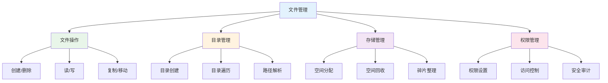

# 文件管理

## 概述

!!! note "文件管理"
    文件管理是操作系统的重要功能,负责文件的创建、删除、读写、组织和保护等操作。

## 文件管理功能

## 文件管理目标

    <strong>管理目标</strong>
    <ul style="margin: 5px 0;">
        <li><strong>方便性</strong>: 用户方便地使用文件</li>
        <li><strong>安全性</strong>: 保护文件不被破坏</li>
        <li><strong>共享性</strong>: 实现文件共享</li>
        <li><strong>效率性</strong>: 提高文件操作效率</li>
    </ul>

## 文件管理层次

### 用户接口层

!!! tip "用户接口层"
    提供文件操作的命令和系统调用。

- 命令行接口: ls, cp, mv, rm等
- 图形界面: 文件管理器
- 系统调用: open, read, write, close等

### 文件系统层

    <strong>文件系统层</strong>
    
实现文件系统的逻辑功能。

- 文件组织
- 目录管理
- 文件定位

### 设备驱动层

!!! info "设备驱动层"
    与物理设备交互,实现数据传输。

## 文件管理数据结构

### 文件控制块(FCB)

    <strong>FCB内容</strong>

- 基本信息: 文件名、文件类型
- 存储信息: 物理位置、文件大小
- 使用信息: 创建时间、修改时间
- 保护信息: 访问权限、文件主

### 目录项

!!! warning "目录项"
    目录中的文件描述信息。

- 文件名
- FCB指针或inode号

### 打开文件表

    <strong>打开文件表</strong>
    
记录所有打开的文件信息。

## 参考资料

- [文件管理 百度百科](https://baike.baidu.com/item/文件管理)
- [计算机组成原理详细](https://blog.csdn.net/weixin_42303403/article/details/129932204)
