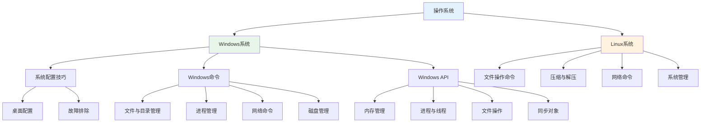

# 操作系统

## 概述

!!! note "操作系统"
    操作系统是管理计算机硬件和软件资源的系统软件，是计算机系统的核心。本文档涵盖Windows和Linux两大主流操作系统的使用和管理。

## 知识体系结构

## 主要内容

### Windows系统

    <strong>Windows系统</strong>
    <ul style="margin: 5px 0;">
        <li><strong>系统配置技巧</strong>: 桌面设置、系统优化、故障排除（10篇）</li>
        <li><strong>Windows命令</strong>: 文件管理、进程管理、网络命令、系统信息等（9篇）</li>
        <li><strong>Windows API</strong>: 内存管理、进程线程、文件操作、同步对象等（9篇）</li>
    </ul>

### Linux系统

    <strong>Linux系统</strong>
    <ul style="margin: 5px 0;">
        <li><strong>文件操作命令</strong>: grep、rsync、sed、sync、diff、cp、setfacl（7篇）</li>
        <li><strong>压缩与解压命令</strong>: tar、zip（2篇）</li>
        <li><strong>网络命令</strong>: curl、IP命令、nslookup、tcpdump、进程端口（10+篇）</li>
        <li><strong>系统管理</strong>: 权限管理、资源调度、证书管理（5篇）</li>
    </ul>

## 学习路径

!!! info "推荐学习路径"
    1. Windows系统配置技巧 → Windows命令行
    2. Windows命令行 → Windows API编程
    3. Linux命令基础 → Linux系统管理
    4. 进程管理 → 内存管理 → 文件操作
    5. 同步对象 → 进程间通信

## 目录

### Windows系统

- [Windows系统](010-Windows系统/000_导读.md)
    - [001-mstsc副屏全屏显示](010-Windows系统/001-mstsc副屏全屏显示.md)
    - [002-右键菜单添加新建记事本](010-Windows系统/002-右键菜单添加新建记事本.md)
    - [003-windows常用cmd命令](010-Windows系统/003-windows常用cmd命令.md)
    - [004-让任务栏在屏幕左侧变窄](010-Windows系统/004-让任务栏在屏幕左侧变窄.md)
    - [005-鼠标飘的解决办法](010-Windows系统/005-鼠标飘的解决办法.md)
    - [006-鼠标右键菜单排序](010-Windows系统/006-鼠标右键菜单排序.md)
    - [007-windows.edb文件](010-Windows系统/007-windows.edb文件.md)
    - [008-找到文件被哪个进程引用](010-Windows系统/008-找到文件被哪个进程引用.md)
    - [009-Win11修改bat默认打开方式](010-Windows系统/009-Win11修改bat默认打开方式.md)
    - [010-win11上临时文件清理](010-Windows系统/010-win11上临时文件清理.md)
    - **Windows命令**
        - [文件与目录管理](010-Windows系统/100-Windows命令/010-文件与目录管理.md)
        - [进程管理](010-Windows系统/100-Windows命令/020-进程管理.md)
        - [服务管理](010-Windows系统/100-Windows命令/030-服务管理.md)
        - [网络命令](010-Windows系统/100-Windows命令/040-网络命令.md)
        - [系统信息](010-Windows系统/100-Windows命令/050-系统信息.md)
        - [磁盘管理](010-Windows系统/100-Windows命令/060-磁盘管理.md)
        - [注册表操作](010-Windows系统/100-Windows命令/070-注册表操作.md)
        - [性能监控](010-Windows系统/100-Windows命令/080-性能监控.md)
        - [计划任务](010-Windows系统/100-Windows命令/090-计划任务.md)
    - **Windows API**
        - [内存管理API](010-Windows系统/101-Windows%20API/010-内存管理API.md)
        - [进程管理API](010-Windows系统/101-Windows%20API/020-进程管理API.md)
        - [线程管理API](010-Windows系统/101-Windows%20API/030-线程管理API.md)
        - [文件操作API](010-Windows系统/101-Windows%20API/040-文件操作API.md)
        - [同步对象API](010-Windows系统/101-Windows%20API/050-同步对象API.md)
        - [DLL操作API](010-Windows系统/101-Windows%20API/060-DLL操作API.md)
        - [注册表操作API](010-Windows系统/101-Windows%20API/070-注册表操作API.md)
        - [进程间通信API](010-Windows系统/101-Windows%20API/080-进程间通信API.md)
        - [错误处理API](010-Windows系统/101-Windows%20API/090-错误处理API.md)

### Linux系统

- [Linux系统](020-Linux系统/000_导读.md)
    - [001-Linux系统ErrorID含义](020-Linux系统/001-Linux系统ErrorID含义.md)
    - [002-Linux文件权限解读](020-Linux系统/002-Linux文件权限解读.md)
    - [003-OpenSSL生成证书步骤](020-Linux系统/003-OpenSSL生成证书步骤.md)
    - [004-zypper命令帮助](020-Linux系统/004-zypper命令帮助.md)
    - [005-Linux资源调度](020-Linux系统/005-Linux资源调度.md)
    - **文件操作命令**
        - [grep命令](020-Linux系统/010_文件操作命令/001-grep命令.md)
        - [rsync命令](020-Linux系统/010_文件操作命令/002-rsync命令.md)
        - [sed命令](020-Linux系统/010_文件操作命令/003-sed命令.md)
        - [sync命令](020-Linux系统/010_文件操作命令/004-sync命令.md)
        - [diff命令](020-Linux系统/010_文件操作命令/005-diff命令文件比较.md)
        - [cp复制命令](020-Linux系统/010_文件操作命令/006-cp复制命令.md)
        - [setfacl命令](020-Linux系统/010_文件操作命令/007-setfacl设置文件访问控制列表.md)
    - **压缩与解压命令**
        - [tar命令](020-Linux系统/020_压缩与解压命令/001-tar命令.md)
        - [zip命令](020-Linux系统/020_压缩与解压命令/002-zip命令.md)
    - **网络命令**
        - [nslookup命令](020-Linux系统/030_网络命令/001-nslookup命令详解.md)
        - [tcpdump命令](020-Linux系统/030_网络命令/002-tcpdump命令.md)
        - curl命令系列
        - IP命令系列
        - 进程端口命令系列

## 统计

| 模块 | 文档数量 |
|------|----------|
| Windows系统配置 | 10篇 |
| Windows命令 | 9篇 |
| Windows API | 9篇 |
| Linux系统管理 | 5篇 |
| Linux文件命令 | 7篇 |
| Linux压缩命令 | 2篇 |
| Linux网络命令 | 15+篇 |
| **总计** | **57+篇** |

## 参考资料

- [操作系统原理 - 百度百科](https://baike.baidu.com/item/操作系统)
- [Windows文档 - Microsoft Docs](https://docs.microsoft.com/zh-cn/windows/)
- [Linux文档 - Linux Documentation](https://www.kernel.org/doc/)
