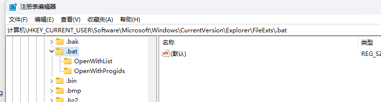
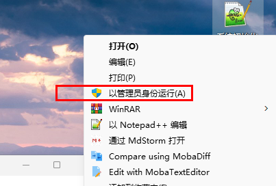

# Windows11 环境，bat文件默认打开方式修改

[参考 https://blog.csdn.net/wang5g/article/details/124389312](https://blog.csdn.net/wang5g/article/details/124389312)

Windows11安装了Notepad++之后，发现bat文件右键中没有以管理员身份运行的选项。

修改注册表: 计算机\HKEY_CURRENT_USER\Software\Microsoft\Windows\CurrentVersion\Explorer\FileExts\.bat

删除多余的与Notepad++相关的描述项

