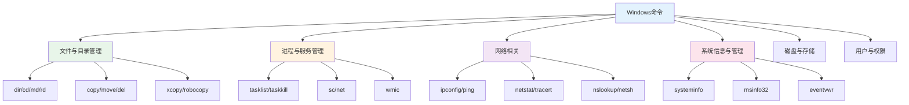

# Windows命令行

## 概述

Windows命令行是Windows操作系统提供的文本界面工具，用于执行系统命令、管理文件、配置系统、诊断问题等。主要包括CMD（命令提示符）和PowerShell两种。

!!! note "命令行工具"
    - **CMD**：传统命令提示符，兼容DOS命令
    - **PowerShell**：现代命令行工具，支持脚本编程和对象管道

## 命令分类

## 主要内容

### 文件与目录管理

    <strong>文件与目录管理命令</strong>
    <ul style="margin: 5px 0;">
        <li><strong>dir</strong>: 列出目录内容</li>
        <li><strong>cd</strong>: 切换目录</li>
        <li><strong>md/mkdir</strong>: 创建目录</li>
        <li><strong>rd/rmdir</strong>: 删除目录</li>
        <li><strong>copy</strong>: 复制文件</li>
        <li><strong>move</strong>: 移动文件</li>
        <li><strong>del</strong>: 删除文件</li>
        <li><strong>xcopy</strong>: 高级复制</li>
        <li><strong>robocopy</strong>: 强大的文件复制工具</li>
    </ul>

### 进程与服务管理

    <strong>进程与服务管理命令</strong>
    <ul style="margin: 5px 0;">
        <li><strong>tasklist</strong>: 显示进程列表</li>
        <li><strong>taskkill</strong>: 终止进程</li>
        <li><strong>sc</strong>: 服务控制管理</li>
        <li><strong>net start/stop</strong>: 启动/停止服务</li>
        <li><strong>wmic</strong>: Windows管理规范命令行</li>
    </ul>

### 网络相关命令

    <strong>网络命令</strong>
    <ul style="margin: 5px 0;">
        <li><strong>ipconfig</strong>: IP配置信息</li>
        <li><strong>ping</strong>: 网络连通性测试</li>
        <li><strong>netstat</strong>: 网络连接统计</li>
        <li><strong>tracert</strong>: 路由跟踪</li>
        <li><strong>nslookup</strong>: DNS查询</li>
        <li><strong>netsh</strong>: 网络外壳配置</li>
    </ul>

### 系统信息与管理

    <strong>系统信息命令</strong>
    <ul style="margin: 5px 0;">
        <li><strong>systeminfo</strong>: 系统详细信息</li>
        <li><strong>msinfo32</strong>: 系统信息工具</li>
        <li><strong>hostname</strong>: 显示主机名</li>
        <li><strong>whoami</strong>: 当前用户信息</li>
        <li><strong>set</strong>: 显示环境变量</li>
    </ul>

## 目录

### 文件与目录管理
- [文件与目录管理命令](./010-文件与目录管理.md)

### 进程与服务管理
- [进程管理命令](./020-进程管理.md)
- [服务管理命令](./030-服务管理.md)

### 网络相关
- [网络命令](./040-网络命令.md)

### 系统信息与管理
- [系统信息命令](./050-系统信息.md)

### 磁盘与存储
- [磁盘管理命令](./060-磁盘管理.md)

## 快速参考

### 最常用命令

| 命令 | 说明 | 示例 |
|------|------|------|
| `dir` | 列出目录 | `dir C:\Windows` |
| `cd` | 切换目录 | `cd C:\Users` |
| `tasklist` | 查看进程 | `tasklist \| findstr chrome` |
| `taskkill` | 结束进程 | `taskkill /PID 1234 /F` |
| `ipconfig` | IP配置 | `ipconfig /all` |
| `ping` | 测试连接 | `ping www.baidu.com` |
| `netstat` | 网络状态 | `netstat -ano` |

## 参考资料

- [Windows命令行参考 - Microsoft Docs](https://docs.microsoft.com/zh-cn/windows-server/administration/windows-commands/windows-commands)
- [PowerShell文档 - Microsoft Docs](https://docs.microsoft.com/zh-cn/powershell/)
