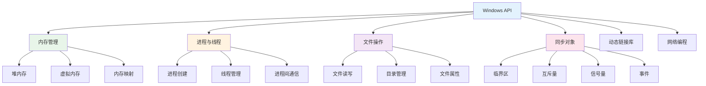

# Windows API

## 概述

Windows API（Win32 API）是Windows操作系统提供的应用程序编程接口，用于开发Windows应用程序。本文档重点介绍系统编程中常用的API，特别是内存管理、进程与线程管理、文件操作等核心功能。

!!! note "Windows API分类"
    - **基础服务API**：文件系统、设备管理、进程线程、内存管理
    - **图形设备接口(GDI)**：图形绘制、设备上下文
    - **用户界面API**：窗口管理、消息处理、控件
    - **网络API**：Winsock、WinINet
    - **安全API**：认证、加密、访问控制

## API分类



## 主要内容

### 内存管理API

<div style="background-color: #E8F5E9; padding: 15px; margin: 10px 0; border-left: 4px solid #4CAF50; border-radius: 5px;">
    <strong>内存管理API</strong>
    <ul style="margin: 5px 0;">
        <li><strong>GlobalAlloc/LocalAlloc</strong>: 全局/局部内存分配</li>
        <li><strong>HeapCreate/HeapAlloc</strong>: 堆内存管理</li>
        <li><strong>VirtualAlloc/VirtualFree</strong>: 虚拟内存管理</li>
        <li><strong>CreateFileMapping</strong>: 内存映射文件</li>
        <li><strong>HeapWalk</strong>: 堆遍历</li>
    </ul>
</div>

### 进程与线程API

<div style="background-color: #FFF3E0; padding: 15px; margin: 10px 0; border-left: 4px solid #FF9800; border-radius: 5px;">
    <strong>进程与线程API</strong>
    <ul style="margin: 5px 0;">
        <li><strong>CreateProcess</strong>: 创建新进程</li>
        <li><strong>CreateThread</strong>: 创建线程</li>
        <li><strong>OpenProcess/OpenThread</strong>: 打开现有进程/线程</li>
        <li><strong>TerminateProcess/TerminateThread</strong>: 终止进程/线程</li>
        <li><strong>WaitForSingleObject</strong>: 等待对象</li>
    </ul>
</div>

### 文件操作API

<div style="background-color: #F3E5F5; padding: 15px; margin: 10px 0; border-left: 4px solid #9C27B0; border-radius: 5px;">
    <strong>文件操作API</strong>
    <ul style="margin: 5px 0;">
        <li><strong>CreateFile</strong>: 创建或打开文件</li>
        <li><strong>ReadFile/WriteFile</strong>: 文件读写</li>
        <li><strong>SetFilePointer</strong>: 设置文件指针</li>
        <li><strong>GetFileSize</strong>: 获取文件大小</li>
        <li><strong>CreateDirectory</strong>: 创建目录</li>
    </ul>
</div>

### 同步对象API

<div style="background-color: #FCE4EC; padding: 15px; margin: 10px 0; border-left: 4px solid #E91E63; border-radius: 5px;">
    <strong>同步对象API</strong>
    <ul style="margin: 5px 0;">
        <li><strong>CreateMutex</strong>: 创建互斥量</li>
        <li><strong>CreateSemaphore</strong>: 创建信号量</li>
        <li><strong>CreateEvent</strong>: 创建事件对象</li>
        <li><strong>InitializeCriticalSection</strong>: 初始化临界区</li>
        <li><strong>EnterCriticalSection</strong>: 进入临界区</li>
    </ul>
</div>

## 目录

### 内存管理
- [内存管理API](./010-内存管理API.md)

### 进程与线程
- [进程管理API](./020-进程管理API.md)
- [线程管理API](./030-线程管理API.md)

### 文件操作
- [文件操作API](./040-文件操作API.md)

### 同步对象
- [同步对象API](./050-同步对象API.md)

### 动态链接库
- [DLL操作API](./060-DLL操作API.md)

## 常用头文件

| 头文件 | 说明 |
|--------|------|
| `windows.h` | Windows核心API（包含大部分API） |
| `winbase.h` | 基本服务API（进程、内存、文件等） |
| `windef.h` | 基本类型定义 |
| `winnt.h` | NT内核相关定义 |
| `winuser.h` | 用户界面API |
| `wingdi.h` | 图形设备接口API |
| `winsock2.h` | Winsock网络API |

## 数据类型

### 基本类型

| 类型 | 说明 | 对应C类型 |
|------|------|-----------|
| `BOOL` | 布尔值 | int |
| `BYTE` | 字节 | unsigned char |
| `WORD` | 字 | unsigned short |
| `DWORD` | 双字 | unsigned long |
| `UINT` | 无符号整数 | unsigned int |
| `LONG` | 长整数 | long |
| `LONGLONG` | 64位整数 | __int64 |
| `FLOAT` | 浮点数 | float |
| `DOUBLE` | 双精度浮点 | double |

### 指针类型

| 类型 | 说明 |
|------|------|
| `LPVOID` | 无类型指针（void*） |
| `LPSTR` | 字符串指针（char*） |
| `LPCSTR` | 常量字符串指针（const char*） |
| `LPWSTR` | 宽字符串指针（wchar_t*） |
| `LPCWSTR` | 常量宽字符串指针 |
| `HANDLE` | 对象句柄 |
| `HWND` | 窗口句柄 |

### 句柄类型

| 类型 | 说明 |
|------|------|
| `HANDLE` | 通用对象句柄 |
| `HWND` | 窗口句柄 |
| `HINSTANCE` | 实例句柄 |
| `HMODULE` | 模块句柄 |
| `HFILE` | 文件句柄 |
| `HPROCESS` | 进程句柄 |
| `HTHREAD` | 线程句柄 |
| `HEAP` | 堆句柄 |

## 错误处理

### GetLastError

```cpp
DWORD GetLastError();  // 获取最后一个错误代码
```

### FormatMessage

```cpp
DWORD FormatMessage(
    DWORD   dwFlags,      // 格式化选项
    LPCVOID lpSource,     // 消息定义源
    DWORD   dwMessageId,  // 消息标识符
    DWORD   dwLanguageId, // 语言标识符
    LPTSTR  lpBuffer,     // 输出缓冲区
    DWORD   nSize,        // 缓冲区大小
    va_list *Arguments    // 插入参数
);
```

**示例**：
```cpp
// 获取并显示错误信息
LPVOID lpMsgBuf;
DWORD dw = GetLastError(); 

FormatMessage(
    FORMAT_MESSAGE_ALLOCATE_BUFFER | 
    FORMAT_MESSAGE_FROM_SYSTEM |
    FORMAT_MESSAGE_IGNORE_INSERTS,
    NULL,
    dw,
    MAKELANGID(LANG_NEUTRAL, SUBLANG_DEFAULT),
    (LPTSTR) &lpMsgBuf,
    0, NULL );

printf("Error %d: %s\n", dw, (LPCTSTR)lpMsgBuf);
LocalFree(lpMsgBuf);
```

## 常见错误码

| 错误码 | 值 | 说明 |
|--------|------|------|
| `ERROR_SUCCESS` | 0 | 操作成功 |
| `ERROR_INVALID_FUNCTION` | 1 | 函数不正确 |
| `ERROR_FILE_NOT_FOUND` | 2 | 系统找不到指定的文件 |
| `ERROR_PATH_NOT_FOUND` | 3 | 系统找不到指定的路径 |
| `ERROR_ACCESS_DENIED` | 5 | 拒绝访问 |
| `ERROR_INVALID_HANDLE` | 6 | 句柄无效 |
| `ERROR_NOT_ENOUGH_MEMORY` | 8 | 存储空间不足 |
| `ERROR_SHARING_VIOLATION` | 32 | 共享冲突 |
| `ERROR_ALREADY_EXISTS` | 183 | 文件已存在 |

## 实用宏

### 句柄验证

```cpp
#define INVALID_HANDLE_VALUE ((HANDLE)(LONG_PTR)-1)  // 无效句柄值
#define NULL ((void *)0)                             // 空指针
```

### MAKEWORD/MAKELONG

```cpp
WORD MAKEWORD(BYTE low, BYTE high);
DWORD MAKELONG(WORD low, WORD high);
DWORD MAKELPARAM(WORD low, WORD high);
DWORD MAKELRESULT(WORD low, WORD high);
```

### LOWORD/HIWORD

```cpp
WORD LOWORD(DWORD dwValue);   // 取低字
WORD HIWORD(DWORD dwValue);   // 取高字
BYTE LOBYTE(WORD wValue);     // 取低字节
BYTE HIBYTE(WORD wValue);     // 取高字节
```

## 字符集处理

### Unicode与ANSI

Windows API函数通常有两个版本：
- `FunctionNameA`：ANSI版本
- `FunctionNameW`：宽字符（Unicode）版本

**示例**：
```cpp
// ANSI版本
BOOL CreateDirectoryA(LPCSTR lpPathName, LPSECURITY_ATTRIBUTES lpSecurityAttributes);

// Unicode版本
BOOL CreateDirectoryW(LPCWSTR lpPathName, LPSECURITY_ATTRIBUTES lpSecurityAttributes);

// 根据UNICODE宏自动选择
#ifdef UNICODE
#define CreateDirectory CreateDirectoryW
#else
#define CreateDirectory CreateDirectoryA
#endif
```

### TCHAR类型

```cpp
#ifdef UNICODE
typedef wchar_t TCHAR;
typedef LPWSTR LPTSTR;
typedef LPCWSTR LPCTSTR;
#else
typedef char TCHAR;
typedef LPSTR LPTSTR;
typedef LPCSTR LPCTSTR;
#endif
```

**使用示例**：
```cpp
TCHAR szBuffer[256];
_tcscpy_s(szBuffer, _T("Hello World"));  // 自动适配字符集
```

## 参考资料

- [Windows API索引 - Microsoft Docs](https://docs.microsoft.com/zh-cn/windows/win32/apiindex/windows-api-list)
- [Windows数据类型 - Microsoft Docs](https://docs.microsoft.com/zh-cn/windows/win32/winprog/windows-data-types)
- [GetLastError函数 - Microsoft Docs](https://docs.microsoft.com/zh-cn/windows/win32/api/errhandlingapi/nf-errhandlingapi-getlasterror)
- [Windows系统错误码 - Microsoft Docs](https://docs.microsoft.com/zh-cn/windows/win32/debug/system-error-codes)
