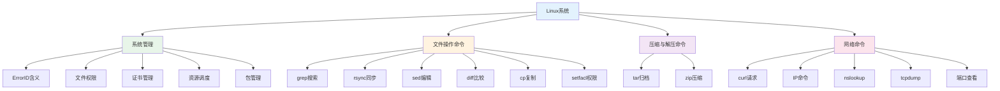

# Linux系统

## 概述

!!! note "Linux系统"
    Linux是一种开源的类Unix操作系统，广泛应用于服务器、嵌入式设备和个人电脑。本文档涵盖Linux系统管理、文件操作、网络配置等核心内容。

## 知识体系结构

## 主要内容

### 系统管理

    <strong>系统管理</strong>
    <ul style="margin: 5px 0;">
        <li><strong>ErrorID含义</strong>: Linux系统错误码解释</li>
        <li><strong>文件权限</strong>: 文件权限解读与设置</li>
        <li><strong>证书管理</strong>: OpenSSL生成证书步骤</li>
        <li><strong>资源调度</strong>: 系统资源调度管理</li>
        <li><strong>包管理</strong>: zypper等包管理工具</li>
    </ul>

### 文件操作命令

    <strong>文件操作命令</strong>
    <ul style="margin: 5px 0;">
        <li><strong>grep</strong>: 文本搜索工具</li>
        <li><strong>rsync</strong>: 文件同步工具</li>
        <li><strong>sed</strong>: 流编辑器</li>
        <li><strong>sync</strong>: 文件系统同步</li>
        <li><strong>diff</strong>: 文件比较工具</li>
        <li><strong>cp</strong>: 文件复制命令</li>
        <li><strong>setfacl</strong>: 设置文件访问控制列表</li>
    </ul>

### 压缩与解压命令

    <strong>压缩与解压命令</strong>
    <ul style="margin: 5px 0;">
        <li><strong>tar</strong>: 归档打包工具</li>
        <li><strong>zip</strong>: ZIP压缩工具</li>
    </ul>

### 网络命令

    <strong>网络命令</strong>
    <ul style="margin: 5px 0;">
        <li><strong>curl</strong>: HTTP请求工具（参数、实例、错误码）</li>
        <li><strong>ip</strong>: 网络配置命令（link、address、route、rule）</li>
        <li><strong>nslookup</strong>: DNS查询工具</li>
        <li><strong>tcpdump</strong>: 网络抓包工具</li>
        <li><strong>进程端口</strong>: fuser、lsof、netstat、ss</li>
    </ul>

## 目录

### 系统管理

- [001-Linux系统ErrorID含义](001-Linux系统ErrorID含义.md)
- [002-Linux文件权限解读](002-Linux文件权限解读.md)
- [003-OpenSSL生成证书步骤](003-OpenSSL生成证书步骤.md)
- [004-zypper命令帮助](004-zypper命令帮助.md)
- [005-Linux资源调度](005-Linux资源调度.md)

### 文件操作命令

- [001-grep命令](010_文件操作命令/001-grep命令.md)
- [002-rsync命令](010_文件操作命令/002-rsync命令.md)
- [003-sed命令](010_文件操作命令/003-sed命令.md)
- [004-sync命令](010_文件操作命令/004-sync命令.md)
- [005-diff命令文件比较](010_文件操作命令/005-diff命令文件比较.md)
- [006-cp复制命令](010_文件操作命令/006-cp复制命令.md)
- [007-setfacl设置文件访问控制列表](010_文件操作命令/007-setfacl设置文件访问控制列表.md)

### 压缩与解压命令

- [001-tar命令](020_压缩与解压命令/001-tar命令.md)
- [002-zip命令](020_压缩与解压命令/002-zip命令.md)

### 网络命令

- [001-nslookup命令详解](030_网络命令/001-nslookup命令详解.md)
- [002-tcpdump命令](030_网络命令/002-tcpdump命令.md)

#### curl命令

- [001-curl命令参数](030_网络命令/010_curl命令/001-curl命令参数.md)
- [002-curl常用实例](030_网络命令/010_curl命令/002-curl常用实例.md)
- [003-curl错误码解释](030_网络命令/010_curl命令/003-curl错误码解释.md)

#### IP命令

- [001-ip命令格式详解](030_网络命令/020_IP命令详解/001-ip命令格式详解.md)
- [002-ip-link命令详解](030_网络命令/020_IP命令详解/002-ip-link命令详解.md)
- [003-ip-address命令详解](030_网络命令/020_IP命令详解/003-ip-address命令详解.md)
- [004-ip-route命令详解](030_网络命令/020_IP命令详解/004-ip-route命令详解.md)
- [005-ip-rule命令详解](030_网络命令/020_IP命令详解/005-ip-rule命令详解.md)

#### 进程端口相关

- [001-fuser命令](030_网络命令/030_进程端口相关/001-fuser命令.md)
- [002-lsof命令](030_网络命令/030_进程端口相关/002-lsof命令.md)
- [003-netstat命令详解](030_网络命令/030_进程端口相关/003-netstat命令详解.md)
- [004-ss命令](030_网络命令/030_进程端口相关/004-ss命令.md)

## 常用命令速查

### 文件操作

| 命令 | 说明 | 示例 |
|------|------|------|
| `grep` | 文本搜索 | `grep "error" /var/log/syslog` |
| `rsync` | 文件同步 | `rsync -avz src/ dest/` |
| `sed` | 流编辑 | `sed 's/old/new/g' file` |
| `diff` | 文件比较 | `diff file1 file2` |
| `cp` | 复制 | `cp -r dir1 dir2` |

### 压缩解压

| 命令 | 说明 | 示例 |
|------|------|------|
| `tar` | 归档 | `tar -czvf archive.tar.gz dir/` |
| `zip` | 压缩 | `zip -r archive.zip dir/` |

### 网络

| 命令 | 说明 | 示例 |
|------|------|------|
| `curl` | HTTP请求 | `curl http://example.com` |
| `ip` | 网络配置 | `ip addr show` |
| `nslookup` | DNS查询 | `nslookup example.com` |
| `netstat` | 端口查看 | `netstat -tulpn` |
| `ss` | Socket统计 | `ss -tulpn` |
| `lsof` | 打开文件 | `lsof -i :80` |
| `fuser` | 端口占用 | `fuser 80/tcp` |

## 统计

| 分类 | 文档数量 |
|------|----------|
| 系统管理 | 5篇 |
| 文件操作命令 | 7篇 |
| 压缩与解压命令 | 2篇 |
| 网络命令 | 11篇 |
| **总计** | **25篇** |

## 参考资料

- [Linux命令大全](https://www.linuxcool.com/)
- [Linux man pages](https://man7.org/linux/man-pages/)
- [Linux文档项目](https://www.tldp.org/)
- [Ubuntu文档](https://help.ubuntu.com/)
