# 嵌入式系统

## 概述

!!! note "嵌入式系统"
    嵌入式系统是专门用于控制、监视或辅助操作机器和设备的计算机系统。本文档涵盖嵌入式Linux开发、实时操作系统、硬件接口等核心内容。

## 知识体系结构

```mermaid
graph TB
    A[嵌入式系统] --> B[嵌入式Linux]
    A --> C[实时操作系统]
    A --> D[硬件接口]
    A --> E[开发工具]
    
    B --> B1[Bootloader]
    B --> B2[内核配置]
    B --> B3[根文件系统]
    B --> B4[交叉编译]
    B --> B5[设备树]
    B --> B6[驱动开发]
    B --> B7[系统调试]
    B --> B8[启动流程]
    B --> B9[内存管理]
    
    C --> C1[FreeRTOS]
    C --> C2[RT-Thread]
    C --> C3[任务调度]
    C --> C4[IPC机制]
    
    D --> D1[GPIO]
    D --> D2[I2C/SPI]
    D --> D3[UART]
    D --> D4[ADC/DAC]
    D --> D5[PWM]
    D --> D6[CAN]
    D --> D7[以太网]
    D --> D8[中断]
    D --> D9[DMA]
    D --> D10[看门狗]
    D --> D11[RTC]
    D --> D12[文件系统]
    
    E --> E1[Buildroot]
    E --> E2[Yocto]
    E --> E3[OpenOCD]
    E --> E4[QEMU]
    E --> E5[调试工具]
    E --> E6[版本控制]
    E --> E7[GCC]
    E --> E8[Make]
    E --> E9[GDB]
    E --> E10[CMake]
    
    style A fill:#E3F2FD
    style B fill:#E8F5E9
    style C fill:#FFF3E0
    style D fill:#F3E5F5
```

## 目录

### 嵌入式Linux

- [001-U-Boot配置与编译](010_嵌入式Linux/001-U-Boot配置与编译.md)
- [002-Linux内核裁剪](010_嵌入式Linux/002-Linux内核裁剪.md)
- [003-根文件系统构建](010_嵌入式Linux/003-根文件系统构建.md)
- [004-交叉编译工具链](010_嵌入式Linux/004-交叉编译工具链.md)
- [005-设备树详解](010_嵌入式Linux/005-设备树详解.md)
- [006-Linux内核模块开发](010_嵌入式Linux/006-Linux内核模块开发.md)
- [007-嵌入式Linux系统调试](010_嵌入式Linux/007-嵌入式Linux系统调试.md)
- [008-Linux启动流程详解](010_嵌入式Linux/008-Linux启动流程详解.md)
- [009-Linux内核内存管理](010_嵌入式Linux/009-Linux内核内存管理.md)

### 实时操作系统

- [001-FreeRTOS入门](020_实时操作系统/001-FreeRTOS入门.md)
- [002-RT-Thread基础](020_实时操作系统/002-RT-Thread基础.md)
- [003-FreeRTOS任务调度](020_实时操作系统/003-FreeRTOS任务调度.md)
- [004-FreeRTOS IPC详解](020_实时操作系统/004-FreeRTOS IPC详解.md)

### 硬件接口

- [001-GPIO编程](030_硬件接口/001-GPIO编程.md)
- [002-I2C通信](030_硬件接口/002-I2C通信.md)
- [003-SPI通信](030_硬件接口/003-SPI通信.md)
- [004-UART串口](030_硬件接口/004-UART串口.md)
- [005-ADC与DAC编程](030_硬件接口/005-ADC与DAC编程.md)
- [006-PWM编程](030_硬件接口/006-PWM编程.md)
- [007-CAN总线通信](030_硬件接口/007-CAN总线通信.md)
- [008-嵌入式以太网编程](030_硬件接口/008-嵌入式以太网编程.md)
- [009-中断处理](030_硬件接口/009-中断处理.md)
- [010-DMA直接内存访问](030_硬件接口/010-DMA直接内存访问.md)
- [011-看门狗定时器](030_硬件接口/011-看门狗定时器.md)
- [012-RTC实时时钟](030_硬件接口/012-RTC实时时钟.md)
- [013-嵌入式文件系统](030_硬件接口/013-嵌入式文件系统.md)

### 开发工具

- [001-Buildroot使用](040_开发工具/001-Buildroot使用.md)
- [002-Yocto项目](040_开发工具/002-Yocto项目.md)
- [003-OpenOCD调试](040_开发工具/003-OpenOCD调试.md)
- [004-QEMU模拟器](040_开发工具/004-QEMU模拟器.md)
- [005-嵌入式开发调试工具](040_开发工具/005-嵌入式开发调试工具.md)
- [006-嵌入式版本控制](040_开发工具/006-嵌入式版本控制.md)
- [007-GCC编译器详解](040_开发工具/007-GCC编译器详解.md)
- [008-Make构建系统](040_开发工具/008-Make构建系统.md)
- [009-GDB调试器](040_开发工具/009-GDB调试器.md)
- [010-CMake构建系统](040_开发工具/010-CMake构建系统.md)

## 参考资料

- [嵌入式Linux开发](https://elinux.org/)
- [FreeRTOS官网](https://www.freertos.org/)
- [RT-Thread官网](https://www.rt-thread.org/)
- [Buildroot官网](https://buildroot.org/)
- [Yocto项目](https://www.yoctoproject.org/)
- [GCC手册](https://gcc.gnu.org/onlinedocs/gcc/)
- [GDB手册](https://sourceware.org/gdb/)
- [CMake文档](https://cmake.org/documentation/)
