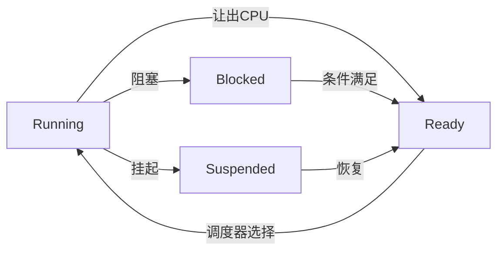

# FreeRTOS任务调度

## 概述

FreeRTOS采用抢占式优先级调度算法，支持时间片轮转，能够保证实时性和公平性。

## 调度策略

### 抢占式调度

FreeRTOS默认使用抢占式调度，高优先级任务可以抢占低优先级任务。

```c
// FreeRTOSConfig.h中配置
#define configUSE_PREEMPTION    1    // 启用抢占式调度
```

时间线示例：
```
时间:  0    5    10   15   20   25   30
       |----|----|----|----|----|----|
任务A: XXXXX           XXXXX
任务B:      XXXXXXXXXX
任务C:               XXXXX

说明: 任务A优先级最高，在0时刻获得CPU
      任务B优先级次之
      任务C优先级最低
```

### 协作式调度

协作式调度要求任务主动让出CPU。

```c
#define configUSE_PREEMPTION    0    // 禁用抢占式调度

// 任务必须主动让出CPU
void task_function(void *pvParameters)
{
    while (1) {
        // 执行任务
        taskYIELD();    // 主动让出CPU
    }
}
```

### 时间片轮转

同等优先级的任务按时间片轮转执行。

```c
#define configUSE_TIME_SLICING    1    // 启用时间片轮转
#define configTICK_RATE_HZ        1000 // 1ms时间片
```

## 任务状态



| 状态 | 说明 |
|------|------|
| Running | 正在运行的任务（单核只有一个） |
| Ready | 就绪态，等待运行 |
| Blocked | 阻塞态，等待事件 |
| Suspended | 挂起态，不参与调度 |

### 状态转换代码

```c
// 进入阻塞态
vTaskDelay(pdMS_TO_TICKS(100));           // 延时阻塞
ulTaskNotifyTake(pdTRUE, portMAX_DELAY); // 等待通知阻塞
xQueueReceive(queue, &data, portMAX_DELAY); // 等待队列阻塞

// 进入挂起态
vTaskSuspend(NULL);                       // 挂起自己
vTaskSuspend(taskHandle);                 // 挂起其他任务

// 从挂起态恢复
vTaskResume(taskHandle);

// 就绪态转运行态（由调度器控制）
taskYIELD();                              // 主动让出CPU
```

## 优先级管理

### 优先级范围

```c
// FreeRTOSConfig.h
#define configMAX_PRIORITIES    5

// 优先级范围: 0 ~ (configMAX_PRIORITIES - 1)
// 数值越大优先级越高
#define PRIORITY_IDLE       0   // 空闲任务
#define PRIORITY_LOW        1
#define PRIORITY_NORMAL     2
#define PRIORITY_HIGH       3
#define PRIORITY_HIGHEST    4
```

### 创建不同优先级任务

```c
void main(void)
{
    xTaskCreate(high_priority_task, "High", 128, NULL, 4, NULL);
    xTaskCreate(normal_task, "Normal", 128, NULL, 2, NULL);
    xTaskCreate(low_task, "Low", 128, NULL, 1, NULL);
    
    vTaskStartScheduler();
}
```

### 运行时修改优先级

```c
// 获取当前优先级
UBaseType_t priority = uxTaskPriorityGet(NULL);

// 设置新优先级
vTaskPrioritySet(NULL, 3);
vTaskPrioritySet(taskHandle, 4);
```

## 调度器控制

### 启动调度器

```c
int main(void)
{
    // 创建任务
    xTaskCreate(task1, "Task1", 128, NULL, 1, NULL);
    xTaskCreate(task2, "Task2", 128, NULL, 2, NULL);
    
    // 启动调度器
    vTaskStartScheduler();
    
    // 如果调度器启动失败会到达这里
    for (;;);
}
```

### 挂起调度器

```c
// 挂起调度器
vTaskSuspendAll();

// 临界区代码（不会被其他任务打断）
// 但仍可被中断打断

// 恢复调度器
xTaskResumeAll();
```

### 临界区

```c
// 任务级临界区
taskENTER_CRITICAL();
// 临界区代码
taskEXIT_CRITICAL();

// 从中断安全的临界区
UBaseType_t uxSavedStatus;
uxSavedStatus = taskENTER_CRITICAL_FROM_ISR();
// 临界区代码
taskEXIT_CRITICAL_FROM_ISR(uxSavedStatus);
```

## 空闲任务

空闲任务在所有用户任务阻塞时运行，优先级为0（最低）。

### 空闲任务钩子

```c
// FreeRTOSConfig.h
#define configUSE_IDLE_HOOK    1

// 空闲任务钩子函数
void vApplicationIdleHook(void)
{
    // 可以在这里执行省电操作
    __WFI();    // 等待中断，进入低功耗
    
    // 或执行后台任务
    if (background_work_pending) {
        do_background_work();
    }
}
```

### 空闲任务配置

```c
#define configIDLE_SHOULD_YIELD    1    // 空闲任务让出CPU
```

## 实时性分析

### 任务响应时间

```
响应时间 = 最大中断响应时间 + 最大调度延迟 + 上下文切换时间

最大中断响应时间取决于:
- 中断是否嵌套
- 临界区最大持续时间

最大调度延迟取决于:
- 最高优先级任务最长阻塞时间
- 禁用调度器最大时间
```

### 优先级反转

低优先级任务持有锁，阻塞高优先级任务执行。

```
优先级: 任务H > 任务M > 任务L

时刻1: 任务L获取互斥锁
时刻2: 任务H就绪，抢占L，但等待锁
时刻3: 任务M就绪，抢占L
时刻4: M运行完成，L继续，释放锁
时刻5: H获取锁，开始运行

问题: H被M延迟了！
```

### 优先级继承

```c
// 创建互斥量（支持优先级继承）
SemaphoreHandle_t mutex = xSemaphoreCreateMutex();

// FreeRTOS互斥量自动实现优先级继承
// 当高优先级任务等待互斥量时，
// 持有互斥量的低优先级任务会临时提升优先级
```

## 调度算法实现

### 就绪列表

```c
// FreeRTOS内部维护就绪列表
// 每个优先级一个链表
List_t pxReadyTasksLists[configMAX_PRIORITIES];

// 最高优先级索引
volatile UBaseType_t uxTopReadyPriority;
```

### 调度过程

```c
// 简化的调度逻辑
void vTaskSwitchContext(void)
{
    // 从最高优先级开始查找就绪任务
    for (priority = uxTopReadyPriority; priority >= 0; priority--) {
        if (listIS_NOT_EMPTY(pxReadyTasksLists[priority])) {
            // 选择该优先级的第一个任务
            pxCurrentTCB = listGET_OWNER_OF_HEAD_ENTRY(
                pxReadyTasksLists[priority]);
            return;
        }
    }
}
```

### 上下文切换

```c
// PendSV中断处理上下文切换（Cortex-M）
void PendSV_Handler(void)
{
    // 保存当前任务上下文
    // R0-R3, R12, LR, PC, xPSR自动保存
    // 保存PSP到当前任务TCB
    
    // 切换到下一个任务
    vTaskSwitchContext();
    
    // 恢复下一个任务上下文
    // 从新任务TCB恢复PSP
    // 异常返回时自动恢复寄存器
}
```

## Tick中断

### Tick配置

```c
#define configTICK_RATE_HZ    1000    // 1kHz tick频率

// Tick周期 = 1000 / configTICK_RATE_HZ = 1ms
```

### Tick钩子

```c
#define configUSE_TICK_HOOK    1

void vApplicationTickHook(void)
{
    // 每1ms执行一次
    // 注意: 必须简短，不能阻塞
    system_tick_count++;
}
```

### Tickless低功耗

```c
#define configUSE_TICKLESS_IDLE    1

// 当所有任务阻塞时，可以关闭tick中断进入低功耗
// 直到下一个任务就绪或阻塞超时
```

## 任务统计

### 运行时间统计

```c
#define configGENERATE_RUN_TIME_STATS    1
#define portCONFIGURE_TIMER_FOR_RUN_TIME_STATS()    \
    (runtime_timer = 0)
#define portGET_RUN_TIME_COUNTER_VALUE()    runtime_timer

// 获取任务运行时间
TaskStatus_t task_status;
vTaskGetInfo(taskHandle, &task_status, eRunning, eInvalid);
uint32_t run_time = task_status.ulRunTimeCounter;
```

### 任务列表

```c
// 打印所有任务状态
char buf[1024];
vTaskList(buf);
printf("任务名\t状态\t优先级\t堆栈\t编号\n");
printf("%s\n", buf);

// 输出示例:
// Name          State   Prio    Stack   Num
// *******************************************
// IDLE          R       0       100     1
// Task1         B       2       80      2
// Task2         R       3       90      3
```

## 调试技巧

### 查看任务状态

```bash
# FreeRTOS+CLI命令
tasks     # 列出所有任务
run-time  # 显示运行时间统计
```

### 栈溢出检测

```c
#define configCHECK_FOR_STACK_OVERFLOW    2

void vApplicationStackOverflowHook(TaskHandle_t xTask, 
                                   char *pcTaskName)
{
    printf("栈溢出: %s\n", pcTaskName);
    while (1);
}
```

## 参考资料

- [FreeRTOS调度](https://www.freertos.org/RTOS-scheduling-algorithm.html)
- [任务状态](https://www.freertos.org/a00019.html)
- [实时系统设计](https://www.freertos.org/Documentation/RTOS_book.html)
