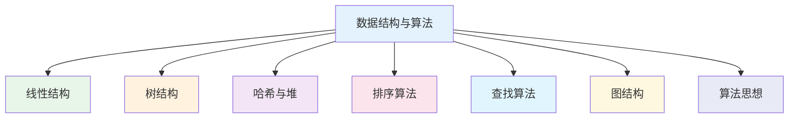

# 数据结构与算法

## 概述

!!! note "数据结构与算法"
    数据结构与算法是计算机科学的核心基础，研究数据的组织方式和操作方法，是程序设计的灵魂。本模块系统讲解数据结构的基本概念、常用算法的设计与分析方法。

## 知识体系结构

## 主要内容

### 线性结构

    <strong>线性结构</strong>
    <ul style="margin: 5px 0;">
        <li><strong>数组</strong>: 连续存储，随机访问</li>
        <li><strong>链表</strong>: 链式存储，动态扩展</li>
        <li><strong>栈</strong>: 后进先出（LIFO）</li>
        <li><strong>队列</strong>: 先进先出（FIFO）</li>
        <li><strong>跳表</strong>: 多层索引，快速查找</li>
        <li><strong>循环队列/双端队列/优先队列</strong>: 特殊队列</li>
        <li><strong>单调栈/单调队列</strong>: 单调性优化</li>
        <li><strong>LRU/LFU缓存</strong>: 缓存淘汰策略</li>
    </ul>

### 树结构

    <strong>树结构</strong>
    <ul style="margin: 5px 0;">
        <li><strong>二叉树</strong>: 基础树结构</li>
        <li><strong>二叉搜索树</strong>: 有序查找</li>
        <li><strong>AVL树/红黑树</strong>: 自平衡树</li>
        <li><strong>堆</strong>: 优先队列实现</li>
        <li><strong>B树/B+树</strong>: 磁盘友好</li>
        <li><strong>线段树/树状数组</strong>: 区间查询</li>
        <li><strong>字典树</strong>: 字符串查找</li>
        <li><strong>并查集</strong>: 等价类划分</li>
        <li><strong>R树/KD树</strong>: 空间索引</li>
        <li><strong>Treap/伸展树</strong>: 随机化/自调整</li>
        <li><strong>替罪羊树</strong>: 部分重建</li>
        <li><strong>LSM树</strong>: 写优化</li>
    </ul>

### 哈希与堆

    <strong>哈希与堆</strong>
    <ul style="margin: 5px 0;">
        <li><strong>哈希表</strong>: 快速查找</li>
        <li><strong>布隆过滤器</strong>: 概率型数据结构</li>
        <li><strong>左堆/二项堆/斐波那契堆</strong>: 可合并堆</li>
    </ul>

### 排序算法

    <strong>排序算法</strong>
    <ul style="margin: 5px 0;">
        <li><strong>冒泡/选择/插入排序</strong>: O(n²)简单排序</li>
        <li><strong>快速排序/归并排序</strong>: O(nlogn)高效排序</li>
        <li><strong>堆排序</strong>: 原地排序</li>
        <li><strong>计数/基数/桶排序</strong>: 线性排序</li>
    </ul>

### 查找算法

    <strong>查找算法</strong>
    <ul style="margin: 5px 0;">
        <li><strong>二分查找</strong>: 有序数组查找</li>
        <li><strong>插值查找/斐波那契查找</strong>: 改进二分</li>
        <li><strong>哈希查找</strong>: O(1)查找</li>
        <li><strong>树表查找</strong>: BST/AVL/红黑树/B+树</li>
    </ul>

### 图结构

    <strong>图结构</strong>
    <ul style="margin: 5px 0;">
        <li><strong>图基础</strong>: 概念、存储、遍历</li>
        <li><strong>最短路径</strong>: Dijkstra、Floyd、Bellman-Ford</li>
        <li><strong>最小生成树</strong>: Prim、Kruskal</li>
        <li><strong>拓扑排序</strong>: 有向无环图排序</li>
        <li><strong>二分图/网络流</strong>: 图论应用</li>
        <li><strong>强连通分量</strong>: Kosaraju、Tarjan</li>
        <li><strong>欧拉路径/哈密顿路径</strong>: 路径问题</li>
        <li><strong>图着色</strong>: 顶点/边着色</li>
    </ul>

### 算法思想

    <strong>算法思想</strong>
    <ul style="margin: 5px 0;">
        <li><strong>递归</strong>: 问题分解</li>
        <li><strong>分治</strong>: 分而治之</li>
        <li><strong>动态规划</strong>: 最优子结构</li>
        <li><strong>贪心</strong>: 局部最优</li>
        <li><strong>回溯</strong>: 系统搜索</li>
        <li><strong>分支限界</strong>: 剪枝优化</li>
        <li><strong>双指针/位运算</strong>: 技巧优化</li>
        <li><strong>前缀和/滑动窗口</strong>: 区间处理</li>
        <li><strong>字符串匹配</strong>: KMP、BM</li>
        <li><strong>模拟退火/遗传算法</strong>: 启发式搜索</li>
    </ul>

## 学习路径

!!! info "推荐学习路径"
    1. **基础阶段**：线性结构 → 排序算法 → 查找算法
    2. **进阶阶段**：树结构 → 哈希与堆 → 图结构
    3. **高级阶段**：算法思想 → 复杂度分析 → 算法设计

## 目录

### 线性结构
- [数组](100-线性结构/001-数组.md)
- [链表](100-线性结构/002-链表.md)
- [栈](100-线性结构/003-栈.md)
- [队列](100-线性结构/004-队列.md)
- [跳表](100-线性结构/005-跳表.md)
- [循环队列](100-线性结构/006-循环队列.md)
- [双端队列](100-线性结构/007-双端队列.md)
- [优先队列](100-线性结构/008-优先队列.md)
- [单调栈](100-线性结构/010-单调栈.md)
- [单调队列](100-线性结构/011-单调队列.md)
- [LRU缓存](100-线性结构/012-LRU缓存.md)
- [LFU缓存](100-线性结构/013-LFU缓存.md)

### 树结构
- [二叉树](200-树结构/001-二叉树.md)
- [二叉搜索树](200-树结构/002-二叉搜索树.md)
- [AVL树](200-树结构/003-AVL树.md)
- [红黑树](200-树结构/004-红黑树.md)
- [堆](200-树结构/005-堆.md)
- [B树与B+树](200-树结构/006-B树与B+树.md)
- [线段树](200-树结构/010-线段树.md)
- [字典树](200-树结构/011-字典树.md)
- [并查集](200-树结构/012-并查集.md)
- [树状数组](200-树结构/013-树状数组.md)
- [树链剖分](200-树结构/020-树链剖分.md)
- [最近公共祖先](200-树结构/021-最近公共祖先.md)
- [R树](200-树结构/030-R树.md)
- [KD树](200-树结构/031-KD树.md)
- [四叉树与八叉树](200-树结构/032-四叉树与八叉树.md)
- [Treap](200-树结构/033-Treap.md)
- [伸展树](200-树结构/034-伸展树.md)
- [后缀树与后缀数组](200-树结构/035-后缀树与后缀数组.md)
- [主席树](200-树结构/036-主席树.md)
- [笛卡尔树](200-树结构/037-笛卡尔树.md)
- [替罪羊树](200-树结构/038-替罪羊树.md)
- [LSM树](200-树结构/039-LSM树.md)

### 哈希与堆
- [哈希表](300-哈希与堆/001-哈希表.md)
- [布隆过滤器](300-哈希与堆/002-布隆过滤器.md)
- [散列表进阶](300-哈希与堆/003-散列表进阶.md)
- [左堆](300-哈希与堆/004-左堆.md)
- [二项堆](300-哈希与堆/005-二项堆.md)
- [斐波那契堆](300-哈希与堆/006-斐波那契堆.md)

### 排序算法
- [排序算法概述](400-排序算法/001-排序算法概述.md)
- [冒泡排序](400-排序算法/002-冒泡排序.md)
- [快速排序](400-排序算法/003-快速排序.md)
- [归并排序](400-排序算法/004-归并排序.md)
- [插入排序](400-排序算法/005-插入排序.md)
- [选择排序](400-排序算法/006-选择排序.md)
- [堆排序](400-排序算法/007-堆排序.md)
- [计数排序](400-排序算法/008-计数排序.md)
- [基数排序](400-排序算法/009-基数排序.md)
- [桶排序](400-排序算法/010-桶排序.md)

### 查找算法
- [二分查找](500-查找算法/001-二分查找.md)
- [插值查找](500-查找算法/002-插值查找.md)
- [斐波那契查找](500-查找算法/003-斐波那契查找.md)
- [哈希查找](500-查找算法/004-哈希查找.md)
- [树表查找](500-查找算法/005-树表查找.md)

### 图结构
- [图数据结构完整学习指南](800-图结构/001-图数据结构完整学习指南.md)
- [图的基本概念](800-图结构/002-图的基本概念.md)
- [图的存储](800-图结构/003-图的存储.md)
- [邻接矩阵设计实现](800-图结构/004-邻接矩阵设计实现.md)
- [邻接表设计实现](800-图结构/005-领接表设计实现.md)
- [图的遍历](800-图结构/010-图的遍历.md)
- [最短路径算法](800-图结构/020-最短路径算法.md)
- [最小生成树](800-图结构/030-最小生成树.md)
- [拓扑排序](800-图结构/040-拓扑排序.md)
- [二分图](800-图结构/050-二分图.md)
- [网络流](800-图结构/060-网络流.md)
- [强连通分量](800-图结构/070-强连通分量.md)
- [欧拉路径与哈密顿路径](800-图结构/071-欧拉路径与哈密顿路径.md)
- [图着色问题](800-图结构/072-图着色问题.md)

### 算法思想
- [递归算法](900-算法思想/001-递归算法.md)
- [分治算法](900-算法思想/002-分治算法.md)
- [动态规划](900-算法思想/003-动态规划.md)
- [贪心算法](900-算法思想/004-贪心算法.md)
- [回溯算法](900-算法思想/005-回溯算法.md)
- [双指针算法](900-算法思想/006-双指针算法.md)
- [位运算算法](900-算法思想/007-位运算算法.md)
- [摩尔投票算法](900-算法思想/008-摩尔投票算法.md)
- [前缀和与差分](900-算法思想/009-前缀和与差分.md)
- [字符串匹配算法](900-算法思想/010-字符串匹配算法.md)
- [滑动窗口](900-算法思想/100-滑动窗口.md)
- [随机算法](900-算法思想/020-随机算法.md)
- [近似算法](900-算法思想/021-近似算法.md)
- [分支限界法](900-算法思想/022-分支限界法.md)
- [模拟退火算法](900-算法思想/023-模拟退火算法.md)
- [遗传算法](900-算法思想/024-遗传算法.md)

## 参考资料

- 《算法导论》- Thomas H. Cormen
- 《数据结构与算法分析》- Mark Allen Weiss
- 《算法（第4版）》- Robert Sedgewick
- [OI Wiki](https://oi-wiki.org/)
