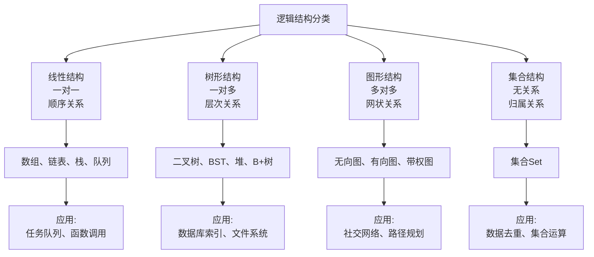
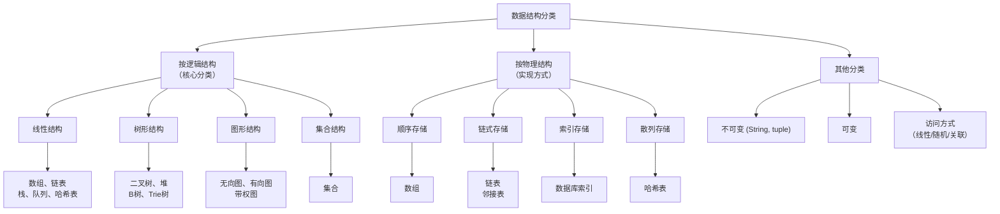

# 数据结构分类

最核心的分类方式是基于 **逻辑结构** 和 **物理结构（存储结构）**。

---

## 一、 按逻辑结构分类

逻辑结构是指数据元素之间的**抽象关系**，与如何在计算机中实现无关。这是数据结构最重要的分类方式。

主要分为四大类：

### 1. 线性结构

数据元素之间存在“一对一”的线性关系。所有元素排列成一条线或一个序列。

**特点**：除了第一个和最后一个元素外，每个元素都有且仅有一个**前驱**和一个**后继**。

**典型代表及应用场景**：

| 数据结构 | 特点 | 典型应用场景 |
|---------|------|-------------|
| **数组** | 内存连续，通过索引直接访问 | • 存储固定数量的相同类型数据 • 矩阵运算、图像像素存储 • 实现其他数据结构的基础 |
| **链表** | 通过指针连接，内存不要求连续 | • 实现文件系统目录结构 • 浏览器的前进后退历史记录 • 内存管理中的空闲内存块管理 |
| **栈** | 后进先出(LIFO)，只能在栈顶操作 | • 函数调用栈 • 表达式求值（括号匹配） • 浏览器的后退按钮 • 撤销(Undo)功能 |
| **队列** | 先进先出(FIFO)，队尾插入队首删除 | • 消息队列、任务调度 • 打印机任务队列 • 广度优先搜索(BFS)算法 • 多线程的线程池等待队列 |
| **字符串** | 字符的线性序列 | • 文本编辑器 • 编译器词法分析 • 搜索引擎的文档处理 |
| **哈希表** | 通过哈希函数将键映射到值，通常由数组和链表（或红黑树）实现。| 快速查找、字典、缓存等。|

### 2. 树形结构

数据元素之间存在“一对多”的层次关系。

**特点**：有且仅有一个根节点，每个节点有零个或多个子节点，但每个节点（除根节点外）有且仅有一个父节点。

**典型代表及应用场景**：

| 数据结构 | 特点 | 典型应用场景 |
|---------|------|-------------|
| **二叉树** | 每个节点最多有两个子节点 | • 表达式树（编译器） • 决策树（机器学习） • 哈夫曼编码（数据压缩） |
| **二叉搜索树(BST)** | 左子树值 < 根节点值 < 右子树值 | • 字典实现 • 动态数据集的高效查找 • 数据库索引的底层实现之一 |
| **平衡二叉树(AVL/红黑树)** | 通过旋转保持平衡，保证搜索效率 | • C++ STL的map、set • Java的TreeMap、TreeSet • 文件系统的目录结构 |
| **堆** | 完全二叉树，满足堆性质 | • 优先队列实现 • 堆排序算法 • 定时任务调度 • 求Top K问题 |
| **B树/B+树** | 多路平衡搜索树 | • 数据库索引（MySQL等） • 文件系统（NTFS、EXT） • 大量数据的磁盘存储结构 |
| **Trie树(字典树)** | 专门用于字符串搜索的树 | • 搜索引擎的自动补全 • 输入法的词库 • IP路由表的最长前缀匹配 |

### 3. 图形结构

数据元素之间存在“多对多”的任意关系。这是最复杂的一种结构。

**特点**：任何两个节点之间都可能相关，一个节点可以有多个前驱和多个后继。

**典型代表及应用场景**：

| 数据结构 | 特点 | 典型应用场景 |
|---------|------|-------------|
| **无向图** | 边没有方向 | • 社交网络（好友关系） • 计算机网络拓扑 • 地铁线路图 • 最小生成树问题（Kruskal、Prim算法） |
| **有向图** | 边有方向 | • 网页链接关系（Google的PageRank） • 任务依赖关系（Makefile） • 课程先修关系 • 状态机建模 |
| **带权图(网络)** | 边上带有权值或成本 | • 导航系统的最短路径（Dijkstra算法） • 物流网络的成本优化 • 网络流量分析 • 电路设计 |

### 4. 集合结构

数据元素之间除了“同属一个集合”外，没有其他特定关系。

**特点**：元素是无序的，且通常不允许重复。

**典型代表及应用场景**：

| 数据结构 | 特点 | 典型应用场景 |
|---------|------|-------------|
| **集合(Set)** | 元素无序且唯一 | • 用户ID去重 • 词汇表构建 • 数学上的集合运算（并、交、差） • 数据库的DISTINCT操作 |

### 5.总结

---

## 二、 按物理结构（存储结构）分类

物理结构是指逻辑结构在计算机内存中的**实际实现方式**。

### 1. 顺序存储结构
- **原理**：用一组地址连续的存储单元依次存储数据元素。通常用数组实现。
- **优点**：
  - **随机存取**：通过下标（索引）可以在O(1)时间内访问任何元素。
  - 存储密度高，只存储数据本身。
- **缺点**：
  - 内存分配不灵活，需要预先指定大小。
  - 插入和删除操作可能需要移动大量元素，效率低（O(n)）。
- **典型代表**：数组、顺序栈、顺序队列。

### 2. 链式存储结构
- **原理**：用一组任意的存储单元存储数据元素，元素之间通过指针（或引用）来维护逻辑关系。
- **优点**：
  - **动态分配**：不需要预先分配固定大小，可以动态扩展。
  - 插入和删除操作灵活，效率高（O(1)，如果已知位置）。
- **缺点**：
  - **顺序存取**：要访问第i个元素，必须从头遍历。
  - 存储密度低，因为需要额外空间存储指针。
- **典型代表**：链表、链栈、链队列、邻接表、二叉链表。

### 3. 索引存储结构
- **原理**：在存储数据元素的同时，还建立了一个附加的索引表。索引表中的每一项（索引项）由关键字和地址组成。
- **优点**：利用索引可以进行**快速检索**。
- **缺点**：需要额外存储索引表，增删数据时需要维护索引，降低了更新效率。
- **典型代表**：数据库中的索引。

### 4. 散列存储结构（哈希存储）
- **原理**：根据元素的关键字，通过一个**哈希函数**直接计算出该元素的存储地址。
- **优点**：在理想情况下，检索、插入和删除操作的时间复杂度都可以达到**O(1)**。
- **缺点**：可能会出现**哈希冲突**；数据元素之间没有固有的逻辑关系，不便于范围查询。
- **典型代表**：哈希表。

---

## 三、 其他常见分类方式

### 1. 按数据类型是否可变
- **不可变数据结构**：一旦创建，其内容就不能被修改。任何修改操作都会创建一个新的数据结构。
  - *优点*：线程安全，易于理解和推理。
  - *代表*：Java中的String、Python中的元组（tuple）。
- **可变数据结构**：创建后，其内容可以被修改。
  - *优点*：操作效率高，节省内存。
  - *代表*：大多数数据结构，如数组、链表、哈希表等。

### 2. 按访问方式
- **线性访问**：必须按顺序访问元素（如链表）。
- **随机访问**：可以直接访问任意位置的元素（如数组）。
- **关联访问**：通过键（Key）来访问值（Value）（如哈希表、字典）。

### 总结与关系

可以用下面的图表来总结这些分类之间的关系：

**重要提示**：一种逻辑结构可以用多种物理结构来实现。例如：
- **线性表**这种逻辑结构，既可以用**顺序存储**（数组）实现，也可以用**链式存储**（链表）实现。
- **图**这种逻辑结构，既可以用**邻接矩阵**（顺序存储）实现，也可以用**邻接表**（链式存储）实现，还可以用我们之前讨论的**邻接多重表**（链式存储）实现。

理解数据结构的分类，有助于我们在解决问题时，根据具体的需求（如需要频繁查找还是频繁插入删除？数据量大小？）选择最合适的“工具”。
