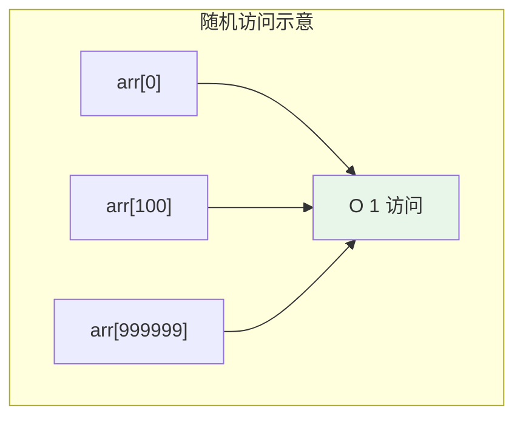
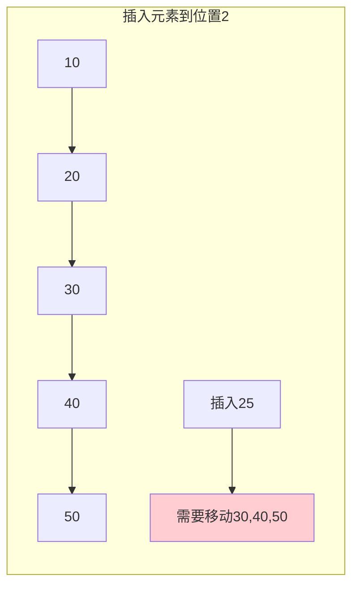
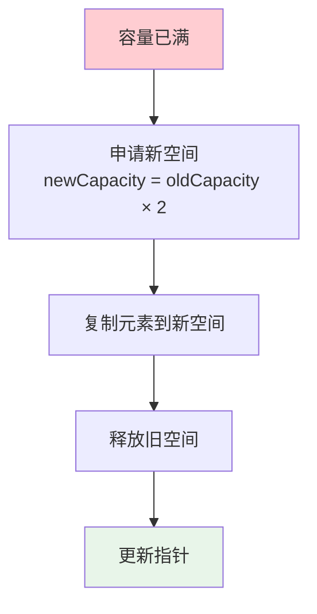
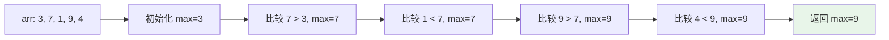
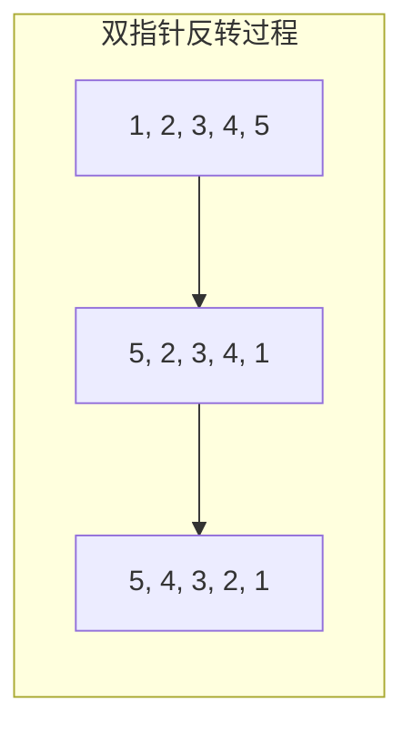
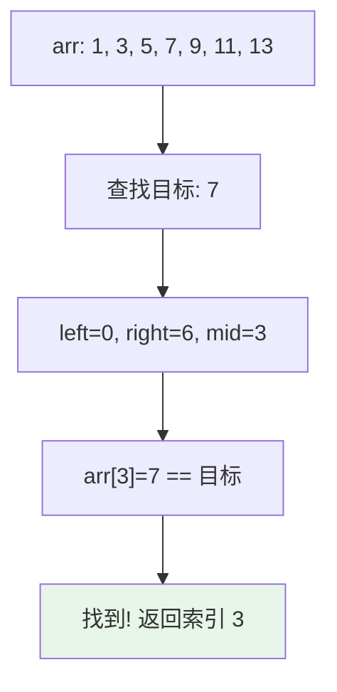
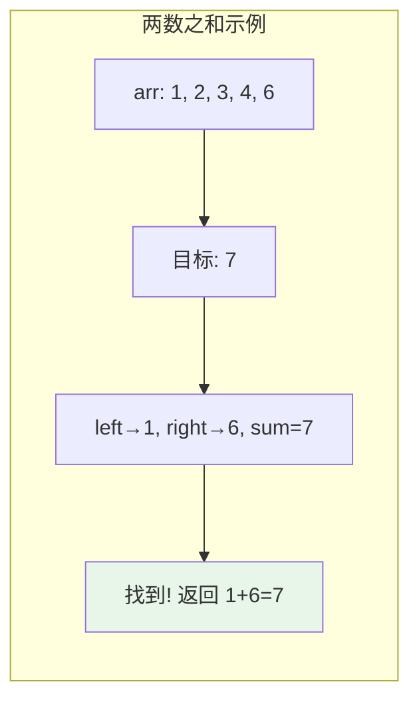
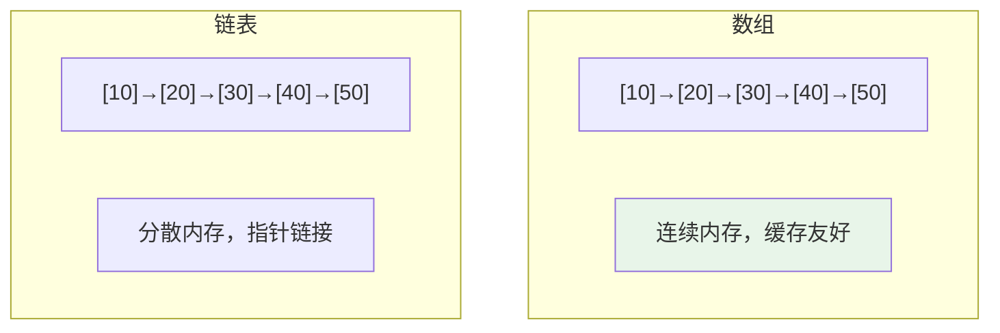

# 数组

## 概述

数组（Array）是最基本、最重要的线性数据结构，它在连续的内存空间中存储相同类型的元素。数组是许多其他数据结构（如栈、队列、堆、哈希表等）的实现基础。

!!! note "数组的核心价值"
    数组通过连续内存存储和索引计算，实现了O(1)时间的随机访问，这是它最核心的优势。理解数组的内存布局和访问机制，是深入理解计算机内存模型的关键。

## 数组的内存模型

### 内存布局图示

<div style="background-color: #F5F5F5; padding: 20px; margin: 10px 0; border-radius: 8px; font-family: 'Courier New', monospace;">
    <p style="margin: 0 0 15px 0; font-weight: bold; color: #1976D2;">数组 arr[6] = {10, 20, 30, 40, 50, 60}</p>
    <div style="display: flex; justify-content: space-between; margin-bottom: 5px;">
        <span style="width: 80px; text-align: center; font-size: 12px; color: #666;">1000</span>
        <span style="width: 80px; text-align: center; font-size: 12px; color: #666;">1004</span>
        <span style="width: 80px; text-align: center; font-size: 12px; color: #666;">1008</span>
        <span style="width: 80px; text-align: center; font-size: 12px; color: #666;">1012</span>
        <span style="width: 80px; text-align: center; font-size: 12px; color: #666;">1016</span>
        <span style="width: 80px; text-align: center; font-size: 12px; color: #666;">1020</span>
    </div>
    <div style="display: flex; justify-content: space-between; margin-bottom: 5px;">
        <div style="width: 80px; height: 50px; background: #E3F2FD; border: 2px solid #2196F3; display: flex; align-items: center; justify-content: center; font-weight: bold;">10</div>
        <div style="width: 80px; height: 50px; background: #E3F2FD; border: 2px solid #2196F3; display: flex; align-items: center; justify-content: center; font-weight: bold;">20</div>
        <div style="width: 80px; height: 50px; background: #E3F2FD; border: 2px solid #2196F3; display: flex; align-items: center; justify-content: center; font-weight: bold;">30</div>
        <div style="width: 80px; height: 50px; background: #E3F2FD; border: 2px solid #2196F3; display: flex; align-items: center; justify-content: center; font-weight: bold;">40</div>
        <div style="width: 80px; height: 50px; background: #E3F2FD; border: 2px solid #2196F3; display: flex; align-items: center; justify-content: center; font-weight: bold;">50</div>
        <div style="width: 80px; height: 50px; background: #E3F2FD; border: 2px solid #2196F3; display: flex; align-items: center; justify-content: center; font-weight: bold;">60</div>
    </div>
    <div style="display: flex; justify-content: space-between;">
        <div style="width: 80px; text-align: center;">
            <span style="font-size: 12px; color: #666;">索引 0</span>
            <div style="color: #F44336; font-size: 18px;">↑</div>
            <div style="font-size: 11px; color: #F44336;">基地址</div>
        </div>
        <div style="width: 80px; text-align: center; font-size: 12px; color: #666;">索引 1</div>
        <div style="width: 80px; text-align: center; font-size: 12px; color: #666;">索引 2</div>
        <div style="width: 80px; text-align: center; font-size: 12px; color: #666;">索引 3</div>
        <div style="width: 80px; text-align: center; font-size: 12px; color: #666;">索引 4</div>
        <div style="width: 80px; text-align: center; font-size: 12px; color: #666;">索引 5</div>
    </div>
</div>

### 地址计算公式

对于数组元素 `arr[i]`，其内存地址为：

**address(arr[i]) = base_address + i × element_size**

其中：
- `base_address`：数组首元素的内存地址
- `i`：元素索引
- `element_size`：每个元素占用的字节数（如int类型通常为4字节）


## 数组特点详解

### 1. 连续内存存储

**优点**：
- **缓存友好**：连续内存访问充分利用CPU缓存行（通常64字节），提高缓存命中率
- **地址计算简单**：通过基地址和偏移量直接计算，无需指针追踪
- **内存紧凑**：没有额外的指针开销

**缺点**：
- **需要连续内存块**：大数组可能因内存碎片导致分配失败
- **大小固定**：静态数组创建后大小不能改变

### 2. 随机访问



!!! tip "为什么数组能O(1)访问？"
    因为数组元素的内存地址可以通过公式直接计算，不需要像链表那样从头遍历。无论访问第一个元素还是第一百万元素，时间都是相同的。

### 3. 插入和删除的代价



插入/删除操作需要移动后续所有元素，时间复杂度为O(n)。

| 操作位置 | 时间复杂度 | 说明 |
|----------|------------|------|
| 尾部插入/删除 | O(1) | 无需移动元素 |
| 头部插入/删除 | O(n) | 移动所有元素 |
| 中间插入/删除 | O(n) | 平均移动n/2个元素 |

## 时间复杂度详细分析

| 操作 | 最好 | 平均 | 最坏 | 说明 |
|------|------|------|------|------|
| 访问元素 | O(1) | O(1) | O(1) | 直接地址计算 |
| 修改元素 | O(1) | O(1) | O(1) | 直接地址计算 |
| 查找元素 | O(1) | O(n) | O(n) | 无序数组需要遍历 |
| 有序查找 | O(1) | O(log n) | O(log n) | 二分查找 |
| 插入元素 | O(1) | O(n) | O(n) | 尾部插入为O(1) |
| 删除元素 | O(1) | O(n) | O(n) | 尾部删除为O(1) |

## 空间复杂度

| 类型 | 空间复杂度 | 说明 |
|------|------------|------|
| 静态数组 | O(n) | 编译时确定大小 |
| 动态数组 | O(n) | 运行时可扩容，实际分配capacity |
| 均摊分析 | O(n) | 扩容均摊代价为O(1) |

## 动态数组的扩容机制

### 扩容策略



### 扩容代价分析

```
初始容量: 1
扩容序列: 1 → 2 → 4 → 8 → 16 → 32 → ... → n

复制总次数: 1 + 2 + 4 + 8 + ... + n = 2n - 1

均摊每次插入的复制代价: O(1)
```

!!! note "均摊分析"
    虽然单次扩容需要O(n)时间复制元素，但扩容频率越来越低，均摊到每次插入操作，代价仅为O(1)。

## 数组实现

=== "C"

    ```c
    #include <stdio.h>
    #include <stdlib.h>

    typedef struct {
        int *data;       // 数据存储区
        int size;        // 当前元素数量
        int capacity;    // 总容量
    } DynamicArray;

    // 初始化动态数组
    void initArray(DynamicArray *arr, int capacity) {
        arr->data = (int *)malloc(sizeof(int) * capacity);
        arr->size = 0;
        arr->capacity = capacity;
    }

    // 扩容操作
    void resizeArray(DynamicArray *arr) {
        printf("扩容: %d → %d\n", arr->capacity, arr->capacity * 2);
        arr->capacity *= 2;
        arr->data = (int *)realloc(arr->data, sizeof(int) * arr->capacity);
    }

    // 尾部添加元素
    void pushBack(DynamicArray *arr, int value) {
        if (arr->size == arr->capacity) {
            resizeArray(arr);
        }
        arr->data[arr->size++] = value;
    }

    // 按索引访问元素
    int get(DynamicArray *arr, int index) {
        if (index < 0 || index >= arr->size) {
            printf("索引越界!\n");
            return -1;
        }
        return arr->data[index];
    }

    // 在指定位置插入元素
    void insertAt(DynamicArray *arr, int index, int value) {
        if (index < 0 || index > arr->size) return;
        
        if (arr->size == arr->capacity) {
            resizeArray(arr);
        }
        
        for (int i = arr->size; i > index; i--) {
            arr->data[i] = arr->data[i - 1];
        }
        
        arr->data[index] = value;
        arr->size++;
    }

    // 删除指定位置元素
    void removeAt(DynamicArray *arr, int index) {
        if (index < 0 || index >= arr->size) return;
        
        for (int i = index; i < arr->size - 1; i++) {
            arr->data[i] = arr->data[i + 1];
        }
        arr->size--;
    }

    // 释放内存
    void freeArray(DynamicArray *arr) {
        free(arr->data);
        arr->size = 0;
        arr->capacity = 0;
    }
    ```

=== "C++"

    ```cpp
    #include <vector>
    #include <iostream>

    int main() {
        std::vector<int> arr;
        
        // 添加元素
        arr.push_back(1);
        arr.push_back(2);
        arr.push_back(3);
        
        // 访问元素
        std::cout << arr[0] << std::endl;      // 不检查越界
        std::cout << arr.at(1) << std::endl;   // 检查越界，抛出异常
        
        // 获取信息
        std::cout << "大小: " << arr.size() << std::endl;
        std::cout << "容量: " << arr.capacity() << std::endl;
        
        // 插入和删除
        arr.insert(arr.begin() + 1, 10);  // 在位置1插入
        arr.erase(arr.begin() + 2);       // 删除位置2的元素
        
        return 0;
    }
    ```

=== "Python"

    ```python
    # Python列表本身就是动态数组
    arr = []

    # 添加元素
    arr.append(1)
    arr.append(2)
    arr.append(3)

    # 访问元素
    print(arr[0])  # 1
    print(arr[1])  # 2

    # 获取信息
    print(f"大小: {len(arr)}")

    # 插入和删除
    arr.insert(1, 10)  # 在位置1插入
    arr.pop(2)         # 删除位置2的元素

    # 自定义动态数组类
    class DynamicArray:
        def __init__(self, capacity=10):
            self.data = [0] * capacity
            self.size = 0
            self.capacity = capacity
        
        def append(self, value):
            if self.size == self.capacity:
                self._resize()
            self.data[self.size] = value
            self.size += 1
        
        def _resize(self):
            self.capacity *= 2
            new_data = [0] * self.capacity
            for i in range(self.size):
                new_data[i] = self.data[i]
            self.data = new_data
        
        def get(self, index):
            if 0 <= index < self.size:
                return self.data[index]
            raise IndexError("索引越界")
        
        def insert(self, index, value):
            if index < 0 or index > self.size:
                return
            if self.size == self.capacity:
                self._resize()
            for i in range(self.size, index, -1):
                self.data[i] = self.data[i - 1]
            self.data[index] = value
            self.size += 1
    ```

=== "Java"

    ```java
    import java.util.ArrayList;

    public class DynamicArray {
        private int[] data;
        private int size;
        private int capacity;
        
        public DynamicArray(int capacity) {
            this.capacity = capacity;
            this.data = new int[capacity];
            this.size = 0;
        }
        
        // 扩容
        private void resize() {
            System.out.println("扩容: " + capacity + " → " + capacity * 2);
            capacity *= 2;
            int[] newData = new int[capacity];
            System.arraycopy(data, 0, newData, 0, size);
            data = newData;
        }
        
        // 添加元素
        public void append(int value) {
            if (size == capacity) {
                resize();
            }
            data[size++] = value;
        }
        
        // 访问元素
        public int get(int index) {
            if (index < 0 || index >= size) {
                throw new IndexOutOfBoundsException("索引越界");
            }
            return data[index];
        }
        
        // 插入元素
        public void insert(int index, int value) {
            if (index < 0 || index > size) return;
            if (size == capacity) resize();
            
            for (int i = size; i > index; i--) {
                data[i] = data[i - 1];
            }
            data[index] = value;
            size++;
        }
        
        // 删除元素
        public void remove(int index) {
            if (index < 0 || index >= size) return;
            
            for (int i = index; i < size - 1; i++) {
                data[i] = data[i + 1];
            }
            size--;
        }
        
        public static void main(String[] args) {
            // 使用ArrayList
            ArrayList<Integer> arr = new ArrayList<>();
            arr.add(1);
            arr.add(2);
            arr.add(3);
            
            System.out.println(arr.get(0));  // 1
            arr.add(1, 10);  // 在位置1插入
            arr.remove(2);   // 删除位置2的元素
        }
    }
    ```

=== "Go"

    ```go
    package main

    import "fmt"

    // 动态数组结构
    type DynamicArray struct {
        data     []int
        size     int
        capacity int
    }

    // 创建动态数组
    func NewDynamicArray(capacity int) *DynamicArray {
        return &DynamicArray{
            data:     make([]int, capacity),
            size:     0,
            capacity: capacity,
        }
    }

    // 扩容
    func (arr *DynamicArray) resize() {
        fmt.Printf("扩容: %d → %d\n", arr.capacity, arr.capacity*2)
        arr.capacity *= 2
        newData := make([]int, arr.capacity)
        copy(newData, arr.data)
        arr.data = newData
    }

    // 添加元素
    func (arr *DynamicArray) Append(value int) {
        if arr.size == arr.capacity {
            arr.resize()
        }
        arr.data[arr.size] = value
        arr.size++
    }

    // 访问元素
    func (arr *DynamicArray) Get(index int) (int, error) {
        if index < 0 || index >= arr.size {
            return 0, fmt.Errorf("索引越界")
        }
        return arr.data[index], nil
    }

    // 插入元素
    func (arr *DynamicArray) Insert(index, value int) {
        if index < 0 || index > arr.size {
            return
        }
        if arr.size == arr.capacity {
            arr.resize()
        }
        for i := arr.size; i > index; i-- {
            arr.data[i] = arr.data[i-1]
        }
        arr.data[index] = value
        arr.size++
    }

    func main() {
        // 使用Go切片（内置动态数组）
        var arr []int
        arr = append(arr, 1)
        arr = append(arr, 2)
        arr = append(arr, 3)
        
        fmt.Println(arr[0])  // 1
        fmt.Println("大小:", len(arr))
    }
    ```

=== "Rust"

    ```rust
    use std::mem;

    struct DynamicArray {
        data: Vec<i32>,
    }

    impl DynamicArray {
        fn new(capacity: usize) -> Self {
            DynamicArray {
                data: Vec::with_capacity(capacity),
            }
        }
        
        fn append(&mut self, value: i32) {
            self.data.push(value);
        }
        
        fn get(&self, index: usize) -> Option<i32> {
            self.data.get(index).copied()
        }
        
        fn insert(&mut self, index: usize, value: i32) {
            if index <= self.data.len() {
                self.data.insert(index, value);
            }
        }
        
        fn remove(&mut self, index: usize) -> Option<i32> {
            if index < self.data.len() {
                Some(self.data.remove(index))
            } else {
                None
            }
        }
        
        fn size(&self) -> usize {
            self.data.len()
        }
        
        fn capacity(&self) -> usize {
            self.data.capacity()
        }
    }

    fn main() {
        // 使用Rust Vec（内置动态数组）
        let mut arr = Vec::new();
        
        arr.push(1);
        arr.push(2);
        arr.push(3);
        
        println!("第一个元素: {}", arr[0]);
        println!("大小: {}", arr.len());
        println!("容量: {}", arr.capacity());
        
        arr.insert(1, 10);  // 在位置1插入
        arr.remove(2);      // 删除位置2的元素
    }
    ```

## 常见数组操作详解

### 1. 查找最大/最小值



```c
int findMax(int arr[], int n) {
    int max = arr[0];
    for (int i = 1; i < n; i++) {
        if (arr[i] > max) {
            max = arr[i];
        }
    }
    return max;
}
```

### 2. 反转数组



```c
void reverse(int arr[], int n) {
    int left = 0, right = n - 1;
    while (left < right) {
        // 交换左右指针位置的元素
        int temp = arr[left];
        arr[left] = arr[right];
        arr[right] = temp;
        left++;
        right--;
    }
}
```

### 3. 二分查找（有序数组）



二分查找每次将搜索范围缩小一半，时间复杂度O(log n)。

```c
int binarySearch(int arr[], int n, int target) {
    int left = 0, right = n - 1;
    
    while (left <= right) {
        int mid = left + (right - left) / 2;  // 防止溢出
        
        if (arr[mid] == target) {
            return mid;        // 找到目标
        } else if (arr[mid] < target) {
            left = mid + 1;    // 在右半部分继续查找
        } else {
            right = mid - 1;   // 在左半部分继续查找
        }
    }
    
    return -1;  // 未找到
}
```

### 4. 双指针技巧

双指针是一种常用的数组优化技巧，可以将O(n²)的问题优化到O(n)。



```c
// 有序数组两数之和
void twoSum(int arr[], int n, int target) {
    int left = 0, right = n - 1;
    
    while (left < right) {
        int sum = arr[left] + arr[right];
        
        if (sum == target) {
            printf("找到: %d + %d = %d\n", 
                   arr[left], arr[right], target);
            return;
        } else if (sum < target) {
            left++;   // 和太小，左指针右移
        } else {
            right--;  // 和太大，右指针左移
        }
    }
    
    printf("未找到\n");
}
```

## 二维数组与内存布局

### 内存存储方式

C语言采用**行优先**（Row-Major）方式存储二维数组：

```
int matrix[3][4] = {
    {1,  2,  3,  4},
    {5,  6,  7,  8},
    {9,  10, 11, 12}
};

内存布局（行优先）:
地址:  1000 1004 1008 1012 1016 1020 1024 1028 1032 1036 1040 1044
内容:   1    2    3    4    5    6    7    8    9   10   11   12
        └────第0行────┘   └────第1行────┘   └────第2行────┘
```

### 地址计算

对于二维数组 `matrix[row][col]`：

```
address = base_address + (row × cols + col) × element_size
```

```c
#include <stdio.h>

int main() {
    int matrix[3][4] = {
        {1, 2, 3, 4},
        {5, 6, 7, 8},
        {9, 10, 11, 12}
    };
    
    // 访问元素
    printf("matrix[1][2] = %d\n", matrix[1][2]);  // 7
    
    // 遍历二维数组
    for (int i = 0; i < 3; i++) {
        for (int j = 0; j < 4; j++) {
            printf("%2d ", matrix[i][j]);
        }
        printf("\n");
    }
    
    return 0;
}
```

## 数组 vs 链表对比

| 特性 | 数组 | 链表 |
|------|------|------|
| 内存结构 | 连续 | 分散 |
| 随机访问 | O(1) ✓ | O(n) ✗ |
| 插入删除 | O(n) ✗ | O(1) ✓（已知位置） |
| 内存占用 | 紧凑 | 额外指针开销 |
| 缓存友好 | 是 ✓ | 否 ✗ |
| 大小灵活性 | 静态固定 / 动态扩容 | 动态灵活 |



## 数组应用场景

### 1. 快速随机访问场景

- **数据库索引**：B+树叶子节点存储数据指针
- **图像处理**：像素矩阵存储
- **科学计算**：矩阵运算、向量计算

### 2. 数据缓存场景

- **CPU缓存**：连续内存提高缓存命中率
- **游戏开发**：连续存储实体数据（ECS架构）

### 3. 其他数据结构的基础

- **栈和队列**：使用数组实现顺序存储
- **堆**：完全二叉树的数组表示
- **哈希表**：开放寻址法使用数组存储

### 4. 特定算法需求

- **计数排序、基数排序**：需要数组作为辅助空间
- **动态规划**：状态转移表通常使用二维数组

## 常见问题与陷阱

### 1. 数组越界

```c
int arr[5] = {1, 2, 3, 4, 5};
// 危险！越界访问，可能导致程序崩溃或数据损坏
int x = arr[5];   // 越界！
arr[-1] = 10;     // 越界！
```

### 2. 缓冲区溢出

```c
char buffer[10];
strcpy(buffer, "This string is too long!");  // 缓冲区溢出！
```

### 3. 未初始化访问

```c
int arr[5];
int x = arr[0];  // 未初始化，值不确定
```

## 参考资料

- 《算法导论》第10章 - 基本数据结构
- 《数据结构与算法分析（C语言描述）》- Mark Allen Weiss
- 《CSAPP》第3章 - 程序的机器级表示
- [Array Data Structure - Wikipedia](https://en.wikipedia.org/wiki/Array_data_structure)
