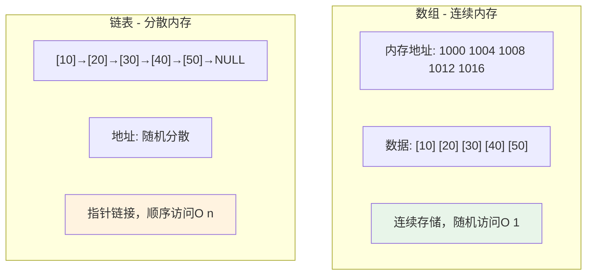
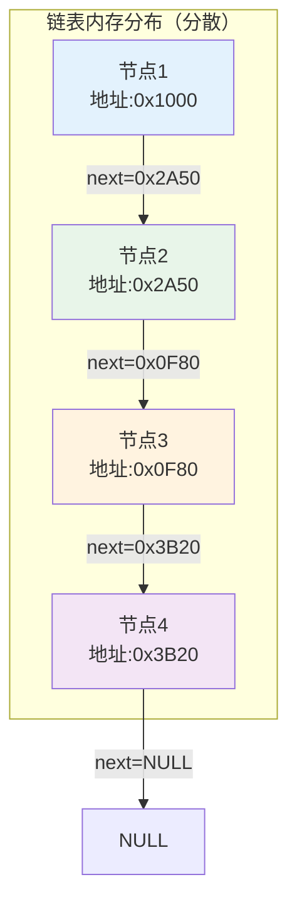
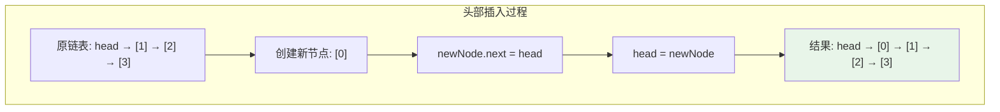
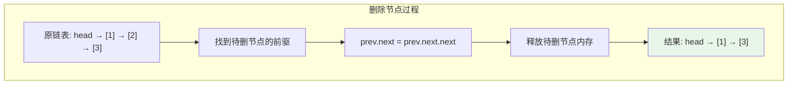
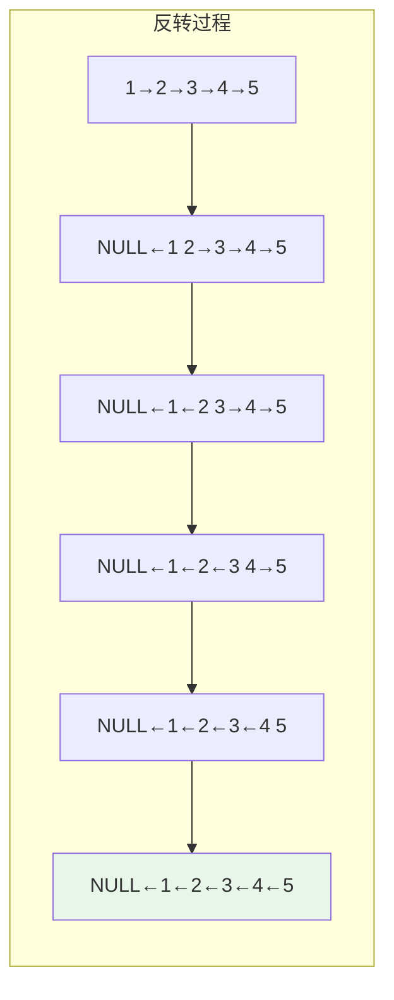
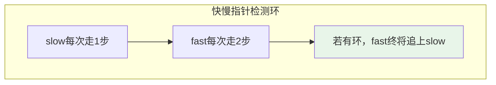
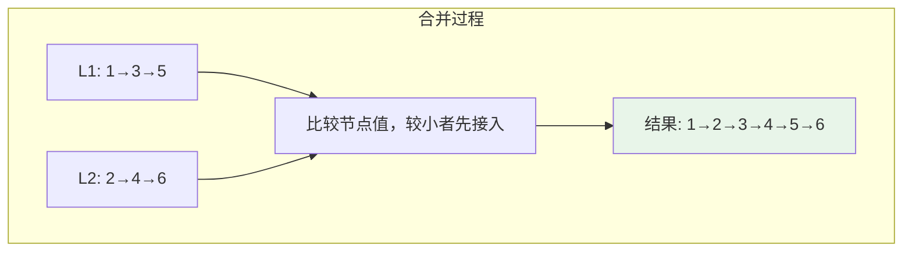

# 链表

## 概述

链表（Linked List）是一种非连续、非顺序的线性数据结构，通过指针将一组零散的内存块串联起来。链表由一系列节点（Node）组成，每个节点包含数据域和指针域。

!!! note "链表的设计哲学"
    链表通过牺牲随机访问能力，换取了高效的插入删除操作和灵活的内存管理。理解链表与数组的权衡，是掌握数据结构设计的关键。

## 链表 vs 数组



| 特性 | 数组 | 链表 |
|------|------|------|
| 内存结构 | 连续 | 分散 |
| 随机访问 | O(1) ✅ | O(n) ❌ |
| 头部插入 | O(n) ❌ | O(1) ✅ |
| 头部删除 | O(n) ❌ | O(1) ✅ |
| 内存占用 | 数据本身 | 数据+指针 |
| 缓存友好 | 是 ✅ | 否 ❌ |

## 链表类型详解

### 1. 单链表（Singly Linked List）

每个节点只包含一个指向后继节点的指针。

<div style="background-color: #F5F5F5; padding: 20px; margin: 10px 0; border-radius: 8px;">
    <p style="margin: 0 0 15px 0; font-weight: bold; color: #1976D2;">单链表结构示意</p>
    <div style="display: flex; align-items: center; justify-content: flex-start; gap: 20px; margin-left: 40px;">
        <div style="text-align: center;">
            <div style="width: 70px; height: 60px; background: #E3F2FD; border: 2px solid #2196F3; border-radius: 5px; display: flex; flex-direction: column; justify-content: center; align-items: center;">
                <span style="font-size: 12px; color: #666;">data</span>
                <span style="font-size: 12px; color: #666;">next</span>
            </div>
            <div style="font-size: 11px; color: #666; margin-top: 5px;">节点1</div>
        </div>
        <span style="font-size: 24px; color: #2196F3;">→</span>
        <div style="text-align: center;">
            <div style="width: 70px; height: 60px; background: #E3F2FD; border: 2px solid #2196F3; border-radius: 5px; display: flex; flex-direction: column; justify-content: center; align-items: center;">
                <span style="font-size: 12px; color: #666;">data</span>
                <span style="font-size: 12px; color: #666;">next</span>
            </div>
            <div style="font-size: 11px; color: #666; margin-top: 5px;">节点2</div>
        </div>
        <span style="font-size: 24px; color: #2196F3;">→</span>
        <div style="text-align: center;">
            <div style="width: 70px; height: 60px; background: #E3F2FD; border: 2px solid #2196F3; border-radius: 5px; display: flex; flex-direction: column; justify-content: center; align-items: center;">
                <span style="font-size: 12px; color: #666;">data</span>
                <span style="font-size: 12px; color: #666;">next</span>
            </div>
            <div style="font-size: 11px; color: #666; margin-top: 5px;">节点3</div>
        </div>
        <span style="font-size: 24px; color: #2196F3;">→</span>
        <div style="text-align: center;">
            <div style="width: 70px; height: 60px; background: #E3F2FD; border: 2px solid #2196F3; border-radius: 5px; display: flex; flex-direction: column; justify-content: center; align-items: center;">
                <span style="font-size: 12px; color: #666;">data</span>
                <span style="font-size: 12px; color: #666;">next</span>
            </div>
            <div style="font-size: 11px; color: #666; margin-top: 5px;">节点4</div>
        </div>
        <span style="font-size: 24px; color: #2196F3;">→</span>
        <span style="font-weight: bold; color: #F44336;">NULL</span>
    </div>
    <div style="margin-top: 15px; padding-left: 40px;">
        <span style="font-weight: bold; color: #4CAF50;">head</span> <span style="color: #2196F3;">→</span> 节点1
    </div>
</div>

### 2. 双链表（Doubly Linked List）

每个节点包含前驱和后继两个指针，支持双向遍历。

```
结构示意:

NULL ←──┌──────┐←──→┌──────┐←──→┌──────┐←──→┌──────┐──→ NULL
        │ prev │     │ prev │     │ prev │     │ prev │
        │ data │     │ data │     │ data │     │ data │
        │ next │     │ next │     │ next │     │ next │
        └──────┘     └──────┘     └──────┘     └──────┘
           节点1        节点2        节点3        节点4

head ──→ 节点1              tail ──→ 节点4
```

### 3. 循环链表（Circular Linked List）

尾节点的指针指向头节点，形成环形结构。

```
结构示意:

    ┌──────────────────────────────────────┐
    │                                      │
    ↓                                      │
┌──────┐    ┌──────┐    ┌──────┐    ┌──────┐
│ data │───→│ data │───→│ data │───→│ data │
│ next │    │ next │    │ next │    │ next │
└──────┘    └──────┘    └──────┘    └──────┘
   节点1       节点2       节点3       节点4
    ↑                                      │
    └──────────────────────────────────────┘
```

!!! tip "循环链表的应用"
    - 约瑟夫问题（Josephus Problem）
    - 操作系统进程调度（轮转调度）
    - 多人游戏轮流机制

## 时间复杂度详细分析

| 操作 | 单链表 | 双链表 | 说明 |
|------|--------|--------|------|
| 访问第k个元素 | O(k) | O(k) | 需要从头遍历 |
| 头部插入 | O(1) | O(1) | 直接操作头指针 |
| 尾部插入 | O(n) | O(1) | 单链表需遍历，双链表直接操作tail |
| 中间插入（已知位置） | O(1) | O(1) | 已知位置时直接操作指针 |
| 中间插入（未知位置） | O(n) | O(n) | 需要先查找位置 |
| 头部删除 | O(1) | O(1) | 直接操作头指针 |
| 尾部删除 | O(n) | O(1) | 单链表需找到前驱节点 |
| 查找元素 | O(n) | O(n) | 需要遍历 |

## 内存模型详解

### 节点的内存布局

```
单链表节点结构:
┌────────────────────────────────────┐
│     data (4字节)    │  next (8字节)  │
└────────────────────────────────────┘
         偏移量: 0          偏移量: 4

双链表节点结构:
┌─────────────────────────────────────────────────┐
│ prev (8字节) │    data (4字节)    │ next (8字节) │
└─────────────────────────────────────────────────┘
   偏移量: 0        偏移量: 8          偏移量: 12
```

### 内存分配示例



## 单链表完整实现

### 节点定义与基本操作

=== "C"

    ```c
    #include <stdio.h>
    #include <stdlib.h>
    
    // 单链表节点定义
    typedef struct Node {
        int data;           // 数据域
        struct Node *next;  // 指针域（指向下一个节点）
    } Node;
    
    // 创建新节点
    Node* createNode(int data) {
        Node *node = (Node *)malloc(sizeof(Node));
        node->data = data;
        node->next = NULL;
        return node;
    }
    ```

=== "C++"

    ```cpp
    #include <iostream>
    
    // 单链表节点定义
    struct Node {
        int data;
        Node* next;
        Node(int val) : data(val), next(nullptr) {}
    };
    
    // 单链表类
    class LinkedList {
    private:
        Node* head;
    public:
        LinkedList() : head(nullptr) {}
        
        // 创建新节点
        Node* createNode(int data) {
            return new Node(data);
        }
    };
    ```

=== "Python"

    ```python
    class ListNode:
        """单链表节点"""
        def __init__(self, val=0, next=None):
            self.val = val
            self.next = next
    
    class LinkedList:
        """单链表"""
        def __init__(self):
            self.head = None
        
        def create_node(self, data):
            """创建新节点"""
            return ListNode(data)
    ```

=== "Java"

    ```java
    public class ListNode {
        int val;
        ListNode next;
        
        ListNode() {}
        ListNode(int val) { this.val = val; }
        ListNode(int val, ListNode next) { this.val = val; this.next = next; }
    }
    
    public class LinkedList {
        private ListNode head;
        
        public LinkedList() {
            this.head = null;
        }
        
        public ListNode createNode(int data) {
            return new ListNode(data);
        }
    }
    ```

=== "Go"

    ```go
    package main
    
    // ListNode 单链表节点
    type ListNode struct {
        Val  int
        Next *ListNode
    }
    
    // LinkedList 单链表
    type LinkedList struct {
        Head *ListNode
    }
    
    // NewLinkedList 创建新链表
    func NewLinkedList() *LinkedList {
        return &LinkedList{Head: nil}
    }
    
    // createNode 创建新节点
    func createNode(data int) *ListNode {
        return &ListNode{Val: data, Next: nil}
    }
    ```

=== "Rust"

    ```rust
    use std::mem;
    
    // 单链表节点
    struct Node {
        data: i32,
        next: Option<Box<Node>>,
    }
    
    impl Node {
        fn new(data: i32) -> Self {
            Node {
                data,
                next: None,
            }
        }
    }
    
    // 单链表
    struct LinkedList {
        head: Option<Box<Node>>,
    }
    
    impl LinkedList {
        fn new() -> Self {
            LinkedList { head: None }
        }
        
        fn create_node(data: i32) -> Option<Box<Node>> {
            Some(Box::new(Node::new(data)))
        }
    }
    ```

<p></p>

### 插入操作详解



=== "C"

    ```c
    // 头部插入 - O(1)
    void insertHead(Node **head, int data) {
        Node *newNode = createNode(data);
        newNode->next = *head;  // 新节点指向原头节点
        *head = newNode;        // 更新头指针
    }
    
    // 尾部插入 - O(n)
    void insertTail(Node **head, int data) {
        Node *newNode = createNode(data);
        
        if (*head == NULL) {
            *head = newNode;    // 空链表，新节点成为头节点
            return;
        }
        
        // 遍历到尾节点
        Node *curr = *head;
        while (curr->next != NULL) {
            curr = curr->next;
        }
        curr->next = newNode;   // 尾节点指向新节点
    }
    
    // 在指定节点后插入 - O(1)
    void insertAfter(Node *node, int data) {
        if (node == NULL) return;
        
        Node *newNode = createNode(data);
        newNode->next = node->next;  // 新节点指向后继
        node->next = newNode;        // 前驱指向新节点
    }
    ```

=== "C++"

    ```cpp
    // 头部插入 - O(1)
    void LinkedList::insertHead(int data) {
        Node* newNode = createNode(data);
        newNode->next = head;
        head = newNode;
    }
    
    // 尾部插入 - O(n)
    void LinkedList::insertTail(int data) {
        Node* newNode = createNode(data);
        
        if (head == nullptr) {
            head = newNode;
            return;
        }
        
        Node* curr = head;
        while (curr->next != nullptr) {
            curr = curr->next;
        }
        curr->next = newNode;
    }
    
    // 在指定节点后插入 - O(1)
    void insertAfter(Node* node, int data) {
        if (node == nullptr) return;
        
        Node* newNode = new Node(data);
        newNode->next = node->next;
        node->next = newNode;
    }
    ```

=== "Python"

    ```python
    def insert_head(self, data):
        """头部插入 - O(1)"""
        new_node = ListNode(data)
        new_node.next = self.head
        self.head = new_node
    
    def insert_tail(self, data):
        """尾部插入 - O(n)"""
        new_node = ListNode(data)
        
        if not self.head:
            self.head = new_node
            return
        
        curr = self.head
        while curr.next:
            curr = curr.next
        curr.next = new_node
    
    def insert_after(self, node, data):
        """在指定节点后插入 - O(1)"""
        if not node:
            return
        
        new_node = ListNode(data)
        new_node.next = node.next
        node.next = new_node
    ```

=== "Java"

    ```java
    // 头部插入 - O(1)
    public void insertHead(int data) {
        ListNode newNode = new ListNode(data);
        newNode.next = head;
        head = newNode;
    }
    
    // 尾部插入 - O(n)
    public void insertTail(int data) {
        ListNode newNode = new ListNode(data);
        
        if (head == null) {
            head = newNode;
            return;
        }
        
        ListNode curr = head;
        while (curr.next != null) {
            curr = curr.next;
        }
        curr.next = newNode;
    }
    
    // 在指定节点后插入 - O(1)
    public void insertAfter(ListNode node, int data) {
        if (node == null) return;
        
        ListNode newNode = new ListNode(data);
        newNode.next = node.next;
        node.next = newNode;
    }
    ```

=== "Go"

    ```go
    // InsertHead 头部插入 - O(1)
    func (ll *LinkedList) InsertHead(data int) {
        newNode := createNode(data)
        newNode.Next = ll.Head
        ll.Head = newNode
    }
    
    // InsertTail 尾部插入 - O(n)
    func (ll *LinkedList) InsertTail(data int) {
        newNode := createNode(data)
        
        if ll.Head == nil {
            ll.Head = newNode
            return
        }
        
        curr := ll.Head
        for curr.Next != nil {
            curr = curr.Next
        }
        curr.Next = newNode
    }
    
    // InsertAfter 在指定节点后插入 - O(1)
    func InsertAfter(node *ListNode, data int) {
        if node == nil {
            return
        }
        
        newNode := createNode(data)
        newNode.Next = node.Next
        node.Next = newNode
    }
    ```

=== "Rust"

    ```rust
    impl LinkedList {
        // 头部插入 - O(1)
        fn insert_head(&mut self, data: i32) {
            let mut new_node = Box::new(Node::new(data));
            new_node.next = self.head.take();
            self.head = Some(new_node);
        }
        
        // 尾部插入 - O(n)
        fn insert_tail(&mut self, data: i32) {
            let new_node = Box::new(Node::new(data));
            
            match &mut self.head {
                None => self.head = Some(new_node),
                Some(node) => {
                    let mut curr = node;
                    while curr.next.is_some() {
                        curr = curr.next.as_mut().unwrap();
                    }
                    curr.next = Some(new_node);
                }
            }
        }
    }
    ```
<p>end</p>

### 删除操作详解



```c
// 删除头节点 - O(1)
void deleteHead(Node **head) {
    if (*head == NULL) return;
    
    Node *temp = *head;
    *head = (*head)->next;  // 头指针后移
    free(temp);             // 释放原头节点
}

// 删除指定值节点 - O(n)
void deleteNode(Node **head, int data) {
    if (*head == NULL) return;
    
    // 头节点即为目标
    if ((*head)->data == data) {
        deleteHead(head);
        return;
    }
    
    // 查找目标节点的前驱
    Node *curr = *head;
    while (curr->next != NULL && curr->next->data != data) {
        curr = curr->next;
    }
    
    // 找到目标节点
    if (curr->next != NULL) {
        Node *temp = curr->next;
        curr->next = temp->next;  // 绕过目标节点
        free(temp);               // 释放目标节点
    }
}
```

### 查找与遍历

```c
// 查找节点 - O(n)
Node* find(Node *head, int data) {
    Node *curr = head;
    while (curr != NULL) {
        if (curr->data == data) {
            return curr;  // 找到返回节点指针
        }
        curr = curr->next;
    }
    return NULL;  // 未找到返回NULL
}

// 获取链表长度 - O(n)
int getLength(Node *head) {
    int length = 0;
    Node *curr = head;
    while (curr != NULL) {
        length++;
        curr = curr->next;
    }
    return length;
}

// 打印链表
void printList(Node *head) {
    Node *curr = head;
    while (curr != NULL) {
        printf("%d -> ", curr->data);
        curr = curr->next;
    }
    printf("NULL\n");
}

// 释放链表内存
void freeList(Node *head) {
    Node *curr = head;
    while (curr != NULL) {
        Node *temp = curr;
        curr = curr->next;
        free(temp);
    }
}
```

## 双链表实现

### 节点定义与操作

```c
// 双链表节点定义
typedef struct DNode {
    int data;
    struct DNode *prev;  // 前驱指针
    struct DNode *next;  // 后继指针
} DNode;

// 创建新节点
DNode* createDNode(int data) {
    DNode *node = (DNode *)malloc(sizeof(DNode));
    node->data = data;
    node->prev = NULL;
    node->next = NULL;
    return node;
}

// 头部插入
void insertHeadD(DNode **head, int data) {
    DNode *newNode = createDNode(data);
    
    if (*head != NULL) {
        (*head)->prev = newNode;  // 原头节点的前驱指向新节点
    }
    newNode->next = *head;        // 新节点的后继指向原头节点
    *head = newNode;              // 更新头指针
}

// 删除指定节点 - O(1)
void deleteNodeD(DNode **head, DNode *node) {
    if (node == NULL) return;
    
    // 更新前驱节点的后继指针
    if (node->prev != NULL) {
        node->prev->next = node->next;
    } else {
        *head = node->next;  // 删除的是头节点
    }
    
    // 更新后继节点的前驱指针
    if (node->next != NULL) {
        node->next->prev = node->prev;
    }
    
    free(node);
}
```

### 双链表的优势

!!! tip "双链表的双向遍历"
    双链表可以从任意节点向前或向后遍历，这在某些场景下非常有用：
    
    - 浏览器前进/后退导航
    - 文本编辑器的撤销/重做
    - LRU缓存的实现

## 循环链表实现

```c
// 循环链表节点
typedef struct CNode {
    int data;
    struct CNode *next;
} CNode;

// 在循环链表中插入节点
void insertCircular(CNode **head, int data) {
    CNode *newNode = (CNode *)malloc(sizeof(CNode));
    newNode->data = data;
    
    if (*head == NULL) {
        newNode->next = newNode;  // 指向自己
        *head = newNode;
        return;
    }
    
    // 插入到头节点之后
    newNode->next = (*head)->next;
    (*head)->next = newNode;
}

// 遍历循环链表
void printCircular(CNode *head) {
    if (head == NULL) return;
    
    CNode *curr = head;
    do {
        printf("%d -> ", curr->data);
        curr = curr->next;
    } while (curr != head);
    printf("(循环)\n");
}
```

## 经典链表问题详解

### 1. 反转链表



**迭代法**：

```c
Node* reverseList(Node *head) {
    Node *prev = NULL;    // 前驱节点
    Node *curr = head;    // 当前节点
    
    while (curr != NULL) {
        Node *next = curr->next;  // 保存后继节点
        curr->next = prev;        // 反转指针
        prev = curr;              // prev前进
        curr = next;              // curr前进
    }
    
    return prev;  // 新的头节点
}
```

**递归法**：

```c
Node* reverseListRecursive(Node *head) {
    // 基本情况：空链表或只有一个节点
    if (head == NULL || head->next == NULL) {
        return head;
    }
    
    // 递归反转剩余部分
    Node *newHead = reverseListRecursive(head->next);
    
    // 将当前节点接到反转后的链表末尾
    head->next->next = head;
    head->next = NULL;
    
    return newHead;
}
```

### 2. 检测环（快慢指针）



**Floyd判圈算法**：

```c
// 检测链表是否有环
int hasCycle(Node *head) {
    if (head == NULL || head->next == NULL) {
        return 0;
    }
    
    Node *slow = head;  // 慢指针，每次走1步
    Node *fast = head;  // 快指针，每次走2步
    
    while (fast != NULL && fast->next != NULL) {
        slow = slow->next;        // 慢指针走1步
        fast = fast->next->next;  // 快指针走2步
        
        if (slow == fast) {
            return 1;  // 相遇，有环
        }
    }
    
    return 0;  // 快指针到达末尾，无环
}

// 找到环的入口节点
Node* findCycleEntry(Node *head) {
    if (head == NULL || head->next == NULL) {
        return NULL;
    }
    
    Node *slow = head, *fast = head;
    
    // 第一步：找到相遇点
    while (fast != NULL && fast->next != NULL) {
        slow = slow->next;
        fast = fast->next->next;
        if (slow == fast) break;
    }
    
    if (fast == NULL || fast->next == NULL) {
        return NULL;  // 无环
    }
    
    // 第二步：找到环入口
    slow = head;
    while (slow != fast) {
        slow = slow->next;
        fast = fast->next;
    }
    
    return slow;  // 环入口节点
}
```

### 3. 合并两个有序链表



```c
Node* mergeLists(Node *l1, Node *l2) {
    // 虚拟头节点，简化代码
    Node dummy = {0, NULL};
    Node *tail = &dummy;
    
    while (l1 != NULL && l2 != NULL) {
        if (l1->data <= l2->data) {
            tail->next = l1;
            l1 = l1->next;
        } else {
            tail->next = l2;
            l2 = l2->next;
        }
        tail = tail->next;
    }
    
    // 接上剩余部分
    tail->next = (l1 != NULL) ? l1 : l2;
    
    return dummy.next;
}
```

### 4. 找链表中间节点

```c
Node* findMiddle(Node *head) {
    if (head == NULL) return NULL;
    
    Node *slow = head;
    Node *fast = head;
    
    while (fast != NULL && fast->next != NULL) {
        slow = slow->next;        // 慢指针走1步
        fast = fast->next->next;  // 快指针走2步
    }
    
    return slow;  // 当快指针到达末尾，慢指针在中间
}
```

### 5. 删除链表倒数第N个节点

```c
Node* removeNthFromEnd(Node *head, int n) {
    // 虚拟头节点
    Node dummy = {0, head};
    Node *fast = &dummy;
    Node *slow = &dummy;
    
    // 快指针先走n步
    for (int i = 0; i < n; i++) {
        fast = fast->next;
    }
    
    // 快慢指针同时走，直到快指针到达末尾
    while (fast->next != NULL) {
        fast = fast->next;
        slow = slow->next;
    }
    
    // 删除目标节点
    Node *temp = slow->next;
    slow->next = slow->next->next;
    free(temp);
    
    return dummy.next;
}
```

## 空间复杂度

| 链表类型 | 单节点大小 | n个节点总大小 |
|----------|------------|---------------|
| 单链表 | sizeof(data) + sizeof(ptr) | O(n) |
| 双链表 | sizeof(data) + 2×sizeof(ptr) | O(n) |

在64位系统上，指针占8字节：
- 单链表节点：`4 + 8 = 12字节`（int数据）
- 双链表节点：`4 + 8 + 8 = 20字节`

## 链表应用场景

1. **实现栈和队列**：链表是实现这些ADT的天然选择
2. **哈希表拉链法**：解决哈希冲突
3. **图的邻接表**：存储图的边信息
4. **操作系统的内存管理**：空闲块链表
5. **文件系统的目录结构**：文件链表
6. **多项式运算**：存储稀疏多项式

## 常见错误与陷阱

### 1. 内存泄漏

```c
// 错误：忘记释放节点
void badDelete(Node *head, int data) {
    Node *curr = head;
    while (curr->next != NULL) {
        if (curr->next->data == data) {
            curr->next = curr->next->next;  // 跳过节点
            // 忘记free！内存泄漏！
        }
        curr = curr->next;
    }
}
```

### 2. 访问NULL指针

```c
// 错误：未检查NULL
void badAccess(Node *head) {
    Node *curr = head;
    while (curr->next->next != NULL) {  // 如果curr->next是NULL？
        curr = curr->next;
    }
}
```

### 3. 野指针

```c
// 错误：使用已释放的指针
Node *node = createNode(10);
free(node);
int x = node->data;  // 野指针访问！
```

## 参考资料

- 《算法导论》第10章 - 链表
- 《数据结构与算法分析（C语言描述）》- Mark Allen Weiss
- [Linked List - Wikipedia](https://en.wikipedia.org/wiki/Linked_list)
- [Floyd's Cycle-Finding Algorithm](https://en.wikipedia.org/wiki/Cycle_detection)
