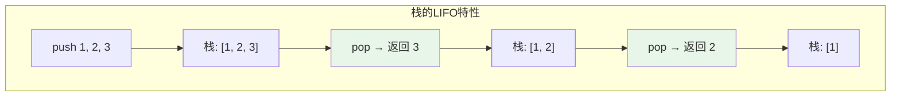
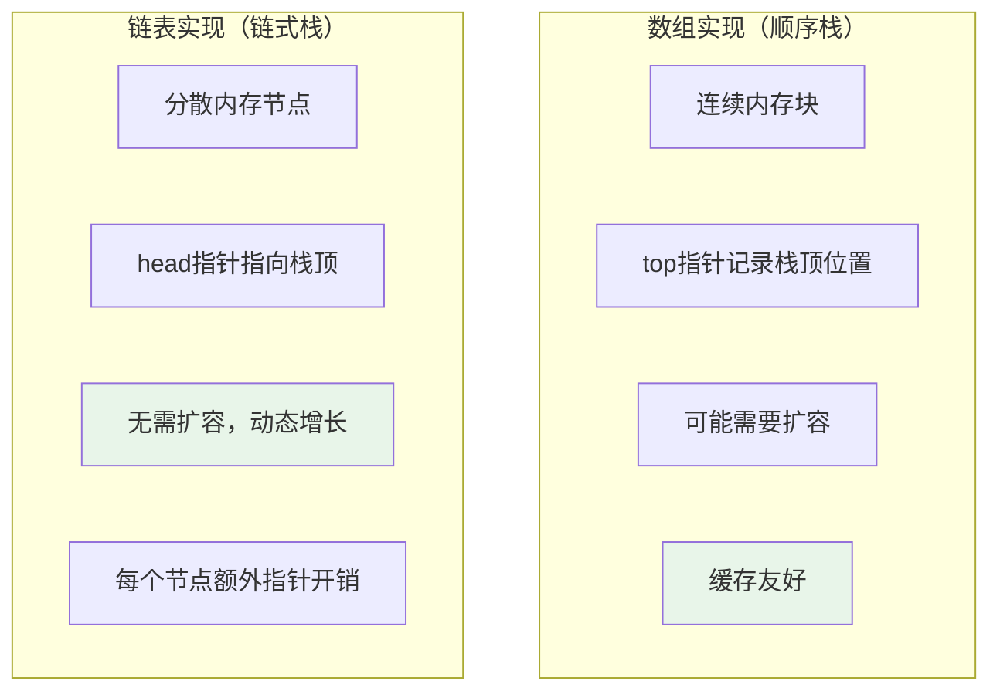
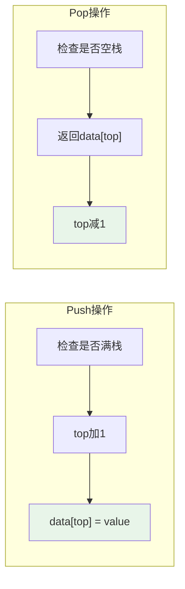
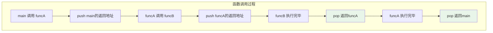
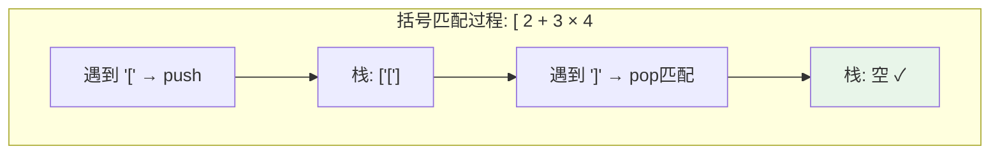
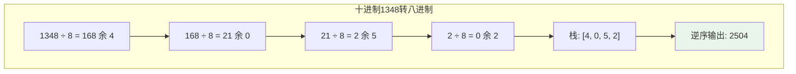

# 栈

## 概述

栈（Stack）是一种**后进先出**（LIFO: Last In First Out）的线性数据结构。栈只允许在表的一端（称为栈顶，Top）进行插入和删除操作，另一端称为栈底（Bottom）。

!!! note "栈的生活类比"
    想象一摞盘子：你只能从顶部放新盘子（push），也只能从顶部取盘子（pop）。最后放上去的盘子，最先被取走——这就是LIFO原则。

## 栈的抽象模型

```
栈的示意:

        ┌─────┐ ← 栈顶 (Top)  ← push/pop操作位置
        │  5  │
        ├─────┤
        │  4  │
        ├─────┤
        │  3  │
        ├─────┤
        │  2  │
        ├─────┤
        │  1  │ ← 栈底 (Bottom)
        └─────┘

操作序列: push(1), push(2), push(3), push(4), push(5)
```



## 栈的基本操作

| 操作 | 描述 | 时间复杂度 |
|------|------|------------|
| `push(x)` | 将元素x压入栈顶 | O(1) |
| `pop()` | 弹出栈顶元素并返回 | O(1) |
| `peek()/top()` | 返回栈顶元素（不弹出） | O(1) |
| `isEmpty()` | 判断栈是否为空 | O(1) |
| `size()` | 返回栈中元素个数 | O(1) |

## 栈的两种实现方式

### 数组实现 vs 链表实现



| 特性 | 数组实现 | 链表实现 |
|------|----------|----------|
| 空间预分配 | 需要 | 不需要 |
| 扩容代价 | O(n)复制 | 无 |
| 空间利用率 | 可能有浪费 | 每节点多一个指针 |
| 缓存友好 | 是 ✓ | 否 ✗ |
| 实现复杂度 | 简单 | 中等 |

## 数组实现（顺序栈）

### 结构设计与内存布局

```
栈的数组实现:

初始状态 (top = -1):
┌───┬───┬───┬───┬───┐
│   │   │   │   │   │
└───┴───┴───┴───┴───┘
  0   1   2   3   4
  ↑
 top = -1 (空栈)

push(10) 后 (top = 0):
┌───┬───┬───┬───┬───┐
│10 │   │   │   │   │
└───┴───┴───┴───┴───┘
  0   1   2   3   4
  ↑
 top = 0

push(20), push(30) 后 (top = 2):
┌───┬───┬───┬───┬───┐
│10 │20 │30 │   │   │
└───┴───┴───┴───┴───┘
  0   1   2   3   4
          ↑
        top = 2
```

### 完整代码实现

```c
#include <stdio.h>
#include <stdlib.h>
#include <stdbool.h>

#define MAX_SIZE 100

typedef struct {
    int data[MAX_SIZE];  // 数据存储区
    int top;              // 栈顶指针（索引）
} ArrayStack;

// 初始化栈
void initStack(ArrayStack *s) {
    s->top = -1;  // -1表示空栈
}

// 判断栈是否为空
bool isEmpty(ArrayStack *s) {
    return s->top == -1;
}

// 判断栈是否已满
bool isFull(ArrayStack *s) {
    return s->top == MAX_SIZE - 1;
}

// 入栈操作
void push(ArrayStack *s, int value) {
    if (isFull(s)) {
        printf("栈溢出 (Stack Overflow)!\n");
        return;
    }
    s->data[++s->top] = value;  // 先移动top，再存入元素
    printf("Push %d, top = %d\n", value, s->top);
}

// 出栈操作
int pop(ArrayStack *s) {
    if (isEmpty(s)) {
        printf("栈下溢 (Stack Underflow)!\n");
        return -1;
    }
    return s->data[s->top--];  // 先返回元素，再移动top
}

// 查看栈顶元素
int peek(ArrayStack *s) {
    if (isEmpty(s)) {
        printf("栈为空!\n");
        return -1;
    }
    return s->data[s->top];
}

// 获取栈的大小
int size(ArrayStack *s) {
    return s->top + 1;
}

// 打印栈内容
void printStack(ArrayStack *s) {
    if (isEmpty(s)) {
        printf("栈为空\n");
        return;
    }
    
    printf("栈内容（底→顶）: ");
    for (int i = 0; i <= s->top; i++) {
        printf("%d ", s->data[i]);
    }
    printf("\n");
}
```

### 操作示意



## 链表实现（链式栈）

### 结构设计

```
链式栈结构:

栈顶指针 head
    ↓
┌──────┐    ┌──────┐    ┌──────┐
│  30  │───→│  20  │───→│  10  │───→ NULL
│ next │    │ next │    │ next │
└──────┘    └──────┘    └──────┘
  节点3       节点2       节点1

特点：栈顶在链表头部，push/pop都是O(1)
```

### 完整代码实现

```c
#include <stdio.h>
#include <stdlib.h>
#include <stdbool.h>

// 链表节点
typedef struct StackNode {
    int data;
    struct StackNode *next;
} StackNode;

// 链式栈
typedef struct {
    StackNode *top;   // 栈顶指针（链表头）
    int size;          // 栈大小
} LinkedStack;

// 初始化栈
void initLinkedStack(LinkedStack *s) {
    s->top = NULL;
    s->size = 0;
}

// 判断栈是否为空
bool isEmptyLS(LinkedStack *s) {
    return s->top == NULL;
}

// 入栈（头插法）
void pushLS(LinkedStack *s, int value) {
    StackNode *newNode = (StackNode *)malloc(sizeof(StackNode));
    newNode->data = value;
    newNode->next = s->top;  // 新节点指向原栈顶
    s->top = newNode;         // 更新栈顶
    s->size++;
}

// 出栈
int popLS(LinkedStack *s) {
    if (isEmptyLS(s)) {
        printf("栈下溢!\n");
        return -1;
    }
    
    StackNode *temp = s->top;
    int value = temp->data;
    s->top = s->top->next;  // 栈顶下移
    free(temp);              // 释放节点
    s->size--;
    
    return value;
}

// 查看栈顶元素
int peekLS(LinkedStack *s) {
    if (isEmptyLS(s)) {
        printf("栈为空!\n");
        return -1;
    }
    return s->top->data;
}

// 释放栈内存
void freeLinkedStack(LinkedStack *s) {
    while (!isEmptyLS(s)) {
        popLS(s);
    }
}
```

## 栈的核心应用

### 1. 函数调用栈



```
调用栈示意:

┌─────────────────┐
│ funcB 的栈帧    │ ← 栈顶
├─────────────────┤
│ funcA 的栈帧    │
├─────────────────┤
│ main 的栈帧     │ ← 栈底
└─────────────────┘

每个栈帧包含:
- 返回地址
- 局部变量
- 参数
- 保存的寄存器
```

### 2. 括号匹配



```c
#include <string.h>
#include <stdbool.h>

// 括号匹配检测
bool isValidParentheses(char *s) {
    ArrayStack stack;
    initStack(&stack);
    
    for (int i = 0; s[i] != '\0'; i++) {
        char c = s[i];
        
        // 左括号入栈
        if (c == '(' || c == '[' || c == '{') {
            push(&stack, c);
        } 
        // 右括号匹配
        else if (c == ')' || c == ']' || c == '}') {
            if (isEmpty(&stack)) return false;  // 没有左括号可匹配
            
            char top = pop(&stack);
            // 检查匹配
            if ((c == ')' && top != '(') ||
                (c == ']' && top != '[') ||
                (c == '}' && top != '{')) {
                return false;  // 括号不匹配
            }
        }
    }
    
    return isEmpty(&stack);  // 栈必须为空才算完全匹配
}
```

### 3. 表达式求值

#### 后缀表达式（逆波兰表达式）

```
中缀表达式: 3 + 4 × 2 - 1
后缀表达式: 3 4 2 × + 1 -

后缀表达式求值过程:
┌────────────────────────────────────────┐
│ 输入: 3 4 2 × + 1 -                     │
├────────────────────────────────────────┤
│ 读入3:   栈: [3]                        │
│ 读入4:   栈: [3, 4]                     │
│ 读入2:   栈: [3, 4, 2]                  │
│ 读入×:   pop 2, 4; push 4×2=8; 栈: [3, 8]│
│ 读入+:   pop 8, 3; push 3+8=11; 栈: [11]│
│ 读入1:   栈: [11, 1]                    │
│ 读入-:   pop 1, 11; push 11-1=10        │
│ 结果: 10                                │
└────────────────────────────────────────┘
```

```c
#include <ctype.h>
#include <string.h>

// 后缀表达式求值
int evaluatePostfix(char *expression) {
    ArrayStack stack;
    initStack(&stack);
    
    char *token = strtok(expression, " ");
    
    while (token != NULL) {
        // 如果是数字，入栈
        if (isdigit(token[0])) {
            push(&stack, atoi(token));
        } 
        // 如果是运算符，弹出两个操作数计算
        else {
            int b = pop(&stack);  // 第二个操作数（先弹出）
            int a = pop(&stack);  // 第一个操作数
            
            switch (token[0]) {
                case '+': push(&stack, a + b); break;
                case '-': push(&stack, a - b); break;
                case '*': push(&stack, a * b); break;
                case '/': push(&stack, a / b); break;
                case '^': push(&stack, pow(a, b)); break;
            }
        }
        token = strtok(NULL, " ");
    }
    
    return pop(&stack);
}
```

#### 中缀转后缀

```c
// 获取运算符优先级
int precedence(char op) {
    switch (op) {
        case '+':
        case '-': return 1;
        case '*':
        case '/': return 2;
        case '^': return 3;
        default: return 0;
    }
}

// 中缀表达式转后缀表达式
void infixToPostfix(char *infix, char *postfix) {
    ArrayStack stack;
    initStack(&stack);
    int j = 0;
    
    for (int i = 0; infix[i] != '\0'; i++) {
        char c = infix[i];
        
        // 数字直接输出
        if (isdigit(c) || isalpha(c)) {
            postfix[j++] = c;
        }
        // 左括号入栈
        else if (c == '(') {
            push(&stack, c);
        }
        // 右括号：弹出直到遇到左括号
        else if (c == ')') {
            while (!isEmpty(&stack) && peek(&stack) != '(') {
                postfix[j++] = pop(&stack);
            }
            pop(&stack);  // 弹出左括号
        }
        // 运算符：弹出更高或相等优先级的运算符
        else {
            while (!isEmpty(&stack) && 
                   precedence(peek(&stack)) >= precedence(c)) {
                postfix[j++] = pop(&stack);
            }
            push(&stack, c);
        }
    }
    
    // 弹出剩余运算符
    while (!isEmpty(&stack)) {
        postfix[j++] = pop(&stack);
    }
    postfix[j] = '\0';
}
```

### 4. 进制转换



```c
void decimalToBase(int num, int base) {
    ArrayStack stack;
    initStack(&stack);
    
    // 不断除以base，余数入栈
    while (num > 0) {
        push(&stack, num % base);
        num /= base;
    }
    
    // 弹出所有余数，得到转换结果
    printf("转换结果: ");
    while (!isEmpty(&stack)) {
        int digit = pop(&stack);
        if (digit < 10) {
            printf("%d", digit);
        } else {
            printf("%c", 'A' + digit - 10);  // 16进制字母
        }
    }
    printf("\n");
}
```

### 5. 浏览器前进后退

```c
typedef struct {
    ArrayStack backStack;      // 后退栈
    ArrayStack forwardStack;   // 前进栈
    char current[256];          // 当前页面
} Browser;

// 访问新页面
void visit(Browser *b, char *url) {
    push(&b->backStack, b->current[0]);  // 当前页面入后退栈
    strcpy(b->current, url);
    
    // 清空前进栈
    while (!isEmpty(&b->forwardStack)) {
        pop(&b->forwardStack);
    }
}

// 后退
void back(Browser *b) {
    if (!isEmpty(&b->backStack)) {
        push(&b->forwardStack, b->current[0]);  // 当前页面入前进栈
        b->current[0] = pop(&b->backStack);     // 从后退栈取页面
    }
}

// 前进
void forward(Browser *b) {
    if (!isEmpty(&b->forwardStack)) {
        push(&b->backStack, b->current[0]);     // 当前页面入后退栈
        b->current[0] = pop(&b->forwardStack);  // 从前进栈取页面
    }
}
```

### 6. 深度优先搜索（DFS）

```c
// 使用栈实现的DFS（非递归版本）
void dfsStack(Graph *g, int start) {
    ArrayStack stack;
    initStack(&stack);
    bool visited[MAX_V] = {false};
    
    push(&stack, start);
    visited[start] = true;
    
    while (!isEmpty(&stack)) {
        int v = pop(&stack);
        printf("访问 %d\n", v);
        
        // 将未访问的邻居入栈
        for (int i = 0; i < g->n; i++) {
            if (g->adj[v][i] && !visited[i]) {
                push(&stack, i);
                visited[i] = true;
            }
        }
    }
}
```

## C++ STL stack

```cpp
#include <stack>
#include <iostream>

int main() {
    std::stack<int> s;
    
    // 入栈
    s.push(1);
    s.push(2);
    s.push(3);
    
    // 查看栈顶
    std::cout << "栈顶: " << s.top() << std::endl;  // 3
    
    // 出栈
    s.pop();
    std::cout << "栈顶: " << s.top() << std::endl;  // 2
    
    // 栈大小和判空
    std::cout << "大小: " << s.size() << std::endl;   // 2
    std::cout << "是否为空: " << s.empty() << std::endl;  // 0 (false)
    
    return 0;
}
```

## 栈的变体

### 1. 最小栈（Min Stack）

在O(1)时间内获取栈中最小元素。

```c
typedef struct {
    ArrayStack data;  // 主栈
    ArrayStack min;   // 辅助栈，存储每个位置的最小值
} MinStack;

void minStackPush(MinStack *ms, int value) {
    push(&ms->data, value);
    
    // 辅助栈存储当前位置的最小值
    if (isEmpty(&ms->min) || value <= peek(&ms->min)) {
        push(&ms->min, value);
    } else {
        push(&ms->min, peek(&ms->min));
    }
}

int getMin(MinStack *ms) {
    return peek(&ms->min);
}
```

### 2. 双端栈

使用一个数组实现两个栈。

```
数组两端分别作为两个栈的栈底:

栈1 grows →        ← grows 栈2
┌───┬───┬───┬───┬───┬───┬───┬───┐
│ 1 │ 2 │   │   │   │   │ 6 │ 5 │
└───┴───┴───┴───┴───┴───┴───┴───┘
      ↑                 ↑
    top1              top2
```

## 常见问题与陷阱

### 1. 栈溢出

递归深度过大或栈空间不足：

```c
// 危险：可能导致栈溢出
void infiniteRecursion() {
    infiniteRecursion();  // 无限递归
}
```

### 2. 栈下溢

对空栈执行pop操作：

```c
ArrayStack s;
initStack(&s);
int x = pop(&s);  // 栈下溢！
```

## 空间复杂度

- 数组实现：O(n)，其中n为栈的最大容量
- 链表实现：O(n)，其中n为栈中元素个数

## 时间复杂度汇总

| 操作 | 时间复杂度 | 说明 |
|------|------------|------|
| push | O(1) | 直接操作栈顶 |
| pop | O(1) | 直接操作栈顶 |
| peek | O(1) | 直接访问栈顶 |
| isEmpty | O(1) | 检查top指针 |
| size | O(1) | 返回计数器或top+1 |

## 参考资料

- 《算法导论》第10章 - 栈
- 《数据结构与算法分析》- Mark Allen Weiss
- [Stack (abstract data type) - Wikipedia](https://en.wikipedia.org/wiki/Stack_(abstract_data_type))
- 《CSAPP》第3章 - 运行时栈
