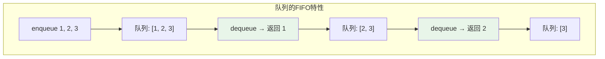
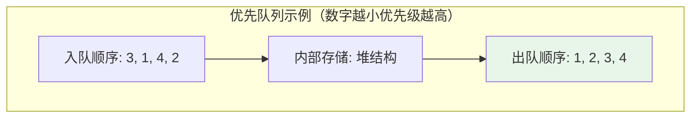
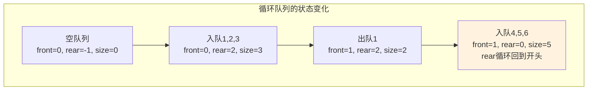
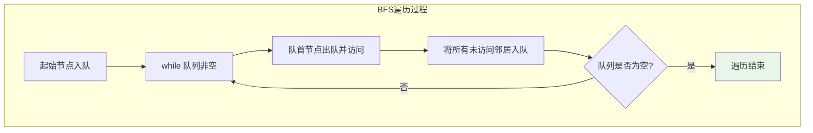
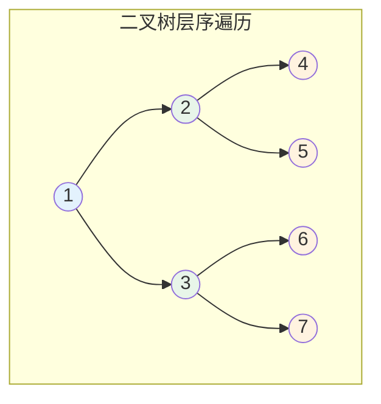
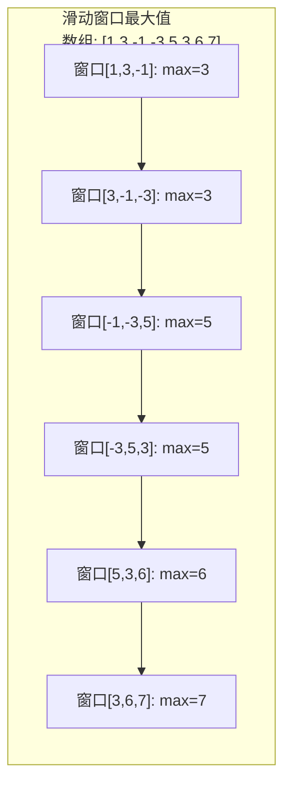

# 队列

## 概述

队列（Queue）是一种**先进先出**（FIFO: First In First Out）的线性数据结构。队列在一端（队尾，Rear）插入元素，在另一端（队首，Front）删除元素，就像现实生活中排队等候一样。

!!! note "队列的生活类比"
    想象在银行排队取款：先来的人排在前面，后来的人排在后面。服务时，总是先服务排在最前面的人——这就是FIFO原则。

## 队列的抽象模型

<div style="background-color: #F5F5F5; padding: 20px; margin: 10px 0; border-radius: 8px;">
    <p style="margin: 0 0 15px 0; font-weight: bold; color: #1976D2;">队列结构示意</p>
    <div style="margin-bottom: 20px; text-align: center;">
        <div style="display: flex; justify-content: center; align-items: center; gap: 10px; margin-bottom: 10px;">
            <div style="text-align: center;">
                <div style="color: #F44336; font-weight: bold; font-size: 14px;">dequeue</div>
                <div style="font-size: 24px; color: #F44336;">←</div>
            </div>
            <div style="display: flex; gap: 2px;">
                <div style="width: 50px; height: 50px; background: #E3F2FD; border: 2px solid #2196F3; display: flex; align-items: center; justify-content: center; font-weight: bold; font-size: 16px;">1</div>
                <div style="width: 50px; height: 50px; background: #E3F2FD; border: 2px solid #2196F3; display: flex; align-items: center; justify-content: center; font-weight: bold; font-size: 16px;">2</div>
                <div style="width: 50px; height: 50px; background: #E3F2FD; border: 2px solid #2196F3; display: flex; align-items: center; justify-content: center; font-weight: bold; font-size: 16px;">3</div>
                <div style="width: 50px; height: 50px; background: #E3F2FD; border: 2px solid #2196F3; display: flex; align-items: center; justify-content: center; font-weight: bold; font-size: 16px;">4</div>
                <div style="width: 50px; height: 50px; background: #E8F5E9; border: 2px solid #4CAF50; display: flex; align-items: center; justify-content: center; font-weight: bold; font-size: 16px;">5</div>
            </div>
            <div style="text-align: center;">
                <div style="font-size: 24px; color: #4CAF50;">→</div>
                <div style="color: #4CAF50; font-weight: bold; font-size: 14px;">enqueue</div>
            </div>
        </div>
        <div style="display: flex; justify-content: center; gap: 2px;">
            <div style="width: 50px; text-align: center;">
                <div style="color: #F44336; font-size: 20px;">↑</div>
                <div style="font-size: 11px; color: #F44336; font-weight: bold;">队首</div>
                <div style="font-size: 10px; color: #666;">(Front)</div>
            </div>
            <div style="width: 50px;"></div>
            <div style="width: 50px;"></div>
            <div style="width: 50px;"></div>
            <div style="width: 50px; text-align: center;">
                <div style="color: #4CAF50; font-size: 20px;">↑</div>
                <div style="font-size: 11px; color: #4CAF50; font-weight: bold;">队尾</div>
                <div style="font-size: 10px; color: #666;">(Rear)</div>
            </div>
        </div>
    </div>
    <div style="background: #E8F5E9; padding: 12px; border-radius: 5px;">
        <div style="margin-bottom: 8px;">
            <span style="font-weight: bold; color: #4CAF50;">操作序列:</span> 
            <code style="background: white; padding: 2px 6px; border-radius: 3px; margin: 0 2px;">enqueue(1)</code>→
            <code style="background: white; padding: 2px 6px; border-radius: 3px; margin: 0 2px;">enqueue(2)</code>→
            <code style="background: white; padding: 2px 6px; border-radius: 3px; margin: 0 2px;">enqueue(3)</code>→
            <code style="background: white; padding: 2px 6px; border-radius: 3px; margin: 0 2px;">enqueue(4)</code>→
            <code style="background: white; padding: 2px 6px; border-radius: 3px; margin: 0 2px;">enqueue(5)</code>
        </div>
        <div>
            <span style="font-weight: bold; color: #F44336;">出队顺序:</span> 
            <code style="background: white; padding: 2px 6px; border-radius: 3px; margin: 0 2px;">dequeue() → 1</code>→
            <code style="background: white; padding: 2px 6px; border-radius: 3px; margin: 0 2px;">dequeue() → 2</code>→
            <code style="background: white; padding: 2px 6px; border-radius: 3px; margin: 0 2px;">dequeue() → 3</code>→...
        </div>
    </div>
</div>



## 队列的基本操作

| 操作 | 描述 | 时间复杂度 |
|------|------|------------|
| `enqueue(x)` / `push(x)` | 将元素x入队（队尾） | O(1) |
| `dequeue()` / `pop()` | 出队（队首）并返回 | O(1) |
| `front()` / `peek()` | 返回队首元素（不出队） | O(1) |
| `back()` | 返回队尾元素 | O(1) |
| `isEmpty()` | 判断队列是否为空 | O(1) |
| `size()` | 返回队列元素个数 | O(1) |

## 队列类型详解

### 1. 普通队列（Simple Queue）

最基本的FIFO队列，一端入队，另一端出队。

### 2. 循环队列（Circular Queue）

将队列首尾相连，形成环形结构，充分利用数组空间。

<div style="background-color: #FFF3E0; padding: 20px; margin: 10px 0; border-left: 4px solid #FF9800; border-radius: 8px;">
    <p style="margin: 0 0 15px 0; font-weight: bold; color: #FF9800;">⚠️ 普通队列的问题</p>
    
    <div style="margin-bottom: 15px; padding: 10px; background: white; border-radius: 5px;">
        <p style="margin: 0 0 8px 0; color: #666;"><strong>初始:</strong> [_, _, _, _, _]  front=0, rear=-1</p>
        <p style="margin: 0 0 8px 0; color: #666;"><strong>入队5个:</strong> [1, 2, 3, 4, 5]  front=0, rear=4</p>
        <p style="margin: 0; color: #666;"><strong>出队3个:</strong> [_, _, _, 4, 5]  front=3, rear=4</p>
    </div>
    
    <p style="margin: 0; color: #F44336; font-weight: bold;">此时rear已到数组末尾，但前面有空位却无法利用！</p>
</div>

<div style="background-color: #E8F5E9; padding: 20px; margin: 10px 0; border-left: 4px solid #4CAF50; border-radius: 8px;">
    <p style="margin: 0 0 15px 0; font-weight: bold; color: #4CAF50;">✓ 循环队列解决</p>
    
    <div style="display: flex; align-items: center; gap: 10px; margin-bottom: 10px;">
        <span style="color: #666;">入队6:</span>
        <div style="width: 50px; height: 45px; background: #E8F5E9; border: 2px solid #4CAF50; display: flex; align-items: center; justify-content: center; font-weight: bold;">6</div>
        <span style="color: #2196F3;">→ rear回到开头</span>
    </div>
    
    <div style="display: flex; gap: 2px; margin-bottom: 10px;">
        <div style="width: 50px; height: 45px; background: #E8F5E9; border: 2px solid #4CAF50; display: flex; align-items: center; justify-content: center; font-weight: bold;">6</div>
        <div style="width: 50px; height: 45px; background: white; border: 2px dashed #CCC; display: flex; align-items: center; justify-content: center;"></div>
        <div style="width: 50px; height: 45px; background: white; border: 2px dashed #CCC; display: flex; align-items: center; justify-content: center;"></div>
        <div style="width: 50px; height: 45px; background: #E3F2FD; border: 2px solid #2196F3; display: flex; align-items: center; justify-content: center; font-weight: bold;">4</div>
        <div style="width: 50px; height: 45px; background: #E3F2FD; border: 2px solid #2196F3; display: flex; align-items: center; justify-content: center; font-weight: bold;">5</div>
    </div>
    
    <div style="display: flex; gap: 2px;">
        <div style="width: 50px; text-align: center;">
            <div style="color: #4CAF50; font-size: 18px;">↑</div>
            <div style="font-size: 10px; color: #4CAF50;">rear=0</div>
        </div>
        <div style="width: 50px;"></div>
        <div style="width: 50px;"></div>
        <div style="width: 50px; text-align: center;">
            <div style="color: #2196F3; font-size: 18px;">↑</div>
            <div style="font-size: 10px; color: #2196F3;">front=3</div>
        </div>
    </div>
    
    <p style="margin: 15px 0 0 0; color: #666;"><strong>实际存储:</strong> [6, _, _, 4, 5]  <strong>逻辑上:</strong> [4, 5, 6]</p>
</div>

### 3. 双端队列（Deque, Double-Ended Queue）

两端都可以进行入队和出队操作。

<div style="background-color: #F5F5F5; padding: 20px; margin: 10px 0; border-radius: 8px;">
    <p style="margin: 0 0 15px 0; font-weight: bold; color: #1976D2;">双端队列示意</p>
    
    <div style="text-align: center;">
        <div style="display: flex; justify-content: space-between; align-items: center; margin-bottom: 15px;">
            <div style="text-align: center;">
                <div style="color: #4CAF50; font-weight: bold;">pushFront</div>
                <div style="font-size: 24px; color: #4CAF50;">↓</div>
            </div>
            <div style="text-align: center;">
                <div style="font-size: 24px; color: #2196F3;">↓</div>
                <div style="color: #2196F3; font-weight: bold;">pushBack</div>
            </div>
        </div>
        
        <div style="display: flex; justify-content: center; align-items: center;">
            <span style="font-size: 32px; color: #4CAF50; margin-right: 10px;">←</span>
            <div style="display: flex; gap: 2px;">
                <div style="width: 50px; height: 50px; background: #E3F2FD; border: 2px solid #2196F3; display: flex; align-items: center; justify-content: center; font-weight: bold; font-size: 16px;">1</div>
                <div style="width: 50px; height: 50px; background: #E3F2FD; border: 2px solid #2196F3; display: flex; align-items: center; justify-content: center; font-weight: bold; font-size: 16px;">2</div>
                <div style="width: 50px; height: 50px; background: #E3F2FD; border: 2px solid #2196F3; display: flex; align-items: center; justify-content: center; font-weight: bold; font-size: 16px;">3</div>
                <div style="width: 50px; height: 50px; background: #E3F2FD; border: 2px solid #2196F3; display: flex; align-items: center; justify-content: center; font-weight: bold; font-size: 16px;">4</div>
                <div style="width: 50px; height: 50px; background: #E3F2FD; border: 2px solid #2196F3; display: flex; align-items: center; justify-content: center; font-weight: bold; font-size: 16px;">5</div>
            </div>
            <span style="font-size: 32px; color: #F44336; margin-left: 10px;">→</span>
        </div>
        
        <div style="display: flex; justify-content: space-between; align-items: center; margin-top: 15px;">
            <div style="text-align: center;">
                <div style="font-size: 24px; color: #F44336;">↑</div>
                <div style="color: #F44336; font-weight: bold;">popFront</div>
            </div>
            <div style="text-align: center;">
                <div style="color: #9C27B0; font-weight: bold;">popBack</div>
                <div style="font-size: 24px; color: #9C27B0;">↑</div>
            </div>
        </div>
    </div>
</div>

### 4. 优先队列（Priority Queue）

元素按优先级出队，而非按入队顺序。通常用堆实现。



## 数组实现（循环队列）

### 循环队列的设计思想



### 循环索引计算

```
索引计算公式（取模实现循环）:

下一个位置 = (当前位置 + 1) % 容量

示例（容量=5）:
- (4 + 1) % 5 = 0  // 从末尾循环到开头
- (2 + 1) % 5 = 3  // 正常前进
```

### 完整实现

=== "C"

    ```c
    #include <stdio.h>
    #include <stdbool.h>

    #define MAX_SIZE 5  // 便于演示循环效果

    typedef struct {
        int data[MAX_SIZE];
        int front;    // 队首指针
        int rear;     // 队尾指针
        int size;     // 当前元素个数（用于区分空/满）
    } CircularQueue;

    // 初始化队列
    void initQueue(CircularQueue *q) {
        q->front = 0;
        q->rear = -1;
        q->size = 0;
    }

    // 判断队列是否为空
    bool isEmpty(CircularQueue *q) {
        return q->size == 0;
    }

    // 判断队列是否已满
    bool isFull(CircularQueue *q) {
        return q->size == MAX_SIZE;
    }

    // 入队操作
    void enqueue(CircularQueue *q, int value) {
        if (isFull(q)) {
            printf("队列已满，无法入队!\n");
            return;
        }
        
        q->rear = (q->rear + 1) % MAX_SIZE;
        q->data[q->rear] = value;
        q->size++;
    }

    // 出队操作
    int dequeue(CircularQueue *q) {
        if (isEmpty(q)) {
            printf("队列为空，无法出队!\n");
            return -1;
        }
        
        int value = q->data[q->front];
        q->front = (q->front + 1) % MAX_SIZE;
        q->size--;
        return value;
    }

    // 查看队首元素
    int front(CircularQueue *q) {
        if (isEmpty(q)) {
            printf("队列为空!\n");
            return -1;
        }
        return q->data[q->front];
    }

    // 查看队尾元素
    int rear(CircularQueue *q) {
        if (isEmpty(q)) {
            printf("队列为空!\n");
            return -1;
        }
        return q->data[q->rear];
    }
    ```

=== "C++"

    ```cpp
    #include <queue>
    #include <iostream>

    int main() {
        // 使用STL queue
        std::queue<int> q;
        
        q.push(1);
        q.push(2);
        q.push(3);
        
        std::cout << "队首: " << q.front() << std::endl;  // 1
        std::cout << "队尾: " << q.back() << std::endl;   // 3
        
        q.pop();
        std::cout << "队首: " << q.front() << std::endl;  // 2
        
        return 0;
    }
    ```

=== "Python"

    ```python
    from collections import deque

    # 使用deque作为队列（推荐）
    q = deque()

    # 入队
    q.append(1)
    q.append(2)
    q.append(3)

    # 访问队首和队尾
    print(f"队首: {q[0]}")      # 1
    print(f"队尾: {q[-1]}")     # 3

    # 出队
    print(q.popleft())          # 1

    # 自定义循环队列
    class CircularQueue:
        def __init__(self, capacity):
            self.data = [0] * capacity
            self.front = 0
            self.rear = -1
            self.size = 0
            self.capacity = capacity
        
        def enqueue(self, value):
            if self.size == self.capacity:
                raise Exception("队列已满")
            self.rear = (self.rear + 1) % self.capacity
            self.data[self.rear] = value
            self.size += 1
        
        def dequeue(self):
            if self.size == 0:
                raise Exception("队列为空")
            value = self.data[self.front]
            self.front = (self.front + 1) % self.capacity
            self.size -= 1
            return value
        
        def get_front(self):
            if self.size == 0:
                raise Exception("队列为空")
            return self.data[self.front]
    ```

=== "Java"

    ```java
    import java.util.LinkedList;
    import java.util.Queue;

    public class QueueDemo {
        public static void main(String[] args) {
            // 使用LinkedList作为队列
            Queue<Integer> q = new LinkedList<>();
            
            q.offer(1);
            q.offer(2);
            q.offer(3);
            
            System.out.println("队首: " + q.peek());  // 1
            
            System.out.println(q.poll());  // 1
            System.out.println(q.poll());  // 2
        }
    }

    // 自定义循环队列
    class CircularQueue {
        private int[] data;
        private int front;
        private int rear;
        private int size;
        private int capacity;
        
        public CircularQueue(int capacity) {
            this.capacity = capacity;
            this.data = new int[capacity];
            this.front = 0;
            this.rear = -1;
            this.size = 0;
        }
        
        public void enqueue(int value) {
            if (size == capacity) throw new RuntimeException("队列已满");
            rear = (rear + 1) % capacity;
            data[rear] = value;
            size++;
        }
        
        public int dequeue() {
            if (size == 0) throw new RuntimeException("队列为空");
            int value = data[front];
            front = (front + 1) % capacity;
            size--;
            return value;
        }
        
        public int front() {
            if (size == 0) throw new RuntimeException("队列为空");
            return data[front];
        }
    }
    ```

=== "Go"

    ```go
    package main

    import "fmt"

    // 循环队列
    type CircularQueue struct {
        data     []int
        front    int
        rear     int
        size     int
        capacity int
    }

    func NewCircularQueue(capacity int) *CircularQueue {
        return &CircularQueue{
            data:     make([]int, capacity),
            front:    0,
            rear:     -1,
            size:     0,
            capacity: capacity,
        }
    }

    func (q *CircularQueue) Enqueue(value int) error {
        if q.size == q.capacity {
            return fmt.Errorf("队列已满")
        }
        q.rear = (q.rear + 1) % q.capacity
        q.data[q.rear] = value
        q.size++
        return nil
    }

    func (q *CircularQueue) Dequeue() (int, error) {
        if q.size == 0 {
            return 0, fmt.Errorf("队列为空")
        }
        value := q.data[q.front]
        q.front = (q.front + 1) % q.capacity
        q.size--
        return value, nil
    }

    func (q *CircularQueue) Front() (int, error) {
        if q.size == 0 {
            return 0, fmt.Errorf("队列为空")
        }
        return q.data[q.front], nil
    }

    func main() {
        q := NewCircularQueue(5)
        q.Enqueue(1)
        q.Enqueue(2)
        
        val, _ := q.Dequeue()
        fmt.Println(val)  // 1
    }
    ```

=== "Rust"

    ```rust
    use std::collections::VecDeque;

    fn main() {
        // 使用VecDeque作为队列
        let mut q: VecDeque<i32> = VecDeque::new();
        
        q.push_back(1);
        q.push_back(2);
        q.push_back(3);
        
        println!("队首: {:?}", q.front());  // Some(1)
        
        println!("{:?}", q.pop_front());  // Some(1)
        println!("{:?}", q.pop_front());  // Some(2)
    }

    // 自定义循环队列
    struct CircularQueue {
        data: Vec<i32>,
        front: usize,
        rear: isize,
        size: usize,
        capacity: usize,
    }

    impl CircularQueue {
        fn new(capacity: usize) -> Self {
            CircularQueue {
                data: vec![0; capacity],
                front: 0,
                rear: -1,
                size: 0,
                capacity,
            }
        }
        
        fn enqueue(&mut self, value: i32) -> Result<(), &'static str> {
            if self.size == self.capacity {
                return Err("队列已满");
            }
            self.rear = ((self.rear + 1) as usize % self.capacity) as isize;
            self.data[self.rear as usize] = value;
            self.size += 1;
            Ok(())
        }
        
        fn dequeue(&mut self) -> Result<i32, &'static str> {
            if self.size == 0 {
                return Err("队列为空");
            }
            let value = self.data[self.front];
            self.front = (self.front + 1) % self.capacity;
            self.size -= 1;
            Ok(value)
        }
    }
    ```

### 循环队列的空/满判断

有三种方法区分队列空和满：

| 方法 | 描述 | 优缺点 |
|------|------|--------|
| 计数器法 | 用size变量记录元素个数 | 推荐，最简单 |
| 牺牲单元 | 数组留一个空位不存储 | 浪费一个空间 |
| 标志位法 | 用tag标记最后操作是入队/出队 | 稍复杂 |

## 链表实现（链式队列）

### 结构设计

```
链式队列结构:

front指针                              rear指针
    ↓                                      ↓
┌──────┐    ┌──────┐    ┌──────┐    ┌──────┐
│  1   │───→│  2   │───→│  3   │───→│  4   │───→ NULL
│ next │    │ next │    │ next │    │ next │
└──────┘    └──────┘    └──────┘    └──────┘
  队首                                    队尾

特点：
- 入队：在rear后插入新节点，O(1)
- 出队：删除front节点，O(1)
- 无需扩容，动态增长
```

### 完整实现

```c
#include <stdio.h>
#include <stdlib.h>
#include <stdbool.h>

// 链表节点
typedef struct QNode {
    int data;
    struct QNode *next;
} QNode;

// 链式队列
typedef struct {
    QNode *front;  // 队首指针
    QNode *rear;   // 队尾指针
    int size;       // 队列大小
} LinkedQueue;

// 初始化队列
void initLQueue(LinkedQueue *q) {
    q->front = NULL;
    q->rear = NULL;
    q->size = 0;
}

// 判断队列是否为空
bool isEmptyLQ(LinkedQueue *q) {
    return q->front == NULL;
}

// 入队操作（在队尾插入）
void enqueueLQ(LinkedQueue *q, int value) {
    QNode *newNode = (QNode *)malloc(sizeof(QNode));
    newNode->data = value;
    newNode->next = NULL;
    
    if (isEmptyLQ(q)) {
        // 空队列：新节点既是队首也是队尾
        q->front = newNode;
        q->rear = newNode;
    } else {
        // 非空：追加到队尾
        q->rear->next = newNode;
        q->rear = newNode;
    }
    q->size++;
}

// 出队操作（从队首删除）
int dequeueLQ(LinkedQueue *q) {
    if (isEmptyLQ(q)) {
        printf("队列为空!\n");
        return -1;
    }
    
    QNode *temp = q->front;
    int value = temp->data;
    
    q->front = q->front->next;  // 队首后移
    
    if (q->front == NULL) {
        // 如果队首变为空，队尾也要置空
        q->rear = NULL;
    }
    
    free(temp);
    q->size--;
    return value;
}

// 查看队首元素
int frontLQ(LinkedQueue *q) {
    if (isEmptyLQ(q)) {
        printf("队列为空!\n");
        return -1;
    }
    return q->front->data;
}

// 释放队列内存
void freeLQueue(LinkedQueue *q) {
    while (!isEmptyLQ(q)) {
        dequeueLQ(q);
    }
}
```

## 双端队列（Deque）

### 结构示意

```
双端队列（双链表实现）:

         pushFront()                  pushBack()
             ↓                            ↓
         ←───────                    ───────→
NULL ←─┬──────┬─←→─┬──────┬─←→─┬──────┬─→ NULL
       │ prev │     │ prev │     │ prev │
       │  2   │     │  3   │     │  4   │
       │ next │     │ next │     │ next │
       └──────┘     └──────┘     └──────┘
         ↑                            ↑
       front                        rear
         ↓                            ↓
     popFront()                   popBack()
```

### 完整实现

```c
// 双链表节点
typedef struct DQNode {
    int data;
    struct DQNode *prev;
    struct DQNode *next;
} DQNode;

// 双端队列
typedef struct {
    DQNode *front;
    DQNode *rear;
    int size;
} Deque;

// 初始化双端队列
void initDeque(Deque *dq) {
    dq->front = NULL;
    dq->rear = NULL;
    dq->size = 0;
}

// 从队首入队
void pushFront(Deque *dq, int value) {
    DQNode *newNode = (DQNode *)malloc(sizeof(DQNode));
    newNode->data = value;
    newNode->prev = NULL;
    newNode->next = dq->front;
    
    if (dq->front == NULL) {
        dq->rear = newNode;
    } else {
        dq->front->prev = newNode;
    }
    dq->front = newNode;
    dq->size++;
}

// 从队尾入队
void pushBack(Deque *dq, int value) {
    DQNode *newNode = (DQNode *)malloc(sizeof(DQNode));
    newNode->data = value;
    newNode->next = NULL;
    newNode->prev = dq->rear;
    
    if (dq->rear == NULL) {
        dq->front = newNode;
    } else {
        dq->rear->next = newNode;
    }
    dq->rear = newNode;
    dq->size++;
}

// 从队首出队
int popFront(Deque *dq) {
    if (dq->front == NULL) return -1;
    
    DQNode *temp = dq->front;
    int value = temp->data;
    
    dq->front = dq->front->next;
    if (dq->front == NULL) {
        dq->rear = NULL;
    } else {
        dq->front->prev = NULL;
    }
    
    free(temp);
    dq->size--;
    return value;
}

// 从队尾出队
int popBack(Deque *dq) {
    if (dq->rear == NULL) return -1;
    
    DQNode *temp = dq->rear;
    int value = temp->data;
    
    dq->rear = dq->rear->prev;
    if (dq->rear == NULL) {
        dq->front = NULL;
    } else {
        dq->rear->next = NULL;
    }
    
    free(temp);
    dq->size--;
    return value;
}
```

## 队列的核心应用

### 1. 广度优先搜索（BFS）



```
BFS示例（从A开始）:

      A
     /|\
    B C D
    |   |
    E   F

队列状态变化:
1. 入队A:       队列: [A]
2. 出队A,入队BCD: 队列: [B, C, D]
3. 出队B,入队E:  队列: [C, D, E]
4. 出队C:        队列: [D, E]
5. 出队D,入队F:  队列: [E, F]
6. 出队E:        队列: [F]
7. 出队F:        队列: []

访问顺序: A → B → C → D → E → F
```

```c
#define MAX_V 100

typedef struct {
    int adj[MAX_V][MAX_V];
    int n;
} Graph;

void bfs(Graph *g, int start) {
    bool visited[MAX_V] = {false};
    CircularQueue q;
    initQueue(&q);
    
    visited[start] = true;
    enqueue(&q, start);
    
    printf("BFS遍历顺序: ");
    
    while (!isEmpty(&q)) {
        int v = dequeue(&q);
        printf("%d ", v);
        
        // 将所有未访问的邻居入队
        for (int i = 0; i < g->n; i++) {
            if (g->adj[v][i] && !visited[i]) {
                visited[i] = true;
                enqueue(&q, i);
            }
        }
    }
    printf("\n");
}
```

### 2. 层序遍历二叉树



```
层序遍历过程:
第1层: [1]
第2层: [2, 3]
第3层: [4, 5, 6, 7]

输出: 1 2 3 4 5 6 7
```

```c
typedef struct TreeNode {
    int val;
    struct TreeNode *left;
    struct TreeNode *right;
} TreeNode;

void levelOrder(TreeNode *root) {
    if (root == NULL) return;
    
    LinkedQueue q;
    initLQueue(&q);
    enqueueLQ(&q, (int)root);  // 存储指针（转为int）
    
    printf("层序遍历: ");
    
    while (!isEmptyLQ(&q)) {
        TreeNode *node = (TreeNode*)dequeueLQ(&q);
        printf("%d ", node->val);
        
        if (node->left != NULL) {
            enqueueLQ(&q, (int)node->left);
        }
        if (node->right != NULL) {
            enqueueLQ(&q, (int)node->right);
        }
    }
    printf("\n");
}

// 带层级信息的层序遍历
void levelOrderWithLevel(TreeNode *root) {
    if (root == NULL) return;
    
    LinkedQueue q;
    initLQueue(&q);
    enqueueLQ(&q, (int)root);
    
    int level = 0;
    while (!isEmptyLQ(&q)) {
        int levelSize = q.size;
        printf("第%d层: ", ++level);
        
        for (int i = 0; i < levelSize; i++) {
            TreeNode *node = (TreeNode*)dequeueLQ(&q);
            printf("%d ", node->val);
            
            if (node->left) enqueueLQ(&q, (int)node->left);
            if (node->right) enqueueLQ(&q, (int)node->right);
        }
        printf("\n");
    }
}
```

### 3. 滑动窗口最大值（单调队列）



```c
// 使用双端队列实现单调递减队列
void maxSlidingWindow(int *nums, int n, int k) {
    Deque dq;  // 存储索引
    initDeque(&dq);
    
    printf("滑动窗口最大值: ");
    
    for (int i = 0; i < n; i++) {
        // 移除窗口外的元素
        while (dq.size > 0 && dq.front->data <= i - k) {
            popFront(&dq);
        }
        
        // 维护单调递减：移除所有比当前元素小的元素
        while (dq.size > 0 && nums[dq.rear->data] < nums[i]) {
            popBack(&dq);
        }
        
        pushBack(&dq, i);
        
        // 窗口形成后输出最大值
        if (i >= k - 1) {
            printf("%d ", nums[dq.front->data]);
        }
    }
    printf("\n");
}
```

### 4. 任务调度

```c
typedef struct {
    int id;
    int priority;
    int arrivalTime;
    int burstTime;
} Task;

// FCFS（先来先服务）调度
void fcfsSchedule(Task tasks[], int n) {
    LinkedQueue q;
    initLQueue(&q);
    
    // 所有任务按到达顺序入队
    for (int i = 0; i < n; i++) {
        enqueueLQ(&q, i);
    }
    
    int currentTime = 0;
    printf("FCFS调度顺序:\n");
    
    while (!isEmptyLQ(&q)) {
        int taskIdx = dequeueLQ(&q);
        Task *t = &tasks[taskIdx];
        
        if (currentTime < t->arrivalTime) {
            currentTime = t->arrivalTime;
        }
        
        printf("时间%d: 执行任务%d\n", currentTime, t->id);
        currentTime += t->burstTime;
        printf("时间%d: 任务%d完成\n", currentTime, t->id);
    }
}
```

### 5. 消息队列

```c
typedef struct {
    int sender;
    int receiver;
    char content[256];
    int timestamp;
} Message;

typedef struct {
    Message messages[100];
    int front, rear, size;
} MessageQueue;

void sendMessage(MessageQueue *mq, Message msg) {
    if (mq->size >= 100) {
        printf("消息队列已满!\n");
        return;
    }
    mq->rear = (mq->rear + 1) % 100;
    mq->messages[mq->rear] = msg;
    mq->size++;
}

Message receiveMessage(MessageQueue *mq) {
    if (mq->size == 0) {
        Message empty = {0};
        return empty;
    }
    Message msg = mq->messages[mq->front];
    mq->front = (mq->front + 1) % 100;
    mq->size--;
    return msg;
}
```

## 时间复杂度汇总

| 操作 | 普通队列 | 循环队列 | 链式队列 | 双端队列 |
|------|----------|----------|----------|----------|
| 入队 | O(1) | O(1) | O(1) | O(1) |
| 出队 | O(1) | O(1) | O(1) | O(1) |
| 查看队首 | O(1) | O(1) | O(1) | O(1) |
| 查看队尾 | O(n) | O(1) | O(1) | O(1) |
| 判空 | O(1) | O(1) | O(1) | O(1) |

## 空间复杂度

| 实现方式 | 空间复杂度 | 说明 |
|----------|------------|------|
| 数组实现 | O(n) | n为预分配容量 |
| 链表实现 | O(m) | m为实际元素个数 |
| 循环队列 | O(n) | n为预分配容量 |

## 栈 vs 队列对比

| 特性 | 栈 | 队列 |
|------|-----|------|
| 操作原则 | LIFO（后进先出） | FIFO（先进先出） |
| 操作位置 | 同一端（栈顶） | 两端（队首出，队尾入） |
| 生活类比 | 一摞盘子 | 排队取款 |
| 典型应用 | 函数调用、表达式求值、DFS | BFS、层序遍历、任务调度 |

## C++ STL

### std::queue

```cpp
#include <queue>
#include <iostream>

int main() {
    std::queue<int> q;
    
    q.push(1);
    q.push(2);
    q.push(3);
    
    std::cout << "队首: " << q.front() << std::endl;  // 1
    std::cout << "队尾: " << q.back() << std::endl;   // 3
    
    q.pop();
    std::cout << "队首: " << q.front() << std::endl;  // 2
    
    std::cout << "大小: " << q.size() << std::endl;   // 2
    
    return 0;
}
```

### std::deque

```cpp
#include <deque>
#include <iostream>

int main() {
    std::deque<int> dq;
    
    dq.push_back(2);    // [2]
    dq.push_front(1);   // [1, 2]
    dq.push_back(3);    // [1, 2, 3]
    
    std::cout << "front: " << dq.front() << std::endl;  // 1
    std::cout << "back: " << dq.back() << std::endl;    // 3
    
    dq.pop_front();     // [2, 3]
    dq.pop_back();      // [2]
    
    return 0;
}
```

## 常见问题与陷阱

### 1. 循环队列的假溢出

```c
// 错误：不用size变量，仅靠front==rear判断空/满
// 无法区分空队列和满队列
bool badIsEmpty(CircularQueue *q) {
    return q->front == q->rear;  // 空和满都是true！
}
```

### 2. 链式队列忘记更新rear

```c
// 错误：出队最后一个元素后rear指向已释放的内存
int badDequeue(LinkedQueue *q) {
    QNode *temp = q->front;
    int value = temp->data;
    q->front = q->front->next;
    free(temp);
    // 忘记处理：如果front变为NULL，rear也应为NULL
    return value;
}
```

## 参考资料

- 《算法导论》第10章 - 队列
- 《数据结构与算法分析》- Mark Allen Weiss
- [Queue (abstract data type) - Wikipedia](https://en.wikipedia.org/wiki/Queue_(abstract_data_type))
- [Circular Buffer - Wikipedia](https://en.wikipedia.org/wiki/Circular_buffer)
