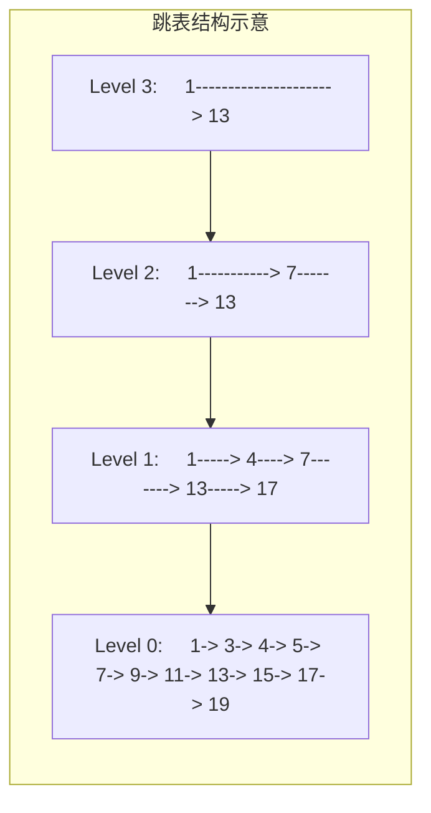
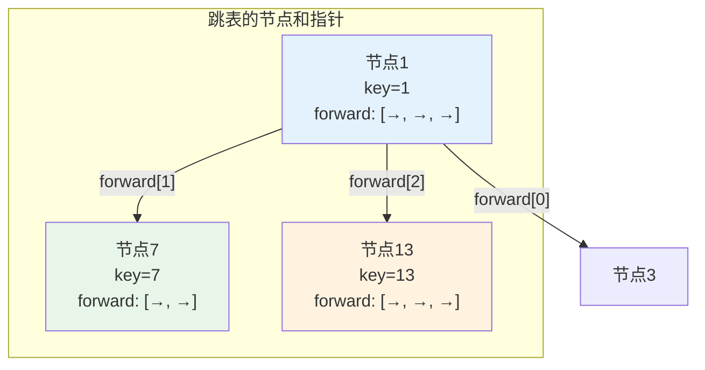
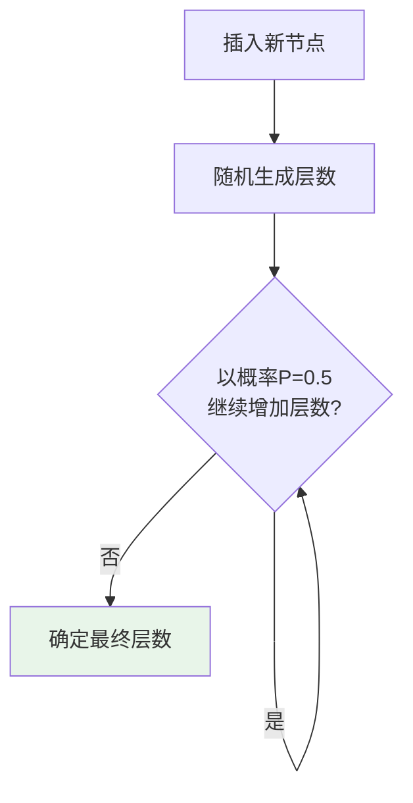

# 跳表

## 概述

跳表（Skip List）是由William Pugh于1990年提出的一种基于有序链表的概率数据结构。通过在有序链表上建立多层索引，实现对数级别的查找效率，同时保持实现简单的优点。

!!! note "跳表的重要性"
    跳表是Redis有序集合（ZSET）和LevelDB MemTable的底层实现。它在保持平衡树O(log n)查找效率的同时，实现更简单，并发支持更好，是工程实践中非常成功的数据结构。

## 跳表的设计思想

### 从有序链表说起

普通有序链表查找需要O(n)时间：

<div style="background-color: #F5F5F5; padding: 20px; margin: 10px 0; border-radius: 8px;">
    <p style="margin: 0 0 15px 0; font-weight: bold; color: #1976D2;">有序链表</p>
    <div style="display: flex; align-items: center; gap: 5px; margin-bottom: 15px;">
        <div style="width: 35px; height: 40px; background: #E3F2FD; border: 2px solid #2196F3; display: flex; align-items: center; justify-content: center; font-weight: bold;">1</div>
        <span style="color: #2196F3; font-size: 20px;">→</span>
        <div style="width: 35px; height: 40px; background: #E3F2FD; border: 2px solid #2196F3; display: flex; align-items: center; justify-content: center; font-weight: bold;">3</div>
        <span style="color: #2196F3; font-size: 20px;">→</span>
        <div style="width: 35px; height: 40px; background: #E3F2FD; border: 2px solid #2196F3; display: flex; align-items: center; justify-content: center; font-weight: bold;">5</div>
        <span style="color: #2196F3; font-size: 20px;">→</span>
        <div style="width: 35px; height: 40px; background: #E3F2FD; border: 2px solid #2196F3; display: flex; align-items: center; justify-content: center; font-weight: bold;">7</div>
        <span style="color: #2196F3; font-size: 20px;">→</span>
        <div style="width: 35px; height: 40px; background: #E3F2FD; border: 2px solid #2196F3; display: flex; align-items: center; justify-content: center; font-weight: bold;">9</div>
        <span style="color: #2196F3; font-size: 20px;">→</span>
        <div style="width: 35px; height: 40px; background: #E3F2FD; border: 2px solid #2196F3; display: flex; align-items: center; justify-content: center; font-weight: bold;">11</div>
        <span style="color: #2196F3; font-size: 20px;">→</span>
        <div style="width: 35px; height: 40px; background: #E8F5E9; border: 2px solid #4CAF50; display: flex; align-items: center; justify-content: center; font-weight: bold;">13</div>
        <span style="color: #2196F3; font-size: 20px;">→</span>
        <div style="width: 35px; height: 40px; background: #E3F2FD; border: 2px solid #2196F3; display: flex; align-items: center; justify-content: center; font-weight: bold;">15</div>
        <span style="color: #2196F3; font-size: 20px;">→</span>
        <div style="width: 35px; height: 40px; background: #E3F2FD; border: 2px solid #2196F3; display: flex; align-items: center; justify-content: center; font-weight: bold;">17</div>
        <span style="color: #2196F3; font-size: 20px;">→</span>
        <div style="width: 35px; height: 40px; background: #E3F2FD; border: 2px solid #2196F3; display: flex; align-items: center; justify-content: center; font-weight: bold;">19</div>
    </div>
    <div style="background: #FFF3E0; padding: 10px; border-radius: 5px; border-left: 4px solid #FF9800;">
        <span style="font-weight: bold; color: #FF9800;">查找13需要遍历:</span> 
        <code style="background: white; padding: 2px 6px; border-radius: 3px; margin: 0 2px;">1</code>→
        <code style="background: white; padding: 2px 6px; border-radius: 3px; margin: 0 2px;">3</code>→
        <code style="background: white; padding: 2px 6px; border-radius: 3px; margin: 0 2px;">5</code>→
        <code style="background: white; padding: 2px 6px; border-radius: 3px; margin: 0 2px;">7</code>→
        <code style="background: white; padding: 2px 6px; border-radius: 3px; margin: 0 2px;">9</code>→
        <code style="background: white; padding: 2px 6px; border-radius: 3px; margin: 0 2px;">11</code>→
        <code style="background: white; padding: 2px 6px; border-radius: 3px; margin: 0 2px; font-weight: bold; color: #4CAF50;">13</code>
        <span style="color: #F44336; font-weight: bold; margin-left: 10px;">(7次比较)</span>
    </div>
</div>

### 建立索引加速

借鉴二分查找思想，建立多级索引：



```
完整跳表结构:

Level 3:     1 ────────────────────────→ 13 ────────────→ NULL
             │                           │
Level 2:     1 ───────────→ 7 ─────────→ 13 ────────────→ NULL
             │             │             │
Level 1:     1 ────→ 4 ───→ 7 ─────────→ 13 ────→ 17 ───→ NULL
             │       │     │             │       │
Level 0:     1 → 3 → 4 → 5 → 7 → 9 → 11 → 13 → 15 → 17 → 19 → NULL
             ↑
            头节点

查找13的过程:
1. Level 3: 1 → 13 (找到!)  仅需2次比较
```

<div style="background-color: #E8F5E9; padding: 15px; margin: 10px 0; border-left: 4px solid #4CAF50; border-radius: 5px;">
    <p style="margin: 0 0 10px 0; font-weight: bold; color: #4CAF50;">✓ 查找优化效果</p>
    <p style="margin: 0; color: #666;">
        <strong>原链表:</strong> 7次比较<br>
        <strong>跳表:</strong> 仅需2次比较<br>
        <strong>提升:</strong> <span style="color: #4CAF50; font-weight: bold;">3.5倍</span>
    </p>
</div>

### 查找效率分析

<div style="background-color: #F5F5F5; padding: 20px; margin: 10px 0; border-radius: 8px;">
    <p style="margin: 0 0 15px 0; font-weight: bold; color: #1976D2;">查找效率推导</p>
    
    <div style="margin-bottom: 15px;">
        <p style="color: #666; margin: 5px 0;"><strong>假设每层节点数是下一层的1/2:</strong></p>
        <div style="padding-left: 20px; font-family: 'Courier New', monospace;">
            <p style="margin: 3px 0;">Level 0: <span style="color: #2196F3; font-weight: bold;">n</span> 个节点</p>
            <p style="margin: 3px 0;">Level 1: <span style="color: #2196F3; font-weight: bold;">n/2</span> 个节点</p>
            <p style="margin: 3px 0;">Level 2: <span style="color: #2196F3; font-weight: bold;">n/4</span> 个节点</p>
            <p style="margin: 3px 0;">...</p>
            <p style="margin: 3px 0;">Level k: <span style="color: #2196F3; font-weight: bold;">n/2^k</span> 个节点</p>
        </div>
    </div>
    
    <div style="background: white; padding: 15px; border-radius: 5px; margin-bottom: 15px;">
        <p style="margin: 0 0 10px 0; color: #666;">当 n/2^k = 1 时，k = <span style="color: #4CAF50; font-weight: bold;">log₂n</span></p>
        <p style="margin: 0; color: #666;">查找时，每层最多跳过2个节点</p>
        <p style="margin: 0; color: #666;">共需比较 <span style="color: #FF9800; font-weight: bold;">2 × log₂n</span> 次</p>
    </div>
    
    <div style="background: #E8F5E9; padding: 15px; border-radius: 5px; text-align: center;">
        <span style="font-size: 18px; font-weight: bold; color: #4CAF50;">时间复杂度: O(log n)</span>
    </div>
</div>

## 跳表结构详解

### 多层索引结构



### 随机层数机制

跳表通过随机决定节点层数来维持平衡：



```
层数概率分布:

P(层数 = 0) = 1 - P = 0.5
P(层数 = 1) = P × (1 - P) = 0.25
P(层数 = 2) = P² × (1 - P) = 0.125
P(层数 = k) = P^k × (1 - P)

期望层数 = 1 / (1 - P) = 2 (当P=0.5时)

每个节点的期望指针数 = 1 + 1/(1-P) = 3
空间复杂度: O(n)
```

## 跳表实现

### 节点与数据结构定义

```c
#include <stdlib.h>
#include <stdio.h>
#include <time.h>

#define MAX_LEVEL 16    // 最大层数
#define P 0.5           // 概率因子

// 跳表节点
typedef struct SkipNode {
    int key;                    // 键值
    int value;                  // 关联值
    struct SkipNode **forward;  // 各层前向指针数组
} SkipNode;

// 跳表结构
typedef struct {
    int level;          // 当前最大层数
    SkipNode *header;   // 头节点
} SkipList;

// 创建新节点
SkipNode* createNode(int level, int key, int value) {
    SkipNode *node = (SkipNode*)malloc(sizeof(SkipNode));
    node->key = key;
    node->value = value;
    // 分配level+1层指针（从0到level）
    node->forward = (SkipNode**)calloc(level + 1, sizeof(SkipNode*));
    return node;
}

// 创建跳表
SkipList* createSkipList() {
    SkipList *list = (SkipList*)malloc(sizeof(SkipList));
    list->level = 0;
    // 头节点拥有所有层
    list->header = createNode(MAX_LEVEL, -1, -1);
    
    for (int i = 0; i <= MAX_LEVEL; i++) {
        list->header->forward[i] = NULL;
    }
    
    srand(time(NULL));
    return list;
}
```

### 随机层数生成

```c
// 生成随机层数
int randomLevel() {
    int level = 0;
    // 以概率P继续增加层数
    while ((double)rand() / RAND_MAX < P && level < MAX_LEVEL) {
        level++;
    }
    return level;
}

/*
随机层数示意:

rand() = 0.3 → 0.3 < 0.5 → level = 1
rand() = 0.7 → 0.7 >= 0.5 → 停止
最终层数: 1

rand() = 0.3 → 0.3 < 0.5 → level = 1
rand() = 0.4 → 0.4 < 0.5 → level = 2
rand() = 0.8 → 0.8 >= 0.5 → 停止
最终层数: 2
*/
```

### 查找操作详解


```c
// 查找元素
SkipNode* search(SkipList *list, int key) {
    SkipNode *curr = list->header;
    
    // 从最高层向下查找
    for (int i = list->level; i >= 0; i--) {
        // 在当前层向右移动，直到找到 >= key 的位置
        while (curr->forward[i] && curr->forward[i]->key < key) {
            curr = curr->forward[i];
        }
    }
    
    // 移动到第0层的下一个节点
    curr = curr->forward[0];
    
    // 检查是否找到
    if (curr && curr->key == key) {
        return curr;
    }
    
    return NULL;
}

/*
查找key=9示例:

初始: curr = header

Level 3: header.forward[3] = 节点1
         1.forward[3] = 节点13, 13.key=13 >= 9
         停在节点1

Level 2: 1.forward[2] = 节点7, 7.key=7 < 9
         移动到节点7
         7.forward[2] = 节点13, 13.key=13 >= 9
         停在节点7

Level 1: 7.forward[1] = 节点13, 13.key=13 >= 9
         停在节点7

Level 0: 7.forward[0] = 节点9
         移动到节点9

返回: 节点9
*/
```

### 插入操作详解


```
插入key=6示意:

插入前:
Level 2:     1 ───────────→ 7
Level 1:     1 ────→ 4 ───→ 7
Level 0:     1 → 3 → 4 → 5 → 7

查找位置后的update数组:
update[2] = 节点1
update[1] = 节点4
update[0] = 节点5

假设随机层数为2:
新节点6的forward:
forward[2] = NULL
forward[1] = 节点7
forward[0] = 节点7

更新后:
Level 2:     1 ───────→ 6 ─→ 7
Level 1:     1 ────→ 4 → 6 → 7
Level 0:     1 → 3 → 4 → 5 → 6 → 7
```

```c
// 插入元素
void insert(SkipList *list, int key, int value) {
    SkipNode *update[MAX_LEVEL + 1];  // 记录各层的前驱节点
    SkipNode *curr = list->header;
    
    // 查找插入位置，记录每层的前驱节点
    for (int i = list->level; i >= 0; i--) {
        while (curr->forward[i] && curr->forward[i]->key < key) {
            curr = curr->forward[i];
        }
        update[i] = curr;  // 记录当前层的前驱
    }
    
    curr = curr->forward[0];
    
    // 如果key已存在，更新value
    if (curr && curr->key == key) {
        curr->value = value;
        return;
    }
    
    // 随机生成新节点层数
    int level = randomLevel();
    
    // 如果新层数大于当前最大层数，初始化高层
    if (level > list->level) {
        for (int i = list->level + 1; i <= level; i++) {
            update[i] = list->header;
        }
        list->level = level;
    }
    
    // 创建新节点
    SkipNode *newNode = createNode(level, key, value);
    
    // 插入新节点，更新各层指针
    for (int i = 0; i <= level; i++) {
        newNode->forward[i] = update[i]->forward[i];
        update[i]->forward[i] = newNode;
    }
}
```

### 删除操作

```c
// 删除元素
void delete(SkipList *list, int key) {
    SkipNode *update[MAX_LEVEL + 1];
    SkipNode *curr = list->header;
    
    // 查找删除位置
    for (int i = list->level; i >= 0; i--) {
        while (curr->forward[i] && curr->forward[i]->key < key) {
            curr = curr->forward[i];
        }
        update[i] = curr;
    }
    
    curr = curr->forward[0];
    
    // 如果没找到，直接返回
    if (!curr || curr->key != key) {
        return;
    }
    
    // 更新各层指针
    for (int i = 0; i <= list->level; i++) {
        if (update[i]->forward[i] != curr) {
            break;
        }
        update[i]->forward[i] = curr->forward[i];
    }
    
    // 降低层数
    while (list->level > 0 && list->header->forward[list->level] == NULL) {
        list->level--;
    }
    
    // 释放节点内存
    free(curr->forward);
    free(curr);
}
```

### 范围查询

```c
// 范围查询 [minKey, maxKey]
void rangeQuery(SkipList *list, int minKey, int maxKey) {
    SkipNode *curr = list->header;
    
    // 定位到 >= minKey 的位置
    for (int i = list->level; i >= 0; i--) {
        while (curr->forward[i] && curr->forward[i]->key < minKey) {
            curr = curr->forward[i];
        }
    }
    
    curr = curr->forward[0];
    
    // 在底层遍历范围内的元素
    printf("范围查询 [%d, %d]: ", minKey, maxKey);
    while (curr && curr->key <= maxKey) {
        printf("(%d, %d) ", curr->key, curr->value);
        curr = curr->forward[0];
    }
    printf("\n");
}
```

## C++ 实现

```cpp
#include <vector>
#include <random>
#include <iostream>

template<typename K, typename V>
class SkipList {
private:
    static const int MAX_LEVEL = 16;
    static constexpr double P = 0.5;
    
    struct Node {
        K key;
        V value;
        std::vector<Node*> forward;
        
        Node(K k, V v, int level) 
            : key(k), value(v), forward(level + 1, nullptr) {}
    };
    
    Node *header;
    int level;
    std::mt19937 rng;
    std::uniform_real_distribution<double> dist;
    
    int randomLevel() {
        int lvl = 0;
        while (dist(rng) < P && lvl < MAX_LEVEL) {
            lvl++;
        }
        return lvl;
    }
    
public:
    SkipList() : level(0), rng(std::random_device{}()), dist(0, 1) {
        header = new Node(K{}, V{}, MAX_LEVEL);
    }
    
    ~SkipList() {
        Node *curr = header->forward[0];
        while (curr) {
            Node *temp = curr;
            curr = curr->forward[0];
            delete temp;
        }
        delete header;
    }
    
    // 查找
    V* search(const K& key) {
        Node *curr = header;
        
        for (int i = level; i >= 0; i--) {
            while (curr->forward[i] && curr->forward[i]->key < key) {
                curr = curr->forward[i];
            }
        }
        
        curr = curr->forward[0];
        return (curr && curr->key == key) ? &curr->value : nullptr;
    }
    
    // 插入
    void insert(const K& key, const V& value) {
        std::vector<Node*> update(MAX_LEVEL + 1, nullptr);
        Node *curr = header;
        
        for (int i = level; i >= 0; i--) {
            while (curr->forward[i] && curr->forward[i]->key < key) {
                curr = curr->forward[i];
            }
            update[i] = curr;
        }
        
        curr = curr->forward[0];
        
        if (curr && curr->key == key) {
            curr->value = value;
            return;
        }
        
        int lvl = randomLevel();
        
        if (lvl > level) {
            for (int i = level + 1; i <= lvl; i++) {
                update[i] = header;
            }
            level = lvl;
        }
        
        Node *newNode = new Node(key, value, lvl);
        
        for (int i = 0; i <= lvl; i++) {
            newNode->forward[i] = update[i]->forward[i];
            update[i]->forward[i] = newNode;
        }
    }
    
    // 删除
    bool remove(const K& key) {
        std::vector<Node*> update(MAX_LEVEL + 1, nullptr);
        Node *curr = header;
        
        for (int i = level; i >= 0; i--) {
            while (curr->forward[i] && curr->forward[i]->key < key) {
                curr = curr->forward[i];
            }
            update[i] = curr;
        }
        
        curr = curr->forward[0];
        
        if (!curr || curr->key != key) {
            return false;
        }
        
        for (int i = 0; i <= level; i++) {
            if (update[i]->forward[i] != curr) break;
            update[i]->forward[i] = curr->forward[i];
        }
        
        delete curr;
        
        while (level > 0 && header->forward[level] == nullptr) {
            level--;
        }
        
        return true;
    }
    
    // 打印结构
    void print() {
        for (int i = level; i >= 0; i--) {
            std::cout << "Level " << i << ": ";
            Node *curr = header->forward[i];
            while (curr) {
                std::cout << curr->key << " ";
                curr = curr->forward[i];
            }
            std::cout << std::endl;
        }
    }
};
```

## 复杂度分析

### 时间复杂度

| 操作 | 平均时间复杂度 | 最坏时间复杂度 | 说明 |
|------|----------------|----------------|------|
| 查找 | O(log n) | O(n) | 最坏情况所有节点都在第0层 |
| 插入 | O(log n) | O(n) | 包含查找和指针更新 |
| 删除 | O(log n) | O(n) | 包含查找和指针更新 |
| 范围查询 | O(log n + k) | O(n) | k为结果数量 |

### 空间复杂度

```
每个节点的期望指针数 = 1 + 1/(1-P) = 1 + 2 = 3 (当P=0.5)

总空间 = n × 平均指针数 = O(n)

详细计算:
E[指针数] = Σ(k=0 to ∞) P(层数≥k)
         = Σ(k=0 to ∞) P^k
         = 1/(1-P)
         = 2 (当P=0.5)

每个节点平均: 1个key + 1个value + 2个forward指针 = O(1)
总空间: O(n)
```

## 跳表 vs 平衡树对比

| 特性 | 跳表 | 平衡树（AVL/红黑树） |
|------|------|---------------------|
| 查找效率 | O(log n) | O(log n) |
| 插入效率 | O(log n) | O(log n) |
| 删除效率 | O(log n) | O(log n) |
| 实现难度 | **简单** ✓ | 复杂 ✗ |
| 范围查询 | **高效** ✓ | 需要中序遍历 |
| 并发支持 | **容易** ✓ | 困难 ✗ |
| 空间开销 | 较大 (O(n)×3) | 较小 (O(n)) |
| 有序遍历 | 直接遍历第0层 | 中序遍历 |
| 最坏保证 | 概率保证 | 确定性保证 |

## 跳表的优势

### 1. 实现简单

```
平衡树需要:
- 复杂的旋转操作
- 多种情况的分类讨论
- 维护平衡因子/颜色

跳表只需要:
- 简单的指针操作
- 随机层数生成
- 无需复杂的平衡逻辑
```

### 2. 范围查询高效

```c
// 跳表：直接在第0层遍历
void rangeQuery(int min, int max) {
    Node *curr = findPosition(min);  // O(log n)
    while (curr->key <= max) {       // O(k)
        process(curr);
        curr = curr->forward[0];
    }
}

// 平衡树：需要中序遍历，更复杂
```

### 3. 并发友好

```
跳表并发优势:
- 插入/删除只影响局部节点
- 无需全局重平衡（旋转）
- 易于实现无锁版本

平衡树并发困难:
- 旋转可能影响大量节点
- 需要复杂的锁策略
```

## 应用场景

### 1. Redis 有序集合（ZSET）

```c
// Redis ZSET 使用跳表实现
// 支持的操作:
ZADD key score member     // 插入/更新
ZREM key member           // 删除
ZRANK key member          // 获取排名
ZRANGE key start stop     // 范围查询
ZSCORE key member         // 获取分数
```

### 2. LevelDB MemTable

```c
// LevelDB 内存表使用跳表
// 特点:
// - 内存中的有序键值存储
// - 快速查找和范围扫描
// - 写入效率高
```

### 3. 时间序列数据

```c
// 存储带时间戳的数据
SkipList<Timestamp, Data> timeSeries;

// 高效查询时间范围
timeSeries.rangeQuery(startTime, endTime);
```

## 跳表变体

### 1. 确定性跳表

使用确定性方法决定层数，而非随机。

### 2. 并发跳表

无锁或细粒度锁的并发实现。

```cpp
// 无锁跳表核心思想:
// 1. 使用CAS操作更新指针
// 2. 节点标记删除而非物理删除
// 3. 延迟删除无效节点
```

### 3. 可持久化跳表

支持访问历史版本。

## 参考资料

- William Pugh (1990). "Skip Lists: A Probabilistic Alternative to Balanced Trees"
- [Redis ZSET Implementation](https://github.com/redis/redis/blob/master/src/t_zset.c)
- [LevelDB Skiplist](https://github.com/google/leveldb/blob/master/db/skiplist.h)
- [Skip List - Wikipedia](https://en.wikipedia.org/wiki/Skip_list)
