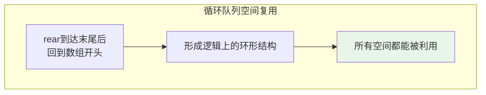
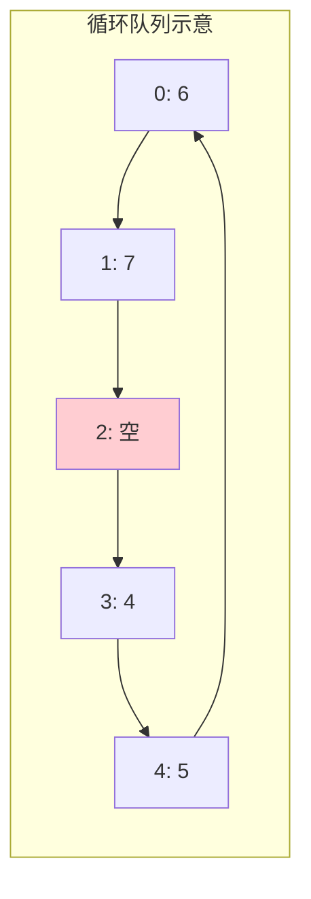
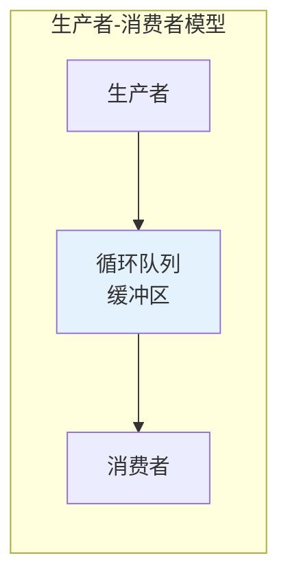

# 循环队列

## 概述

循环队列（Circular Queue）是将顺序队列的首尾相连，形成环形结构的队列。通过循环利用数组空间，避免了普通队列的"假溢出"问题，大大提高了空间利用率。

!!! note "什么是假溢出？"
    普通顺序队列在反复入队出队后，rear指针可能已到数组末尾，但数组前面因出队而空出的位置却无法利用，这就是"假溢出"——明明有空位却无法入队。

## 假溢出问题演示

<div style="background-color: #FFF3E0; padding: 20px; margin: 10px 0; border-left: 4px solid #FF9800; border-radius: 8px;">
    <p style="margin: 0 0 15px 0; font-weight: bold; color: #FF9800;">⚠️ 普通队列的假溢出示例</p>
    <div style="margin-bottom: 20px;">
        <p style="color: #666; margin: 0 0 10px 0; font-weight: bold;">初始容量为5的队列</p>
        <div style="margin-bottom: 20px;">
            <p style="color: #666; margin: 5px 0;">Step 1: 入队 1,2,3,4,5</p>
            <div style="display: flex; gap: 2px; margin-bottom: 5px;">
                <div style="width: 50px; height: 40px; background: #E3F2FD; border: 2px solid #2196F3; display: flex; align-items: center; justify-content: center; font-weight: bold;">1</div>
                <div style="width: 50px; height: 40px; background: #E3F2FD; border: 2px solid #2196F3; display: flex; align-items: center; justify-content: center; font-weight: bold;">2</div>
                <div style="width: 50px; height: 40px; background: #E3F2FD; border: 2px solid #2196F3; display: flex; align-items: center; justify-content: center; font-weight: bold;">3</div>
                <div style="width: 50px; height: 40px; background: #E3F2FD; border: 2px solid #2196F3; display: flex; align-items: center; justify-content: center; font-weight: bold;">4</div>
                <div style="width: 50px; height: 40px; background: #E3F2FD; border: 2px solid #2196F3; display: flex; align-items: center; justify-content: center; font-weight: bold;">5</div>
            </div>
            <div style="display: flex; gap: 2px;">
                <div style="width: 50px; text-align: center;"><span style="color: #F44336; font-size: 18px;">↑</span><br><span style="font-size: 10px; color: #F44336;">front</span></div>
                <div style="width: 50px;"></div>
                <div style="width: 50px;"></div>
                <div style="width: 50px;"></div>
                <div style="width: 50px; text-align: center;"><span style="color: #4CAF50; font-size: 18px;">↑</span><br><span style="font-size: 10px; color: #4CAF50;">rear</span></div>
            </div>
        </div>
        <div style="margin-bottom: 20px;">
            <p style="color: #666; margin: 5px 0;">Step 2: 出队 1,2,3</p>
            <div style="display: flex; gap: 2px; margin-bottom: 5px;">
                <div style="width: 50px; height: 40px; background: white; border: 2px dashed #CCC; display: flex; align-items: center; justify-content: center;"></div>
                <div style="width: 50px; height: 40px; background: white; border: 2px dashed #CCC; display: flex; align-items: center; justify-content: center;"></div>
                <div style="width: 50px; height: 40px; background: white; border: 2px dashed #CCC; display: flex; align-items: center; justify-content: center;"></div>
                <div style="width: 50px; height: 40px; background: #E3F2FD; border: 2px solid #2196F3; display: flex; align-items: center; justify-content: center; font-weight: bold;">4</div>
                <div style="width: 50px; height: 40px; background: #E3F2FD; border: 2px solid #2196F3; display: flex; align-items: center; justify-content: center; font-weight: bold;">5</div>
            </div>
            <div style="display: flex; gap: 2px;">
                <div style="width: 50px;"></div>
                <div style="width: 50px;"></div>
                <div style="width: 50px;"></div>
                <div style="width: 50px; text-align: center;"><span style="color: #F44336; font-size: 18px;">↑</span><br><span style="font-size: 10px; color: #F44336;">front</span></div>
                <div style="width: 50px; text-align: center;"><span style="color: #4CAF50; font-size: 18px;">↑</span><br><span style="font-size: 10px; color: #4CAF50;">rear</span></div>
            </div>
        </div>
        <div style="background: #FFEBEE; padding: 15px; border-radius: 5px;">
            <p style="margin: 0 0 10px 0; color: #F44336; font-weight: bold;">Step 3: 想要入队 6,7</p>
            <p style="margin: 0; color: #666;">问题: rear已经到数组末尾，无法继续入队</p>
            <p style="margin: 0; color: #666;">但是前面有空位！这就是<span style="color: #F44336; font-weight: bold;">"假溢出"</span></p>
            <p style="margin: 10px 0 0 0; color: #666;">实际空闲位置: <span style="color: #4CAF50; font-weight: bold;">3个</span> (索引0,1,2) 但无法利用！</p>
        </div>
    </div>
</div>

## 循环队列解决方案



```
循环队列解决假溢出:

Step 1: 入队 1,2,3,4,5
索引:    0  1  2  3  4
数据:   [1][2][3][4][5]
         ↑           ↑
       front       rear

Step 2: 出队 1,2,3
数据:   [ ][ ][ ][4][5]
                  ↑  ↑
               front rear

Step 3: 入队 6,7（rear回到开头）
数据:   [6][7][ ][4][5]
         ↑     ↑
        rear front
         ↓
      循环回到开头

逻辑结构（环形）:
         ┌───────────┐
         │  4 → 5    │
         │  ↑    ↓   │
         │  3 ← 6   │  (3的位置是空的)
         │  ↑    ↓   │
         │  2 ← 7   │
         └───────────┘
```

<div style="background-color: #E8F5E9; padding: 20px; margin: 10px 0; border-left: 4px solid #4CAF50; border-radius: 8px;">
    <p style="margin: 0 0 15px 0; font-weight: bold; color: #4CAF50;">✓ 循环队列解决方案</p>
    
    <div style="display: flex; gap: 2px; margin-bottom: 10px;">
        <div style="width: 50px; height: 40px; background: #E8F5E9; border: 2px solid #4CAF50; display: flex; align-items: center; justify-content: center; font-weight: bold;">6</div>
        <div style="width: 50px; height: 40px; background: #E8F5E9; border: 2px solid #4CAF50; display: flex; align-items: center; justify-content: center; font-weight: bold;">7</div>
        <div style="width: 50px; height: 40px; background: white; border: 2px dashed #CCC; display: flex; align-items: center; justify-content: center;"></div>
        <div style="width: 50px; height: 40px; background: #E3F2FD; border: 2px solid #2196F3; display: flex; align-items: center; justify-content: center; font-weight: bold;">4</div>
        <div style="width: 50px; height: 40px; background: #E3F2FD; border: 2px solid #2196F3; display: flex; align-items: center; justify-content: center; font-weight: bold;">5</div>
    </div>
    
    <div style="display: flex; gap: 2px; margin-bottom: 15px;">
        <div style="width: 50px; text-align: center;"><span style="color: #4CAF50; font-size: 18px;">↑</span><br><span style="font-size: 10px; color: #4CAF50;">rear</span></div>
        <div style="width: 50px;"></div>
        <div style="width: 50px;"></div>
        <div style="width: 50px; text-align: center;"><span style="color: #2196F3; font-size: 18px;">↑</span><br><span style="font-size: 10px; color: #2196F3;">front</span></div>
    </div>
    
    <p style="margin: 0; color: #666;">
        <span style="color: #4CAF50; font-weight: bold;">rear循环回到开头</span>，充分利用了前面空出的位置！
    </p>
</div>

## 循环队列结构



```
循环队列的核心:
- 使用取模运算实现循环: (index + 1) % capacity
- front: 指向队首元素
- rear: 指向队尾元素的下一个位置（或当前元素位置）
- 需要特殊处理空/满判断
```

## 空/满判断的三种方法

### 方法1：牺牲一个存储单元（推荐）

```
留一个空位不存储数据，用来区分空和满

空队列: front == rear
满队列: (rear + 1) % capacity == front

示例（capacity = 5，实际存储4个元素）:

空:  [ ][ ][ ][ ][ ]
      ↑
    front = rear = 0

满:  [A][B][C][D][ ]
      ↑           ↑
    front        rear
    rear指向空位，说明已满

入队4个元素后，rear = 4, front = 0
(rear + 1) % 5 = 0 == front，队列满
```

### 方法2：使用计数器

```
增加size变量记录元素个数

空队列: size == 0
满队列: size == capacity

简单直观，推荐使用
```

### 方法3：使用标志位

```
增加tag标记最后一次操作是入队还是出队

空队列: front == rear && tag == 0
满队列: front == rear && tag == 1

稍复杂，不常用
```

## 代码实现

### 数据结构定义

```
内存布局示意:

实际分配: capacity + 1 个空间（牺牲一个）
数组索引: 0, 1, 2, ..., capacity

front: 队首元素位置
rear:  队尾元素的下一个位置（可插入位置）

入队: data[rear] = value; rear = (rear + 1) % (capacity + 1)
出队: value = data[front]; front = (front + 1) % (capacity + 1)
```

=== "C"
    ```c
    #include <stdlib.h>
    #include <stdio.h>
    
    // 数据结构定义
    typedef struct {
        int *data;       // 数据存储数组
        int front;       // 队首指针
        int rear;        // 队尾指针
        int capacity;    // 队列容量（实际可存储capacity个元素）
    } CircularQueue;
    
    // 创建循环队列
    CircularQueue* createQueue(int capacity) {
        CircularQueue *queue = (CircularQueue*)malloc(sizeof(CircularQueue));
        // 实际分配capacity + 1个空间
        queue->data = (int*)malloc(sizeof(int) * (capacity + 1));
        queue->front = 0;
        queue->rear = 0;
        queue->capacity = capacity;
        return queue;
    }
    
    // 判断队列是否为空
    int isEmpty(CircularQueue *queue) {
        return queue->front == queue->rear;
    }
    
    // 判断队列是否已满
    int isFull(CircularQueue *queue) {
        // rear的下一个位置是front，说明满了
        return (queue->rear + 1) % (queue->capacity + 1) == queue->front;
    }
    
    // 入队操作
    int enqueue(CircularQueue *queue, int value) {
        if (isFull(queue)) {
            printf("队列已满，无法入队!\n");
            return 0;
        }
        
        queue->data[queue->rear] = value;
        // rear循环前进
        queue->rear = (queue->rear + 1) % (queue->capacity + 1);
        return 1;
    }
    
    // 出队操作
    int dequeue(CircularQueue *queue, int *value) {
        if (isEmpty(queue)) {
            printf("队列为空，无法出队!\n");
            return 0;
        }
        
        *value = queue->data[queue->front];
        // front循环前进
        queue->front = (queue->front + 1) % (queue->capacity + 1);
        return 1;
    }
    
    // 获取队首元素
    int front(CircularQueue *queue, int *value) {
        if (isEmpty(queue)) {
            return 0;
        }
        *value = queue->data[queue->front];
        return 1;
    }
    
    // 获取队列大小
    int size(CircularQueue *queue) {
        // 处理rear < front的情况
        return (queue->rear - queue->front + queue->capacity + 1) % (queue->capacity + 1);
    }
    
    // 释放队列
    void freeQueue(CircularQueue *queue) {
        free(queue->data);
        free(queue);
    }
    ```

=== "C++"
    ```cpp
    #include <vector>
    
    template<typename T>
    class CircularQueue {
    private:
        std::vector<T> data;
        int front_;
        int rear_;
        int capacity_;
        
    public:
        CircularQueue(int capacity) 
            : data(capacity + 1), front_(0), rear_(0), capacity_(capacity) {}
        
        bool isEmpty() const {
            return front_ == rear_;
        }
        
        bool isFull() const {
            return (rear_ + 1) % (capacity_ + 1) == front_;
        }
        
        bool enqueue(const T& value) {
            if (isFull()) return false;
            data[rear_] = value;
            rear_ = (rear_ + 1) % (capacity_ + 1);
            return true;
        }
        
        bool dequeue(T& value) {
            if (isEmpty()) return false;
            value = data[front_];
            front_ = (front_ + 1) % (capacity_ + 1);
            return true;
        }
        
        T& front() {
            return data[front_];
        }
        
        int size() const {
            return (rear_ - front_ + capacity_ + 1) % (capacity_ + 1);
        }
    };
    ```

=== "Python"
    ```python
    class CircularQueue:
        def __init__(self, capacity: int):
            self.data = [None] * (capacity + 1)  # 牺牲一个空间
            self.front = 0
            self.rear = 0
            self.capacity = capacity
        
        def is_empty(self) -> bool:
            return self.front == self.rear
        
        def is_full(self) -> bool:
            return (self.rear + 1) % (self.capacity + 1) == self.front
        
        def enqueue(self, value) -> bool:
            if self.is_full():
                return False
            self.data[self.rear] = value
            self.rear = (self.rear + 1) % (self.capacity + 1)
            return True
        
        def dequeue(self):
            if self.is_empty():
                return None
            value = self.data[self.front]
            self.front = (self.front + 1) % (self.capacity + 1)
            return value
        
        def get_front(self):
            if self.is_empty():
                return None
            return self.data[self.front]
        
        def size(self) -> int:
            return (self.rear - self.front + self.capacity + 1) % (self.capacity + 1)
    ```

=== "Java"
    ```java
    public class CircularQueue<T> {
        private T[] data;
        private int front;
        private int rear;
        private int capacity;
        
        @SuppressWarnings("unchecked")
        public CircularQueue(int capacity) {
            this.data = (T[]) new Object[capacity + 1];
            this.front = 0;
            this.rear = 0;
            this.capacity = capacity;
        }
        
        public boolean isEmpty() {
            return front == rear;
        }
        
        public boolean isFull() {
            return (rear + 1) % (capacity + 1) == front;
        }
        
        public boolean enqueue(T value) {
            if (isFull()) return false;
            data[rear] = value;
            rear = (rear + 1) % (capacity + 1);
            return true;
        }
        
        public T dequeue() {
            if (isEmpty()) return null;
            T value = data[front];
            data[front] = null;  // 帮助GC
            front = (front + 1) % (capacity + 1);
            return value;
        }
        
        public T getFront() {
            if (isEmpty()) return null;
            return data[front];
        }
        
        public int size() {
            return (rear - front + capacity + 1) % (capacity + 1);
        }
    }
    ```

=== "Go"
    ```go
    type CircularQueue struct {
        data     []interface{}
        front    int
        rear     int
        capacity int
    }
    
    func NewCircularQueue(capacity int) *CircularQueue {
        return &CircularQueue{
            data:     make([]interface{}, capacity+1),
            front:    0,
            rear:     0,
            capacity: capacity,
        }
    }
    
    func (q *CircularQueue) IsEmpty() bool {
        return q.front == q.rear
    }
    
    func (q *CircularQueue) IsFull() bool {
        return (q.rear+1)%(q.capacity+1) == q.front
    }
    
    func (q *CircularQueue) Enqueue(value interface{}) bool {
        if q.IsFull() {
            return false
        }
        q.data[q.rear] = value
        q.rear = (q.rear + 1) % (q.capacity + 1)
        return true
    }
    
    func (q *CircularQueue) Dequeue() interface{} {
        if q.IsEmpty() {
            return nil
        }
        value := q.data[q.front]
        q.data[q.front] = nil
        q.front = (q.front + 1) % (q.capacity + 1)
        return value
    }
    
    func (q *CircularQueue) Size() int {
        return (q.rear - q.front + q.capacity + 1) % (q.capacity + 1)
    }
    ```

=== "Rust"
    ```rust
    pub struct CircularQueue<T> {
        data: Vec<Option<T>>,
        front: usize,
        rear: usize,
        capacity: usize,
    }
    
    impl<T> CircularQueue<T> {
        pub fn new(capacity: usize) -> Self {
            CircularQueue {
                data: vec![None; capacity + 1],
                front: 0,
                rear: 0,
                capacity,
            }
        }
        
        pub fn is_empty(&self) -> bool {
            self.front == self.rear
        }
        
        pub fn is_full(&self) -> bool {
            (self.rear + 1) % (self.capacity + 1) == self.front
        }
        
        pub fn enqueue(&mut self, value: T) -> bool {
            if self.is_full() {
                return false;
            }
            self.data[self.rear] = Some(value);
            self.rear = (self.rear + 1) % (self.capacity + 1);
            true
        }
        
        pub fn dequeue(&mut self) -> Option<T> {
            if self.is_empty() {
                return None;
            }
            let value = self.data[self.front].take();
            self.front = (self.front + 1) % (self.capacity + 1);
            value
        }
        
        pub fn size(&self) -> usize {
            (self.rear + self.capacity + 1 - self.front) % (self.capacity + 1)
        }
    }
    ```

## 经典应用

### 1. 生产者消费者模型



```c
#include <pthread.h>
#include <unistd.h>

CircularQueue *buffer;
pthread_mutex_t mutex = PTHREAD_MUTEX_INITIALIZER;
pthread_cond_t notFull = PTHREAD_COND_INITIALIZER;
pthread_cond_t notEmpty = PTHREAD_COND_INITIALIZER;

// 生产者
void* producer(void *arg) {
    int item = 0;
    while (1) {
        pthread_mutex_lock(&mutex);
        
        // 等待缓冲区不满
        while (isFull(buffer)) {
            pthread_cond_wait(&notFull, &mutex);
        }
        
        enqueue(buffer, item);
        printf("生产: %d\n", item++);
        
        // 通知消费者
        pthread_cond_signal(&notEmpty);
        pthread_mutex_unlock(&mutex);
        
        usleep(100000);  // 模拟生产时间
    }
    return NULL;
}

// 消费者
void* consumer(void *arg) {
    while (1) {
        pthread_mutex_lock(&mutex);
        
        // 等待缓冲区不空
        while (isEmpty(buffer)) {
            pthread_cond_wait(&notEmpty, &mutex);
        }
        
        int item;
        dequeue(buffer, &item);
        printf("消费: %d\n", item);
        
        // 通知生产者
        pthread_cond_signal(&notFull);
        pthread_mutex_unlock(&mutex);
        
        usleep(150000);  // 模拟消费时间
    }
    return NULL;
}
```

### 2. 滑动窗口

```c
// 计算滑动窗口内的最大和
int slidingWindowMaxSum(int arr[], int n, int k) {
    CircularQueue *q = createQueue(k);
    int maxSum = 0, sum = 0;
    
    for (int i = 0; i < n; i++) {
        sum += arr[i];
        enqueue(q, arr[i]);
        
        // 如果窗口超过k，移除最旧的元素
        if (size(q) > k) {
            int old;
            dequeue(q, &old);
            sum -= old;
        }
        
        // 更新最大和
        if (size(q) == k && sum > maxSum) {
            maxSum = sum;
        }
    }
    
    freeQueue(q);
    return maxSum;
}
```

### 3. CPU轮转调度

```c
typedef struct {
    int pid;
    int burstTime;
    int remainingTime;
} Process;

void roundRobinScheduling(Process processes[], int n, int timeQuantum) {
    CircularQueue *readyQueue = createQueue(n);
    
    // 初始化：所有进程入队
    for (int i = 0; i < n; i++) {
        enqueue(readyQueue, i);
    }
    
    int currentTime = 0;
    
    while (!isEmpty(readyQueue)) {
        int pid;
        dequeue(readyQueue, &pid);
        Process *p = &processes[pid];
        
        // 执行时间片
        int execTime = (p->remainingTime < timeQuantum) ? 
                       p->remainingTime : timeQuantum;
        
        printf("时间 %d: 进程 P%d 执行 %d 单位时间\n", 
               currentTime, pid, execTime);
        
        currentTime += execTime;
        p->remainingTime -= execTime;
        
        // 如果进程未完成，重新入队
        if (p->remainingTime > 0) {
            enqueue(readyQueue, pid);
        } else {
            printf("进程 P%d 在时间 %d 完成\n", pid, currentTime);
        }
    }
    
    freeQueue(readyQueue);
}
```

## 时间复杂度

| 操作 | 时间复杂度 | 说明 |
|------|------------|------|
| 入队 | O(1) | 直接操作rear指针 |
| 出队 | O(1) | 直接操作front指针 |
| 获取队首 | O(1) | 直接访问data[front] |
| 判空/判满 | O(1) | 比较指针或计数器 |
| 获取大小 | O(1) | 计算或直接返回count |

## 空间复杂度

O(capacity) - 预分配固定大小数组

## 循环队列 vs 普通队列

| 特性 | 普通队列 | 循环队列 |
|------|----------|----------|
| 空间利用 | 假溢出问题 | 充分利用 ✓ |
| 实现复杂度 | 简单 | 中等 |
| 容量 | 固定或需搬移 | 固定 ✓ |
| 适用场景 | 简单场景 | 缓冲区、调度 ✓ |

## 应用场景

1. **数据缓冲区**：键盘缓冲、网络数据缓冲
2. **生产者消费者模型**：线程间通信
3. **CPU调度**：时间片轮转调度
4. **滑动窗口**：流数据处理
5. **循环缓冲**：音频/视频播放缓冲
6. **消息队列**：异步消息传递

## 参考资料

- 《数据结构与算法分析》第3章
- [Circular Buffer - Wikipedia](https://en.wikipedia.org/wiki/Circular_buffer)
- 《操作系统》进程调度算法
