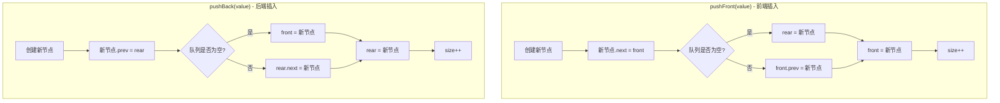
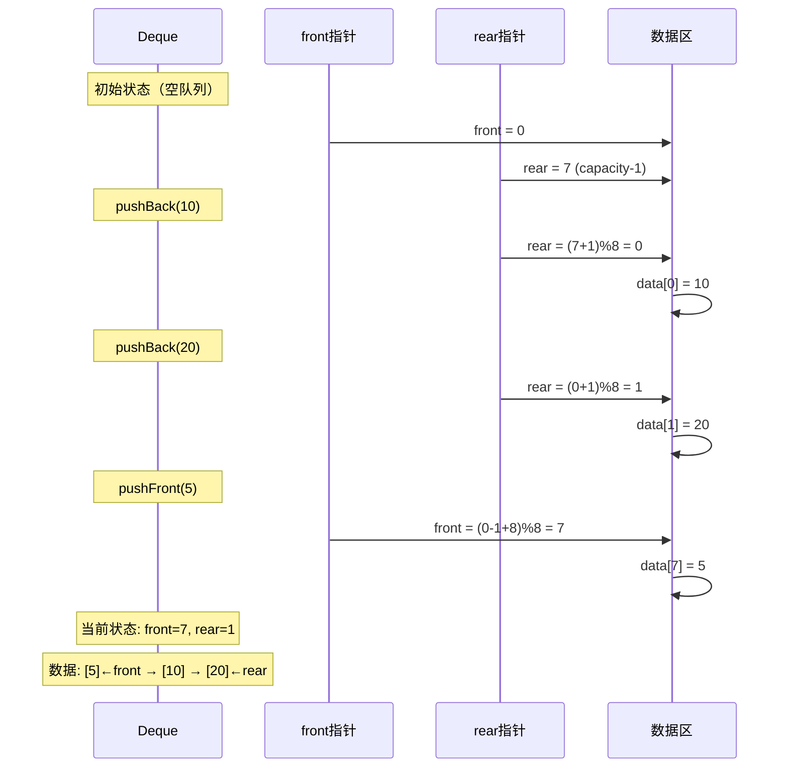
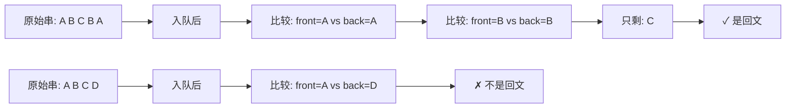

# 双端队列

## 概述

双端队列（Double-Ended Queue，简称 Deque）是一种**两端都可以进行插入和删除操作**的线性数据结构。它是队列和栈的推广形式，兼具两者的特性，是一种更加灵活的数据结构。

<div style="background-color: #E3F2FD; border-left: 4px solid #2196F3; padding: 12px; margin: 10px 0;">
<strong>核心特征：</strong>双端队列允许在<strong>前端（front）</strong>和<strong>后端（rear）</strong>同时进行入队和出队操作，共支持四种基本操作：pushFront、pushBack、popFront、popBack。
</div>

### 与其他数据结构的关系

双端队列可以看作是队列和栈的"超集"：

<div style="background-color: #F5F5F5; padding: 25px; margin: 10px 0; border-radius: 8px;">
<div style="background: white; padding: 20px; border-radius: 8px; border: 3px solid #2196F3; margin-bottom: 20px;">
<p style="margin: 0; text-align: center; font-weight: bold; color: #2196F3; font-size: 18px;">双端队列 (Deque)</p>
<p style="margin: 5px 0 0 0; text-align: center; color: #666;">两端均可插入和删除</p>
</div>
<div style="display: flex; justify-content: space-around; gap: 20px;">
<div style="flex: 1; background: #E3F2FD; padding: 15px; border-radius: 8px; border-left: 4px solid #2196F3;">
<p style="margin: 0 0 10px 0; text-align: center; font-weight: bold; color: #1976D2;">队列模式</p>
<p style="margin: 5px 0; color: #666; font-size: 14px;">• pushBack</p>
<p style="margin: 5px 0; color: #666; font-size: 14px;">• popFront</p>
<p style="margin: 10px 0 0 0; text-align: center; color: #4CAF50; font-size: 12px;">限制操作后退化为普通队列</p>
</div>
<div style="flex: 1; background: #E8F5E9; padding: 15px; border-radius: 8px; border-left: 4px solid #4CAF50;">
<p style="margin: 0 0 10px 0; text-align: center; font-weight: bold; color: #388E3C;">栈模式</p>
<p style="margin: 5px 0; color: #666; font-size: 14px;">• pushBack</p>
<p style="margin: 5px 0; color: #666; font-size: 14px;">• popBack</p>
<p style="margin: 10px 0 0 0; text-align: center; color: #2196F3; font-size: 12px;">限制操作后退化为栈</p>
</div>
</div>
</div>

## 双端队列特点

### 1. 两端操作

双端队列最显著的特点是前后两端都可以进行插入和删除：

<div style="background-color: #F5F5F5; padding: 25px; margin: 10px 0; border-radius: 8px;">
<p style="margin: 0 0 20px 0; text-align: center; font-weight: bold; color: #1976D2;">双端队列操作示意图</p>
<div style="background: white; padding: 20px; border-radius: 8px; border: 2px solid #2196F3;">
<div style="display: flex; justify-content: center; align-items: center; gap: 2px; margin-bottom: 15px;">
<div style="width: 40px; height: 45px; background: white; border: 2px dashed #CCC; display: flex; align-items: center; justify-content: center;"></div>
<div style="width: 40px; height: 45px; background: #E3F2FD; border: 2px solid #2196F3; display: flex; align-items: center; justify-content: center; font-weight: bold;">C</div>
<div style="width: 40px; height: 45px; background: #E3F2FD; border: 2px solid #2196F3; display: flex; align-items: center; justify-content: center; font-weight: bold;">D</div>
<div style="width: 40px; height: 45px; background: #E3F2FD; border: 2px solid #2196F3; display: flex; align-items: center; justify-content: center; font-weight: bold;">E</div>
<div style="width: 40px; height: 45px; background: #E3F2FD; border: 2px solid #2196F3; display: flex; align-items: center; justify-content: center; font-weight: bold;">F</div>
<div style="width: 40px; height: 45px; background: white; border: 2px dashed #CCC; display: flex; align-items: center; justify-content: center;"></div>
<div style="width: 40px; height: 45px; background: white; border: 2px dashed #CCC; display: flex; align-items: center; justify-content: center;"></div>
</div>
<div style="display: flex; justify-content: center; gap: 2px; margin-bottom: 20px;">
<div style="width: 40px; text-align: center;"><span style="color: #F44336; font-size: 18px;">↑</span><br><span style="font-size: 10px; color: #F44336; font-weight: bold;">front</span></div>
<div style="width: 40px;"></div>
<div style="width: 40px;"></div>
<div style="width: 40px;"></div>
<div style="width: 40px;"></div>
<div style="width: 40px;"></div>
<div style="width: 40px; text-align: center;"><span style="color: #4CAF50; font-size: 18px;">↑</span><br><span style="font-size: 10px; color: #4CAF50; font-weight: bold;">rear</span></div>
</div>
<div style="display: flex; justify-content: space-between; padding: 0 10px;">
<div style="text-align: center;">
<span style="font-size: 24px; color: #F44336;">←</span>
<p style="margin: 5px 0 0 0; color: #F44336; font-weight: bold; font-size: 12px;">popFront</p>
</div>
<div style="text-align: center;">
<span style="font-size: 24px; color: #9C27B0;">→</span>
<p style="margin: 5px 0 0 0; color: #9C27B0; font-weight: bold; font-size: 12px;">popBack</p>
</div>
</div>
<div style="display: flex; justify-content: space-between; padding: 0 10px; margin-top: 10px;">
<div style="text-align: center;">
<span style="font-size: 24px; color: #4CAF50;">←</span>
<p style="margin: 5px 0 0 0; color: #4CAF50; font-weight: bold; font-size: 12px;">pushFront</p>
</div>
<div style="text-align: center;">
<span style="font-size: 24px; color: #2196F3;">→</span>
<p style="margin: 5px 0 0 0; color: #2196F3; font-weight: bold; font-size: 12px;">pushBack</p>
</div>
</div>
</div>
</div>

### 2. 灵活性强

双端队列可以根据需要模拟不同的数据结构行为：

| 使用模式 | 操作限制 | 等价结构 | 典型应用 |
|---------|---------|---------|---------|
| 队列模式 | pushBack + popFront | 普通队列 | BFS遍历、任务调度 |
| 栈模式 | pushBack + popBack | 栈 | DFS遍历、表达式求值 |
| 反向栈模式 | pushFront + popFront | 栈 | 逆向操作序列 |
| 全功能模式 | 四种操作任意组合 | 双端队列 | 滑动窗口、回文检测 |

### 3. 随机访问

数组实现的双端队列支持 O(1) 时间复杂度的随机访问：

<div style="background-color: #F5F5F5; padding: 20px; margin: 10px 0; border-radius: 8px;">
<p style="margin: 0 0 15px 0; font-weight: bold; color: #1976D2;">索引计算公式</p>
<div style="background: white; padding: 15px; border-radius: 5px; margin-bottom: 15px; text-align: center;">
<span style="font-size: 18px; color: #2196F3; font-weight: bold;">index = (front + i) % capacity</span>
</div>
<p style="margin: 0 0 10px 0; color: #666; font-weight: bold;">示例：front = 2, capacity = 8</p>
<div style="display: flex; gap: 2px; margin-bottom: 10px;">
<div style="width: 50px; height: 40px; background: #E3F2FD; border: 2px solid #2196F3; display: flex; align-items: center; justify-content: center; font-weight: bold;">A</div>
<div style="width: 50px; height: 40px; background: #E3F2FD; border: 2px solid #2196F3; display: flex; align-items: center; justify-content: center; font-weight: bold;">B</div>
<div style="width: 50px; height: 40px; background: #E3F2FD; border: 2px solid #2196F3; display: flex; align-items: center; justify-content: center; font-weight: bold;">C</div>
<div style="width: 50px; height: 40px; background: #E3F2FD; border: 2px solid #2196F3; display: flex; align-items: center; justify-content: center; font-weight: bold;">D</div>
<div style="width: 50px; height: 40px; background: #E3F2FD; border: 2px solid #2196F3; display: flex; align-items: center; justify-content: center; font-weight: bold;">E</div>
</div>
<div style="display: flex; gap: 2px; margin-bottom: 10px;">
<div style="width: 50px; text-align: center; font-size: 11px; color: #666;">逻辑: 0<br>物理: 2</div>
<div style="width: 50px; text-align: center; font-size: 11px; color: #666;">逻辑: 1<br>物理: 3</div>
<div style="width: 50px; text-align: center; font-size: 11px; color: #666;">逻辑: 2<br>物理: 4</div>
<div style="width: 50px; text-align: center; font-size: 11px; color: #666;">逻辑: 3<br>物理: 5</div>
<div style="width: 50px; text-align: center; font-size: 11px; color: #666;">逻辑: 4<br>物理: 6</div>
</div>
</div>

### 4. 动态扩容

双端队列支持动态扩容，当元素数量超过当前容量时自动扩容：

```
扩容过程（以2倍扩容为例）：

扩容前（capacity = 4, size = 4）:
┌────┬────┬────┬────┐
│ A  │ B  │ C  │ D  │
└────┴────┴────┴────┘
 ↑ front          ↑ rear

扩容后（capacity = 8, size = 4）:
┌────┬────┬────┬────┬────┬────┬────┬────┐
│ A  │ B  │ C  │ D  │    │    │    │    │
└────┴────┴────┴────┴────┴────┴────┴────┘
 ↑ front          ↑ rear
```

## 原理详解

### 循环数组实现原理

双端队列通常使用**循环数组**来实现，这样可以充分利用数组空间，避免频繁的数据移动。

#### 循环数组结构

```
                    循环数组内存布局
                    
            物理内存视图（线性）:
            
    索引:   0    1    2    3    4    5    6    7
         ┌────┬────┬────┬────┬────┬────┬────┬────┐
         │    │ F  │ A  │ B  │ C  │ D  │ E  │    │
         └────┴────┴────┴────┴────┴────┴────┴────┘
                ↑              ↑
               rear          front
               
            逻辑视图（循环）:
            
                   ┌───┐
              ┌───│ E │←── front
              │   └───┘
         ┌────┴───┐
         │        │
      ┌──┴──┐  ┌──┴──┐
      │  7  │  │  0  │
      └──┬──┘  └──┬──┘
         │        │
         └────┬───┘
              │   ┌───┐
              └──│ F │←── rear
                 └───┘
                  
    数据顺序（从front到rear）: E → A → B → C → D → F
```

#### 指针移动规则

```
循环指针计算（capacity = 8）:

1. front 前移（pushFront）:
   front = (front - 1 + capacity) % capacity
   
   示例: front = 4 → front = (4 - 1 + 8) % 8 = 3
   
2. front 后移（popFront）:
   front = (front + 1) % capacity
   
   示例: front = 4 → front = (4 + 1) % 8 = 5
   
3. rear 后移（pushBack）:
   rear = (rear + 1) % capacity
   
   示例: rear = 6 → rear = (6 + 1) % 8 = 7
   
4. rear 前移（popBack）:
   rear = (rear - 1 + capacity) % capacity
   
   示例: rear = 6 → rear = (6 - 1 + 8) % 8 = 5
```

### 双向链表实现原理

双向链表实现的双端队列通过维护头尾指针，实现高效的两端操作。

#### 双向链表结构

```
                    双向链表节点结构
                    
    ┌─────────────────────────────────────┐
    │           DequeNode                 │
    │  ┌─────┬─────────┬─────┐           │
    │  │ prev│  data   │ next│           │
    │  └─────┴─────────┴─────┘           │
    └─────────────────────────────────────┘
    
                    双端队列链表视图
                    
    LinkedDeque:
    ┌─────────────────────────────┐
    │ front: ──┐                  │
    │ rear:  ──┼──┐               │
    │ size:  5 │  │               │
    └──────────│──│───────────────┘
               │  │
               ↓  │
    NULL ←──┌─────┴─────┐
             │  Node A  │
             │ prev=NULL│
             │ next ────┼──┐
             └──────────┘  │
                           ↓
                ┌─────────────┐
                │   Node B    │
                │ prev ───────┼──┐
                │ next ───────┼──┼──┐
                └─────────────┘  │  │
                                 ↓  │
                      ┌─────────────┐
                      │   Node C    │
                      │ prev ───────┼──┐
                      │ next ───────┼──┼──┐
                      └─────────────┘  │  │
                                       ↓  │
                            ┌─────────────┐
                            │   Node D    │
                            │ prev ───────┼──┐
                            │ next ───────┼──┼──┐
                            └─────────────┘  │  │
                                             ↓  │
                                  ┌─────────────┴───┐
                                  │     Node E     │
                                  │ prev ──────────┼──┐
                                  │ next = NULL    │  │
                                  └────────────────┘  │
                                         ↑            │
                                         └────────────┘
                                          rear 指向这里
```

#### 操作实现原理



## 可视化演示

### 操作流程演示



### 内存状态变化图

```
操作序列演示：capacity = 8

═══════════════════════════════════════════════════════════════
步骤1: 初始化（空队列）
═══════════════════════════════════════════════════════════════

索引:     0    1    2    3    4    5    6    7
       ┌────┬────┬────┬────┬────┬────┬────┬────┐
       │    │    │    │    │    │    │    │    │
       └────┴────┴────┴────┴────┴────┴────┴────┘
         ↑                                  ↑
        front                              rear
       (0)                                (7)
       
size = 0

═══════════════════════════════════════════════════════════════
步骤2: pushBack(10) - 后端插入
═══════════════════════════════════════════════════════════════

rear = (7 + 1) % 8 = 0
data[0] = 10

索引:     0    1    2    3    4    5    6    7
       ┌────┬────┬────┬────┬────┬────┬────┬────┐
       │ 10 │    │    │    │    │    │    │    │
       └────┴────┴────┴────┴────┴────┴────┴────┘
         ↑                                  
        rear                               front
       (0)                                (7)

size = 1

═══════════════════════════════════════════════════════════════
步骤3: pushBack(20) - 后端插入
═══════════════════════════════════════════════════════════════

rear = (0 + 1) % 8 = 1
data[1] = 20

索引:     0    1    2    3    4    5    6    7
       ┌────┬────┬────┬────┬────┬────┬────┬────┐
       │ 10 │ 20 │    │    │    │    │    │    │
       └────┴────┴────┴────┴────┴────┴────┴────┘
              ↑                         ↑
             rear                      front
            (1)                        (7)

size = 2

═══════════════════════════════════════════════════════════════
步骤4: pushFront(5) - 前端插入
═══════════════════════════════════════════════════════════════

front = (7 - 1 + 8) % 8 = 6
data[6] = 5

索引:     0    1    2    3    4    5    6    7
       ┌────┬────┬────┬────┬────┬────┬────┬────┐
       │ 10 │ 20 │    │    │    │    │ 5  │    │
       └────┴────┴────┴────┴────┴────┴────┴────┘
              ↑                         ↑
             rear                      front
            (1)                        (6)

size = 3
逻辑顺序: 5 → 10 → 20

═══════════════════════════════════════════════════════════════
步骤5: pushFront(3) - 前端插入
═══════════════════════════════════════════════════════════════

front = (6 - 1 + 8) % 8 = 5
data[5] = 3

索引:     0    1    2    3    4    5    6    7
       ┌────┬────┬────┬────┬────┬────┬────┬────┐
       │ 10 │ 20 │    │    │    │ 3  │ 5  │    │
       └────┴────┴────┴────┴────┴────┴────┴────┘
              ↑                    ↑
             rear                 front
            (1)                   (5)

size = 4
逻辑顺序: 3 → 5 → 10 → 20

═══════════════════════════════════════════════════════════════
步骤6: popBack() - 后端删除 → 返回 20
═══════════════════════════════════════════════════════════════

value = data[1] = 20
rear = (1 - 1 + 8) % 8 = 0

索引:     0    1    2    3    4    5    6    7
       ┌────┬────┬────┬────┬────┬────┬────┬────┐
       │ 10 │    │    │    │    │ 3  │ 5  │    │
       └────┴────┴────┴────┴────┴────┴────┴────┘
         ↑                         ↑
        rear                      front
       (0)                        (5)

size = 3
逻辑顺序: 3 → 5 → 10
```

## 代码实现

### 数组实现

=== "C"
    ```c
    typedef struct {
        int *data;       // 数据数组
        int front;       // 前端指针
        int rear;        // 后端指针
        int capacity;    // 容量
        int size;        // 当前元素数量
    } Deque;
    
    // 创建双端队列
    Deque* createDeque(int capacity) {
        Deque *deque = (Deque*)malloc(sizeof(Deque));
        deque->data = (int*)malloc(sizeof(int) * capacity);
        deque->front = 0;
        deque->rear = capacity - 1;  // rear初始在数组末尾
        deque->capacity = capacity;
        deque->size = 0;
        return deque;
    }
    
    // 判空
    int isEmpty(Deque *deque) {
        return deque->size == 0;
    }
    
    // 判满
    int isFull(Deque *deque) {
        return deque->size == deque->capacity;
    }
    
    // 前端插入
    void pushFront(Deque *deque, int value) {
        if (isFull(deque)) return;
        
        // front前移（向左移动，循环）
        deque->front = (deque->front - 1 + deque->capacity) % deque->capacity;
        deque->data[deque->front] = value;
        deque->size++;
    }
    
    // 后端插入
    void pushBack(Deque *deque, int value) {
        if (isFull(deque)) return;
        
        // rear后移（向右移动，循环）
        deque->rear = (deque->rear + 1) % deque->capacity;
        deque->data[deque->rear] = value;
        deque->size++;
    }
    
    // 前端删除
    int popFront(Deque *deque) {
        if (isEmpty(deque)) return -1;
        
        int value = deque->data[deque->front];
        // front后移
        deque->front = (deque->front + 1) % deque->capacity;
        deque->size--;
        return value;
    }
    
    // 后端删除
    int popBack(Deque *deque) {
        if (isEmpty(deque)) return -1;
        
        int value = deque->data[deque->rear];
        // rear前移
        deque->rear = (deque->rear - 1 + deque->capacity) % deque->capacity;
        deque->size--;
        return value;
    }
    
    // 获取前端元素
    int getFront(Deque *deque) {
        if (isEmpty(deque)) return -1;
        return deque->data[deque->front];
    }
    
    // 获取后端元素
    int getBack(Deque *deque) {
        if (isEmpty(deque)) return -1;
        return deque->data[deque->rear];
    }
    ```

=== "C++"
    ```cpp
    template<typename T>
    class Deque {
    private:
        std::vector<T> data;
        int front_;
        int rear_;
        int capacity_;
        int size_;
        
        void resize() {
            std::vector<T> newData(capacity_ * 2);
            for (int i = 0; i < size_; i++) {
                newData[i] = data[(front_ + i) % capacity_];
            }
            data = std::move(newData);
            front_ = 0;
            rear_ = size_ - 1;
            capacity_ *= 2;
        }
        
    public:
        Deque(int capacity = 8) 
            : data(capacity), front_(0), rear_(capacity - 1), 
              capacity_(capacity), size_(0) {}
        
        void pushFront(const T& value) {
            if (size_ == capacity_) resize();
            front_ = (front_ - 1 + capacity_) % capacity_;
            data[front_] = value;
            size_++;
        }
        
        void pushBack(const T& value) {
            if (size_ == capacity_) resize();
            rear_ = (rear_ + 1) % capacity_;
            data[rear_] = value;
            size_++;
        }
        
        T popFront() {
            T value = data[front_];
            front_ = (front_ + 1) % capacity_;
            size_--;
            return value;
        }
        
        T popBack() {
            T value = data[rear_];
            rear_ = (rear_ - 1 + capacity_) % capacity_;
            size_--;
            return value;
        }
        
        T& front() { return data[front_]; }
        T& back() { return data[rear_]; }
        bool empty() const { return size_ == 0; }
        int size() const { return size_; }
    };
    
    // STL使用示例
    void demonstrateDeque() {
        std::deque<int> d;
        
        // 两端插入
        d.push_back(1);    // [1]
        d.push_back(2);    // [1, 2]
        d.push_front(0);   // [0, 1, 2]
        
        // 两端删除
        d.pop_back();      // [0, 1]
        d.pop_front();     // [1]
        
        // 访问元素
        int front = d.front();
        int back = d.back();
        
        // 随机访问
        d[0] = 10;
    }
    ```

=== "Python"
    ```python
    from collections import deque
    
    # 使用内置deque
    d = deque()
    
    # 两端插入
    d.append(1)        # 后端插入
    d.appendleft(0)    # 前端插入
    
    # 两端删除
    d.pop()            # 后端删除
    d.popleft()        # 前端删除
    
    # 访问元素
    front = d[0]       # 前端元素
    back = d[-1]       # 后端元素
    
    # 数组实现版本
    class ArrayDeque:
        def __init__(self, capacity=8):
            self.data = [None] * capacity
            self.front = 0
            self.rear = capacity - 1
            self.capacity = capacity
            self.size = 0
        
        def is_empty(self):
            return self.size == 0
        
        def is_full(self):
            return self.size == self.capacity
        
        def push_front(self, value):
            if self.is_full():
                return
            self.front = (self.front - 1 + self.capacity) % self.capacity
            self.data[self.front] = value
            self.size += 1
        
        def push_back(self, value):
            if self.is_full():
                return
            self.rear = (self.rear + 1) % self.capacity
            self.data[self.rear] = value
            self.size += 1
        
        def pop_front(self):
            if self.is_empty():
                return None
            value = self.data[self.front]
            self.front = (self.front + 1) % self.capacity
            self.size -= 1
            return value
        
        def pop_back(self):
            if self.is_empty():
                return None
            value = self.data[self.rear]
            self.rear = (self.rear - 1 + self.capacity) % self.capacity
            self.size -= 1
            return value
        
        def get_front(self):
            return self.data[self.front] if not self.is_empty() else None
        
        def get_back(self):
            return self.data[self.rear] if not self.is_empty() else None
    ```

=== "Java"
    ```java
    import java.util.ArrayDeque;
    import java.util.Deque;
    
    // 使用内置ArrayDeque
    Deque<Integer> deque = new ArrayDeque<>();
    
    // 两端插入
    deque.addLast(1);     // 后端插入
    deque.addFirst(0);    // 前端插入
    
    // 两端删除
    deque.removeLast();   // 后端删除
    deque.removeFirst();  // 前端删除
    
    // 访问元素
    int front = deque.getFirst();
    int back = deque.getLast();
    
    // 数组实现版本
    class ArrayDeque {
        private int[] data;
        private int front;
        private int rear;
        private int capacity;
        private int size;
        
        public ArrayDeque(int capacity) {
            this.data = new int[capacity];
            this.front = 0;
            this.rear = capacity - 1;
            this.capacity = capacity;
            this.size = 0;
        }
        
        public boolean isEmpty() {
            return size == 0;
        }
        
        public boolean isFull() {
            return size == capacity;
        }
        
        public void pushFront(int value) {
            if (isFull()) return;
            front = (front - 1 + capacity) % capacity;
            data[front] = value;
            size++;
        }
        
        public void pushBack(int value) {
            if (isFull()) return;
            rear = (rear + 1) % capacity;
            data[rear] = value;
            size++;
        }
        
        public int popFront() {
            if (isEmpty()) return -1;
            int value = data[front];
            front = (front + 1) % capacity;
            size--;
            return value;
        }
        
        public int popBack() {
            if (isEmpty()) return -1;
            int value = data[rear];
            rear = (rear - 1 + capacity) % capacity;
            size--;
            return value;
        }
        
        public int getFront() {
            return isEmpty() ? -1 : data[front];
        }
        
        public int getBack() {
            return isEmpty() ? -1 : data[rear];
        }
    }
    ```

=== "Go"
    ```go
    package main
    
    type Deque struct {
        data     []int
        front    int
        rear     int
        capacity int
        size     int
    }
    
    func NewDeque(capacity int) *Deque {
        return &Deque{
            data:     make([]int, capacity),
            front:    0,
            rear:     capacity - 1,
            capacity: capacity,
            size:     0,
        }
    }
    
    func (d *Deque) IsEmpty() bool {
        return d.size == 0
    }
    
    func (d *Deque) IsFull() bool {
        return d.size == d.capacity
    }
    
    func (d *Deque) PushFront(value int) {
        if d.IsFull() {
            return
        }
        d.front = (d.front - 1 + d.capacity) % d.capacity
        d.data[d.front] = value
        d.size++
    }
    
    func (d *Deque) PushBack(value int) {
        if d.IsFull() {
            return
        }
        d.rear = (d.rear + 1) % d.capacity
        d.data[d.rear] = value
        d.size++
    }
    
    func (d *Deque) PopFront() int {
        if d.IsEmpty() {
            return -1
        }
        value := d.data[d.front]
        d.front = (d.front + 1) % d.capacity
        d.size--
        return value
    }
    
    func (d *Deque) PopBack() int {
        if d.IsEmpty() {
            return -1
        }
        value := d.data[d.rear]
        d.rear = (d.rear - 1 + d.capacity) % d.capacity
        d.size--
        return value
    }
    
    func (d *Deque) GetFront() int {
        if d.IsEmpty() {
            return -1
        }
        return d.data[d.front]
    }
    
    func (d *Deque) GetBack() int {
        if d.IsEmpty() {
            return -1
        }
        return d.data[d.rear]
    }
    ```

=== "Rust"
    ```rust
    use std::collections::VecDeque;
    
    // 使用内置VecDeque
    let mut deque: VecDeque<i32> = VecDeque::new();
    
    // 两端插入
    deque.push_back(1);   // 后端插入
    deque.push_front(0);  // 前端插入
    
    // 两端删除
    deque.pop_back();     // 后端删除
    deque.pop_front();    // 前端删除
    
    // 访问元素
    let front = deque.front();
    let back = deque.back();
    
    // 数组实现版本
    struct ArrayDeque {
        data: Vec<i32>,
        front: usize,
        rear: usize,
        capacity: usize,
        size: usize,
    }
    
    impl ArrayDeque {
        fn new(capacity: usize) -> Self {
            ArrayDeque {
                data: vec![0; capacity],
                front: 0,
                rear: capacity - 1,
                capacity,
                size: 0,
            }
        }
        
        fn is_empty(&self) -> bool {
            self.size == 0
        }
        
        fn is_full(&self) -> bool {
            self.size == self.capacity
        }
        
        fn push_front(&mut self, value: i32) {
            if self.is_full() {
                return;
            }
            self.front = (self.front + self.capacity - 1) % self.capacity;
            self.data[self.front] = value;
            self.size += 1;
        }
        
        fn push_back(&mut self, value: i32) {
            if self.is_full() {
                return;
            }
            self.rear = (self.rear + 1) % self.capacity;
            self.data[self.rear] = value;
            self.size += 1;
        }
        
        fn pop_front(&mut self) -> Option<i32> {
            if self.is_empty() {
                return None;
            }
            let value = self.data[self.front];
            self.front = (self.front + 1) % self.capacity;
            self.size -= 1;
            Some(value)
        }
        
        fn pop_back(&mut self) -> Option<i32> {
            if self.is_empty() {
                return None;
            }
            let value = self.data[self.rear];
            self.rear = (self.rear + self.capacity - 1) % self.capacity;
            self.size -= 1;
            Some(value)
        }
        
        fn get_front(&self) -> Option<i32> {
            if self.is_empty() {
                None
            } else {
                Some(self.data[self.front])
            }
        }
        
        fn get_back(&self) -> Option<i32> {
            if self.is_empty() {
                None
            } else {
                Some(self.data[self.rear])
            }
        }
    }
    ```

### 链表实现

=== "C"
    ```c
    typedef struct DequeNode {
        int data;
        struct DequeNode *prev;
        struct DequeNode *next;
    } DequeNode;
    
    typedef struct {
        DequeNode *front;
        DequeNode *rear;
        int size;
    } LinkedDeque;
    
    // 创建链表双端队列
    LinkedDeque* createLinkedDeque() {
        LinkedDeque *deque = (LinkedDeque*)malloc(sizeof(LinkedDeque));
        deque->front = NULL;
        deque->rear = NULL;
        deque->size = 0;
        return deque;
    }
    
    // 前端插入
    void pushFrontLinked(LinkedDeque *deque, int value) {
        DequeNode *node = (DequeNode*)malloc(sizeof(DequeNode));
        node->data = value;
        node->prev = NULL;
        node->next = deque->front;
        
        if (deque->front == NULL) {
            deque->rear = node;
        } else {
            deque->front->prev = node;
        }
        
        deque->front = node;
        deque->size++;
    }
    
    // 后端插入
    void pushBackLinked(LinkedDeque *deque, int value) {
        DequeNode *node = (DequeNode*)malloc(sizeof(DequeNode));
        node->data = value;
        node->next = NULL;
        node->prev = deque->rear;
        
        if (deque->rear == NULL) {
            deque->front = node;
        } else {
            deque->rear->next = node;
        }
        
        deque->rear = node;
        deque->size++;
    }
    
    // 前端删除
    int popFrontLinked(LinkedDeque *deque) {
        if (deque->front == NULL) return -1;
        
        DequeNode *node = deque->front;
        int value = node->data;
        
        deque->front = node->next;
        if (deque->front == NULL) {
            deque->rear = NULL;
        } else {
            deque->front->prev = NULL;
        }
        
        free(node);
        deque->size--;
        return value;
    }
    
    // 后端删除
    int popBackLinked(LinkedDeque *deque) {
        if (deque->rear == NULL) return -1;
        
        DequeNode *node = deque->rear;
        int value = node->data;
        
        deque->rear = node->prev;
        if (deque->rear == NULL) {
            deque->front = NULL;
        } else {
            deque->rear->next = NULL;
        }
        
        free(node);
        deque->size--;
        return value;
    }
    ```

=== "C++"
    ```cpp
    template<typename T>
    class LinkedDeque {
    private:
        struct Node {
            T data;
            Node* prev;
            Node* next;
            Node(const T& val) : data(val), prev(nullptr), next(nullptr) {}
        };
        
        Node* front_;
        Node* rear_;
        int size_;
        
    public:
        LinkedDeque() : front_(nullptr), rear_(nullptr), size_(0) {}
        
        ~LinkedDeque() {
            while (front_) {
                Node* temp = front_;
                front_ = front_->next;
                delete temp;
            }
        }
        
        void pushFront(const T& value) {
            Node* node = new Node(value);
            node->next = front_;
            
            if (!front_) {
                rear_ = node;
            } else {
                front_->prev = node;
            }
            
            front_ = node;
            size_++;
        }
        
        void pushBack(const T& value) {
            Node* node = new Node(value);
            node->prev = rear_;
            
            if (!rear_) {
                front_ = node;
            } else {
                rear_->next = node;
            }
            
            rear_ = node;
            size_++;
        }
        
        T popFront() {
            if (!front_) throw std::runtime_error("Deque is empty");
            
            Node* node = front_;
            T value = node->data;
            
            front_ = node->next;
            if (!front_) {
                rear_ = nullptr;
            } else {
                front_->prev = nullptr;
            }
            
            delete node;
            size_--;
            return value;
        }
        
        T popBack() {
            if (!rear_) throw std::runtime_error("Deque is empty");
            
            Node* node = rear_;
            T value = node->data;
            
            rear_ = node->prev;
            if (!rear_) {
                front_ = nullptr;
            } else {
                rear_->next = nullptr;
            }
            
            delete node;
            size_--;
            return value;
        }
        
        T& front() { return front_->data; }
        T& back() { return rear_->data; }
        bool empty() const { return size_ == 0; }
        int size() const { return size_; }
    };
    ```

=== "Python"
    ```python
    class DequeNode:
        def __init__(self, data):
            self.data = data
            self.prev = None
            self.next = None
    
    class LinkedDeque:
        def __init__(self):
            self.front = None
            self.rear = None
            self.size = 0
        
        def is_empty(self):
            return self.size == 0
        
        def push_front(self, value):
            node = DequeNode(value)
            node.next = self.front
            
            if self.front is None:
                self.rear = node
            else:
                self.front.prev = node
            
            self.front = node
            self.size += 1
        
        def push_back(self, value):
            node = DequeNode(value)
            node.prev = self.rear
            
            if self.rear is None:
                self.front = node
            else:
                self.rear.next = node
            
            self.rear = node
            self.size += 1
        
        def pop_front(self):
            if self.is_empty():
                return None
            
            node = self.front
            value = node.data
            
            self.front = node.next
            if self.front is None:
                self.rear = None
            else:
                self.front.prev = None
            
            self.size -= 1
            return value
        
        def pop_back(self):
            if self.is_empty():
                return None
            
            node = self.rear
            value = node.data
            
            self.rear = node.prev
            if self.rear is None:
                self.front = None
            else:
                self.rear.next = None
            
            self.size -= 1
            return value
        
        def get_front(self):
            return self.front.data if self.front else None
        
        def get_back(self):
            return self.rear.data if self.rear else None
    ```

=== "Java"
    ```java
    class DequeNode {
        int data;
        DequeNode prev;
        DequeNode next;
        
        DequeNode(int data) {
            this.data = data;
            this.prev = null;
            this.next = null;
        }
    }
    
    class LinkedDeque {
        private DequeNode front;
        private DequeNode rear;
        private int size;
        
        public LinkedDeque() {
            this.front = null;
            this.rear = null;
            this.size = 0;
        }
        
        public boolean isEmpty() {
            return size == 0;
        }
        
        public void pushFront(int value) {
            DequeNode node = new DequeNode(value);
            node.next = front;
            
            if (front == null) {
                rear = node;
            } else {
                front.prev = node;
            }
            
            front = node;
            size++;
        }
        
        public void pushBack(int value) {
            DequeNode node = new DequeNode(value);
            node.prev = rear;
            
            if (rear == null) {
                front = node;
            } else {
                rear.next = node;
            }
            
            rear = node;
            size++;
        }
        
        public int popFront() {
            if (isEmpty()) return -1;
            
            DequeNode node = front;
            int value = node.data;
            
            front = node.next;
            if (front == null) {
                rear = null;
            } else {
                front.prev = null;
            }
            
            size--;
            return value;
        }
        
        public int popBack() {
            if (isEmpty()) return -1;
            
            DequeNode node = rear;
            int value = node.data;
            
            rear = node.prev;
            if (rear == null) {
                front = null;
            } else {
                rear.next = null;
            }
            
            size--;
            return value;
        }
        
        public int getFront() {
            return front == null ? -1 : front.data;
        }
        
        public int getBack() {
            return rear == null ? -1 : rear.data;
        }
    }
    ```

=== "Go"
    ```go
    package main
    
    type DequeNode struct {
        data int
        prev *DequeNode
        next *DequeNode
    }
    
    type LinkedDeque struct {
        front *DequeNode
        rear  *DequeNode
        size  int
    }
    
    func NewLinkedDeque() *LinkedDeque {
        return &LinkedDeque{
            front: nil,
            rear:  nil,
            size:  0,
        }
    }
    
    func (d *LinkedDeque) IsEmpty() bool {
        return d.size == 0
    }
    
    func (d *LinkedDeque) PushFront(value int) {
        node := &DequeNode{data: value, prev: nil, next: d.front}
        
        if d.front == nil {
            d.rear = node
        } else {
            d.front.prev = node
        }
        
        d.front = node
        d.size++
    }
    
    func (d *LinkedDeque) PushBack(value int) {
        node := &DequeNode{data: value, prev: d.rear, next: nil}
        
        if d.rear == nil {
            d.front = node
        } else {
            d.rear.next = node
        }
        
        d.rear = node
        d.size++
    }
    
    func (d *LinkedDeque) PopFront() int {
        if d.IsEmpty() {
            return -1
        }
        
        node := d.front
        value := node.data
        
        d.front = node.next
        if d.front == nil {
            d.rear = nil
        } else {
            d.front.prev = nil
        }
        
        d.size--
        return value
    }
    
    func (d *LinkedDeque) PopBack() int {
        if d.IsEmpty() {
            return -1
        }
        
        node := d.rear
        value := node.data
        
        d.rear = node.prev
        if d.rear == nil {
            d.front = nil
        } else {
            d.rear.next = nil
        }
        
        d.size--
        return value
    }
    ```

=== "Rust"
    ```rust
    struct DequeNode {
        data: i32,
        prev: Option<Box<DequeNode>>,
        next: Option<Box<DequeNode>>,
    }
    
    struct LinkedDeque {
        front: Option<Box<DequeNode>>,
        rear: Option<Box<DequeNode>>,
        size: usize,
    }
    
    impl LinkedDeque {
        fn new() -> Self {
            LinkedDeque {
                front: None,
                rear: None,
                size: 0,
            }
        }
        
        fn is_empty(&self) -> bool {
            self.size == 0
        }
        
        fn push_front(&mut self, value: i32) {
            let mut node = Box::new(DequeNode {
                data: value,
                prev: None,
                next: self.front.take(),
            });
            
            if self.front.is_none() {
                self.rear = Some(node);
            } else {
                self.front.as_mut().unwrap().prev = Some(node);
            }
            
            self.front = Some(node);
            self.size += 1;
        }
        
        fn push_back(&mut self, value: i32) {
            let mut node = Box::new(DequeNode {
                data: value,
                prev: self.rear.take(),
                next: None,
            });
            
            if self.rear.is_none() {
                self.front = Some(node);
            } else {
                self.rear.as_mut().unwrap().next = Some(node);
            }
            
            self.rear = Some(node);
            self.size += 1;
        }
        
        fn pop_front(&mut self) -> Option<i32> {
            if self.is_empty() {
                return None;
            }
            
            let node = self.front.take()?;
            let value = node.data;
            
            self.front = node.next;
            if self.front.is_none() {
                self.rear = None;
            } else {
                self.front.as_mut().unwrap().prev = None;
            }
            
            self.size -= 1;
            Some(value)
        }
        
        fn pop_back(&mut self) -> Option<i32> {
            if self.is_empty() {
                return None;
            }
            
            let node = self.rear.take()?;
            let value = node.data;
            
            self.rear = node.prev;
            if self.rear.is_none() {
                self.front = None;
            } else {
                self.rear.as_mut().unwrap().next = None;
            }
            
            self.size -= 1;
            Some(value)
        }
    }
    ```

## 复杂度分析

### 时间复杂度

| 操作 | 数组实现 | 链表实现 | 说明 |
|------|---------|---------|------|
| pushFront | O(1) | O(1) | 直接操作front指针/插入头节点 |
| pushBack | O(1) | O(1) | 直接操作rear指针/插入尾节点 |
| popFront | O(1) | O(1) | 直接操作front指针/删除头节点 |
| popBack | O(1) | O(1) | 直接操作rear指针/删除尾节点 |
| 随机访问 | O(1) | O(n) | 数组直接索引，链表需遍历 |
| 扩容 | O(n) | - | 数组扩容需复制所有元素 |

### 空间复杂度

| 实现方式 | 空间复杂度 | 说明 |
|---------|-----------|------|
| 数组实现 | O(n) | 预分配连续内存，可能有浪费 |
| 链表实现 | O(n) | 动态分配，无浪费，但有指针开销 |

### 两种实现对比

```
┌─────────────────────────────────────────────────────────────┐
│                    数组实现 vs 链表实现                      │
├─────────────────────────────────────────────────────────────┤
│                                                             │
│  数组实现优势：               链表实现优势：                  │
│  ✓ 随机访问 O(1)            ✓ 内存无浪费                    │
│  ✓ 缓存友好                  ✓ 无需扩容                      │
│  ✓ 空间紧凑                  ✓ 无容量限制                    │
│                                                             │
│  数组实现劣势：               链表实现劣势：                  │
│  ✗ 可能浪费空间              ✗ 随机访问 O(n)                │
│  ✗ 扩容开销                  ✗ 指针额外空间                  │
│  ✗ 容量限制                  ✗ 缓存不友好                    │
│                                                             │
└─────────────────────────────────────────────────────────────┘
```

## 应用场景

### 1. 滑动窗口最大值

使用双端队列维护窗口内的候选最大值（单调递减队列）：

=== "C"
    ```c
    int* maxSlidingWindow(int nums[], int n, int k, int *returnSize) {
        *returnSize = n - k + 1;
        int *result = (int*)malloc(sizeof(int) * (*returnSize));
        
        Deque *deque = createDeque(n);  // 存储下标
        
        for (int i = 0; i < n; i++) {
            // 移除比当前元素小的所有元素（它们不可能是最大值）
            while (!isEmpty(deque) && nums[getFront(deque)] <= nums[i]) {
                popFront(deque);
            }
            
            // 将当前元素下标加入队列前端
            pushFront(deque, i);
            
            // 移除超出窗口范围的元素
            if (getBack(deque) <= i - k) {
                popBack(deque);
            }
            
            // 记录窗口最大值
            if (i >= k - 1) {
                result[i - k + 1] = nums[getBack(deque)];
            }
        }
        
        return result;
    }
    ```

=== "Python"
    ```python
    from collections import deque
    
    def max_sliding_window(nums, k):
        result = []
        dq = deque()  # 存储下标
        
        for i in range(len(nums)):
            # 移除比当前元素小的元素
            while dq and nums[dq[0]] <= nums[i]:
                dq.popleft()
            
            dq.appendleft(i)
            
            # 移除超出窗口范围的元素
            if dq[-1] <= i - k:
                dq.pop()
            
            # 记录窗口最大值
            if i >= k - 1:
                result.append(nums[dq[-1]])
        
        return result
    ```

=== "Java"
    ```java
    public int[] maxSlidingWindow(int[] nums, int k) {
        int n = nums.length;
        int[] result = new int[n - k + 1];
        Deque<Integer> deque = new ArrayDeque<>();
        
        for (int i = 0; i < n; i++) {
            while (!deque.isEmpty() && nums[deque.getFirst()] <= nums[i]) {
                deque.removeFirst();
            }
            
            deque.addFirst(i);
            
            if (deque.getLast() <= i - k) {
                deque.removeLast();
            }
            
            if (i >= k - 1) {
                result[i - k + 1] = nums[deque.getLast()];
            }
        }
        
        return result;
    }
    ```

**算法图解：**

```
输入: nums = [3, 1, 4, 2, 5, 3], k = 3

窗口移动过程:

i=0: 窗口=[3],      deque=[0]           (存储下标)
i=1: 窗口=[3,1],    deque=[0,1]         
i=2: 窗口=[3,1,4],  deque=[2]           max=nums[2]=4 ✓
     ┌───────────────────────────────┐
     │ 4比前面的3,1都大，全部移除    │
     └───────────────────────────────┘
i=3: 窗口=[1,4,2],  deque=[2,3]         max=nums[2]=4 ✓
i=4: 窗口=[4,2,5],  deque=[4]           max=nums[4]=5 ✓
     ┌───────────────────────────────┐
     │ 5比前面的4,2都大，全部移除    │
     └───────────────────────────────┘
i=5: 窗口=[2,5,3],  deque=[4,5]         max=nums[4]=5 ✓

结果: [4, 4, 5, 5]
```

### 2. 表达式求值（逆波兰表达式）

双端队列作为栈使用，计算后缀表达式：

=== "Python"
    ```python
    def eval_rpn(tokens):
        stack = []
        
        for token in tokens:
            if token == "+":
                b, a = stack.pop(), stack.pop()
                stack.append(a + b)
            elif token == "-":
                b, a = stack.pop(), stack.pop()
                stack.append(a - b)
            elif token == "*":
                b, a = stack.pop(), stack.pop()
                stack.append(a * b)
            elif token == "/":
                b, a = stack.pop(), stack.pop()
                stack.append(int(a / b))
            else:
                stack.append(int(token))
        
        return stack[0]
    ```

=== "Java"
    ```java
    public int evalRPN(String[] tokens) {
        Deque<Integer> stack = new ArrayDeque<>();
        
        for (String token : tokens) {
            switch (token) {
                case "+":
                    stack.push(stack.pop() + stack.pop());
                    break;
                case "-":
                    int b = stack.pop(), a = stack.pop();
                    stack.push(a - b);
                    break;
                case "*":
                    stack.push(stack.pop() * stack.pop());
                    break;
                case "/":
                    int divisor = stack.pop(), dividend = stack.pop();
                    stack.push(dividend / divisor);
                    break;
                default:
                    stack.push(Integer.parseInt(token));
            }
        }
        
        return stack.pop();
    }
    ```

**计算过程示例：**

```
输入: ["2", "1", "+", "3", "*"]  等价于: (2 + 1) * 3

步骤   操作         栈状态
────────────────────────────────────
 1    push(2)      [2]
 2    push(1)      [2, 1]
 3    +            [3]        (2+1=3)
 4    push(3)      [3, 3]
 5    *            [9]        (3*3=9)

结果: 9
```

### 3. 回文检测

利用双端队列两端弹出比较的特性检测回文：

=== "Python"
    ```python
    def is_palindrome(s):
        dq = deque(s)
        
        while len(dq) > 1:
            if dq.popleft() != dq.pop():
                return False
        
        return True
    ```

=== "Java"
    ```java
    public boolean isPalindrome(String s) {
        Deque<Character> deque = new ArrayDeque<>();
        
        for (char c : s.toCharArray()) {
            deque.addLast(c);
        }
        
        while (deque.size() > 1) {
            if (deque.removeFirst() != deque.removeLast()) {
                return false;
            }
        }
        
        return true;
    }
    ```

**检测过程：**



### 4. 撤销/重做功能

编辑器中维护两个双端队列实现撤销重做：

=== "C++"
    ```cpp
    class Editor {
    private:
        std::deque<std::string> undoStack;  // 撤销栈
        std::deque<std::string> redoStack;  // 重做栈
        std::string currentText;
        
    public:
        // 执行操作
        void execute(const std::string& newText) {
            undoStack.push_back(currentText);  // 保存当前状态
            currentText = newText;
            redoStack.clear();  // 新操作清除重做栈
        }
        
        // 撤销
        bool undo() {
            if (undoStack.empty()) return false;
            
            redoStack.push_back(currentText);  // 当前状态存入重做栈
            currentText = undoStack.back();    // 恢复上一状态
            undoStack.pop_back();
            return true;
        }
        
        // 重做
        bool redo() {
            if (redoStack.empty()) return false;
            
            undoStack.push_back(currentText);  // 当前状态存入撤销栈
            currentText = redoStack.back();    // 恢复下一状态
            redoStack.pop_back();
            return true;
        }
    };
    ```

=== "Python"
    ```python
    class Editor:
        def __init__(self):
            self.undo_stack = deque()
            self.redo_stack = deque()
            self.current_text = ""
        
        def execute(self, new_text):
            self.undo_stack.append(self.current_text)
            self.current_text = new_text
            self.redo_stack.clear()
        
        def undo(self):
            if not self.undo_stack:
                return False
            
            self.redo_stack.append(self.current_text)
            self.current_text = self.undo_stack.pop()
            return True
        
        def redo(self):
            if not self.redo_stack:
                return False
            
            self.undo_stack.append(self.current_text)
            self.current_text = self.redo_stack.pop()
            return True
    ```

**撤销重做流程：**

```
操作序列演示:

初始状态: currentText = "Hello"

1. execute("Hello World")
   undoStack: ["Hello"]
   redoStack: []
   currentText: "Hello World"

2. execute("Hello World!")
   undoStack: ["Hello", "Hello World"]
   redoStack: []
   currentText: "Hello World!"

3. undo()
   undoStack: ["Hello"]
   redoStack: ["Hello World!"]
   currentText: "Hello World"

4. undo()
   undoStack: []
   redoStack: ["Hello World!", "Hello World"]
   currentText: "Hello"

5. redo()
   undoStack: ["Hello"]
   redoStack: ["Hello World!"]
   currentText: "Hello World"
```

### 5. 工作窃取调度

并行计算中的工作窃取算法：

```
工作窃取示意图:

线程1 (处理自己的任务队列):
┌─────────────────────────────────────────┐
│  Task1 ← Task2 ← Task3 ← Task4 ← Task5  │
│   ↑pop                                  │
│  本地队列（后端弹出）                     │
└─────────────────────────────────────────┘

线程2 (队列为空，窃取线程1的任务):
┌─────────────────────────────────────────┐
│  Task1 ← Task2 ← Task3 ← Task4 ← Task5  │
│                                   pop↑  │
│                        窃取（前端弹出）   │
└─────────────────────────────────────────┘

特点:
- 本地线程从后端弹出（LIFO，缓存友好）
- 窃取线程从前端弹出（FIFO，减少竞争）
```

## 参考资料

- 《数据结构与算法分析：C语言描述》第3章 - 线性表
- 《算法导论》第10章 - 基本数据结构
- C++ STL Reference: std::deque
- [LeetCode 239. 滑动窗口最大值](https://leetcode.com/problems/sliding-window-maximum/)
