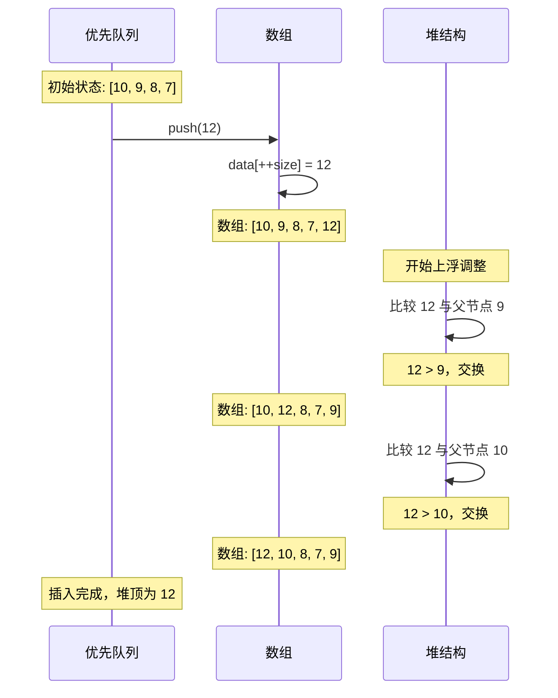
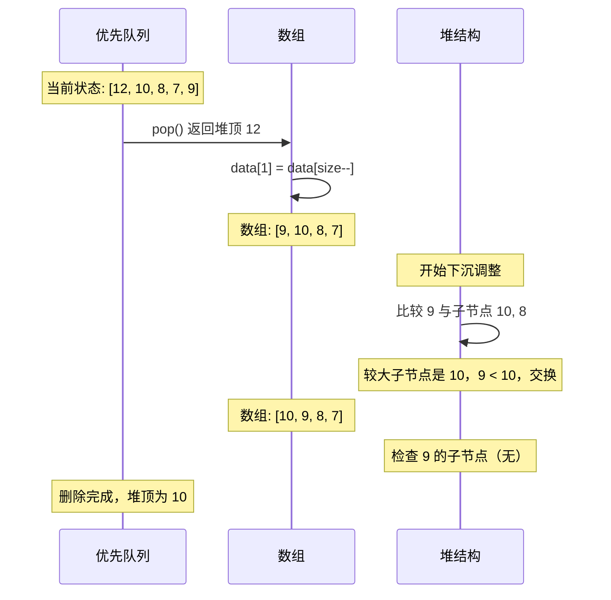
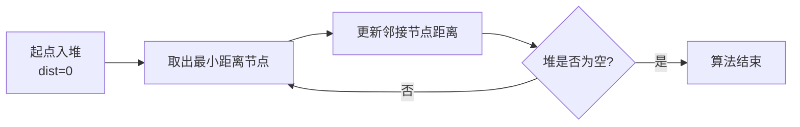

# 优先队列

## 概述

优先队列（Priority Queue）是一种特殊的队列数据结构，其中每个元素都有一个**优先级**。出队操作总是返回优先级最高（或最低）的元素，而不是按照"先进先出"的原则。

<div style="background-color: #E3F2FD; border-left: 4px solid #2196F3; padding: 12px; margin: 10px 0;">
<strong>核心特征：</strong>优先队列的出队顺序由元素的优先级决定，而非入队顺序。通常使用<strong>堆（Heap）</strong>来实现，保证高效的插入和删除操作。
</div>

### 与普通队列的对比

```
┌─────────────────────────────────────────────────────────────────────┐
│                    普通队列 vs 优先队列                              │
├─────────────────────────────────────────────────────────────────────┤
│                                                                     │
│  普通队列（FIFO）:                                                   │
│  ┌───┬───┬───┬───┬───┐                                             │
│  │ 3 │ 1 │ 4 │ 1 │ 5 │  入队顺序: 3, 1, 4, 1, 5                     │
│  └───┴───┴───┴───┴───┘  出队顺序: 3, 1, 4, 1, 5  （先进先出）        │
│    ↑                                                               │
│   出队                                                              │
│                                                                     │
│  优先队列（按优先级）:                                               │
│  ┌───┬───┬───┬───┬───┐                                             │
│  │ 5 │ 4 │ 3 │ 1 │ 1 │  入队顺序: 3, 1, 4, 1, 5                     │
│  └───┴───┴───┴───┴───┘  出队顺序: 5, 4, 3, 1, 1  （大根堆，优先出大）│
│    ↑                                                               │
│   出队（最大值）                                                     │
│                                                                     │
└─────────────────────────────────────────────────────────────────────┘
```

## 优先队列特点

### 1. 优先级出队

元素按照优先级顺序出队，而非入队顺序：

- **大根堆**：优先级高的元素先出（最大值优先）
- **小根堆**：优先级低的元素先出（最小值优先）

```
大根堆优先队列示例（最大值优先）:

入队操作序列: push(3), push(1), push(4), push(1), push(5)

时间线:
─────────────────────────────────────────────────────────────
操作           堆状态                 堆顶（最大值）
─────────────────────────────────────────────────────────────
push(3)        [3]                    3
push(1)        [3, 1]                 3
push(4)        [4, 1, 3]              4
push(1)        [4, 1, 3, 1]           4
push(5)        [5, 4, 3, 1, 1]        5
─────────────────────────────────────────────────────────────

出队顺序: 5 → 4 → 3 → 1 → 1（从大到小）
```

### 2. 动态维护

优先队列支持动态插入和删除，始终维护堆的性质：


### 3. 堆实现

优先队列通常使用**二叉堆**实现，二叉堆是一棵完全二叉树：

```
二叉堆的两种形式：

大根堆（Max Heap）:              小根堆（Min Heap）:
        10                              1
       /  \                            / \
      9    8                          2   3
     / \  /                          / \  /
    7  6 5                          4  5 6
    
特点: 父节点 ≥ 子节点          特点: 父节点 ≤ 子节点
```

### 4. 高效操作

| 操作 | 时间复杂度 | 说明 |
|------|-----------|------|
| 插入 | O(log n) | 添加到末尾后上浮 |
| 删除最值 | O(log n) | 交换后下沉 |
| 获取最值 | O(1) | 直接访问堆顶 |
| 建堆 | O(n) | 从下往上依次下沉 |

## 原理详解

### 二叉堆的数组表示

二叉堆使用数组存储，利用完全二叉树的性质：

```
完全二叉树的数组表示：

逻辑视图（树形）:
              [1]
             /    \
          [2]      [3]
          / \      / \
        [4] [5]  [6] [7]

物理视图（数组）:
索引:    1    2    3    4    5    6    7
      ┌────┬────┬────┬────┬────┬────┬────┐
      │    │    │    │    │    │    │    │
      └────┴────┴────┴────┴────┴────┴────┘
        ↑
       堆顶
      (索引1)

索引关系（从索引1开始）:
- 父节点索引: parent(i) = i / 2
- 左子节点索引: leftChild(i) = 2 * i
- 右子节点索引: rightChild(i) = 2 * i + 1

索引关系（从索引0开始）:
- 父节点索引: parent(i) = (i - 1) / 2
- 左子节点索引: leftChild(i) = 2 * i + 1
- 右子节点索引: rightChild(i) = 2 * i + 2
```

### 堆的性质

```
大根堆性质: 对于任意节点 i，data[i] ≥ data[2i] 且 data[i] ≥ data[2i+1]

小根堆性质: 对于任意节点 i，data[i] ≤ data[2i] 且 data[i] ≤ data[2i+1]

示例大根堆:
索引:    1    2    3    4    5    6    7
      ┌────┬────┬────┬────┬────┬────┬────┐
      │ 10 │  9 │  8 │  7 │  6 │  5 │  4 │
      └────┴────┴────┴────┴────┴────┴────┘

验证:
- data[1]=10 ≥ data[2]=9 ✓  且 data[1]=10 ≥ data[3]=8 ✓
- data[2]=9  ≥ data[4]=7 ✓  且 data[2]=9  ≥ data[5]=6 ✓
- data[3]=8  ≥ data[6]=5 ✓  且 data[3]=8  ≥ data[7]=4 ✓
```

### 上浮操作（Swim）

当插入新元素或增大某元素的值时，需要上浮以恢复堆性质：

```
上浮操作原理（大根堆）:

如果当前节点 > 父节点，则交换，继续向上检查

示例: 在大根堆中插入 15

初始状态:
              10
             /  \
            9    8
           / \  / \
          7  6 5  4
         /
        15  ← 新插入的节点（索引8）

步骤1: 比较 15 与父节点 7
       15 > 7，交换

              10
             /  \
            9    8
           / \  / \
         15  6 5  4
         /
        7

步骤2: 比较 15 与父节点 9
       15 > 9，交换

              10
             /  \
           15    8
           / \  / \
          9  6 5  4
         /
        7

步骤3: 比较 15 与父节点 10
       15 > 10，交换

              15
             /  \
           10    8
           / \  / \
          9  6 5  4
         /
        7

上浮完成！15 已到达堆顶
```

### 下沉操作（Sink）

当删除堆顶或减小某元素的值时，需要下沉以恢复堆性质：

```
下沉操作原理（大根堆）:

如果当前节点 < 较大的子节点，则交换，继续向下检查

示例: 删除大根堆的堆顶 15

初始状态:
              15
             /  \
           10    8
           / \  / \
          9  6 5  4
         /
        7

步骤1: 将末尾元素 7 移到堆顶，删除末尾

              7
             /  \
           10    8
           / \  / \
          9  6 5  4

步骤2: 比较 7 与较大的子节点（10 vs 8，选10）
       7 < 10，交换

              10
             /  \
            7    8
           / \  / \
          9  6 5  4

步骤3: 比较 7 与较大的子节点（9 vs 6，选9）
       7 < 9，交换

              10
             /  \
            9    8
           / \  / \
          7  6 5  4

下沉完成！堆性质已恢复
```

### 建堆过程

从无序数组构建堆，有两种方法：

```
方法1: 逐个插入（O(n log n)）
- 对每个元素执行 push 操作

方法2: 自底向上下沉（O(n)）← 更高效
- 从最后一个非叶子节点开始，依次下沉

示例: 将数组 [4, 1, 3, 2, 16, 9, 10] 构建大根堆

初始数组:
索引:    1    2    3    4    5    6    7
      ┌────┬────┬────┬────┬────┬────┬────┐
      │  4 │  1 │  3 │  2 │ 16 │  9 │ 10 │
      └────┴────┴────┴────┴────┴────┴────┘

初始树形:
              4
            /   \
          1       3
         / \     / \
        2  16   9  10

最后一个非叶子节点索引 = 7/2 = 3（即值为3的节点）

从索引3开始下沉:
─────────────────────────────────────────────────────────────────
sink(3): 节点值=3，子节点=9和10
         较大子节点是10，3 < 10，交换

              4
            /   \
          1      10
         / \     / \
        2  16   9   3

─────────────────────────────────────────────────────────────────
sink(2): 节点值=1，子节点=2和16
         较大子节点是16，1 < 16，交换

              4
            /   \
         16      10
         / \     / \
        2   1   9   3

─────────────────────────────────────────────────────────────────
sink(1): 节点值=4，子节点=16和10
         较大子节点是16，4 < 16，交换

              16
            /   \
          4      10
         / \     / \
        2   1   9   3

继续下沉，检查节点4（现在是索引2）
         子节点=2和1，较大子节点是2，4 > 2，无需交换

─────────────────────────────────────────────────────────────────
建堆完成！

最终大根堆:
              16
            /   \
          4      10
         / \     / \
        2   1   9   3

数组: [16, 4, 10, 2, 1, 9, 3]
```

## 可视化演示

### 插入操作流程



### 删除操作流程



### 大根堆完整操作演示

```
操作序列: push(10), push(20), push(15), push(30), pop(), pop()

═══════════════════════════════════════════════════════════════
初始状态: 空堆
═══════════════════════════════════════════════════════════════

数组: [空]
树形: (空)

═══════════════════════════════════════════════════════════════
push(10): 插入后上浮
═══════════════════════════════════════════════════════════════

数组: [10]
树形:    10

═══════════════════════════════════════════════════════════════
push(20): 插入后上浮
═══════════════════════════════════════════════════════════════

插入到末尾:
        10
       /
      20

上浮: 20 > 10，交换
        20
       /
      10

数组: [20, 10]

═══════════════════════════════════════════════════════════════
push(15): 插入后上浮
═══════════════════════════════════════════════════════════════

插入到末尾:
        20
       /  \
      10   15

上浮: 15 < 20，无需交换

数组: [20, 10, 15]

═══════════════════════════════════════════════════════════════
push(30): 插入后上浮
═══════════════════════════════════════════════════════════════

插入到末尾:
        20
       /  \
      10   15
     /
    30

上浮: 30 > 10，交换
        20
       /  \
      30   15
     /
    10

继续上浮: 30 > 20，交换
        30
       /  \
      20   15
     /
    10

数组: [30, 20, 15, 10]

═══════════════════════════════════════════════════════════════
pop(): 删除堆顶 30，返回 30
═══════════════════════════════════════════════════════════════

将末尾元素 10 移到堆顶:
        10
       /  \
      20   15

下沉: 10 与子节点 20, 15 比较
      较大子节点是 20，10 < 20，交换
        20
       /  \
      10   15

继续下沉: 10 无子节点，停止

数组: [20, 10, 15]

═══════════════════════════════════════════════════════════════
pop(): 删除堆顶 20，返回 20
═══════════════════════════════════════════════════════════════

将末尾元素 15 移到堆顶:
        15
       /
      10

下沉: 15 与子节点 10 比较
      15 > 10，无需交换

数组: [15, 10]

═══════════════════════════════════════════════════════════════
最终状态
═══════════════════════════════════════════════════════════════

数组: [15, 10]
树形:    15
        /
       10

出队顺序: 30, 20, ...（剩余: 15, 10）
```

## 代码实现

### 数组实现（大根堆）

=== "C"
    ```c
    typedef struct {
        int *data;       // 数据数组（从索引1开始存储）
        int size;        // 当前元素数量
        int capacity;    // 容量
    } PriorityQueue;
    
    // 创建优先队列
    PriorityQueue* createPQ(int capacity) {
        PriorityQueue *pq = (PriorityQueue*)malloc(sizeof(PriorityQueue));
        pq->data = (int*)malloc(sizeof(int) * (capacity + 1));  // 索引0不使用
        pq->size = 0;
        pq->capacity = capacity;
        return pq;
    }
    
    // 交换两个元素
    void swap(int *a, int *b) {
        int temp = *a;
        *a = *b;
        *b = temp;
    }
    
    // 上浮操作（大根堆）
    void swim(int *data, int index) {
        // 当当前节点大于父节点时，向上交换
        while (index > 1 && data[index / 2] < data[index]) {
            swap(&data[index / 2], &data[index]);
            index = index / 2;  // 移动到父节点位置
        }
    }
    
    // 下沉操作（大根堆）
    void sink(int *data, int size, int index) {
        // 当有子节点时
        while (2 * index <= size) {
            int j = 2 * index;  // 左子节点
            // 选择较大的子节点
            if (j < size && data[j] < data[j + 1]) j++;
            // 如果当前节点已经大于等于子节点，停止
            if (data[index] >= data[j]) break;
            // 交换并继续下沉
            swap(&data[index], &data[j]);
            index = j;
        }
    }
    
    // 插入元素
    void push(PriorityQueue *pq, int value) {
        if (pq->size >= pq->capacity) return;
        
        pq->data[++pq->size] = value;  // 添加到末尾
        swim(pq->data, pq->size);      // 上浮调整
    }
    
    // 获取堆顶元素
    int top(PriorityQueue *pq) {
        if (pq->size == 0) return -1;
        return pq->data[1];
    }
    
    // 删除并返回堆顶元素
    int pop(PriorityQueue *pq) {
        if (pq->size == 0) return -1;
        
        int max = pq->data[1];              // 保存堆顶
        pq->data[1] = pq->data[pq->size--]; // 将末尾元素移到堆顶
        sink(pq->data, pq->size, 1);        // 下沉调整
        
        return max;
    }
    
    // 判空
    int isEmpty(PriorityQueue *pq) {
        return pq->size == 0;
    }
    ```

=== "C++"
    ```cpp
    #include <vector>
    #include <algorithm>
    
    template<typename T, typename Compare = std::less<T>>
    class PriorityQueue {
    private:
        std::vector<T> data;  // 从索引0开始
        Compare comp;         // 比较器
        
        // 上浮操作
        void swim(int index) {
            while (index > 0) {
                int parent = (index - 1) / 2;
                if (comp(data[parent], data[index])) {
                    std::swap(data[parent], data[index]);
                    index = parent;
                } else {
                    break;
                }
            }
        }
        
        // 下沉操作
        void sink(int index) {
            int n = data.size();
            while (2 * index + 1 < n) {
                int left = 2 * index + 1;
                int right = 2 * index + 2;
                int target = index;
                
                // 选择优先级更高的子节点
                if (left < n && comp(data[target], data[left])) {
                    target = left;
                }
                if (right < n && comp(data[target], data[right])) {
                    target = right;
                }
                
                if (target == index) break;
                std::swap(data[index], data[target]);
                index = target;
            }
        }
        
    public:
        PriorityQueue() = default;
        
        void push(const T& value) {
            data.push_back(value);
            swim(data.size() - 1);
        }
        
        void pop() {
            if (data.empty()) return;
            data[0] = data.back();
            data.pop_back();
            if (!data.empty()) sink(0);
        }
        
        T top() const { return data.front(); }
        bool empty() const { return data.empty(); }
        size_t size() const { return data.size(); }
    };
    
    // STL使用示例
    #include <queue>
    void demonstratePriorityQueue() {
        // 大根堆（默认）
        std::priority_queue<int> maxPQ;
        maxPQ.push(3);
        maxPQ.push(1);
        maxPQ.push(4);
        
        // 小根堆（使用 std::greater）
        std::priority_queue<int, std::vector<int>, std::greater<int>> minPQ;
        minPQ.push(3);
        minPQ.push(1);
        minPQ.push(4);
    }
    ```

=== "Python"
    ```python
    import heapq
    
    # 使用内置heapq（小根堆）
    min_heap = []
    heapq.heappush(min_heap, 3)
    heapq.heappush(min_heap, 1)
    heapq.heappush(min_heap, 4)
    
    # 弹出最小值
    print(heapq.heappop(min_heap))  # 输出: 1
    
    # 大根堆实现（取负值）
    max_heap = []
    heapq.heappush(max_heap, -3)
    heapq.heappush(max_heap, -1)
    heapq.heappush(max_heap, -4)
    print(-heapq.heappop(max_heap))  # 输出: 4
    
    # 完整实现
    class PriorityQueue:
        def __init__(self, is_min_heap=True):
            self.data = []
            self.is_min_heap = is_min_heap
        
        def push(self, value):
            if self.is_min_heap:
                heapq.heappush(self.data, value)
            else:
                heapq.heappush(self.data, -value)
        
        def pop(self):
            if not self.data:
                return None
            if self.is_min_heap:
                return heapq.heappop(self.data)
            else:
                return -heapq.heappop(self.data)
        
        def top(self):
            if not self.data:
                return None
            return self.data[0] if self.is_min_heap else -self.data[0]
        
        def empty(self):
            return len(self.data) == 0
        
        def size(self):
            return len(self.data)
    ```

=== "Java"
    ```java
    import java.util.PriorityQueue;
    import java.util.Collections;
    
    // 使用内置PriorityQueue（小根堆）
    PriorityQueue<Integer> minPQ = new PriorityQueue<>();
    minPQ.offer(3);
    minPQ.offer(1);
    minPQ.offer(4);
    
    // 弹出最小值
    System.out.println(minPQ.poll());  // 输出: 1
    
    // 大根堆
    PriorityQueue<Integer> maxPQ = new PriorityQueue<>(Collections.reverseOrder());
    maxPQ.offer(3);
    maxPQ.offer(1);
    maxPQ.offer(4);
    System.out.println(maxPQ.poll());  // 输出: 4
    
    // 数组实现版本
    class BinaryHeap {
        private int[] data;
        private int size;
        private int capacity;
        
        public BinaryHeap(int capacity) {
            this.data = new int[capacity + 1];  // 索引0不使用
            this.size = 0;
            this.capacity = capacity;
        }
        
        private void swim(int index) {
            while (index > 1 && data[index / 2] < data[index]) {
                int temp = data[index / 2];
                data[index / 2] = data[index];
                data[index] = temp;
                index = index / 2;
            }
        }
        
        private void sink(int index) {
            while (2 * index <= size) {
                int j = 2 * index;
                if (j < size && data[j] < data[j + 1]) j++;
                if (data[index] >= data[j]) break;
                int temp = data[index];
                data[index] = data[j];
                data[j] = temp;
                index = j;
            }
        }
        
        public void push(int value) {
            data[++size] = value;
            swim(size);
        }
        
        public int pop() {
            int max = data[1];
            data[1] = data[size--];
            sink(1);
            return max;
        }
        
        public int top() {
            return data[1];
        }
        
        public boolean isEmpty() {
            return size == 0;
        }
    }
    ```

=== "Go"
    ```go
    package main
    
    import "container/heap"
    
    // 使用内置heap接口
    type MinHeap []int
    
    func (h MinHeap) Len() int           { return len(h) }
    func (h MinHeap) Less(i, j int) bool { return h[i] < h[j] }
    func (h MinHeap) Swap(i, j int)      { h[i], h[j] = h[j], h[i] }
    func (h *MinHeap) Push(x interface{}) { *h = append(*h, x.(int)) }
    func (h *MinHeap) Pop() interface{} {
        old := *h
        n := len(old)
        x := old[n-1]
        *h = old[0 : n-1]
        return x
    }
    
    // 数组实现版本
    type PriorityQueue struct {
        data     []int
        size     int
        capacity int
    }
    
    func NewPQ(capacity int) *PriorityQueue {
        return &PriorityQueue{
            data:     make([]int, capacity+1),
            size:     0,
            capacity: capacity,
        }
    }
    
    func (pq *PriorityQueue) swim(index int) {
        for index > 1 && pq.data[index/2] < pq.data[index] {
            pq.data[index/2], pq.data[index] = pq.data[index], pq.data[index/2]
            index = index / 2
        }
    }
    
    func (pq *PriorityQueue) sink(index int) {
        for 2*index <= pq.size {
            j := 2 * index
            if j < pq.size && pq.data[j] < pq.data[j+1] {
                j++
            }
            if pq.data[index] >= pq.data[j] {
                break
            }
            pq.data[index], pq.data[j] = pq.data[j], pq.data[index]
            index = j
        }
    }
    
    func (pq *PriorityQueue) Push(value int) {
        pq.size++
        pq.data[pq.size] = value
        pq.swim(pq.size)
    }
    
    func (pq *PriorityQueue) Pop() int {
        max := pq.data[1]
        pq.data[1] = pq.data[pq.size]
        pq.size--
        pq.sink(1)
        return max
    }
    
    func (pq *PriorityQueue) Top() int {
        return pq.data[1]
    }
    
    func (pq *PriorityQueue) Empty() bool {
        return pq.size == 0
    }
    ```

=== "Rust"
    ```rust
    use std::collections::BinaryHeap;
    
    // 使用内置BinaryHeap（大根堆）
    let mut max_heap: BinaryHeap<i32> = BinaryHeap::new();
    max_heap.push(3);
    max_heap.push(1);
    max_heap.push(4);
    
    // 弹出最大值
    println!("{:?}", max_heap.pop());  // 输出: Some(4)
    
    // 小根堆（使用Reverse）
    use std::cmp::Reverse;
    let mut min_heap: BinaryHeap<Reverse<i32>> = BinaryHeap::new();
    min_heap.push(Reverse(3));
    min_heap.push(Reverse(1));
    min_heap.push(Reverse(4));
    
    // 数组实现版本
    struct PriorityQueue {
        data: Vec<i32>,
    }
    
    impl PriorityQueue {
        fn new(capacity: usize) -> Self {
            let mut data = Vec::with_capacity(capacity + 1);
            data.push(0);  // 索引0不使用
            PriorityQueue { data }
        }
        
        fn swim(&mut self, mut index: usize) {
            while index > 1 && self.data[index / 2] < self.data[index] {
                self.data.swap(index / 2, index);
                index = index / 2;
            }
        }
        
        fn sink(&mut self, mut index: usize) {
            let size = self.data.len() - 1;
            while 2 * index <= size {
                let mut j = 2 * index;
                if j < size && self.data[j] < self.data[j + 1] {
                    j += 1;
                }
                if self.data[index] >= self.data[j] {
                    break;
                }
                self.data.swap(index, j);
                index = j;
            }
        }
        
        fn push(&mut self, value: i32) {
            self.data.push(value);
            self.swim(self.data.len() - 1);
        }
        
        fn pop(&mut self) -> Option<i32> {
            if self.data.len() <= 1 {
                return None;
            }
            let max = self.data[1];
            let last = self.data.pop().unwrap();
            if self.data.len() > 1 {
                self.data[1] = last;
                self.sink(1);
            }
            Some(max)
        }
        
        fn top(&self) -> Option<i32> {
            if self.data.len() <= 1 {
                None
            } else {
                Some(self.data[1])
            }
        }
        
        fn is_empty(&self) -> bool {
            self.data.len() <= 1
        }
    }
    ```

## 复杂度分析

### 时间复杂度

| 操作 | 时间复杂度 | 说明 |
|------|-----------|------|
| 插入 push | O(log n) | 最多上浮树高次 |
| 删除堆顶 pop | O(log n) | 最多下沉树高次 |
| 获取堆顶 top | O(1) | 直接访问 data[1] |
| 建堆 buildHeap | O(n) | 从下往上依次下沉 |

### 建堆复杂度推导

```
建堆时间复杂度分析（自底向上方法）:

设堆的高度为 h = log(n)

第 k 层的节点数量: 2^(h-k)
第 k 层节点最多下沉: k 次

总时间 T(n) = Σ(k=0 to h) 2^(h-k) * k
            = 2^h * Σ(k=0 to h) k / 2^k
            = n * Σ(k=0 to h) k / 2^k
            < n * Σ(k=0 to ∞) k / 2^k
            = n * 2
            = O(n)

结论: 建堆可以在 O(n) 时间内完成！
```

### 空间复杂度

- **数组实现**: O(n)，存储所有元素
- **链式实现**: O(n)，存储节点和指针

## 应用场景

### 1. 合并K个有序链表

使用小根堆维护K个链表的当前节点：

```c
typedef struct ListNode {
    int val;
    struct ListNode *next;
} ListNode;

typedef struct {
    int val;           // 节点值
    int listIndex;     // 来自哪个链表
} HeapNode;

ListNode* mergeKLists(ListNode **lists, int k) {
    MinPQ *pq = createMinPQ(k);
    
    // 将各链表头节点入堆
    for (int i = 0; i < k; i++) {
        if (lists[i]) {
            pushMin(pq, lists[i]->val);
        }
    }
    
    ListNode dummy = {0, NULL};
    ListNode *tail = &dummy;
    
    while (!isEmpty(pq)) {
        tail->next = (ListNode*)malloc(sizeof(ListNode));
        tail->next->val = popMin(pq);
        tail->next->next = NULL;
        tail = tail->next;
    }
    
    return dummy.next;
}
```

**算法图解：**

```
输入: 3个有序链表
list1: 1 → 4 → 5
list2: 1 → 3 → 4
list3: 2 → 6

初始堆状态（各链表头节点）:
          1
         / \
        1   2

合并过程:
───────────────────────────────────────────────────────────────
步骤   操作           堆状态        输出链表
───────────────────────────────────────────────────────────────
 1    pop() → 1      [1, 2]        1 →
 2    pop() → 1      [2, 3]        1 → 1 →
 3    pop() → 2      [3, 4]        1 → 1 → 2 →
 4    pop() → 3      [4, 4]        1 → 1 → 2 → 3 →
 5    pop() → 4      [4, 5]        1 → 1 → 2 → 3 → 4 →
 6    pop() → 4      [5, 6]        1 → 1 → 2 → 3 → 4 → 4 →
 7    pop() → 5      [6]           1 → 1 → 2 → 3 → 4 → 4 → 5 →
 8    pop() → 6      []            1 → 1 → 2 → 3 → 4 → 4 → 5 → 6
───────────────────────────────────────────────────────────────

结果: 1 → 1 → 2 → 3 → 4 → 4 → 5 → 6
```

### 2. Top K 问题

找出数组中出现频率最高的K个元素：

```c
int* topKFrequent(int nums[], int n, int k, int *returnSize) {
    // 统计频率
    int freq[10000] = {0};
    for (int i = 0; i < n; i++) {
        freq[nums[i] + 5000]++;
    }
    
    // 使用小根堆维护Top K
    MinPQ *pq = createMinPQ(k + 1);
    int *result = (int*)malloc(sizeof(int) * k);
    *returnSize = 0;
    
    for (int i = 0; i < 10000; i++) {
        if (freq[i] > 0) {
            pushMin(pq, freq[i]);
            // 保持堆大小为K
            if (pq->size > k) {
                popMin(pq);
            }
        }
    }
    
    while (!isEmpty(pq)) {
        result[(*returnSize)++] = popMin(pq);
    }
    
    return result;
}
```

**算法思路：**

```
使用小根堆维护Top K的原理:

───────────────────────────────────────────────────────────────
输入: nums = [1,1,1,2,2,3], k = 2

统计频率:
  1 → 3次
  2 → 2次
  3 → 1次

处理过程:
───────────────────────────────────────────────────────────────
步骤   入堆元素    堆状态（小根堆）    说明
───────────────────────────────────────────────────────────────
 1     (1, 3)     [3]                入堆频率3
 2     (2, 2)     [2, 3]             入堆频率2
 3     (3, 1)     [1, 3]             入堆频率1
                  ↓ pop() → 1        堆大小超过k，弹出最小
        [2, 3]                       堆大小恢复为k
───────────────────────────────────────────────────────────────

结果: 频率最高的2个元素是 1(3次) 和 2(2次)
```

### 3. 任务调度

优先级调度算法：

```c
typedef struct {
    int id;        // 任务ID
    int priority;  // 优先级
    int arrival;   // 到达时间
    int burst;     // 执行时间
} Task;

void scheduleTasks(Task tasks[], int n) {
    PriorityQueue *pq = createPQ(n);
    
    int time = 0;
    int completed = 0;
    
    while (completed < n) {
        // 将已到达的任务加入队列
        for (int i = 0; i < n; i++) {
            if (tasks[i].arrival <= time && tasks[i].burst > 0) {
                push(pq, tasks[i].priority);
            }
        }
        
        // 执行优先级最高的任务
        if (!isEmpty(pq)) {
            int priority = pop(pq);
            printf("Time %d: Execute task with priority %d\n", time, priority);
            completed++;
        }
        
        time++;
    }
}
```

**调度示例：**

```
任务列表:
┌────────┬──────────┬───────────┬───────────┐
│ Task ID │ Priority │ Arrival   │ Burst     │
├────────┼──────────┼───────────┼───────────┤
│   T1   │    3     │    0      │    2      │
│   T2   │    5     │    1      │    3      │
│   T3   │    1     │    2      │    1      │
│   T4   │    4     │    3      │    2      │
└────────┴──────────┴───────────┴───────────┘

调度过程:
───────────────────────────────────────────────────────────────
时间    就绪队列         执行任务      说明
───────────────────────────────────────────────────────────────
 0     [T1]            T1(pri=3)    T1到达，执行
 1     [T1, T2]        T2(pri=5)    T2到达，优先级更高
 2     [T1, T2, T3]    T2(pri=5)    继续执行T2
 3     [T1, T3, T4]    T4(pri=4)    T4到达，优先级最高
 4     [T1, T3, T4]    T4(pri=4)    继续执行T4
 5     [T1, T3]        T1(pri=3)    T1优先级最高
 6     [T3]            T3(pri=1)    执行T3
───────────────────────────────────────────────────────────────

执行顺序: T1 → T2 → T2 → T4 → T4 → T1 → T3
```

### 4. Dijkstra 最短路径

使用优先队列优化Dijkstra算法：



### 5. Huffman 编码

构建最优前缀编码树：

```
Huffman编码建树过程:
输入字符频率: a:5, b:9, c:12, d:13, e:16, f:45

步骤1: 初始小根堆
          5
         / \
        9  12
       / \  /
      13 16 45

步骤2: 合并最小的两个节点 (5, 9) → 14
          12
         /  \
       13    14
       /    /  \
      16   45   (5,9)

步骤3: 合并 (12, 13) → 25
          14
         /  \
       16    25
       /    /  \
      45  (12,13) (5,9)

...继续合并直到只剩一棵树

最终编码:
a: 1100    b: 1101    c: 100    d: 101    e: 111    f: 0
```

## 参考资料

- 《算法导论》第6章 - 堆排序
- 《数据结构与算法分析：C语言描述》第6章 - 优先队列
- C++ STL Reference: std::priority_queue
- [LeetCode 23. 合并K个升序链表](https://leetcode.com/problems/merge-k-sorted-lists/)
- [LeetCode 347. 前K个高频元素](https://leetcode.com/problems/top-k-frequent-elements/)
