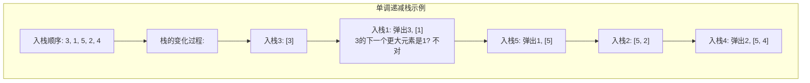
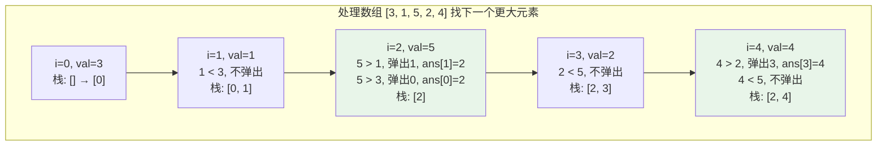
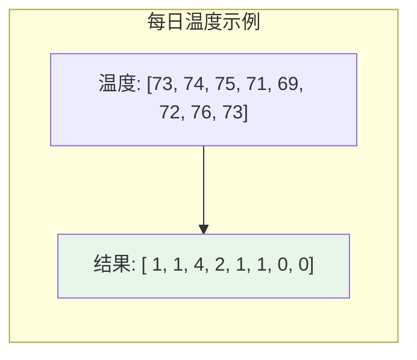
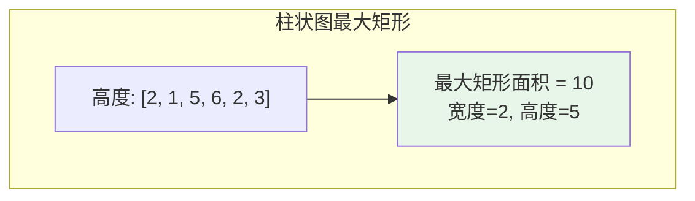
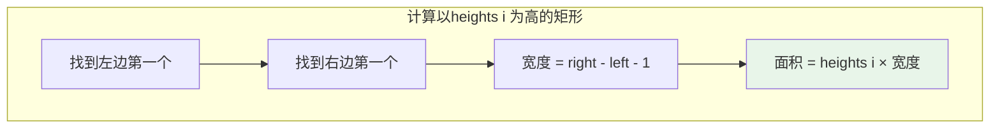
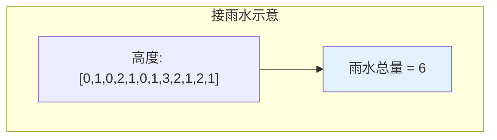
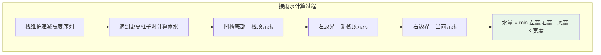

# 单调栈

## 概述

单调栈是一种特殊的栈结构，栈内元素始终保持单调递增或单调递减的顺序。通过维护单调性，可以高效解决"寻找下一个更大/更小元素"等问题，将原本O(n²)的问题优化到O(n)。

!!! note "单调栈的核心思想"
    单调栈通过在入栈前弹出破坏单调性的元素，利用弹出的元素与当前元素的关系，在O(1)时间内找到"下一个更大/更小元素"，整体时间复杂度为O(n)。

## 单调栈类型

| 类型 | 栈内顺序 | 适用场景 | 图示 |
|------|---------|---------|------|
| 单调递增栈 | 栈底→栈顶递增 | 求下一个更小元素 | `[1, 3, 5, 7]` |
| 单调递减栈 | 栈底→栈顶递减 | 求下一个更大元素 | `[7, 5, 3, 1]` |



## 核心原理详解

### 为什么单调栈有效？

```
问题: 找到每个元素右边第一个比它大的元素位置

朴素做法: O(n²)
for i in range(n):
    for j in range(i+1, n):
        if arr[j] > arr[i]:
            result[i] = j
            break

单调栈做法: O(n)
- 维护一个单调递减栈（存索引）
- 当遇到比栈顶大的元素时，栈顶元素的答案就是当前元素
- 弹出栈顶，继续检查
```

### 工作流程示意



<div style="background-color: #F5F5F5; border-radius: 8px; padding: 20px; margin: 15px 0;">
<p style="font-weight: bold; color: #1976D2; margin-bottom: 15px;">结果解释:</p>
<div style="display: grid; gap: 8px;">
<div style="background-color: white; padding: 10px; border-radius: 6px; border-left: 4px solid #4CAF50;">
<p style="font-size: 13px;"><strong style="color: #2196F3;">ans[0] = 2</strong> → 元素3的下一个更大元素是位置2的元素5</p>
</div>
<div style="background-color: white; padding: 10px; border-radius: 6px; border-left: 4px solid #4CAF50;">
<p style="font-size: 13px;"><strong style="color: #2196F3;">ans[1] = 2</strong> → 元素1的下一个更大元素是位置2的元素5</p>
</div>
<div style="background-color: white; padding: 10px; border-radius: 6px; border-left: 4px solid #F44336;">
<p style="font-size: 13px;"><strong style="color: #F44336;">ans[2] = -1</strong> → 元素5右边没有更大的元素</p>
</div>
<div style="background-color: white; padding: 10px; border-radius: 6px; border-left: 4px solid #4CAF50;">
<p style="font-size: 13px;"><strong style="color: #2196F3;">ans[3] = 4</strong> → 元素2的下一个更大元素是位置4的元素4</p>
</div>
<div style="background-color: white; padding: 10px; border-radius: 6px; border-left: 4px solid #F44336;">
<p style="font-size: 13px;"><strong style="color: #F44336;">ans[4] = -1</strong> → 元素4右边没有更大的元素</p>
</div>
</div>
</div>

## 基本实现

### 1. 下一个更大元素

从右向左遍历，维护单调递减栈：

=== "C"
    ```c
    int* nextGreaterElement(int nums[], int n, int *returnSize) {
        int *result = (int*)malloc(sizeof(int) * n);
        int *stack = (int*)malloc(sizeof(int) * n);
        int top = -1;
        
        *returnSize = n;
        
        // 从右向左遍历
        for (int i = n - 1; i >= 0; i--) {
            // 弹出所有小于等于当前元素的值
            while (top >= 0 && stack[top] <= nums[i]) {
                top--;
            }
            
            // 栈顶就是下一个更大元素
            result[i] = (top >= 0) ? stack[top] : -1;
            
            // 当前元素入栈
            stack[++top] = nums[i];
        }
        
        free(stack);
        return result;
    }
    ```

=== "C++"
    ```cpp
    #include <vector>
    #include <stack>
    
    std::vector<int> nextGreaterElement(const std::vector<int>& nums) {
        int n = nums.size();
        std::vector<int> result(n, -1);
        std::stack<int> st;
        
        for (int i = n - 1; i >= 0; i--) {
            while (!st.empty() && st.top() <= nums[i]) {
                st.pop();
            }
            
            if (!st.empty()) {
                result[i] = st.top();
            }
            
            st.push(nums[i]);
        }
        
        return result;
    }
    ```

=== "Python"
    ```python
    def next_greater_element(nums):
        n = len(nums)
        result = [-1] * n
        stack = []
        
        for i in range(n - 1, -1, -1):
            while stack and stack[-1] <= nums[i]:
                stack.pop()
            
            if stack:
                result[i] = stack[-1]
            
            stack.append(nums[i])
        
        return result
    ```

=== "Java"
    ```java
    import java.util.*;
    
    public int[] nextGreaterElement(int[] nums) {
        int n = nums.length;
        int[] result = new int[n];
        Arrays.fill(result, -1);
        Deque<Integer> stack = new ArrayDeque<>();
        
        for (int i = n - 1; i >= 0; i--) {
            while (!stack.isEmpty() && stack.peek() <= nums[i]) {
                stack.pop();
            }
            
            if (!stack.isEmpty()) {
                result[i] = stack.peek();
            }
            
            stack.push(nums[i]);
        }
        
        return result;
    }
    ```

=== "Go"
    ```go
    func nextGreaterElement(nums []int) []int {
        n := len(nums)
        result := make([]int, n)
        stack := []int{}
        
        for i := n - 1; i >= 0; i-- {
            for len(stack) > 0 && stack[len(stack)-1] <= nums[i] {
                stack = stack[:len(stack)-1]
            }
            
            if len(stack) > 0 {
                result[i] = stack[len(stack)-1]
            } else {
                result[i] = -1
            }
            
            stack = append(stack, nums[i])
        }
        
        return result
    }
    ```

=== "Rust"
    ```rust
    fn next_greater_element(nums: &[i32]) -> Vec<i32> {
        let n = nums.len();
        let mut result = vec![-1; n];
        let mut stack: Vec<i32> = Vec::new();
        
        for i in (0..n).rev() {
            while !stack.is_empty() && *stack.last().unwrap() <= nums[i] {
                stack.pop();
            }
            
            if !stack.is_empty() {
                result[i] = *stack.last().unwrap();
            }
            
            stack.push(nums[i]);
        }
        
        result
    }
    ```

### 2. 下一个更大元素的位置

栈中存储索引而非值：

=== "C"
    ```c
    int* nextGreaterElementIndex(int nums[], int n, int *returnSize) {
        int *result = (int*)malloc(sizeof(int) * n);
        int *stack = (int*)malloc(sizeof(int) * n);  // 存储索引
        int top = -1;
        
        *returnSize = n;
        
        for (int i = n - 1; i >= 0; i--) {
            // 弹出所有小于等于当前元素的索引
            while (top >= 0 && nums[stack[top]] <= nums[i]) {
                top--;
            }
            
            // 栈顶索引就是下一个更大元素的位置
            result[i] = (top >= 0) ? stack[top] : -1;
            
            // 当前索引入栈
            stack[++top] = i;
        }
        
        free(stack);
        return result;
    }
    ```

=== "C++"
    ```cpp
    std::vector<int> nextGreaterElementIndex(const std::vector<int>& nums) {
        int n = nums.size();
        std::vector<int> result(n, -1);
        std::stack<int> st;  // 存储索引
        
        for (int i = n - 1; i >= 0; i--) {
            while (!st.empty() && nums[st.top()] <= nums[i]) {
                st.pop();
            }
            
            if (!st.empty()) {
                result[i] = st.top();
            }
            
            st.push(i);
        }
        
        return result;
    }
    ```

=== "Python"
    ```python
    def next_greater_element_index(nums):
        n = len(nums)
        result = [-1] * n
        stack = []  # 存储索引
        
        for i in range(n - 1, -1, -1):
            while stack and nums[stack[-1]] <= nums[i]:
                stack.pop()
            
            if stack:
                result[i] = stack[-1]
            
            stack.append(i)
        
        return result
    ```

=== "Java"
    ```java
    public int[] nextGreaterElementIndex(int[] nums) {
        int n = nums.length;
        int[] result = new int[n];
        Arrays.fill(result, -1);
        Deque<Integer> stack = new ArrayDeque<>();
        
        for (int i = n - 1; i >= 0; i--) {
            while (!stack.isEmpty() && nums[stack.peek()] <= nums[i]) {
                stack.pop();
            }
            
            if (!stack.isEmpty()) {
                result[i] = stack.peek();
            }
            
            stack.push(i);
        }
        
        return result;
    }
    ```

=== "Go"
    ```go
    func nextGreaterElementIndex(nums []int) []int {
        n := len(nums)
        result := make([]int, n)
        for i := range result {
            result[i] = -1
        }
        stack := []int{}
        
        for i := n - 1; i >= 0; i-- {
            for len(stack) > 0 && nums[stack[len(stack)-1]] <= nums[i] {
                stack = stack[:len(stack)-1]
            }
            
            if len(stack) > 0 {
                result[i] = stack[len(stack)-1]
            }
            
            stack = append(stack, i)
        }
        
        return result
    }
    ```

=== "Rust"
    ```rust
    fn next_greater_element_index(nums: &[i32]) -> Vec<i32> {
        let n = nums.len();
        let mut result = vec![-1; n];
        let mut stack: Vec<usize> = Vec::new();
        
        for i in (0..n).rev() {
            while !stack.is_empty() && nums[*stack.last().unwrap()] <= nums[i] {
                stack.pop();
            }
            
            if !stack.is_empty() {
                result[i] = *stack.last().unwrap() as i32;
            }
            
            stack.push(i);
        }
        
        result
    }
    ```

### 3. 每日温度问题

给定每日温度数组，计算每天需要等几天才会有更高温度：



```
解释:
第0天温度73，等1天后(第1天)有更高温度74
第2天温度75，等4天后(第6天)有更高温度76
第6天温度76，之后没有更高温度，返回0
```

=== "C"
    ```c
    int* dailyTemperatures(int temperatures[], int n, int *returnSize) {
        int *result = (int*)calloc(n, sizeof(int));
        int *stack = (int*)malloc(sizeof(int) * n);  // 存储索引
        int top = -1;
        
        *returnSize = n;
        
        // 从左向右遍历
        for (int i = 0; i < n; i++) {
            // 当前温度比栈顶温度高，更新结果
            while (top >= 0 && temperatures[stack[top]] < temperatures[i]) {
                int prevIndex = stack[top--];
                result[prevIndex] = i - prevIndex;  // 等待的天数
            }
            
            stack[++top] = i;
        }
        
        // 栈中剩余元素的结果已经初始化为0
        
        free(stack);
        return result;
    }
    ```

=== "C++"
    ```cpp
    std::vector<int> dailyTemperatures(std::vector<int>& temperatures) {
        int n = temperatures.size();
        std::vector<int> result(n, 0);
        std::stack<int> st;  // 存储索引
        
        for (int i = 0; i < n; i++) {
            while (!st.empty() && temperatures[st.top()] < temperatures[i]) {
                int prevIndex = st.top();
                st.pop();
                result[prevIndex] = i - prevIndex;
            }
            
            st.push(i);
        }
        
        return result;
    }
    ```

=== "Python"
    ```python
    def daily_temperatures(temperatures):
        n = len(temperatures)
        result = [0] * n
        stack = []  # 存储索引
        
        for i in range(n):
            while stack and temperatures[stack[-1]] < temperatures[i]:
                prev_index = stack.pop()
                result[prev_index] = i - prev_index
            
            stack.append(i)
        
        return result
    ```

=== "Java"
    ```java
    public int[] dailyTemperatures(int[] temperatures) {
        int n = temperatures.length;
        int[] result = new int[n];
        Deque<Integer> stack = new ArrayDeque<>();
        
        for (int i = 0; i < n; i++) {
            while (!stack.isEmpty() && temperatures[stack.peek()] < temperatures[i]) {
                int prevIndex = stack.pop();
                result[prevIndex] = i - prevIndex;
            }
            
            stack.push(i);
        }
        
        return result;
    }
    ```

=== "Go"
    ```go
    func dailyTemperatures(temperatures []int) []int {
        n := len(temperatures)
        result := make([]int, n)
        stack := []int{}
        
        for i := 0; i < n; i++ {
            for len(stack) > 0 && temperatures[stack[len(stack)-1]] < temperatures[i] {
                prevIndex := stack[len(stack)-1]
                stack = stack[:len(stack)-1]
                result[prevIndex] = i - prevIndex
            }
            
            stack = append(stack, i)
        }
        
        return result
    }
    ```

=== "Rust"
    ```rust
    fn daily_temperatures(temperatures: &[i32]) -> Vec<i32> {
        let n = temperatures.len();
        let mut result = vec![0; n];
        let mut stack: Vec<usize> = Vec::new();
        
        for i in 0..n {
            while !stack.is_empty() && temperatures[*stack.last().unwrap()] < temperatures[i] {
                let prev_index = stack.pop().unwrap();
                result[prev_index] = (i - prev_index) as i32;
            }
            
            stack.push(i);
        }
        
        result
    }
    ```

## 经典应用：柱状图中最大矩形

### 问题分析

给定一个柱状图，求能勾勒出的最大矩形面积。



```
柱状图示意:

    □
  □ □
  □ □
□ □ □   □
□ □ □ □ □
2 1 5 6 2 3

最大矩形:
    ■ ■
    ■ ■
    ■ ■    ← 高度5, 宽度2, 面积=10
```

### 解题思路

对于每个柱子，找到左右两边比它矮的第一个柱子，计算以该柱子高度为高的最大矩形。



### 实现

=== "C"
    ```c
    int largestRectangleArea(int heights[], int n) {
        int *stack = (int*)malloc(sizeof(int) * (n + 1));
        int top = -1;
        int maxArea = 0;
        
        // 遍历到n，heights[n]看作0，强制弹出所有元素
        for (int i = 0; i <= n; i++) {
            int h = (i == n) ? 0 : heights[i];
            
            // 当前高度小于栈顶高度，计算面积
            while (top >= 0 && heights[stack[top]] > h) {
                int height = heights[stack[top--]];
                
                // 宽度计算
                // 如果栈为空，说明左边没有更矮的柱子，宽度=i
                // 否则宽度=i - stack[top] - 1
                int width = (top < 0) ? i : i - stack[top] - 1;
                
                int area = height * width;
                if (area > maxArea) maxArea = area;
            }
            
            stack[++top] = i;
        }
        
        free(stack);
        return maxArea;
    }
    ```

=== "C++"
    ```cpp
    int largestRectangleArea(std::vector<int>& heights) {
        std::stack<int> st;
        int maxArea = 0;
        int n = heights.size();
        
        for (int i = 0; i <= n; i++) {
            int h = (i == n) ? 0 : heights[i];
            
            while (!st.empty() && heights[st.top()] > h) {
                int height = heights[st.top()];
                st.pop();
                int width = st.empty() ? i : i - st.top() - 1;
                maxArea = std::max(maxArea, height * width);
            }
            
            st.push(i);
        }
        
        return maxArea;
    }
    ```

=== "Python"
    ```python
    def largest_rectangle_area(heights):
        stack = []
        max_area = 0
        n = len(heights)
        
        for i in range(n + 1):
            h = 0 if i == n else heights[i]
            
            while stack and heights[stack[-1]] > h:
                height = heights[stack.pop()]
                width = i if not stack else i - stack[-1] - 1
                max_area = max(max_area, height * width)
            
            stack.append(i)
        
        return max_area
    ```

=== "Java"
    ```java
    public int largestRectangleArea(int[] heights) {
        Deque<Integer> stack = new ArrayDeque<>();
        int maxArea = 0;
        int n = heights.length;
        
        for (int i = 0; i <= n; i++) {
            int h = (i == n) ? 0 : heights[i];
            
            while (!stack.isEmpty() && heights[stack.peek()] > h) {
                int height = heights[stack.pop()];
                int width = stack.isEmpty() ? i : i - stack.peek() - 1;
                maxArea = Math.max(maxArea, height * width);
            }
            
            stack.push(i);
        }
        
        return maxArea;
    }
    ```

=== "Go"
    ```go
    func largestRectangleArea(heights []int) int {
        stack := []int{}
        maxArea := 0
        n := len(heights)
        
        for i := 0; i <= n; i++ {
            h := 0
            if i < n {
                h = heights[i]
            }
            
            for len(stack) > 0 && heights[stack[len(stack)-1]] > h {
                height := heights[stack[len(stack)-1]]
                stack = stack[:len(stack)-1]
                width := i
                if len(stack) > 0 {
                    width = i - stack[len(stack)-1] - 1
                }
                if height*width > maxArea {
                    maxArea = height * width
                }
            }
            
            stack = append(stack, i)
        }
        
        return maxArea
    }
    ```

=== "Rust"
    ```rust
    fn largest_rectangle_area(heights: &[i32]) -> i32 {
        let mut stack: Vec<usize> = Vec::new();
        let mut max_area = 0;
        let n = heights.len();
        
        for i in 0..=n {
            let h = if i == n { 0 } else { heights[i] };
            
            while !stack.is_empty() && heights[*stack.last().unwrap()] > h {
                let height = heights[stack.pop().unwrap()];
                let width = if stack.is_empty() { i } else { i - stack.last().unwrap() - 1 };
                max_area = max_area.max(height * width as i32);
            }
            
            stack.push(i);
        }
        
        max_area
    }
    ```

```
执行过程: heights = [2, 1, 5, 6, 2, 3]

i=0, h=2: 栈[] → [0]
i=1, h=1: 弹出0, height=2, width=1, area=2
          栈[] → [1]
i=2, h=5: 栈[1] → [1, 2]
i=3, h=6: 栈[1, 2] → [1, 2, 3]
i=4, h=2: 弹出3, height=6, width=1, area=6
          弹出2, height=5, width=2, area=10 ← 最大
          栈[1] → [1, 4]
i=5, h=3: 栈[1, 4] → [1, 4, 5]
i=6, h=0: 弹出5, height=3, width=1, area=3
          弹出4, height=2, width=4, area=8
          弹出1, height=1, width=6, area=6

最大面积 = 10
```

## 经典应用：接雨水

### 问题分析

给定高度数组，计算能接多少雨水。



```
接雨水示意:

      ■
      ■ □ ■
  ■ □ ■ □ ■ □ ■
□ ■ □ ■ □ ■ □ ■ □ ■
0 1 0 2 1 0 1 3 2 1 2 1

□ = 可以接雨水的位置
雨水总量 = 6
```

### 解题思路

使用单调栈维护可能形成凹槽的位置。



### 实现

=== "C"
    ```c
    int trap(int height[], int n) {
        int *stack = (int*)malloc(sizeof(int) * n);  // 存储索引
        int top = -1;
        int water = 0;
        
        for (int i = 0; i < n; i++) {
            // 当前高度大于栈顶高度，可能形成凹槽
            while (top >= 0 && height[stack[top]] < height[i]) {
                int bottom = height[stack[top--]];  // 凹槽底部高度
                
                if (top < 0) break;  // 没有左边界，无法形成凹槽
                
                int left = stack[top];  // 左边界索引
                
                // 计算高度：左右边界的较小值减去底部高度
                int h = (height[left] < height[i]) ? height[left] : height[i];
                h -= bottom;
                
                // 计算宽度
                int w = i - left - 1;
                
                water += h * w;
            }
            
            stack[++top] = i;
        }
        
        free(stack);
        return water;
    }
    ```

=== "C++"
    ```cpp
    int trap(std::vector<int>& height) {
        std::stack<int> st;
        int water = 0;
        int n = height.size();
        
        for (int i = 0; i < n; i++) {
            while (!st.empty() && height[st.top()] < height[i]) {
                int bottom = height[st.top()];
                st.pop();
                
                if (st.empty()) break;
                
                int left = st.top();
                int h = std::min(height[left], height[i]) - bottom;
                int w = i - left - 1;
                
                water += h * w;
            }
            
            st.push(i);
        }
        
        return water;
    }
    ```

=== "Python"
    ```python
    def trap(height):
        stack = []
        water = 0
        
        for i in range(len(height)):
            while stack and height[stack[-1]] < height[i]:
                bottom = height[stack.pop()]
                
                if not stack:
                    break
                
                left = stack[-1]
                h = min(height[left], height[i]) - bottom
                w = i - left - 1
                
                water += h * w
            
            stack.append(i)
        
        return water
    ```

=== "Java"
    ```java
    public int trap(int[] height) {
        Deque<Integer> stack = new ArrayDeque<>();
        int water = 0;
        int n = height.length;
        
        for (int i = 0; i < n; i++) {
            while (!stack.isEmpty() && height[stack.peek()] < height[i]) {
                int bottom = height[stack.pop()];
                
                if (stack.isEmpty()) break;
                
                int left = stack.peek();
                int h = Math.min(height[left], height[i]) - bottom;
                int w = i - left - 1;
                
                water += h * w;
            }
            
            stack.push(i);
        }
        
        return water;
    }
    ```

=== "Go"
    ```go
    func trap(height []int) int {
        stack := []int{}
        water := 0
        
        for i := 0; i < len(height); i++ {
            for len(stack) > 0 && height[stack[len(stack)-1]] < height[i] {
                bottom := height[stack[len(stack)-1]]
                stack = stack[:len(stack)-1]
                
                if len(stack) == 0 {
                    break
                }
                
                left := stack[len(stack)-1]
                h := min(height[left], height[i]) - bottom
                w := i - left - 1
                
                water += h * w
            }
            
            stack = append(stack, i)
        }
        
        return water
    }
    
    func min(a, b int) int {
        if a < b {
            return a
        }
        return b
    }
    ```

=== "Rust"
    ```rust
    fn trap(height: &[i32]) -> i32 {
        let mut stack: Vec<usize> = Vec::new();
        let mut water = 0;
        
        for i in 0..height.len() {
            while !stack.is_empty() && height[*stack.last().unwrap()] < height[i] {
                let bottom = height[stack.pop().unwrap()];
                
                if stack.is_empty() {
                    break;
                }
                
                let left = *stack.last().unwrap();
                let h = height[left].min(height[i]) - bottom;
                let w = (i - left - 1) as i32;
                
                water += h * w;
            }
            
            stack.push(i);
        }
        
        water
    }
    ```

```
执行过程: height = [0,1,0,2,1,0,1,3,2,1,2,1]

i=0: 栈[0]
i=1: 弹出0, 栈空, 无法形成凹槽
     栈[1]
i=2: 栈[1, 2]
i=3: 弹出2, bottom=0, left=1, h=min(1,3)-0=1, w=3-1-1=1, water+=1
     弹出1, 栈空
     栈[3]
i=4: 栈[3, 4]
i=5: 栈[3, 4, 5]
i=6: 弹出5, bottom=0, left=4, h=min(1,1)-0=1, w=6-4-1=1, water+=1
     栈[3, 4, 6]
i=7: 弹出6, bottom=1, left=4, h=min(1,3)-1=0, water+=0
     弹出4, bottom=1, left=3, h=min(2,3)-1=1, w=7-3-1=3, water+=3
     弹出3, 栈空
     栈[7]
i=8: 栈[7, 8]
i=9: 栈[7, 8, 9]
i=10: 弹出9, bottom=1, left=8, h=min(2,2)-1=1, w=10-8-1=1, water+=1
      栈[7, 8, 10]
i=11: 栈[7, 8, 10, 11]

总水量 = 1 + 1 + 3 + 1 = 6
```

## 左右两侧更小元素

一次遍历同时找到每个元素左右两边更小的元素：

=== "C"
    ```c
    void findLeftRightSmaller(int nums[], int n, int left[], int right[]) {
        int *stack = (int*)malloc(sizeof(int) * n);
        int top = -1;
        
        // 初始化
        for (int i = 0; i < n; i++) left[i] = -1;
        for (int i = 0; i < n; i++) right[i] = n;
        
        for (int i = 0; i < n; i++) {
            // 当前元素比栈顶小，栈顶的右边界就是当前元素
            while (top >= 0 && nums[stack[top]] > nums[i]) {
                right[stack[top--]] = i;
            }
            
            // 当前元素的左边界是当前栈顶
            if (top >= 0) {
                left[i] = stack[top];
            }
            
            stack[++top] = i;
        }
        
        free(stack);
    }
    ```

=== "C++"
    ```cpp
    void findLeftRightSmaller(std::vector<int>& nums, std::vector<int>& left, std::vector<int>& right) {
        int n = nums.size();
        std::stack<int> st;
        
        left.assign(n, -1);
        right.assign(n, n);
        
        for (int i = 0; i < n; i++) {
            while (!st.empty() && nums[st.top()] > nums[i]) {
                right[st.top()] = i;
                st.pop();
            }
            
            if (!st.empty()) {
                left[i] = st.top();
            }
            
            st.push(i);
        }
    }
    ```

=== "Python"
    ```python
    def find_left_right_smaller(nums):
        n = len(nums)
        left = [-1] * n
        right = [n] * n
        stack = []
        
        for i in range(n):
            while stack and nums[stack[-1]] > nums[i]:
                right[stack.pop()] = i
            
            if stack:
                left[i] = stack[-1]
            
            stack.append(i)
        
        return left, right
    ```

=== "Java"
    ```java
    public int[][] findLeftRightSmaller(int[] nums) {
        int n = nums.length;
        int[] left = new int[n];
        int[] right = new int[n];
        Arrays.fill(left, -1);
        Arrays.fill(right, n);
        Deque<Integer> stack = new ArrayDeque<>();
        
        for (int i = 0; i < n; i++) {
            while (!stack.isEmpty() && nums[stack.peek()] > nums[i]) {
                right[stack.pop()] = i;
            }
            
            if (!stack.isEmpty()) {
                left[i] = stack.peek();
            }
            
            stack.push(i);
        }
        
        return new int[][]{left, right};
    }
    ```

=== "Go"
    ```go
    func findLeftRightSmaller(nums []int) (left []int, right []int) {
        n := len(nums)
        left = make([]int, n)
        right = make([]int, n)
        stack := []int{}
        
        for i := 0; i < n; i++ {
            left[i] = -1
            right[i] = n
        }
        
        for i := 0; i < n; i++ {
            for len(stack) > 0 && nums[stack[len(stack)-1]] > nums[i] {
                right[stack[len(stack)-1]] = i
                stack = stack[:len(stack)-1]
            }
            
            if len(stack) > 0 {
                left[i] = stack[len(stack)-1]
            }
            
            stack = append(stack, i)
        }
        
        return left, right
    }
    ```

=== "Rust"
    ```rust
    fn find_left_right_smaller(nums: &[i32]) -> (Vec<i32>, Vec<i32>) {
        let n = nums.len();
        let mut left = vec![-1; n];
        let mut right = vec![n as i32; n];
        let mut stack: Vec<usize> = Vec::new();
        
        for i in 0..n {
            while !stack.is_empty() && nums[*stack.last().unwrap()] > nums[i] {
                right[stack.pop().unwrap()] = i as i32;
            }
            
            if !stack.is_empty() {
                left[i] = *stack.last().unwrap() as i32;
            }
            
            stack.push(i);
        }
        
        (left, right)
    }
    ```

## 时间复杂度分析

| 问题 | 时间复杂度 | 空间复杂度 | 说明 |
|------|------------|------------|------|
| 下一个更大元素 | O(n) | O(n) | 每个元素最多入栈出栈一次 |
| 柱状图最大矩形 | O(n) | O(n) | 每个元素最多入栈出栈一次 |
| 接雨水 | O(n) | O(n) | 每个元素最多入栈出栈一次 |

!!! tip "为什么是O(n)?"
    虽然有while循环，但每个元素最多入栈一次、出栈一次，所以总的操作次数不超过2n，时间复杂度为O(n)。

## 单调栈的应用总结

| 应用场景 | 栈类型 | 存储内容 | 关键点 |
|----------|--------|----------|--------|
| 下一个更大元素 | 单调递减 | 值/索引 | 从右向左遍历 |
| 下一个更小元素 | 单调递增 | 值/索引 | 从右向左遍历 |
| 上一个更大元素 | 单调递减 | 值/索引 | 从左向右遍历 |
| 每日温度 | 单调递减 | 索引 | 从左向右遍历 |
| 柱状图最大矩形 | 单调递增 | 索引 | 处理边界 |
| 接雨水 | 单调递减 | 索引 | 计算凹槽 |

## 解题模板

### 模板1：下一个更大元素

```c
void findNextGreater(int nums[], int n) {
    int stack[n], top = -1;
    
    for (int i = n - 1; i >= 0; i--) {
        while (top >= 0 && stack[top] <= nums[i]) {
            top--;
        }
        // 处理答案: stack[top] 或 -1
        stack[++top] = nums[i];
    }
}
```

### 模板2：从左向右，当前元素作为答案

```c
void processAsAnswer(int nums[], int n) {
    int stack[n], top = -1;
    
    for (int i = 0; i < n; i++) {
        while (top >= 0 && nums[stack[top]] < nums[i]) {
            int idx = stack[top--];
            // nums[idx] 的答案 = nums[i]
        }
        stack[++top] = i;
    }
}
```

## 参考资料

- LeetCode 单调栈专题
- 《算法竞赛入门经典》- 刘汝佳
- [Monotonic Stack - LeetCode Discuss](https://leetcode.com/tag/monotonic-stack/)
