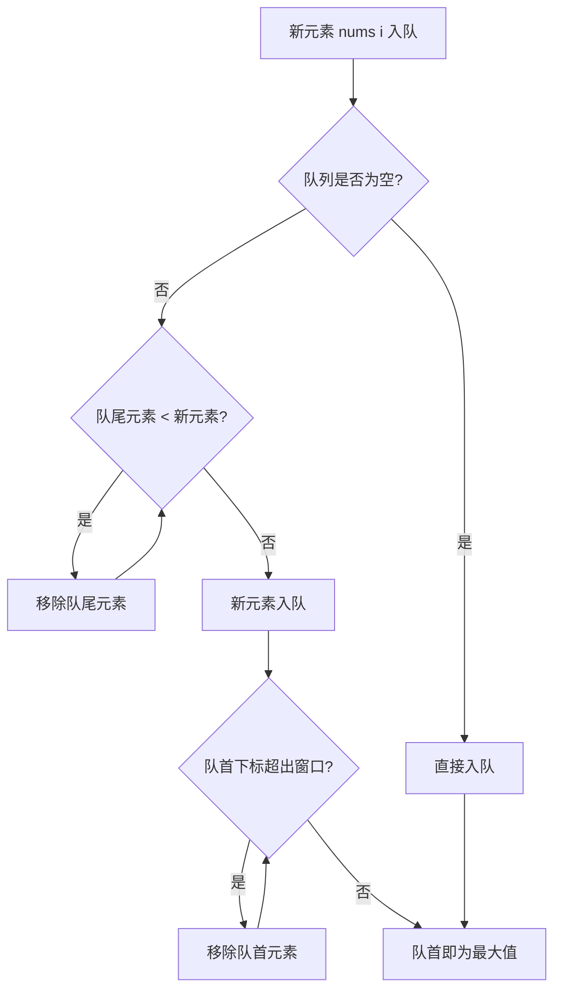
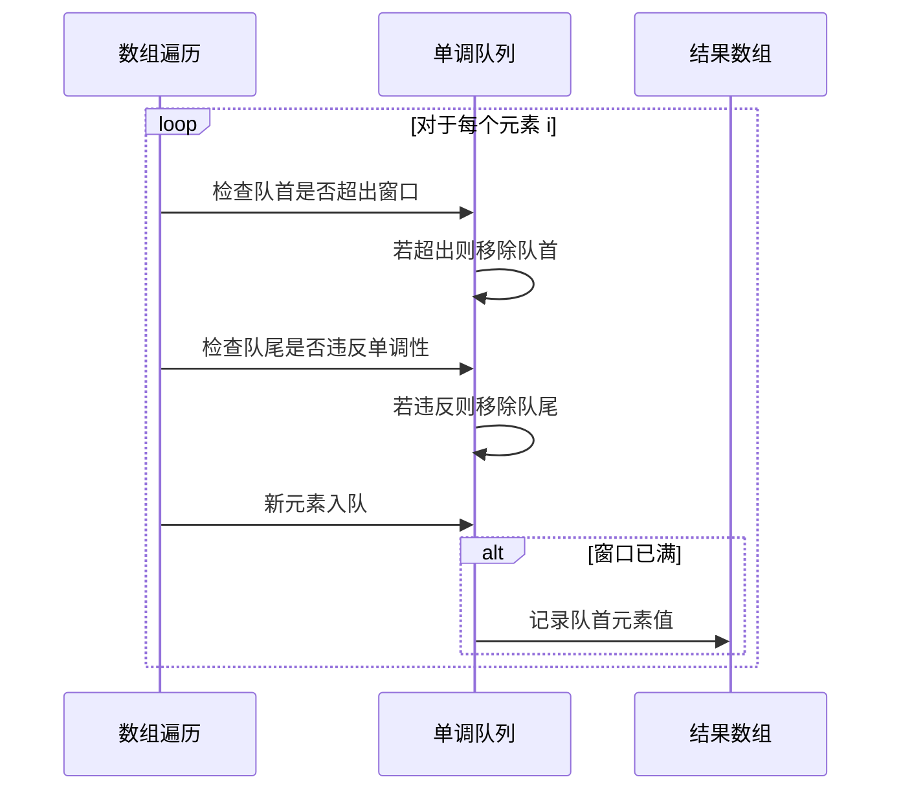

# 单调队列

## 概述

单调队列（Monotonic Queue）是一种特殊的双端队列，队列中的元素始终保持**单调递增**或**单调递减**的性质。它主要用于高效解决**滑动窗口最值问题**，能够在 O(n) 时间复杂度内处理整个数组。

<div style="background-color: #E3F2FD; border-left: 4px solid #2196F3; padding: 12px; margin: 10px 0;">
<strong>核心特征：</strong>单调队列维护窗口内的<strong>候选最值元素</strong>，通过在入队时移除无效元素，保证队首始终是当前窗口的最值。每个元素最多入队出队一次，因此整体时间复杂度为 O(n)。
</div>

### 与普通队列的对比

<div style="background-color: #F5F5F5; border-radius: 8px; padding: 20px; margin: 15px 0;">
<p style="font-weight: bold; text-align: center; margin-bottom: 20px; color: #1976D2; font-size: 16px;">普通队列 vs 单调队列</p>
<div style="display: flex; justify-content: space-around; gap: 20px;">
<div style="flex: 1;">
<p style="font-weight: bold; color: #2196F3; margin-bottom: 10px;">普通队列</p>
<div style="background-color: white; padding: 15px; border-radius: 6px; margin-bottom: 10px;">
<div style="display: flex; gap: 4px; margin-bottom: 8px;">
<div style="background-color: #E3F2FD; border: 2px solid #2196F3; padding: 8px 12px; border-radius: 4px; font-weight: bold;">3</div>
<div style="background-color: #E3F2FD; border: 2px solid #2196F3; padding: 8px 12px; border-radius: 4px; font-weight: bold;">1</div>
<div style="background-color: #E3F2FD; border: 2px solid #2196F3; padding: 8px 12px; border-radius: 4px; font-weight: bold;">4</div>
<div style="background-color: #E3F2FD; border: 2px solid #2196F3; padding: 8px 12px; border-radius: 4px; font-weight: bold;">1</div>
<div style="background-color: #E3F2FD; border: 2px solid #2196F3; padding: 8px 12px; border-radius: 4px; font-weight: bold;">5</div>
</div>
<p style="font-size: 12px; color: #666;">↑ 队首</p>
</div>
<p style="font-size: 13px; color: #555;">保持入队顺序</p>
<p style="font-size: 12px; color: #999; margin-top: 8px;">特点: FIFO，不保证任何有序性</p>
</div>
<div style="flex: 1;">
<p style="font-weight: bold; color: #4CAF50; margin-bottom: 10px;">单调队列（单调递减）</p>
<div style="background-color: white; padding: 15px; border-radius: 6px; margin-bottom: 10px;">
<div style="display: flex; gap: 4px; margin-bottom: 8px;">
<div style="background-color: #E8F5E9; border: 2px solid #4CAF50; padding: 8px 12px; border-radius: 4px; font-weight: bold;">5</div>
<div style="background-color: #E8F5E9; border: 2px solid #4CAF50; padding: 8px 12px; border-radius: 4px; font-weight: bold;">4</div>
<div style="background-color: #E8F5E9; border: 2px solid #4CAF50; padding: 8px 12px; border-radius: 4px; font-weight: bold;">3</div>
</div>
<p style="font-size: 12px; color: #4CAF50;">↑ 队首（当前窗口最大值）</p>
</div>
<p style="font-size: 13px; color: #555;">保持单调递减顺序</p>
<p style="font-size: 12px; color: #999; margin-top: 8px;">特点: 队首是最大值，队内元素单调递减</p>
</div>
</div>
</div>

## 单调队列特点

### 1. 双端操作

单调队列支持队首和队尾两端操作：

- **队首出队**：移除超出窗口范围的元素
- **队尾出队**：移除违反单调性的元素
- **队尾入队**：新元素从队尾进入（在移除无效元素后）

<div style="background-color: #F5F5F5; border-radius: 8px; padding: 20px; margin: 15px 0;">
<p style="font-weight: bold; text-align: center; margin-bottom: 20px; color: #1976D2; font-size: 16px;">单调队列操作示意图</p>
<div style="background-color: #E3F2FD; padding: 12px; border-radius: 6px; text-align: center; margin-bottom: 15px;">
<p style="font-weight: bold; color: #2196F3;">单调递减队列（维护窗口最大值）</p>
</div>
<div style="background-color: white; padding: 20px; border-radius: 6px; margin-bottom: 15px;">
<div style="display: flex; gap: 4px; margin-bottom: 10px; justify-content: center;">
<div style="background-color: #E8F5E9; border: 2px solid #4CAF50; padding: 12px 16px; border-radius: 4px; font-weight: bold;">9</div>
<div style="background-color: #E8F5E9; border: 2px solid #4CAF50; padding: 12px 16px; border-radius: 4px; font-weight: bold;">7</div>
<div style="background-color: #E8F5E9; border: 2px solid #4CAF50; padding: 12px 16px; border-radius: 4px; font-weight: bold;">5</div>
<div style="background-color: #E8F5E9; border: 2px solid #4CAF50; padding: 12px 16px; border-radius: 4px; font-weight: bold;">3</div>
</div>
<div style="display: flex; justify-content: space-between; padding: 0 20px;">
<div style="text-align: center;">
<p style="font-size: 12px; color: #4CAF50;">↑ front (最大值)</p>
</div>
<div style="text-align: center;">
<p style="font-size: 12px; color: #2196F3;">↑ rear (入队位置)</p>
</div>
</div>
</div>
<div style="display: grid; grid-template-columns: 1fr 1fr; gap: 15px;">
<div style="background-color: #FFEBEE; padding: 15px; border-radius: 6px; border-left: 4px solid #F44336;">
<p style="font-weight: bold; color: #F44336; margin-bottom: 8px;">从队首出队:</p>
<p style="font-size: 13px; color: #666;">• 窗口滑出</p>
<p style="font-size: 13px; color: #666;">• 获取最大值</p>
</div>
<div style="background-color: #E8F5E9; padding: 15px; border-radius: 6px; border-left: 4px solid #4CAF50;">
<p style="font-weight: bold; color: #4CAF50; margin-bottom: 8px;">从队尾入队:</p>
<p style="font-size: 13px; color: #666;">• 移除比新元素小的元素</p>
<p style="font-size: 13px; color: #666;">• 保持单调性</p>
</div>
</div>
</div>

### 2. 单调性

队列中的元素始终保持单调有序：

| 队列类型 | 单调性 | 队首元素 | 应用场景 |
|---------|--------|---------|---------|
| 单调递减队列 | 大 → 小 | 最大值 | 滑动窗口最大值 |
| 单调递增队列 | 小 → 大 | 最小值 | 滑动窗口最小值 |

<div style="background-color: #F5F5F5; border-radius: 8px; padding: 20px; margin: 15px 0;">
<p style="font-weight: bold; color: #1976D2; margin-bottom: 15px;">单调递减队列示例:</p>
<div style="background-color: white; padding: 15px; border-radius: 6px; margin-bottom: 15px;">
<p style="font-size: 14px; color: #666;">输入数组: <strong style="color: #2196F3;">[3, 1, 4, 2, 5, 3]</strong></p>
<p style="font-size: 14px; color: #666; margin-top: 8px;">窗口大小: <strong style="color: #4CAF50;">3</strong></p>
</div>
<table style="width: 100%; border-collapse: collapse; background-color: white; border-radius: 6px; overflow: hidden;">
<thead>
<tr style="background-color: #4CAF50; color: white;">
<th style="padding: 10px; text-align: center;">步骤</th>
<th style="padding: 10px; text-align: center;">当前元素</th>
<th style="padding: 10px; text-align: left;">操作</th>
<th style="padding: 10px; text-align: center;">队列状态</th>
</tr>
</thead>
<tbody>
<tr style="border-bottom: 1px solid #eee;">
<td style="padding: 10px; text-align: center;">1</td>
<td style="padding: 10px; text-align: center; font-weight: bold; color: #2196F3;">3</td>
<td style="padding: 10px;">入队</td>
<td style="padding: 10px; text-align: center; font-weight: bold;">[3]</td>
</tr>
<tr style="border-bottom: 1px solid #eee;">
<td style="padding: 10px; text-align: center;">2</td>
<td style="padding: 10px; text-align: center; font-weight: bold; color: #2196F3;">1</td>
<td style="padding: 10px;">1 &lt; 3, 直接入队</td>
<td style="padding: 10px; text-align: center; font-weight: bold;">[3, 1]</td>
</tr>
<tr style="border-bottom: 1px solid #eee; background-color: #E8F5E9;">
<td style="padding: 10px; text-align: center;">3</td>
<td style="padding: 10px; text-align: center; font-weight: bold; color: #4CAF50;">4</td>
<td style="padding: 10px;">4 &gt; 1, 4 &gt; 3, 移除后入队</td>
<td style="padding: 10px; text-align: center; font-weight: bold; color: #4CAF50;">[4]</td>
</tr>
<tr style="border-bottom: 1px solid #eee;">
<td style="padding: 10px; text-align: center;">4</td>
<td style="padding: 10px; text-align: center; font-weight: bold; color: #2196F3;">2</td>
<td style="padding: 10px;">2 &lt; 4, 直接入队</td>
<td style="padding: 10px; text-align: center; font-weight: bold;">[4, 2]</td>
</tr>
<tr style="border-bottom: 1px solid #eee; background-color: #E8F5E9;">
<td style="padding: 10px; text-align: center;">5</td>
<td style="padding: 10px; text-align: center; font-weight: bold; color: #4CAF50;">5</td>
<td style="padding: 10px;">5 &gt; 2, 5 &gt; 4, 移除后入队</td>
<td style="padding: 10px; text-align: center; font-weight: bold; color: #4CAF50;">[5]</td>
</tr>
<tr>
<td style="padding: 10px; text-align: center;">6</td>
<td style="padding: 10px; text-align: center; font-weight: bold; color: #2196F3;">3</td>
<td style="padding: 10px;">3 &lt; 5, 直接入队</td>
<td style="padding: 10px; text-align: center; font-weight: bold;">[5, 3]</td>
</tr>
</tbody>
</table>
<div style="background-color: #E8F5E9; padding: 12px; border-radius: 6px; margin-top: 15px; border-left: 4px solid #4CAF50;">
<p style="font-size: 13px; color: #4CAF50;"><strong>结论:</strong> 队列始终保持单调递减，队首是当前窗口的最大值</p>
</div>
</div>

### 3. 下标存储

单调队列通常存储**元素下标**而非元素值，原因：

1. **判断窗口范围**：通过下标计算元素是否超出窗口
2. **获取元素值**：通过下标在原数组中获取值
3. **处理重复元素**：下标唯一，避免歧义

```
存储下标的优势:

原数组: nums = [3, 1, 4, 1, 5, 4, 3]

情况1: 存储值
队列: [5, 4, 4, 3]
问题: 两个4无法区分，不知道哪个在窗口内

情况2: 存储下标 ✓
队列: [4, 5, 6]  (存储下标)
值:   [5, 4, 3]  (对应值)

判断窗口范围:
当前处理位置 i = 6, 窗口大小 k = 3
窗口范围: [i-k+1, i] = [4, 6]

检查队首下标 4:
4 >= i-k+1 = 4  ✓ 在窗口内

检查队首下标 3 (假设在队列中):
3 < i-k+1 = 4   ✗ 超出窗口，需要移除
```

### 4. 滑动窗口配合

单调队列与滑动窗口完美配合：

```
滑动窗口移动示意图:

数组: [1, 3, -1, -3, 5, 3, 6, 7]
窗口大小: k = 3

时间    窗口范围      窗口内容       单调队列(下标)    最大值
──────────────────────────────────────────────────────────────
i=0     [0,0]        [1]           [0]              -
i=1     [0,1]        [1,3]         [1]              -
i=2     [0,2]        [1,3,-1]      [1,2]            nums[1]=3 ✓
i=3     [1,3]        [3,-1,-3]     [1,2,3]          nums[1]=3 ✓
i=4     [2,4]        [-1,-3,5]     [4]              nums[4]=5 ✓
        ┌─────────────────────────────────────┐
        │ 5比前面的元素都大，队列清空后入队     │
        └─────────────────────────────────────┘
i=5     [3,5]        [-3,5,3]      [4,5]            nums[4]=5 ✓
i=6     [4,6]        [5,3,6]       [6]              nums[6]=6 ✓
        ┌─────────────────────────────────────┐
        │ 6比前面的元素都大，队列清空后入队     │
        └─────────────────────────────────────┘
i=7     [5,7]        [3,6,7]       [7]              nums[7]=7 ✓

结果: [3, 3, 5, 5, 6, 7]
```

## 原理详解

### 单调队列维护策略

以滑动窗口最大值（单调递减队列）为例：



### 入队操作详解

入队时移除所有比当前元素小的队尾元素（对于单调递减队列）：

```
入队操作原理（单调递减队列）:

为什么移除比当前元素小的元素?

假设队列中有元素 a < b < 当前元素 c

              ┌───┬───┬───┐
              │ a │ b │   │  ← 队尾
              └───┴───┴───┘

当 c 入队时:
1. c > b: b 在 c 之后入队，且 b < c
          所以 b 永远不可能是最大值（c 比 b 大且后出队）
          移除 b

              ┌───┬───┐
              │ a │   │
              └───┴───┘

2. c > a: 同理，a 也永远不可能是最大值
          移除 a

              ┌───┐
              │   │
              └───┘

3. c 入队:

              ┌───┐
              │ c │
              └───┘

结论: 比当前元素小的队尾元素都是"无效元素"，可以安全移除
```

### 出队操作详解

窗口滑动时移除超出范围的队首元素：

```
出队操作原理:

当前处理位置: i
窗口大小: k
窗口范围: [i-k+1, i]

检查队首下标是否在窗口内:
- 如果 queue[front] < i-k+1，则队首元素已超出窗口
- 移除队首元素

示例:
i = 5, k = 3
窗口范围: [3, 5]

队列状态: [1, 3, 4, 5] (存储下标)
          ↓
检查队首下标 1: 1 < 3，超出窗口，移除

队列状态: [3, 4, 5]
          ↓
检查队首下标 3: 3 >= 3，在窗口内，保留

队首元素下标 3 对应的值即为窗口最大值
```

### 完整算法流程

```
滑动窗口最大值算法:

输入: nums[], n, k
输出: result[]

初始化: 双端队列 deque, 结果数组 result

for i = 0 to n-1:
    
    步骤1: 移除超出窗口的队首元素
    while deque不为空 && deque[front] <= i - k:
        front++
    
    步骤2: 移除违反单调性的队尾元素
    while deque不为空 && nums[deque[rear-1]] < nums[i]:
        rear--
    
    步骤3: 新元素入队
    deque[rear++] = i
    
    步骤4: 记录窗口最大值
    if i >= k - 1:
        result[i-k+1] = nums[deque[front]]

返回 result
```

## 可视化演示

### 滑动窗口最大值完整演示

```
输入: nums = [1, 3, -1, -3, 5, 3, 6, 7], k = 3

═══════════════════════════════════════════════════════════════
i = 0: 处理 nums[0] = 1
═══════════════════════════════════════════════════════════════

数组:   [ 1,  3, -1, -3,  5,  3,  6,  7]
         ↑
        i=0

窗口: [1] (未满)

队列操作:
- 队列为空，直接入队
- deque = [0]

队列状态(下标→值): [0→1]

═══════════════════════════════════════════════════════════════
i = 1: 处理 nums[1] = 3
═══════════════════════════════════════════════════════════════

数组:   [ 1,  3, -1, -3,  5,  3,  6,  7]
             ↑
            i=1

窗口: [1, 3] (未满)

队列操作:
- nums[0]=1 < nums[1]=3, 移除队尾
- deque = []
- 入队: deque = [1]

队列状态(下标→值): [1→3]

═══════════════════════════════════════════════════════════════
i = 2: 处理 nums[2] = -1
═══════════════════════════════════════════════════════════════

数组:   [ 1,  3, -1, -3,  5,  3,  6,  7]
                 ↑
                i=2

窗口: [1, 3, -1] (已满) → 记录结果

队列操作:
- nums[1]=3 > nums[2]=-1, 不移除
- 入队: deque = [1, 2]

队列状态(下标→值): [1→3, 2→-1]
队首值 nums[1] = 3

结果: [3]

═══════════════════════════════════════════════════════════════
i = 3: 处理 nums[3] = -3
═══════════════════════════════════════════════════════════════

数组:   [ 1,  3, -1, -3,  5,  3,  6,  7]
                     ↑
                    i=3

窗口: [3, -1, -3] (已满) → 记录结果

队列操作:
- 检查窗口范围: front=1 >= i-k+1=1, 在窗口内
- nums[2]=-1 > nums[3]=-3, 不移除
- 入队: deque = [1, 2, 3]

队列状态(下标→值): [1→3, 2→-1, 3→-3]
队首值 nums[1] = 3

结果: [3, 3]

═══════════════════════════════════════════════════════════════
i = 4: 处理 nums[4] = 5
═══════════════════════════════════════════════════════════════

数组:   [ 1,  3, -1, -3,  5,  3,  6,  7]
                         ↑
                        i=4

窗口: [-1, -3, 5] (已满) → 记录结果

队列操作:
- 检查窗口范围: front=1 < i-k+1=2, 超出窗口, 移除
  deque = [2, 3]
- nums[3]=-3 < nums[4]=5, 移除队尾
  deque = [2]
- nums[2]=-1 < nums[4]=5, 移除队尾
  deque = []
- 入队: deque = [4]

队列状态(下标→值): [4→5]
队首值 nums[4] = 5

结果: [3, 3, 5]

═══════════════════════════════════════════════════════════════
i = 5: 处理 nums[5] = 3
═══════════════════════════════════════════════════════════════

数组:   [ 1,  3, -1, -3,  5,  3,  6,  7]
                             ↑
                            i=5

窗口: [-3, 5, 3] (已满) → 记录结果

队列操作:
- 检查窗口范围: front=4 >= i-k+1=3, 在窗口内
- nums[4]=5 > nums[5]=3, 不移除
- 入队: deque = [4, 5]

队列状态(下标→值): [4→5, 5→3]
队首值 nums[4] = 5

结果: [3, 3, 5, 5]

═══════════════════════════════════════════════════════════════
i = 6: 处理 nums[6] = 6
═══════════════════════════════════════════════════════════════

数组:   [ 1,  3, -1, -3,  5,  3,  6,  7]
                                 ↑
                                i=6

窗口: [5, 3, 6] (已满) → 记录结果

队列操作:
- 检查窗口范围: front=4 >= i-k+1=4, 在窗口内
- nums[5]=3 < nums[6]=6, 移除队尾
  deque = [4]
- nums[4]=5 < nums[6]=6, 移除队尾
  deque = []
- 入队: deque = [6]

队列状态(下标→值): [6→6]
队首值 nums[6] = 6

结果: [3, 3, 5, 5, 6]

═══════════════════════════════════════════════════════════════
i = 7: 处理 nums[7] = 7
═══════════════════════════════════════════════════════════════

数组:   [ 1,  3, -1, -3,  5,  3,  6,  7]
                                     ↑
                                    i=7

窗口: [3, 6, 7] (已满) → 记录结果

队列操作:
- 检查窗口范围: front=6 >= i-k+1=5, 在窗口内
- nums[6]=6 < nums[7]=7, 移除队尾
  deque = []
- 入队: deque = [7]

队列状态(下标→值): [7→7]
队首值 nums[7] = 7

结果: [3, 3, 5, 5, 6, 7]

═══════════════════════════════════════════════════════════════
最终结果: [3, 3, 5, 5, 6, 7]
═══════════════════════════════════════════════════════════════
```

### 操作流程图



## 代码实现

### 滑动窗口最大值

=== "C"
    ```c
    int* maxSlidingWindow(int nums[], int n, int k, int *returnSize) {
        *returnSize = n - k + 1;
        int *result = (int*)malloc(sizeof(int) * (*returnSize));
        
        // 使用数组模拟双端队列（存储下标）
        int *deque = (int*)malloc(sizeof(int) * n);
        int front = 0, rear = 0;
        
        for (int i = 0; i < n; i++) {
            // 步骤1: 移除超出窗口的队首元素
            while (front < rear && deque[front] <= i - k) {
                front++;
            }
            
            // 步骤2: 移除违反单调性的队尾元素
            // 对于最大值，移除所有比当前元素小的队尾元素
            while (front < rear && nums[deque[rear - 1]] < nums[i]) {
                rear--;
            }
            
            // 步骤3: 新元素入队
            deque[rear++] = i;
            
            // 步骤4: 记录窗口最大值
            if (i >= k - 1) {
                result[i - k + 1] = nums[deque[front]];
            }
        }
        
        free(deque);
        return result;
    }
    ```

=== "C++"
    ```cpp
    #include <vector>
    #include <deque>
    
    std::vector<int> maxSlidingWindow(std::vector<int>& nums, int k) {
        std::deque<int> dq;  // 存储下标
        std::vector<int> result;
        
        for (int i = 0; i < nums.size(); i++) {
            // 移除超出窗口的元素
            while (!dq.empty() && dq.front() <= i - k) {
                dq.pop_front();
            }
            
            // 维护单调递减
            while (!dq.empty() && nums[dq.back()] < nums[i]) {
                dq.pop_back();
            }
            
            dq.push_back(i);
            
            // 记录结果
            if (i >= k - 1) {
                result.push_back(nums[dq.front()]);
            }
        }
        
        return result;
    }
    ```

=== "Python"
    ```python
    from collections import deque
    
    def max_sliding_window(nums, k):
        dq = deque()  # 存储下标
        result = []
        
        for i in range(len(nums)):
            # 移除超出窗口的元素
            while dq and dq[0] <= i - k:
                dq.popleft()
            
            # 维护单调递减
            while dq and nums[dq[-1]] < nums[i]:
                dq.pop()
            
            dq.append(i)
            
            # 记录结果
            if i >= k - 1:
                result.append(nums[dq[0]])
        
        return result
    ```

=== "Java"
    ```java
    import java.util.*;
    
    public int[] maxSlidingWindow(int[] nums, int k) {
        Deque<Integer> dq = new ArrayDeque<>();  // 存储下标
        int[] result = new int[nums.length - k + 1];
        int idx = 0;
        
        for (int i = 0; i < nums.length; i++) {
            // 移除超出窗口的元素
            while (!dq.isEmpty() && dq.peekFirst() <= i - k) {
                dq.pollFirst();
            }
            
            // 维护单调递减
            while (!dq.isEmpty() && nums[dq.peekLast()] < nums[i]) {
                dq.pollLast();
            }
            
            dq.offerLast(i);
            
            // 记录结果
            if (i >= k - 1) {
                result[idx++] = nums[dq.peekFirst()];
            }
        }
        
        return result;
    }
    ```

=== "Go"
    ```go
    func maxSlidingWindow(nums []int, k int) []int {
        dq := []int{}  // 存储下标
        result := []int{}
        
        for i := 0; i < len(nums); i++ {
            // 移除超出窗口的元素
            for len(dq) > 0 && dq[0] <= i-k {
                dq = dq[1:]
            }
            
            // 维护单调递减
            for len(dq) > 0 && nums[dq[len(dq)-1]] < nums[i] {
                dq = dq[:len(dq)-1]
            }
            
            dq = append(dq, i)
            
            // 记录结果
            if i >= k-1 {
                result = append(result, nums[dq[0]])
            }
        }
        
        return result
    }
    ```

=== "Rust"
    ```rust
    use std::collections::VecDeque;
    
    fn max_sliding_window(nums: &[i32], k: usize) -> Vec<i32> {
        let mut dq: VecDeque<usize> = VecDeque::new();  // 存储下标
        let mut result = Vec::new();
        
        for i in 0..nums.len() {
            // 移除超出窗口的元素
            while !dq.is_empty() && *dq.front().unwrap() <= i - k {
                dq.pop_front();
            }
            
            // 维护单调递减
            while !dq.is_empty() && nums[*dq.back().unwrap()] < nums[i] {
                dq.pop_back();
            }
            
            dq.push_back(i);
            
            // 记录结果
            if i >= k - 1 {
                result.push(nums[*dq.front().unwrap()]);
            }
        }
        
        result
    }
    ```

### 滑动窗口最小值

=== "C"
    ```c
    int* minSlidingWindow(int nums[], int n, int k, int *returnSize) {
        *returnSize = n - k + 1;
        int *result = (int*)malloc(sizeof(int) * (*returnSize));
        
        int *deque = (int*)malloc(sizeof(int) * n);
        int front = 0, rear = 0;
        
        for (int i = 0; i < n; i++) {
            // 移除超出窗口的队首元素
            while (front < rear && deque[front] <= i - k) {
                front++;
            }
            
            // 移除违反单调性的队尾元素
            // 对于最小值，移除所有比当前元素大的队尾元素
            while (front < rear && nums[deque[rear - 1]] > nums[i]) {
                rear--;
            }
            
            // 新元素入队
            deque[rear++] = i;
            
            // 记录窗口最小值
            if (i >= k - 1) {
                result[i - k + 1] = nums[deque[front]];
            }
        }
        
        free(deque);
        return result;
    }
    ```

=== "C++"
    ```cpp
    std::vector<int> minSlidingWindow(std::vector<int>& nums, int k) {
        std::deque<int> dq;  // 存储下标
        std::vector<int> result;
        
        for (int i = 0; i < nums.size(); i++) {
            // 移除超出窗口的元素
            while (!dq.empty() && dq.front() <= i - k) {
                dq.pop_front();
            }
            
            // 维护单调递增
            while (!dq.empty() && nums[dq.back()] > nums[i]) {
                dq.pop_back();
            }
            
            dq.push_back(i);
            
            // 记录结果
            if (i >= k - 1) {
                result.push_back(nums[dq.front()]);
            }
        }
        
        return result;
    }
    ```

=== "Python"
    ```python
    from collections import deque
    
    def min_sliding_window(nums, k):
        dq = deque()  # 存储下标
        result = []
        
        for i in range(len(nums)):
            # 移除超出窗口的元素
            while dq and dq[0] <= i - k:
                dq.popleft()
            
            # 维护单调递增
            while dq and nums[dq[-1]] > nums[i]:
                dq.pop()
            
            dq.append(i)
            
            # 记录结果
            if i >= k - 1:
                result.append(nums[dq[0]])
        
        return result
    ```

=== "Java"
    ```java
    public int[] minSlidingWindow(int[] nums, int k) {
        Deque<Integer> dq = new ArrayDeque<>();
        int[] result = new int[nums.length - k + 1];
        int idx = 0;
        
        for (int i = 0; i < nums.length; i++) {
            while (!dq.isEmpty() && dq.peekFirst() <= i - k) {
                dq.pollFirst();
            }
            
            while (!dq.isEmpty() && nums[dq.peekLast()] > nums[i]) {
                dq.pollLast();
            }
            
            dq.offerLast(i);
            
            if (i >= k - 1) {
                result[idx++] = nums[dq.peekFirst()];
            }
        }
        
        return result;
    }
    ```

=== "Go"
    ```go
    func minSlidingWindow(nums []int, k int) []int {
        dq := []int{}
        result := []int{}
        
        for i := 0; i < len(nums); i++ {
            for len(dq) > 0 && dq[0] <= i-k {
                dq = dq[1:]
            }
            
            for len(dq) > 0 && nums[dq[len(dq)-1]] > nums[i] {
                dq = dq[:len(dq)-1]
            }
            
            dq = append(dq, i)
            
            if i >= k-1 {
                result = append(result, nums[dq[0]])
            }
        }
        
        return result
    }
    ```

=== "Rust"
    ```rust
    fn min_sliding_window(nums: &[i32], k: usize) -> Vec<i32> {
        let mut dq: VecDeque<usize> = VecDeque::new();
        let mut result = Vec::new();
        
        for i in 0..nums.len() {
            while !dq.is_empty() && *dq.front().unwrap() <= i - k {
                dq.pop_front();
            }
            
            while !dq.is_empty() && nums[*dq.back().unwrap()] > nums[i] {
                dq.pop_back();
            }
            
            dq.push_back(i);
            
            if i >= k - 1 {
                result.push(nums[*dq.front().unwrap()]);
            }
        }
        
        result
    }
    ```

### 完整结构实现

=== "C"
    ```c
    typedef struct {
        int *data;       // 数据数组（存储下标）
        int front;       // 队首指针
        int rear;        // 队尾指针
        int capacity;    // 容量
    } MonotonicQueue;
    
    // 创建单调队列
    MonotonicQueue* createMQ(int capacity) {
        MonotonicQueue *mq = (MonotonicQueue*)malloc(sizeof(MonotonicQueue));
        mq->data = (int*)malloc(sizeof(int) * capacity);
        mq->front = 0;
        mq->rear = 0;
        mq->capacity = capacity;
        return mq;
    }
    
    // 判空
    int isEmptyMQ(MonotonicQueue *mq) {
        return mq->front == mq->rear;
    }
    
    // 入队（维护最大值的单调递减队列）
    void pushMax(MonotonicQueue *mq, int nums[], int index) {
        // 移除所有比当前元素小的队尾元素
        while (!isEmptyMQ(mq) && nums[mq->data[mq->rear - 1]] < nums[index]) {
            mq->rear--;
        }
        mq->data[mq->rear++] = index;
    }
    
    // 移除超出窗口的元素
    void popIfExpired(MonotonicQueue *mq, int index, int k) {
        if (!isEmptyMQ(mq) && mq->data[mq->front] <= index - k) {
            mq->front++;
        }
    }
    
    // 获取最大值
    int getMax(MonotonicQueue *mq, int nums[]) {
        return nums[mq->data[mq->front]];
    }
    
    // 销毁单调队列
    void destroyMQ(MonotonicQueue *mq) {
        free(mq->data);
        free(mq);
    }
    ```

=== "C++"
    ```cpp
    #include <deque>
    
    class MonotonicQueue {
    private:
        std::deque<int> dq;  // 存储下标
        
    public:
        // 入队（单调递减）
        void push(std::vector<int>& nums, int index) {
            while (!dq.empty() && nums[dq.back()] < nums[index]) {
                dq.pop_back();
            }
            dq.push_back(index);
        }
        
        // 移除超出窗口的元素
        void pop(int index, int k) {
            if (!dq.empty() && dq.front() <= index - k) {
                dq.pop_front();
            }
        }
        
        // 获取队首下标
        int front() {
            return dq.front();
        }
        
        // 判空
        bool empty() {
            return dq.empty();
        }
    };
    ```

=== "Python"
    ```python
    from collections import deque
    
    class MonotonicQueue:
        def __init__(self):
            self.dq = deque()  # 存储下标
        
        def push(self, nums, index):
            """入队（单调递减）"""
            while self.dq and nums[self.dq[-1]] < nums[index]:
                self.dq.pop()
            self.dq.append(index)
        
        def pop(self, index, k):
            """移除超出窗口的元素"""
            if self.dq and self.dq[0] <= index - k:
                self.dq.popleft()
        
        def front(self):
            """获取队首下标"""
            return self.dq[0]
        
        def empty(self):
            """判空"""
            return len(self.dq) == 0
    ```

=== "Java"
    ```java
    import java.util.*;
    
    class MonotonicQueue {
        private Deque<Integer> dq = new ArrayDeque<>();  // 存储下标
        
        // 入队（单调递减）
        public void push(int[] nums, int index) {
            while (!dq.isEmpty() && nums[dq.peekLast()] < nums[index]) {
                dq.pollLast();
            }
            dq.offerLast(index);
        }
        
        // 移除超出窗口的元素
        public void pop(int index, int k) {
            if (!dq.isEmpty() && dq.peekFirst() <= index - k) {
                dq.pollFirst();
            }
        }
        
        // 获取队首下标
        public int front() {
            return dq.peekFirst();
        }
        
        // 判空
        public boolean empty() {
            return dq.isEmpty();
        }
    }
    ```

=== "Go"
    ```go
    type MonotonicQueue struct {
        dq []int  // 存储下标
    }
    
    func NewMonotonicQueue() *MonotonicQueue {
        return &MonotonicQueue{dq: []int{}}
    }
    
    // 入队（单调递减）
    func (mq *MonotonicQueue) Push(nums []int, index int) {
        for len(mq.dq) > 0 && nums[mq.dq[len(mq.dq)-1]] < nums[index] {
            mq.dq = mq.dq[:len(mq.dq)-1]
        }
        mq.dq = append(mq.dq, index)
    }
    
    // 移除超出窗口的元素
    func (mq *MonotonicQueue) Pop(index, k int) {
        if len(mq.dq) > 0 && mq.dq[0] <= index-k {
            mq.dq = mq.dq[1:]
        }
    }
    
    // 获取队首下标
    func (mq *MonotonicQueue) Front() int {
        return mq.dq[0]
    }
    
    // 判空
    func (mq *MonotonicQueue) Empty() bool {
        return len(mq.dq) == 0
    }
    ```

=== "Rust"
    ```rust
    use std::collections::VecDeque;
    
    struct MonotonicQueue {
        dq: VecDeque<usize>,  // 存储下标
    }
    
    impl MonotonicQueue {
        fn new() -> Self {
            MonotonicQueue { dq: VecDeque::new() }
        }
        
        // 入队（单调递减）
        fn push(&mut self, nums: &[i32], index: usize) {
            while !self.dq.is_empty() && nums[*self.dq.back().unwrap()] < nums[index] {
                self.dq.pop_back();
            }
            self.dq.push_back(index);
        }
        
        // 移除超出窗口的元素
        fn pop(&mut self, index: usize, k: usize) {
            if !self.dq.is_empty() && *self.dq.front().unwrap() <= index - k {
                self.dq.pop_front();
            }
        }
        
        // 获取队首下标
        fn front(&self) -> usize {
            *self.dq.front().unwrap()
        }
        
        // 判空
        fn is_empty(&self) -> bool {
            self.dq.is_empty()
        }
    }
    ```

## 复杂度分析

### 时间复杂度

| 操作 | 单次复杂度 | 摊还复杂度 | 说明 |
|------|-----------|-----------|------|
| 入队 | O(k) 最坏 | O(1) 摊还 | 最多移除k个元素，但每个元素只被移除一次 |
| 出队 | O(1) | O(1) | 只移除一个元素 |
| 获取最值 | O(1) | O(1) | 直接访问队首 |

**整体时间复杂度**: O(n)

```
摊还分析:

每个元素最多:
- 入队一次
- 出队一次（被移除）

因此，虽然有嵌套循环，但总操作次数 ≤ 2n

总时间复杂度 = O(n)
```

### 空间复杂度

- O(k)：队列最多存储 k 个元素（窗口大小）

## 单调栈 vs 单调队列

```
┌─────────────────────────────────────────────────────────────────────┐
│                    单调栈 vs 单调队列                                │
├─────────────────────────────────────────────────────────────────────┤
│                                                                     │
│  单调栈 (Monotonic Stack):                                          │
│  ┌───┬───┬───┬───┐                                                 │
│  │   │   │   │   │  只能从栈顶操作                                  │
│  └───┴───┴───┴───┘                                                 │
│    ↑栈顶                                                           │
│                                                                     │
│  应用场景:                                                           │
│  - 下一个更大/更小元素                                               │
│  - 柱状图最大矩形                                                    │
│  - 每日温度问题                                                     │
│                                                                     │
│  特点: 处理"向后看"的问题                                            │
│                                                                     │
├─────────────────────────────────────────────────────────────────────┤
│                                                                     │
│  单调队列 (Monotonic Queue):                                        │
│  ┌───┬───┬───┬───┐                                                 │
│  │   │   │   │   │  队首和队尾都能操作                              │
│  └───┴───┴───┴───┘                                                 │
│    ↑队首        ↑队尾                                               │
│                                                                     │
│  应用场景:                                                           │
│  - 滑动窗口最大/最小值                                               │
│  - 滑动窗口中位数                                                    │
│  - 最短子数组问题                                                   │
│                                                                     │
│  特点: 处理"滑动窗口"的问题                                          │
│                                                                     │
└─────────────────────────────────────────────────────────────────────┘
```

| 特性 | 单调栈 | 单调队列 |
|------|--------|---------|
| 数据结构 | 栈 | 双端队列 |
| 操作端 | 单端（栈顶） | 双端（队首+队尾） |
| 单调性 | 单调递增/递减 | 单调递增/递减 |
| 适用场景 | 下一个更大/更小元素 | 滑动窗口最值 |
| 时间复杂度 | O(n) | O(n) |
| 空间复杂度 | O(n) | O(k) |

## 应用场景

### 1. 滑动窗口最大值

最常见的应用，已在上面详细讲解。

### 2. 滑动窗口中位数

使用两个单调队列维护窗口内的元素：

```c
double* medianSlidingWindow(int nums[], int n, int k, int *returnSize) {
    *returnSize = n - k + 1;
    double *result = (double*)malloc(sizeof(double) * (*returnSize));
    
    int *window = (int*)malloc(sizeof(int) * k);
    
    for (int i = 0; i < n - k + 1; i++) {
        // 复制窗口元素
        for (int j = 0; j < k; j++) {
            window[j] = nums[i + j];
        }
        
        // 插入排序
        for (int j = 1; j < k; j++) {
            int key = window[j];
            int m = j - 1;
            while (m >= 0 && window[m] > key) {
                window[m + 1] = window[m];
                m--;
            }
            window[m + 1] = key;
        }
        
        // 计算中位数
        if (k % 2 == 1) {
            result[i] = window[k / 2];
        } else {
            result[i] = (window[k / 2 - 1] + window[k / 2]) / 2.0;
        }
    }
    
    free(window);
    return result;
}
```

**中位数计算图解：**

```
窗口大小 k = 4 (偶数):
排序后窗口: [1, 2, 3, 4]
中位数 = (window[1] + window[2]) / 2 = (2 + 3) / 2 = 2.5

窗口大小 k = 5 (奇数):
排序后窗口: [1, 2, 3, 4, 5]
中位数 = window[2] = 3
```

### 3. 和至少为K的最短子数组

使用前缀和 + 单调队列：

```c
int shortestSubarray(int nums[], int n, int k) {
    // 计算前缀和
    long long *prefix = (long long*)malloc(sizeof(long long) * (n + 1));
    prefix[0] = 0;
    for (int i = 0; i < n; i++) {
        prefix[i + 1] = prefix[i] + nums[i];
    }
    
    // 单调队列（存储前缀和下标）
    int *deque = (int*)malloc(sizeof(int) * (n + 1));
    int front = 0, rear = 0;
    int minLen = n + 1;
    
    for (int i = 0; i <= n; i++) {
        // 尝试更新答案
        while (front < rear && prefix[i] - prefix[deque[front]] >= k) {
            int len = i - deque[front];
            if (len < minLen) minLen = len;
            front++;
        }
        
        // 维护单调递增队列
        while (front < rear && prefix[i] <= prefix[deque[rear - 1]]) {
            rear--;
        }
        
        deque[rear++] = i;
    }
    
    free(prefix);
    free(deque);
    
    return (minLen == n + 1) ? -1 : minLen;
}
```

**算法原理：**

```
问题: 找到最短的子数组，使其和 >= k

使用前缀和:
子数组 [i, j] 的和 = prefix[j+1] - prefix[i]

目标: 找到最小的 j - i + 1，使得 prefix[j+1] - prefix[i] >= k

单调队列的作用:
- 队列中存储前缀和下标，保持 prefix 值单调递增
- 对于当前位置 i，寻找队首 j 使得 prefix[i] - prefix[j] >= k
- 这样就找到了一个满足条件的子数组 [j, i-1]
```

### 4. 动态规划优化

单调队列可以优化某些动态规划问题：

```
DP 优化示例: 滑动窗口最大值的DP解法

朴素DP: dp[i] = max(nums[j]) for j in [i-k+1, i]
时间复杂度: O(n * k)

使用单调队列优化:
- 维护一个单调递减队列
- dp[i] = nums[queue.front()]
时间复杂度: O(n)
```

## 参考资料

- 《算法竞赛入门经典》- 单调队列专题
- [LeetCode 239. 滑动窗口最大值](https://leetcode.com/problems/sliding-window-maximum/)
- [LeetCode 862. 和至少为K的最短子数组](https://leetcode.com/problems/shortest-subarray-with-sum-at-least-k/)
- 单调队列与单调栈的对比与应用
