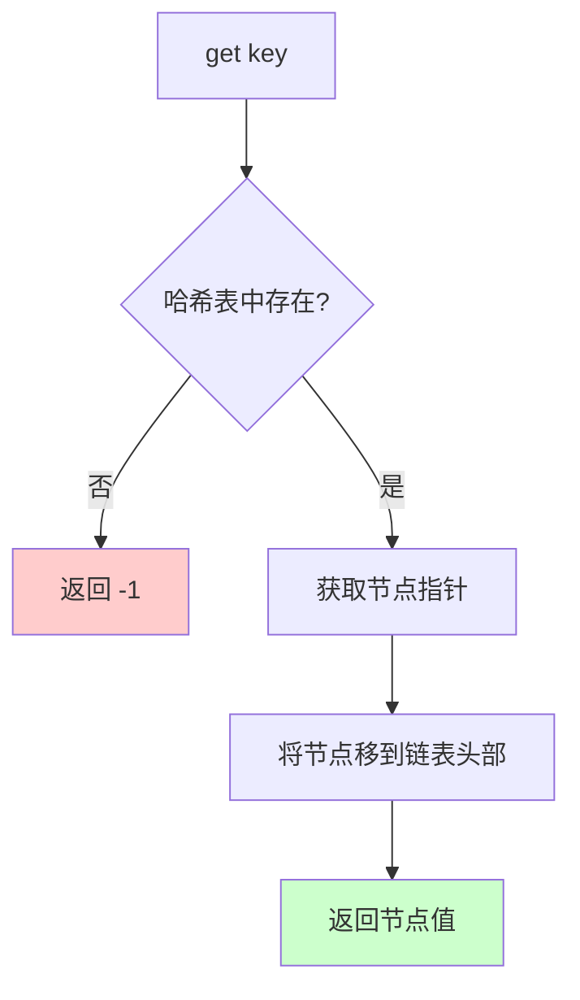
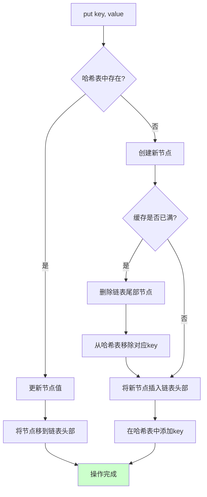

# LRU缓存

## 概述

LRU（Least Recently Used，最近最少使用）是一种经典的**缓存淘汰策略**。当缓存容量已满时，淘汰最长时间未被访问的数据，为新数据腾出空间。

<div style="background-color: #E3F2FD; border-left: 4px solid #2196F3; padding: 12px; margin: 10px 0;">
<strong>核心特征：</strong>LRU缓存通过<strong>哈希表 + 双向链表</strong>的组合，实现 O(1) 时间复杂度的 get 和 put 操作。哈希表提供快速查找，双向链表维护访问顺序。
</div>

### 缓存淘汰策略对比

<div style="background-color: #F5F5F5; border-radius: 8px; padding: 20px; margin: 15px 0;">
<p style="font-weight: bold; text-align: center; margin-bottom: 20px; color: #1976D2; font-size: 16px;">常见缓存淘汰策略</p>
<div style="display: grid; gap: 15px;">
<div style="background-color: white; padding: 15px; border-radius: 6px; border-left: 4px solid #4CAF50;">
<p style="font-weight: bold; color: #4CAF50; margin-bottom: 8px;">LRU (Least Recently Used) - 最近最少使用</p>
<p style="font-size: 13px; color: #666; margin: 5px 0;">• 淘汰标准: 最长时间未被访问</p>
<p style="font-size: 13px; color: #666; margin: 5px 0;">• 特点: 基于时间局部性原理</p>
<p style="font-size: 13px; color: #666; margin: 5px 0;">• 实现: 哈希表 + 双向链表</p>
</div>
<div style="background-color: white; padding: 15px; border-radius: 6px; border-left: 4px solid #2196F3;">
<p style="font-weight: bold; color: #2196F3; margin-bottom: 8px;">LFU (Least Frequently Used) - 最不经常使用</p>
<p style="font-size: 13px; color: #666; margin: 5px 0;">• 淘汰标准: 访问次数最少</p>
<p style="font-size: 13px; color: #666; margin: 5px 0;">• 特点: 基于频率统计</p>
<p style="font-size: 13px; color: #666; margin: 5px 0;">• 实现: 哈希表 + 频率桶 + 双向链表</p>
</div>
<div style="background-color: white; padding: 15px; border-radius: 6px; border-left: 4px solid #FF9800;">
<p style="font-weight: bold; color: #FF9800; margin-bottom: 8px;">FIFO (First In First Out) - 先进先出</p>
<p style="font-size: 13px; color: #666; margin: 5px 0;">• 淘汰标准: 最先进入缓存的</p>
<p style="font-size: 13px; color: #666; margin: 5px 0;">• 特点: 简单但不考虑访问模式</p>
<p style="font-size: 13px; color: #666; margin: 5px 0;">• 实现: 普通队列</p>
</div>
<div style="background-color: white; padding: 15px; border-radius: 6px; border-left: 4px solid #9E9E9E;">
<p style="font-weight: bold; color: #9E9E9E; margin-bottom: 8px;">Random - 随机淘汰</p>
<p style="font-size: 13px; color: #666; margin: 5px 0;">• 淘汰标准: 随机选择</p>
<p style="font-size: 13px; color: #666; margin: 5px 0;">• 特点: 实现简单，性能较差</p>
<p style="font-size: 13px; color: #666; margin: 5px 0;">• 实现: 随机选择一个key删除</p>
</div>
</div>
</div>

## LRU特点

### 1. 容量限制

LRU缓存有固定的容量限制，当缓存满时需要淘汰数据：

```
容量限制示例（capacity = 3）:

初始状态（空缓存）:
┌────┬────┬────┐
│    │    │    │
└────┴────┴────┘
size = 0, capacity = 3

放入 A, B, C 后:
┌────┬────┬────┐
│ A  │ B  │ C  │
└────┴────┴────┘
size = 3, capacity = 3 (已满)

尝试放入 D:
┌────┬────┬────┐
│ B  │ C  │ D  │
└────┴────┴────┘
淘汰最久未使用的 A，腾出空间给 D
```

### 2. 访问更新

每次访问（get 或 put）都会更新数据的位置，将其移动到"最近使用"的位置：

```
访问更新示例:

初始状态: [A] ← [B] ← [C] ← [D]
          ↑最近    最久↑

访问 B 后:
- B 被移动到最近位置
- 其他元素顺序不变

状态变为: [B] ← [A] ← [C] ← [D]
          ↑最近    最久↑

链表视图:
         ┌───┐   ┌───┐   ┌───┐   ┌───┐
head →  │ B │ ↔ │ A │ ↔ │ C │ ↔ │ D │  → tail
         └───┘   └───┘   └───┘   └───┘
           ↑
         最近使用
```

### 3. 淘汰策略

当缓存满时，淘汰**尾部**（最久未使用）的元素：

```
淘汰策略流程:

capacity = 3, 当前缓存: [A, B, C]

步骤1: 尝试 put(D, value)
       缓存已满，需要淘汰

步骤2: 找到最久未使用的元素
       链表尾部元素 = A

步骤3: 删除 A
       - 从哈希表中移除 key=A
       - 从链表中删除节点 A

步骤4: 添加 D
       - 在链表头部插入节点 D
       - 在哈希表中添加 key=D

最终缓存: [D, B, C]
```

### 4. O(1) 操作

使用哈希表 + 双向链表实现 O(1) 时间复杂度：

```
O(1) 操作原理:

┌─────────────────────────────────────────────────────────────────────┐
│                         LRU缓存结构                                  │
├─────────────────────────────────────────────────────────────────────┤
│                                                                     │
│   哈希表 (HashMap)              双向链表 (Doubly Linked List)       │
│   ┌─────────────────┐          ┌───────────────────────────────┐   │
│   │ key → Node指针  │          │  维护访问顺序                  │   │
│   │                 │          │                               │   │
│   │  A → ───────────┼──────→  │  [A] ← [B] ← [C]             │   │
│   │  B → ───────────┼──────→  │   ↑                      ↑    │   │
│   │  C → ───────────┼──────→  │  最近使用            最久未使用  │   │
│   │                 │          │                               │   │
│   └─────────────────┘          └───────────────────────────────┘   │
│                                                                     │
│   查找: O(1) - 通过哈希表直接定位                                    │
│   移动: O(1) - 双向链表节点删除/插入                                 │
│   淘汰: O(1) - 直接访问链表尾部                                      │
│                                                                     │
└─────────────────────────────────────────────────────────────────────┘
```

## 原理详解

### 双向链表结构

使用带头尾哨兵节点的双向链表，简化边界处理：

```
双向链表结构（带哨兵节点）:

                    哨兵节点                      哨兵节点
                    (dummy head)                 (dummy tail)
                         ↓                            ↓
                    ┌────────┐                  ┌────────┐
                    │  head  │                  │  tail  │
                    │ key:0  │                  │ key:0  │
                    │val:0   │                  │val:0   │
                    └────────┘                  └────────┘
                         ↑                            ↑
                         │                            │
                    ┌────┴───┐    ┌───────┐    ┌────┴───┐
                    │   A    │ ←→ │   B   │ ←→ │   C    │
                    │ key:1  │    │ key:2 │    │ key:3  │
                    │ val:10 │    │val:20 │    │val:30  │
                    └────────┘    └───────┘    └────────┘
                         ↑
                      最近使用
                      
实际数据节点在 head 和 tail 之间
head.next 指向最近使用的节点
tail.prev 指向最久未使用的节点
```

### 为什么使用双向链表？

```
单向链表 vs 双向链表:

单向链表:
- 删除节点需要知道前驱节点
- 查找前驱需要从头遍历: O(n)
         ┌───┐   ┌───┐   ┌───┐
    head →│ A │ → │ B │ → │ C │
         └───┘   └───┘   └───┘
                   ↓
              要删除B，需要找到A
              但只能从头遍历...

双向链表:
- 每个节点保存前驱指针
- 删除节点: O(1)
         ┌───┐   ┌───┐   ┌───┐
    head →│ A │ ↔ │ B │ ↔ │ C │
         └───┘   └───┘   └───┘
                   ↓
              B.prev 直接指向A
              删除B只需修改指针！
```

### 为什么使用哨兵节点？

```
没有哨兵节点（需要处理边界）:

情况1: 空链表
head = NULL, tail = NULL
插入第一个节点需要特殊处理

情况2: 只有一个节点
删除后需要同时更新 head 和 tail

有哨兵节点（边界统一）:

┌────────┐                      ┌────────┐
│  head  │ ↔ ...实际节点... ↔  │  tail  │
└────────┘                      └────────┘
    ↑                                ↑
  永远存在                        永远存在

优点:
- head.next 永远指向第一个实际节点（或 tail）
- tail.prev 永远指向最后一个实际节点（或 head）
- 插入/删除操作统一，无需特殊处理空链表
```

### get 操作流程



### put 操作流程



## 可视化演示

### 完整操作演示

```
容量 capacity = 3

═══════════════════════════════════════════════════════════════
初始状态
═══════════════════════════════════════════════════════════════

哈希表: {} (空)
链表:   head ↔ tail (无实际节点)

═══════════════════════════════════════════════════════════════
put(1, 10) - 放入键值对 (1, 10)
═══════════════════════════════════════════════════════════════

操作:
1. 创建新节点 (key=1, value=10)
2. 插入链表头部
3. 哈希表添加映射 1 → node

哈希表: {1 → node1}
链表:   head ↔ [1:10] ↔ tail
              ↑
           最近使用

═══════════════════════════════════════════════════════════════
put(2, 20) - 放入键值对 (2, 20)
═══════════════════════════════════════════════════════════════

操作:
1. 创建新节点 (key=2, value=20)
2. 插入链表头部
3. 哈希表添加映射 2 → node

哈希表: {1 → node1, 2 → node2}
链表:   head ↔ [2:20] ↔ [1:10] ↔ tail
              ↑
           最近使用

═══════════════════════════════════════════════════════════════
put(3, 30) - 放入键值对 (3, 30)
═══════════════════════════════════════════════════════════════

操作:
1. 创建新节点 (key=3, value=30)
2. 插入链表头部
3. 哈希表添加映射 3 → node

哈希表: {1 → node1, 2 → node2, 3 → node3}
链表:   head ↔ [3:30] ↔ [2:20] ↔ [1:10] ↔ tail
              ↑                   ↑
           最近使用           最久未使用

缓存已满（size = 3 = capacity）

═══════════════════════════════════════════════════════════════
get(2) - 获取键为 2 的值
═══════════════════════════════════════════════════════════════

操作:
1. 哈希表查找 key=2，找到
2. 将节点 2 移到链表头部
3. 返回 value=20

哈希表: {1 → node1, 2 → node2, 3 → node3}
链表:   head ↔ [2:20] ↔ [3:30] ↔ [1:10] ↔ tail
              ↑                   ↑
           最近使用           最久未使用

返回: 20

═══════════════════════════════════════════════════════════════
put(4, 40) - 放入键值对 (4, 40)，触发淘汰
═══════════════════════════════════════════════════════════════

操作:
1. key=4 不存在，创建新节点
2. 缓存已满，淘汰最久未使用的节点（key=1）
3. 从哈希表移除 key=1
4. 将新节点插入链表头部
5. 哈希表添加映射 4 → node

淘汰前:
链表:   head ↔ [2:20] ↔ [3:30] ↔ [1:10] ↔ tail
                              ↑
                           淘汰这个

淘汰后:
哈希表: {2 → node2, 3 → node3, 4 → node4}  (key=1 已移除)
链表:   head ↔ [4:40] ↔ [2:20] ↔ [3:30] ↔ tail
              ↑                   ↑
           最近使用           最久未使用

═══════════════════════════════════════════════════════════════
get(1) - 尝试获取已被淘汰的键 1
═══════════════════════════════════════════════════════════════

操作:
1. 哈希表查找 key=1，未找到
2. 返回 -1

返回: -1 (未找到)

═══════════════════════════════════════════════════════════════
最终状态
═══════════════════════════════════════════════════════════════

哈希表: {2 → node2, 3 → node3, 4 → node4}
链表:   head ↔ [4:40] ↔ [2:20] ↔ [3:30] ↔ tail
```

### 链表节点移动过程

```
moveToHead 操作详解:

目标: 将节点移动到链表头部

示例: 将节点 B 移动到头部

移动前:
    head ↔ [A] ↔ [B] ↔ [C] ↔ tail
           ↑           ↑
        最近使用    目标节点

步骤1: 从原位置删除 B
    - B.prev.next = B.next  (A.next = C)
    - B.next.prev = B.prev  (C.prev = A)
    
    head ↔ [A] ↔ [C] ↔ tail
           ↑
        最近使用
    
    [B]  ← 被移出的节点

步骤2: 将 B 插入头部
    - B.next = head.next  (B.next = A)
    - B.prev = head       (B.prev = head)
    - head.next.prev = B  (A.prev = B)
    - head.next = B       (head.next = B)

移动后:
    head ↔ [B] ↔ [A] ↔ [C] ↔ tail
           ↑           ↑
        最近使用    最久未使用
```

## 代码实现

=== "C"
    ```c
    // 双向链表节点
    typedef struct LRUNode {
        int key;                   // 键
        int value;                 // 值
        struct LRUNode *prev;      // 前驱指针
        struct LRUNode *next;      // 后继指针
    } LRUNode;
    
    // LRU缓存
    typedef struct {
        LRUNode **hashMap;         // 哈希表（数组实现）
        int capacity;              // 容量
        int size;                  // 当前大小
        LRUNode *head;             // 哨兵头节点
        LRUNode *tail;             // 哨兵尾节点
    } LRUCache;
    
    // 创建节点
    LRUNode* createLRUNode(int key, int value) {
        LRUNode *node = (LRUNode*)malloc(sizeof(LRUNode));
        node->key = key;
        node->value = value;
        node->prev = NULL;
        node->next = NULL;
        return node;
    }
    
    // 创建缓存
    LRUCache* lRUCacheCreate(int capacity) {
        LRUCache *cache = (LRUCache*)malloc(sizeof(LRUCache));
        cache->capacity = capacity;
        cache->size = 0;
        cache->hashMap = (LRUNode**)calloc(10001, sizeof(LRUNode*));
        
        cache->head = createLRUNode(0, 0);
        cache->tail = createLRUNode(0, 0);
        cache->head->next = cache->tail;
        cache->tail->prev = cache->head;
        
        return cache;
    }
    
    // 将节点移动到链表头部
    void moveToHead(LRUCache *cache, LRUNode *node) {
        node->prev->next = node->next;
        node->next->prev = node->prev;
        node->next = cache->head->next;
        node->prev = cache->head;
        cache->head->next->prev = node;
        cache->head->next = node;
    }
    
    // 在链表头部添加节点
    void addToHead(LRUCache *cache, LRUNode *node) {
        node->next = cache->head->next;
        node->prev = cache->head;
        cache->head->next->prev = node;
        cache->head->next = node;
        cache->hashMap[node->key] = node;
        cache->size++;
    }
    
    // 删除链表尾部节点（淘汰最久未使用）
    LRUNode* removeTail(LRUCache *cache) {
        LRUNode *node = cache->tail->prev;
        node->prev->next = cache->tail;
        cache->tail->prev = node->prev;
        cache->hashMap[node->key] = NULL;
        cache->size--;
        return node;
    }
    
    // 获取数据
    int lRUCacheGet(LRUCache *obj, int key) {
        if (obj->hashMap[key] == NULL) return -1;
        LRUNode *node = obj->hashMap[key];
        moveToHead(obj, node);
        return node->value;
    }
    
    // 放入数据
    void lRUCachePut(LRUCache *obj, int key, int value) {
        if (obj->hashMap[key] != NULL) {
            LRUNode *node = obj->hashMap[key];
            node->value = value;
            moveToHead(obj, node);
        } else {
            LRUNode *newNode = createLRUNode(key, value);
            if (obj->size >= obj->capacity) {
                LRUNode *removed = removeTail(obj);
                free(removed);
            }
            addToHead(obj, newNode);
        }
    }
    
    // 释放缓存
    void lRUCacheFree(LRUCache *obj) {
        LRUNode *curr = obj->head;
        while (curr) {
            LRUNode *next = curr->next;
            free(curr);
            curr = next;
        }
        free(obj->hashMap);
        free(obj);
    }
    ```

=== "C++"
    ```cpp
    #include <unordered_map>
    #include <list>
    using namespace std;
    
    class LRUCache {
    private:
        int capacity;
        list<pair<int, int>> cache;
        unordered_map<int, list<pair<int, int>>::iterator> hashMap;
        
    public:
        LRUCache(int capacity) : capacity(capacity) {}
        
        int get(int key) {
            auto it = hashMap.find(key);
            if (it == hashMap.end()) return -1;
            cache.splice(cache.begin(), cache, it->second);
            return it->second->second;
        }
        
        void put(int key, int value) {
            auto it = hashMap.find(key);
            if (it != hashMap.end()) {
                it->second->second = value;
                cache.splice(cache.begin(), cache, it->second);
                return;
            }
            if (cache.size() == capacity) {
                int oldKey = cache.back().first;
                hashMap.erase(oldKey);
                cache.pop_back();
            }
            cache.push_front({key, value});
            hashMap[key] = cache.begin();
        }
    };
    ```

=== "Python"
    ```python
    from collections import OrderedDict
    
    class LRUCache:
        def __init__(self, capacity: int):
            self.capacity = capacity
            self.cache = OrderedDict()
        
        def get(self, key: int) -> int:
            if key not in self.cache:
                return -1
            self.cache.move_to_end(key)
            return self.cache[key]
        
        def put(self, key: int, value: int) -> None:
            if key in self.cache:
                self.cache.move_to_end(key)
            else:
                if len(self.cache) >= self.capacity:
                    self.cache.popitem(last=False)
            self.cache[key] = value
    ```

=== "Java"
    ```java
    import java.util.LinkedHashMap;
    import java.util.Map;
    
    public class LRUCache extends LinkedHashMap<Integer, Integer> {
        private int capacity;
        
        public LRUCache(int capacity) {
            super(capacity, 0.75f, true);
            this.capacity = capacity;
        }
        
        public int get(int key) {
            return super.getOrDefault(key, -1);
        }
        
        public void put(int key, int value) {
            super.put(key, value);
        }
        
        @Override
        protected boolean removeEldestEntry(Map.Entry<Integer, Integer> eldest) {
            return size() > capacity;
        }
    }
    ```

=== "Go"
    ```go
    type LRUNode struct {
        key, value int
        prev, next *LRUNode
    }
    
    type LRUCache struct {
        capacity int
        size     int
        hashMap  map[int]*LRUNode
        head     *LRUNode
        tail     *LRUNode
    }
    
    func Constructor(capacity int) LRUCache {
        head := &LRUNode{}
        tail := &LRUNode{}
        head.next = tail
        tail.prev = head
        return LRUCache{
            capacity: capacity,
            hashMap:  make(map[int]*LRUNode),
            head:     head,
            tail:     tail,
        }
    }
    
    func (c *LRUCache) Get(key int) int {
        node, ok := c.hashMap[key]
        if !ok {
            return -1
        }
        c.moveToHead(node)
        return node.value
    }
    
    func (c *LRUCache) Put(key, value int) {
        if node, ok := c.hashMap[key]; ok {
            node.value = value
            c.moveToHead(node)
            return
        }
        newNode := &LRUNode{key: key, value: value}
        c.hashMap[key] = newNode
        c.addToHead(newNode)
        c.size++
        if c.size > c.capacity {
            removed := c.removeTail()
            delete(c.hashMap, removed.key)
            c.size--
        }
    }
    
    func (c *LRUCache) moveToHead(node *LRUNode) {
        node.prev.next = node.next
        node.next.prev = node.prev
        c.addToHead(node)
    }
    
    func (c *LRUCache) addToHead(node *LRUNode) {
        node.next = c.head.next
        node.prev = c.head
        c.head.next.prev = node
        c.head.next = node
    }
    
    func (c *LRUCache) removeTail() *LRUNode {
        node := c.tail.prev
        node.prev.next = c.tail
        c.tail.prev = node.prev
        return node
    }
    ```

=== "Rust"
    ```rust
    use std::collections::HashMap;
    
    struct Node {
        key: i32,
        value: i32,
        prev: Option<*mut Node>,
        next: Option<*mut Node>,
    }
    
    pub struct LRUCache {
        capacity: usize,
        size: usize,
        map: HashMap<i32, *mut Node>,
        head: *mut Node,
        tail: *mut Node,
    }
    
    impl LRUCache {
        pub fn new(capacity: i32) -> Self {
            let head = Box::into_raw(Box::new(Node {
                key: 0, value: 0, prev: None, next: None,
            }));
            let tail = Box::into_raw(Box::new(Node {
                key: 0, value: 0, prev: None, next: None,
            }));
            unsafe {
                (*head).next = Some(tail);
                (*tail).prev = Some(head);
            }
            LRUCache {
                capacity: capacity as usize,
                size: 0,
                map: HashMap::new(),
                head,
                tail,
            }
        }
        
        pub fn get(&mut self, key: i32) -> i32 {
            if let Some(&node_ptr) = self.map.get(&key) {
                unsafe {
                    self.move_to_head(node_ptr);
                    (*node_ptr).value
                }
            } else {
                -1
            }
        }
        
        pub fn put(&mut self, key: i32, value: i32) {
            if let Some(&node_ptr) = self.map.get(&key) {
                unsafe {
                    (*node_ptr).value = value;
                    self.move_to_head(node_ptr);
                }
                return;
            }
            let new_node = Box::into_raw(Box::new(Node {
                key, value, prev: None, next: None,
            }));
            self.map.insert(key, new_node);
            self.add_to_head(new_node);
            self.size += 1;
            
            if self.size > self.capacity {
                let removed = self.remove_tail();
                unsafe {
                    self.map.remove(&(*removed).key);
                    Box::from_raw(removed);
                }
                self.size -= 1;
            }
        }
        
        unsafe fn move_to_head(&mut self, node: *mut Node) {
            self.remove_node(node);
            self.add_to_head(node);
        }
        
        unsafe fn remove_node(&mut self, node: *mut Node) {
            if let Some(prev) = (*node).prev {
                (*prev).next = (*node).next;
            }
            if let Some(next) = (*node).next {
                (*next).prev = (*node).prev;
            }
        }
        
        unsafe fn add_to_head(&mut self, node: *mut Node) {
            (*node).next = (*self.head).next;
            (*node).prev = Some(self.head);
            if let Some(next) = (*self.head).next {
                (*next).prev = Some(node);
            }
            (*self.head).next = Some(node);
        }
        
        unsafe fn remove_tail(&mut self) -> *mut Node {
            let node = (*self.tail).prev.unwrap();
            self.remove_node(node);
            node
        }
    }
    ```

## 复杂度分析

### 时间复杂度

| 操作 | 时间复杂度 | 说明 |
|------|-----------|------|
| get | O(1) | 哈希表查找 O(1) + 链表移动 O(1) |
| put | O(1) | 哈希表查找/插入 O(1) + 链表操作 O(1) |

```
为什么是 O(1)?

1. 哈希表查找: O(1)
   - 通过 key 直接定位节点指针

2. 链表删除节点: O(1)
   - 双向链表，节点保存前后指针
   - node->prev->next = node->next
   - node->next->prev = node->prev

3. 链表插入头部: O(1)
   - 直接操作 head->next
   - 只需修改 4 个指针

总时间 = O(1) + O(1) + O(1) = O(1)
```

### 空间复杂度

- O(capacity)：最多存储 capacity 个节点

```
空间占用分析:

每个节点:
- key: 4 bytes
- value: 4 bytes
- prev: 8 bytes (指针)
- next: 8 bytes (指针)
总计: 24 bytes/节点

哈希表:
- 每个映射约 16 bytes

总空间 ≈ capacity × (24 + 16) = capacity × 40 bytes
空间复杂度: O(capacity)
```

## 应用场景

### 1. 数据库缓存

```
数据库查询缓存:

┌─────────────────────────────────────────────────────────────────┐
│                       应用层                                    │
│  ┌─────────────────────────────────────────────────────────┐   │
│  │  SQL: SELECT * FROM users WHERE id = 123                │   │
│  └─────────────────────────────────────────────────────────┘   │
│                           ↓                                    │
├─────────────────────────────────────────────────────────────────┤
│                       LRU缓存层                                │
│  ┌─────────────────────────────────────────────────────────┐   │
│  │  缓存命中 → 直接返回结果                                  │   │
│  │  缓存未命中 → 查询数据库，结果存入缓存                    │   │
│  └─────────────────────────────────────────────────────────┘   │
│                           ↓                                    │
├─────────────────────────────────────────────────────────────────┤
│                       数据库层                                 │
│  ┌─────────────────────────────────────────────────────────┐   │
│  │  执行查询，返回结果                                       │   │
│  └─────────────────────────────────────────────────────────┘   │
└─────────────────────────────────────────────────────────────────┘

优势:
- 减少数据库查询次数
- 降低IO延迟
- 提高响应速度
```

### 2. Web缓存

```
HTTP响应缓存:

请求流程:
客户端 → 服务器 → 检查LRU缓存 → 命中？
                            ↓是        ↓否
                        返回缓存    执行请求
                                      ↓
                                  存入缓存
                                      ↓
                                  返回响应

示例:
GET /api/user/123

第一次请求:
- 缓存未命中
- 查询数据库，返回用户信息
- 将结果缓存: key="/api/user/123", value=用户数据

第二次请求:
- 缓存命中
- 直接返回缓存的用户数据
- 节省数据库查询
```

### 3. 浏览器缓存

```
浏览器缓存层次:

┌─────────────────────────────────────────────────────────────────┐
│                       内存缓存 (LRU)                            │
│  - 最快的访问速度                                               │
│  - 容量较小                                                     │
│  - 存储最近访问的资源                                           │
└─────────────────────────────────────────────────────────────────┘
                           ↓ 未命中
┌─────────────────────────────────────────────────────────────────┐
│                       磁盘缓存                                  │
│  - 访问速度中等                                                 │
│  - 容量较大                                                     │
│  - 持久化存储                                                   │
└─────────────────────────────────────────────────────────────────┘
                           ↓ 未命中
┌─────────────────────────────────────────────────────────────────┐
│                       网络请求                                  │
│  - 访问速度最慢                                                 │
│  - 从服务器获取资源                                             │
└─────────────────────────────────────────────────────────────────┘
```

### 4. 操作系统页面置换

```
虚拟内存页面置换:

物理内存（有限）:
┌────┬────┬────┬────┬────┬────┬────┬────┐
│ P1 │ P2 │ P3 │ P4 │ P5 │ P6 │ P7 │ P8 │
└────┴────┴────┴────┴────┴────┴────┴────┘

当需要加载新页面 P9:
- 物理内存已满
- 使用 LRU 淘汰最久未使用的页面
- 假设 P3 最久未使用，淘汰 P3
- 加载 P9 到 P3 的位置

┌────┬────┬────┬────┬────┬────┬────┬────┐
│ P1 │ P2 │ P9 │ P4 │ P5 │ P6 │ P7 │ P8 │
└────┴────┴────┴────┴────┴────┴────┴────┘

LRU 适用于大多数程序的局部性原理:
- 最近访问的页面很可能再次访问
- 淘汰最久未访问的页面通常是合理的
```

### 5. 图片加载缓存

```
图片缓存示例:

┌─────────────────────────────────────────────────────────────────┐
│                     图片加载请求                                │
│                  image_load("photo.jpg")                       │
└─────────────────────────────────────────────────────────────────┘
                           ↓
┌─────────────────────────────────────────────────────────────────┐
│                   检查 LRU 缓存                                 │
│  key: "photo.jpg"                                              │
└─────────────────────────────────────────────────────────────────┘
                    ↓                ↓
                 命中              未命中
                    ↓                ↓
            ┌───────────┐    ┌───────────────┐
            │ 返回缓存  │    │ 从磁盘/网络加载│
            │ 图片数据  │    │ 存入缓存      │
            └───────────┘    │ 返回图片数据  │
                             └───────────────┘

优势:
- 避免重复加载相同图片
- 提升用户体验
- 减少网络带宽消耗
```

## LRU 变体

### LRU-K

LRU-K 考虑最近 K 次访问的时间：

```
LRU-2 示例（考虑最近2次访问）:

普通 LRU: 只看最后一次访问时间
LRU-2: 看最近两次访问时间

访问序列: A, B, C, A, D, B

普通 LRU 状态变化:
A → [A]
B → [B, A]
C → [C, B, A]
A → [A, C, B]
D → [D, A, C]  (淘汰 B)
B → [B, D, A]

LRU-2 状态（记录每次访问时间）:
A: [t1]
B: [t2]
C: [t3]
A: [t1, t4]  第二次访问
D: [t5]
B: [t2, t6]  第二次访问

淘汰时比较第二次访问时间（或第一次如果不足2次）
```

### 2Q (Two Queues)

使用两个队列：一个 FIFO 队列和一个 LRU 队列：

```
2Q 算法:

┌─────────────────────────────────────────────────────────────────┐
│                     FIFO 队列 (A1)                              │
│  - 新数据首先进入这个队列                                        │
│  - 如果数据在 A1 中被再次访问，移到 LRU 队列                      │
│  - A1 满时，淘汰尾部数据                                         │
└─────────────────────────────────────────────────────────────────┘
                           ↓ 再次访问
┌─────────────────────────────────────────────────────────────────┐
│                     LRU 队列 (Am)                               │
│  - 存储热数据                                                    │
│  - 按 LRU 策略淘汰                                               │
└─────────────────────────────────────────────────────────────────┘

优势:
- 防止一次性大量数据进入后立即淘汰热数据
- 更好地识别热数据
```

## 参考资料

- 《操作系统概念》- 页面置换算法
- 《计算机系统：程序员的视角》- 缓存原理
- [LeetCode 146. LRU缓存机制](https://leetcode.com/problems/lru-cache/)
- Redis 缓存淘汰策略实现
- Linux 内核页面置换机制
