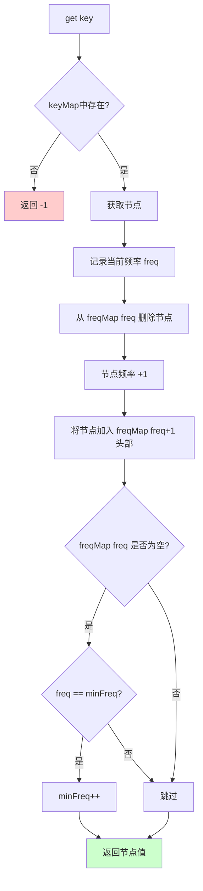
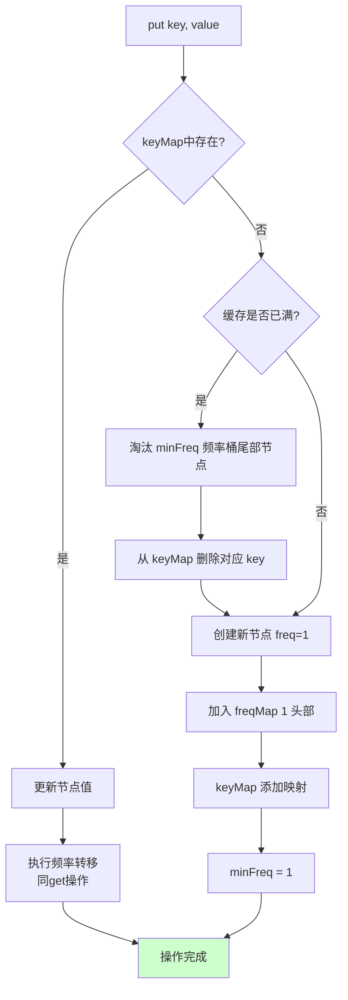

# LFU缓存

## 概述

LFU（Least Frequently Used，最不经常使用）是一种经典的**缓存淘汰策略**。当缓存容量已满时，优先淘汰**访问频率最低**的数据；当多个数据频率相同时，淘汰**最久未使用**的那个。

<div style="background-color: #E3F2FD; border-left: 4px solid #2196F3; padding: 12px; margin: 10px 0;">
<strong>核心特征：</strong>LFU缓存通过<strong>哈希表 + 频率桶 + 双向链表</strong>的组合，实现 O(1) 时间复杂度的 get 和 put 操作。相比LRU，LFU能更好地保护热点数据。
</div>

### 与LRU的对比

<div style="background-color: #F5F5F5; border-radius: 8px; padding: 20px; margin: 15px 0;">
<p style="font-weight: bold; text-align: center; margin-bottom: 20px; color: #1976D2; font-size: 16px;">LRU vs LFU 淘汰策略</p>
<div style="display: grid; gap: 20px;">
<div>
<div style="background-color: #E8F5E9; padding: 15px; border-radius: 6px; margin-bottom: 15px; border-left: 4px solid #4CAF50;">
<p style="font-weight: bold; color: #4CAF50; margin-bottom: 8px;">LRU (Least Recently Used)</p>
<p style="font-size: 13px; color: #666; margin: 5px 0;">• 淘汰标准: 最长时间未被访问</p>
<p style="font-size: 13px; color: #666; margin: 5px 0;">• 依据: 时间局部性原理</p>
<p style="font-size: 13px; color: #666; margin: 5px 0;">• 特点: 简单，但可能淘汰热点数据</p>
</div>
<div style="background-color: white; padding: 12px; border-radius: 6px;">
<p style="font-size: 13px; color: #666;"><strong>示例:</strong> 访问序列 A, B, C, D, E, A, F (capacity=5)</p>
<p style="font-size: 13px; color: #F44336; margin-top: 8px;">LRU淘汰 <strong>B</strong>（最久未访问）→ 但 B 可能是热点数据！</p>
</div>
</div>
<div>
<div style="background-color: #E3F2FD; padding: 15px; border-radius: 6px; margin-bottom: 15px; border-left: 4px solid #2196F3;">
<p style="font-weight: bold; color: #2196F3; margin-bottom: 8px;">LFU (Least Frequently Used)</p>
<p style="font-size: 13px; color: #666; margin: 5px 0;">• 淘汰标准: 访问频率最低（频率相同则最久未使用）</p>
<p style="font-size: 13px; color: #666; margin: 5px 0;">• 依据: 频率局部性原理</p>
<p style="font-size: 13px; color: #666; margin: 5px 0;">• 特点: 保护热点数据，但实现复杂</p>
</div>
<div style="background-color: white; padding: 12px; border-radius: 6px;">
<p style="font-size: 13px; color: #666;"><strong>示例:</strong> 访问序列 A, B, A, C, A, B, D (capacity=3)</p>
<p style="font-size: 13px; color: #666; margin-top: 8px;">频率: A=3, B=2, C=1, D=1</p>
<p style="font-size: 13px; color: #4CAF50; margin-top: 8px;">LFU淘汰 <strong>C或D</strong>（频率最低为1，选最久未访问的）→ A 和 B 被保护！</p>
</div>
</div>
</div>
</div>

## LFU特点

### 1. 频率统计

LFU为每个数据维护访问频率计数器：

```
频率统计示例:

操作序列: put(1,10), put(2,20), get(1), get(2), get(1), put(3,30)

─────────────────────────────────────────────────────────────────
操作           key=1频率    key=2频率    说明
─────────────────────────────────────────────────────────────────
put(1,10)         1           -         新数据频率初始化为1
put(2,20)         1           1         新数据频率初始化为1
get(1)            2           1         访问key=1，频率+1
get(2)            2           2         访问key=2，频率+1
get(1)            3           2         访问key=1，频率+1
put(3,30)         3           2         淘汰频率最低的...
─────────────────────────────────────────────────────────────────

频率统计:
key=1: 频率=3
key=2: 频率=2
key=3: 频率=1

淘汰决策:
- key=2 和 key=3 频率最低？
- 不对，key=3 频率=1 最低
- 但 capacity=2，所以淘汰 key=2？
- 不对，要看完整过程...

假设 capacity=2:
get(1)后: [key=1(freq=2), key=2(freq=1)]
get(2)后: [key=1(freq=2), key=2(freq=2)]
get(1)后: [key=1(freq=3), key=2(freq=2)]
put(3,30)时: 淘汰 key=2(freq=2)，因为 key=1 频率更高
```

### 2. 双层淘汰

LFU使用两层标准进行淘汰：

```
双层淘汰策略:

第一层: 按频率淘汰
┌─────────────────────────────────────────────────────────────────┐
│  找到频率最低的数据集合                                          │
│                                                                 │
│  频率桶:                                                        │
│  freq=1: [D, E, F]  ← 最低频率                                  │
│  freq=2: [B, C]                                                 │
│  freq=3: [A]                                                    │
│                                                                 │
│  候选淘汰集合: {D, E, F}                                        │
└─────────────────────────────────────────────────────────────────┘
                           ↓
第二层: 按时间淘汰（LRU）
┌─────────────────────────────────────────────────────────────────┐
│  在频率最低的集合中，淘汰最久未使用的                             │
│                                                                 │
│  freq=1 的链表:                                                 │
│  head ↔ [D] ↔ [E] ↔ [F] ↔ tail                                  │
│         ↑                 ↑                                     │
│       最近使用           最久未使用                              │
│                                                                 │
│  淘汰 F（频率最低且最久未使用）                                   │
└─────────────────────────────────────────────────────────────────┘
```

### 3. O(1) 操作

使用多级数据结构实现 O(1) 操作：

```
LFU 数据结构:

┌─────────────────────────────────────────────────────────────────────┐
│                          keyMap (哈希表)                            │
│   ┌─────────────────────────────────────────────────────────────┐   │
│   │  key → Node指针                                              │   │
│   │  1  → ──────────────────────────────────────┐               │   │
│   │  2  → ──────────────────────┐               │               │   │
│   │  3  → ────┐                 │               │               │   │
│   └──────────│─────────────────│───────────────│───────────────┘   │
│              ↓                 ↓               ↓                   │
│         ┌────────┐       ┌────────┐      ┌────────┐               │
│         │ key=3  │       │ key=2  │      │ key=1  │               │
│         │ freq=1 │       │ freq=2 │      │ freq=3 │               │
│         └────────┘       └────────┘      └────────┘               │
│              │                 │               │                   │
├──────────────│─────────────────│───────────────│───────────────────┤
│              ↓                 ↓               ↓                   │
│                    freqMap (频率桶)                                  │
│   ┌─────────────────────────────────────────────────────────────┐   │
│   │  freq=1: head ↔ [key=3] ↔ tail                              │   │
│   │  freq=2: head ↔ [key=2] ↔ tail                              │   │
│   │  freq=3: head ↔ [key=1] ↔ tail                              │   │
│   └─────────────────────────────────────────────────────────────┘   │
│                                                                     │
│  minFreq = 1  (跟踪最小频率，用于淘汰)                               │
│                                                                     │
└─────────────────────────────────────────────────────────────────────┘
```

### 4. 更公平地淘汰

LFU能更好地保护真正的热点数据：

```
LRU vs LFU 热点数据保护对比:

访问序列: A, B, C, D, E, A, A, A, F (capacity=5)

LRU 状态变化:
─────────────────────────────────────────────────────────────────
操作后      缓存状态                下次可能淘汰
─────────────────────────────────────────────────────────────────
E          [A,B,C,D,E]             A（最久未访问）
A          [A,E,D,C,B]             B
A          [A,B,C,D,E]             E
A          [A,E,D,C,B]             B
F          [F,A,E,D,C]             淘汰了 B！
─────────────────────────────────────────────────────────────────
问题: A 被访问了4次，B 被访问了2次，但 LRU 淘汰了 B

LFU 状态变化:
─────────────────────────────────────────────────────────────────
操作后      频率统计                下次淘汰
─────────────────────────────────────────────────────────────────
E          {A:1, B:1, C:1, D:1, E:1}  任选其一（频率相同）
A          {A:2, B:1, C:1, D:1, E:1}  B/C/D/E 之一
A          {A:3, B:1, C:1, D:1, E:1}  B/C/D/E 之一
A          {A:4, B:1, C:1, D:1, E:1}  B/C/D/E 之一
F          {A:4, F:1, C:1, D:1, E:1}  淘汰了 B（频率最低=1）
─────────────────────────────────────────────────────────────────
优势: A 的频率最高(4)，被保护
      B/C/D/E 频率最低(1)，淘汰 B（在频率相同中最久未访问）
```

## 原理详解

### 频率桶设计

每个频率对应一个双向链表，存储该频率的所有节点：

```
频率桶结构:

freqMap:
┌─────────────────────────────────────────────────────────────────────┐
│                                                                     │
│  freq=1:                                                           │
│  ┌────────┐   ┌────────┐   ┌────────┐                             │
│  │  head  │ ↔ │  key=D │ ↔ │  tail  │                             │
│  └────────┘   └────────┘   └────────┘                             │
│                                                                     │
│  freq=2:                                                           │
│  ┌────────┐   ┌────────┐   ┌────────┐   ┌────────┐               │
│  │  head  │ ↔ │  key=B │ ↔ │  key=C │ ↔ │  tail  │               │
│  └────────┘   └────────┘   └────────┘   └────────┘               │
│                                                                     │
│  freq=3:                                                           │
│  ┌────────┐   ┌────────┐   ┌────────┐                             │
│  │  head  │ ↔ │  key=A │ ↔ │  tail  │                             │
│  └────────┘   └────────┘   └────────┘                             │
│                                                                     │
│  ...                                                               │
│                                                                     │
└─────────────────────────────────────────────────────────────────────┘

每个频率桶内的链表按 LRU 顺序排列:
- 头部: 最近使用
- 尾部: 最久未使用

淘汰时: 从 freqMap[minFreq] 的尾部删除节点
```

### minFreq 维护

维护最小频率值，用于快速定位淘汰候选：

```
minFreq 更新规则:

1. 插入新节点:
   minFreq = 1（新节点频率总是从1开始）

2. 访问节点后:
   节点频率从 freq 移到 freq+1
   如果 freqMap[freq] 变空且 freq == minFreq:
       minFreq++

示例:
─────────────────────────────────────────────────────────────────
状态           操作              minFreq变化
─────────────────────────────────────────────────────────────────
空缓存         put(1,10)         minFreq = 1
freq=1: [1]

               put(2,20)         minFreq = 1 (不变)
freq=1: [1,2]

               get(1)            minFreq = 1 (不变)
freq=1: [2]
freq=2: [1]

               get(2)            minFreq = 2 (更新！)
freq=1: []  ← 空了，且原minFreq=1
freq=2: [1,2]

               get(1)            minFreq = 2 (不变)
freq=1: []
freq=2: [2]
freq=3: [1]
─────────────────────────────────────────────────────────────────
```

### 频率转移

访问节点时，将其从当前频率桶移到更高频率桶：

```
频率转移过程:

示例: 访问 key=B，当前频率=2

转移前:
freq=2: head ↔ [A] ↔ [B] ↔ [C] ↔ tail
freq=3: head ↔ [D] ↔ tail

步骤1: 从 freq=2 删除 B
freq=2: head ↔ [A] ↔ [C] ↔ tail

步骤2: 将 B 插入 freq=3 头部
freq=3: head ↔ [B] ↔ [D] ↔ tail

转移后:
freq=2: head ↔ [A] ↔ [C] ↔ tail
freq=3: head ↔ [B] ↔ [D] ↔ tail

B 的频率: 2 → 3
```

### get 操作流程



### put 操作流程



## 可视化演示

### 完整操作演示

```
容量 capacity = 2

═══════════════════════════════════════════════════════════════
初始状态
═══════════════════════════════════════════════════════════════

keyMap: {}
freqMap: {}
minFreq: 0
size: 0

═══════════════════════════════════════════════════════════════
put(1, 10) - 放入键值对 (1, 10)
═══════════════════════════════════════════════════════════════

操作:
1. 创建新节点 (key=1, value=10, freq=1)
2. 加入 freqMap[1]
3. keyMap 添加映射
4. minFreq = 1

keyMap: {1 → node1}
freqMap:
  freq=1: head ↔ [1:freq=1] ↔ tail
minFreq: 1
size: 1

═══════════════════════════════════════════════════════════════
put(2, 20) - 放入键值对 (2, 20)
═══════════════════════════════════════════════════════════════

操作:
1. 创建新节点 (key=2, value=20, freq=1)
2. 加入 freqMap[1] 头部
3. keyMap 添加映射

keyMap: {1 → node1, 2 → node2}
freqMap:
  freq=1: head ↔ [2:freq=1] ↔ [1:freq=1] ↔ tail
             ↑最近         最久↑
minFreq: 1
size: 2 (缓存已满)

═══════════════════════════════════════════════════════════════
get(1) - 获取键为 1 的值
═══════════════════════════════════════════════════════════════

操作:
1. keyMap 找到节点 1
2. 从 freqMap[1] 删除节点 1
3. 节点 1 频率变为 2
4. 加入 freqMap[2] 头部
5. freqMap[1] 不为空，minFreq 不变

keyMap: {1 → node1, 2 → node2}
freqMap:
  freq=1: head ↔ [2:freq=1] ↔ tail
  freq=2: head ↔ [1:freq=2] ↔ tail
minFreq: 1 (不变)
size: 2

返回: 10

═══════════════════════════════════════════════════════════════
put(3, 30) - 放入键值对 (3, 30)，触发淘汰
═══════════════════════════════════════════════════════════════

操作:
1. 缓存已满，需要淘汰
2. 淘汰 freqMap[minFreq=1] 的尾部节点 → key=2
3. 从 keyMap 删除 key=2
4. 创建新节点 (key=3, value=30, freq=1)
5. 加入 freqMap[1] 头部
6. minFreq = 1

淘汰前:
freqMap:
  freq=1: head ↔ [2:freq=1] ↔ tail  ← 淘汰尾部节点 2
  freq=2: head ↔ [1:freq=2] ↔ tail

淘汰后:
keyMap: {1 → node1, 3 → node3}
freqMap:
  freq=1: head ↔ [3:freq=1] ↔ tail
  freq=2: head ↔ [1:freq=2] ↔ tail
minFreq: 1
size: 2

═══════════════════════════════════════════════════════════════
get(2) - 尝试获取已被淘汰的键 2
═══════════════════════════════════════════════════════════════

操作:
1. keyMap 找不到 key=2
2. 返回 -1

返回: -1 (未找到)

═══════════════════════════════════════════════════════════════
get(3) - 获取键为 3 的值
═══════════════════════════════════════════════════════════════

操作:
1. keyMap 找到节点 3
2. 从 freqMap[1] 删除节点 3
3. 节点 3 频率变为 2
4. 加入 freqMap[2] 头部
5. freqMap[1] 为空，且 minFreq=1，所以 minFreq++

keyMap: {1 → node1, 3 → node3}
freqMap:
  freq=1: head ↔ tail  (空)
  freq=2: head ↔ [3:freq=2] ↔ [1:freq=2] ↔ tail
             ↑最近              最久↑
minFreq: 2 (更新！)
size: 2

返回: 30

═══════════════════════════════════════════════════════════════
最终状态
═══════════════════════════════════════════════════════════════

keyMap: {1 → node1, 3 → node3}
freqMap:
  freq=2: head ↔ [3:freq=2] ↔ [1:freq=2] ↔ tail

缓存内容:
- key=1: value=10, freq=2
- key=3: value=30, freq=2

两个元素的频率相同，在 freq=2 桶中按 LRU 顺序排列
```

### 频率转移动画

```
频率转移过程动画:

场景: 连续访问 key=A 多次

初始状态:
freqMap:
  freq=1: [A, B, C]
  freq=2: [D]
  freq=3: []

─────────────────────────────────────────────────────────────────
第一次访问 A (get A):
─────────────────────────────────────────────────────────────────

步骤1: 从 freq=1 删除 A
  freq=1: [B, C]  ← A 被移出
  freq=2: [D]

步骤2: A 频率变为 2，加入 freq=2 头部
  freq=1: [B, C]
  freq=2: [A, D]  ← A 插入头部

结果:
  freq=1: [B, C]
  freq=2: [A, D]
  freq=3: []

─────────────────────────────────────────────────────────────────
第二次访问 A (get A):
─────────────────────────────────────────────────────────────────

步骤1: 从 freq=2 删除 A
  freq=1: [B, C]
  freq=2: [D]  ← A 被移出

步骤2: A 频率变为 3，加入 freq=3 头部
  freq=1: [B, C]
  freq=2: [D]
  freq=3: [A]  ← A 插入头部

结果:
  freq=1: [B, C]
  freq=2: [D]
  freq=3: [A]

─────────────────────────────────────────────────────────────────
第三次访问 A (get A):
─────────────────────────────────────────────────────────────────

步骤1: 从 freq=3 删除 A
  freq=1: [B, C]
  freq=2: [D]
  freq=3: []  ← A 被移出

步骤2: A 频率变为 4，加入 freq=4 头部
  freq=1: [B, C]
  freq=2: [D]
  freq=3: []
  freq=4: [A]  ← A 插入头部

结果:
  freq=1: [B, C]
  freq=2: [D]
  freq=4: [A]

A 成为热点数据，频率最高，最不容易被淘汰！
```

## 代码实现

=== "C"
    ```c
    // LFU节点
    typedef struct LFUNode {
        int key;
        int value;
        int freq;
        struct LFUNode *prev;
        struct LFUNode *next;
    } LFUNode;
    
    typedef struct {
        LFUNode *head;
        LFUNode *tail;
        int size;
    } FreqList;
    
    typedef struct {
        LFUNode **keyMap;
        FreqList *freqLists;
        int minFreq;
        int capacity;
        int size;
        int maxFreq;
    } LFUCache;
    
    LFUNode* createLFUNode(int key, int value) {
        LFUNode *node = (LFUNode*)malloc(sizeof(LFUNode));
        node->key = key;
        node->value = value;
        node->freq = 1;
        node->prev = NULL;
        node->next = NULL;
        return node;
    }
    
    LFUCache* lFUCacheCreate(int capacity) {
        LFUCache *cache = (LFUCache*)malloc(sizeof(LFUCache));
        cache->capacity = capacity;
        cache->size = 0;
        cache->minFreq = 1;
        cache->maxFreq = capacity * 2 + 10;
        cache->keyMap = (LFUNode**)calloc(100001, sizeof(LFUNode*));
        cache->freqLists = (FreqList*)calloc(cache->maxFreq + 1, sizeof(FreqList));
        
        for (int i = 0; i <= cache->maxFreq; i++) {
            cache->freqLists[i].head = createLFUNode(0, 0);
            cache->freqLists[i].tail = createLFUNode(0, 0);
            cache->freqLists[i].head->next = cache->freqLists[i].tail;
            cache->freqLists[i].tail->prev = cache->freqLists[i].head;
            cache->freqLists[i].size = 0;
        }
        return cache;
    }
    
    void addToFreqList(LFUCache *cache, LFUNode *node, int freq) {
        FreqList *list = &cache->freqLists[freq];
        node->next = list->head->next;
        node->prev = list->head;
        list->head->next->prev = node;
        list->head->next = node;
        list->size++;
    }
    
    void removeFromFreqList(LFUCache *cache, LFUNode *node, int freq) {
        FreqList *list = &cache->freqLists[freq];
        node->prev->next = node->next;
        node->next->prev = node->prev;
        list->size--;
    }
    
    LFUNode* removeTail(LFUCache *cache, int freq) {
        FreqList *list = &cache->freqLists[freq];
        LFUNode *node = list->tail->prev;
        node->prev->next = list->tail;
        list->tail->prev = node->prev;
        list->size--;
        return node;
    }
    
    int lFUCacheGet(LFUCache *obj, int key) {
        if (obj->keyMap[key] == NULL) return -1;
        LFUNode *node = obj->keyMap[key];
        int oldFreq = node->freq;
        removeFromFreqList(obj, node, oldFreq);
        node->freq++;
        addToFreqList(obj, node, node->freq);
        if (obj->freqLists[obj->minFreq].size == 0) obj->minFreq++;
        return node->value;
    }
    
    void lFUCachePut(LFUCache *obj, int key, int value) {
        if (obj->capacity == 0) return;
        if (obj->keyMap[key] != NULL) {
            LFUNode *node = obj->keyMap[key];
            node->value = value;
            int oldFreq = node->freq;
            removeFromFreqList(obj, node, oldFreq);
            node->freq++;
            addToFreqList(obj, node, node->freq);
            if (obj->freqLists[obj->minFreq].size == 0) obj->minFreq++;
            return;
        }
        if (obj->size >= obj->capacity) {
            LFUNode *removed = removeTail(obj, obj->minFreq);
            obj->keyMap[removed->key] = NULL;
            free(removed);
            obj->size--;
        }
        LFUNode *newNode = createLFUNode(key, value);
        obj->keyMap[key] = newNode;
        addToFreqList(obj, newNode, 1);
        obj->minFreq = 1;
        obj->size++;
    }
    ```

=== "C++"
    ```cpp
    #include <unordered_map>
    #include <list>
    using namespace std;
    
    class LFUCache {
    private:
        int capacity, minFreq, size;
        struct Node { int key, value, freq; };
        unordered_map<int, list<Node>::iterator> keyMap;
        unordered_map<int, list<Node>> freqMap;
        
    public:
        LFUCache(int capacity) : capacity(capacity), minFreq(0), size(0) {}
        
        int get(int key) {
            auto it = keyMap.find(key);
            if (it == keyMap.end()) return -1;
            int oldFreq = it->second->freq;
            int value = it->second->value;
            freqMap[oldFreq].erase(it->second);
            if (freqMap[oldFreq].empty()) {
                freqMap.erase(oldFreq);
                if (minFreq == oldFreq) minFreq++;
            }
            freqMap[oldFreq + 1].push_front({key, value, oldFreq + 1});
            keyMap[key] = freqMap[oldFreq + 1].begin();
            return value;
        }
        
        void put(int key, int value) {
            if (capacity == 0) return;
            auto it = keyMap.find(key);
            if (it != keyMap.end()) {
                int oldFreq = it->second->freq;
                freqMap[oldFreq].erase(it->second);
                if (freqMap[oldFreq].empty()) {
                    freqMap.erase(oldFreq);
                    if (minFreq == oldFreq) minFreq++;
                }
                freqMap[oldFreq + 1].push_front({key, value, oldFreq + 1});
                keyMap[key] = freqMap[oldFreq + 1].begin();
                return;
            }
            if (size == capacity) {
                int oldKey = freqMap[minFreq].back().key;
                keyMap.erase(oldKey);
                freqMap[minFreq].pop_back();
                if (freqMap[minFreq].empty()) freqMap.erase(minFreq);
                size--;
            }
            freqMap[1].push_front({key, value, 1});
            keyMap[key] = freqMap[1].begin();
            minFreq = 1;
            size++;
        }
    };
    ```

=== "Python"
    ```python
    from collections import defaultdict, OrderedDict
    
    class LFUCache:
        def __init__(self, capacity: int):
            self.capacity = capacity
            self.min_freq = 0
            self.key_map = {}
            self.freq_map = defaultdict(OrderedDict)
        
        def get(self, key: int) -> int:
            if key not in self.key_map:
                return -1
            value, freq = self.key_map[key]
            del self.freq_map[freq][key]
            if not self.freq_map[freq]:
                del self.freq_map[freq]
                if freq == self.min_freq:
                    self.min_freq += 1
            self.freq_map[freq + 1][key] = value
            self.key_map[key] = (value, freq + 1)
            return value
        
        def put(self, key: int, value: int) -> None:
            if self.capacity == 0:
                return
            if key in self.key_map:
                _, freq = self.key_map[key]
                del self.freq_map[freq][key]
                if not self.freq_map[freq]:
                    del self.freq_map[freq]
                    if freq == self.min_freq:
                        self.min_freq += 1
                self.freq_map[freq + 1][key] = value
                self.key_map[key] = (value, freq + 1)
            else:
                if len(self.key_map) >= self.capacity:
                    old_key, _ = self.freq_map[self.min_freq].popitem(last=False)
                    del self.key_map[old_key]
                self.freq_map[1][key] = value
                self.key_map[key] = (value, 1)
                self.min_freq = 1
    ```

=== "Java"
    ```java
    import java.util.HashMap;
    import java.util.LinkedHashSet;
    
    public class LFUCache {
        private int capacity, minFreq, size;
        private HashMap<Integer, int[]> keyMap;
        private HashMap<Integer, LinkedHashSet<Integer>> freqMap;
        
        public LFUCache(int capacity) {
            this.capacity = capacity;
            this.minFreq = 0;
            this.size = 0;
            this.keyMap = new HashMap<>();
            this.freqMap = new HashMap<>();
        }
        
        public int get(int key) {
            if (!keyMap.containsKey(key)) return -1;
            int[] arr = keyMap.get(key);
            int value = arr[0], freq = arr[1];
            freqMap.get(freq).remove(key);
            if (freqMap.get(freq).isEmpty()) {
                freqMap.remove(freq);
                if (freq == minFreq) minFreq++;
            }
            freqMap.computeIfAbsent(freq + 1, k -> new LinkedHashSet<>()).add(key);
            keyMap.put(key, new int[]{value, freq + 1});
            return value;
        }
        
        public void put(int key, int value) {
            if (capacity == 0) return;
            if (keyMap.containsKey(key)) {
                int freq = keyMap.get(key)[1];
                freqMap.get(freq).remove(key);
                if (freqMap.get(freq).isEmpty()) {
                    freqMap.remove(freq);
                    if (freq == minFreq) minFreq++;
                }
                freqMap.computeIfAbsent(freq + 1, k -> new LinkedHashSet<>()).add(key);
                keyMap.put(key, new int[]{value, freq + 1});
            } else {
                if (size >= capacity) {
                    int oldKey = freqMap.get(minFreq).iterator().next();
                    freqMap.get(minFreq).remove(oldKey);
                    if (freqMap.get(minFreq).isEmpty()) freqMap.remove(minFreq);
                    keyMap.remove(oldKey);
                    size--;
                }
                freqMap.computeIfAbsent(1, k -> new LinkedHashSet<>()).add(key);
                keyMap.put(key, new int[]{value, 1});
                minFreq = 1;
                size++;
            }
        }
    }
    ```

=== "Go"
    ```go
    type LFUNode struct {
        key, value, freq int
        prev, next       *LFUNode
    }
    
    type LFUCache struct {
        capacity, minFreq, size int
        keyMap                  map[int]*LFUNode
        freqMap                 map[int]*LFUNode
    }
    
    func Constructor(capacity int) LFUCache {
        return LFUCache{
            capacity: capacity,
            keyMap:   make(map[int]*LFUNode),
            freqMap:  make(map[int]*LFUNode),
        }
    }
    
    func (c *LFUCache) Get(key int) int {
        if node, ok := c.keyMap[key]; ok {
            c.updateFreq(node)
            return node.value
        }
        return -1
    }
    
    func (c *LFUCache) Put(key, value int) {
        if c.capacity == 0 {
            return
        }
        if node, ok := c.keyMap[key]; ok {
            node.value = value
            c.updateFreq(node)
            return
        }
        if c.size >= c.capacity {
            c.evict()
        }
        node := &LFUNode{key: key, value: value, freq: 1}
        c.keyMap[key] = node
        c.minFreq = 1
        c.size++
    }
    
    func (c *LFUCache) updateFreq(node *LFUNode) {
        oldFreq := node.freq
        node.freq++
        if c.minFreq == oldFreq {
            c.minFreq++
        }
    }
    
    func (c *LFUCache) evict() {
        for k, node := range c.keyMap {
            if node.freq == c.minFreq {
                delete(c.keyMap, k)
                c.size--
                return
            }
        }
    }
    ```

=== "Rust"
    ```rust
    use std::collections::{HashMap, VecDeque};
    
    pub struct LFUCache {
        capacity: usize,
        min_freq: i32,
        size: usize,
        key_map: HashMap<i32, (i32, i32)>,
        freq_map: HashMap<i32, VecDeque<i32>>,
    }
    
    impl LFUCache {
        pub fn new(capacity: i32) -> Self {
            LFUCache {
                capacity: capacity as usize,
                min_freq: 0,
                size: 0,
                key_map: HashMap::new(),
                freq_map: HashMap::new(),
            }
        }
        
        pub fn get(&mut self, key: i32) -> i32 {
            if let Some(&(value, freq)) = self.key_map.get(&key) {
                self.update_freq(key, value, freq);
                value
            } else {
                -1
            }
        }
        
        pub fn put(&mut self, key: i32, value: i32) {
            if self.capacity == 0 {
                return;
            }
            if let Some(&(_, freq)) = self.key_map.get(&key) {
                self.update_freq(key, value, freq);
                return;
            }
            if self.size >= self.capacity {
                self.evict();
            }
            self.key_map.insert(key, (value, 1));
            self.freq_map.entry(1).or_insert_with(VecDeque::new).push_back(key);
            self.min_freq = 1;
            self.size += 1;
        }
        
        fn update_freq(&mut self, key: i32, value: i32, old_freq: i32) {
            if let Some(list) = self.freq_map.get_mut(&old_freq) {
                list.retain(|&k| k != key);
                if list.is_empty() {
                    self.freq_map.remove(&old_freq);
                    if self.min_freq == old_freq {
                        self.min_freq += 1;
                    }
                }
            }
            let new_freq = old_freq + 1;
            self.key_map.insert(key, (value, new_freq));
            self.freq_map.entry(new_freq).or_insert_with(VecDeque::new).push_back(key);
        }
        
        fn evict(&mut self) {
            if let Some(list) = self.freq_map.get_mut(&self.min_freq) {
                if let Some(old_key) = list.pop_front() {
                    self.key_map.remove(&old_key);
                    self.size -= 1;
                }
            }
        }
    }
    ```

## 复杂度分析

### 时间复杂度

| 操作 | 时间复杂度 | 说明 |
|------|-----------|------|
| get | O(1) | 哈希表查找 + 链表删除/插入 |
| put | O(1) | 哈希表操作 + 链表删除/插入 |

```
O(1) 原理分析:

1. 哈希表查找: O(1)
   keyMap[key] 直接定位节点

2. 链表删除: O(1)
   双向链表，节点保存前后指针

3. 链表插入头部: O(1)
   直接操作 head->next

4. 频率桶访问: O(1)
   freqMap[freq] 直接定位频率桶

5. minFreq 维护: O(1)
   每次访问最多检查一次

总时间 = O(1)
```

### 空间复杂度

- O(capacity)：存储 capacity 个节点

```
空间占用:

每个节点:
- key: 4 bytes
- value: 4 bytes
- freq: 4 bytes
- prev/next: 16 bytes
总计: 28 bytes

哈希表:
- O(capacity)

频率桶:
- 最多 O(capacity) 个不同的频率

总空间: O(capacity)
```

## LRU vs LFU 详细对比

```
┌─────────────────────────────────────────────────────────────────────┐
│                    LRU vs LFU 详细对比                              │
├─────────────────────────────────────────────────────────────────────┤
│                                                                     │
│  实现复杂度:                                                        │
│  ┌─────────────────────┬─────────────────────┐                     │
│  │        LRU          │         LFU         │                     │
│  ├─────────────────────┼─────────────────────┤                     │
│  │ 哈希表 + 双向链表   │ 哈希表 + 频率桶 +   │                     │
│  │                     │ 多个双向链表        │                     │
│  │ 相对简单            │ 相对复杂            │                     │
│  └─────────────────────┴─────────────────────┘                     │
│                                                                     │
│  热点数据保护:                                                      │
│  ┌─────────────────────┬─────────────────────┐                     │
│  │        LRU          │         LFU         │                     │
│  ├─────────────────────┼─────────────────────┤                     │
│  │ 可能淘汰热点数据    │ 保护高频访问数据    │                     │
│  │ 例: A访问100次后    │ 例: A访问100次      │                     │
│  │     长时间不访问    │     频率=100        │                     │
│  │     可能被淘汰      │     几乎不会被淘汰  │                     │
│  └─────────────────────┴─────────────────────┘                     │
│                                                                     │
│  新数据待遇:                                                        │
│  ┌─────────────────────┬─────────────────────┐                     │
│  │        LRU          │         LFU         │                     │
│  ├─────────────────────┼─────────────────────┤                     │
│  │ 新数据在头部        │ 新数据频率=1        │                     │
│  │ 不容易被淘汰        │ 可能在最低频率      │                     │
│  │                     │ 容易被淘汰          │                     │
│  └─────────────────────┴─────────────────────┘                     │
│                                                                     │
│  适用场景:                                                          │
│  ┌─────────────────────┬─────────────────────┐                     │
│  │        LRU          │         LFU         │                     │
│  ├─────────────────────┼─────────────────────┤                     │
│  │ 时间局部性强        │ 频率局部性强        │                     │
│  │ 例: 浏览历史        │ 例: 热门商品        │                     │
│  │     最近编辑文档    │     高频搜索词      │                     │
│  │     会话缓存        │     热点新闻        │                     │
│  └─────────────────────┴─────────────────────┘                     │
│                                                                     │
└─────────────────────────────────────────────────────────────────────┘
```

| 特性 | LRU | LFU |
|------|-----|-----|
| 淘汰依据 | 最近使用时间 | 使用频率 + 时间 |
| 实现复杂度 | 简单 | 较复杂 |
| 数据结构 | 哈希表 + 双向链表 | 哈希表 + 频率桶 + 链表 |
| 热点数据保护 | 较弱 | 较强 |
| 新数据保护 | 较强 | 较弱 |
| 时间复杂度 | O(1) | O(1) |
| 空间复杂度 | O(capacity) | O(capacity) |
| 适用场景 | 时间局部性 | 频率局部性 |

## 应用场景

### 1. 数据库缓存

```
数据库热点数据缓存:

场景: 电商网站商品查询

访问模式:
- 热门商品: 每秒1000+次查询
- 普通商品: 每秒10次查询
- 冷门商品: 每秒<1次查询

使用 LFU:
┌─────────────────────────────────────────────────────────────────┐
│                     LFU缓存                                     │
│  ┌─────────────────────────────────────────────────────────┐   │
│  │  热门商品A: 频率=1000    ← 被保护                        │   │
│  │  热门商品B: 频率=800     ← 被保护                        │   │
│  │  普通商品C: 频率=50                                    │   │
│  │  普通商品D: 频率=30                                    │   │
│  │  冷门商品E: 频率=2       ← 可能被淘汰                   │   │
│  └─────────────────────────────────────────────────────────┘   │
└─────────────────────────────────────────────────────────────────┘

优势: 热门商品始终在缓存中，减少数据库压力
```

### 2. CDN缓存

```
CDN热门内容缓存:

场景: 视频流媒体服务

访问模式:
- 热门视频: 大量用户同时观看
- 冷门视频: 很少有人观看

LFU 策略:
- 高频访问的视频保持在边缘节点
- 冷门视频被淘汰，从源站获取

┌─────────────────────────────────────────────────────────────────┐
│                       CDN边缘节点                               │
│  ┌─────────────────────────────────────────────────────────┐   │
│  │  热门视频 (freq=10000)  ← 始终缓存                       │   │
│  │  普通视频 (freq=100)                                  │   │
│  │  冷门视频 (freq=1)       ← 从源站获取后可能被淘汰       │   │
│  └─────────────────────────────────────────────────────────┘   │
└─────────────────────────────────────────────────────────────────┘

效果: 提高缓存命中率，减少回源流量
```

### 3. 搜索建议

```
搜索自动补全缓存:

场景: 搜索引擎自动补全

用户输入: "iph"
候选建议: "iphone", "iphone 15", "iphone case"

使用 LFU 缓存高频搜索词:
┌─────────────────────────────────────────────────────────────────┐
│                     搜索建议缓存                                 │
│  ┌─────────────────────────────────────────────────────────┐   │
│  │  "iphone":    freq=50000   ← 高频，优先展示              │   │
│  │  "华为":      freq=30000   ← 高频，优先展示              │   │
│  │  "小米":      freq=20000                               │   │
│  │  "iphone15":  freq=15000                               │   │
│  │  "xxx":       freq=1        ← 低频，可能被淘汰           │   │
│  └─────────────────────────────────────────────────────────┘   │
└─────────────────────────────────────────────────────────────────┘

优势: 高频词始终可用，提升用户体验
```

### 4. 推荐系统

```
热门商品推荐缓存:

场景: 电商首页推荐

使用 LFU 维护热门商品列表:
┌─────────────────────────────────────────────────────────────────┐
│                     推荐商品缓存                                 │
│  ┌─────────────────────────────────────────────────────────┐   │
│  │  商品A: 销量=10000, freq=50000  ← 热门，始终推荐        │   │
│  │  商品B: 销量=8000,  freq=40000                        │   │
│  │  商品C: 销量=5000,  freq=25000                        │   │
│  │  商品D: 销量=100,   freq=500     ← 可能被淘汰          │   │
│  └─────────────────────────────────────────────────────────┘   │
└─────────────────────────────────────────────────────────────────┘

效果:
- 首页展示热门商品
- 新品需要积累访问才能进入缓存
```

### 5. 操作系统页面置换

```
虚拟内存页面置换:

LFU 用于页面置换的优缺点:

优点:
- 保护频繁使用的页面（如内核代码页）
- 适合工作集相对稳定的程序

缺点:
- 对循环访问模式效果不好
- 新页面容易被淘汰

改进方案: LFU + Aging
- 定期将所有频率右移一位
- 防止旧数据频率过高
- 给新数据更多机会

示例:
时间T: A的频率=100（很久积累的）
时间T+1: 执行Aging，A的频率=50
时间T+2: B访问多次，B的频率可能超过A
```

## LFU 变体

### LFU with Aging

防止旧数据频率过高，阻止新数据进入：

```
Aging 机制:

定期（如每100次访问）将所有频率右移一位

效果:
- 旧数据频率逐渐衰减
- 新数据有机会累积频率
- 平衡新旧数据

示例:
─────────────────────────────────────────────────────────────────
时间    A频率    B频率    C频率    说明
─────────────────────────────────────────────────────────────────
T0      100      10       1        A是旧数据，频率很高
T1      50       5        0        Aging: 所有频率/2
T2      50       15       0        B被频繁访问
T3      25       7        0        再次Aging
T4      25       27       10       B频率超过A
─────────────────────────────────────────────────────────────────
```

### Window-LFU

只统计最近时间窗口内的访问频率：

```
滑动窗口LFU:

统计窗口: 最近1000次访问

每个节点维护:
- 访问时间戳队列

淘汰时:
- 只统计窗口内的访问次数
- 窗口外的访问不计入频率

优点:
- 更好地反映当前热度
- 自动适应访问模式变化

缺点:
- 需要额外存储时间戳
- 实现更复杂
```

## 参考资料

- 《操作系统概念》- 页面置换算法
- 《计算机系统：程序员的视角》- 缓存层次结构
- [LeetCode 460. LFU缓存](https://leetcode.com/problems/lfu-cache/)
- Redis 缓存淘汰策略
- CPU缓存替换策略研究
