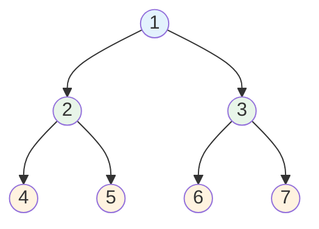
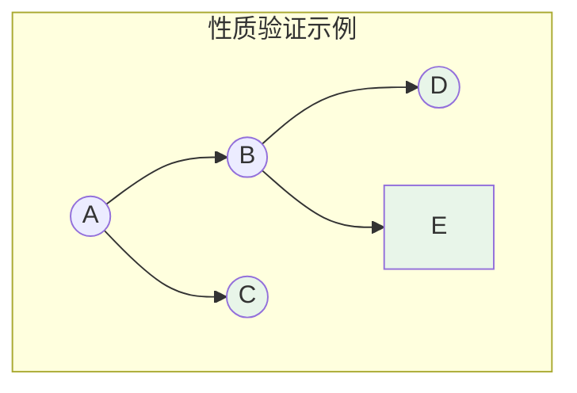
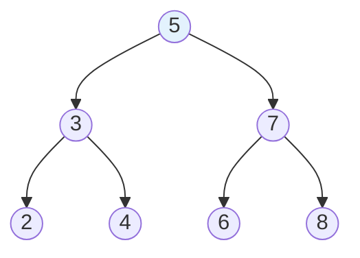
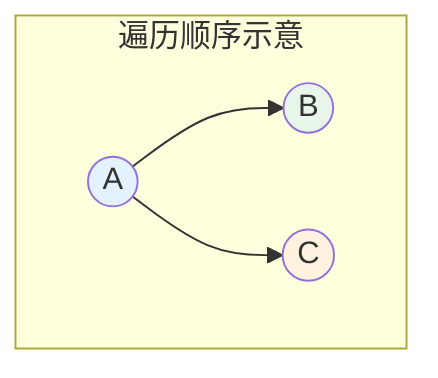
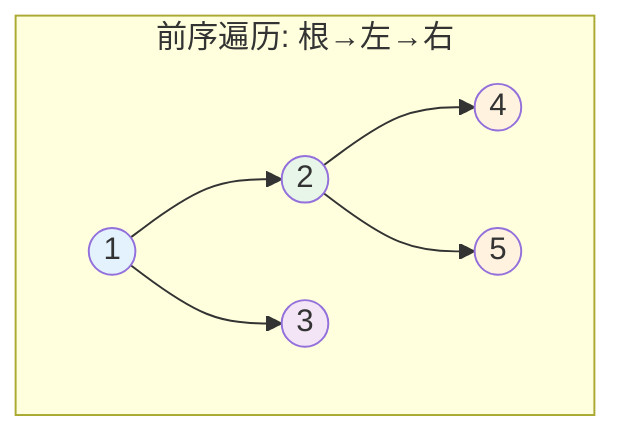
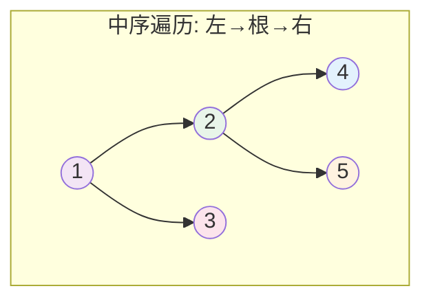
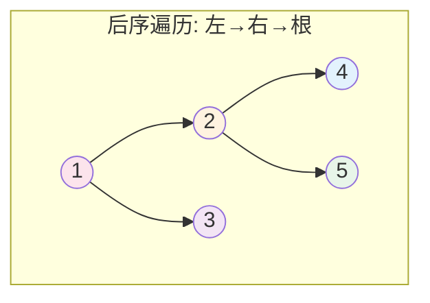
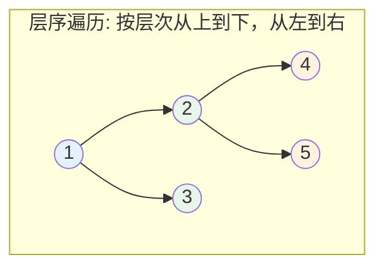

# 二叉树

## 概述

二叉树（Binary Tree）是一种重要的树形数据结构，每个节点最多有两个子节点，分别称为左子节点（Left Child）和右子节点（Right Child）。二叉树是许多高级数据结构（如BST、AVL树、红黑树、堆等）的基础。

!!! note "二叉树的递归定义"
    二叉树要么为空集，要么由一个根节点和两个互不相交的、分别称为左子树和右子树的二叉树组成。这个递归定义是理解二叉树所有操作的关键。

## 二叉树的可视化结构



<div style="background-color: #F5F5F5; border-radius: 8px; padding: 20px; margin: 10px 0;">
<p style="text-align: center; margin: 0 0 15px 0; font-weight: bold;">树的层次结构</p>
<table style="margin: 0 auto; border-collapse: collapse;">
<tr>
<td style="text-align: center; padding: 5px 20px; color: #666;">第1层</td>
<td style="text-align: center; padding: 5px;">
<div style="display: inline-block; width: 40px; height: 40px; line-height: 40px; background-color: #E3F2FD; border: 2px solid #2196F3; border-radius: 50%; text-align: center; font-weight: bold;">1</div>
</td>
<td style="padding: 5px 10px; color: #2196F3;">← 根节点 (Root)</td>
</tr>
<tr>
<td style="text-align: center; padding: 5px 20px; color: #666;">第2层</td>
<td style="text-align: center; padding: 5px;">
<div style="display: inline-block; width: 40px; height: 40px; line-height: 40px; background-color: #E8F5E9; border: 2px solid #4CAF50; border-radius: 50%; text-align: center; font-weight: bold; margin-right: 15px;">2</div>
<div style="display: inline-block; width: 40px; height: 40px; line-height: 40px; background-color: #E8F5E9; border: 2px solid #4CAF50; border-radius: 50%; text-align: center; font-weight: bold;">3</div>
</td>
<td style="padding: 5px 10px; color: #4CAF50;">← 第1层的子节点</td>
</tr>
<tr>
<td style="text-align: center; padding: 5px 20px; color: #666;">第3层</td>
<td style="text-align: center; padding: 5px;">
<div style="display: inline-block; width: 40px; height: 40px; line-height: 40px; background-color: #FFF3E0; border: 2px solid #FF9800; border-radius: 50%; text-align: center; font-weight: bold; margin-right: 10px;">4</div>
<div style="display: inline-block; width: 40px; height: 40px; line-height: 40px; background-color: #FFF3E0; border: 2px solid #FF9800; border-radius: 50%; text-align: center; font-weight: bold; margin-right: 10px;">5</div>
<div style="display: inline-block; width: 40px; height: 40px; line-height: 40px; background-color: #FFF3E0; border: 2px solid #FF9800; border-radius: 50%; text-align: center; font-weight: bold; margin-right: 10px;">6</div>
<div style="display: inline-block; width: 40px; height: 40px; line-height: 40px; background-color: #FFF3E0; border: 2px solid #FF9800; border-radius: 50%; text-align: center; font-weight: bold;">7</div>
</td>
<td style="padding: 5px 10px; color: #FF9800;">← 叶子节点 (Leaf)</td>
</tr>
</table>
<p style="text-align: center; margin: 15px 0 0 0; color: #666;">树的高度: <strong>3</strong> | 节点总数: <strong>7</strong></p>
</div>

## 二叉树特点详解

### 1. 递归定义

二叉树的每个节点都可以看作是一棵子树的根，这使得递归成为处理二叉树最自然的方式。

### 2. 度数限制

每个节点的度数（子节点数量）最多为2，可以是0、1或2。

<div style="background-color: #F5F5F5; border-radius: 8px; padding: 20px; margin: 10px 0;">
<p style="text-align: center; margin: 0 0 15px 0; font-weight: bold;">度数示意</p>
<div style="display: flex; justify-content: space-around; align-items: flex-end;">
<div style="text-align: center;">
<div style="display: inline-block; width: 45px; height: 45px; line-height: 45px; background-color: #E3F2FD; border: 2px solid #2196F3; border-radius: 50%; text-align: center; font-weight: bold; margin-bottom: 5px;">A</div>
<div style="display: flex; justify-content: center; margin-top: 5px;">
<div style="width: 30px; height: 30px; line-height: 30px; background-color: #E8F5E9; border: 2px solid #4CAF50; border-radius: 50%; text-align: center; margin-right: 10px; font-size: 12px;">○</div>
<div style="width: 30px; height: 30px; line-height: 30px; background-color: #E8F5E9; border: 2px solid #4CAF50; border-radius: 50%; text-align: center; font-size: 12px;">○</div>
</div>
<p style="margin: 8px 0 0 0; color: #2196F3; font-size: 14px;">节点A (度=2)</p>
</div>
<div style="text-align: center;">
<div style="display: inline-block; width: 45px; height: 45px; line-height: 45px; background-color: #FFF3E0; border: 2px solid #FF9800; border-radius: 50%; text-align: center; font-weight: bold; margin-bottom: 5px;">B</div>
<div style="margin-top: 5px;">
<div style="width: 30px; height: 30px; line-height: 30px; background-color: #E8F5E9; border: 2px solid #4CAF50; border-radius: 50%; text-align: center; margin: 0 auto; font-size: 12px;">○</div>
</div>
<p style="margin: 8px 0 0 0; color: #FF9800; font-size: 14px;">节点B (度=1)</p>
</div>
<div style="text-align: center;">
<div style="display: inline-block; width: 45px; height: 45px; line-height: 45px; background-color: #FFEBEE; border: 2px solid #F44336; border-radius: 50%; text-align: center; font-weight: bold;">C</div>
<p style="margin: 8px 0 0 0; color: #F44336; font-size: 14px;">节点C (度=0)</p>
<p style="margin: 3px 0 0 0; color: #999; font-size: 12px;">(叶子节点)</p>
</div>
</div>
</div>

### 3. 有序性

左右子树有严格的顺序区分，即使某个节点只有一个子节点，也必须区分是左子节点还是右子节点。

### 4. 层次结构

节点按层次组织，根节点在第1层，其子节点在第2层，以此类推。

## 基本概念详解

| 概念 | 定义 | 示例 |
|------|------|------|
| 节点（Node） | 包含数据元素和指向子树的指针 | 上图中1-7都是节点 |
| 节点度数（Degree） | 节点拥有的子树数量 | 节点1的度数为2 |
| 叶子节点（Leaf） | 度数为0的节点 | 节点4,5,6,7 |
| 分支节点（Branch） | 度数大于0的节点 | 节点1,2,3 |
| 父节点（Parent） | 若有子节点，则为父节点 | 节点1是2,3的父节点 |
| 子节点（Child） | 父节点的下层节点 | 节点2,3是1的子节点 |
| 兄弟节点（Sibling） | 同一父节点的节点 | 节点2,3互为兄弟 |
| 节点层次（Level） | 根为第1层，子节点层次=父节点层次+1 | 节点4在第3层 |
| 树的深度/高度（Depth/Height） | 最大层次数 | 上图高度为3 |
| 路径（Path） | 从一个节点到另一个节点的边序列 | 1→2→4 |
| 路径长度 | 路径上的边数 | 1到4的路径长度为2 |

## 二叉树重要性质

### 性质1：第i层节点数

第i层最多有 **2^(i-1)** 个节点。

<div style="background-color: #F5F5F5; border-radius: 8px; padding: 15px; margin: 10px 0;">
<p style="margin: 0 0 10px 0; font-weight: bold;">验证:</p>
<p style="margin: 0; color: #4CAF50;">第1层: 2<sup>1-1</sup> = 1 个节点 ✓</p>
<p style="margin: 0; color: #4CAF50;">第2层: 2<sup>2-1</sup> = 2 个节点 ✓</p>
<p style="margin: 0; color: #4CAF50;">第3层: 2<sup>3-1</sup> = 4 个节点 ✓</p>
<p style="margin: 0; color: #4CAF50;">第4层: 2<sup>4-1</sup> = 8 个节点 ✓</p>
</div>

### 性质2：深度为k的节点总数

深度为k的二叉树最多有 **2^k - 1** 个节点。

<div style="background-color: #F5F5F5; border-radius: 8px; padding: 15px; margin: 10px 0;">
<p style="margin: 0 0 10px 0; font-weight: bold;">验证:</p>
<p style="margin: 0; color: #4CAF50;">k=1: 2<sup>1</sup> - 1 = 1 个节点</p>
<p style="margin: 0; color: #4CAF50;">k=2: 2<sup>2</sup> - 1 = 3 个节点</p>
<p style="margin: 0; color: #4CAF50;">k=3: 2<sup>3</sup> - 1 = 7 个节点</p>
</div>

### 性质3：叶子节点与度数为2节点的关系

对任何非空二叉树，若n₀为叶子节点数，n₂为度数为2的节点数，则：

**n₀ = n₂ + 1**



<div style="background-color: #F5F5F5; border-radius: 8px; padding: 15px; margin: 10px 0;">
<p style="margin: 0 0 10px 0; font-weight: bold;">验证上图:</p>
<p style="margin: 0;">叶子节点 n₀ = <strong style="color: #4CAF50;">3</strong> (D, E, C)</p>
<p style="margin: 0;">度数为2节点 n₂ = <strong style="color: #2196F3;">2</strong> (A, B)</p>
<p style="margin: 10px 0 0 0; color: #4CAF50; font-weight: bold;">n₀ = n₂ + 1 ✓</p>
</div>

### 性质4：完全二叉树的深度

n个节点的完全二叉树深度为 **⌊log₂n⌋ + 1**

<div style="background-color: #F5F5F5; border-radius: 8px; padding: 15px; margin: 10px 0;">
<p style="margin: 0 0 10px 0; font-weight: bold;">验证:</p>
<p style="margin: 0; color: #4CAF50;">n=1: ⌊log₂1⌋ + 1 = 0 + 1 = 1 ✓</p>
<p style="margin: 0; color: #4CAF50;">n=3: ⌊log₂3⌋ + 1 = 1 + 1 = 2 ✓</p>
<p style="margin: 0; color: #4CAF50;">n=7: ⌊log₂7⌋ + 1 = 2 + 1 = 3 ✓</p>
</div>

### 性质5：完全二叉树的节点编号

对完全二叉树按层序编号，对任一编号为i的节点：

- 父节点编号：⌊i/2⌋
- 左子节点编号：2i
- 右子节点编号：2i + 1

<div style="background-color: #F5F5F5; border-radius: 8px; padding: 20px; margin: 10px 0;">
<p style="text-align: center; margin: 0 0 15px 0; font-weight: bold;">完全二叉树的编号</p>
<table style="margin: 0 auto; border-collapse: collapse;">
<tr>
<td style="text-align: center; padding: 5px;">
<div style="display: inline-block; width: 45px; height: 45px; line-height: 45px; background-color: #E3F2FD; border: 2px solid #2196F3; border-radius: 50%; text-align: center; font-weight: bold;">1</div>
</td>
</tr>
<tr><td style="text-align: center; height: 20px; color: #999;">│</td></tr>
<tr>
<td style="text-align: center; padding: 5px;">
<div style="display: inline-block; width: 40px; height: 40px; line-height: 40px; background-color: #E8F5E9; border: 2px solid #4CAF50; border-radius: 50%; text-align: center; font-weight: bold; margin-right: 20px;">2</div>
<div style="display: inline-block; width: 40px; height: 40px; line-height: 40px; background-color: #E8F5E9; border: 2px solid #4CAF50; border-radius: 50%; text-align: center; font-weight: bold;">3</div>
</td>
</tr>
<tr><td style="text-align: center; height: 20px; color: #999;">│</td></tr>
<tr>
<td style="text-align: center; padding: 5px;">
<div style="display: inline-block; width: 35px; height: 35px; line-height: 35px; background-color: #FFF3E0; border: 2px solid #FF9800; border-radius: 50%; text-align: center; font-weight: bold; margin-right: 8px;">4</div>
<div style="display: inline-block; width: 35px; height: 35px; line-height: 35px; background-color: #FFF3E0; border: 2px solid #FF9800; border-radius: 50%; text-align: center; font-weight: bold; margin-right: 8px;">5</div>
<div style="display: inline-block; width: 35px; height: 35px; line-height: 35px; background-color: #FFF3E0; border: 2px solid #FF9800; border-radius: 50%; text-align: center; font-weight: bold; margin-right: 8px;">6</div>
<div style="display: inline-block; width: 35px; height: 35px; line-height: 35px; background-color: #FFF3E0; border: 2px solid #FF9800; border-radius: 50%; text-align: center; font-weight: bold;">7</div>
</td>
</tr>
</table>
<div style="margin-top: 15px; padding: 10px; background-color: #fff; border-radius: 5px;">
<p style="margin: 0; color: #2196F3; font-size: 14px;">父节点(1)的子节点: 左=2×1=2, 右=2×1+1=3</p>
<p style="margin: 5px 0 0 0; color: #4CAF50; font-size: 14px;">节点(2)的父节点: ⌊2/2⌋=1</p>
<p style="margin: 5px 0 0 0; color: #FF9800; font-size: 14px;">节点(5)的父节点: ⌊5/2⌋=2</p>
</div>
</div>

## 特殊二叉树详解

### 1. 满二叉树（Full Binary Tree）

所有叶子节点在同一层，且所有分支节点都有两个子节点。

<div style="background-color: #F5F5F5; border-radius: 8px; padding: 20px; margin: 10px 0;">
<p style="text-align: center; margin: 0 0 15px 0; font-weight: bold;">满二叉树（深度为3）</p>
<table style="margin: 0 auto; border-collapse: collapse;">
<tr>
<td style="text-align: center; padding: 5px;">
<div style="display: inline-block; width: 45px; height: 45px; line-height: 45px; background-color: #E3F2FD; border: 2px solid #2196F3; border-radius: 50%; text-align: center; font-weight: bold;">1</div>
</td>
</tr>
<tr><td style="text-align: center; height: 20px; color: #999;">│</td></tr>
<tr>
<td style="text-align: center; padding: 5px;">
<div style="display: inline-block; width: 40px; height: 40px; line-height: 40px; background-color: #E8F5E9; border: 2px solid #4CAF50; border-radius: 50%; text-align: center; font-weight: bold; margin-right: 20px;">2</div>
<div style="display: inline-block; width: 40px; height: 40px; line-height: 40px; background-color: #E8F5E9; border: 2px solid #4CAF50; border-radius: 50%; text-align: center; font-weight: bold;">3</div>
</td>
</tr>
<tr><td style="text-align: center; height: 20px; color: #999;">│</td></tr>
<tr>
<td style="text-align: center; padding: 5px;">
<div style="display: inline-block; width: 35px; height: 35px; line-height: 35px; background-color: #FFF3E0; border: 2px solid #FF9800; border-radius: 50%; text-align: center; font-weight: bold; margin-right: 8px;">4</div>
<div style="display: inline-block; width: 35px; height: 35px; line-height: 35px; background-color: #FFF3E0; border: 2px solid #FF9800; border-radius: 50%; text-align: center; font-weight: bold; margin-right: 8px;">5</div>
<div style="display: inline-block; width: 35px; height: 35px; line-height: 35px; background-color: #FFF3E0; border: 2px solid #FF9800; border-radius: 50%; text-align: center; font-weight: bold; margin-right: 8px;">6</div>
<div style="display: inline-block; width: 35px; height: 35px; line-height: 35px; background-color: #FFF3E0; border: 2px solid #FF9800; border-radius: 50%; text-align: center; font-weight: bold;">7</div>
</td>
</tr>
</table>
<div style="margin-top: 15px; padding: 10px; background-color: #fff; border-radius: 5px;">
<p style="margin: 0; color: #4CAF50;">✓ 所有叶子在同一层</p>
<p style="margin: 5px 0 0 0; color: #4CAF50;">✓ 每个分支节点都有2个子节点</p>
<p style="margin: 5px 0 0 0; color: #2196F3;">• 叶子节点数 = 2<sup>k-1</sup>，k为深度</p>
<p style="margin: 5px 0 0 0; color: #2196F3;">• 总节点数 = 2<sup>k</sup> - 1</p>
</div>
</div>

### 2. 完全二叉树（Complete Binary Tree）

除最后一层外，每层节点数达到最大，且最后一层节点从左到右连续排列。

<div style="background-color: #F5F5F5; border-radius: 8px; padding: 20px; margin: 10px 0;">
<p style="text-align: center; margin: 0 0 15px 0; font-weight: bold;">完全二叉树</p>
<table style="margin: 0 auto; border-collapse: collapse;">
<tr>
<td style="text-align: center; padding: 5px;">
<div style="display: inline-block; width: 45px; height: 45px; line-height: 45px; background-color: #E3F2FD; border: 2px solid #2196F3; border-radius: 50%; text-align: center; font-weight: bold;">1</div>
</td>
</tr>
<tr><td style="text-align: center; height: 20px; color: #999;">│</td></tr>
<tr>
<td style="text-align: center; padding: 5px;">
<div style="display: inline-block; width: 40px; height: 40px; line-height: 40px; background-color: #E8F5E9; border: 2px solid #4CAF50; border-radius: 50%; text-align: center; font-weight: bold; margin-right: 20px;">2</div>
<div style="display: inline-block; width: 40px; height: 40px; line-height: 40px; background-color: #E8F5E9; border: 2px solid #4CAF50; border-radius: 50%; text-align: center; font-weight: bold;">3</div>
</td>
</tr>
<tr><td style="text-align: center; height: 20px; color: #999;">│</td></tr>
<tr>
<td style="text-align: center; padding: 5px;">
<div style="display: inline-block; width: 35px; height: 35px; line-height: 35px; background-color: #FFF3E0; border: 2px solid #FF9800; border-radius: 50%; text-align: center; font-weight: bold; margin-right: 8px;">4</div>
<div style="display: inline-block; width: 35px; height: 35px; line-height: 35px; background-color: #FFF3E0; border: 2px solid #FF9800; border-radius: 50%; text-align: center; font-weight: bold; margin-right: 8px;">5</div>
<div style="display: inline-block; width: 35px; height: 35px; line-height: 35px; background-color: #FFF3E0; border: 2px solid #FF9800; border-radius: 50%; text-align: center; font-weight: bold;">6</div>
</td>
</tr>
</table>
<p style="text-align: center; margin: 10px 0 0 0; color: #4CAF50; font-size: 14px;">叶子节点4,5,6在最后一层连续排列</p>
</div>

<div style="background-color: #FFEBEE; border-radius: 8px; padding: 20px; margin: 10px 0;">
<p style="text-align: center; margin: 0 0 15px 0; font-weight: bold; color: #F44336;">非完全二叉树</p>
<table style="margin: 0 auto; border-collapse: collapse;">
<tr>
<td style="text-align: center; padding: 5px;">
<div style="display: inline-block; width: 45px; height: 45px; line-height: 45px; background-color: #E3F2FD; border: 2px solid #2196F3; border-radius: 50%; text-align: center; font-weight: bold;">1</div>
</td>
</tr>
<tr><td style="text-align: center; height: 20px; color: #999;">│</td></tr>
<tr>
<td style="text-align: center; padding: 5px;">
<div style="display: inline-block; width: 40px; height: 40px; line-height: 40px; background-color: #E8F5E9; border: 2px solid #4CAF50; border-radius: 50%; text-align: center; font-weight: bold; margin-right: 20px;">2</div>
<div style="display: inline-block; width: 40px; height: 40px; line-height: 40px; background-color: #E8F5E9; border: 2px solid #4CAF50; border-radius: 50%; text-align: center; font-weight: bold;">3</div>
</td>
</tr>
<tr><td style="text-align: center; height: 20px; color: #999;">│</td></tr>
<tr>
<td style="text-align: center; padding: 5px;">
<div style="display: inline-block; width: 35px; height: 35px; line-height: 35px; background-color: #FFF3E0; border: 2px solid #FF9800; border-radius: 50%; text-align: center; font-weight: bold; margin-right: 25px;">4</div>
<div style="display: inline-block; width: 35px; height: 35px; line-height: 35px; background-color: #FFF3E0; border: 2px solid #FF9800; border-radius: 50%; text-align: center; font-weight: bold;">5</div>
</td>
</tr>
<tr><td style="text-align: center; height: 20px; color: #999;">│</td></tr>
<tr>
<td style="text-align: center; padding: 5px;">
<div style="display: inline-block; width: 30px; height: 30px; line-height: 30px; background-color: #FFEBEE; border: 2px solid #F44336; border-radius: 50%; text-align: center; font-weight: bold;">7</div>
</td>
</tr>
</table>
<p style="text-align: center; margin: 10px 0 0 0; color: #F44336; font-size: 14px;">✗ 节点5的位置"空缺"，不连续</p>
<p style="text-align: center; margin: 5px 0 0 0; color: #F44336; font-size: 14px;">✗ 应该先有左子节点</p>
</div>

!!! tip "完全二叉树的重要性"
    完全二叉树是堆的基础，其编号性质使得可以用数组高效存储，无需指针。

### 3. 二叉搜索树（Binary Search Tree, BST）

左子树所有节点值小于根节点，右子树所有节点值大于根节点。



<div style="background-color: #E3F2FD; border-left: 4px solid #2196F3; padding: 15px; margin: 10px 0;">
<p style="margin: 0 0 10px 0; font-weight: bold;">BST特性:</p>
<p style="margin: 0; color: #2196F3;">• 左子树所有值 < 根节点值</p>
<p style="margin: 0; color: #2196F3;">• 右子树所有值 > 根节点值</p>
<p style="margin: 0; color: #4CAF50;">• 中序遍历得到有序序列: 2 3 4 5 6 7 8</p>
<p style="margin: 0; color: #FF9800;">• 查找、插入、删除平均O(log n)</p>
</div>

### 4. 平衡二叉树（Balanced Binary Tree）

左右子树高度差不超过1。

<div style="background-color: #F5F5F5; border-radius: 8px; padding: 20px; margin: 10px 0;">
<div style="display: flex; justify-content: space-around;">
<div style="text-align: center;">
<p style="margin: 0 0 10px 0; font-weight: bold; color: #4CAF50;">平衡二叉树</p>
<table style="margin: 0 auto; border-collapse: collapse;">
<tr>
<td style="text-align: center; padding: 5px;">
<div style="display: inline-block; width: 40px; height: 40px; line-height: 40px; background-color: #E3F2FD; border: 2px solid #2196F3; border-radius: 50%; text-align: center; font-weight: bold;">4</div>
</td>
</tr>
<tr><td style="text-align: center; height: 15px; color: #999;">│</td></tr>
<tr>
<td style="text-align: center; padding: 5px;">
<div style="display: inline-block; width: 35px; height: 35px; line-height: 35px; background-color: #E8F5E9; border: 2px solid #4CAF50; border-radius: 50%; text-align: center; font-weight: bold; margin-right: 10px;">2</div>
<div style="display: inline-block; width: 35px; height: 35px; line-height: 35px; background-color: #E8F5E9; border: 2px solid #4CAF50; border-radius: 50%; text-align: center; font-weight: bold;">6</div>
</td>
</tr>
<tr><td style="text-align: center; height: 15px; color: #999;">│</td></tr>
<tr>
<td style="text-align: center; padding: 5px;">
<div style="display: inline-block; width: 30px; height: 30px; line-height: 30px; background-color: #FFF3E0; border: 2px solid #FF9800; border-radius: 50%; text-align: center; font-weight: bold; margin-right: 5px;">1</div>
<div style="display: inline-block; width: 30px; height: 30px; line-height: 30px; background-color: #FFF3E0; border: 2px solid #FF9800; border-radius: 50%; text-align: center; font-weight: bold; margin-right: 5px;">3</div>
<div style="display: inline-block; width: 30px; height: 30px; line-height: 30px; background-color: #FFF3E0; border: 2px solid #FF9800; border-radius: 50%; text-align: center; font-weight: bold; margin-right: 5px;">5</div>
<div style="display: inline-block; width: 30px; height: 30px; line-height: 30px; background-color: #FFF3E0; border: 2px solid #FF9800; border-radius: 50%; text-align: center; font-weight: bold;">7</div>
</td>
</tr>
</table>
<p style="margin: 10px 0 0 0; color: #4CAF50; font-size: 13px;">|左高-右高| = 0 ≤ 1 ✓</p>
</div>
<div style="text-align: center;">
<p style="margin: 0 0 10px 0; font-weight: bold; color: #F44336;">不平衡二叉树</p>
<table style="margin: 0 auto; border-collapse: collapse;">
<tr>
<td style="text-align: center; padding: 5px;">
<div style="display: inline-block; width: 40px; height: 40px; line-height: 40px; background-color: #FFEBEE; border: 2px solid #F44336; border-radius: 50%; text-align: center; font-weight: bold;">1</div>
</td>
</tr>
<tr><td style="text-align: center; height: 15px; color: #999;">│</td></tr>
<tr>
<td style="text-align: center; padding: 5px;">
<div style="display: inline-block; width: 35px; height: 35px; line-height: 35px; background-color: #FFF3E0; border: 2px solid #FF9800; border-radius: 50%; text-align: center; font-weight: bold;">2</div>
</td>
</tr>
<tr><td style="text-align: center; height: 15px; color: #999;">│</td></tr>
<tr>
<td style="text-align: center; padding: 5px;">
<div style="display: inline-block; width: 30px; height: 30px; line-height: 30px; background-color: #E8F5E9; border: 2px solid #4CAF50; border-radius: 50%; text-align: center; font-weight: bold;">3</div>
</td>
</tr>
</table>
<p style="margin: 10px 0 0 0; color: #F44336; font-size: 13px;">|左高-右高| = 2 > 1 ✗</p>
</div>
</div>
</div>

### 5. 斜树（Skewed Tree）

所有节点都只有左子节点或只有右子节点，退化为链表。

<div style="background-color: #F5F5F5; border-radius: 8px; padding: 20px; margin: 10px 0;">
<div style="display: flex; justify-content: space-around;">
<div style="text-align: center;">
<p style="margin: 0 0 10px 0; font-weight: bold; color: #2196F3;">左斜树</p>
<table style="margin: 0 auto; border-collapse: collapse;">
<tr><td style="text-align: center; padding: 3px;"><div style="width: 30px; height: 30px; line-height: 30px; background-color: #E3F2FD; border: 2px solid #2196F3; border-radius: 50%; text-align: center; font-weight: bold;">4</div></td></tr>
<tr><td style="text-align: center; height: 12px; color: #999;">│</td></tr>
<tr><td style="text-align: center; padding: 3px;"><div style="width: 28px; height: 28px; line-height: 28px; background-color: #E8F5E9; border: 2px solid #4CAF50; border-radius: 50%; text-align: center; font-weight: bold;">3</div></td></tr>
<tr><td style="text-align: center; height: 12px; color: #999;">│</td></tr>
<tr><td style="text-align: center; padding: 3px;"><div style="width: 26px; height: 26px; line-height: 26px; background-color: #FFF3E0; border: 2px solid #FF9800; border-radius: 50%; text-align: center; font-weight: bold;">2</div></td></tr>
<tr><td style="text-align: center; height: 12px; color: #999;">│</td></tr>
<tr><td style="text-align: center; padding: 3px;"><div style="width: 24px; height: 24px; line-height: 24px; background-color: #FFEBEE; border: 2px solid #F44336; border-radius: 50%; text-align: center; font-weight: bold;">1</div></td></tr>
</table>
</div>
<div style="text-align: center;">
<p style="margin: 0 0 10px 0; font-weight: bold; color: #F44336;">右斜树</p>
<table style="margin: 0 auto; border-collapse: collapse;">
<tr><td style="text-align: center; padding: 3px;"><div style="width: 30px; height: 30px; line-height: 30px; background-color: #E3F2FD; border: 2px solid #2196F3; border-radius: 50%; text-align: center; font-weight: bold;">1</div></td></tr>
<tr><td style="text-align: center; height: 12px; color: #999;">│</td></tr>
<tr><td style="text-align: center; padding: 3px;"><div style="width: 28px; height: 28px; line-height: 28px; background-color: #E8F5E9; border: 2px solid #4CAF50; border-radius: 50%; text-align: center; font-weight: bold;">2</div></td></tr>
<tr><td style="text-align: center; height: 12px; color: #999;">│</td></tr>
<tr><td style="text-align: center; padding: 3px;"><div style="width: 26px; height: 26px; line-height: 26px; background-color: #FFF3E0; border: 2px solid #FF9800; border-radius: 50%; text-align: center; font-weight: bold;">3</div></td></tr>
<tr><td style="text-align: center; height: 12px; color: #999;">│</td></tr>
<tr><td style="text-align: center; padding: 3px;"><div style="width: 24px; height: 24px; line-height: 24px; background-color: #FFEBEE; border: 2px solid #F44336; border-radius: 50%; text-align: center; font-weight: bold;">4</div></td></tr>
</table>
</div>
</div>
<p style="text-align: center; margin: 15px 0 0 0; color: #FF9800; font-weight: bold;">查找效率退化为O(n)</p>
</div>

## 二叉树的存储方式

### 1. 链式存储

```c
typedef struct TreeNode {
    int data;                   // 数据域
    struct TreeNode *left;      // 左子节点指针
    struct TreeNode *right;     // 右子节点指针
} TreeNode;

// 创建新节点
TreeNode* createNode(int data) {
    TreeNode *node = (TreeNode*)malloc(sizeof(TreeNode));
    node->data = data;
    node->left = NULL;
    node->right = NULL;
    return node;
}
```

<div style="background-color: #F5F5F5; border-radius: 8px; padding: 20px; margin: 10px 0;">
<p style="text-align: center; margin: 0 0 15px 0; font-weight: bold;">链式存储结构</p>
<div style="display: flex; justify-content: center; align-items: flex-start; gap: 20px;">
<div style="text-align: center;">
<div style="background-color: #E3F2FD; border: 2px solid #2196F3; border-radius: 5px; padding: 8px; width: 80px;">
<p style="margin: 0; font-weight: bold;">data: 1</p>
<p style="margin: 2px 0 0 0; font-size: 12px; color: #666;">left: →</p>
<p style="margin: 2px 0 0 0; font-size: 12px; color: #666;">right: →</p>
</div>
</div>
<div style="text-align: center;">
<div style="background-color: #E8F5E9; border: 2px solid #4CAF50; border-radius: 5px; padding: 8px; width: 80px;">
<p style="margin: 0; font-weight: bold;">data: 2</p>
<p style="margin: 2px 0 0 0; font-size: 12px; color: #666;">left: →</p>
<p style="margin: 2px 0 0 0; font-size: 12px; color: #666;">right: →</p>
</div>
</div>
<div style="text-align: center;">
<div style="background-color: #FFF3E0; border: 2px solid #FF9800; border-radius: 5px; padding: 8px; width: 80px;">
<p style="margin: 0; font-weight: bold;">data: 4</p>
<p style="margin: 2px 0 0 0; font-size: 12px; color: #666;">left: NULL</p>
<p style="margin: 2px 0 0 0; font-size: 12px; color: #666;">right: NULL</p>
</div>
</div>
</div>
<p style="text-align: center; margin: 10px 0 0 0; color: #999; font-size: 12px;">每个节点包含数据域和两个指针域</p>
</div>

### 2. 顺序存储（数组）

适用于完全二叉树：

<div style="background-color: #F5F5F5; border-radius: 8px; padding: 20px; margin: 10px 0;">
<p style="text-align: center; margin: 0 0 15px 0; font-weight: bold;">完全二叉树的数组存储</p>
<table style="margin: 0 auto; border-collapse: collapse;">
<tr>
<td style="text-align: center; padding: 5px;">
<div style="display: inline-block; width: 45px; height: 45px; line-height: 45px; background-color: #E3F2FD; border: 2px solid #2196F3; border-radius: 50%; text-align: center; font-weight: bold;">1</div>
<div style="font-size: 12px; color: #2196F3; margin-top: 3px;">(索引0)</div>
</td>
</tr>
<tr><td style="text-align: center; height: 20px; color: #999;">│</td></tr>
<tr>
<td style="text-align: center; padding: 5px;">
<div style="display: inline-block; width: 40px; height: 40px; line-height: 40px; background-color: #E8F5E9; border: 2px solid #4CAF50; border-radius: 50%; text-align: center; font-weight: bold; margin-right: 15px;">2</div>
<div style="display: inline-block; width: 40px; height: 40px; line-height: 40px; background-color: #E8F5E9; border: 2px solid #4CAF50; border-radius: 50%; text-align: center; font-weight: bold;">3</div>
<div style="font-size: 11px; color: #4CAF50; margin-top: 3px;">(索引1) &nbsp;&nbsp;&nbsp;&nbsp; (索引2)</div>
</td>
</tr>
<tr><td style="text-align: center; height: 20px; color: #999;">│</td></tr>
<tr>
<td style="text-align: center; padding: 5px;">
<div style="display: inline-block; width: 35px; height: 35px; line-height: 35px; background-color: #FFF3E0; border: 2px solid #FF9800; border-radius: 50%; text-align: center; font-weight: bold; margin-right: 8px;">4</div>
<div style="display: inline-block; width: 35px; height: 35px; line-height: 35px; background-color: #FFF3E0; border: 2px solid #FF9800; border-radius: 50%; text-align: center; font-weight: bold; margin-right: 8px;">5</div>
<div style="display: inline-block; width: 35px; height: 35px; line-height: 35px; background-color: #FFF3E0; border: 2px solid #FF9800; border-radius: 50%; text-align: center; font-weight: bold;">6</div>
<div style="font-size: 11px; color: #FF9800; margin-top: 3px;">(3) (4) (5)</div>
</td>
</tr>
</table>
<div style="margin-top: 15px; padding: 10px; background-color: #fff; border-radius: 5px;">
<p style="margin: 0; text-align: center; font-weight: bold; color: #2196F3;">数组: [1, 2, 3, 4, 5, 6]</p>
<p style="margin: 5px 0 0 0; text-align: center; font-size: 13px; color: #666;">索引: &nbsp;0 &nbsp; 1 &nbsp; 2 &nbsp; 3 &nbsp; 4 &nbsp; 5</p>
</div>
<div style="margin-top: 10px; padding: 10px; background-color: #E8F5E9; border-radius: 5px;">
<p style="margin: 0; color: #4CAF50; font-size: 13px;"><strong>索引关系:</strong></p>
<p style="margin: 3px 0 0 0; color: #2196F3; font-size: 13px;">• 父节点: ⌊(i-1)/2⌋</p>
<p style="margin: 3px 0 0 0; color: #E8F5E9; font-size: 13px; color: #666;">• 左子节点: 2i+1</p>
<p style="margin: 3px 0 0 0; color: #FFF3E0; font-size: 13px; color: #666;">• 右子节点: 2i+2</p>
</div>
</div>

```c
// 完全二叉树的数组表示
#define MAX_SIZE 100

typedef struct {
    int data[MAX_SIZE];
    int size;
} ArrayBinaryTree;

// 获取左子节点索引
int leftChild(int i) {
    return 2 * i + 1;
}

// 获取右子节点索引
int rightChild(int i) {
    return 2 * i + 2;
}

// 获取父节点索引
int parent(int i) {
    return (i - 1) / 2;
}
```

## 二叉树遍历详解

遍历是二叉树最基本也是最重要的操作，指按某种顺序访问所有节点且每个节点仅访问一次。

### 四种遍历方式对比



| 遍历方式 | 访问顺序 | 上图结果 | 应用场景 |
|----------|----------|----------|----------|
| 前序遍历 | 根→左→右 | A B C | 复制树、前缀表达式 |
| 中序遍历 | 左→根→右 | B A C | BST有序输出、中缀表达式 |
| 后序遍历 | 左→右→根 | B C A | 计算树高度、后缀表达式、释放树 |
| 层序遍历 | 按层次 | A B C | 按层处理、序列化 |

### 1. 前序遍历（Preorder）



<div style="background-color: #E8F5E9; border-left: 4px solid #4CAF50; padding: 15px; margin: 10px 0;">
<p style="margin: 0 0 10px 0; font-weight: bold;">遍历顺序: 1 → 2 → 4 → 5 → 3</p>
<p style="margin: 0; color: #2196F3; font-size: 14px;"><strong>执行过程:</strong></p>
<p style="margin: 3px 0 0 0; color: #666; font-size: 13px;">1. 访问根节点1</p>
<p style="margin: 3px 0 0 0; color: #666; font-size: 13px;">2. 递归遍历左子树(以2为根) → 访问2, 4, 5</p>
<p style="margin: 3px 0 0 0; color: #666; font-size: 13px;">3. 递归遍历右子树(以3为根) → 访问3</p>
</div>

```c
// 递归实现
void preorder(TreeNode *root) {
    if (root == NULL) return;
    
    printf("%d ", root->data);   // 1. 访问根
    preorder(root->left);         // 2. 遍历左子树
    preorder(root->right);        // 3. 遍历右子树
}

// 非递归实现（使用栈）
void preorderIterative(TreeNode *root) {
    if (root == NULL) return;
    
    TreeNode *stack[100];
    int top = -1;
    stack[++top] = root;
    
    while (top >= 0) {
        TreeNode *node = stack[top--];
        printf("%d ", node->data);
        
        // 先压右子节点，后压左子节点（栈是LIFO）
        if (node->right) stack[++top] = node->right;
        if (node->left) stack[++top] = node->left;
    }
}
```

### 2. 中序遍历（Inorder）



<div style="background-color: #E3F2FD; border-left: 4px solid #2196F3; padding: 15px; margin: 10px 0;">
<p style="margin: 0 0 10px 0; font-weight: bold;">遍历顺序: 4 → 2 → 5 → 1 → 3</p>
<p style="margin: 0; color: #4CAF50; font-size: 14px;">对于BST，中序遍历得到有序序列！</p>
</div>

```c
// 递归实现
void inorder(TreeNode *root) {
    if (root == NULL) return;
    
    inorder(root->left);          // 1. 遍历左子树
    printf("%d ", root->data);    // 2. 访问根
    inorder(root->right);         // 3. 遍历右子树
}

// 非递归实现（使用栈）
void inorderIterative(TreeNode *root) {
    TreeNode *stack[100];
    int top = -1;
    TreeNode *curr = root;
    
    while (curr != NULL || top >= 0) {
        // 一直向左走，将路径上的节点入栈
        while (curr != NULL) {
            stack[++top] = curr;
            curr = curr->left;
        }
        
        // 弹出栈顶并访问
        curr = stack[top--];
        printf("%d ", curr->data);
        
        // 转向右子树
        curr = curr->right;
    }
}
```

### 3. 后序遍历（Postorder）



<div style="background-color: #FFF3E0; border-left: 4px solid #FF9800; padding: 15px; margin: 10px 0;">
<p style="margin: 0; font-weight: bold;">遍历顺序: 4 → 5 → 2 → 3 → 1</p>
</div>

```c
// 递归实现
void postorder(TreeNode *root) {
    if (root == NULL) return;
    
    postorder(root->left);        // 1. 遍历左子树
    postorder(root->right);       // 2. 遍历右子树
    printf("%d ", root->data);    // 3. 访问根
}

// 非递归实现（双栈法）
void postorderIterative(TreeNode *root) {
    if (root == NULL) return;
    
    TreeNode *stack1[100], *stack2[100];
    int top1 = -1, top2 = -1;
    stack1[++top1] = root;
    
    while (top1 >= 0) {
        TreeNode *node = stack1[top1--];
        stack2[++top2] = node;
        
        if (node->left) stack1[++top1] = node->left;
        if (node->right) stack1[++top1] = node->right;
    }
    
    while (top2 >= 0) {
        printf("%d ", stack2[top2--]->data);
    }
}
```

### 4. 层序遍历（Level Order）



<div style="background-color: #E8F5E9; border-left: 4px solid #4CAF50; padding: 15px; margin: 10px 0;">
<p style="margin: 0; font-weight: bold;">遍历顺序: 1 → 2 → 3 → 4 → 5</p>
</div>

```c
// 使用队列实现
void levelOrder(TreeNode *root) {
    if (root == NULL) return;
    
    TreeNode *queue[100];
    int front = 0, rear = 0;
    queue[rear++] = root;
    
    while (front < rear) {
        TreeNode *node = queue[front++];
        printf("%d ", node->data);
        
        if (node->left) queue[rear++] = node->left;
        if (node->right) queue[rear++] = node->right;
    }
}

// 带层级信息的层序遍历
void levelOrderWithLevel(TreeNode *root) {
    if (root == NULL) return;
    
    TreeNode *queue[100];
    int front = 0, rear = 0;
    queue[rear++] = root;
    
    int level = 0;
    while (front < rear) {
        int levelSize = rear - front;  // 当前层节点数
        printf("第%d层: ", ++level);
        
        for (int i = 0; i < levelSize; i++) {
            TreeNode *node = queue[front++];
            printf("%d ", node->data);
            
            if (node->left) queue[rear++] = node->left;
            if (node->right) queue[rear++] = node->right;
        }
        printf("\n");
    }
}
```

## 常用操作实现

### 计算节点数

```c
int countNodes(TreeNode *root) {
    if (root == NULL) return 0;
    return 1 + countNodes(root->left) + countNodes(root->right);
}
```

### 计算树高度

```c
int height(TreeNode *root) {
    if (root == NULL) return 0;
    int leftHeight = height(root->left);
    int rightHeight = height(root->right);
    return 1 + (leftHeight > rightHeight ? leftHeight : rightHeight);
}
```

### 查找节点

```c
TreeNode* findNode(TreeNode *root, int target) {
    if (root == NULL) return NULL;
    if (root->data == target) return root;
    
    TreeNode *left = findNode(root->left, target);
    if (left != NULL) return left;
    
    return findNode(root->right, target);
}
```

### 销毁树

```c
void destroyTree(TreeNode *root) {
    if (root == NULL) return;
    destroyTree(root->left);   // 先释放左子树
    destroyTree(root->right);  // 再释放右子树
    free(root);                // 最后释放根节点
}
```

## 二叉树构建

### 从前序和中序序列构建

<div style="background-color: #F5F5F5; border-radius: 8px; padding: 15px; margin: 10px 0;">
<p style="margin: 0 0 10px 0; font-weight: bold;">原理:</p>
<p style="margin: 0; color: #2196F3;">• 前序序列第一个元素是根节点</p>
<p style="margin: 0; color: #2196F3;">• 在中序序列中找到根节点，左边是左子树，右边是右子树</p>
<p style="margin: 0; color: #2196F3;">• 递归构建左右子树</p>
<div style="margin-top: 10px; padding: 10px; background-color: #fff; border-radius: 5px;">
<p style="margin: 0; font-weight: bold; color: #4CAF50;">示例:</p>
<p style="margin: 3px 0 0 0; color: #666;">前序: [1, 2, 4, 5, 3]</p>
<p style="margin: 3px 0 0 0; color: #666;">中序: [4, 2, 5, 1, 3]</p>
<p style="margin: 8px 0 0 0; color: #FF9800;">1. 前序第一个元素1是根</p>
<p style="margin: 3px 0 0 0; color: #666; font-size: 13px;">2. 在中序中找1: [4,2,5] 1 [3]</p>
<p style="margin: 3px 0 0 0; color: #666; font-size: 13px;">3. 根据长度分割前序: [1] [2,4,5] [3]</p>
<p style="margin: 3px 0 0 0; color: #666; font-size: 13px;">4. 递归构建...</p>
</div>
</div>

```c
TreeNode* buildTree(int preorder[], int inorder[], 
                   int preStart, int preEnd, 
                   int inStart, int inEnd) {
    if (preStart > preEnd) return NULL;
    
    // 前序序列第一个元素是根节点
    TreeNode *root = createNode(preorder[preStart]);
    
    // 在中序序列中找到根节点位置
    int rootIndex;
    for (rootIndex = inStart; rootIndex <= inEnd; rootIndex++) {
        if (inorder[rootIndex] == preorder[preStart]) break;
    }
    
    int leftSize = rootIndex - inStart;
    
    // 递归构建左右子树
    root->left = buildTree(preorder, inorder, 
                          preStart + 1, preStart + leftSize, 
                          inStart, rootIndex - 1);
    root->right = buildTree(preorder, inorder, 
                           preStart + leftSize + 1, preEnd, 
                           rootIndex + 1, inEnd);
    
    return root;
}
```

### 从数组构建完全二叉树

```c
TreeNode* buildCompleteTree(int arr[], int n, int index) {
    if (index >= n) return NULL;
    
    TreeNode *root = createNode(arr[index]);
    root->left = buildCompleteTree(arr, n, 2 * index + 1);
    root->right = buildCompleteTree(arr, n, 2 * index + 2);
    
    return root;
}
```

## C++ 实现

```cpp
template<typename T>
class BinaryTree {
private:
    struct TreeNode {
        T data;
        TreeNode *left, *right;
        
        TreeNode(T val) : data(val), left(nullptr), right(nullptr) {}
    };
    
    TreeNode *root;
    
public:
    BinaryTree() : root(nullptr) {}
    
    // 前序遍历
    void preorder() {
        preorderHelper(root);
    }
    
    void preorderHelper(TreeNode *node) {
        if (!node) return;
        std::cout << node->data << " ";
        preorderHelper(node->left);
        preorderHelper(node->right);
    }
    
    // 中序遍历
    void inorder() {
        inorderHelper(root);
    }
    
    void inorderHelper(TreeNode *node) {
        if (!node) return;
        inorderHelper(node->left);
        std::cout << node->data << " ";
        inorderHelper(node->right);
    }
    
    // 层序遍历
    void levelOrder() {
        if (!root) return;
        
        std::queue<TreeNode*> q;
        q.push(root);
        
        while (!q.empty()) {
            TreeNode *node = q.front();
            q.pop();
            std::cout << node->data << " ";
            
            if (node->left) q.push(node->left);
            if (node->right) q.push(node->right);
        }
    }
};
```

## 时间复杂度分析

| 操作 | 平均时间 | 最坏时间 | 说明 |
|------|----------|----------|------|
| 遍历 | O(n) | O(n) | 访问所有节点 |
| 查找节点 | O(n) | O(n) | 可能需要遍历整棵树 |
| 插入节点 | O(n) | O(n) | 需要找到插入位置 |
| 删除节点 | O(n) | O(n) | 需要找到删除节点 |
| 计算高度 | O(n) | O(n) | 需要遍历所有节点 |

## 空间复杂度

| 情况 | 空间复杂度 | 说明 |
|------|------------|------|
| 递归遍历 | O(h) | h为树高度，递归栈深度 |
| 层序遍历 | O(w) | w为树最大宽度 |
| 平衡树 | O(log n) | 高度最小 |
| 斜树（最坏） | O(n) | 退化为链表 |

## 应用场景

1. **表达式树**：计算表达式求值
2. **Huffman编码**：数据压缩
3. **决策树**：机器学习分类
4. **文件系统**：目录结构表示
5. **语法树**：编译器设计
6. **数据库索引**：B+树的基础
7. **优先队列**：堆的实现

## 参考资料

- 《算法导论》第12章 - 二叉搜索树
- 《数据结构与算法分析》第4章 - 树
- [Binary Tree - Wikipedia](https://en.wikipedia.org/wiki/Binary_tree)
- [Tree Traversal - Wikipedia](https://en.wikipedia.org/wiki/Tree_traversal)
