# 二叉搜索树

## 概述

二叉搜索树（Binary Search Tree，BST）是一种特殊的二叉树，它通过维护特定的有序性质，实现了高效的查找、插入和删除操作。BST 是许多高级数据结构（如 AVL树、红黑树）的基础。

<div style="background-color: #E3F2FD; border-left: 4px solid #2196F3; padding: 12px; margin: 10px 0;">
<strong>核心性质：</strong>对于 BST 中的任意节点，其<strong>左子树</strong>中所有节点的值都<strong>小于</strong>该节点的值，其<strong>右子树</strong>中所有节点的值都<strong>大于</strong>该节点的值。
</div>

### BST 的定义

二叉搜索树满足以下性质：

1. **左子树性质**：左子树上所有节点的值 < 根节点的值
2. **右子树性质**：右子树上所有节点的值 > 根节点的值
3. **递归性质**：左子树和右子树本身也是二叉搜索树

<div style="background-color: #F5F5F5; border-radius: 8px; padding: 20px; margin: 10px 0;">
<p style="text-align: center; margin: 0 0 15px 0; font-weight: bold;">BST 结构示例</p>
<div style="text-align: center; line-height: 1.8;">
<div style="display: inline-block; width: 40px; height: 40px; line-height: 40px; background-color: #E3F2FD; border: 2px solid #2196F3; border-radius: 50%; text-align: center; font-weight: bold; margin: 5px;">8</div>
<div style="color: #999;">│</div>
<div style="display: inline-block; width: 35px; height: 35px; line-height: 35px; background-color: #E8F5E9; border: 2px solid #4CAF50; border-radius: 50%; text-align: center; font-weight: bold; margin: 5px 20px 5px 5px;">3</div>
<div style="display: inline-block; width: 35px; height: 35px; line-height: 35px; background-color: #E8F5E9; border: 2px solid #4CAF50; border-radius: 50%; text-align: center; font-weight: bold; margin: 5px;">10</div>
</div>
<div style="margin-top: 15px; padding: 10px; background-color: #fff; border-radius: 5px;">
<p style="margin: 0; font-weight: bold; color: #4CAF50;">验证 BST 性质:</p>
<p style="margin: 3px 0 0 0; color: #666; font-size: 13px;">• 节点 8: 左子树 {1,3,4,6,7} < 8, 右子树 {10,13,14} > 8 ✓</p>
<p style="margin: 3px 0 0 0; color: #666; font-size: 13px;">• 节点 3: 左子树 {1} < 3, 右子树 {4,6,7} > 3 ✓</p>
<p style="margin: 3px 0 0 0; color: #666; font-size: 13px;">• 节点 6: 左子树 {4} < 6, 右子树 {7} > 6 ✓</p>
</div>
</div>

## BST特点

### 1. 有序性

BST 的中序遍历结果是一个**严格递增**的有序序列：

<div style="background-color: #E3F2FD; border-left: 4px solid #2196F3; padding: 15px; margin: 10px 0;">
<p style="margin: 0 0 10px 0; font-weight: bold;">中序遍历结果: 1, 3, 4, 6, 7, 8, 10, 13, 14 (升序)</p>
<p style="margin: 0; color: #4CAF50; font-size: 14px;">BST 的中序遍历结果是一个<strong>严格递增</strong>的有序序列</p>
</div>

### 2. 查找效率

BST 的查找效率取决于树的高度：

<div style="background-color: #F5F5F5; border-radius: 8px; padding: 20px; margin: 10px 0;">
<div style="display: flex; justify-content: space-around;">
<div style="text-align: center; flex: 1;">
<p style="margin: 0 0 10px 0; font-weight: bold; color: #4CAF50;">理想情况（平衡树）: O(log n)</p>
<table style="margin: 0 auto; border-collapse: collapse;">
<tr><td style="text-align: center; padding: 3px;"><div style="width: 35px; height: 35px; line-height: 35px; background-color: #E3F2FD; border: 2px solid #2196F3; border-radius: 50%; text-align: center; font-weight: bold;">4</div></td></tr>
<tr><td style="text-align: center; height: 15px; color: #999;">│</td></tr>
<tr><td style="text-align: center; padding: 3px;"><div style="width: 30px; height: 30px; line-height: 30px; background-color: #E8F5E9; border: 2px solid #4CAF50; border-radius: 50%; text-align: center; font-weight: bold; margin-right: 10px;">2</div><div style="width: 30px; height: 30px; line-height: 30px; background-color: #E8F5E9; border: 2px solid #4CAF50; border-radius: 50%; text-align: center; font-weight: bold;">6</div></td></tr>
<tr><td style="text-align: center; height: 15px; color: #999;">│</td></tr>
<tr><td style="text-align: center; padding: 3px;"><div style="width: 25px; height: 25px; line-height: 25px; background-color: #FFF3E0; border: 2px solid #FF9800; border-radius: 50%; text-align: center; font-weight: bold; margin-right: 5px;">1</div><div style="width: 25px; height: 25px; line-height: 25px; background-color: #FFF3E0; border: 2px solid #FF9800; border-radius: 50%; text-align: center; font-weight: bold; margin-right: 5px;">3</div><div style="width: 25px; height: 25px; line-height: 25px; background-color: #FFF3E0; border: 2px solid #FF9800; border-radius: 50%; text-align: center; font-weight: bold; margin-right: 5px;">5</div><div style="width: 25px; height: 25px; line-height: 25px; background-color: #FFF3E0; border: 2px solid #FF9800; border-radius: 50%; text-align: center; font-weight: bold;">7</div></td></tr>
</table>
<p style="margin: 10px 0 0 0; color: #666; font-size: 12px;">高度 h ≈ log₂n</p>
</div>
<div style="text-align: center; flex: 1;">
<p style="margin: 0 0 10px 0; font-weight: bold; color: #F44336;">最坏情况（退化为链表）: O(n)</p>
<table style="margin: 0 auto; border-collapse: collapse;">
<tr><td style="text-align: center; padding: 3px;"><div style="width: 30px; height: 30px; line-height: 30px; background-color: #FFEBEE; border: 2px solid #F44336; border-radius: 50%; text-align: center; font-weight: bold;">1</div></td></tr>
<tr><td style="text-align: center; height: 12px; color: #999;">│</td></tr>
<tr><td style="text-align: center; padding: 3px;"><div style="width: 28px; height: 28px; line-height: 28px; background-color: #FFF3E0; border: 2px solid #FF9800; border-radius: 50%; text-align: center; font-weight: bold;">2</div></td></tr>
<tr><td style="text-align: center; height: 12px; color: #999;">│</td></tr>
<tr><td style="text-align: center; padding: 3px;"><div style="width: 26px; height: 26px; line-height: 26px; background-color: #E8F5E9; border: 2px solid #4CAF50; border-radius: 50%; text-align: center; font-weight: bold;">3</div></td></tr>
<tr><td style="text-align: center; height: 12px; color: #999;">│</td></tr>
<tr><td style="text-align: center; padding: 3px;"><div style="width: 24px; height: 24px; line-height: 24px; background-color: #E3F2FD; border: 2px solid #2196F3; border-radius: 50%; text-align: center; font-weight: bold;">4</div></td></tr>
<tr><td style="text-align: center; height: 12px; color: #999;">│</td></tr>
<tr><td style="text-align: center; padding: 3px;"><div style="width: 22px; height: 22px; line-height: 22px; background-color: #E3F2FD; border: 2px solid #2196F3; border-radius: 50%; text-align: center; font-weight: bold;">5</div></td></tr>
</table>
<p style="margin: 10px 0 0 0; color: #666; font-size: 12px;">高度 h = n</p>
</div>
</div>
</div>

### 3. 动态维护

BST 支持动态的插入和删除操作，始终保持 BST 性质：


动态操作示例:

初始 BST:

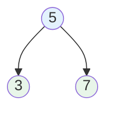

插入 4:

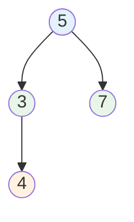

删除 3:


每次操作后仍保持 BST 性质


### 4. 唯一性问题

相同的元素序列可能构建出不同的 BST：


插入序列 [1, 2, 3] 的不同 BST:

情况1: 按顺序插入 1, 2, 3

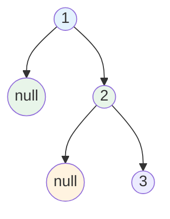

情况2: 按顺序插入 2, 1, 3

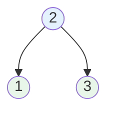


情况3: 按顺序插入 3, 2, 1,4

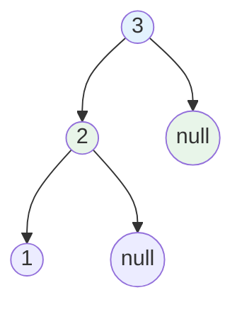

三种不同的 BST，但中序遍历结果相同: 1, 2, 3


## 原理详解

### 查找操作原理

利用 BST 的有序性质，每次比较可以排除一半的搜索空间：


查找算法思路:

目标: 在 BST 中查找值 target

比较过程:
- 如果 target == root.data: 找到目标
- 如果 target < root.data: 在左子树中继续查找
- 如果 target > root.data: 在右子树中继续查找

类似于二分查找，每一步都将搜索范围缩小一半


#### 查找路径可视化


在以下 BST 中查找值 6:

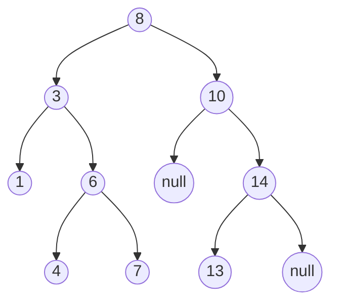

查找路径:
```
─────────────────────────────────────────────────────────────────
步骤   当前节点   比较           决策
─────────────────────────────────────────────────────────────────
 1       8      6 < 8         向左走
 2       3      6 > 3         向右走
 3       6      6 == 6        找到！
─────────────────────────────────────────────────────────────────

查找路径: 8 → 3 → 6
比较次数: 3
```

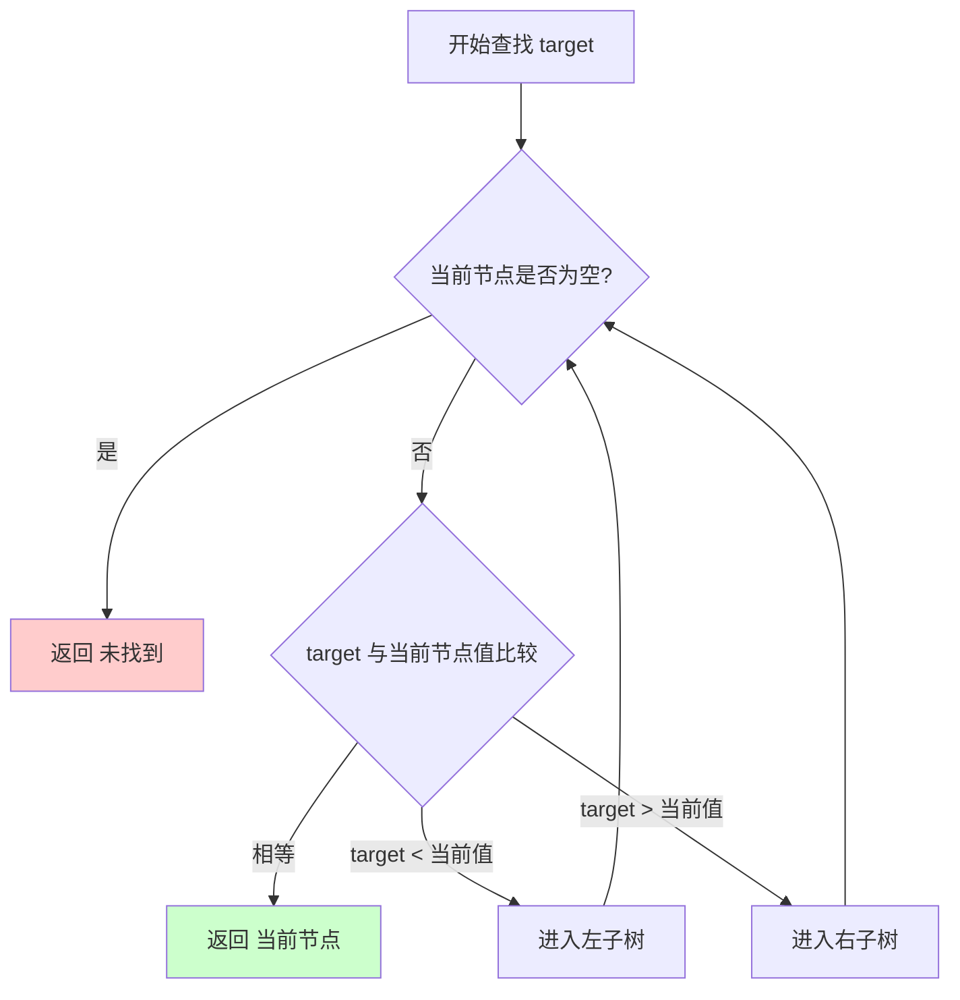

### 插入操作原理

插入操作首先找到合适的空位置，然后创建新节点：

```
插入算法思路:

目标: 插入值 value

步骤:
1. 从根节点开始
2. 比较 value 与当前节点:
   - 如果 value < 当前节点: 向左走
   - 如果 value > 当前节点: 向右走
   - 如果 value == 当前节点: 值已存在，不插入（或更新）
3. 当到达空位置时，在此处创建新节点
```

#### 插入过程可视化

在以下 BST 中插入值 5:

初始 BST:


```
插入路径:
─────────────────────────────────────────────────────────────────
步骤   当前节点   比较        决策
─────────────────────────────────────────────────────────────────
 1       8      5 < 8      向左走
 2       3      5 > 3      向右走
 3       6      5 < 6      向左走
 4       4      5 > 4      向右走
 5      NULL    -          在此插入 5
─────────────────────────────────────────────────────────────────
```

插入后的 BST:

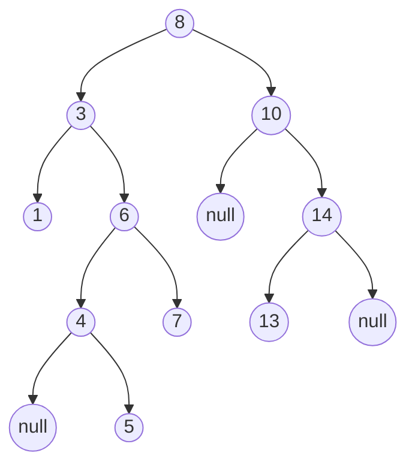

### 删除操作原理

删除操作是最复杂的，需要考虑三种情况：

```
删除算法思路:

情况1: 删除叶子节点
- 直接删除即可

情况2: 删除只有一个子节点的节点
- 用其子节点替换被删除节点

情况3: 删除有两个子节点的节点
- 找到中序后继（右子树的最小值）或中序前驱（左子树的最大值）
- 用后继/前驱的值替换被删除节点的值
- 删除后继/前驱节点（转化为情况1或情况2）
```

#### 三种删除情况详

##### 情况1: 删除叶子节点

删除节点 1:

删除前:

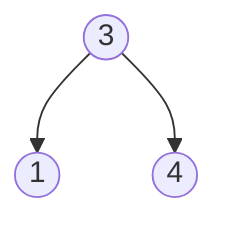


删除后:

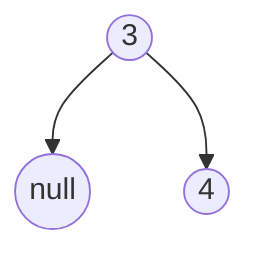

操作: 直接删除节点 1

##### 情况2: 删除只有一个子节点的节点

删除节点 3（只有右子节点）:

删除前:

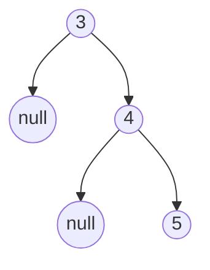

删除后:

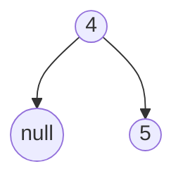

操作: 用子节点 4 替换节点 3

##### 情况3: 删除有两个子节点的节点

删除节点 3（有两个子节点）:

删除前:

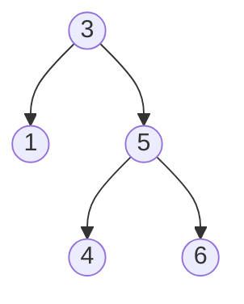

- **步骤1**: 
    - 找到中序后继（右子树最小值）
    - 在右子树中找最左节点 → 节点 4
- **步骤2**: 
    - 用后继值替换被删除节点
    - 节点 3 的值变为 4
- **步骤3**: 
    - 删除后继节点（节点 4）
    - 后继节点是叶子或只有右子节点

删除后:

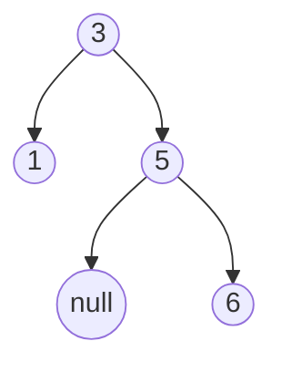

操作: 3 替换为 4，然后删除原来的 4

### 中序前驱和后继

中序前驱（Predecessor）:
- 中序遍历中节点的前一个节点
- 如果节点有左子树：左子树的最大值
- 如果节点无左子树：从该节点向上走，第一个向右转的祖先节点

中序后继（Successor）:
- 中序遍历中节点的后一个节点
- 如果节点有右子树：右子树的最小值
- 如果节点无右子树：从该节点向上走，第一个向左转的祖先节点

示例:


节点 6 的前驱: 4 (左子树最大值)
节点 6 的后继: 7 (右子树最小值)

节点 1 的后继: 3 (无右子树，向上走到 3 是第一个向左转的祖先)
节点 7 的后继: 8 (无右子树，向上走到 8 是第一个向左转的祖先)


## 可视化演示

### 完整操作演示

```
操作序列: 插入 5, 3, 7, 1, 4, 6, 8, 删除 3

═══════════════════════════════════════════════════════════════
初始状态: 空树
═══════════════════════════════════════════════════════════════

NULL

═══════════════════════════════════════════════════════════════
插入 5
═══════════════════════════════════════════════════════════════

        5

═══════════════════════════════════════════════════════════════
插入 3: 3 < 5, 插入左子树
═══════════════════════════════════════════════════════════════

        5
       /
      3

═══════════════════════════════════════════════════════════════
插入 7: 7 > 5, 插入右子树
═══════════════════════════════════════════════════════════════

        5
       / \
      3   7

═══════════════════════════════════════════════════════════════
插入 1: 1 < 5 → 1 < 3, 插入 3 的左子树
═══════════════════════════════════════════════════════════════

        5
       / \
      3   7
     /
    1

═══════════════════════════════════════════════════════════════
插入 4: 4 < 5 → 4 > 3, 插入 3 的右子树
═══════════════════════════════════════════════════════════════

        5
       / \
      3   7
     / \
    1   4

═══════════════════════════════════════════════════════════════
插入 6: 6 > 5 → 6 < 7, 插入 7 的左子树
═══════════════════════════════════════════════════════════════

        5
       / \
      3   7
     / \  /
    1   4 6

═══════════════════════════════════════════════════════════════
插入 8: 8 > 5 → 8 > 7, 插入 7 的右子树
═══════════════════════════════════════════════════════════════

        5
       / \
      3   7
     / \  / \
    1   4 6  8

中序遍历: 1, 3, 4, 5, 6, 7, 8 (升序)

═══════════════════════════════════════════════════════════════
删除 3: 节点 3 有两个子节点
═══════════════════════════════════════════════════════════════

步骤1: 找到中序后继
       3 的右子树的最小值 = 4

步骤2: 用 4 替换 3

        5
       / \
      4   7
     / \  / \
    1   ? 6  8

步骤3: 删除原来的 4（叶子节点）

        5
       / \
      4   7
     /   / \
    1   6   8

最终结果:
        5
       / \
      4   7
     /   / \
    1   6   8

中序遍历: 1, 4, 5, 6, 7, 8 (升序)
```

### 查找路径图

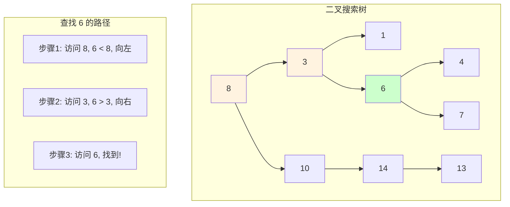

## 代码实现

### 节点定义

```c
typedef struct BSTNode {
    int data;                   // 节点值
    struct BSTNode *left;       // 左子节点
    struct BSTNode *right;      // 右子节点
} BSTNode;

// 创建新节点
BSTNode* createNode(int data) {
    BSTNode *node = (BSTNode*)malloc(sizeof(BSTNode));
    node->data = data;
    node->left = NULL;
    node->right = NULL;
    return node;
}
```

### 查找操作

```c
// 递归查找
BSTNode* search(BSTNode *root, int target) {
    // 基本情况: 空树或找到目标
    if (root == NULL || root->data == target) {
        return root;
    }
    
    // 根据比较结果决定搜索方向
    if (target < root->data) {
        return search(root->left, target);
    } else {
        return search(root->right, target);
    }
}

// 迭代查找
BSTNode* searchIterative(BSTNode *root, int target) {
    while (root != NULL && root->data != target) {
        if (target < root->data) {
            root = root->left;
        } else {
            root = root->right;
        }
    }
    return root;
}
```

### 插入操作

```c
// 递归插入
BSTNode* insert(BSTNode *root, int data) {
    // 找到插入位置，创建新节点
    if (root == NULL) {
        return createNode(data);
    }
    
    // 根据比较结果决定插入位置
    if (data < root->data) {
        root->left = insert(root->left, data);
    } else if (data > root->data) {
        root->right = insert(root->right, data);
    }
    // 如果 data == root->data，值已存在，不插入
    
    return root;
}

// 迭代插入
BSTNode* insertIterative(BSTNode *root, int data) {
    BSTNode *newNode = createNode(data);
    
    if (root == NULL) return newNode;
    
    BSTNode *curr = root;
    BSTNode *parent = NULL;
    
    // 查找插入位置
    while (curr != NULL) {
        parent = curr;
        if (data < curr->data) {
            curr = curr->left;
        } else if (data > curr->data) {
            curr = curr->right;
        } else {
            free(newNode);  // 值已存在
            return root;
        }
    }
    
    // 在父节点的左或右插入新节点
    if (data < parent->data) {
        parent->left = newNode;
    } else {
        parent->right = newNode;
    }
    
    return root;
}
```

### 删除操作

```c
// 查找最小值节点
BSTNode* findMin(BSTNode *root) {
    while (root->left != NULL) {
        root = root->left;
    }
    return root;
}

// 删除节点
BSTNode* delete(BSTNode *root, int data) {
    if (root == NULL) return NULL;
    
    if (data < root->data) {
        // 在左子树中删除
        root->left = delete(root->left, data);
    } else if (data > root->data) {
        // 在右子树中删除
        root->right = delete(root->right, data);
    } else {
        // 找到要删除的节点
        
        // 情况1和2: 只有0或1个子节点
        if (root->left == NULL) {
            BSTNode *temp = root->right;
            free(root);
            return temp;
        } else if (root->right == NULL) {
            BSTNode *temp = root->left;
            free(root);
            return temp;
        }
        
        // 情况3: 有两个子节点
        // 找到中序后继（右子树的最小值）
        BSTNode *successor = findMin(root->right);
        // 用后继值替换当前节点值
        root->data = successor->data;
        // 删除后继节点
        root->right = delete(root->right, successor->data);
    }
    
    return root;
}
```

### 查找前驱和后继

```c
// 查找最大值节点
BSTNode* findMax(BSTNode *root) {
    while (root->right != NULL) {
        root = root->right;
    }
    return root;
}

// 查找前驱
BSTNode* predecessor(BSTNode *root, BSTNode *node) {
    // 如果有左子树，前驱是左子树的最大值
    if (node->left != NULL) {
        return findMax(node->left);
    }
    
    // 否则，向上找第一个向右转的祖先
    BSTNode *pred = NULL;
    while (root != NULL) {
        if (node->data > root->data) {
            pred = root;
            root = root->right;
        } else if (node->data < root->data) {
            root = root->left;
        } else {
            break;
        }
    }
    return pred;
}

// 查找后继
BSTNode* successor(BSTNode *root, BSTNode *node) {
    // 如果有右子树，后继是右子树的最小值
    if (node->right != NULL) {
        return findMin(node->right);
    }
    
    // 否则，向上找第一个向左转的祖先
    BSTNode *succ = NULL;
    while (root != NULL) {
        if (node->data < root->data) {
            succ = root;
            root = root->left;
        } else if (node->data > root->data) {
            root = root->right;
        } else {
            break;
        }
    }
    return succ;
}
```

### C++ 模板实现

```cpp
template<typename T>
class BST {
private:
    struct Node {
        T data;
        Node *left, *right;
        Node(T val) : data(val), left(nullptr), right(nullptr) {}
    };
    
    Node *root;
    
    Node* insert(Node *node, T data) {
        if (!node) return new Node(data);
        if (data < node->data) 
            node->left = insert(node->left, data);
        else if (data > node->data) 
            node->right = insert(node->right, data);
        return node;
    }
    
    Node* findMin(Node *node) {
        while (node && node->left) node = node->left;
        return node;
    }
    
    Node* remove(Node *node, T data) {
        if (!node) return nullptr;
        if (data < node->data) 
            node->left = remove(node->left, data);
        else if (data > node->data) 
            node->right = remove(node->right, data);
        else {
            if (!node->left) {
                Node *temp = node->right;
                delete node;
                return temp;
            }
            if (!node->right) {
                Node *temp = node->left;
                delete node;
                return temp;
            }
            Node *succ = findMin(node->right);
            node->data = succ->data;
            node->right = remove(node->right, succ->data);
        }
        return node;
    }
    
    void inorder(Node *node, std::vector<T>& result) {
        if (!node) return;
        inorder(node->left, result);
        result.push_back(node->data);
        inorder(node->right, result);
    }
    
public:
    BST() : root(nullptr) {}
    
    void insert(T data) { root = insert(root, data); }
    void remove(T data) { root = remove(root, data); }
    
    bool search(T data) {
        Node *curr = root;
        while (curr) {
            if (data == curr->data) return true;
            curr = data < curr->data ? curr->left : curr->right;
        }
        return false;
    }
    
    std::vector<T> inorder() {
        std::vector<T> result;
        inorder(root, result);
        return result;
    }
};
```

## 复杂度分析

### 时间复杂度

| 操作 | 平均情况 | 最坏情况 | 说明 |
|------|---------|---------|------|
| 查找 | O(log n) | O(n) | 取决于树的高度 |
| 插入 | O(log n) | O(n) | 需要找到插入位置 |
| 删除 | O(log n) | O(n) | 需要找到节点并可能调整 |
| 最值 | O(log n) | O(n) | 沿着一侧走到尽头 |

```
高度分析:

最佳情况（完全平衡）:
h = ⌊log₂ n⌋
时间复杂度: O(log n)

最坏情况（退化为链表）:
h = n - 1
时间复杂度: O(n)

平均情况（随机插入）:
h ≈ 1.39 × log₂ n
时间复杂度: O(log n)
```

### 空间复杂度

- O(n)：存储 n 个节点
- 递归调用栈：O(h)，h 为树高度

## BST 常见问题

### 验证是否为 BST

```c
#include <limits.h>

// 方法1: 范围验证
int isValidBSTUtil(BSTNode *root, int min, int max) {
    if (root == NULL) return 1;
    if (root->data <= min || root->data >= max) return 0;
    return isValidBSTUtil(root->left, min, root->data) &&
           isValidBSTUtil(root->right, root->data, max);
}

int isValidBST(BSTNode *root) {
    return isValidBSTUtil(root, INT_MIN, INT_MAX);
}

// 方法2: 中序遍历验证（遍历结果应严格递增）
int prev = INT_MIN;

int isBST(BSTNode *root) {
    if (root == NULL) return 1;
    
    if (!isBST(root->left)) return 0;
    
    if (root->data <= prev) return 0;
    prev = root->data;
    
    return isBST(root->right);
}
```

### 查找第 K 小元素

```c
int kthSmallest(BSTNode *root, int k, int *count) {
    if (root == NULL) return -1;
    
    // 先遍历左子树
    int left = kthSmallest(root->left, k, count);
    if (left != -1) return left;
    
    // 访问当前节点
    (*count)++;
    if (*count == k) return root->data;
    
    // 遍历右子树
    return kthSmallest(root->right, k, count);
}
```

### 最近公共祖先（LCA）

```c
BSTNode* lowestCommonAncestor(BSTNode *root, int p, int q) {
    if (root == NULL) return NULL;
    
    // p, q 都在左子树
    if (p < root->data && q < root->data) {
        return lowestCommonAncestor(root->left, p, q);
    }
    // p, q 都在右子树
    if (p > root->data && q > root->data) {
        return lowestCommonAncestor(root->right, p, q);
    }
    
    // p, q 分别在左右子树，当前节点就是 LCA
    return root;
}
```

### 范围求和

```c
int rangeSumBST(BSTNode *root, int low, int high) {
    if (root == NULL) return 0;
    
    // 当前值小于 low，只需搜索右子树
    if (root->data < low) {
        return rangeSumBST(root->right, low, high);
    }
    // 当前值大于 high，只需搜索左子树
    if (root->data > high) {
        return rangeSumBST(root->left, low, high);
    }
    
    // 当前值在范围内，累加并搜索左右子树
    return root->data + 
           rangeSumBST(root->left, low, high) + 
           rangeSumBST(root->right, low, high);
}
```

## BST局限性

### 退化问题

BST 在最坏情况下会退化为链表：

```
有序插入导致退化:

插入序列: 1, 2, 3, 4, 5

结果:
        1
         \
          2
           \
            3
             \
              4
               \
                5

这已经退化为链表！
查找效率从 O(log n) 降为 O(n)
```

### 解决方案

使用**自平衡二叉搜索树**：

```
┌─────────────────────────────────────────────────────────────────────┐
│                    平衡二叉搜索树                                    │
├─────────────────────────────────────────────────────────────────────┤
│                                                                     │
│  AVL树:                                                            │
│  - 严格平衡：任意节点左右子树高度差 ≤ 1                              │
│  - 查找效率最佳：O(log n)                                           │
│  - 插入/删除可能需要多次旋转                                         │
│  - 适合查找密集型场景                                               │
│                                                                     │
│  红黑树:                                                            │
│  - 近似平衡：通过颜色规则维持平衡                                    │
│  - 查找效率：O(log n)                                               │
│  - 插入/删除最多 3 次旋转                                           │
│  - 适合插入/删除密集型场景                                           │
│  - C++ STL map/set 的底层实现                                       │
│                                                                     │
│  B树/B+树:                                                          │
│  - 多路平衡搜索树                                                   │
│  - 专为磁盘存储优化                                                 │
│  - 数据库索引常用                                                   │
│                                                                     │
└─────────────────────────────────────────────────────────────────────┘
```

## 应用场景

### 1. 动态集合

BST 实现动态维护的有序集合：


应用: 动态查找表

操作:
- insert(key): 插入元素
- delete(key): 删除元素
- search(key): 查找元素
- min()/max(): 获取最值
- successor(key): 获取后继
- predecessor(key): 获取前驱

优势: 所有操作 O(log n) 平均时间


### 2. 排序

通过中序遍历获得有序序列：

应用: 树排序（Tree Sort）

算法:
1. 将所有元素依次插入 BST
2. 中序遍历 BST 得到有序序列

时间复杂度:
- 平均: O(n log n)
- 最坏: O(n²) (有序输入导致退化)

空间复杂度: O(n)


### 3. 符号表

实现字典/映射功能：


应用: 符号表（Symbol Table）

操作:
- put(key, value): 插入键值对
- get(key): 根据键获取值
- delete(key): 删除键值对
- keys(): 获取所有键（有序）

实现: 每个节点存储 (key, value) 对，按 key 组织 BST


### 4. 数据库索引

BST 是 B+树索引的基础：


应用: 数据库索引

内存索引:
- 小型数据库可用 BST 实现内存索引
- 支持范围查询、前缀查询

磁盘索引:
- B+树是 BST 的多路扩展
- 减少磁盘 IO 次数


## 参考资料

- 《算法导论》第12章 - 二叉搜索树
- 《数据结构与算法分析：C语言描述》第4章 - 树
- [LeetCode 98. 验证二叉搜索树](https://leetcode.com/problems/validate-binary-search-tree/)
- [LeetCode 450. 删除二叉搜索树中的节点](https://leetcode.com/problems/delete-node-in-a-bst/)
- [LeetCode 230. 二叉搜索树中第K小的元素](https://leetcode.com/problems/kth-smallest-element-in-a-bst/)
