# 二叉搜索树

## 概述

二叉搜索树（Binary Search Tree，BST）是一种特殊的二叉树，它通过维护特定的有序性质，实现了高效的查找、插入和删除操作。BST 是许多高级数据结构（如 AVL树、红黑树）的基础。

!!! note "核心性质"
    对于 BST 中的任意节点，其**左子树**中所有节点的值都**小于**该节点的值，其**右子树**中所有节点的值都**大于**该节点的值。

dsafasfdasdf

### BST 的定义

二叉搜索树满足以下性质：

1. **左子树性质**：左子树上所有节点的值 < 根节点的值
2. **右子树性质**：右子树上所有节点的值 > 根节点的值
3. **递归性质**：左子树和右子树本身也是二叉搜索树

**BST 结构示例**

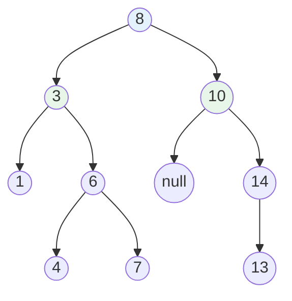
```mermaid
graph TB
    A((8)) --> B((3))
    A --> C((10))
    B --> D((1))
    B --> E((6))
    C --> F((null))
    C --> G((14))
    E --> H((4))
    E --> I((7))
    G --> J((13))
    
    style A fill:#E3F2FD
    style B fill:#E8F5E9
    style C fill:#E8F5E9
```

**验证 BST 性质:**
- 节点 8: 左子树 {1,3,4,6,7} < 8, 右子树 {10,13,14} > 8 ✓
- 节点 3: 左子树 {1} < 3, 右子树 {4,6,7} > 3 ✓
- 节点 6: 左子树 {4} < 6, 右子树 {7} > 6 ✓

## BST特点

### 1. 有序性

BST 的中序遍历结果是一个**严格递增**的有序序列：


中序遍历示例:

初始 BST:


```mermaid
graph TB
    A((8)) --> B((3))
    A --> C((10))
    B --> D((1))
    B --> E((6))
    C --> F((null))
    C --> G((14))
    E --> H((4))
    E --> I((7))
    G --> J((13))
    
    style A fill:#E3F2FD
    style B fill:#E8F5E9
    style C fill:#E8F5E9
```

中序遍历结果: 1, 3, 4, 6, 7, 8, 10, 13, 14 (升序)

### 2. 查找效率

BST 的查找效率取决于树的高度：

**理想情况（平衡树）: O(log n)**

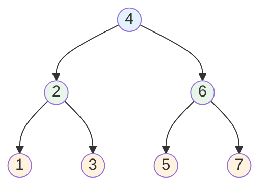
```mermaid
graph TB
    A((4)) --> B((2))
    A --> C((6))
    B --> D((1))
    B --> E((3))
    C --> F((5))
    C --> G((7))
    
    style A fill:#E3F2FD
    style B fill:#E8F5E9
    style C fill:#E8F5E9
    style D fill:#FFF3E0
    style E fill:#FFF3E0
    style F fill:#FFF3E0
    style G fill:#FFF3E0
```

高度 h ≈ log₂n

**最坏情况（退化为链表）: O(n)**

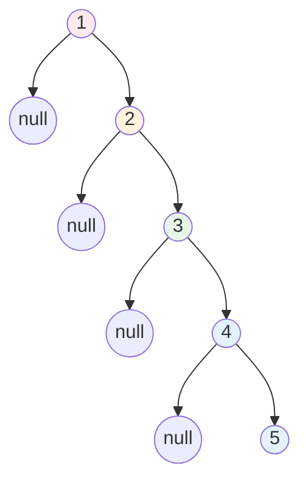
```mermaid
graph TB
    A((1)) --> B((null))
    A --> C((2))
    C --> D((null))
    C --> E((3))
    E --> F((null))
    E --> G((4))
    G --> H((null))
    G --> I((5))
    
    style A fill:#FFEBEE
    style C fill:#FFF3E0
    style E fill:#E8F5E9
    style G fill:#E3F2FD
    style I fill:#E3F2FD
```

高度 h = n

### 3. 动态维护

BST 支持动态的插入和删除操作，始终保持 BST 性质：


动态操作示例:

初始 BST:

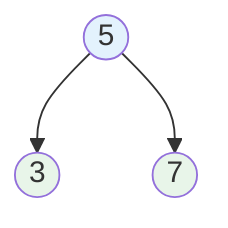
```mermaid
graph TB
    A((5)) --> B((3))
    A --> C((7))
    
    style A fill:#E3F2FD
    style B fill:#E8F5E9
    style C fill:#E8F5E9
```

插入 4:

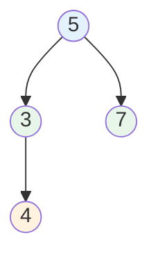
```mermaid
graph TB
    A((5)) --> B((3))
    A --> C((7))
    B --> D((4))
    
    style A fill:#E3F2FD
    style B fill:#E8F5E9
    style C fill:#E8F5E9
    style D fill:#FFF3E0
```

删除 3:


```mermaid
graph TB
    A((5)) --> B((4))
    A --> C((7))
    
    style A fill:#E3F2FD
    style B fill:#E8F5E9
    style C fill:#E8F5E9
```

每次操作后仍保持 BST 性质


### 4. 唯一性问题

相同的元素序列可能构建出不同的 BST：


插入序列 [1, 2, 3] 的不同 BST:

情况1: 按顺序插入 1, 2, 3

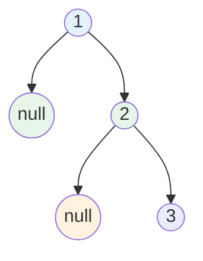
```mermaid
graph TB
    A((1)) --> B((null))
    A --> C((2))
    C --> D((null))
    C --> E((3))

    style A fill:#E3F2FD
    style B fill:#E8F5E9
    style C fill:#E8F5E9
    style D fill:#FFF3E0
```

情况2: 按顺序插入 2, 1, 3

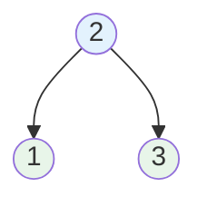
```mermaid
graph TB
    A((2)) --> B((1))
    A --> C((3))
    
    style A fill:#E3F2FD
    style B fill:#E8F5E9
    style C fill:#E8F5E9
```


情况3: 按顺序插入 3, 2, 1,4

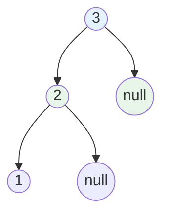
```mermaid
graph TB
    A((3)) --> B((2))
    A --> C((null))
    B --> D((1))
    B --> E((null))
    
    style A fill:#E3F2FD
    style B fill:#E8F5E9
    style C fill:#E8F5E9
```

三种不同的 BST，但中序遍历结果相同: 1, 2, 3


## 原理详解

### 查找操作原理

利用 BST 的有序性质，每次比较可以排除一半的搜索空间：


查找算法思路:

目标: 在 BST 中查找值 target

比较过程:
- 如果 target == root.data: 找到目标
- 如果 target < root.data: 在左子树中继续查找
- 如果 target > root.data: 在右子树中继续查找

类似于二分查找，每一步都将搜索范围缩小一半


#### 查找路径可视化


在以下 BST 中查找值 6:

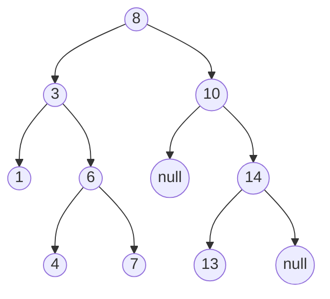
```mermaid
graph TB
    A((8)) --> BA((3))
    A --> BB((10))
    BA --> BAA((1))
    BA --> BAB((6))
    BB --> BBA((null))
    BB --> BBB((14))
    BAB --> BABA((4))
    BAB --> BABB((7))
    BBB --> BBBA((13))
    BBB --> BBBB((null))
```

查找路径:

| 步骤 | 当前节点 | 比较 | 决策 |
|------|----------|------|------|
| 1 | 8 | 6 < 8 | 向左走 |
| 2 | 3 | 6 > 3 | 向右走 |
| 3 | 6 | 6 == 6 | 找到！ |

**查找路径:** 8 → 3 → 6
**比较次数:** 3

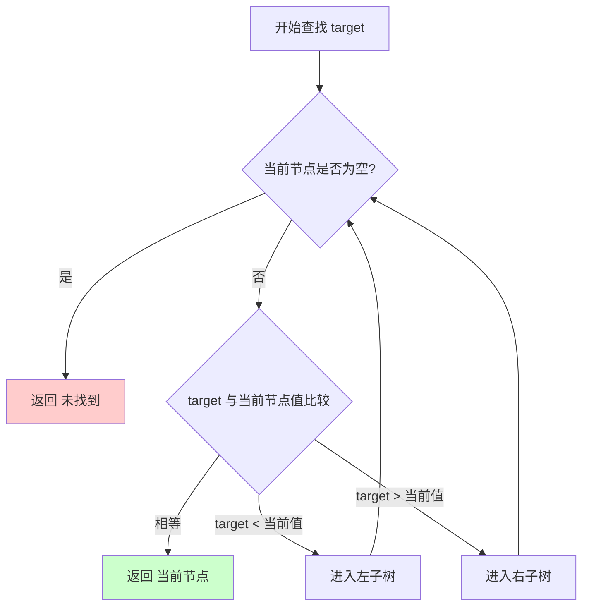
```mermaid
flowchart TB
    A[开始查找 target] --> B{当前节点是否为空?}
    B -->|是| C[返回 未找到]
    B -->|否| D{target 与当前节点值比较}
    D -->|相等| E[返回 当前节点]
    D -->|target < 当前值| F[进入左子树]
    D -->|target > 当前值| G[进入右子树]
    F --> B
    G --> B
    
    style C fill:#ffcccc
    style E fill:#ccffcc
```

### 插入操作原理

插入操作首先找到合适的空位置，然后创建新节点：

```
插入算法思路:

目标: 插入值 value

步骤:
1. 从根节点开始
2. 比较 value 与当前节点:
   - 如果 value < 当前节点: 向左走
   - 如果 value > 当前节点: 向右走
   - 如果 value == 当前节点: 值已存在，不插入（或更新）
3. 当到达空位置时，在此处创建新节点
```

#### 插入过程可视化

在以下 BST 中插入值 5:

初始 BST:

```mermaid
graph TB
    A((8)) --> BA((3))
    A --> BB((10))
    BA --> BAA((1))
    BA --> BAB((6))
    BB --> BBA((null))
    BB --> BBB((14))
    BAB --> BABA((4))
    BAB --> BABB((7))
    BBB --> BBBA((13))
    BBB --> BBBB((null))

插入路径:

| 步骤 | 当前节点 | 比较 | 决策 |
|------|----------|------|------|
| 1 | 8 | 5 < 8 | 向左走 |
| 2 | 3 | 5 > 3 | 向右走 |
| 3 | 6 | 5 < 6 | 向左走 |
| 4 | 4 | 5 > 4 | 向右走 |
| 5 | NULL | - | 在此插入 5 |

插入后的 BST:

```mermaid
graph TB
    A((8)) --> BA((3))
    A --> BB((10))
    BA --> BAA((1))
    BA --> BAB((6))
    BB --> BBA((null))
    BB --> BBB((14))
    BAB --> BABA((4))
    BAB --> BABB((7))
    BBB --> BBBA((13))
    BBB --> BBBB((null))
    BABA --> BABAA((null))
    BABA --> BABAB((5))
```

### 删除操作原理

删除操作是最复杂的，需要考虑三种情况：

```
删除算法思路:

情况1: 删除叶子节点
- 直接删除即可

情况2: 删除只有一个子节点的节点
- 用其子节点替换被删除节点

情况3: 删除有两个子节点的节点
- 找到中序后继（右子树的最小值）或中序前驱（左子树的最大值）
- 用后继/前驱的值替换被删除节点的值
- 删除后继/前驱节点（转化为情况1或情况2）
```

#### 三种删除情况详

##### 情况1: 删除叶子节点

删除节点 1:

删除前:

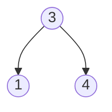
```mermaid
graph TB
    A((3)) --> BA((1))
    A --> BB((4))
```


删除后:

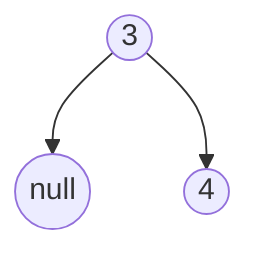
```mermaid
graph TB
    A((3)) --> BA((null))
    A --> BB((4))
```

操作: 直接删除节点 1

##### 情况2: 删除只有一个子节点的节点

删除节点 3（只有右子节点）:

删除前:

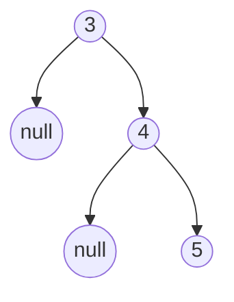
```mermaid
graph TB
    A((3)) --> BA((null))
    A --> BB((4))
    BB --> BBA((null))  
    BB --> BBB((5))
```

删除后:

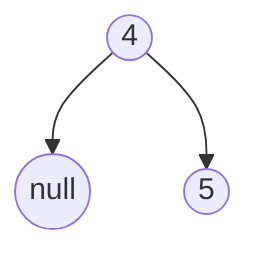
```mermaid
graph TB
    A((4)) --> BA((null))
    A --> BB((5))
```

操作: 用子节点 4 替换节点 3

##### 情况3: 删除有两个子节点的节点

删除节点 3（有两个子节点）:

删除前:

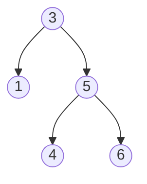
```mermaid
graph TB
    A((3)) --> BA((1))
    A --> BB((5))
    BB --> BBA((4))
    BB --> BBB((6))
```

- **步骤1**: 
    - 找到中序后继（右子树最小值）
    - 在右子树中找最左节点 → 节点 4
- **步骤2**: 
    - 用后继值替换被删除节点
    - 节点 3 的值变为 4
- **步骤3**: 
    - 删除后继节点（节点 4）
    - 后继节点是叶子或只有右子节点

删除后:

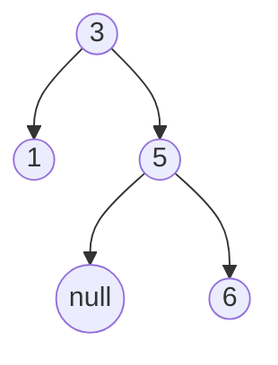
```mermaid
graph TB
    A((3)) --> BA((1))
    A --> BB((5))
    BB --> BBA((null))
    BB --> BBB((6))
```

操作: 3 替换为 4，然后删除原来的 4

### 中序前驱和后继

中序前驱（Predecessor）:
- 中序遍历中节点的前一个节点
- 如果节点有左子树：左子树的最大值
- 如果节点无左子树：从该节点向上走，第一个向右转的祖先节点

中序后继（Successor）:
- 中序遍历中节点的后一个节点
- 如果节点有右子树：右子树的最小值
- 如果节点无右子树：从该节点向上走，第一个向左转的祖先节点

示例:


```mermaid
graph TB
    A((8)) --> BA((3))
    A --> BB((10))
    BA --> BAA((1))
    BA --> BAB((6))
    BB --> BBA((null))
    BB --> BBB((14))
    BAB --> BABA((4))
    BAB --> BABB((7))
    BBB --> BBBA((13))
    BBB --> BBBB((null))
```


节点 6 的前驱: 4 (左子树最大值)
节点 6 的后继: 7 (右子树最小值)

节点 1 的后继: 3 (无右子树，向上走到 3 是第一个向左转的祖先)
节点 7 的后继: 8 (无右子树，向上走到 8 是第一个向左转的祖先)


## 可视化演示

### 完整操作演示

操作序列: **插入 5, 3, 7, 1, 4, 6, 8, 删除 3**

#### 初始状态: 空树

```
NULL
```

#### 步骤1: 插入 5

```mermaid
graph TB
    5((5))
    
    style 5 fill:#E3F2FD
```

#### 步骤2: 插入 3（3 < 5，插入左子树）

```mermaid
graph TB
    5((5)) --> 3((3))
    
    style 5 fill:#E3F2FD
    style 3 fill:#E8F5E9
```

#### 步骤3: 插入 7（7 > 5，插入右子树）

```mermaid
graph TB
    5((5)) --> 3((3))
    5 --> 7((7))
    
    style 5 fill:#E3F2FD
    style 3 fill:#E8F5E9
    style 7 fill:#E8F5E9
```

#### 步骤4: 插入 1（1 < 5 → 1 < 3，插入3的左子树）

```mermaid
graph TB
    5((5)) --> 3((3))
    5 --> 7((7))
    3 --> 1((1))
    
    style 5 fill:#E3F2FD
    style 3 fill:#E8F5E9
    style 7 fill:#E8F5E9
    style 1 fill:#E8F5E9
```

#### 步骤5: 插入 4（4 < 5 → 4 > 3，插入3的右子树）

```mermaid
graph TB
    5((5)) --> 3((3))
    5 --> 7((7))
    3 --> 1((1))
    3 --> 4((4))
    
    style 5 fill:#E3F2FD
    style 3 fill:#E8F5E9
    style 7 fill:#E8F5E9
```

#### 步骤6: 插入 6（6 > 5 → 6 < 7，插入7的左子树）

```mermaid
graph TB
    5((5)) --> 3((3))
    5 --> 7((7))
    3 --> 1((1))
    3 --> 4((4))
    7 --> 6((6))
    
    style 5 fill:#E3F2FD
    style 7 fill:#FFCC80
```

#### 步骤7: 插入 8（8 > 5 → 8 > 7，插入7的右子树）

```mermaid
graph TB
    5((5)) --> 3((3))
    5 --> 7((7))
    3 --> 1((1))
    3 --> 4((4))
    7 --> 6((6))
    7 --> 8((8))
    
    style 5 fill:#E3F2FD
    style 7 fill:#C8E6C9
```

**中序遍历:** 1, 3, 4, 5, 6, 7, 8（升序）

#### 步骤8: 删除 3（节点3有两个子节点）

**分析:** 节点3有两个子节点，需要找到中序后继（节点的右子树最小值）来替换

**步骤1:** 找到中序后继 → 3的右子树最小值 = 4

**步骤2:** 用4替换3

```mermaid
graph TB
    5((5)) --> 4((4))
    5 --> 7((7))
    4 --> 1((1))
    4 --> ?
    7 --> 6((6))
    7 --> 8((8))
    
    style 5 fill:#E3F2FD
    style 4 fill:#FFCC80
```

**步骤3:** 删除原来的4（叶子节点）

```mermaid
graph TB
    5((5)) --> 4((4))
    5 --> 7((7))
    4 --> 1((1))
    7 --> 6((6))
    7 --> 8((8))
    
    style 5 fill:#E3F2FD
    style 4 fill:#C8E6C9
```

**最终结果:**

```mermaid
graph TB
    5((5)) --> 4((4))
    5 --> 7((7))
    4 --> 1((1))
    7 --> 6((6))
    7 --> 8((8))
    
    style 5 fill:#E3F2FD
    style 4 fill:#E8F5E9
    style 7 fill:#E8F5E9
```

**中序遍历:** 1, 4, 5, 6, 7, 8（升序）

### 查找路径图

```mermaid
graph TB
    subgraph BST["二叉搜索树"]
        n8["8"]
        n3["3"]
        n10["10"]
        n1["1"]
        n6["6"]
        n14["14"]
        n4["4"]
        n7["7"]
        n13["13"]
        
        n8 --> n3
        n8 --> n10
        n3 --> n1
        n3 --> n6
        n10 --> n14
        n6 --> n4
        n6 --> n7
        n14 --> n13
    end
    
    style n8 fill:#fff3e0
    style n3 fill:#fff3e0
    style n6 fill:#ccffcc
    
    subgraph legend["查找 6 的路径"]
        l1["步骤1: 访问 8, 6 < 8, 向左"]
        l2["步骤2: 访问 3, 6 > 3, 向右"]
        l3["步骤3: 访问 6, 找到!"]
    end
```

## 代码实现

### 节点定义

```c
typedef struct BSTNode {
    int data;                   // 节点值
    struct BSTNode *left;       // 左子节点
    struct BSTNode *right;      // 右子节点
} BSTNode;

// 创建新节点
BSTNode* createNode(int data) {
    BSTNode *node = (BSTNode*)malloc(sizeof(BSTNode));
    node->data = data;
    node->left = NULL;
    node->right = NULL;
    return node;
}
```

### 查找操作

```c
// 递归查找
BSTNode* search(BSTNode *root, int target) {
    // 基本情况: 空树或找到目标
    if (root == NULL || root->data == target) {
        return root;
    }
    
    // 根据比较结果决定搜索方向
    if (target < root->data) {
        return search(root->left, target);
    } else {
        return search(root->right, target);
    }
}

// 迭代查找
BSTNode* searchIterative(BSTNode *root, int target) {
    while (root != NULL && root->data != target) {
        if (target < root->data) {
            root = root->left;
        } else {
            root = root->right;
        }
    }
    return root;
}
```

### 插入操作

```c
// 递归插入
BSTNode* insert(BSTNode *root, int data) {
    // 找到插入位置，创建新节点
    if (root == NULL) {
        return createNode(data);
    }
    
    // 根据比较结果决定插入位置
    if (data < root->data) {
        root->left = insert(root->left, data);
    } else if (data > root->data) {
        root->right = insert(root->right, data);
    }
    // 如果 data == root->data，值已存在，不插入
    
    return root;
}

// 迭代插入
BSTNode* insertIterative(BSTNode *root, int data) {
    BSTNode *newNode = createNode(data);
    
    if (root == NULL) return newNode;
    
    BSTNode *curr = root;
    BSTNode *parent = NULL;
    
    // 查找插入位置
    while (curr != NULL) {
        parent = curr;
        if (data < curr->data) {
            curr = curr->left;
        } else if (data > curr->data) {
            curr = curr->right;
        } else {
            free(newNode);  // 值已存在
            return root;
        }
    }
    
    // 在父节点的左或右插入新节点
    if (data < parent->data) {
        parent->left = newNode;
    } else {
        parent->right = newNode;
    }
    
    return root;
}
```

### 删除操作

```c
// 查找最小值节点
BSTNode* findMin(BSTNode *root) {
    while (root->left != NULL) {
        root = root->left;
    }
    return root;
}

// 删除节点
BSTNode* delete(BSTNode *root, int data) {
    if (root == NULL) return NULL;
    
    if (data < root->data) {
        // 在左子树中删除
        root->left = delete(root->left, data);
    } else if (data > root->data) {
        // 在右子树中删除
        root->right = delete(root->right, data);
    } else {
        // 找到要删除的节点
        
        // 情况1和2: 只有0或1个子节点
        if (root->left == NULL) {
            BSTNode *temp = root->right;
            free(root);
            return temp;
        } else if (root->right == NULL) {
            BSTNode *temp = root->left;
            free(root);
            return temp;
        }
        
        // 情况3: 有两个子节点
        // 找到中序后继（右子树的最小值）
        BSTNode *successor = findMin(root->right);
        // 用后继值替换当前节点值
        root->data = successor->data;
        // 删除后继节点
        root->right = delete(root->right, successor->data);
    }
    
    return root;
}
```

### 查找前驱和后继

```c
// 查找最大值节点
BSTNode* findMax(BSTNode *root) {
    while (root->right != NULL) {
        root = root->right;
    }
    return root;
}

// 查找前驱
BSTNode* predecessor(BSTNode *root, BSTNode *node) {
    // 如果有左子树，前驱是左子树的最大值
    if (node->left != NULL) {
        return findMax(node->left);
    }
    
    // 否则，向上找第一个向右转的祖先
    BSTNode *pred = NULL;
    while (root != NULL) {
        if (node->data > root->data) {
            pred = root;
            root = root->right;
        } else if (node->data < root->data) {
            root = root->left;
        } else {
            break;
        }
    }
    return pred;
}

// 查找后继
BSTNode* successor(BSTNode *root, BSTNode *node) {
    // 如果有右子树，后继是右子树的最小值
    if (node->right != NULL) {
        return findMin(node->right);
    }
    
    // 否则，向上找第一个向左转的祖先
    BSTNode *succ = NULL;
    while (root != NULL) {
        if (node->data < root->data) {
            succ = root;
            root = root->left;
        } else if (node->data > root->data) {
            root = root->right;
        } else {
            break;
        }
    }
    return succ;
}
```

### C++ 模板实现

```cpp
template<typename T>
class BST {
private:
    struct Node {
        T data;
        Node *left, *right;
        Node(T val) : data(val), left(nullptr), right(nullptr) {}
    };
    
    Node *root;
    
    Node* insert(Node *node, T data) {
        if (!node) return new Node(data);
        if (data < node->data) 
            node->left = insert(node->left, data);
        else if (data > node->data) 
            node->right = insert(node->right, data);
        return node;
    }
    
    Node* findMin(Node *node) {
        while (node && node->left) node = node->left;
        return node;
    }
    
    Node* remove(Node *node, T data) {
        if (!node) return nullptr;
        if (data < node->data) 
            node->left = remove(node->left, data);
        else if (data > node->data) 
            node->right = remove(node->right, data);
        else {
            if (!node->left) {
                Node *temp = node->right;
                delete node;
                return temp;
            }
            if (!node->right) {
                Node *temp = node->left;
                delete node;
                return temp;
            }
            Node *succ = findMin(node->right);
            node->data = succ->data;
            node->right = remove(node->right, succ->data);
        }
        return node;
    }
    
    void inorder(Node *node, std::vector<T>& result) {
        if (!node) return;
        inorder(node->left, result);
        result.push_back(node->data);
        inorder(node->right, result);
    }
    
public:
    BST() : root(nullptr) {}
    
    void insert(T data) { root = insert(root, data); }
    void remove(T data) { root = remove(root, data); }
    
    bool search(T data) {
        Node *curr = root;
        while (curr) {
            if (data == curr->data) return true;
            curr = data < curr->data ? curr->left : curr->right;
        }
        return false;
    }
    
    std::vector<T> inorder() {
        std::vector<T> result;
        inorder(root, result);
        return result;
    }
};
```

## 复杂度分析

### 时间复杂度

| 操作 | 平均情况 | 最坏情况 | 说明 |
|------|---------|---------|------|
| 查找 | $O(\log n)$ | $O(n)$ | 取决于树的高度 |
| 插入 | $O(\log n)$ | $O(n)$ | 需要找到插入位置 |
| 删除 | $O(\log n)$ | $O(n)$ | 需要找到节点并可能调整 |
| 最值 | $O(\log n)$ | $O(n)$ | 沿着一侧走到尽头 |

!!! note "高度分析"

    **最佳情况（完全平衡）**:
    $$h = \lfloor \log_2 n \rfloor$$
    时间复杂度: $O(\log n)$

    **最坏情况（退化为链表）**:
    $$h = n - 1$$
    时间复杂度: $O(n)$

    **平均情况（随机插入）**:
    $$h \approx 1.39 \times \log_2 n$$
    时间复杂度: $O(\log n)$

### 空间复杂度

- 存储 n 个节点: $O(n)$
- 递归调用栈: $O(h)$，h 为树高度

## BST 常见问题

### 验证是否为 BST

```c
#include <limits.h>

// 方法1: 范围验证
int isValidBSTUtil(BSTNode *root, int min, int max) {
    if (root == NULL) return 1;
    if (root->data <= min || root->data >= max) return 0;
    return isValidBSTUtil(root->left, min, root->data) &&
           isValidBSTUtil(root->right, root->data, max);
}

int isValidBST(BSTNode *root) {
    return isValidBSTUtil(root, INT_MIN, INT_MAX);
}

// 方法2: 中序遍历验证（遍历结果应严格递增）
int prev = INT_MIN;

int isBST(BSTNode *root) {
    if (root == NULL) return 1;
    
    if (!isBST(root->left)) return 0;
    
    if (root->data <= prev) return 0;
    prev = root->data;
    
    return isBST(root->right);
}
```

### 查找第 K 小元素

```c
int kthSmallest(BSTNode *root, int k, int *count) {
    if (root == NULL) return -1;
    
    // 先遍历左子树
    int left = kthSmallest(root->left, k, count);
    if (left != -1) return left;
    
    // 访问当前节点
    (*count)++;
    if (*count == k) return root->data;
    
    // 遍历右子树
    return kthSmallest(root->right, k, count);
}
```

### 最近公共祖先（LCA）

```c
BSTNode* lowestCommonAncestor(BSTNode *root, int p, int q) {
    if (root == NULL) return NULL;
    
    // p, q 都在左子树
    if (p < root->data && q < root->data) {
        return lowestCommonAncestor(root->left, p, q);
    }
    // p, q 都在右子树
    if (p > root->data && q > root->data) {
        return lowestCommonAncestor(root->right, p, q);
    }
    
    // p, q 分别在左右子树，当前节点就是 LCA
    return root;
}
```

### 范围求和

```c
int rangeSumBST(BSTNode *root, int low, int high) {
    if (root == NULL) return 0;
    
    // 当前值小于 low，只需搜索右子树
    if (root->data < low) {
        return rangeSumBST(root->right, low, high);
    }
    // 当前值大于 high，只需搜索左子树
    if (root->data > high) {
        return rangeSumBST(root->left, low, high);
    }
    
    // 当前值在范围内，累加并搜索左右子树
    return root->data + 
           rangeSumBST(root->left, low, high) + 
           rangeSumBST(root->right, low, high);
}
```

## BST局限性

### 退化问题

BST 在最坏情况下会退化为链表：

```
有序插入导致退化:

插入序列: 1, 2, 3, 4, 5

结果:
        1
         \
          2
           \
            3
             \
              4
               \
                5

这已经退化为链表！
查找效率从 O(log n) 降为 O(n)
```

### 解决方案

使用**自平衡二叉搜索树**：

| 特性 | AVL树 | 红黑树 | B树/B+树 |
|------|-------|--------|----------|
| **平衡方式** | 严格平衡（高度差 ≤ 1） | 近似平衡（颜色规则） | 多路平衡 |
| **查找效率** | 最佳 O(log n) | O(log n) | O(log n) |
| **旋转次数** | 插入/删除可能多次 | 最多3次 | 较少 |
| **适用场景** | 查找密集型 | 插入删除频繁 | 磁盘存储优化 |
| **典型应用** | 数据库索引 | C++ STL map/set | 数据库索引 |

!!! tip
    - **AVL树**：适合查找密集型场景，如数据库索引
    - **红黑树**：适合插入删除频繁场景，如Linux进程调度、C++ STL容器
    - **B树/B+树**：专为磁盘存储优化，数据库索引常用

## 应用场景

### 1. 动态集合

!!! note "BST 实现动态维护的有序集合"
    
    **应用**: 动态查找表
    
    **操作**:
    - `insert(key)`: 插入元素
    - `delete(key)`: 删除元素
    - `search(key)`: 查找元素
    - `min()/max()`: 获取最值
    - `successor(key)`: 获取后继
    - `predecessor(key)`: 获取前驱
    
    **优势**: 所有操作 $O(\log n)$ 平均时间

### 2. 排序

!!! note "通过中序遍历获得有序序列"

    **应用**: 树排序（Tree Sort）

    **算法**:
    1. 将所有元素依次插入 BST
    2. 中序遍历 BST 得到有序序列

    **时间复杂度**:
    - 平均: $O(n \log n)$
    - 最坏: $O(n^2)$（有序输入导致退化）

    **空间复杂度**: $O(n)$

### 3. 符号表

!!! note "实现字典/映射功能"
    
    **应用**: 符号表（Symbol Table）
    
    **操作**:
    - `put(key, value)`: 插入键值对
    - `get(key)`: 根据键获取值
    - `delete(key)`: 删除键值对
    - `keys()`: 获取所有键（有序）
    
    **实现**: 每个节点存储 `(key, value)` 对，按 key 组织 BST

### 4. 数据库索引

!!! note "BST 是 B+树索引的基础"
    
    **应用**: 数据库索引
    
    **内存索引**:
    - 小型数据库可用 BST 实现内存索引
    - 支持范围查询、前缀查询
    
    **磁盘索引**:
    - B+树是 BST 的多路扩展
    - 减少磁盘 IO 次数


## 参考资料

- 《算法导论》第12章 - 二叉搜索树
- 《数据结构与算法分析：C语言描述》第4章 - 树
- [LeetCode 98. 验证二叉搜索树](https://leetcode.com/problems/validate-binary-search-tree/)
- [LeetCode 450. 删除二叉搜索树中的节点](https://leetcode.com/problems/delete-node-in-a-bst/)
- [LeetCode 230. 二叉搜索树中第K小的元素](https://leetcode.com/problems/kth-smallest-element-in-a-bst/)
