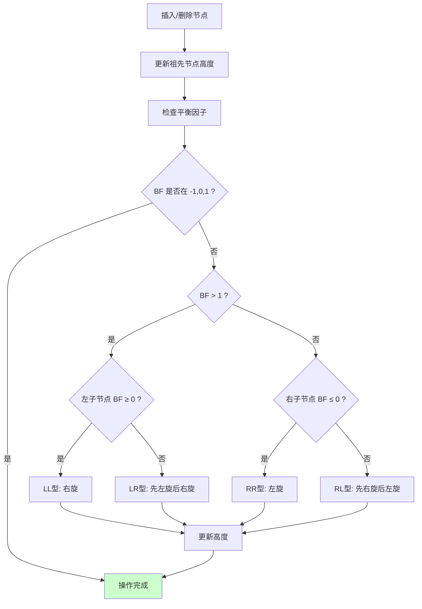

# AVL树

## 概述

AVL树是最早发明的**自平衡二叉搜索树**，由苏联数学家 Adelson-Velsky 和 Landis 在 1962 年提出。它通过在每个节点维护平衡因子，确保任意节点的左右子树高度差不超过 1，从而保证树的高度始终为 O(log n)。

<div style="background-color: #E3F2FD; border-left: 4px solid #2196F3; padding: 12px; margin: 10px 0;">
<strong>核心性质：</strong>AVL树中任意节点的<strong>平衡因子</strong>（左子树高度 - 右子树高度）取值只能是 <strong>-1、0 或 1</strong>。当插入或删除操作导致平衡因子超出此范围时，通过<strong>旋转操作</strong>恢复平衡。
</div>

### AVL树的历史意义

<div style="background-color: #E3F2FD; border-left: 4px solid #2196F3; padding: 15px; margin: 10px 0;">
<p><strong>AVL树的重要性</strong></p>
<p><strong>发明时间：</strong>1962年</p>
<p><strong>发明者：</strong>G.M. Adelson-Velsky 和 E.M. Landis</p>
<p><strong>历史意义：</strong></p>
<ul style="margin-left: 20px;">
<li>第一个自平衡二叉搜索树</li>
<li>开创了平衡树研究的先河</li>
<li>为后续红黑树、B树等奠定基础</li>
</ul>
<p><strong>命名来源：</strong>AVL = Adelson-Velsky 和 Landis 的首字母缩写</p>
</div>

## AVL树特点

### 1. 严格平衡

AVL树要求任意节点的左右子树高度差不超过 1：

<div style="background-color: #F5F5F5; border-radius: 8px; padding: 20px; margin: 10px 0;">
<p><strong>AVL树示例（高度标注）:</strong></p>
<div style="text-align: center; font-family: monospace; margin: 15px 0;">
<pre style="display: inline-block; text-align: left;">
              <span style="color: #2196F3;">8</span> (h=3)
            /         \
         <span style="color: #2196F3;">4</span> (h=2)    <span style="color: #2196F3;">10</span> (h=1)
        /    \          \
     <span style="color: #2196F3;">2</span> (h=1) <span style="color: #2196F3;">6</span> (h=1)   <span style="color: #2196F3;">12</span> (h=0)
     /
    <span style="color: #2196F3;">1</span> (h=0)
</pre>
</div>
<p><strong>验证平衡性:</strong></p>
<ul style="margin-left: 20px;">
<li>节点 8: |h(左)-h(右)| = |2-1| = 1 ≤ 1 ✓</li>
<li>节点 4: |h(左)-h(右)| = |1-1| = 0 ≤ 1 ✓</li>
<li>节点 2: |h(左)-h(右)| = |0-0| = 0 ≤ 1 ✓</li>
<li>节点 6: |h(左)-h(右)| = |0-0| = 0 ≤ 1 ✓</li>
<li>节点 10: |h(左)-h(右)| = |0-0| = 0 ≤ 1 ✓</li>
<li>节点 12: |h(左)-h(右)| = |0-0| = 0 ≤ 1 ✓</li>
<li>节点 1: |h(左)-h(右)| = |0-0| = 0 ≤ 1 ✓</li>
</ul>
<p style="color: #4CAF50; font-weight: bold;">这是一棵合法的 AVL 树</p>
</div>

### 2. 平衡因子

每个节点维护一个平衡因子，用于判断是否需要调整：

<div style="background-color: #F5F5F5; border-radius: 8px; padding: 20px; margin: 10px 0;">
<p><strong>平衡因子定义:</strong></p>
<p style="font-family: monospace; background: #E3F2FD; padding: 8px; border-radius: 4px;">BF(node) = height(node.left) - height(node.right)</p>
<p><strong>平衡因子取值:</strong></p>
<table style="width: 100%; border-collapse: collapse; margin-top: 10px;">
<tr style="background-color: #2196F3; color: white;">
<th style="padding: 10px; border: 1px solid #ddd;">平衡因子</th>
<th style="padding: 10px; border: 1px solid #ddd;">含义</th>
<th style="padding: 10px; border: 1px solid #ddd;">状态</th>
<th style="padding: 10px; border: 1px solid #ddd;">操作</th>
</tr>
<tr style="background-color: #E8F5E9;">
<td style="padding: 10px; border: 1px solid #ddd; text-align: center;">1</td>
<td style="padding: 10px; border: 1px solid #ddd;">左子树较高</td>
<td style="padding: 10px; border: 1px solid #ddd; color: #4CAF50; font-weight: bold;">平衡</td>
<td style="padding: 10px; border: 1px solid #ddd;">无需调整</td>
</tr>
<tr style="background-color: #E8F5E9;">
<td style="padding: 10px; border: 1px solid #ddd; text-align: center;">0</td>
<td style="padding: 10px; border: 1px solid #ddd;">左右子树等高</td>
<td style="padding: 10px; border: 1px solid #ddd; color: #4CAF50; font-weight: bold;">平衡</td>
<td style="padding: 10px; border: 1px solid #ddd;">无需调整</td>
</tr>
<tr style="background-color: #E8F5E9;">
<td style="padding: 10px; border: 1px solid #ddd; text-align: center;">-1</td>
<td style="padding: 10px; border: 1px solid #ddd;">右子树较高</td>
<td style="padding: 10px; border: 1px solid #ddd; color: #4CAF50; font-weight: bold;">平衡</td>
<td style="padding: 10px; border: 1px solid #ddd;">无需调整</td>
</tr>
<tr style="background-color: #FFEBEE;">
<td style="padding: 10px; border: 1px solid #ddd; text-align: center;">> 1</td>
<td style="padding: 10px; border: 1px solid #ddd;">左子树过高</td>
<td style="padding: 10px; border: 1px solid #ddd; color: #F44336; font-weight: bold;">不平衡</td>
<td style="padding: 10px; border: 1px solid #ddd;">需要右旋</td>
</tr>
<tr style="background-color: #FFEBEE;">
<td style="padding: 10px; border: 1px solid #ddd; text-align: center;">< -1</td>
<td style="padding: 10px; border: 1px solid #ddd;">右子树过高</td>
<td style="padding: 10px; border: 1px solid #ddd; color: #F44336; font-weight: bold;">不平衡</td>
<td style="padding: 10px; border: 1px solid #ddd;">需要左旋</td>
</tr>
</table>
</div>

### 3. 查找高效

AVL树保证查找、插入、删除的时间复杂度均为 O(log n)：

<div style="background-color: #F5F5F5; border-radius: 8px; padding: 20px; margin: 10px 0;">
<p><strong>高度上界分析:</strong></p>
<p style="font-family: monospace; background: #E3F2FD; padding: 8px; border-radius: 4px; margin: 10px 0;">AVL树高度满足: h ≤ 1.44 × log₂(n + 2) - 0.328</p>
<p><strong>证明思路:</strong></p>
<p>设 n(h) 为高度为 h 的 AVL 树的最少节点数</p>
<p><strong>递推关系:</strong></p>
<ul style="margin-left: 20px;">
<li>n(0) = 1</li>
<li>n(1) = 2</li>
<li>n(h) = n(h-1) + n(h-2) + 1  (类似 Fibonacci)</li>
</ul>
<p>因此: n ≥ Fibonacci(h+2) - 1</p>
<p style="margin-left: 40px;">h ≤ 1.44 × log₂(n+2)</p>
<p style="color: #4CAF50; font-weight: bold; margin-top: 10px;">结论: AVL树高度为 O(log n)</p>
</div>

### 4. 旋转调整

通过旋转操作恢复平衡，旋转是 O(1) 时间：

<div style="background-color: #F5F5F5; border-radius: 8px; padding: 20px; margin: 10px 0;">
<p><strong>旋转操作类型:</strong></p>
<ol style="margin-left: 20px;">
<li><strong style="color: #FF9800;">左旋（Left Rotation）</strong>: 处理右子树过高</li>
<li><strong style="color: #FF9800;">右旋（Right Rotation）</strong>: 处理左子树过高</li>
<li><strong style="color: #FF9800;">左右旋（LR）</strong>: 先左旋后右旋</li>
<li><strong style="color: #FF9800;">右左旋（RL）</strong>: 先右旋后左旋</li>
</ol>
<div style="background: #FFF3E0; padding: 10px; border-radius: 4px; margin-top: 10px;">
<p>每次插入最多 <strong>1</strong> 次旋转</p>
<p>每次删除最多 <strong>O(log n)</strong> 次旋转</p>
</div>
</div>

## 平衡因子

### 计算方法

<div style="background-color: #F5F5F5; border-radius: 8px; padding: 20px; margin: 10px 0;">
<p><strong>平衡因子计算示例:</strong></p>
<div style="text-align: center; font-family: monospace; margin: 15px 0;">
<pre style="display: inline-block; text-align: left;">
              <span style="color: #2196F3;">8</span>
            /   \
           <span style="color: #2196F3;">4</span>     <span style="color: #2196F3;">12</span>
          / \    /
         <span style="color: #2196F3;">2</span>   <span style="color: #2196F3;">6</span>  <span style="color: #2196F3;">10</span>
        /
       <span style="color: #2196F3;">1</span>
</pre>
</div>
<p><strong>计算各节点平衡因子:</strong></p>
<table style="width: 100%; border-collapse: collapse; margin-top: 10px;">
<tr style="background-color: #2196F3; color: white;">
<th style="padding: 8px; border: 1px solid #ddd;">节点</th>
<th style="padding: 8px; border: 1px solid #ddd;">左子树高度</th>
<th style="padding: 8px; border: 1px solid #ddd;">右子树高度</th>
<th style="padding: 8px; border: 1px solid #ddd;">平衡因子</th>
<th style="padding: 8px; border: 1px solid #ddd;">状态</th>
</tr>
<tr style="background-color: #E8F5E9;"><td style="padding: 8px; border: 1px solid #ddd; text-align: center;">8</td><td style="padding: 8px; border: 1px solid #ddd; text-align: center;">2</td><td style="padding: 8px; border: 1px solid #ddd; text-align: center;">1</td><td style="padding: 8px; border: 1px solid #ddd; text-align: center;">1</td><td style="padding: 8px; border: 1px solid #ddd; color: #4CAF50;">平衡</td></tr>
<tr style="background-color: #E8F5E9;"><td style="padding: 8px; border: 1px solid #ddd; text-align: center;">4</td><td style="padding: 8px; border: 1px solid #ddd; text-align: center;">1</td><td style="padding: 8px; border: 1px solid #ddd; text-align: center;">1</td><td style="padding: 8px; border: 1px solid #ddd; text-align: center;">0</td><td style="padding: 8px; border: 1px solid #ddd; color: #4CAF50;">平衡</td></tr>
<tr style="background-color: #E8F5E9;"><td style="padding: 8px; border: 1px solid #ddd; text-align: center;">12</td><td style="padding: 8px; border: 1px solid #ddd; text-align: center;">1</td><td style="padding: 8px; border: 1px solid #ddd; text-align: center;">0</td><td style="padding: 8px; border: 1px solid #ddd; text-align: center;">1</td><td style="padding: 8px; border: 1px solid #ddd; color: #4CAF50;">平衡</td></tr>
<tr style="background-color: #E8F5E9;"><td style="padding: 8px; border: 1px solid #ddd; text-align: center;">2</td><td style="padding: 8px; border: 1px solid #ddd; text-align: center;">1</td><td style="padding: 8px; border: 1px solid #ddd; text-align: center;">0</td><td style="padding: 8px; border: 1px solid #ddd; text-align: center;">1</td><td style="padding: 8px; border: 1px solid #ddd; color: #4CAF50;">平衡</td></tr>
<tr style="background-color: #E8F5E9;"><td style="padding: 8px; border: 1px solid #ddd; text-align: center;">6</td><td style="padding: 8px; border: 1px solid #ddd; text-align: center;">0</td><td style="padding: 8px; border: 1px solid #ddd; text-align: center;">0</td><td style="padding: 8px; border: 1px solid #ddd; text-align: center;">0</td><td style="padding: 8px; border: 1px solid #ddd; color: #4CAF50;">平衡</td></tr>
<tr style="background-color: #E8F5E9;"><td style="padding: 8px; border: 1px solid #ddd; text-align: center;">10</td><td style="padding: 8px; border: 1px solid #ddd; text-align: center;">0</td><td style="padding: 8px; border: 1px solid #ddd; text-align: center;">0</td><td style="padding: 8px; border: 1px solid #ddd; text-align: center;">0</td><td style="padding: 8px; border: 1px solid #ddd; color: #4CAF50;">平衡</td></tr>
<tr style="background-color: #E8F5E9;"><td style="padding: 8px; border: 1px solid #ddd; text-align: center;">1</td><td style="padding: 8px; border: 1px solid #ddd; text-align: center;">0</td><td style="padding: 8px; border: 1px solid #ddd; text-align: center;">0</td><td style="padding: 8px; border: 1px solid #ddd; text-align: center;">0</td><td style="padding: 8px; border: 1px solid #ddd; color: #4CAF50;">平衡</td></tr>
</table>
</div>

### 平衡因子变化

插入或删除节点后，平衡因子会发生变化：

<div style="background-color: #F5F5F5; border-radius: 8px; padding: 20px; margin: 10px 0;">
<p><strong>插入节点导致的平衡因子变化:</strong></p>
<p><strong>初始状态:</strong></p>
<div style="text-align: center; font-family: monospace; margin: 10px 0;">
<pre style="display: inline-block; text-align: left;">
        <span style="color: #2196F3;">5</span> (BF=0)
       / \
      <span style="color: #2196F3;">3</span>   <span style="color: #2196F3;">7</span> (BF=0)
</pre>
</div>
<p><strong>插入 1 后:</strong></p>
<div style="text-align: center; font-family: monospace; margin: 10px 0;">
<pre style="display: inline-block; text-align: left;">
        <span style="color: #2196F3;">5</span> (BF=1)    ← 左子树高度增加
       / \
      <span style="color: #2196F3;">3</span>   <span style="color: #2196F3;">7</span>
     /
    <span style="color: #2196F3;">1</span>
</pre>
</div>
<p><strong>插入 0 后（导致不平衡）:</strong></p>
<div style="text-align: center; font-family: monospace; margin: 10px 0;">
<pre style="display: inline-block; text-align: left;">
          <span style="color: #F44336;">5</span> (BF=2)   ← 不平衡！需要调整
         /
        <span style="color: #FF9800;">3</span> (BF=1)
       /
      <span style="color: #FF9800;">1</span> (BF=1)
     /
    <span style="color: #2196F3;">0</span>
</pre>
</div>
</div>

## 原理详解

### 四种旋转情况

当节点失衡时，根据失衡模式选择对应的旋转方式：

<div style="background-color: #F5F5F5; border-radius: 8px; padding: 20px; margin: 10px 0;">
<p><strong>四种旋转情况</strong></p>
<div style="background: #FFF3E0; padding: 15px; border-radius: 4px; margin: 10px 0; border-left: 4px solid #FF9800;">
<p><strong style="color: #FF9800;">LL型（左左）:</strong> 失衡节点 BF > 1 且左子节点 BF ≥ 0</p>
<ul style="margin-left: 20px;">
<li>问题: 在左子树的左子树插入导致失衡</li>
<li>解决: <strong>一次右旋</strong></li>
</ul>
</div>
<div style="background: #FFF3E0; padding: 15px; border-radius: 4px; margin: 10px 0; border-left: 4px solid #FF9800;">
<p><strong style="color: #FF9800;">RR型（右右）:</strong> 失衡节点 BF < -1 且右子节点 BF ≤ 0</p>
<ul style="margin-left: 20px;">
<li>问题: 在右子树的右子树插入导致失衡</li>
<li>解决: <strong>一次左旋</strong></li>
</ul>
</div>
<div style="background: #FFF3E0; padding: 15px; border-radius: 4px; margin: 10px 0; border-left: 4px solid #FF9800;">
<p><strong style="color: #FF9800;">LR型（左右）:</strong> 失衡节点 BF > 1 且左子节点 BF < 0</p>
<ul style="margin-left: 20px;">
<li>问题: 在左子树的右子树插入导致失衡</li>
<li>解决: <strong>先对左子树左旋，再对根节点右旋</strong></li>
</ul>
</div>
<div style="background: #FFF3E0; padding: 15px; border-radius: 4px; margin: 10px 0; border-left: 4px solid #FF9800;">
<p><strong style="color: #FF9800;">RL型（右左）:</strong> 失衡节点 BF < -1 且右子节点 BF > 0</p>
<ul style="margin-left: 20px;">
<li>问题: 在右子树的左子树插入导致失衡</li>
<li>解决: <strong>先对右子树右旋，再对根节点左旋</strong></li>
</ul>
</div>
</div>

### 右旋操作（LL型）

当左子树的左子树插入节点导致失衡时，执行右旋：

<div style="background-color: #F5F5F5; border-radius: 8px; padding: 20px; margin: 10px 0;">
<p><strong>右旋操作详解:</strong></p>
<p><strong>旋转前（LL型失衡）:</strong></p>
<div style="text-align: center; font-family: monospace; margin: 10px 0;">
<pre style="display: inline-block; text-align: left;">
        <span style="color: #F44336;">z</span> (BF=2)
       / \
      <span style="color: #FF9800;">y</span>   T3
     / \
    <span style="color: #2196F3;">x</span>   T2
   /
  T1
</pre>
</div>
<p><strong>分析:</strong></p>
<ul style="margin-left: 20px;">
<li>z 的左子树高度为 2，右子树高度为 0</li>
<li>BF(z) = 2 > 1，需要调整</li>
<li>这是 LL 型，执行右旋</li>
</ul>
<p><strong>右旋过程:</strong></p>
<ol style="margin-left: 20px;">
<li>保存 y 和 T2</li>
<li>将 z 变为 y 的右子节点</li>
<li>将 T2 变为 z 的左子节点</li>
</ol>
<p><strong>旋转后:</strong></p>
<div style="text-align: center; font-family: monospace; margin: 10px 0;">
<pre style="display: inline-block; text-align: left;">
        <span style="color: #4CAF50;">y</span> (BF=0或1)
       / \
      <span style="color: #2196F3;">x</span>   <span style="color: #2196F3;">z</span>
     /   / \
    T1  T2  T3
</pre>
</div>
<p><strong>验证:</strong></p>
<ul style="margin-left: 20px;">
<li>y 成为新的根</li>
<li>z 降为 y 的右子节点</li>
<li>T2 从 y 的右子树变为 z 的左子树</li>
<li>中序遍历顺序不变: T1, x, T2, z, T3</li>
</ul>
</div>

### 左旋操作（RR型）

当右子树的右子树插入节点导致失衡时，执行左旋：

<div style="background-color: #F5F5F5; border-radius: 8px; padding: 20px; margin: 10px 0;">
<p><strong>左旋操作详解:</strong></p>
<p><strong>旋转前（RR型失衡）:</strong></p>
<div style="text-align: center; font-family: monospace; margin: 10px 0;">
<pre style="display: inline-block; text-align: left;">
    <span style="color: #F44336;">x</span> (BF=-2)
   / \
  T1  <span style="color: #FF9800;">y</span>
     / \
    T2  <span style="color: #2196F3;">z</span>
       / \
      T3  T4
</pre>
</div>
<p><strong>分析:</strong></p>
<ul style="margin-left: 20px;">
<li>x 的左子树高度为 0，右子树高度为 2</li>
<li>BF(x) = -2 < -1，需要调整</li>
<li>这是 RR 型，执行左旋</li>
</ul>
<p><strong>左旋过程:</strong></p>
<ol style="margin-left: 20px;">
<li>保存 y 和 T2</li>
<li>将 x 变为 y 的左子节点</li>
<li>将 T2 变为 x 的右子节点</li>
</ol>
<p><strong>旋转后:</strong></p>
<div style="text-align: center; font-family: monospace; margin: 10px 0;">
<pre style="display: inline-block; text-align: left;">
        <span style="color: #4CAF50;">y</span> (BF=0或-1)
       / \
      <span style="color: #2196F3;">x</span>   <span style="color: #2196F3;">z</span>
     / \   \
    T1 T2   T4
         \
          T3
</pre>
</div>
<p><strong>简化视图:</strong></p>
<div style="text-align: center; font-family: monospace; margin: 10px 0;">
<pre style="display: inline-block; text-align: left;">
        <span style="color: #4CAF50;">y</span>
       / \
      <span style="color: #2196F3;">x</span>   <span style="color: #2196F3;">z</span>
     / \ / \
    T1 T2 T3 T4
</pre>
</div>
<p><strong>验证:</strong></p>
<ul style="margin-left: 20px;">
<li>y 成为新的根</li>
<li>x 降为 y 的左子节点</li>
<li>T2 从 y 的左子树变为 x 的右子树</li>
<li>中序遍历顺序不变: T1, x, T2, y, T3, z, T4</li>
</ul>
</div>

### 双旋转（LR型和RL型）

当需要在两个不同方向的子树上旋转时，使用双旋转：

<div style="background-color: #F5F5F5; border-radius: 8px; padding: 20px; margin: 10px 0;">
<p><strong style="color: #FF9800;">LR型双旋转（先左旋后右旋）:</strong></p>
<p><strong>初始状态（LR型失衡）:</strong></p>
<div style="text-align: center; font-family: monospace; margin: 10px 0;">
<pre style="display: inline-block; text-align: left;">
        <span style="color: #F44336;">z</span> (BF=2)
       / \
      <span style="color: #FF9800;">y</span>   T4
     / \
    T1  <span style="color: #2196F3;">x</span>
       / \
      T2  T3
</pre>
</div>
<p><strong>分析:</strong></p>
<ul style="margin-left: 20px;">
<li>BF(z) = 2 > 1，左子树过高</li>
<li>BF(y) = -1 < 0，左子树的右子树更高</li>
<li>这是 LR 型</li>
</ul>
<p><strong>步骤1: 对 y 左旋</strong></p>
<div style="text-align: center; font-family: monospace; margin: 10px 0;">
<pre style="display: inline-block; text-align: left;">
        <span style="color: #2196F3;">z</span>
       / \
      <span style="color: #2196F3;">x</span>   T4
     / \
    <span style="color: #FF9800;">y</span>   T3
   / \
  T1  T2
</pre>
</div>
<p><strong>步骤2: 对 z 右旋</strong></p>
<div style="text-align: center; font-family: monospace; margin: 10px 0;">
<pre style="display: inline-block; text-align: left;">
        <span style="color: #4CAF50;">x</span>
       / \
      <span style="color: #FF9800;">y</span>   <span style="color: #2196F3;">z</span>
     / \ / \
    T1 T2 T3 T4
</pre>
</div>
<p><strong>验证:</strong></p>
<ul style="margin-left: 20px;">
<li>最终平衡</li>
<li>中序遍历顺序不变: T1, y, T2, x, T3, z, T4</li>
</ul>
</div>

<div style="background-color: #F5F5F5; border-radius: 8px; padding: 20px; margin: 10px 0;">
<p><strong style="color: #FF9800;">RL型双旋转（先右旋后左旋）:</strong></p>
<p><strong>初始状态（RL型失衡）:</strong></p>
<div style="text-align: center; font-family: monospace; margin: 10px 0;">
<pre style="display: inline-block; text-align: left;">
    <span style="color: #F44336;">x</span> (BF=-2)
   / \
  T1  <span style="color: #FF9800;">z</span>
     / \
    <span style="color: #2196F3;">y</span>   T4
   / \
  T2  T3
</pre>
</div>
<p><strong>分析:</strong></p>
<ul style="margin-left: 20px;">
<li>BF(x) = -2 < -1，右子树过高</li>
<li>BF(z) = 1 > 0，右子树的左子树更高</li>
<li>这是 RL 型</li>
</ul>
<p><strong>步骤1: 对 z 右旋</strong></p>
<div style="text-align: center; font-family: monospace; margin: 10px 0;">
<pre style="display: inline-block; text-align: left;">
    <span style="color: #2196F3;">x</span>
   / \
  T1  <span style="color: #2196F3;">y</span>
     / \
    T2  <span style="color: #FF9800;">z</span>
       / \
      T3  T4
</pre>
</div>
<p><strong>步骤2: 对 x 左旋</strong></p>
<div style="text-align: center; font-family: monospace; margin: 10px 0;">
<pre style="display: inline-block; text-align: left;">
        <span style="color: #4CAF50;">y</span>
       / \
      <span style="color: #2196F3;">x</span>   <span style="color: #FF9800;">z</span>
     / \ / \
    T1 T2 T3 T4
</pre>
</div>
<p><strong>验证:</strong></p>
<ul style="margin-left: 20px;">
<li>最终平衡</li>
<li>中序遍历顺序不变: T1, x, T2, y, T3, z, T4</li>
</ul>
</div>

## 可视化演示

### 插入操作完整演示

```
插入序列: 10, 20, 30, 40, 50, 25

═══════════════════════════════════════════════════════════════
插入 10
═══════════════════════════════════════════════════════════════

        10

═══════════════════════════════════════════════════════════════
插入 20
═══════════════════════════════════════════════════════════════

        10
          \
           20

检查: BF(10) = -1, 平衡 ✓

═══════════════════════════════════════════════════════════════
插入 30: 导致 RR 型失衡
═══════════════════════════════════════════════════════════════

插入后:
        10 (BF=-2)  ← 不平衡！
          \
           20 (BF=-1)
             \
              30

失衡类型: RR型
解决: 对 10 左旋

左旋后:
        20
       /  \
      10   30

检查: BF(20) = 0, BF(10) = 0, BF(30) = 0, 全部平衡 ✓

═══════════════════════════════════════════════════════════════
插入 40
═══════════════════════════════════════════════════════════════

        20
       /  \
      10   30
             \
              40

检查: BF(30) = -1, BF(20) = -1, 平衡 ✓

═══════════════════════════════════════════════════════════════
插入 50: 导致 RR 型失衡
═══════════════════════════════════════════════════════════════

插入后:
        20 (BF=-2)  ← 不平衡！
       /  \
      10   30 (BF=-1)
             \
              40 (BF=-1)
                \
                 50

失衡类型: RR型
解决: 对 30 左旋（注意：是对失衡节点的子节点操作）

左旋后:
        20
       /  \
      10   40
           / \
          30  50

检查: 全部平衡 ✓

═══════════════════════════════════════════════════════════════
插入 25: 导致 RL 型失衡
═══════════════════════════════════════════════════════════════

插入后:
        20
       /  \
      10   40 (BF=-2)  ← 不平衡！
           / \
          30  50
         /
        25

分析:
- BF(40) = -2 < -1，右子树问题
- BF(30) = 1 > 0，右子树的左子树更高
- 失衡类型: RL型

步骤1: 对 30 右旋
        20
       /  \
      10   40
           / \
          25  50
           \
            30

步骤2: 对 40 左旋
        20
       /  \
      10   25
            \
             40
            /  \
           30   50

等等，这不对... 让我重新分析

正确的 RL 型处理:

初始:
        20
       /  \
      10   40
           / \
          30  50
         /
        25

40 的右子树是 50, 左子树根是 30
BF(40) = height(30) - height(50) = 2 - 1 = 1

不对，让我重新检查...

实际上插入 25 后:
- 30 的左子树高度变为 1 (有 25)
- 30 的右子树高度为 0
- BF(30) = 1 - 0 = 1

- 40 的左子树高度变为 2 (30 -> 25)
- 40 的右子树高度为 1 (50)
- BF(40) = 2 - 1 = 1

- 20 的左子树高度为 1 (10)
- 20 的右子树高度为 3 (40 -> 30 -> 25)
- BF(20) = 1 - 3 = -2  ← 不平衡！

失衡在 20，BF(20) = -2
BF(40) = 1 > 0
这是 RL 型

步骤1: 对 20 的右子节点 40 右旋
        20
       /  \
      10   30
           / \
          25  40
               \
                50

步骤2: 对 20 左旋
        30
       /  \
      20   40
     /  \    \
    10  25   50

检查: 全部平衡 ✓

═══════════════════════════════════════════════════════════════
最终 AVL 树
═══════════════════════════════════════════════════════════════

        30
       /  \
      20   40
     /  \    \
    10  25   50

中序遍历: 10, 20, 25, 30, 40, 50 (有序)
```

### 旋转操作流程图



## 代码实现

### 节点定义

```c
typedef struct AVLNode {
    int data;                   // 节点值
    int height;                 // 节点高度
    struct AVLNode *left;       // 左子节点
    struct AVLNode *right;      // 右子节点
} AVLNode;

// 获取节点高度
int height(AVLNode *node) {
    if (node == NULL) return 0;
    return node->height;
}

// 取最大值
int max(int a, int b) {
    return a > b ? a : b;
}

// 计算平衡因子
int getBalance(AVLNode *node) {
    if (node == NULL) return 0;
    return height(node->left) - height(node->right);
}

// 创建新节点
AVLNode* createNode(int data) {
    AVLNode *node = (AVLNode*)malloc(sizeof(AVLNode));
    node->data = data;
    node->height = 1;  // 新节点高度为 1
    node->left = NULL;
    node->right = NULL;
    return node;
}

// 更新节点高度
void updateHeight(AVLNode *node) {
    node->height = 1 + max(height(node->left), height(node->right));
}
```

### 右旋操作

```c
// 右旋（用于 LL 型）
AVLNode* rightRotate(AVLNode *y) {
    AVLNode *x = y->left;       // x 成为新的根
    AVLNode *T2 = x->right;     // 保存 x 的右子树
    
    // 执行旋转
    x->right = y;
    y->left = T2;
    
    // 更新高度（先更新 y，再更新 x）
    updateHeight(y);
    updateHeight(x);
    
    return x;  // 返回新的根
}
```

### 左旋操作

```c
// 左旋（用于 RR 型）
AVLNode* leftRotate(AVLNode *x) {
    AVLNode *y = x->right;      // y 成为新的根
    AVLNode *T2 = y->left;      // 保存 y 的左子树
    
    // 执行旋转
    y->left = x;
    x->right = T2;
    
    // 更新高度（先更新 x，再更新 y）
    updateHeight(x);
    updateHeight(y);
    
    return y;  // 返回新的根
}
```

### 平衡调整

```c
// 平衡调整
AVLNode* balance(AVLNode *node) {
    // 先更新当前节点高度
    updateHeight(node);
    
    // 计算平衡因子
    int bf = getBalance(node);
    
    // LL 型: 左子树过高，且左子节点的左子树更高或等高
    if (bf > 1) {
        if (getBalance(node->left) < 0) {
            // LR 型: 先对左子树左旋
            node->left = leftRotate(node->left);
        }
        // 右旋
        return rightRotate(node);
    }
    
    // RR 型: 右子树过高，且右子节点的右子树更高或等高
    if (bf < -1) {
        if (getBalance(node->right) > 0) {
            // RL 型: 先对右子树右旋
            node->right = rightRotate(node->right);
        }
        // 左旋
        return leftRotate(node);
    }
    
    // 已经平衡，直接返回
    return node;
}
```

### 插入操作

```c
AVLNode* insert(AVLNode *node, int data) {
    // 标准 BST 插入
    if (node == NULL) return createNode(data);
    
    if (data < node->data) {
        node->left = insert(node->left, data);
    } else if (data > node->data) {
        node->right = insert(node->right, data);
    } else {
        // 值已存在，不插入
        return node;
    }
    
    // 平衡调整
    return balance(node);
}
```

### 删除操作

```c
// 查找最小值节点
AVLNode* findMin(AVLNode *node) {
    while (node->left != NULL) {
        node = node->left;
    }
    return node;
}

// 删除节点
AVLNode* delete(AVLNode *root, int data) {
    if (root == NULL) return NULL;
    
    // 查找要删除的节点
    if (data < root->data) {
        root->left = delete(root->left, data);
    } else if (data > root->data) {
        root->right = delete(root->right, data);
    } else {
        // 找到要删除的节点
        
        // 情况1和2: 有0或1个子节点
        if (root->left == NULL || root->right == NULL) {
            AVLNode *temp = root->left ? root->left : root->right;
            
            if (temp == NULL) {
                // 叶子节点
                temp = root;
                root = NULL;
            } else {
                // 复制子节点内容
                *root = *temp;
            }
            free(temp);
        } else {
            // 情况3: 有两个子节点
            AVLNode *temp = findMin(root->right);
            root->data = temp->data;
            root->right = delete(root->right, temp->data);
        }
    }
    
    // 如果树为空
    if (root == NULL) return NULL;
    
    // 平衡调整
    return balance(root);
}
```

### 查找操作

```c
AVLNode* search(AVLNode *root, int data) {
    if (root == NULL || root->data == data) {
        return root;
    }
    
    if (data < root->data) {
        return search(root->left, data);
    }
    return search(root->right, data);
}
```

### C++ 模板实现

```cpp
template<typename T>
class AVLTree {
private:
    struct Node {
        T data;
        int height;
        Node *left, *right;
        Node(T val) : data(val), height(1), left(nullptr), right(nullptr) {}
    };
    
    Node *root;
    
    int height(Node *node) { return node ? node->height : 0; }
    
    int balanceFactor(Node *node) {
        return height(node->left) - height(node->right);
    }
    
    void updateHeight(Node *node) {
        node->height = 1 + std::max(height(node->left), height(node->right));
    }
    
    Node* rotateRight(Node *y) {
        Node *x = y->left;
        y->left = x->right;
        x->right = y;
        updateHeight(y);
        updateHeight(x);
        return x;
    }
    
    Node* rotateLeft(Node *x) {
        Node *y = x->right;
        x->right = y->left;
        y->left = x;
        updateHeight(x);
        updateHeight(y);
        return y;
    }
    
    Node* balance(Node *node) {
        updateHeight(node);
        int bf = balanceFactor(node);
        
        if (bf > 1) {
            if (balanceFactor(node->left) < 0)
                node->left = rotateLeft(node->left);
            return rotateRight(node);
        }
        if (bf < -1) {
            if (balanceFactor(node->right) > 0)
                node->right = rotateRight(node->right);
            return rotateLeft(node);
        }
        return node;
    }
    
    Node* insert(Node *node, T data) {
        if (!node) return new Node(data);
        if (data < node->data) node->left = insert(node->left, data);
        else if (data > node->data) node->right = insert(node->right, data);
        else return node;
        return balance(node);
    }
    
public:
    AVLTree() : root(nullptr) {}
    void insert(T data) { root = insert(root, data); }
    
    bool search(T data) {
        Node *curr = root;
        while (curr) {
            if (data == curr->data) return true;
            curr = data < curr->data ? curr->left : curr->right;
        }
        return false;
    }
};
```

## 复杂度分析

### 时间复杂度

| 操作 | 时间复杂度 | 说明 |
|------|-----------|------|
| 查找 | O(log n) | 树高度为 O(log n) |
| 插入 | O(log n) | 查找 O(log n) + 旋转 O(1) |
| 删除 | O(log n) | 查找 O(log n) + 旋转 O(log n) |
| 旋转 | O(1) | 仅修改指针 |

```
详细分析:

查找:
- AVL树高度 h ≤ 1.44 × log₂(n+2)
- 查找路径最多经过 h 个节点
- 时间复杂度: O(log n)

插入:
- 查找插入位置: O(log n)
- 更新高度: O(log n)（最多更新 h 个节点）
- 旋转调整: O(1)（最多 1 次旋转）
- 总时间复杂度: O(log n)

删除:
- 查找删除节点: O(log n)
- 删除操作: O(log n)
- 平衡调整: O(log n)（最多 h 次旋转）
- 总时间复杂度: O(log n)

旋转次数:
- 插入最多 1 次旋转
- 删除最多 O(log n) 次旋转
```

### 空间复杂度

- O(n)：存储 n 个节点
- 每个节点额外存储高度值：O(1)

## AVL树性质

### 高度上界

```
AVL树高度上界:

定理: 包含 n 个节点的 AVL 树高度 h 满足:
      h ≤ 1.44 × log₂(n + 2) - 0.328

证明:
设 n(h) 为高度为 h 的 AVL 树的最少节点数

递推关系:
- n(0) = 1  （高度为 0 的树只有 1 个节点）
- n(1) = 2  （高度为 1 的树最少有 2 个节点）
- n(h) = n(h-1) + n(h-2) + 1

解释: 要使高度为 h 的 AVL 树节点数最少，左右子树高度应相差 1
      一个子树高度为 h-1，另一个为 h-2

这与 Fibonacci 数列类似，因此:
n(h) ≈ Fibonacci(h+2) - 1 ≈ φ^(h+2) / √5

其中 φ = (1+√5)/2 ≈ 1.618

因此:
n ≥ φ^(h+2) / √5 - 1
h ≤ log_φ(n+1) - 2
h ≤ 1.44 × log₂(n+2) - 0.328
```

### 最少节点数

```
高度为 h 的 AVL 树的最少节点数:

h = 0: n(0) = 1
        ┌───┐
        │   │
        └───┘

h = 1: n(1) = 2
        ┌───┐
        │   │
        └───┘
         /
        ┌───┐
        │   │
        └───┘

h = 2: n(2) = n(1) + n(0) + 1 = 4
        ┌───┐
        │   │
        └───┘
       /     \
    ┌───┐   ┌───┐
    │   │   │   │
    └───┘   └───┘
     /
    ...

h = 3: n(3) = n(2) + n(1) + 1 = 7
h = 4: n(4) = n(3) + n(2) + 1 = 12
h = 5: n(5) = n(4) + n(3) + 1 = 20

规律: n(h) ≈ Fibonacci(h+2) - 1
```

## AVL树验证

```c
// 验证是否为 AVL 树
int isAVL(AVLNode *root) {
    if (root == NULL) return 1;
    
    // 检查平衡因子
    int bf = getBalance(root);
    if (bf < -1 || bf > 1) return 0;
    
    // 递归检查左右子树
    return isAVL(root->left) && isAVL(root->right);
}

// 验证高度是否正确
int verifyHeight(AVLNode *root) {
    if (root == NULL) return 1;
    
    int expectedHeight = 1 + max(height(root->left), height(root->right));
    if (root->height != expectedHeight) return 0;
    
    return verifyHeight(root->left) && verifyHeight(root->right);
}
```

## AVL vs 红黑树

```
┌─────────────────────────────────────────────────────────────────────┐
│                    AVL树 vs 红黑树                                  │
├─────────────────────────────────────────────────────────────────────┤
│                                                                     │
│  平衡程度:                                                          │
│  ┌─────────────────────┬─────────────────────┐                     │
│  │       AVL树         │       红黑树        │                     │
│  ├─────────────────────┼─────────────────────┤                     │
│  │ 严格平衡             │ 近似平衡            │                     │
│  │ 高度差 ≤ 1          │ 黑高差 ≤ 1          │                     │
│  │ h ≤ 1.44log(n)      │ h ≤ 2log(n+1)       │                     │
│  └─────────────────────┴─────────────────────┘                     │
│                                                                     │
│  查找效率:                                                          │
│  ┌─────────────────────┬─────────────────────┐                     │
│  │       AVL树         │       红黑树        │                     │
│  ├─────────────────────┼─────────────────────┤                     │
│  │ 更优                 │ 稍差               │                     │
│  │ 树更矮               │ 树略高             │                     │
│  │ 查找更快             │ 查找稍慢           │                     │
│  └─────────────────────┴─────────────────────┘                     │
│                                                                     │
│  插入删除:                                                          │
│  ┌─────────────────────┬─────────────────────┐                     │
│  │       AVL树         │       红黑树        │                     │
│  ├─────────────────────┼─────────────────────┤                     │
│  │ 更多旋转             │ 较少旋转            │                     │
│  │ 插入: 最多 1 次      │ 插入: 最多 2 次     │                     │
│  │ 删除: 最多 O(log n)  │ 删除: 最多 3 次     │                     │
│  └─────────────────────┴─────────────────────┘                     │
│                                                                     │
│  实际应用:                                                          │
│  ┌─────────────────────┬─────────────────────┐                     │
│  │       AVL树         │       红黑树        │                     │
│  ├─────────────────────┼─────────────────────┤                     │
│  │ 查找密集型场景       │ 插入删除频繁        │                     │
│  │ 数据库索引           │ STL map/set         │                     │
│  │ 内存数据库           │ Java TreeMap        │                     │
│  │ 编译器符号表         │ Linux进程调度       │                     │
│  └─────────────────────┴─────────────────────┘                     │
│                                                                     │
└─────────────────────────────────────────────────────────────────────┘
```

| 特性 | AVL树 | 红黑树 |
|------|-------|--------|
| 平衡程度 | 严格平衡 | 近似平衡 |
| 高度上界 | 1.44×log(n) | 2×log(n+1) |
| 查找效率 | 更优 | 稍差 |
| 插入旋转 | 最多 1 次 | 最多 2 次 |
| 删除旋转 | 最多 O(log n) 次 | 最多 3 次 |
| 空间开销 | 存储高度 | 存储颜色 |
| 适用场景 | 查找密集 | 插入删除频繁 |

## 应用场景

### 1. 数据库索引

```
数据库内存索引:

场景: 需要频繁查询但修改较少的索引

优势:
- 查找效率高，树高度小
- 支持范围查询
- 支持前缀查询

示例:
CREATE INDEX idx_name ON table(column);
- 小型表的内存索引可用 AVL 实现
- 大型表使用 B+ 树（磁盘优化）
```

### 2. 内存数据库

```
内存数据库索引:

场景: Redis、MemSQL 等内存数据库

应用:
- 有序集合（Sorted Set）
- 范围查询
- 排名查询

Redis 的 Sorted Set:
- 使用跳表实现（类似 AVL 的查找效率）
- 支持 O(log n) 的插入、删除、查找
```

### 3. 编译器符号表

```
编译器符号表实现:

场景: 存储变量、函数、类型等符号信息

操作:
- 插入符号: insert(name, type, scope)
- 查找符号: lookup(name)
- 遍历作用域: traverse(scope)

优势:
- 快速查找符号定义
- 有序遍历符号（按名字排序）
- 支持作用域嵌套
```

### 4. 事件调度

```
定时器管理:

场景: 操作系统或应用程序的定时器

实现:
- 按到期时间组织 AVL 树
- 快速找到最早到期的定时器
- 高效插入和删除定时器

操作:
- insert_timer(expire_time, callback)
- find_next_timer() → 最小值
- cancel_timer(id)
```

### 5. 文件系统

```
文件系统目录索引:

场景: 需要快速查找文件的目录结构

优势:
- 按文件名排序
- 快速查找文件
- 支持范围列出文件

应用:
- 小型文件系统的内存索引
- 目录缓存
```

## 参考资料

- 《算法导论》第12章 - 二叉搜索树
- Adelson-Velsky, G. and Landis, E. M. (1962). "An algorithm for the organization of information"
- [LeetCode 110. 平衡二叉树](https://leetcode.com/problems/balanced-binary-tree/)
- AVL Tree Visualization - cs.usfca.edu
