# AVL树

## 概述

AVL树是最早发明的**自平衡二叉搜索树**，由苏联数学家 Adelson-Velsky 和 Landis 在 1962 年提出。它通过在每个节点维护平衡因子，确保任意节点的左右子树高度差不超过 1，从而保证树的高度始终为 O(log n)。

!!! note "核心性质"
    AVL树中任意节点的**平衡因子**（左子树高度 - 右子树高度）取值只能是 **-1、0 或 1**。当插入或删除操作导致平衡因子超出此范围时，通过**旋转操作**恢复平衡。

### AVL树的历史意义

!!! note "AVL树的历史意义"
    **发明时间：** 1962年
    
    **发明者：** G.M. Adelson-Velsky 和 E.M. Landis
    
    **历史意义：**
    - 第一个自平衡二叉搜索树
    - 开创了平衡树研究的先河
    - 为后续红黑树、B树等奠定基础
    
    **命名来源：** AVL = Adelson-Velsky 和 Landis 的首字母缩写

## AVL树特点

### 1. 严格平衡

AVL树要求任意节点的左右子树高度差不超过 1：

!!! note "AVL树示例（高度标注）"
    ```mermaid
    graph TB
        8((8<br/>h=3)) --> 4((4<br/>h=2))
        8 --> 10((10<br/>h=1))
        4 --> 2((2<br/>h=1))
        4 --> 6((6<br/>h=1))
        10 --> 12((12<br/>h=0))
        2 --> 1((1<br/>h=0))
        
        style 8 fill:#E3F2FD
        style 4 fill:#E8F5E9
        style 10 fill:#E8F5E9
    ```
    
    **验证平衡性:**
    - 节点 8: |h(左)-h(右)| = |2-1| = 1 ≤ 1 ✓
    - 节点 4: |h(左)-h(右)| = |1-1| = 0 ≤ 1 ✓
    - 节点 2: |h(左)-h(右)| = |0-0| = 0 ≤ 1 ✓
    - 节点 6: |h(左)-h(右)| = |0-0| = 0 ≤ 1 ✓
    - 节点 10: |h(左)-h(右)| = |0-0| = 0 ≤ 1 ✓
    - 节点 12: |h(左)-h(右)| = |0-0| = 0 ≤ 1 ✓
    - 节点 1: |h(左)-h(右)| = |0-0| = 0 ≤ 1 ✓
    
    这是一棵合法的 AVL 树

### 2. 平衡因子

每个节点维护一个平衡因子，用于判断是否需要调整：

!!! note "平衡因子定义"
    BF(node) = height(node.left) - height(node.right)

**平衡因子取值:**

| 平衡因子 | 含义 | 状态 | 操作 |
| :--- | :--- | :--- | :--- |
| 1 | 左子树较高 | ✅ 平衡 | 无需调整 |
| 0 | 左右子树等高 | ✅ 平衡 | 无需调整 |
| -1 | 右子树较高 | ✅ 平衡 | 无需调整 |
| > 1 | 左子树过高 | ❌ 不平衡 | 需要右旋 |
| < -1 | 右子树过高 | ❌ 不平衡 | 需要左旋 |

### 3. 查找高效

AVL树保证查找、插入、删除的时间复杂度均为 O(log n)：

!!! note "高度上界分析"
    AVL树高度满足: **h ≤ 1.44 × log₂(n + 2) - 0.328**
    
    **证明思路:**
    
    设 n(h) 为高度为 h 的 AVL 树的最少节点数
    
    **递推关系:**
    - n(0) = 1
    - n(1) = 2
    - n(h) = n(h-1) + n(h-2) + 1  (类似 Fibonacci)
    
    因此: n ≥ Fibonacci(h+2) - 1
    
    h ≤ 1.44 × log₂(n+2)
    
    **结论:** AVL树高度为 O(log n)

### 4. 旋转调整

通过旋转操作恢复平衡，旋转是 O(1) 时间：

!!! note "旋转操作类型"
    1. **左旋（Left Rotation）**: 处理右子树过高
    2. **右旋（Right Rotation）**: 处理左子树过高
    3. **左右旋（LR）**: 先左旋后右旋
    4. **右左旋（RL）**: 先右旋后左旋
    
    !!! tip
        每次插入最多 **1** 次旋转
        
        每次删除最多 **O(log n)** 次旋转

## 平衡因子

### 计算方法

!!! note "平衡因子计算示例"
    ```mermaid
    graph TB
        8((8)) --> 4((4))
        8 --> 12((12))
        4 --> 2((2))
        4 --> 6((6))
        12 --> 10((10))
        2 --> 1((1))
        
        style 8 fill:#E3F2FD
        style 4 fill:#E3F2FD
        style 12 fill:#E3F2FD
    ```
    
    **计算各节点平衡因子:**
    
    | 节点 | 左子树高度 | 右子树高度 | 平衡因子 | 状态 |
    | :--- | :--- | :--- | :--- | :--- |
    | 8 | 2 | 1 | 1 | ✅ 平衡 |
    | 4 | 1 | 1 | 0 | ✅ 平衡 |
    | 12 | 1 | 0 | 1 | ✅ 平衡 |
    | 2 | 1 | 0 | 1 | ✅ 平衡 |
    | 6 | 0 | 0 | 0 | ✅ 平衡 |
    | 10 | 0 | 0 | 0 | ✅ 平衡 |
    | 1 | 0 | 0 | 0 | ✅ 平衡 |

### 平衡因子变化

插入或删除节点后，平衡因子会发生变化：

!!! note "插入节点导致的平衡因子变化"
    **初始状态:**
    
    ```mermaid
    graph TB
        5((5<br/>BF=0)) --> 3((3<br/>BF=0))
        5 --> 7((7<br/>BF=0))
    ```
    
    **插入 1 后:**
    
    ```mermaid
    graph TB
        5((5<br/>BF=1)) --> 3((3))
        5 --> 7((7))
        3 --> 1((1))
        
        style 5 fill:#E8F5E9
    ```
    
    **插入 0 后（导致不平衡）:**
    
    ```mermaid
    graph TB
        5((5<br/>BF=2<br/>不平衡)) --> 3((3<br/>BF=1))
        5 --> 7((7))
        3 --> 1((1))
        1 --> 0((0))
        
        style 5 fill:#EF9A9A
        style 3 fill:#FFCC80
    ```

## 原理详解

### 四种旋转情况

当节点失衡时，根据失衡模式选择对应的旋转方式：

!!! note "四种旋转情况"

    | 类型 | 条件 | 问题 | 解决 |
    | :--- | :--- | :--- | :--- |
    | **LL型（左左）** | 失衡节点 BF > 1 且左子节点 BF ≥ 0 | 在左子树的左子树插入导致失衡 | **一次右旋** |
    | **RR型（右右）** | 失衡节点 BF < -1 且右子节点 BF ≤ 0 | 在右子树的右子树插入导致失衡 | **一次左旋** |
    | **LR型（左右）** | 失衡节点 BF > 1 且左子节点 BF < 0 | 在左子树的右子树插入导致失衡 | **先左旋后右旋** |
    | **RL型（右左）** | 失衡节点 BF < -1 且右子节点 BF > 0 | 在右子树的左子树插入导致失衡 | **先右旋后左旋** |

### 右旋操作（LL型）

当左子树的左子树插入节点导致失衡时，执行右旋：

!!! note "右旋操作详解"
    **旋转前（LL型失衡）:**
    
    ```mermaid
    graph TB
        z((z<br/>BF=2)) --> y((y))
        z --> T3((T3))
        y --> x((x))
        y --> T2((T2))
        x --> T1((T1))
        
        style z fill:#EF9A9A
        style y fill:#FFCC80
    ```
    
    **分析:**
    - z 的左子树高度为 2，右子树高度为 0
    - BF(z) = 2 > 1，需要调整
    - 这是 LL 型，执行右旋
    
    **右旋过程:**
    1. 保存 y 和 T2
    2. 将 z 变为 y 的右子节点
    3. 将 T2 变为 z 的左子节点
    
    **旋转后:**
    
    ```mermaid
    graph TB
        y((y<br/>BF=0或1)) --> x((x))
        y --> z((z))
        x --> T1((T1))
        z --> T2((T2))
        z --> T3((T3))
        
        style y fill:#C8E6C9
    ```
    
    **验证:**
    - y 成为新的根
    - z 降为 y 的右子节点
    - T2 从 y 的右子树变为 z 的左子树
    - 中序遍历顺序不变: T1, x, T2, z, T3

### 左旋操作（RR型）

当右子树的右子树插入节点导致失衡时，执行左旋：

!!! note "左旋操作详解"
    **旋转前（RR型失衡）:**
    
    ```mermaid
    graph TB
        x((x<br/>BF=-2)) --> T1((T1))
        x --> y((y))
        y --> T2((T2))
        y --> z((z))
        z --> T3((T3))
        z --> T4((T4))
        
        style x fill:#EF9A9A
        style y fill:#FFCC80
        style z fill:#E3F2FD
    ```
    
    **分析:**
    - x 的左子树高度为 0，右子树高度为 2
    - BF(x) = -2 < -1，需要调整
    - 这是 RR 型，执行左旋
    
    **左旋过程:**
    1. 保存 y 和 T2
    2. 将 x 变为 y 的左子节点
    3. 将 T2 变为 x 的右子节点
    
    **旋转后:**
    
    ```mermaid
    graph TB
        y((y<br/>BF=0或-1)) --> x((x))
        y --> z((z))
        x --> T1((T1))
        x --> T2((T2))
        z --> T3((T3))
        z --> T4((T4))
        
        style y fill:#C8E6C9
        style x fill:#E3F2FD
        style z fill:#E3F2FD
    ```
    
    **验证:**
    - y 成为新的根
    - x 降为 y 的左子节点
    - T2 从 y 的左子树变为 x 的右子树
    - 中序遍历顺序不变: T1, x, T2, y, T3, z, T4

### 双旋转（LR型和RL型）

当需要在两个不同方向的子树上旋转时，使用双旋转：

!!! note "LR型双旋转（先左旋后右旋）"
    **初始状态（LR型失衡）:**
    
    ```mermaid
    graph TB
        z((z<br/>BF=2)) --> y((y))
        z --> T4((T4))
        y --> T1((T1))
        y --> x((x))
        x --> T2((T2))
        x --> T3((T3))
        
        style z fill:#EF9A9A
        style y fill:#FFCC80
        style x fill:#E3F2FD
    ```
    
    **分析:**
    - BF(z) = 2 > 1，左子树过高
    - BF(y) = -1 < 0，左子树的右子树更高
    - 这是 LR 型
    
    **步骤1: 对 y 左旋**
    
    ```mermaid
    graph TB
        z((z)) --> x((x))
        z --> T4((T4))
        x --> y((y))
        x --> T3((T3))
        y --> T1((T1))
        y --> T2((T2))
        
        style x fill:#E3F2FD
        style y fill:#FFCC80
    ```
    
    **步骤2: 对 z 右旋**
    
    ```mermaid
    graph TB
        x((x)) --> y((y))
        x --> z((z))
        y --> T1((T1))
        y --> T2((T2))
        z --> T3((T3))
        z --> T4((T4))
        
        style x fill:#C8E6C9
        style y fill:#E3F2FD
        style z fill:#E3F2FD
    ```
    
    **验证:**
    - 最终平衡
    - 中序遍历顺序不变: T1, y, T2, x, T3, z, T4

!!! note "RL型双旋转（先右旋后左旋）"
    **初始状态（RL型失衡）:**
    
    ```mermaid
    graph TB
        x((x<br/>BF=-2)) --> T1((T1))
        x --> z((z))
        z --> y((y))
        z --> T4((T4))
        y --> T2((T2))
        y --> T3((T3))
        
        style x fill:#EF9A9A
        style z fill:#FFCC80
        style y fill:#E3F2FD
    ```
    
    **分析:**
    - BF(x) = -2 < -1，右子树过高
    - BF(z) = 1 > 0，右子树的左子树更高
    - 这是 RL 型
    
    **步骤1: 对 z 右旋**
    
    ```mermaid
    graph TB
        x((x)) --> T1((T1))
        x --> y((y))
        y --> z((z))
        y --> T2((T2))
        z --> T3((T3))
        z --> T4((T4))
        
        style x fill:#E3F2FD
        style y fill:#E3F2FD
        style z fill:#FFCC80
    ```
    
    **步骤2: 对 x 左旋**
    
    ```mermaid
    graph TB
        y((y)) --> x((x))
        y --> z((z))
        x --> T1((T1))
        x --> T2((T2))
        z --> T3((T3))
        z --> T4((T4))
        
        style y fill:#C8E6C9
        style x fill:#E3F2FD
        style z fill:#E3F2FD
    ```
    
    **验证:**
    - 最终平衡
    - 中序遍历顺序不变: T1, x, T2, y, T3, z, T4

## 可视化演示

### 插入操作完整演示

插入序列: **10, 20, 30, 40, 50, 25**

#### 步骤1: 插入 10


```mermaid
graph TB
    10((10))
    
    style 10 fill:#E3F2FD
```

#### 步骤2: 插入 20

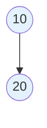
```mermaid
graph TB
    10((10)) --> 20((20))
    
    style 10 fill:#E3F2FD
    style 20 fill:#E3F2FD
```

**检查:** BF(10) = -1，平衡 ✓

#### 步骤3: 插入 30（RR型失衡）

插入后（不平衡）:

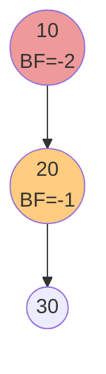
```mermaid
graph TB
    10((10<br/>BF=-2)) --> 20((20<br/>BF=-1))
    20 --> 30((30))
    
    style 10 fill:#EF9A9A
    style 20 fill:#FFCC80
```

**失衡类型:** RR型 → 对 10 执行左旋

左旋后（恢复平衡）:

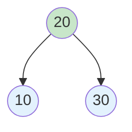
```mermaid
graph TB
    20((20)) --> 10((10))
    20 --> 30((30))
    
    style 20 fill:#C8E6C9
    style 10 fill:#E3F2FD
    style 30 fill:#E3F2FD
```

**检查:** BF(20)=0, BF(10)=0, BF(30)=0，全部平衡 ✓

#### 步骤4: 插入 40

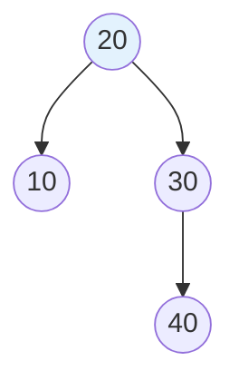
```mermaid
graph TB
    20((20)) --> 10((10))
    20 --> 30((30))
    30 --> 40((40))
    
    style 20 fill:#E3F2FD
```

**检查:** BF(30) = -1, BF(20) = -1，平衡 ✓

#### 步骤5: 插入 50（RR型失衡）

插入后（不平衡）:

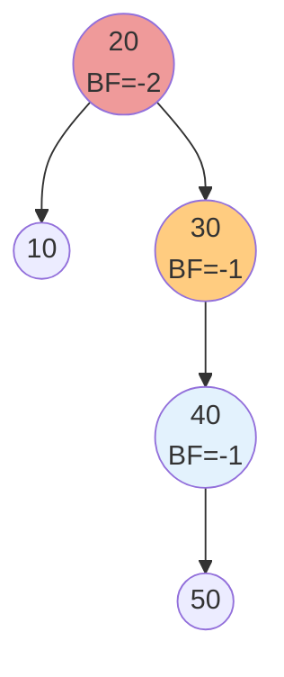
```mermaid
graph TB
    20((20<br/>BF=-2)) --> 10((10))
    20 --> 30((30<br/>BF=-1))
    30 --> 40((40<br/>BF=-1))
    40 --> 50((50))
    
    style 20 fill:#EF9A9A
    style 30 fill:#FFCC80
    style 40 fill:#E3F2FD
```

**失衡类型:** RR型 → 对 30 执行左旋

左旋后（恢复平衡）:

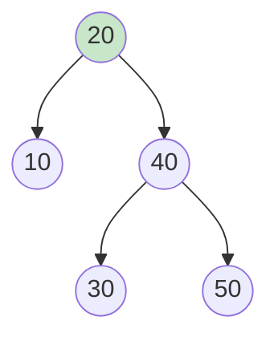
```mermaid
graph TB
    20((20)) --> 10((10))
    20 --> 40((40))
    40 --> 30((30))
    40 --> 50((50))
    
    style 20 fill:#C8E6C9
```

**检查:** 全部平衡 ✓

#### 步骤6: 插入 25（RL型失衡）

插入后（不平衡）:

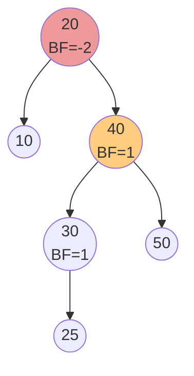
```mermaid
graph TB
    20((20<br/>BF=-2)) --> 10((10))
    20 --> 40((40<br/>BF=1))
    40 --> 30((30<br/>BF=1))
    40 --> 50((50))
    30 --> 25((25))
    
    style 20 fill:#EF9A9A
    style 40 fill:#FFCC80
```

**分析:**
- BF(20) = -2 < -1，右子树过高
- BF(40) = 1 > 0，右子树的左子树更高
- **失衡类型:** RL型

**步骤1:** 对 40 右旋

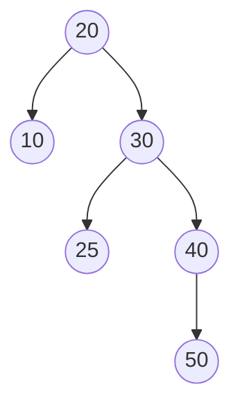
```mermaid
graph TB
    20((20)) --> 10((10))
    20 --> 30((30))
    30 --> 25((25))
    30 --> 40((40))
    40 --> 50((50))
```

**步骤2:** 对 20 左旋

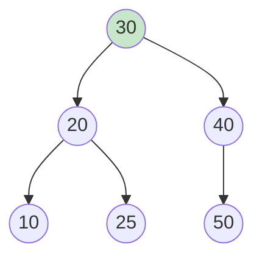
```mermaid
graph TB
    30((30)) --> 20((20))
    30 --> 40((40))
    20 --> 10((10))
    20 --> 25((25))
    40 --> 50((50))
    
    style 30 fill:#C8E6C9
```

**检查:** 全部平衡 ✓

#### 最终 AVL 树

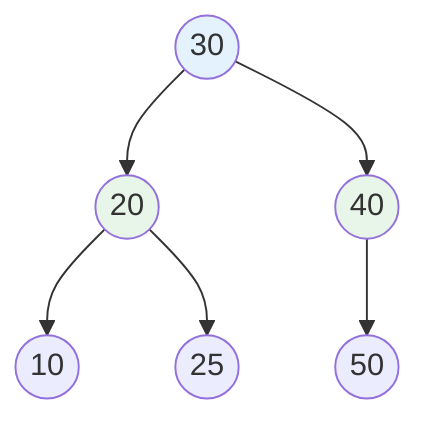
```mermaid
graph TB
    30((30)) --> 20((20))
    30 --> 40((40))
    20 --> 10((10))
    20 --> 25((25))
    40 --> 50((50))
    
    style 30 fill:#E3F2FD
    style 20 fill:#E8F5E9
    style 40 fill:#E8F5E9
```

**中序遍历:** 10 → 20 → 25 → 30 → 40 → 50（有序）

### 旋转操作流程图

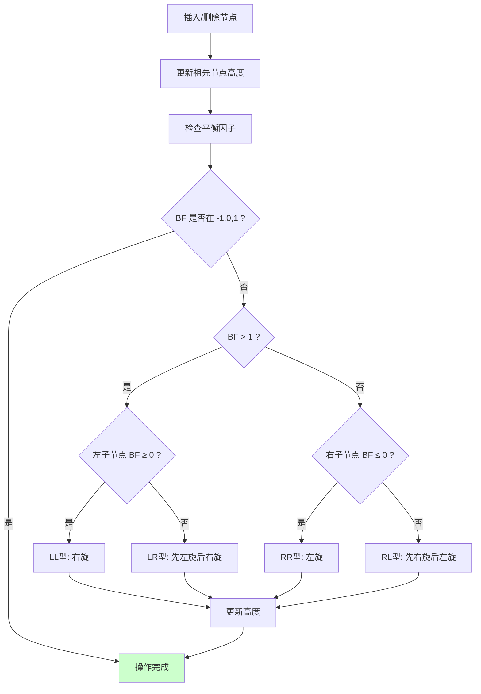
```mermaid
flowchart TB
    A[插入/删除节点] --> B[更新祖先节点高度]
    B --> C[检查平衡因子]
    C --> D{BF 是否在 -1,0,1 ?}
    D -->|是| E[操作完成]
    D -->|否| F{BF > 1 ?}
    
    F -->|是| G{左子节点 BF ≥ 0 ?}
    G -->|是| H[LL型: 右旋]
    G -->|否| I[LR型: 先左旋后右旋]
    
    F -->|否| J{右子节点 BF ≤ 0 ?}
    J -->|是| K[RR型: 左旋]
    J -->|否| L[RL型: 先右旋后左旋]
    
    H --> M[更新高度]
    I --> M
    K --> M
    L --> M
    M --> E
    
    style E fill:#ccffcc
```

## 代码实现

### 节点定义

```c
typedef struct AVLNode {
    int data;                   // 节点值
    int height;                 // 节点高度
    struct AVLNode *left;       // 左子节点
    struct AVLNode *right;      // 右子节点
} AVLNode;

// 获取节点高度
int height(AVLNode *node) {
    if (node == NULL) return 0;
    return node->height;
}

// 取最大值
int max(int a, int b) {
    return a > b ? a : b;
}

// 计算平衡因子
int getBalance(AVLNode *node) {
    if (node == NULL) return 0;
    return height(node->left) - height(node->right);
}

// 创建新节点
AVLNode* createNode(int data) {
    AVLNode *node = (AVLNode*)malloc(sizeof(AVLNode));
    node->data = data;
    node->height = 1;  // 新节点高度为 1
    node->left = NULL;
    node->right = NULL;
    return node;
}

// 更新节点高度
void updateHeight(AVLNode *node) {
    node->height = 1 + max(height(node->left), height(node->right));
}
```

### 右旋操作

```c
// 右旋（用于 LL 型）
AVLNode* rightRotate(AVLNode *y) {
    AVLNode *x = y->left;       // x 成为新的根
    AVLNode *T2 = x->right;     // 保存 x 的右子树
    
    // 执行旋转
    x->right = y;
    y->left = T2;
    
    // 更新高度（先更新 y，再更新 x）
    updateHeight(y);
    updateHeight(x);
    
    return x;  // 返回新的根
}
```

### 左旋操作

```c
// 左旋（用于 RR 型）
AVLNode* leftRotate(AVLNode *x) {
    AVLNode *y = x->right;      // y 成为新的根
    AVLNode *T2 = y->left;      // 保存 y 的左子树
    
    // 执行旋转
    y->left = x;
    x->right = T2;
    
    // 更新高度（先更新 x，再更新 y）
    updateHeight(x);
    updateHeight(y);
    
    return y;  // 返回新的根
}
```

### 平衡调整

```c
// 平衡调整
AVLNode* balance(AVLNode *node) {
    // 先更新当前节点高度
    updateHeight(node);
    
    // 计算平衡因子
    int bf = getBalance(node);
    
    // LL 型: 左子树过高，且左子节点的左子树更高或等高
    if (bf > 1) {
        if (getBalance(node->left) < 0) {
            // LR 型: 先对左子树左旋
            node->left = leftRotate(node->left);
        }
        // 右旋
        return rightRotate(node);
    }
    
    // RR 型: 右子树过高，且右子节点的右子树更高或等高
    if (bf < -1) {
        if (getBalance(node->right) > 0) {
            // RL 型: 先对右子树右旋
            node->right = rightRotate(node->right);
        }
        // 左旋
        return leftRotate(node);
    }
    
    // 已经平衡，直接返回
    return node;
}
```

### 插入操作

```c
AVLNode* insert(AVLNode *node, int data) {
    // 标准 BST 插入
    if (node == NULL) return createNode(data);
    
    if (data < node->data) {
        node->left = insert(node->left, data);
    } else if (data > node->data) {
        node->right = insert(node->right, data);
    } else {
        // 值已存在，不插入
        return node;
    }
    
    // 平衡调整
    return balance(node);
}
```

### 删除操作

```c
// 查找最小值节点
AVLNode* findMin(AVLNode *node) {
    while (node->left != NULL) {
        node = node->left;
    }
    return node;
}

// 删除节点
AVLNode* delete(AVLNode *root, int data) {
    if (root == NULL) return NULL;
    
    // 查找要删除的节点
    if (data < root->data) {
        root->left = delete(root->left, data);
    } else if (data > root->data) {
        root->right = delete(root->right, data);
    } else {
        // 找到要删除的节点
        
        // 情况1和2: 有0或1个子节点
        if (root->left == NULL || root->right == NULL) {
            AVLNode *temp = root->left ? root->left : root->right;
            
            if (temp == NULL) {
                // 叶子节点
                temp = root;
                root = NULL;
            } else {
                // 复制子节点内容
                *root = *temp;
            }
            free(temp);
        } else {
            // 情况3: 有两个子节点
            AVLNode *temp = findMin(root->right);
            root->data = temp->data;
            root->right = delete(root->right, temp->data);
        }
    }
    
    // 如果树为空
    if (root == NULL) return NULL;
    
    // 平衡调整
    return balance(root);
}
```

### 查找操作

```c
AVLNode* search(AVLNode *root, int data) {
    if (root == NULL || root->data == data) {
        return root;
    }
    
    if (data < root->data) {
        return search(root->left, data);
    }
    return search(root->right, data);
}
```

### C++ 模板实现

```cpp
template<typename T>
class AVLTree {
private:
    struct Node {
        T data;
        int height;
        Node *left, *right;
        Node(T val) : data(val), height(1), left(nullptr), right(nullptr) {}
    };
    
    Node *root;
    
    int height(Node *node) { return node ? node->height : 0; }
    
    int balanceFactor(Node *node) {
        return height(node->left) - height(node->right);
    }
    
    void updateHeight(Node *node) {
        node->height = 1 + std::max(height(node->left), height(node->right));
    }
    
    Node* rotateRight(Node *y) {
        Node *x = y->left;
        y->left = x->right;
        x->right = y;
        updateHeight(y);
        updateHeight(x);
        return x;
    }
    
    Node* rotateLeft(Node *x) {
        Node *y = x->right;
        x->right = y->left;
        y->left = x;
        updateHeight(x);
        updateHeight(y);
        return y;
    }
    
    Node* balance(Node *node) {
        updateHeight(node);
        int bf = balanceFactor(node);
        
        if (bf > 1) {
            if (balanceFactor(node->left) < 0)
                node->left = rotateLeft(node->left);
            return rotateRight(node);
        }
        if (bf < -1) {
            if (balanceFactor(node->right) > 0)
                node->right = rotateRight(node->right);
            return rotateLeft(node);
        }
        return node;
    }
    
    Node* insert(Node *node, T data) {
        if (!node) return new Node(data);
        if (data < node->data) node->left = insert(node->left, data);
        else if (data > node->data) node->right = insert(node->right, data);
        else return node;
        return balance(node);
    }
    
public:
    AVLTree() : root(nullptr) {}
    void insert(T data) { root = insert(root, data); }
    
    bool search(T data) {
        Node *curr = root;
        while (curr) {
            if (data == curr->data) return true;
            curr = data < curr->data ? curr->left : curr->right;
        }
        return false;
    }
};
```

## 复杂度分析

### 时间复杂度

| 操作 | 时间复杂度 | 说明 |
|------|-----------|------|
| 查找 | O(log n) | 树高度为 O(log n) |
| 插入 | O(log n) | 查找 O(log n) + 旋转 O(1) |
| 删除 | O(log n) | 查找 O(log n) + 旋转 O(log n) |
| 旋转 | O(1) | 仅修改指针 |

```
详细分析:

查找:
- AVL树高度 h ≤ 1.44 × log₂(n+2)
- 查找路径最多经过 h 个节点
- 时间复杂度: O(log n)

插入:
- 查找插入位置: O(log n)
- 更新高度: O(log n)（最多更新 h 个节点）
- 旋转调整: O(1)（最多 1 次旋转）
- 总时间复杂度: O(log n)

删除:
- 查找删除节点: O(log n)
- 删除操作: O(log n)
- 平衡调整: O(log n)（最多 h 次旋转）
- 总时间复杂度: O(log n)

旋转次数:
- 插入最多 1 次旋转
- 删除最多 O(log n) 次旋转
```

### 空间复杂度

- O(n)：存储 n 个节点
- 每个节点额外存储高度值：O(1)

## AVL树性质

### 高度上界

```
AVL树高度上界:

定理: 包含 n 个节点的 AVL 树高度 h 满足:
      h ≤ 1.44 × log₂(n + 2) - 0.328

证明:
设 n(h) 为高度为 h 的 AVL 树的最少节点数

递推关系:
- n(0) = 1  （高度为 0 的树只有 1 个节点）
- n(1) = 2  （高度为 1 的树最少有 2 个节点）
- n(h) = n(h-1) + n(h-2) + 1

解释: 要使高度为 h 的 AVL 树节点数最少，左右子树高度应相差 1
      一个子树高度为 h-1，另一个为 h-2

这与 Fibonacci 数列类似，因此:
n(h) ≈ Fibonacci(h+2) - 1 ≈ φ^(h+2) / √5

其中 φ = (1+√5)/2 ≈ 1.618

因此:
n ≥ φ^(h+2) / √5 - 1
h ≤ log_φ(n+1) - 2
h ≤ 1.44 × log₂(n+2) - 0.328
```

### 最少节点数

高度为 `h` 的 AVL 树的最少节点数满足递推关系：`n(h) = n(h-1) + n(h-2) + 1`

| 高度 h | 最少节点数 n(h) | 计算过程 |
|--------|-----------------|----------|
| 0 | 1 | 基础情况 |
| 1 | 2 | 基础情况 |
| 2 | 4 | n(1) + n(0) + 1 = 2 + 1 + 1 |
| 3 | 7 | n(2) + n(1) + 1 = 4 + 2 + 1 |
| 4 | 12 | n(3) + n(2) + 1 = 7 + 4 + 1 |
| 5 | 20 | n(4) + n(3) + 1 = 12 + 7 + 1 |

**规律:** `n(h) ≈ Fibonacci(h+2) - 1`

```mermaid
graph TB
    A[n(h)] --> B[n(h-1)]
    A --> C[n(h-2)]
    A --> D[+ 1]
    
    style A fill:#E3F2FD
```

## AVL树验证

```c
// 验证是否为 AVL 树
int isAVL(AVLNode *root) {
    if (root == NULL) return 1;
    
    // 检查平衡因子
    int bf = getBalance(root);
    if (bf < -1 || bf > 1) return 0;
    
    // 递归检查左右子树
    return isAVL(root->left) && isAVL(root->right);
}

// 验证高度是否正确
int verifyHeight(AVLNode *root) {
    if (root == NULL) return 1;
    
    int expectedHeight = 1 + max(height(root->left), height(root->right));
    if (root->height != expectedHeight) return 0;
    
    return verifyHeight(root->left) && verifyHeight(root->right);
}
```

## AVL vs 红黑树

!!! note "AVL树与红黑树对比"

    | 特性 | AVL树 | 红黑树 |
    |------|-------|--------|
    | **平衡程度** | 严格平衡（高度差 ≤ 1） | 近似平衡（黑高差 ≤ 1） |
    | **高度上界** | h ≤ 1.44 × log₂(n) | h ≤ 2 × log₂(n+1) |
    | **查找效率** | 更优（树更矮） | 稍差（树略高） |
    | **插入旋转** | 最多 1 次 | 最多 2 次 |
    | **删除旋转** | 最多 O(log n) 次 | 最多 3 次 |
    | **空间开销** | 存储高度值 | 存储颜色位 |
    | **适用场景** | 查找密集型场景 | 插入删除频繁场景 |

```mermaid
flowchart LR
    subgraph AVL树["AVL树"]
        A1[严格平衡]
        A2[高度: 1.44×log(n)]
        A3[查找更快]
        A4[旋转更多]
    end
    
    subgraph 红黑树["红黑树"]
        B1[近似平衡]
        B2[高度: 2×log(n)]
        B3[查找稍慢]
        B4[旋转较少]
    end
    
    A1 --- B1
    A2 --- B2
    A3 --- B3
    A4 --- B4
    
    style AVL树 fill:#E3F2FD,stroke:#2196F3
    style 红黑树 fill:#FFF3E0,stroke:#FF9800
```

### 应用场景对比

| 场景类型 | AVL树适用 | 红黑树适用 |
|----------|-----------|------------|
| 数据库索引 | 内存索引 | - |
| 编程语言容器 | - | C++ STL map/set, Java TreeMap |
| 内存数据库 | Redis Sorted Set（跳表） | - |
| 编译器符号表 | ✓ | - |
| Linux进程调度 | - | ✓ |

## 应用场景

### 1. 数据库索引

```
数据库内存索引:

场景: 需要频繁查询但修改较少的索引

优势:
- 查找效率高，树高度小
- 支持范围查询
- 支持前缀查询

示例:
CREATE INDEX idx_name ON table(column);
- 小型表的内存索引可用 AVL 实现
- 大型表使用 B+ 树（磁盘优化）
```

### 2. 内存数据库

```
内存数据库索引:

场景: Redis、MemSQL 等内存数据库

应用:
- 有序集合（Sorted Set）
- 范围查询
- 排名查询

Redis 的 Sorted Set:
- 使用跳表实现（类似 AVL 的查找效率）
- 支持 O(log n) 的插入、删除、查找
```

### 3. 编译器符号表

```
编译器符号表实现:

场景: 存储变量、函数、类型等符号信息

操作:
- 插入符号: insert(name, type, scope)
- 查找符号: lookup(name)
- 遍历作用域: traverse(scope)

优势:
- 快速查找符号定义
- 有序遍历符号（按名字排序）
- 支持作用域嵌套
```

### 4. 事件调度

```
定时器管理:

场景: 操作系统或应用程序的定时器

实现:
- 按到期时间组织 AVL 树
- 快速找到最早到期的定时器
- 高效插入和删除定时器

操作:
- insert_timer(expire_time, callback)
- find_next_timer() → 最小值
- cancel_timer(id)
```

### 5. 文件系统

```
文件系统目录索引:

场景: 需要快速查找文件的目录结构

优势:
- 按文件名排序
- 快速查找文件
- 支持范围列出文件

应用:
- 小型文件系统的内存索引
- 目录缓存
```

## 参考资料

- 《算法导论》第12章 - 二叉搜索树
- Adelson-Velsky, G. and Landis, E. M. (1962). "An algorithm for the organization of information"
- [LeetCode 110. 平衡二叉树](https://leetcode.com/problems/balanced-binary-tree/)
- AVL Tree Visualization - cs.usfca.edu
