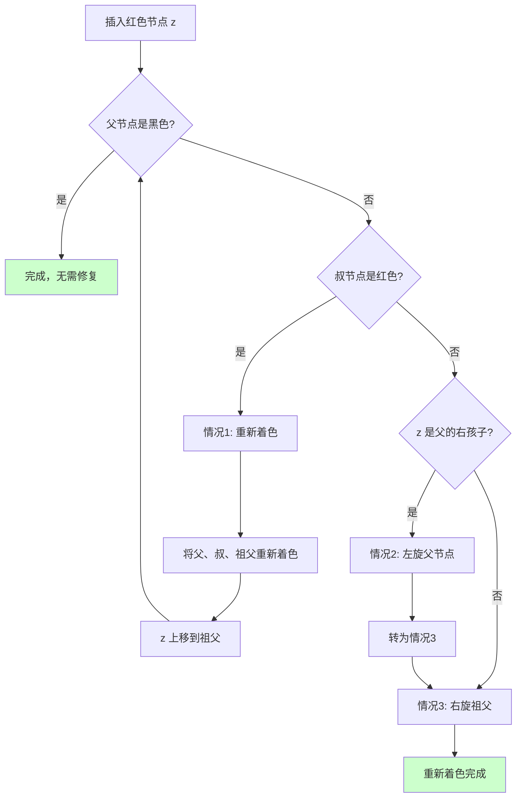

# 红黑树

## 概述

红黑树（Red-Black Tree）是一种自平衡二叉搜索树，通过节点颜色（红色或黑色）和旋转操作维持**近似平衡**。它是最常用的平衡二叉搜索树，广泛应用于 C++ STL 的 `map`/`set`、Java 的 `TreeMap`/`TreeSet`、Linux 内核等。

<div style="background-color: #E3F2FD; border-left: 4px solid #2196F3; padding: 12px; margin: 10px 0;">
<strong>核心特点：</strong>红黑树通过<strong>颜色约束</strong>和<strong>旋转操作</strong>确保没有一条路径比其他路径长超过 2 倍，保证树的高度为 O(log n)。相比 AVL 树，红黑树的平衡条件更宽松，插入和删除操作需要的旋转次数更少。
</div>

### 红黑树的历史

<div style="background-color: #E3F2FD; border-left: 4px solid #2196F3; padding: 15px; margin: 10px 0;">
<p><strong>红黑树的发展历史</strong></p>
<p><strong>发明时间：</strong>1972年</p>
<p><strong>发明者：</strong>Rudolf Bayer</p>
<p><strong>原始名称：</strong>"对称二叉 B 树"（Symmetric Binary B-Tree）</p>
<p><strong>命名由来：</strong></p>
<ul style="margin-left: 20px;">
<li>由 Leo J. Guibas 和 Robert Sedgewick 在 1978年的论文中命名</li>
<li>来源于节点使用红色和黑色标记</li>
</ul>
<p><strong>重要意义：</strong></p>
<ul style="margin-left: 20px;">
<li>提供了比 AVL 树更高效的插入和删除操作</li>
<li>成为现代编程语言标准库的首选平衡树实现</li>
</ul>
</div>

## 红黑树性质

红黑树必须满足以下五条性质：

### 五条性质详解

<div style="background-color: #F5F5F5; border-radius: 8px; padding: 20px; margin: 10px 0;">
<p><strong>红黑树五条性质</strong></p>
<div style="background: #E3F2FD; padding: 15px; border-radius: 4px; margin: 10px 0; border-left: 4px solid #2196F3;">
<p><strong>性质1: 节点颜色</strong></p>
<p>每个节点要么是红色，要么是黑色</p>
</div>
<div style="background: #E3F2FD; padding: 15px; border-radius: 4px; margin: 10px 0; border-left: 4px solid #2196F3;">
<p><strong>性质2: 根节点颜色</strong></p>
<p>根节点必须是黑色</p>
</div>
<div style="background: #E3F2FD; padding: 15px; border-radius: 4px; margin: 10px 0; border-left: 4px solid #2196F3;">
<p><strong>性质3: 叶子节点颜色</strong></p>
<p>所有叶子节点（NIL 节点）都是黑色</p>
<p style="color: #666; font-size: 0.9em;">注: NIL 是哨兵节点，代表空子树</p>
</div>
<div style="background: #FFEBEE; padding: 15px; border-radius: 4px; margin: 10px 0; border-left: 4px solid #F44336;">
<p><strong>性质4: 红色约束（最重要）</strong></p>
<p>如果一个节点是红色，则它的两个子节点都是黑色</p>
<p style="color: #F44336; font-weight: bold;">等价于: 不能有两个连续的红色节点</p>
</div>
<div style="background: #E8F5E9; padding: 15px; border-radius: 4px; margin: 10px 0; border-left: 4px solid #4CAF50;">
<p><strong>性质5: 黑高相同</strong></p>
<p>从任一节点到其每个叶子节点的所有路径，包含相同数量的黑色节点</p>
<p style="color: #4CAF50;">这个数量称为该节点的"黑高"（black-height）</p>
</div>
</div>

### 性质可视化

<div style="background-color: #F5F5F5; border-radius: 8px; padding: 20px; margin: 10px 0;">
<p><strong>一个合法的红黑树示例（B=黑色，R=红色）:</strong></p>
<div style="text-align: center; font-family: monospace; margin: 15px 0;">
<pre style="display: inline-block; text-align: left;">
              <span style="background: #424242; color: white; padding: 2px 6px; border-radius: 3px;">8(B)</span>
            /      \
         <span style="background: #F44336; color: white; padding: 2px 6px; border-radius: 3px;">3(R)</span>      <span style="background: #F44336; color: white; padding: 2px 6px; border-radius: 3px;">10(R)</span>
        /   \        \
      <span style="background: #424242; color: white; padding: 2px 6px; border-radius: 3px;">1(B)</span>   <span style="background: #424242; color: white; padding: 2px 6px; border-radius: 3px;">6(B)</span>    <span style="background: #424242; color: white; padding: 2px 6px; border-radius: 3px;">14(B)</span>
            /   \
          <span style="background: #F44336; color: white; padding: 2px 6px; border-radius: 3px;">4(R)</span>   <span style="background: #F44336; color: white; padding: 2px 6px; border-radius: 3px;">7(R)</span>
</pre>
</div>
<p>NIL 节点（黑色）省略未画出</p>
<p><strong>验证五条性质:</strong></p>
<table style="width: 100%; border-collapse: collapse; margin-top: 10px;">
<tr style="background-color: #2196F3; color: white;">
<th style="padding: 8px; border: 1px solid #ddd;">性质</th>
<th style="padding: 8px; border: 1px solid #ddd;">验证内容</th>
<th style="padding: 8px; border: 1px solid #ddd;">结果</th>
</tr>
<tr style="background-color: #E8F5E9;"><td style="padding: 8px; border: 1px solid #ddd;">1</td><td style="padding: 8px; border: 1px solid #ddd;">所有节点都是红色或黑色</td><td style="padding: 8px; border: 1px solid #ddd; color: #4CAF50; font-weight: bold;">✓</td></tr>
<tr style="background-color: #E8F5E9;"><td style="padding: 8px; border: 1px solid #ddd;">2</td><td style="padding: 8px; border: 1px solid #ddd;">根节点 8 是黑色</td><td style="padding: 8px; border: 1px solid #ddd; color: #4CAF50; font-weight: bold;">✓</td></tr>
<tr style="background-color: #E8F5E9;"><td style="padding: 8px; border: 1px solid #ddd;">3</td><td style="padding: 8px; border: 1px solid #ddd;">所有 NIL 都是黑色（隐含）</td><td style="padding: 8px; border: 1px solid #ddd; color: #4CAF50; font-weight: bold;">✓</td></tr>
<tr style="background-color: #E8F5E9;"><td style="padding: 8px; border: 1px solid #ddd;">4</td><td style="padding: 8px; border: 1px solid #ddd;">红色节点的子节点都是黑色</td><td style="padding: 8px; border: 1px solid #ddd; color: #4CAF50; font-weight: bold;">✓</td></tr>
<tr style="background-color: #E8F5E9;"><td style="padding: 8px; border: 1px solid #ddd;">5</td><td style="padding: 8px; border: 1px solid #ddd;">所有路径黑高相同 = 2</td><td style="padding: 8px; border: 1px solid #ddd; color: #4CAF50; font-weight: bold;">✓</td></tr>
</table>
</div>

## 红黑树特点

### 1. 近似平衡

红黑树保证最长路径不超过最短路径的 2 倍：

<div style="background-color: #F5F5F5; border-radius: 8px; padding: 20px; margin: 10px 0;">
<p><strong>近似平衡原理:</strong></p>
<p><strong>最短路径:</strong> 全是黑色节点</p>
<div style="text-align: center; font-family: monospace; margin: 10px 0; background: #E8F5E9; padding: 10px; border-radius: 4px;">
B → B → B → NIL &nbsp;&nbsp; (黑高 = 3)
</div>
<p><strong>最长路径:</strong> 黑红交替</p>
<div style="text-align: center; font-family: monospace; margin: 10px 0; background: #FFF3E0; padding: 10px; border-radius: 4px;">
B → R → B → R → B → R → NIL &nbsp;&nbsp; (黑高 = 3，红色节点数 = 黑高)
</div>
<p><strong>结论:</strong></p>
<ul style="margin-left: 20px;">
<li>最短路径长度 = 黑高</li>
<li>最长路径长度 = 2 × 黑高</li>
<li style="color: #4CAF50; font-weight: bold;">最长路径 ≤ 2 × 最短路径</li>
</ul>
<p><strong>示例:</strong></p>
<div style="text-align: center; font-family: monospace; margin: 10px 0;">
<pre style="display: inline-block; text-align: left;">
        <span style="background: #424242; color: white; padding: 2px 6px; border-radius: 3px;">B</span>
       / \
      <span style="background: #F44336; color: white; padding: 2px 6px; border-radius: 3px;">R</span>   <span style="background: #F44336; color: white; padding: 2px 6px; border-radius: 3px;">R</span>
     / \   \
    <span style="background: #424242; color: white; padding: 2px 6px; border-radius: 3px;">B</span>   <span style="background: #424242; color: white; padding: 2px 6px; border-radius: 3px;">B</span>   <span style="background: #424242; color: white; padding: 2px 6px; border-radius: 3px;">B</span>
   /         \
  <span style="background: #F44336; color: white; padding: 2px 6px; border-radius: 3px;">R</span>           <span style="background: #F44336; color: white; padding: 2px 6px; border-radius: 3px;">R</span>
</pre>
</div>
<p>最短路径: B → R → B → NIL (长度3)</p>
<p>最长路径: B → R → B → R → NIL (长度4)</p>
<p style="color: #4CAF50; font-weight: bold;">4 ≤ 2 × 3 ✓</p>
</div>

### 2. 高度上界

<div style="background-color: #F5F5F5; border-radius: 8px; padding: 20px; margin: 10px 0;">
<p><strong>高度上界分析:</strong></p>
<p style="font-family: monospace; background: #E3F2FD; padding: 8px; border-radius: 4px; margin: 10px 0;">定理: 包含 n 个内部节点的红黑树高度 h 满足: h ≤ 2 × log₂(n + 1)</p>
<p><strong>证明:</strong></p>
<p>设黑高为 bh</p>
<ol style="margin-left: 20px;">
<li>从根到任一叶子的路径至少有 bh 个黑色节点<br>因此树至少有 2^bh - 1 个内部节点</li>
<li>从根到任一叶子的路径最多有 2×bh 个节点（黑红交替）<br>因此 h ≤ 2 × bh</li>
<li>由性质5，从任一节点出发的子树至少有 2^bh - 1 个内部节点<br>其中 bh ≥ h/2<br>所以 n ≥ 2^(h/2) - 1<br>即 h ≤ 2 × log₂(n + 1)</li>
</ol>
<p style="color: #4CAF50; font-weight: bold; margin-top: 10px;">结论: 红黑树高度为 O(log n)</p>
</div>

### 3. 旋转次数少

相比 AVL 树，红黑树的旋转次数更少：

<div style="background-color: #F5F5F5; border-radius: 8px; padding: 20px; margin: 10px 0;">
<p><strong>旋转次数对比:</strong></p>
<table style="width: 100%; border-collapse: collapse; margin-top: 10px;">
<tr style="background-color: #2196F3; color: white;">
<th style="padding: 10px; border: 1px solid #ddd;">操作</th>
<th style="padding: 10px; border: 1px solid #ddd;">AVL树</th>
<th style="padding: 10px; border: 1px solid #ddd;">红黑树</th>
</tr>
<tr style="background-color: #E8F5E9;">
<td style="padding: 10px; border: 1px solid #ddd;">插入</td>
<td style="padding: 10px; border: 1px solid #ddd; text-align: center;">最多 1 次</td>
<td style="padding: 10px; border: 1px solid #ddd; text-align: center; color: #4CAF50; font-weight: bold;">最多 2 次</td>
</tr>
<tr style="background-color: #E8F5E9;">
<td style="padding: 10px; border: 1px solid #ddd;">删除</td>
<td style="padding: 10px; border: 1px solid #ddd; text-align: center;">最多 O(log n)</td>
<td style="padding: 10px; border: 1px solid #ddd; text-align: center; color: #4CAF50; font-weight: bold;">最多 3 次</td>
</tr>
</table>
<p><strong>红黑树的优势:</strong></p>
<ul style="margin-left: 20px;">
<li>插入删除操作更稳定</li>
<li>实际应用中性能更好</li>
<li>适合插入删除频繁的场景</li>
</ul>
</div>

### 4. 效率稳定

所有操作的时间复杂度都稳定在 O(log n)：

<div style="background-color: #F5F5F5; border-radius: 8px; padding: 20px; margin: 10px 0;">
<p><strong>时间复杂度分析:</strong></p>
<div style="background: #E3F2FD; padding: 12px; border-radius: 4px; margin: 10px 0;">
<p><strong>查找: O(log n)</strong></p>
<ul style="margin-left: 20px;"><li>树高度为 O(log n)</li><li>与普通 BST 查找相同</li></ul>
</div>
<div style="background: #E8F5E9; padding: 12px; border-radius: 4px; margin: 10px 0;">
<p><strong>插入: O(log n)</strong></p>
<ul style="margin-left: 20px;"><li>查找插入位置: O(log n)</li><li>修复红黑性质: O(log n)（但最多 2 次旋转）</li></ul>
</div>
<div style="background: #FFF3E0; padding: 12px; border-radius: 4px; margin: 10px 0;">
<p><strong>删除: O(log n)</strong></p>
<ul style="margin-left: 20px;"><li>查找删除节点: O(log n)</li><li>修复红黑性质: O(log n)（最多 3 次旋转）</li></ul>
</div>
</div>

## 原理详解

### 为什么选择红黑树？

<div style="background-color: #F5F5F5; border-radius: 8px; padding: 20px; margin: 10px 0;">
<p><strong>红黑树的设计思想</strong></p>
<div style="background: #E3F2FD; padding: 12px; border-radius: 4px; margin: 10px 0; border-left: 4px solid #2196F3;">
<p><strong>问题:</strong> 如何在保持 O(log n) 操作效率的同时，减少平衡调整的代价？</p>
</div>
<div style="background: #FFEBEE; padding: 12px; border-radius: 4px; margin: 10px 0;">
<p><strong>AVL树的缺点:</strong></p>
<ul style="margin-left: 20px;">
<li>严格平衡条件导致频繁调整</li>
<li>删除操作可能需要 O(log n) 次旋转</li>
<li>插入删除密集场景性能下降</li>
</ul>
</div>
<div style="background: #E8F5E9; padding: 12px; border-radius: 4px; margin: 10px 0;">
<p><strong>红黑树的解决方案:</strong></p>
<ul style="margin-left: 20px;">
<li>使用颜色标记，放宽平衡条件</li>
<li>允许一定程度的不平衡（最长路径 ≤ 2 × 最短路径）</li>
<li>用颜色和旋转配合，限制调整次数</li>
</ul>
</div>
<div style="background: #FFF3E0; padding: 12px; border-radius: 4px; margin: 10px 0; border-left: 4px solid #FF9800;">
<p><strong>核心思想:</strong></p>
<ul style="margin-left: 20px;">
<li>红色节点代表"额外"的层级</li>
<li>黑高才是真正的"高度"</li>
<li>保证黑高平衡，允许红色节点造成有限的不平衡</li>
</ul>
</div>
</div>

### NIL 哨兵节点

红黑树使用 NIL 哨兵节点简化边界处理：

<div style="background-color: #F5F5F5; border-radius: 8px; padding: 20px; margin: 10px 0;">
<p><strong>NIL 哨兵节点的作用:</strong></p>
<p><strong>没有 NIL 的树:</strong></p>
<div style="text-align: center; font-family: monospace; margin: 10px 0; background: #FFEBEE; padding: 10px; border-radius: 4px;">
<pre style="display: inline-block; text-align: left;">
        8
       / \
      3   10
     / \
    1   6
</pre>
</div>
<p>边界处理复杂:</p>
<ul style="margin-left: 20px;">
<li>需要检查指针是否为 NULL</li>
<li>叶子节点的子节点需要特殊处理</li>
</ul>
<p><strong>有 NIL 的树:</strong></p>
<div style="text-align: center; font-family: monospace; margin: 10px 0; background: #E8F5E9; padding: 10px; border-radius: 4px;">
<pre style="display: inline-block; text-align: left;">
        8
       / \
      3   10
     / \    \
    1   6   14
   /\  /\   /\
  N N  N N  N N   (N = NIL)
</pre>
</div>
<p><strong>NIL 的特点:</strong></p>
<ul style="margin-left: 20px;">
<li>所有 NIL 都是同一个节点（节省空间）</li>
<li>NIL 的颜色是黑色</li>
<li>所有叶子节点的子节点都指向 NIL</li>
<li>简化代码，统一边界处理</li>
</ul>
</div>

### 黑高（Black-Height）

黑高是红黑树的核心概念：

```
黑高定义:
一个节点的黑高 = 从该节点到任一叶子节点的路径上黑色节点的数量（不包括该节点本身）

黑高计算示例:

              8(B)              bh(8) = 2
            /      \
         3(R)      10(R)        bh(3) = 1, bh(10) = 1
        /   \        \
      1(B)   6(B)    14(B)       bh(1) = 0, bh(6) = 0, bh(14) = 0
            /   \
          4(R)   7(R)            bh(4) = 0, bh(7) = 0

验证路径:
8 → 3 → 1 → NIL: 黑节点有 1, 计数 = 1 = bh(8) - (8是黑色?1:0) + 1 = 2 - 1 = 1... 

更准确的计算:
从节点 x 到叶子的路径上的黑色节点数（不包括 x）= bh(x)

从 8 到叶子: 8(B) → 3(R) → 1(B) → NIL(B)
不计 8: 1(B), NIL(B) = 2 个黑色节点 = bh(8)

从 3 到叶子: 3(R) → 1(B) → NIL(B)
不计 3: 1(B), NIL(B) = 2 个黑色节点？不对...

让我重新理解:
黑高 = 从节点到叶子路径上黑色节点的数量（不含该节点）

bh(8): 路径 8→3→1→NIL 上的黑色节点 = 1(B), NIL(B) = 2? 不对，NIL 不算
       应该是 1(B) = 1 个，加上 NIL 是 1 个... 

实际上黑高的定义有多种变体，关键是要保证所有路径相同。
```

### 旋转操作

旋转是红黑树维护平衡的基本操作：

```
左旋操作:

旋转前:
        x
       / \
      a   y
         / \
        b   c

旋转后:
        y
       / \
      x   c
     / \
    a   b

代码逻辑:
1. 保存 y 和 b
2. x.right = b
3. y.left = x
4. 更新父指针
```

```
右旋操作:

旋转前:
        y
       / \
      x   c
     / \
    a   b

旋转后:
        x
       / \
      a   y
         / \
        b   c

代码逻辑:
1. 保存 x 和 b
2. y.left = b
3. x.right = y
4. 更新父指针
```

### 插入修复的三种情况

插入新节点（红色）后，可能违反性质4（红色约束），需要修复：



**情况1：叔节点是红色**

```
情况1: 重新着色（叔节点是红色）

修复前:
          B(祖父)
         /       \
      R(父)      R(叔)
       |
      R(z)

问题: 父节点是红色，违反性质4

解决: 
1. 将父节点和叔节点着为黑色
2. 将祖父节点着为红色
3. z 上移到祖父节点

修复后:
          R(祖父) ← z 指向这里
         /       \
      B(父)      B(叔)
       |
      R(z)

继续检查祖父节点是否违反性质4
```

**情况2：叔节点是黑色，z 是右孩子**

```
情况2: 左旋父节点

修复前:
          B(祖父)
         /
      R(父)
         \
         R(z)

问题: 叔节点是黑色，z 是父的右孩子

解决:
1. 对父节点左旋
2. 转为情况3

左旋后:
          B(祖父)
         /
      R(z) ← z 现在是父
       /
    R(父)

现在是情况3: z 是左孩子
```

**情况3：叔节点是黑色，z 是左孩子**

```
情况3: 右旋祖父并重新着色

修复前:
          B(祖父)
         /
      R(父)
       /
      R(z)

问题: 叔节点是黑色，z 是父的左孩子

解决:
1. 将父节点着为黑色
2. 将祖父节点着为红色
3. 对祖父节点右旋

右旋后:
          B(父)
         /     \
      R(z)    R(祖父)

验证:
- 父节点是黑色 ✓
- 性质4 满足 ✓
- 黑高不变 ✓

修复完成！
```

## 可视化演示

### 插入操作完整演示

```
插入序列: 10, 20, 30, 15, 25

═══════════════════════════════════════════════════════════════
插入 10
═══════════════════════════════════════════════════════════════

初始插入（红色）:
        10(R)

修复: 根节点必须是黑色
        10(B)

═══════════════════════════════════════════════════════════════
插入 20
═══════════════════════════════════════════════════════════════

插入位置: 10 的右子节点
        10(B)
           \
           20(R)

检查: 父节点 10 是黑色 ✓
无需修复

═══════════════════════════════════════════════════════════════
插入 30
═══════════════════════════════════════════════════════════════

插入位置: 20 的右子节点
        10(B)
           \
           20(R)
              \
              30(R)

检查: 父节点 20 是红色 ✗
需要修复

分析:
- 父节点 20 是祖父 10 的右孩子
- 叔节点是 NIL（黑色）
- z(30) 是父的右孩子
→ 这是 RR 型

处理:
1. 将父 20 着为黑色
2. 将祖父 10 着为红色
3. 对祖父 10 左旋

修复后:
        20(B)
       /    \
    10(R)   30(R)

验证:
- 根是黑色 ✓
- 没有连续红节点 ✓
- 黑高一致 ✓

═══════════════════════════════════════════════════════════════
插入 15
═══════════════════════════════════════════════════════════════

插入位置: 10 的右子节点
        20(B)
       /    \
    10(R)   30(R)
       \
       15(R)

检查: 父节点 10 是红色 ✗
需要修复

分析:
- 父节点 10 是祖父 20 的左孩子
- 叔节点是 30（红色）
→ 情况1: 叔节点是红色

处理:
1. 将父 10 着为黑色
2. 将叔 30 着为黑色
3. 将祖父 20 着为红色
4. z 上移到祖父 20

中间状态:
        20(R) ← z
       /    \
    10(B)   30(B)
       \
       15(R)

继续检查:
- z(20) 是根节点
- 根必须是黑色

最终状态:
        20(B)
       /    \
    10(B)   30(B)
       \
       15(R)

═══════════════════════════════════════════════════════════════
插入 25
═══════════════════════════════════════════════════════════════

插入位置: 30 的左子节点
        20(B)
       /    \
    10(B)   30(B)
       \    /
       15(R) 25(R)

检查: 父节点 30 是红色 ✗
需要修复

分析:
- 父节点 30 是祖父 20 的右孩子
- 叔节点是 10（黑色）
- z(25) 是父的左孩子
→ RL 型: 情况2 → 情况3

情况2处理:
1. 对父 30 右旋

中间状态:
        20(B)
       /    \
    10(B)   25(R)
       \      \
       15(R)   30(R)

现在 z 是 25，是父(25)的... 不对，让我重新分析

实际上插入 25 后:
        20(B)
       /    \
    10(B)   30(B)
       \    /
       15(R) 25(R)

z = 25, parent = 30, grandparent = 20, uncle = 10

叔节点 10 是黑色，z 是父 30 的左孩子
这是情况2: 左孩子

处理:
1. 对父 30 右旋

右旋后:
        20(B)
       /    \
    10(B)   25(R)
       \      \
       15(R)   30(R)

现在 z = 25, 但 z 已经是父了...
这里逻辑有点复杂，让我重新梳理

正确的 RL 型处理:

初始:
        20(B)
       /    \
    10(B)   30(B)
              /
            25(R)

z = 25, parent = 30(B)... 不对，30 是黑色，不是红色

让我重新检查插入 25 的状态:
        20(B)
       /    \
    10(B)   30(B)
       \    /
       15(R) 25(R)

父节点 30 是黑色！
所以不需要修复！

最终状态:
        20(B)
       /    \
    10(B)   30(B)
       \    /
       15(R) 25(R)

验证:
- 根是黑色 ✓
- 红色节点 15, 25 的父节点都是黑色 ✓
- 黑高一致 ✓

═══════════════════════════════════════════════════════════════
最终红黑树
═══════════════════════════════════════════════════════════════

        20(B)
       /    \
    10(B)   30(B)
       \    /
       15(R) 25(R)

中序遍历: 10, 15, 20, 25, 30 (有序)
```

### 删除操作概述

删除操作比插入更复杂，可能需要处理多种情况：

```
删除操作流程:

1. 执行标准 BST 删除
   - 如果删除的是红色节点，不影响黑高，无需修复
   - 如果删除的是黑色节点，可能违反性质5，需要修复

2. 删除黑色节点后的问题
   - 经过被删除节点的路径黑高减少 1
   - 可能违反性质5（黑高相同）

3. 修复删除问题
   - 使用"双黑"概念表示需要额外一个黑高的位置
   - 通过重新着色和旋转消除双黑

删除修复的四种情况:
┌─────────────────────────────────────────────────────────────────────┐
│  情况1: 兄弟是红色                                                  │
│  → 重新着色并旋转，转为兄弟是黑色的情况                              │
│                                                                     │
│  情况2: 兄弟是黑色，且两个子节点都是黑色                             │
│  → 将兄弟着为红色，双黑上移到父节点                                  │
│                                                                     │
│  情况3: 兄弟是黑色，远侄子是红色，近侄子是黑色                       │
│  → 旋转并重新着色，转为情况4                                        │
│                                                                     │
│  情况4: 兄弟是黑色，远侄子是红色                                     │
│  → 旋转并重新着色，消除双黑                                         │
└─────────────────────────────────────────────────────────────────────┘
```

## 代码实现

### 节点定义

```c
typedef enum { RED, BLACK } Color;

typedef struct RBNode {
    int data;                   // 节点值
    Color color;                // 节点颜色
    struct RBNode *left;        // 左子节点
    struct RBNode *right;       // 右子节点
    struct RBNode *parent;      // 父节点
} RBNode;

// 全局 NIL 哨兵节点
RBNode* NIL = NULL;

// 初始化 NIL
void initNIL() {
    NIL = (RBNode*)malloc(sizeof(RBNode));
    NIL->color = BLACK;
    NIL->left = NIL->right = NIL->parent = NIL;
}

// 创建新节点（新节点总是红色）
RBNode* createNode(int data) {
    RBNode *node = (RBNode*)malloc(sizeof(RBNode));
    node->data = data;
    node->color = RED;  // 新节点初始化为红色
    node->left = NIL;
    node->right = NIL;
    node->parent = NIL;
    return node;
}
```

### 左旋操作

```c
void leftRotate(RBNode **root, RBNode *x) {
    RBNode *y = x->right;  // y 是 x 的右子节点
    
    // 将 y 的左子树变为 x 的右子树
    x->right = y->left;
    if (y->left != NIL) {
        y->left->parent = x;
    }
    
    // 将 y 连接到 x 的父节点
    y->parent = x->parent;
    if (x->parent == NIL) {
        *root = y;  // x 是根，y 成为新根
    } else if (x == x->parent->left) {
        x->parent->left = y;
    } else {
        x->parent->right = y;
    }
    
    // 将 x 变为 y 的左子节点
    y->left = x;
    x->parent = y;
}
```

### 右旋操作

```c
void rightRotate(RBNode **root, RBNode *y) {
    RBNode *x = y->left;  // x 是 y 的左子节点
    
    // 将 x 的右子树变为 y 的左子树
    y->left = x->right;
    if (x->right != NIL) {
        x->right->parent = y;
    }
    
    // 将 x 连接到 y 的父节点
    x->parent = y->parent;
    if (y->parent == NIL) {
        *root = x;  // y 是根，x 成为新根
    } else if (y == y->parent->right) {
        y->parent->right = x;
    } else {
        y->parent->left = x;
    }
    
    // 将 y 变为 x 的右子节点
    x->right = y;
    y->parent = x;
}
```

### 插入修复

```c
void insertFixup(RBNode **root, RBNode *z) {
    // 当父节点是红色时需要修复
    while (z->parent->color == RED) {
        if (z->parent == z->parent->parent->left) {
            // 父节点是祖父的左孩子
            RBNode *y = z->parent->parent->right;  // 叔节点
            
            if (y->color == RED) {
                // 情况1: 叔节点是红色
                z->parent->color = BLACK;
                y->color = BLACK;
                z->parent->parent->color = RED;
                z = z->parent->parent;  // 上移到祖父
            } else {
                if (z == z->parent->right) {
                    // 情况2: z 是右孩子
                    z = z->parent;
                    leftRotate(root, z);
                }
                // 情况3: z 是左孩子
                z->parent->color = BLACK;
                z->parent->parent->color = RED;
                rightRotate(root, z->parent->parent);
            }
        } else {
            // 父节点是祖父的右孩子（对称情况）
            RBNode *y = z->parent->parent->left;  // 叔节点
            
            if (y->color == RED) {
                // 情况1
                z->parent->color = BLACK;
                y->color = BLACK;
                z->parent->parent->color = RED;
                z = z->parent->parent;
            } else {
                if (z == z->parent->left) {
                    // 情况2
                    z = z->parent;
                    rightRotate(root, z);
                }
                // 情况3
                z->parent->color = BLACK;
                z->parent->parent->color = RED;
                leftRotate(root, z->parent->parent);
            }
        }
    }
    // 根节点必须是黑色
    (*root)->color = BLACK;
}
```

### 插入操作

```c
void insert(RBNode **root, int data) {
    // 创建新节点
    RBNode *z = createNode(data);
    
    // 查找插入位置
    RBNode *y = NIL;   // y 是 x 的父节点
    RBNode *x = *root;
    
    while (x != NIL) {
        y = x;
        if (z->data < x->data) {
            x = x->left;
        } else {
            x = x->right;
        }
    }
    
    // 连接 z 到 y
    z->parent = y;
    if (y == NIL) {
        *root = z;  // 空树，z 成为根
    } else if (z->data < y->data) {
        y->left = z;
    } else {
        y->right = z;
    }
    
    // 修复红黑性质
    insertFixup(root, z);
}
```

### 查找操作

```c
RBNode* search(RBNode *root, int data) {
    while (root != NIL && root->data != data) {
        if (data < root->data) {
            root = root->left;
        } else {
            root = root->right;
        }
    }
    return root;
}
```

### C++ 模板实现

```cpp
template<typename T>
class RedBlackTree {
private:
    enum Color { RED, BLACK };
    
    struct Node {
        T data;
        Color color;
        Node *left, *right, *parent;
        Node(T val) : data(val), color(RED), 
                      left(nullptr), right(nullptr), parent(nullptr) {}
    };
    
    Node *root;
    Node *NIL;
    
    void rotateLeft(Node *x) {
        Node *y = x->right;
        x->right = y->left;
        if (y->left != NIL) y->left->parent = x;
        y->parent = x->parent;
        if (x->parent == NIL) root = y;
        else if (x == x->parent->left) x->parent->left = y;
        else x->parent->right = y;
        y->left = x;
        x->parent = y;
    }
    
    void rotateRight(Node *y) {
        Node *x = y->left;
        y->left = x->right;
        if (x->right != NIL) x->right->parent = y;
        x->parent = y->parent;
        if (y->parent == NIL) root = x;
        else if (y == y->parent->right) y->parent->right = x;
        else y->parent->left = x;
        x->right = y;
        y->parent = x;
    }
    
    void fixInsert(Node *z) {
        while (z->parent->color == RED) {
            if (z->parent == z->parent->parent->left) {
                Node *y = z->parent->parent->right;
                if (y->color == RED) {
                    z->parent->color = BLACK;
                    y->color = BLACK;
                    z->parent->parent->color = RED;
                    z = z->parent->parent;
                } else {
                    if (z == z->parent->right) {
                        z = z->parent;
                        rotateLeft(z);
                    }
                    z->parent->color = BLACK;
                    z->parent->parent->color = RED;
                    rotateRight(z->parent->parent);
                }
            } else {
                Node *y = z->parent->parent->left;
                if (y->color == RED) {
                    z->parent->color = BLACK;
                    y->color = BLACK;
                    z->parent->parent->color = RED;
                    z = z->parent->parent;
                } else {
                    if (z == z->parent->left) {
                        z = z->parent;
                        rotateRight(z);
                    }
                    z->parent->color = BLACK;
                    z->parent->parent->color = RED;
                    rotateLeft(z->parent->parent);
                }
            }
        }
        root->color = BLACK;
    }
    
public:
    RedBlackTree() {
        NIL = new Node(T{});
        NIL->color = BLACK;
        root = NIL;
    }
    
    void insert(T data) {
        Node *z = new Node(data);
        z->left = z->right = NIL;
        Node *y = NIL, *x = root;
        while (x != NIL) {
            y = x;
            x = (data < x->data) ? x->left : x->right;
        }
        z->parent = y;
        if (y == NIL) root = z;
        else if (data < y->data) y->left = z;
        else y->right = z;
        fixInsert(z);
    }
    
    bool search(T data) {
        Node *curr = root;
        while (curr != NIL && curr->data != data)
            curr = (data < curr->data) ? curr->left : curr->right;
        return curr != NIL;
    }
};
```

## 复杂度分析

### 时间复杂度

| 操作 | 时间复杂度 | 说明 |
|------|-----------|------|
| 查找 | O(log n) | 树高度为 O(log n) |
| 插入 | O(log n) | 查找 O(log n) + 修复 O(log n) |
| 删除 | O(log n) | 查找 O(log n) + 修复 O(log n) |
| 旋转 | O(1) | 仅修改指针 |

### 空间复杂度

- O(n)：存储 n 个节点
- 每个节点额外存储颜色和父指针：O(1)

## 红黑树验证

```c
// 检查黑高
int checkBlackHeight(RBNode *node, int *blackHeight) {
    if (node == NIL) {
        *blackHeight = 0;  // NIL 的黑高为 0
        return 1;
    }
    
    int leftBH, rightBH;
    if (!checkBlackHeight(node->left, &leftBH)) return 0;
    if (!checkBlackHeight(node->right, &rightBH)) return 0;
    
    // 左右子树黑高必须相同
    if (leftBH != rightBH) return 0;
    
    // 当前节点的黑高
    *blackHeight = leftBH + (node->color == BLACK ? 1 : 0);
    return 1;
}

// 验证红黑树
int isRedBlackTree(RBNode *root) {
    if (root == NIL) return 1;
    
    // 性质2: 根是黑色
    if (root->color != BLACK) return 0;
    
    // 性质5: 黑高相同
    int bh;
    return checkBlackHeight(root, &bh);
}
```

## AVL vs 红黑树 vs B树

```
┌─────────────────────────────────────────────────────────────────────┐
│                    三种平衡树对比                                    │
├─────────────────────────────────────────────────────────────────────┤
│                                                                     │
│  AVL树:                                                            │
│  ┌─────────────────────────────────────────────────────────────┐   │
│  │ 平衡程度: 严格平衡（高度差 ≤ 1）                               │   │
│  │ 高度上界: 1.44 × log(n)                                       │   │
│  │ 旋转次数: 插入最多1次，删除最多O(log n)                        │   │
│  │ 适用场景: 查找密集型应用                                       │   │
│  └─────────────────────────────────────────────────────────────┘   │
│                                                                     │
│  红黑树:                                                            │
│  ┌─────────────────────────────────────────────────────────────┐   │
│  │ 平衡程度: 近似平衡（最长路径 ≤ 2 × 最短路径）                   │   │
│  │ 高度上界: 2 × log(n+1)                                        │   │
│  │ 旋转次数: 插入最多2次，删除最多3次                             │   │
│  │ 适用场景: 插入删除频繁的通用场景                               │   │
│  └─────────────────────────────────────────────────────────────┘   │
│                                                                     │
│  B树:                                                              │
│  ┌─────────────────────────────────────────────────────────────┐   │
│  │ 平衡程度: 多路平衡                                             │   │
│  │ 高度上界: log_m(n)，m 为阶数                                   │   │
│  │ 旋转次数: 较少（分裂/合并）                                    │   │
│  │ 适用场景: 磁盘存储，数据库索引                                 │   │
│  └─────────────────────────────────────────────────────────────┘   │
│                                                                     │
└─────────────────────────────────────────────────────────────────────┘
```

| 特性 | AVL树 | 红黑树 | B树 |
|------|-------|--------|-----|
| 平衡程度 | 严格平衡 | 近似平衡 | 多路平衡 |
| 高度上界 | 1.44×log(n) | 2×log(n+1) | log_m(n) |
| 查找效率 | 最优 | 次优 | 磁盘友好 |
| 插入旋转 | 最多1次 | 最多2次 | 分裂 |
| 删除旋转 | O(log n) | 最多3次 | 合并 |
| 空间开销 | 高度 | 颜色 | 较高 |
| 应用场景 | 内存查找 | 通用 | 磁盘存储 |

## 应用场景

### 1. C++ STL 关联容器

```cpp
#include <map>
#include <set>

// std::map 底层是红黑树
std::map<int, std::string> m;
m[1] = "one";
m[2] = "two";
m[3] = "three";

// 查找 O(log n)
auto it = m.find(2);

// 范围查询
for (auto it = m.lower_bound(1); it != m.upper_bound(3); ++it) {
    std::cout << it->first << ": " << it->second << std::endl;
}

// std::set 底层也是红黑树
std::set<int> s;
s.insert(1);
s.insert(2);
s.insert(3);
```

### 2. Java TreeMap

```java
import java.util.TreeMap;
import java.util.TreeSet;

// TreeMap 底层是红黑树
TreeMap<Integer, String> map = new TreeMap<>();
map.put(1, "one");
map.put(2, "two");

// 有序遍历
for (Integer key : map.keySet()) {
    System.out.println(key + ": " + map.get(key));
}

// TreeSet 也是红黑树
TreeSet<Integer> set = new TreeSet<>();
set.add(1);
set.add(2);
```

### 3. Linux 内核进程调度

```
Linux CFS (Completely Fair Scheduler) 调度器:

使用红黑树组织进程:
- 节点: 进程控制块 (task_struct)
- 键: 虚拟运行时间 (vruntime)
- 最左节点: 下一个要运行的进程

操作:
- 入队: O(log n)
- 出队: O(log n)
- 查找最左: O(1)（缓存最左节点）

优势:
- 快速找到最"公平"的进程
- 动态维护运行队列
```

### 4. 内存管理

```
malloc/free 实现:

部分 malloc 实现使用红黑树管理空闲内存块:
- 节点: 空闲内存块
- 键: 块大小
- 快速找到合适大小的块

操作:
- 分配: 查找 ≥ 请求大小的最小块
- 释放: 将块插入树中
- 合并: 合并相邻块

优势:
- 减少内存碎片
- 快速分配/释放
```

### 5. epoll 实现

```
Linux epoll 系统调用:

使用红黑树管理文件描述符:
- 节点: 文件描述符项
- 键: 文件描述符编号
- 快速查找、添加、删除

epoll_wait:
- 遍历就绪链表
- 不需要扫描整棵树

epoll_ctl (ADD/MOD/DEL):
- 在红黑树中操作
- O(log n) 时间
```

## 参考资料

- 《算法导论》第13章 - 红黑树
- Rudolf Bayer (1972). "Symmetric Binary B-Trees"
- Guibas, Sedgewick (1978). "A Dichromatic Framework for Balanced Trees"
- [LeetCode 剑指 Offer 55 - I. 二叉树的深度](https://leetcode.com/problems/er-cha-shu-de-shen-du-lcof/)
- Linux Kernel CFS Scheduler Documentation
