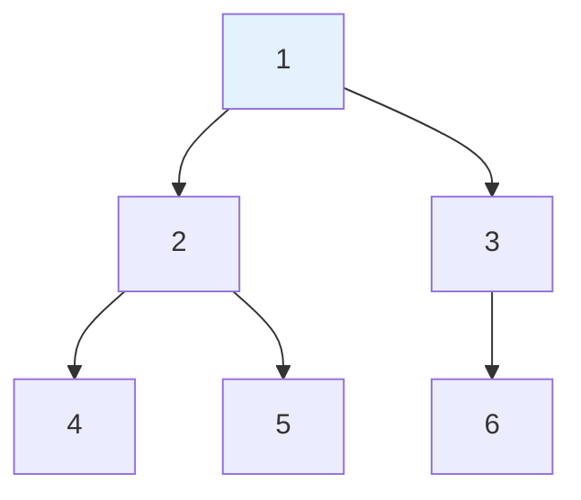
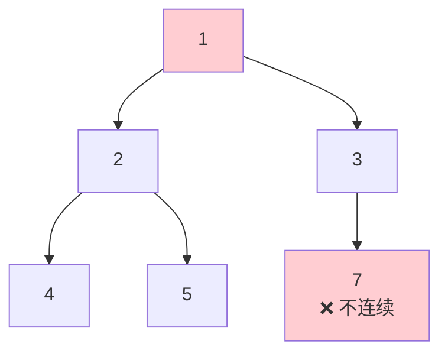
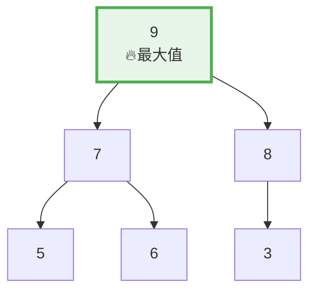
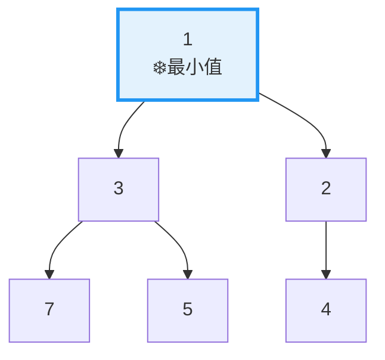
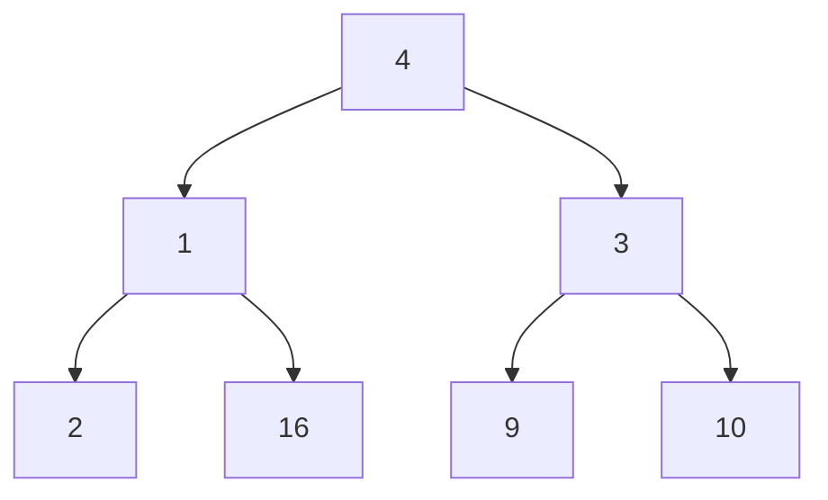
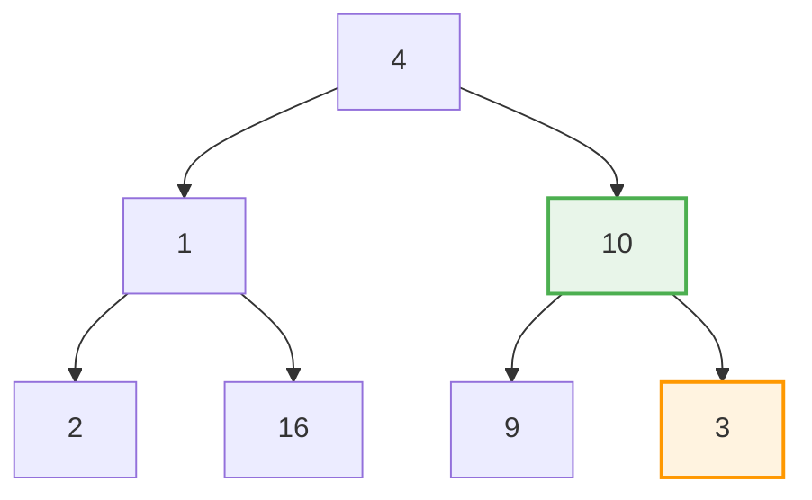
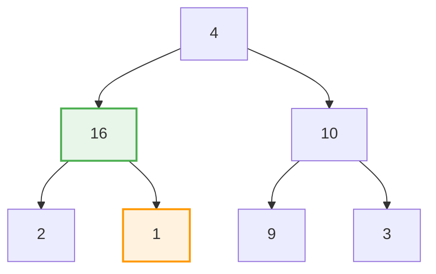
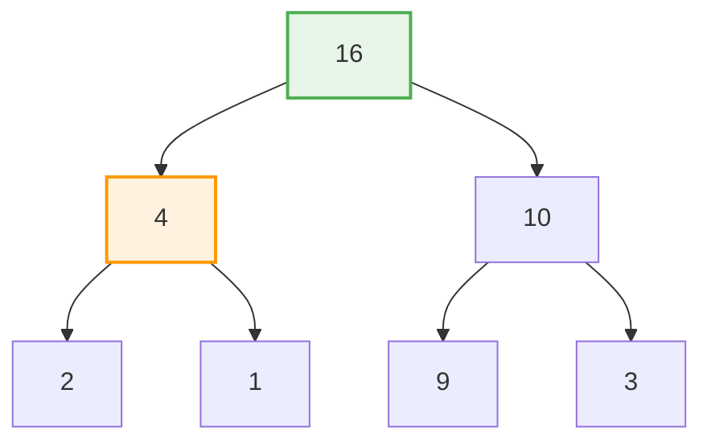
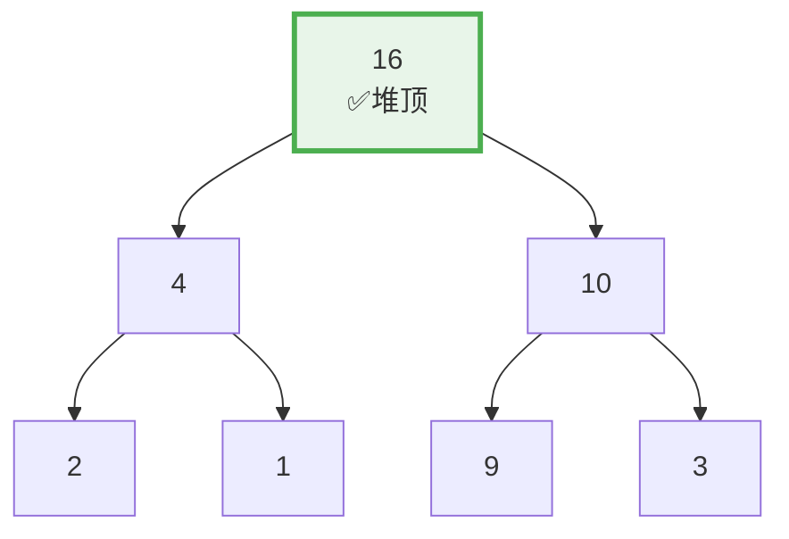

# 堆

## 概述

堆（Heap）是一种特殊的**完全二叉树**，它满足**堆序性质**：每个节点的值都大于等于（大根堆）或小于等于（小根堆）其子节点的值。堆通常用数组实现，是优先队列的底层数据结构。

<div style="background-color: #E3F2FD; border-left: 4px solid #2196F3; padding: 12px; margin: 10px 0;">
<strong>核心特征：</strong>堆是一种<strong>完全二叉树</strong>，使用数组存储，支持 O(1) 获取最值和 O(log n) 的插入、删除操作。大根堆的堆顶是最大值，小根堆的堆顶是最小值。
</div>

### 堆的重要性

<div style="background-color: #E3F2FD; border-left: 4px solid #2196F3; padding: 15px; margin: 10px 0;">
<p><strong>堆的应用领域</strong></p>
<p><strong>数据结构:</strong></p>
<ul style="margin-left: 20px;">
<li>优先队列的底层实现</li>
<li>C++ STL priority_queue</li>
<li>Java PriorityQueue</li>
</ul>
<p><strong>算法:</strong></p>
<ul style="margin-left: 20px;">
<li>堆排序 (Heapsort)</li>
<li>Dijkstra 最短路径算法</li>
<li>Prim 最小生成树算法</li>
<li>Huffman 编码</li>
</ul>
<p><strong>系统应用:</strong></p>
<ul style="margin-left: 20px;">
<li>操作系统进程调度</li>
<li>事件模拟系统</li>
<li>内存管理</li>
</ul>
</div>

## 堆的特点

### 1. 完全二叉树

堆是一棵完全二叉树，具有以下性质：

<div style="background-color: #F5F5F5; border-radius: 8px; padding: 20px; margin: 10px 0;">
<p><strong>完全二叉树定义:</strong></p>
<ul style="margin-left: 20px;">
<li>除最后一层外，每一层都被完全填满</li>
<li>最后一层的节点从左到右连续排列</li>
</ul>
</div>

**示例（完全二叉树）:**



**示例（非完全二叉树）:**



<div style="background-color: #F5F5F5; border-radius: 8px; padding: 20px; margin: 10px 0;">
<p><strong>完全二叉树的优势:</strong></p>
<ul style="margin-left: 20px;">
<li>可以用数组紧凑存储，无空间浪费</li>
<li>父子节点索引关系简单</li>
<li>高度为 ⌊log₂ n⌋</li>
</ul>
</div>

### 2. 堆序性质

堆序性质保证了堆顶元素的特殊性：

<div style="background-color: #FFF3E0; border-left: 4px solid #FF9800; padding: 12px; margin: 10px 0;">
<strong>大根堆 (Max Heap):</strong> 父节点 ≥ 子节点，堆顶是最大值。应用：求最大K个元素、任务调度（高优先级优先）
</div>



<div style="background-color: #E8F5E9; border-left: 4px solid #4CAF50; padding: 12px; margin: 10px 0;">
<strong>小根堆 (Min Heap):</strong> 父节点 ≤ 子节点，堆顶是最小值。应用：求最小K个元素、Dijkstra算法、合并有序链表
</div>



### 3. 数组存储

堆使用数组存储，利用完全二叉树的索引关系：

<div style="background-color: #F5F5F5; border-radius: 8px; padding: 20px; margin: 10px 0;">
<p><strong>数组表示法:</strong></p>
<p><strong>树形视图:</strong></p>
<div style="text-align: center; font-family: monospace; margin: 10px 0;">
<pre style="display: inline-block; text-align: left;">
              <span style="color: #4CAF50; font-weight: bold;">9</span>
            /   \
           <span style="color: #2196F3;">7</span>     <span style="color: #2196F3;">8</span>
          / \   /
         <span style="color: #2196F3;">5</span>   <span style="color: #2196F3;">6</span> <span style="color: #2196F3;">3</span>
</pre>
</div>
<p><strong>数组视图:</strong></p>
<div style="font-family: monospace; margin: 10px 0;">
<pre style="background: #E3F2FD; padding: 10px; border-radius: 4px;">
索引:    0   1   2   3   4   5
      ┌───┬───┬───┬───┬───┬───┐
      │ <span style="color: #4CAF50; font-weight: bold;">9</span> │ <span style="color: #2196F3;">7</span> │ <span style="color: #2196F3;">8</span> │ <span style="color: #2196F3;">5</span> │ <span style="color: #2196F3;">6</span> │ <span style="color: #2196F3;">3</span> │
      └───┴───┴───┴───┴───┴───┘
        ↑
       堆顶
</pre>
</div>
<p><strong>索引计算公式（从0开始）:</strong></p>
<div style="background: #FFF3E0; padding: 10px; border-radius: 4px; margin: 10px 0; border-left: 4px solid #FF9800;">
<p style="font-family: monospace;">父节点索引: &nbsp;&nbsp;&nbsp;parent(i) = (i - 1) / 2</p>
<p style="font-family: monospace;">左子节点索引: leftChild(i) = 2 * i + 1</p>
<p style="font-family: monospace;">右子节点索引: rightChild(i) = 2 * i + 2</p>
</div>
<p><strong>示例验证:</strong></p>
<p>节点 7（索引1）:</p>
<ul style="margin-left: 20px;">
<li>父节点: (1-1)/2 = 0 → 值为 9 ✓</li>
<li>左子节点: 2*1+1 = 3 → 值为 5 ✓</li>
<li>右子节点: 2*1+2 = 4 → 值为 6 ✓</li>
</ul>
<p>节点 8（索引2）:</p>
<ul style="margin-left: 20px;">
<li>父节点: (2-1)/2 = 0 → 值为 9 ✓</li>
<li>左子节点: 2*2+1 = 5 → 值为 3 ✓</li>
<li>右子节点: 2*2+2 = 6 → 超出范围（无右子节点）</li>
</ul>
</div>

### 4. 高效操作

<div style="background-color: #F5F5F5; border-radius: 8px; padding: 20px; margin: 10px 0;">
<p><strong>堆的操作复杂度:</strong></p>
<table style="width: 100%; border-collapse: collapse; margin-top: 10px;">
<tr style="background-color: #2196F3; color: white;">
<th style="padding: 10px; border: 1px solid #ddd;">操作</th>
<th style="padding: 10px; border: 1px solid #ddd;">时间复杂度</th>
<th style="padding: 10px; border: 1px solid #ddd;">说明</th>
</tr>
<tr style="background-color: #E8F5E9;"><td style="padding: 10px; border: 1px solid #ddd;">获取堆顶</td><td style="padding: 10px; border: 1px solid #ddd; text-align: center; color: #4CAF50; font-weight: bold;">O(1)</td><td style="padding: 10px; border: 1px solid #ddd;">直接访问数组第一个元素</td></tr>
<tr style="background-color: #E3F2FD;"><td style="padding: 10px; border: 1px solid #ddd;">插入元素</td><td style="padding: 10px; border: 1px solid #ddd; text-align: center;">O(log n)</td><td style="padding: 10px; border: 1px solid #ddd;">添加到末尾后上浮</td></tr>
<tr style="background-color: #E3F2FD;"><td style="padding: 10px; border: 1px solid #ddd;">删除堆顶</td><td style="padding: 10px; border: 1px solid #ddd; text-align: center;">O(log n)</td><td style="padding: 10px; border: 1px solid #ddd;">交换后下沉</td></tr>
<tr style="background-color: #E8F5E9;"><td style="padding: 10px; border: 1px solid #ddd;">建堆</td><td style="padding: 10px; border: 1px solid #ddd; text-align: center; color: #4CAF50; font-weight: bold;">O(n)</td><td style="padding: 10px; border: 1px solid #ddd;">从下往上依次下沉</td></tr>
<tr style="background-color: #FFF3E0;"><td style="padding: 10px; border: 1px solid #ddd;">堆排序</td><td style="padding: 10px; border: 1px solid #ddd; text-align: center;">O(n log n)</td><td style="padding: 10px; border: 1px solid #ddd;">建堆 + n次删除</td></tr>
</table>
</div>

## 原理详解

### 上浮操作（Swim）

当插入新元素或增大某元素的值时，需要上浮以恢复堆性质：

<div style="background-color: #F5F5F5; border-radius: 8px; padding: 20px; margin: 10px 0;">
<p><strong>上浮操作原理（大根堆）:</strong></p>
<p><strong>目的:</strong> 将较大元素向上移动到正确位置</p>
<p><strong>过程:</strong></p>
<ol style="margin-left: 20px;">
<li>比较当前节点与父节点</li>
<li>如果当前节点 > 父节点，交换</li>
<li>重复直到满足堆性质或到达堆顶</li>
</ol>
<p><strong>示例: 插入 9 到大根堆</strong></p>
<p><strong>插入前:</strong></p>
<div style="text-align: center; font-family: monospace; margin: 10px 0;">
<pre style="display: inline-block; text-align: left;">
              8
            /   \
           6     7
          / \   /
         3   5 4
        /
       <span style="color: #F44336; font-weight: bold;">9</span>  ← 新插入（位置不对）
</pre>
</div>
<p><strong>步骤1: 9 > 3，交换</strong></p>
<div style="text-align: center; font-family: monospace; margin: 10px 0;">
<pre style="display: inline-block; text-align: left;">
              8
            /   \
           6     7
          / \   /
         <span style="color: #FF9800; font-weight: bold;">9</span>   5 4
        /
       3
</pre>
</div>
<p><strong>步骤2: 9 > 6，交换</strong></p>
<div style="text-align: center; font-family: monospace; margin: 10px 0;">
<pre style="display: inline-block; text-align: left;">
              8
            /   \
           <span style="color: #FF9800; font-weight: bold;">9</span>     7
          / \   /
         6   5 4
        /
       3
</pre>
</div>
<p><strong>步骤3: 9 > 8，交换</strong></p>
<div style="text-align: center; font-family: monospace; margin: 10px 0;">
<pre style="display: inline-block; text-align: left;">
              <span style="color: #4CAF50; font-weight: bold;">9</span>
            /   \
           8     7
          / \   /
         6   5 4
        /
       3
</pre>
</div>
<p style="color: #4CAF50; font-weight: bold;">完成！9 已到达堆顶</p>
</div>

### 下沉操作（Sink）

当删除堆顶或减小某元素的值时，需要下沉以恢复堆性质：

<div style="background-color: #F5F5F5; border-radius: 8px; padding: 20px; margin: 10px 0;">
<p><strong>下沉操作原理（大根堆）:</strong></p>
<p><strong>目的:</strong> 将较小元素向下移动到正确位置</p>
<p><strong>过程:</strong></p>
<ol style="margin-left: 20px;">
<li>比较当前节点与两个子节点</li>
<li>选择较大的子节点</li>
<li>如果当前节点 < 较大子节点，交换</li>
<li>重复直到满足堆性质或到达叶子</li>
</ol>
<p><strong>示例: 删除大根堆堆顶</strong></p>
<p><strong>删除前:</strong></p>
<div style="text-align: center; font-family: monospace; margin: 10px 0;">
<pre style="display: inline-block; text-align: left;">
              9
            /   \
           8     7
          / \   /
         6   5 4
</pre>
</div>
<p><strong>步骤1: 将末尾元素 4 移到堆顶</strong></p>
<div style="text-align: center; font-family: monospace; margin: 10px 0;">
<pre style="display: inline-block; text-align: left;">
              <span style="color: #F44336; font-weight: bold;">4</span>
            /   \
           8     7
          / \
         6   5
</pre>
</div>
<p><strong>步骤2: 4 < max(8,7)=8，与 8 交换</strong></p>
<div style="text-align: center; font-family: monospace; margin: 10px 0;">
<pre style="display: inline-block; text-align: left;">
              8
            /   \
           <span style="color: #FF9800; font-weight: bold;">4</span>     7
          / \
         6   5
</pre>
</div>
<p><strong>步骤3: 4 < max(6,5)=6，与 6 交换</strong></p>
<div style="text-align: center; font-family: monospace; margin: 10px 0;">
<pre style="display: inline-block; text-align: left;">
              8
            /   \
           6     7
          / \
         <span style="color: #4CAF50; font-weight: bold;">4</span>   5
</pre>
</div>
<p style="color: #4CAF50; font-weight: bold;">完成！堆性质已恢复</p>
</div>

### 建堆过程

从无序数组构建堆，有两种方法：

<div style="background-color: #F5F5F5; border-radius: 8px; padding: 20px; margin: 10px 0;">
<p><strong>方法1: 逐个插入（自上而下）</strong></p>
<ul style="margin-left: 20px;">
<li>对每个元素执行插入操作</li>
<li>时间复杂度: O(n log n)</li>
</ul>
<p><strong>方法2: 自底向上下沉（更高效）</strong></p>
<ul style="margin-left: 20px;">
<li>从最后一个非叶子节点开始</li>
<li>依次对每个节点执行下沉</li>
<li style="color: #4CAF50; font-weight: bold;">时间复杂度: O(n)</li>
</ul>
</div>

**方法2 详细过程:**

初始数组: [4, 1, 3, 2, 16, 9, 10]

**初始树形视图:**



```
最后一个非叶子节点: (7-1)/2 = 3（索引从0开始）
即值为 2 的节点

从索引 3 开始下沉:
```

**sink(2): 节点值=3，子节点=9和10，max(9,10)=10，3 < 10，交换**



**sink(1): 节点值=1，子节点=2和16，max(2,16)=16，1 < 16，交换**



**sink(0): 节点值=4，子节点=16和10，max(16,10)=16，4 < 16，交换**



```
继续下沉 4：子节点=2和1
max(2,1)=2，4 > 2，停止
```

**最终结果:**



```
建堆完成！
数组: [16, 4, 10, 2, 1, 9, 3]
```

### 建堆复杂度分析

```
O(n) 建堆复杂度证明:

设树的高度为 h = ⌊log₂ n⌋

分析:
- 高度为 0 的节点（叶子）: 不需要下沉
- 高度为 1 的节点: 最多下沉 1 次
- 高度为 2 的节点: 最多下沉 2 次
- ...
- 高度为 h 的节点（根）: 最多下沉 h 次

高度为 k 的节点数量:
- 最多有 ⌈n / 2^(k+1)⌉ 个

总下沉次数:
T(n) = Σ(k=0 to h) ⌈n/2^(k+1)⌉ × k
     < n × Σ(k=0 to ∞) k / 2^(k+1)
     = n × (1/4 + 2/8 + 3/16 + ...)
     = n × 1
     = O(n)

结论: 建堆可以在 O(n) 时间内完成！
```

## 可视化演示

### 插入操作演示

```
插入序列: 5, 3, 8, 1, 6

═══════════════════════════════════════════════════════════════
插入 5（大根堆）
═══════════════════════════════════════════════════════════════

数组: [5]
树形:    5

═══════════════════════════════════════════════════════════════
插入 3
═══════════════════════════════════════════════════════════════

添加到末尾: [5, 3]
3 的父节点是 5
3 < 5，无需交换

树形:    5
         /
        3

═══════════════════════════════════════════════════════════════
插入 8
═══════════════════════════════════════════════════════════════

添加到末尾: [5, 3, 8]

上浮: 8 > 5，交换
数组: [8, 3, 5]

树形:    8
        / \
       3   5

═══════════════════════════════════════════════════════════════
插入 1
═══════════════════════════════════════════════════════════════

添加到末尾: [8, 3, 5, 1]
1 的父节点是 3
1 < 3，无需交换

树形:      8
          / \
         3   5
        /
       1

═══════════════════════════════════════════════════════════════
插入 6
═══════════════════════════════════════════════════════════════

添加到末尾: [8, 3, 5, 1, 6]

上浮: 6 > 3，交换
数组: [8, 6, 5, 1, 3]

树形:      8
          / \
         6   5
        / \
       1   3

最终堆: [8, 6, 5, 1, 3]
```

### 删除操作演示

```
删除堆顶元素（大根堆）

初始堆:
              10
            /    \
           9      8
          / \    / \
         7   6  5   4
        / \
       3   2

数组: [10, 9, 8, 7, 6, 5, 4, 3, 2]

═══════════════════════════════════════════════════════════════
步骤1: 保存堆顶 10，将末尾 2 移到堆顶
═══════════════════════════════════════════════════════════════

              2  ← 从末尾移来
            /    \
           9      8
          / \    / \
         7   6  5   4
        / \
       3   (空)

═══════════════════════════════════════════════════════════════
步骤2: 下沉 - 2 与 max(9,8)=9 交换
═══════════════════════════════════════════════════════════════

              9
            /    \
           2      8
          / \    / \
         7   6  5   4
        /
       3

═══════════════════════════════════════════════════════════════
步骤3: 下沉 - 2 与 max(7,6)=7 交换
═══════════════════════════════════════════════════════════════

              9
            /    \
           7      8
          / \    / \
         2   6  5   4
        /
       3

═══════════════════════════════════════════════════════════════
步骤4: 下沉 - 2 与 max(3)=3 交换
═══════════════════════════════════════════════════════════════

              9
            /    \
           7      8
          / \    / \
         3   6  5   4
        /
       2

═══════════════════════════════════════════════════════════════
完成！返回 10
═══════════════════════════════════════════════════════════════

最终堆: [9, 7, 8, 3, 6, 5, 4, 2]
```

### 堆排序演示

```
堆排序过程（升序，使用大根堆）

初始数组: [4, 1, 3, 2, 16, 9, 10]

═══════════════════════════════════════════════════════════════
阶段1: 建堆
═══════════════════════════════════════════════════════════════

建堆后:
              16
            /    \
           4      10
          / \    / \
         2   1  9   3

数组: [16, 4, 10, 2, 1, 9, 3]

═══════════════════════════════════════════════════════════════
阶段2: 排序（反复交换堆顶与末尾，然后下沉）
═══════════════════════════════════════════════════════════════

第1轮: 交换 16 和 3
数组: [3, 4, 10, 2, 1, 9 | 16]
下沉: [10, 4, 9, 2, 1, 3 | 16]

第2轮: 交换 10 和 3
数组: [3, 4, 9, 2, 1 | 10, 16]
下沉: [9, 4, 3, 2, 1 | 10, 16]

第3轮: 交换 9 和 1
数组: [1, 4, 3, 2 | 9, 10, 16]
下沉: [4, 2, 3, 1 | 9, 10, 16]

第4轮: 交换 4 和 1
数组: [1, 2, 3 | 4, 9, 10, 16]
下沉: [3, 2, 1 | 4, 9, 10, 16]

第5轮: 交换 3 和 1
数组: [1, 2 | 3, 4, 9, 10, 16]
下沉: [2, 1 | 3, 4, 9, 10, 16]

第6轮: 交换 2 和 1
数组: [1 | 2, 3, 4, 9, 10, 16]

═══════════════════════════════════════════════════════════════
最终结果: [1, 2, 3, 4, 9, 10, 16] (升序)
═══════════════════════════════════════════════════════════════
```

## 代码实现

### 大根堆实现

```c
typedef struct {
    int *data;       // 数据数组
    int size;        // 当前元素数量
    int capacity;    // 容量
} MaxHeap;

// 初始化堆
void initHeap(MaxHeap *heap, int capacity) {
    heap->data = (int*)malloc(sizeof(int) * capacity);
    heap->size = 0;
    heap->capacity = capacity;
}

// 交换两个元素
void swap(int *a, int *b) {
    int temp = *a;
    *a = *b;
    *b = temp;
}

// 上浮操作
void swim(MaxHeap *heap, int index) {
    while (index > 0) {
        int parent = (index - 1) / 2;
        if (heap->data[index] <= heap->data[parent]) {
            break;  // 满足堆性质
        }
        swap(&heap->data[index], &heap->data[parent]);
        index = parent;
    }
}

// 下沉操作
void sink(MaxHeap *heap, int index) {
    int n = heap->size;
    while (2 * index + 1 < n) {
        int left = 2 * index + 1;
        int right = 2 * index + 2;
        int largest = index;
        
        // 找出较大的子节点
        if (left < n && heap->data[left] > heap->data[largest]) {
            largest = left;
        }
        if (right < n && heap->data[right] > heap->data[largest]) {
            largest = right;
        }
        
        if (largest == index) break;  // 满足堆性质
        
        swap(&heap->data[index], &heap->data[largest]);
        index = largest;
    }
}

// 插入元素
void insert(MaxHeap *heap, int value) {
    // 扩容
    if (heap->size >= heap->capacity) {
        heap->capacity *= 2;
        heap->data = (int*)realloc(heap->data, sizeof(int) * heap->capacity);
    }
    
    heap->data[heap->size] = value;  // 添加到末尾
    swim(heap, heap->size);          // 上浮
    heap->size++;
}

// 删除并返回堆顶
int extractMax(MaxHeap *heap) {
    if (heap->size == 0) return -1;
    
    int max = heap->data[0];              // 保存堆顶
    heap->data[0] = heap->data[heap->size - 1];  // 末尾移到堆顶
    heap->size--;
    sink(heap, 0);                        // 下沉
    
    return max;
}

// 获取堆顶
int peek(MaxHeap *heap) {
    if (heap->size == 0) return -1;
    return heap->data[0];
}

// 建堆
void buildHeap(MaxHeap *heap, int arr[], int n) {
    heap->size = n;
    for (int i = 0; i < n; i++) {
        heap->data[i] = arr[i];
    }
    
    // 从最后一个非叶子节点开始下沉
    for (int i = n / 2 - 1; i >= 0; i--) {
        sink(heap, i);
    }
}
```

### 小根堆实现

```c
typedef struct {
    int *data;
    int size;
    int capacity;
} MinHeap;

// 上浮（小根堆）
void swimMin(MinHeap *heap, int index) {
    while (index > 0) {
        int parent = (index - 1) / 2;
        if (heap->data[index] >= heap->data[parent]) break;
        swap(&heap->data[index], &heap->data[parent]);
        index = parent;
    }
}

// 下沉（小根堆）
void sinkMin(MinHeap *heap, int index) {
    int n = heap->size;
    while (2 * index + 1 < n) {
        int left = 2 * index + 1;
        int right = 2 * index + 2;
        int smallest = index;
        
        if (left < n && heap->data[left] < heap->data[smallest]) {
            smallest = left;
        }
        if (right < n && heap->data[right] < heap->data[smallest]) {
            smallest = right;
        }
        
        if (smallest == index) break;
        
        swap(&heap->data[index], &heap->data[smallest]);
        index = smallest;
    }
}

void insertMin(MinHeap *heap, int value) {
    heap->data[heap->size] = value;
    swimMin(heap, heap->size);
    heap->size++;
}

int extractMin(MinHeap *heap) {
    int min = heap->data[0];
    heap->data[0] = heap->data[--heap->size];
    sinkMin(heap, 0);
    return min;
}
```

### C++ 模板实现

```cpp
template<typename T>
class MaxHeap {
private:
    std::vector<T> data;
    
    void swim(int index) {
        while (index > 0) {
            int parent = (index - 1) / 2;
            if (data[index] <= data[parent]) break;
            std::swap(data[index], data[parent]);
            index = parent;
        }
    }
    
    void sink(int index) {
        int n = data.size();
        while (2 * index + 1 < n) {
            int left = 2 * index + 1;
            int right = 2 * index + 2;
            int largest = index;
            if (left < n && data[left] > data[largest]) largest = left;
            if (right < n && data[right] > data[largest]) largest = right;
            if (largest == index) break;
            std::swap(data[index], data[largest]);
            index = largest;
        }
    }
    
public:
    void push(T value) {
        data.push_back(value);
        swim(data.size() - 1);
    }
    
    T pop() {
        T result = data[0];
        data[0] = data.back();
        data.pop_back();
        sink(0);
        return result;
    }
    
    T top() { return data[0]; }
    bool empty() { return data.empty(); }
    int size() { return data.size(); }
};
```

### 堆排序

```c
void heapSort(int arr[], int n) {
    // 建堆
    for (int i = n / 2 - 1; i >= 0; i--) {
        int index = i;
        while (2 * index + 1 < n) {
            int left = 2 * index + 1;
            int right = 2 * index + 2;
            int largest = index;
            if (left < n && arr[left] > arr[largest]) largest = left;
            if (right < n && arr[right] > arr[largest]) largest = right;
            if (largest == index) break;
            int temp = arr[index];
            arr[index] = arr[largest];
            arr[largest] = temp;
            index = largest;
        }
    }
    
    // 排序
    for (int i = n - 1; i > 0; i--) {
        // 交换堆顶和末尾
        int temp = arr[0];
        arr[0] = arr[i];
        arr[i] = temp;
        
        // 下沉堆顶
        int index = 0;
        while (2 * index + 1 < i) {
            int left = 2 * index + 1;
            int right = 2 * index + 2;
            int largest = index;
            if (left < i && arr[left] > arr[largest]) largest = left;
            if (right < i && arr[right] > arr[largest]) largest = right;
            if (largest == index) break;
            temp = arr[index];
            arr[index] = arr[largest];
            arr[largest] = temp;
            index = largest;
        }
    }
}
```

### C++ STL 使用

```cpp
#include <queue>
#include <vector>

// 大根堆（默认）
std::priority_queue<int> maxHeap;
maxHeap.push(3);
maxHeap.push(1);
maxHeap.push(4);
int top = maxHeap.top();  // 4
maxHeap.pop();

// 小根堆
std::priority_queue<int, std::vector<int>, std::greater<int>> minHeap;
minHeap.push(3);
minHeap.push(1);
minHeap.push(4);
top = minHeap.top();  // 1
```

## 复杂度分析

### 时间复杂度

| 操作 | 时间复杂度 | 说明 |
|------|-----------|------|
| 建堆 | O(n) | 自底向上下沉 |
| 插入 | O(log n) | 最多上浮树高次 |
| 删除堆顶 | O(log n) | 最多下沉树高次 |
| 获取堆顶 | O(1) | 直接访问 data[0] |
| 堆排序 | O(n log n) | 建堆 O(n) + n 次删除 O(n log n) |

### 空间复杂度

- O(n)：存储 n 个元素
- 堆排序是原地排序，空间复杂度 O(1)

## 堆的应用

### 1. Top K 问题

找出数组中最大的 K 个元素：

```c
void topK(int arr[], int n, int k) {
    MinHeap heap;
    initHeap(&heap, k + 1);
    
    for (int i = 0; i < n; i++) {
        insertMin(&heap, arr[i]);
        // 保持堆大小为 k
        if (heap.size > k) {
            extractMin(&heap);  // 移除最小的
        }
    }
    
    // 输出最大的 K 个元素
    while (heap.size > 0) {
        printf("%d ", extractMin(&heap));
    }
}
```

**算法图解：**

```
输入: [4, 1, 3, 2, 16, 9, 10], k = 3

使用小根堆维护 Top 3:

─────────────────────────────────────────────────────────────────
元素    堆状态               操作
─────────────────────────────────────────────────────────────────
 4     [4]                  入堆
 1     [1, 4]               入堆
 3     [1, 3, 4]            入堆
 2     [2, 3, 4]            入堆后弹出 1
16     [3, 4, 16]           入堆后弹出 2
 9     [4, 9, 16]           入堆后弹出 3
10     [9, 10, 16]          入堆后弹出 4
─────────────────────────────────────────────────────────────────

Top 3: 9, 10, 16（最大的3个元素）
```

### 2. 合并 K 个有序数组

```c
typedef struct {
    int value;        // 元素值
    int arrayIndex;   // 来自哪个数组
    int elementIndex; // 在数组中的位置
} HeapNode;

void mergeKSortedArrays(int **arrays, int *sizes, int k) {
    MinHeap heap;
    initHeap(&heap, k);
    
    // 将各数组第一个元素入堆
    for (int i = 0; i < k; i++) {
        if (sizes[i] > 0) {
            HeapNode node = {arrays[i][0], i, 0};
            insertMin(&heap, node.value);
        }
    }
    
    // 依次取出最小值
    while (heap.size > 0) {
        int min = extractMin(&heap);
        printf("%d ", min);
        // 补充该数组的下一个元素...
    }
}
```

### 3. 中位数维护

使用两个堆动态维护数据流的中位数：

```cpp
class MedianFinder {
private:
    // 左半部分：大根堆
    std::priority_queue<int> maxHeap;
    // 右半部分：小根堆
    std::priority_queue<int, std::vector<int>, std::greater<int>> minHeap;
    
public:
    void addNum(int num) {
        // 维持 maxHeap 存储较小的一半
        if (maxHeap.empty() || num <= maxHeap.top()) {
            maxHeap.push(num);
        } else {
            minHeap.push(num);
        }
        
        // 平衡两个堆的大小
        if (maxHeap.size() > minHeap.size() + 1) {
            minHeap.push(maxHeap.top());
            maxHeap.pop();
        } else if (minHeap.size() > maxHeap.size()) {
            maxHeap.push(minHeap.top());
            minHeap.pop();
        }
    }
    
    double findMedian() {
        if (maxHeap.size() == minHeap.size()) {
            return (maxHeap.top() + minHeap.top()) / 2.0;
        }
        return maxHeap.top();
    }
};
```

**中位数维护图解：**

```
数据流: 5, 2, 8, 1, 9

─────────────────────────────────────────────────────────────────
操作     maxHeap（左半）   minHeap（右半）   中位数
─────────────────────────────────────────────────────────────────
add(5)     [5]              []              5
add(2)     [5, 2]           []              (5+2)/2=3.5
           → 平衡后 [5]     [2]             5
           实际: 左半存较大，右半存较小
           让我重新梳理...
           
正确的过程:
add(5)     [5]              []              5
add(2)     [5]              [2]             5
           (maxHeap存较大的一半)
add(8)     [5]              [2, 8]          5
           → 平衡 [5, 8]    [2]             (5+8)/2? 不对

实际上:
- maxHeap 存储较小的一半（大根堆，堆顶是这半的最大值）
- minHeap 存储较大的一半（小根堆，堆顶是这半的最小值）

add(5):  maxHeap=[5], minHeap=[]       中位数=5
add(2):  maxHeap=[5], minHeap=[2]      中位数=5
         (2<5, 放入maxHeap, 但需要平衡)
         maxHeap=[5,2]→下沉→[5,2]
         平衡后: maxHeap=[5], minHeap=[2]
         
让我按正确逻辑重画...
─────────────────────────────────────────────────────────────────

关键: maxHeap 堆顶 ≤ minHeap 堆顶
     且 |maxHeap.size - minHeap.size| ≤ 1
```

### 4. Dijkstra 最短路径

堆优化 Dijkstra 算法：

```
Dijkstra 堆优化:

使用小根堆存储 (距离, 顶点)

初始: 堆中放入 (0, 源点)

每次:
1. 取出堆顶 (d, v)
2. 如果 d > dist[v]，跳过（已更新过）
3. 否则，更新 v 的邻居距离
4. 将新距离入堆

时间复杂度: O((V + E) log V)
```

### 5. Huffman 编码

使用小根堆构建 Huffman 树：

```
Huffman 编码过程:

初始频率: a:5, b:9, c:12, d:13, e:16, f:45

初始堆: [5, 9, 12, 13, 16, 45]

步骤1: 取出 5, 9，合并为 14，入堆
        [12, 13, 14, 16, 45]

步骤2: 取出 12, 13，合并为 25，入堆
        [14, 16, 25, 45]

步骤3: 取出 14, 16，合并为 30，入堆
        [25, 30, 45]

步骤4: 取出 25, 30，合并为 55，入堆
        [45, 55]

步骤5: 取出 45, 55，合并为 100
        [100]

完成！构建出 Huffman 树
```

## 参考资料

- 《算法导论》第6章 - 堆排序
- 《数据结构与算法分析：C语言描述》第6章 - 优先队列
- [LeetCode 215. 数组中的第K个最大元素](https://leetcode.com/problems/kth-largest-element-in-an-array/)
- [LeetCode 295. 数据流的中位数](https://leetcode.com/problems/find-median-from-data-stream/)
- [LeetCode 23. 合并K个升序链表](https://leetcode.com/problems/merge-k-sorted-lists/)
