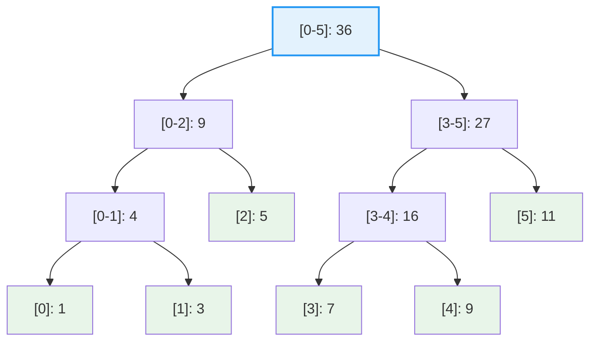

# 线段树

## 概述

线段树（Segment Tree）是一种强大的**二叉树数据结构**，专门用于高效处理**区间查询**和**区间更新**问题。它能在 O(log n) 时间内完成区间求和、区间最值、区间更新等操作，是算法竞赛和实际应用中常用的数据结构。

<div style="background-color: #E3F2FD; border-left: 4px solid #2196F3; padding: 12px; margin: 10px 0;">
<strong>核心价值：</strong>线段树将数组区间分解为 O(log n) 个不相交的区间段，每个节点存储一个区间的统计信息（如和、最值等），通过<strong>分治思想</strong>实现高效的区间操作。
</div>

### 为什么需要线段树？

```
┌─────────────────────────────────────────────────────────────────────┐
│                    区间查询问题的挑战                                │
├─────────────────────────────────────────────────────────────────────┤
│                                                                     │
│  问题: 给定数组，支持以下操作:                                       │
│  1. 查询区间 [l, r] 的和/最值                                       │
│  2. 更新某个位置的值                                                │
│  3. 更新区间 [l, r] 的所有值                                        │
│                                                                     │
│  朴素方法:                                                          │
│  ┌─────────────────────────────────────────────────────────────┐   │
│  │ 查询区间和: O(r - l) 最坏 O(n)                                │   │
│  │ 单点更新: O(1)                                               │   │
│  │ 区间更新: O(r - l) 最坏 O(n)                                 │   │
│  └─────────────────────────────────────────────────────────────┘   │
│                                                                     │
│  前缀和方法（只适用于区间求和，不支持区间更新）:                      │
│  ┌─────────────────────────────────────────────────────────────┐   │
│  │ 查询区间和: O(1)                                              │   │
│  │ 单点更新: O(n)（需要重建前缀和）                              │   │
│  │ 区间更新: O(n)                                                │   │
│  └─────────────────────────────────────────────────────────────┘   │
│                                                                     │
│  线段树方法:                                                        │
│  ┌─────────────────────────────────────────────────────────────┐   │
│  │ 查询区间和: O(log n)                                          │   │
│  │ 单点更新: O(log n)                                            │   │
│  │ 区间更新: O(log n)（使用懒标记）                              │   │
│  └─────────────────────────────────────────────────────────────┘   │
│                                                                     │
│  线段树在查询和更新之间取得了最佳平衡！                              │
│                                                                     │
└─────────────────────────────────────────────────────────────────────┘
```

## 线段树结构

### 基本概念

```
线段树的基本思想:

每个节点代表一个区间 [start, end]:
- 根节点代表整个数组区间 [0, n-1]
- 叶子节点代表单个元素区间 [i, i]
- 内部节点代表区间的合并

区间划分规则:
对于节点 [start, end]:
- 如果 start == end: 叶子节点
- 否则: 分为 [start, mid] 和 [mid+1, end] 两个子区间
  其中 mid = (start + end) / 2
```

**示例: 数组 [1, 3, 5, 7, 9, 11]（索引 0-5）**

**线段树结构（区间求和）:**



```
节点含义:
- [0-5]: 36 表示区间 [0,5] 的和为 36 = 1+3+5+7+9+11
- [0-2]: 9 表示区间 [0,2] 的和为 9 = 1+3+5
- [2]: 5 表示区间 [2,2] 的和为 5（即元素 arr[2]）
```

### 数组存储方式

线段树是完全二叉树，可以用数组存储：

```
数组存储方式（索引从 0 开始）:

对于节点 i:
- 左子节点: 2*i + 1
- 右子节点: 2*i + 2
- 父节点: (i - 1) / 2

数组大小:
- 需要 4n 的空间（足够存储所有节点）
- 实际使用约 2n 到 4n 个节点

示例: n = 6
tree 数组:
索引:    0    1    2    3    4    5    6    7    8    9   10   11   ...
      ┌────┬────┬────┬────┬────┬────┬────┬────┬────┬────┬────┬────┐
      │ 36 │  9 │ 27 │  4 │  5 │ 16 │ 11 │  1 │  3 │  ? │  7 │  9 │
      └────┴────┴────┴────┴────┴────┴────┴────┴────┴────┴────┴────┘
        ↑
       根节点

节点对应:
索引 0: [0-5] = 36
索引 1: [0-2] = 9
索引 2: [3-5] = 27
索引 3: [0-1] = 4
索引 4: [2]   = 5
索引 5: [3-4] = 16
索引 6: [5]   = 11
索引 7: [0]   = 1
索引 8: [1]   = 3
索引 10: [3]  = 7
索引 11: [4]  = 9
```

## 线段树特点

### 1. 区间覆盖

每个节点代表一个区间，整棵树覆盖整个数组：

```
区间覆盖示意图:

数组: [1, 3, 5, 7, 9, 11]
      0  1  2  3  4   5

查询区间 [1, 4] 的分解:

                    [0-5]
                   /     \
            [0-2]        [3-5]
            /   \        /    \
         [0-1] [2]     [3-4]  [5]
         /  \          /  \
        [0] [1]       [3] [4]

查询 [1, 4]:
- [0-1] 不完全包含，需要分解 → [1] 完全包含 ✓
- [2] 完全包含 ✓
- [3-4] 完全包含 ✓

分解结果: [1] + [2] + [3-4] = 3 + 5 + 16 = 24

特点: 任意区间可以被分解为 O(log n) 个节点区间的并集
```

### 2. 完全二叉树

线段树是完全二叉树，具有以下优势：

```
完全二叉树的优势:

1. 数组存储: 无需指针，节省空间
2. 索引计算: O(1) 时间找到父子节点
3. 内存连续: 缓存友好，访问高效

空间分析:
- n 个元素的线段树最多有 2n-1 个节点（完美情况）
- 但通常分配 4n 空间以应对各种情况
- 实际空间复杂度: O(n)
```

### 3. 懒标记（Lazy Propagation）

懒标记是线段树的核心优化技术：

```
懒标记的作用:

问题: 区间更新 [2, 5] 每个元素加 3

不用懒标记:
- 需要更新所有涉及的叶子节点
- 时间复杂度: O(n)

使用懒标记:
- 在完全覆盖的节点上打标记
- 不立即下传到子节点
- 查询时才下传标记
- 时间复杂度: O(log n)

示例: 更新区间 [2, 5] 每个元素加 3

                    [0-5]: 36+12=48
                   /        \
            [0-2]: 9+3=12  [3-5]: 27+9=36
            /    \          /    \
       [0-1]: 4 [2]: 5+3  [3-4]: 16+6 [5]: 11+3
                            ↑
                      打上懒标记 lazy=3

懒标记传播:
- 更新时: 在完全覆盖的节点打标记
- 查询时: 下传标记到子节点（pushDown）
- 保证正确性的同时减少更新次数
```

### 4. 高效查询

```
查询效率分析:

查询区间 [l, r] 的过程:

每次递归:
- 如果节点区间完全在查询区间外: 直接返回
- 如果节点区间完全在查询区间内: 返回节点值
- 否则: 递归左右子树

关键观察:
- 在每一层，最多访问 4 个节点
- 树高为 log n
- 总访问节点数: O(log n)

示例: 查询 [1, 4]

访问路径:
第1层: [0-5] → 递归左右
第2层: [0-2], [3-5] → [0-2]递归, [3-5]递归
第3层: [0-1], [2], [3-4], [5] → [0-1]递归, [2]返回, [3-4]返回, [5]跳过
第4层: [0]跳过, [1]返回

访问节点数: 约 log n 级别
```

## 原理详解

### 建树过程

```
建树过程详解:

算法思路: 分治 + 递归

步骤:
1. 如果 start == end, 叶子节点，直接赋值
2. 否则:
   a. 递归建立左子树 [start, mid]
   b. 递归建立右子树 [mid+1, end]
   c. 合并左右子树结果

示例: 建立数组 [1, 3, 5, 7, 9, 11] 的线段树

─────────────────────────────────────────────────────────────────
步骤1: 处理节点 [0-5]
─────────────────────────────────────────────────────────────────
mid = 2
递归建立 [0-2] 和 [3-5]

─────────────────────────────────────────────────────────────────
步骤2: 处理节点 [0-2]
─────────────────────────────────────────────────────────────────
mid = 1
递归建立 [0-1] 和 [2]

─────────────────────────────────────────────────────────────────
步骤3: 处理节点 [0-1]
─────────────────────────────────────────────────────────────────
mid = 0
递归建立 [0] 和 [1]

─────────────────────────────────────────────────────────────────
步骤4: 处理叶子节点 [0], [1], [2], [3], [4], [5]
─────────────────────────────────────────────────────────────────
tree[[0]] = arr[0] = 1
tree[[1]] = arr[1] = 3
tree[[2]] = arr[2] = 5
tree[[3]] = arr[3] = 7
tree[[4]] = arr[4] = 9
tree[[5]] = arr[5] = 11

─────────────────────────────────────────────────────────────────
步骤5: 回溯合并
─────────────────────────────────────────────────────────────────
tree[[0-1]] = tree[[0]] + tree[[1]] = 1 + 3 = 4
tree[[0-2]] = tree[[0-1]] + tree[[2]] = 4 + 5 = 9
tree[[3-4]] = tree[[3]] + tree[[4]] = 7 + 9 = 16
tree[[3-5]] = tree[[3-4]] + tree[[5]] = 16 + 11 = 27
tree[[0-5]] = tree[[0-2]] + tree[[3-5]] = 9 + 27 = 36

最终线段树:
                    [0-5]: 36
                   /        \
            [0-2]: 9      [3-5]: 27
            /    \          /    \
       [0-1]: 4 [2]: 5  [3-4]: 16 [5]: 11
       /   \              /   \
    [0]: 1 [1]: 3      [3]: 7 [4]: 9
```

### 区间查询

```
区间查询算法:

查询 [l, r] 的步骤:

1. 如果当前节点区间与 [l, r] 无交集:
   返回默认值（求和为0，最值为±∞）

2. 如果当前节点区间完全包含于 [l, r]:
   返回当前节点的值

3. 否则:
   递归查询左右子树，合并结果

示例: 查询区间 [1, 4] 的和

                    [0-5]
                   /     \
            [0-2]        [3-5]
            /   \        /    \
         [0-1] [2]     [3-4]  [5]
         /  \          /  \
        [0] [1]       [3] [4]

查询过程:
─────────────────────────────────────────────────────────────────
步骤   当前节点   判断                操作
─────────────────────────────────────────────────────────────────
 1     [0-5]    与[1,4]相交但不包含   递归左右
 2     [0-2]    与[1,4]相交但不包含   递归左右
 3     [0-1]    与[1,4]相交但不包含   递归左右
 4     [0]      与[1,4]无交集         返回 0
 5     [1]      完全包含于[1,4]       返回 3 ✓
 6     [2]      完全包含于[1,4]       返回 5 ✓
 7     [3-5]    与[1,4]相交但不包含   递归左右
 8     [3-4]    完全包含于[1,4]       返回 16 ✓
 9     [5]      与[1,4]无交集         返回 0
─────────────────────────────────────────────────────────────────

结果: 3 + 5 + 16 = 24

实际访问的节点: [0-5], [0-2], [0-1], [0], [1], [2], [3-5], [3-4], [5]
有效节点: [1], [2], [3-4]
```

### 单点更新

```
单点更新算法:

更新位置 index 的值为 value:

1. 找到对应的叶子节点
2. 更新叶子节点的值
3. 回溯更新所有祖先节点

示例: 更新 arr[2] = 10

更新前:
                    [0-5]: 36
                   /        \
            [0-2]: 9      [3-5]: 27
            /    \          /    \
       [0-1]: 4 [2]: 5  [3-4]: 16 [5]: 11

更新过程:
─────────────────────────────────────────────────────────────────
步骤1: 找到叶子节点 [2]
─────────────────────────────────────────────────────────────────
路径: [0-5] → [0-2] → [2]

─────────────────────────────────────────────────────────────────
步骤2: 更新叶子节点
─────────────────────────────────────────────────────────────────
tree[[2]] = 10 (原来是 5)

─────────────────────────────────────────────────────────────────
步骤3: 回溯更新祖先
─────────────────────────────────────────────────────────────────
tree[[0-2]] = tree[[0-1]] + tree[[2]] = 4 + 10 = 14 (原来是 9)
tree[[0-5]] = tree[[0-2]] + tree[[3-5]] = 14 + 27 = 41 (原来是 36)

更新后:
                    [0-5]: 41
                   /        \
            [0-2]: 14     [3-5]: 27
            /    \          /    \
       [0-1]: 4 [2]: 10 [3-4]: 16 [5]: 11
```

### 区间更新与懒标记

```
区间更新算法（使用懒标记）:

更新区间 [l, r] 每个元素加 value:

1. 如果当前节点区间与 [l, r] 无交集: 返回
2. 如果当前节点区间完全包含于 [l, r]:
   - 更新节点值 += value * 区间长度
   - 打上懒标记 += value
   - 返回
3. 否则:
   - 下传懒标记（pushDown）
   - 递归更新左右子树
   - 合并结果

示例: 更新区间 [2, 5] 每个元素加 3

更新前:
                    [0-5]: 36
                   /        \
            [0-2]: 9      [3-5]: 27
            /    \          /    \
       [0-1]: 4 [2]: 5  [3-4]: 16 [5]: 11

更新过程:
─────────────────────────────────────────────────────────────────
步骤1: 处理 [0-5]，与 [2,5] 相交但不包含
─────────────────────────────────────────────────────────────────
递归左右子树

─────────────────────────────────────────────────────────────────
步骤2: 处理 [0-2]，与 [2,5] 相交但不包含
─────────────────────────────────────────────────────────────────
递归左右子树

─────────────────────────────────────────────────────────────────
步骤3: 处理 [0-1]，与 [2,5] 无交集
─────────────────────────────────────────────────────────────────
跳过

─────────────────────────────────────────────────────────────────
步骤4: 处理 [2]，完全包含于 [2,5]
─────────────────────────────────────────────────────────────────
tree[[2]] += 3 * 1 = 5 + 3 = 8
lazy[[2]] += 3 (打上懒标记)

─────────────────────────────────────────────────────────────────
步骤5: 处理 [3-5]，完全包含于 [2,5]
─────────────────────────────────────────────────────────────────
tree[[3-5]] += 3 * 3 = 27 + 9 = 36
lazy[[3-5]] += 3 (打上懒标记)

─────────────────────────────────────────────────────────────────
步骤6: 回溯更新
─────────────────────────────────────────────────────────────────
tree[[0-2]] = 4 + 8 = 12
tree[[0-5]] = 12 + 36 = 48

更新后:
                    [0-5]: 48
                   /        \
            [0-2]: 12     [3-5]: 36, lazy=3
            /    \          /    \
       [0-1]: 4 [2]: 8, lazy=3  [3-4]: 16 [5]: 11
                                 ↑
                           懒标记还未下传
```

### 懒标记下传（pushDown）

```
懒标记下传机制:

何时下传?
- 在需要访问子节点时
- 在更新或查询操作的递归之前

如何下传?
1. 如果当前节点有懒标记:
   - 将懒标记传递给左右子节点
   - 更新左右子节点的值
   - 清除当前节点的懒标记

示例: 下传节点 [3-5] 的懒标记

下传前:
            [3-5]: 36, lazy=3
            /          \
        [3-4]: 16      [5]: 11

下传过程:
─────────────────────────────────────────────────────────────────
1. 更新左子节点 [3-4]
─────────────────────────────────────────────────────────────────
tree[[3-4]] += lazy[[3-5]] * 区间长度
             = 16 + 3 * 2 = 22
lazy[[3-4]] += lazy[[3-5]] = 0 + 3 = 3

─────────────────────────────────────────────────────────────────
2. 更新右子节点 [5]
─────────────────────────────────────────────────────────────────
tree[[5]] += lazy[[3-5]] * 区间长度
          = 11 + 3 * 1 = 14
lazy[[5]] += lazy[[3-5]] = 0 + 3 = 3

─────────────────────────────────────────────────────────────────
3. 清除当前节点的懒标记
─────────────────────────────────────────────────────────────────
lazy[[3-5]] = 0

下传后:
            [3-5]: 36
            /          \
        [3-4]: 22, lazy=3  [5]: 14, lazy=3

懒标记继续向下传播...
```

## 可视化演示

### 完整操作演示

```
操作序列: 建树 [1,3,5,7,9,11], 查询[1,4], 更新位置2为10, 查询[1,4]

═══════════════════════════════════════════════════════════════
初始数组: [1, 3, 5, 7, 9, 11]
═══════════════════════════════════════════════════════════════

索引:   0   1   2   3   4   5
      ┌───┬───┬───┬───┬───┬───┐
      │ 1 │ 3 │ 5 │ 7 │ 9 │ 11│
      └───┴───┴───┴───┴───┴───┘

═══════════════════════════════════════════════════════════════
建树结果
═══════════════════════════════════════════════════════════════

                    [0-5]: 36
                   /        \
            [0-2]: 9      [3-5]: 27
            /    \          /    \
       [0-1]: 4 [2]: 5  [3-4]: 16 [5]: 11
       /   \              /   \
    [0]: 1 [1]: 3      [3]: 7 [4]: 9

═══════════════════════════════════════════════════════════════
查询区间 [1, 4]
═══════════════════════════════════════════════════════════════

分解:
- [1]: 完全包含 → 3
- [2]: 完全包含 → 5
- [3-4]: 完全包含 → 16

结果: 3 + 5 + 16 = 24

═══════════════════════════════════════════════════════════════
更新位置 2 为 10
═══════════════════════════════════════════════════════════════

更新路径: [0-5] → [0-2] → [2]

                    [0-5]: 41  ← 更新
                   /        \
            [0-2]: 14     [3-5]: 27
            /    \          /    \
       [0-1]: 4 [2]: 10 ← 更新 [3-4]: 16 [5]: 11
       /   \              /   \
    [0]: 1 [1]: 3      [3]: 7 [4]: 9

═══════════════════════════════════════════════════════════════
再次查询区间 [1, 4]
═══════════════════════════════════════════════════════════════

分解:
- [1]: 完全包含 → 3
- [2]: 完全包含 → 10
- [3-4]: 完全包含 → 16

结果: 3 + 10 + 16 = 29
```

## 代码实现

### 线段树结构定义

```c
typedef struct {
    int *tree;       // 线段树数组
    int *lazy;       // 懒标记数组
    int n;           // 原数组大小
} SegmentTree;
```

### 建树

```c
// 递归建树
void build(int *arr, int *tree, int node, int start, int end) {
    if (start == end) {
        // 叶子节点
        tree[node] = arr[start];
    } else {
        int mid = start + (end - start) / 2;
        int leftNode = 2 * node + 1;
        int rightNode = 2 * node + 2;
        
        // 递归建立左右子树
        build(arr, tree, leftNode, start, mid);
        build(arr, tree, rightNode, mid + 1, end);
        
        // 合并结果（区间求和）
        tree[node] = tree[leftNode] + tree[rightNode];
    }
}

// 创建线段树
SegmentTree* createSegmentTree(int *arr, int n) {
    SegmentTree *st = (SegmentTree*)malloc(sizeof(SegmentTree));
    st->n = n;
    st->tree = (int*)calloc(4 * n, sizeof(int));
    st->lazy = (int*)calloc(4 * n, sizeof(int));
    
    build(arr, st->tree, 0, 0, n - 1);
    return st;
}
```

### 区间查询

```c
int query(int *tree, int node, int start, int end, int l, int r) {
    // 无交集
    if (r < start || l > end) {
        return 0;
    }
    
    // 完全包含
    if (l <= start && end <= r) {
        return tree[node];
    }
    
    // 部分包含，递归查询
    int mid = start + (end - start) / 2;
    int leftNode = 2 * node + 1;
    int rightNode = 2 * node + 2;
    
    int leftSum = query(tree, leftNode, start, mid, l, r);
    int rightSum = query(tree, rightNode, mid + 1, end, l, r);
    
    return leftSum + rightSum;
}

// 区间查询接口
int rangeQuery(SegmentTree *st, int l, int r) {
    return query(st->tree, 0, 0, st->n - 1, l, r);
}
```

### 单点更新

```c
void updatePoint(int *tree, int node, int start, int end, int index, int value) {
    if (start == end) {
        // 叶子节点，直接更新
        tree[node] = value;
    } else {
        int mid = start + (end - start) / 2;
        int leftNode = 2 * node + 1;
        int rightNode = 2 * node + 2;
        
        // 递归更新
        if (index <= mid) {
            updatePoint(tree, leftNode, start, mid, index, value);
        } else {
            updatePoint(tree, rightNode, mid + 1, end, index, value);
        }
        
        // 回溯更新
        tree[node] = tree[leftNode] + tree[rightNode];
    }
}

// 单点更新接口
void update(SegmentTree *st, int index, int value) {
    updatePoint(st->tree, 0, 0, st->n - 1, index, value);
}
```

### 懒标记下传

```c
void pushDown(int *tree, int *lazy, int node, int start, int end) {
    if (lazy[node] != 0) {
        int mid = start + (end - start) / 2;
        int leftNode = 2 * node + 1;
        int rightNode = 2 * node + 2;
        
        // 下传到左子节点
        tree[leftNode] += lazy[node] * (mid - start + 1);
        lazy[leftNode] += lazy[node];
        
        // 下传到右子节点
        tree[rightNode] += lazy[node] * (end - mid);
        lazy[rightNode] += lazy[node];
        
        // 清除当前节点懒标记
        lazy[node] = 0;
    }
}
```

### 区间更新

```c
void updateRange(int *tree, int *lazy, int node, int start, int end, 
                 int l, int r, int value) {
    // 无交集
    if (r < start || l > end) {
        return;
    }
    
    // 完全包含
    if (l <= start && end <= r) {
        tree[node] += value * (end - start + 1);
        lazy[node] += value;
        return;
    }
    
    // 部分包含，下传懒标记
    pushDown(tree, lazy, node, start, end);
    
    int mid = start + (end - start) / 2;
    int leftNode = 2 * node + 1;
    int rightNode = 2 * node + 2;
    
    // 递归更新左右子树
    updateRange(tree, lazy, leftNode, start, mid, l, r, value);
    updateRange(tree, lazy, rightNode, mid + 1, end, l, r, value);
    
    // 合并结果
    tree[node] = tree[leftNode] + tree[rightNode];
}

// 区间更新接口
void rangeUpdate(SegmentTree *st, int l, int r, int value) {
    updateRange(st->tree, st->lazy, 0, 0, st->n - 1, l, r, value);
}
```

### 带懒标记的查询

```c
int queryWithLazy(int *tree, int *lazy, int node, int start, int end, int l, int r) {
    // 无交集
    if (r < start || l > end) {
        return 0;
    }
    
    // 完全包含
    if (l <= start && end <= r) {
        return tree[node];
    }
    
    // 下传懒标记
    pushDown(tree, lazy, node, start, end);
    
    int mid = start + (end - start) / 2;
    int leftNode = 2 * node + 1;
    int rightNode = 2 * node + 2;
    
    // 递归查询
    int leftSum = queryWithLazy(tree, lazy, leftNode, start, mid, l, r);
    int rightSum = queryWithLazy(tree, lazy, rightNode, mid + 1, end, l, r);
    
    return leftSum + rightSum;
}
```

### C++ 实现

```cpp
class SegmentTree {
private:
    std::vector<long long> tree;
    std::vector<long long> lazy;
    int n;
    
    void build(const std::vector<int>& arr, int node, int start, int end) {
        if (start == end) {
            tree[node] = arr[start];
        } else {
            int mid = start + (end - start) / 2;
            build(arr, 2 * node + 1, start, mid);
            build(arr, 2 * node + 2, mid + 1, end);
            tree[node] = tree[2 * node + 1] + tree[2 * node + 2];
        }
    }
    
    void pushDown(int node, int start, int end) {
        if (lazy[node] != 0) {
            int mid = start + (end - start) / 2;
            tree[2 * node + 1] += lazy[node] * (mid - start + 1);
            tree[2 * node + 2] += lazy[node] * (end - mid);
            lazy[2 * node + 1] += lazy[node];
            lazy[2 * node + 2] += lazy[node];
            lazy[node] = 0;
        }
    }
    
    void updateRange(int node, int start, int end, int l, int r, int val) {
        if (r < start || l > end) return;
        if (l <= start && end <= r) {
            tree[node] += (long long)val * (end - start + 1);
            lazy[node] += val;
            return;
        }
        pushDown(node, start, end);
        int mid = start + (end - start) / 2;
        updateRange(2 * node + 1, start, mid, l, r, val);
        updateRange(2 * node + 2, mid + 1, end, l, r, val);
        tree[node] = tree[2 * node + 1] + tree[2 * node + 2];
    }
    
    long long query(int node, int start, int end, int l, int r) {
        if (r < start || l > end) return 0;
        if (l <= start && end <= r) return tree[node];
        pushDown(node, start, end);
        int mid = start + (end - start) / 2;
        return query(2 * node + 1, start, mid, l, r) + 
               query(2 * node + 2, mid + 1, end, l, r);
    }
    
public:
    SegmentTree(const std::vector<int>& arr) {
        n = arr.size();
        tree.resize(4 * n);
        lazy.resize(4 * n);
        build(arr, 0, 0, n - 1);
    }
    
    void update(int l, int r, int val) {
        updateRange(0, 0, n - 1, l, r, val);
    }
    
    long long query(int l, int r) {
        return query(0, 0, n - 1, l, r);
    }
};
```

## 复杂度分析

### 时间复杂度

| 操作 | 时间复杂度 | 说明 |
|------|-----------|------|
| 建树 | O(n) | 每个节点访问一次 |
| 单点查询 | O(log n) | 从根到叶子路径 |
| 单点更新 | O(log n) | 从根到叶子路径 |
| 区间查询 | O(log n) | 访问 O(log n) 个节点 |
| 区间更新 | O(log n) | 使用懒标记 |

### 空间复杂度

- O(n)：需要 4n 空间存储线段树和懒标记

## 线段树的应用

### 1. 区间求和

最常见的应用，已在上面详细讲解。

### 2. 区间最值（RMQ）

```c
// 区间最大值查询
int queryMax(int *tree, int node, int start, int end, int l, int r) {
    if (r < start || l > end) return INT_MIN;
    if (l <= start && end <= r) return tree[node];
    
    int mid = start + (end - start) / 2;
    int leftMax = queryMax(tree, 2 * node + 1, start, mid, l, r);
    int rightMax = queryMax(tree, 2 * node + 2, mid + 1, end, l, r);
    
    return leftMax > rightMax ? leftMax : rightMax;
}

// 建立最大值线段树
void buildMax(int *arr, int *tree, int node, int start, int end) {
    if (start == end) {
        tree[node] = arr[start];
    } else {
        int mid = start + (end - start) / 2;
        buildMax(arr, tree, 2 * node + 1, start, mid);
        buildMax(arr, tree, 2 * node + 2, mid + 1, end);
        tree[node] = tree[2 * node + 1] > tree[2 * node + 2] ? 
                     tree[2 * node + 1] : tree[2 * node + 2];
    }
}
```

### 3. 区间乘积

```c
// 区间乘积查询（注意模运算）
long long queryProduct(int *tree, int node, int start, int end, int l, int r, int mod) {
    if (r < start || l > end) return 1;
    if (l <= start && end <= r) return tree[node];
    
    int mid = start + (end - start) / 2;
    long long left = queryProduct(tree, 2 * node + 1, start, mid, l, r, mod);
    long long right = queryProduct(tree, 2 * node + 2, mid + 1, end, l, r, mod);
    
    return (left * right) % mod;
}
```

### 4. 动态规划优化

线段树可以优化某些动态规划问题：

```
示例: 最长递增子序列（LIS）优化

朴素DP: O(n²)
for i = 1 to n:
    for j = 1 to i-1:
        if arr[j] < arr[i]:
            dp[i] = max(dp[i], dp[j] + 1)

线段树优化: O(n log n)
- 用线段树维护每个值对应的LIS长度
- 对于 arr[i], 查询 [1, arr[i]-1] 的最大值
- 更新位置 arr[i] 的值

优化后:
for i = 1 to n:
    maxLen = query(1, arr[i] - 1)  // O(log n)
    update(arr[i], maxLen + 1)      // O(log n)
```

### 5. 扫描线算法

```
扫描线求矩形面积并:

问题: 给定多个矩形，求它们的并集面积

思路:
1. 将矩形拆分为上下两条边
2. 按y坐标排序所有边
3. 从下往上扫描，用线段树维护x方向的覆盖长度

线段树作用:
- 维护每条竖直线段被覆盖的次数
- 快速查询总覆盖长度

时间复杂度: O(n log n)
```

## 参考资料

- 《算法竞赛入门经典》- 线段树章节
- 《挑战程序设计竞赛》- 数据结构部分
- [LeetCode 307. 区域和检索 - 数组可修改](https://leetcode.com/problems/range-sum-query-mutable/)
- [LeetCode 315. 计算右侧小于当前元素的个数](https://leetcode.com/problems/count-of-smaller-numbers-after-self/)
- 线段树懒标记详解 - CP-Algorithms
