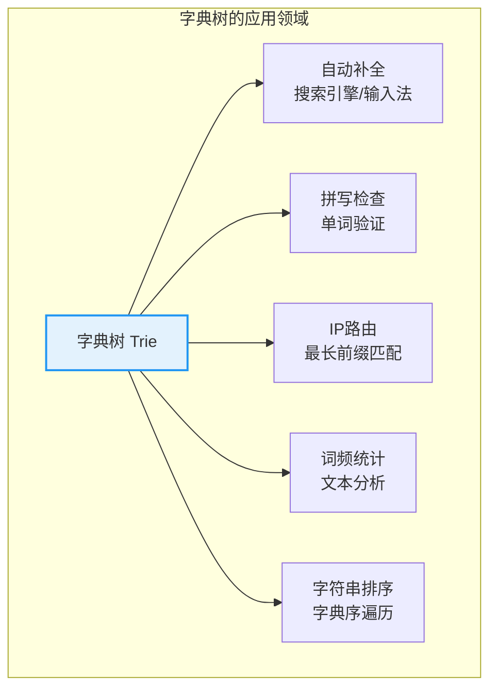
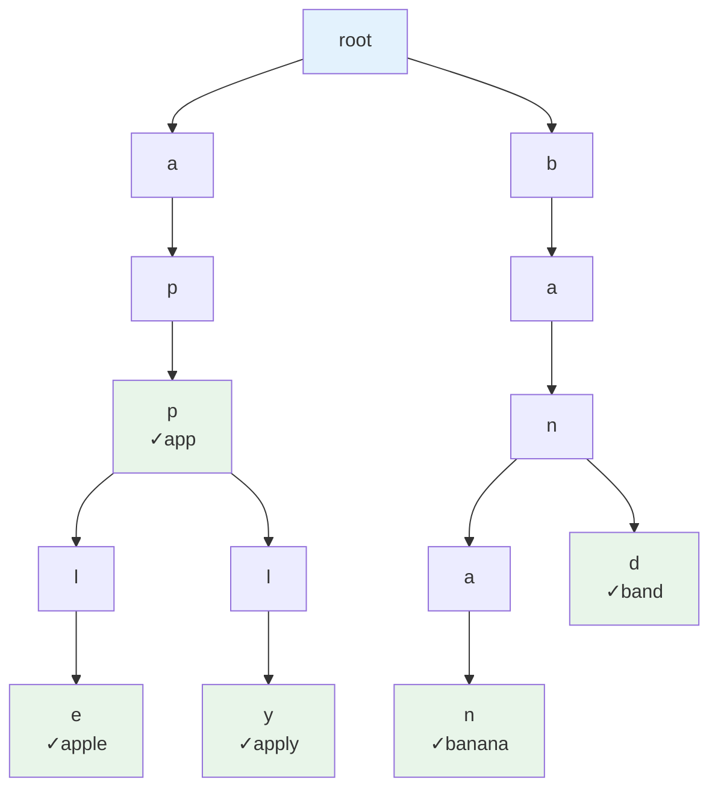
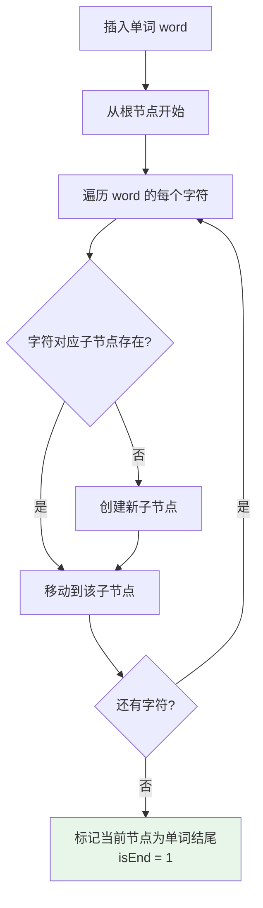
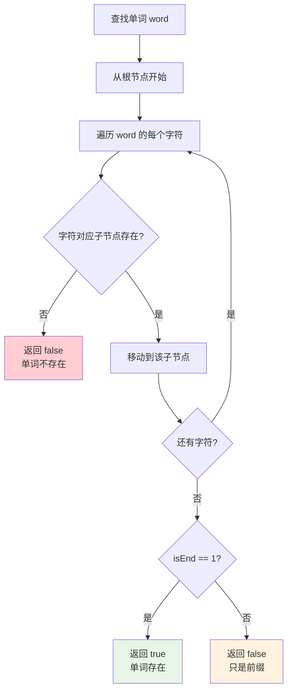
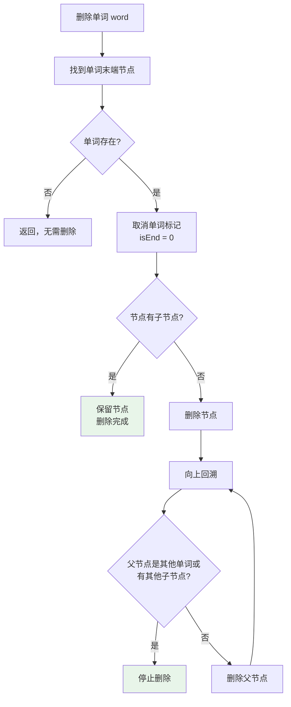
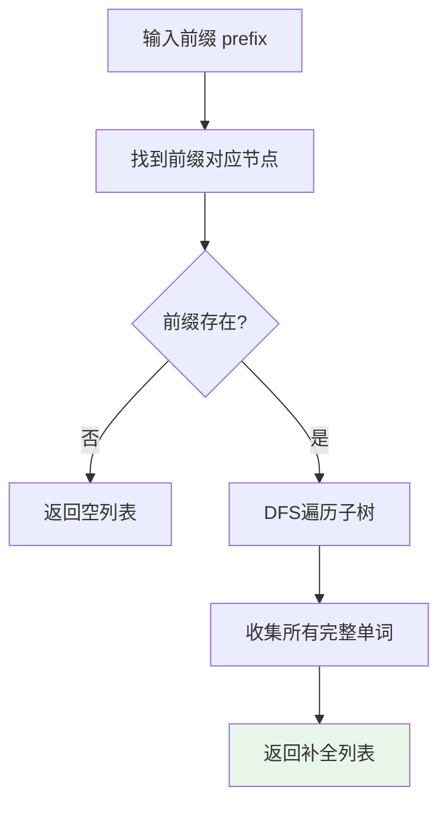

# 字典树（Trie）

## 概述

字典树（Trie，又称前缀树）是一种树形数据结构，专门用于高效存储和检索**字符串集合**。它利用字符串的公共前缀来减少存储空间和查询时间，广泛应用于自动补全、拼写检查、IP路由等场景。

<div style="background-color: #E3F2FD; border-left: 4px solid #2196F3; padding: 12px; margin: 10px 0;">
<strong>核心思想：</strong>字典树通过<strong>共享公共前缀</strong>来节省存储空间。每个节点代表一个字符，从根到节点的路径代表一个字符串前缀。查找、插入的时间复杂度仅与字符串长度有关，与字典大小无关。
</div>

### 字典树的重要性



## Trie 结构详解

### 结构图示

存储字符串集合 `{app, apple, apply, banana, band}` 的字典树：



<div style="background-color: #E8F5E9; border-left: 4px solid #4CAF50; padding: 12px; margin: 10px 0;">
<strong>✓ 标记：</strong>表示该节点是一个单词的结束。例如 p2 节点标记表示 "app" 是一个完整单词，而不仅仅是其他单词的前缀。
</div>

### 节点结构

每个 Trie 节点包含：
- **子节点数组**：指向下一层字符的指针（如 26 个字母）
- **结束标记**：标识从根到此节点是否构成单词

**节点结构定义：**

```c
struct TrieNode {
    TrieNode* children[26];  // 子节点指针数组
    bool isEnd;              // 是否是单词结尾
    // 可选字段:
    // int count;    // 单词出现次数
    // void* value;  // 关联数据
};
```

<div style="background-color: #F5F5F5; border-radius: 8px; padding: 20px; margin: 10px 0;">
<p style="margin: 0 0 10px 0;"><strong>内存布局示例（小写字母）：</strong></p>
<table style="width: 100%; border-collapse: collapse; margin: 0;">
<tr style="background-color: #E3F2FD;">
<td style="padding: 8px; border: 1px solid #ddd;"><strong>TrieNode</strong></td>
</tr>
<tr>
<td style="padding: 8px; border: 1px solid #ddd;">children[0]: → 'a' 子节点</td>
</tr>
<tr>
<td style="padding: 8px; border: 1px solid #ddd;">children[1]: → 'b' 子节点</td>
</tr>
<tr>
<td style="padding: 8px; border: 1px solid #ddd;">children[2]: NULL (没有 'c' 开头的)</td>
</tr>
<tr>
<td style="padding: 8px; border: 1px solid #ddd;">...</td>
</tr>
<tr>
<td style="padding: 8px; border: 1px solid #ddd;">children[25]: → 'z' 子节点</td>
</tr>
<tr>
<td style="padding: 8px; border: 1px solid #ddd;">isEnd: 0 或 1</td>
</tr>
</table>
</div>

## Trie 特点

| 特点 | 说明 | 优势 |
|------|------|------|
| **公共前缀共享** | 前缀相同的单词共享节点 | 节省空间 |
| **高效查找** | O(m) 查找，m 为字符串长度 | 与字典大小无关 |
| **空间换时间** | 每个节点存储多个指针 | 查找快速 |
| **前缀匹配** | 天然支持前缀操作 | 自动补全友好 |

## 核心操作详解

### 1. 插入操作



**插入示例：插入 "apple"**

<div style="background-color: #F5F5F5; border-radius: 8px; padding: 20px; margin: 10px 0;">
<p style="margin: 0 0 10px 0; color: #666;"><em>初始状态：空Trie，只有根节点</em></p>

<p style="margin: 10px 0 5px 0;"><strong>步骤1：处理字符 'a'</strong></p>
<p style="margin: 0 0 10px 20px; color: #666;">root 没有子节点 'a'，创建 → 当前位置: root → a</p>

<p style="margin: 10px 0 5px 0;"><strong>步骤2：处理字符 'p'</strong></p>
<p style="margin: 0 0 10px 20px; color: #666;">节点 'a' 没有子节点 'p'，创建 → 当前位置: root → a → p</p>

<p style="margin: 10px 0 5px 0;"><strong>步骤3：处理字符 'p'</strong></p>
<p style="margin: 0 0 10px 20px; color: #666;">节点 'p' 没有子节点 'p'，创建 → 当前位置: root → a → p → p</p>

<p style="margin: 10px 0 5px 0;"><strong>步骤4：处理字符 'l'</strong></p>
<p style="margin: 0 0 10px 20px; color: #666;">节点 'p' 没有子节点 'l'，创建 → 当前位置: root → a → p → p → l</p>

<p style="margin: 10px 0 5px 0;"><strong>步骤5：处理字符 'e'</strong></p>
<p style="margin: 0 0 10px 20px; color: #666;">节点 'l' 没有子节点 'e'，创建 → 当前位置: root → a → p → p → l → e</p>
<p style="margin: 0 0 10px 20px; color: #666;">标记 isEnd = 1</p>

<div style="background-color: #E8F5E9; border-left: 4px solid #4CAF50; padding: 10px; margin-top: 10px;">
<strong>✓ 完成！</strong>"apple" 已插入字典树
</div>
</div>

```c
void insert(Trie *trie, const char *word) {
    TrieNode *curr = trie->root;
    
    for (int i = 0; word[i]; i++) {
        int index = word[i] - 'a';  // 计算字符索引
        
        if (curr->children[index] == NULL) {
            curr->children[index] = createNode();  // 创建新节点
        }
        
        curr = curr->children[index];  // 移动到子节点
    }
    
    curr->isEnd = 1;  // 标记单词结束
}
```

### 2. 查找操作



```c
int search(Trie *trie, const char *word) {
    TrieNode *curr = trie->root;
    
    for (int i = 0; word[i]; i++) {
        int index = word[i] - 'a';
        
        if (curr->children[index] == NULL) {
            return 0;  // 字符不存在，单词不存在
        }
        
        curr = curr->children[index];
    }
    
    return curr->isEnd;  // 返回是否是完整单词
}
```

### 3. 前缀匹配

检查是否存在以某前缀开头的单词：

```c
int startsWith(Trie *trie, const char *prefix) {
    TrieNode *curr = trie->root;
    
    for (int i = 0; prefix[i]; i++) {
        int index = prefix[i] - 'a';
        
        if (curr->children[index] == NULL) {
            return 0;  // 前缀不存在
        }
        
        curr = curr->children[index];
    }
    
    return 1;  // 前缀存在
}
```

### 4. 删除操作

删除操作需要考虑多种情况：



```c
int isEmpty(TrieNode *node) {
    for (int i = 0; i < ALPHABET_SIZE; i++) {
        if (node->children[i] != NULL) {
            return 0;
        }
    }
    return 1;
}

TrieNode* delete(TrieNode *node, const char *word, int depth) {
    if (node == NULL) return NULL;
    
    // 到达单词末端
    if (word[depth] == '\0') {
        if (node->isEnd) {
            node->isEnd = 0;  // 取消单词标记
        }
        
        // 如果节点无子节点，可以删除
        if (isEmpty(node)) {
            free(node);
            node = NULL;
        }
        
        return node;
    }
    
    // 递归删除
    int index = word[depth] - 'a';
    node->children[index] = delete(node->children[index], word, depth + 1);
    
    // 回溯时检查是否可以删除当前节点
    if (isEmpty(node) && !node->isEnd) {
        free(node);
        node = NULL;
    }
    
    return node;
}
```

## 可视化演示

### 完整操作示例

<div style="background-color: #F5F5F5; border-radius: 8px; padding: 20px; margin: 10px 0;">
<p style="margin: 0 0 10px 0;"><strong>操作序列：</strong></p>
<p style="margin: 0 0 15px 0; color: #666;">insert("app"), insert("apple"), insert("apply"), search("app"), search("ap"), startsWith("app")</p>

<div style="background-color: #E3F2FD; border-left: 4px solid #2196F3; padding: 10px; margin: 10px 0;">
<strong>insert("app")</strong>
</div>
<p style="margin: 5px 0 10px 0; font-family: monospace; color: #666;">root → a → p → p<sup style="color: #4CAF50;">*</sup></p>
<p style="margin: 0 0 15px 20px; color: #999;">isEnd=1，标记为单词结尾</p>

<div style="background-color: #E3F2FD; border-left: 4px solid #2196F3; padding: 10px; margin: 10px 0;">
<strong>insert("apple") - 共享前缀 "app"</strong>
</div>
<p style="margin: 5px 0 10px 0; font-family: monospace; color: #666;">root → a → p → p<sup style="color: #4CAF50;">*</sup> → l → e<sup style="color: #4CAF50;">*</sup></p>
<p style="margin: 0 0 15px 20px; color: #999;">共享节点 "app"，不重复创建</p>

<div style="background-color: #E3F2FD; border-left: 4px solid #2196F3; padding: 10px; margin: 10px 0;">
<strong>insert("apply") - 共享前缀 "appl"</strong>
</div>
<p style="margin: 5px 0 10px 0; font-family: monospace; color: #666;">root → a → p → p<sup style="color: #4CAF50;">*</sup> → l → e<sup style="color: #4CAF50;">*</sup></p>
<p style="margin: 0 0 5px 0; font-family: monospace; color: #666;">&nbsp;&nbsp;&nbsp;&nbsp;&nbsp;&nbsp;&nbsp;&nbsp;&nbsp;&nbsp;&nbsp;&nbsp;&nbsp;&nbsp;&nbsp;&nbsp;&nbsp;&nbsp;&nbsp;&nbsp;&nbsp;└ → y<sup style="color: #4CAF50;">*</sup></p>

<div style="background-color: #E8F5E9; border-left: 4px solid #4CAF50; padding: 10px; margin: 15px 0;">
<p style="margin: 0;"><strong>查询结果：</strong></p>
<p style="margin: 5px 0 0 0; color: #666;">• search("app") = <strong style="color: #4CAF50;">true</strong> (isEnd=1)</p>
<p style="margin: 5px 0 0 0; color: #666;">• search("ap") = <strong style="color: #F44336;">false</strong> (isEnd=0，只是前缀)</p>
<p style="margin: 5px 0 0 0; color: #666;">• startsWith("app") = <strong style="color: #4CAF50;">true</strong></p>
</div>
</div>

## 自动补全功能



```c
void collectWords(TrieNode *node, char *prefix, int depth, 
                  char result[][100], int *count) {
    // 当前节点是单词结束，添加到结果
    if (node->isEnd) {
        prefix[depth] = '\0';
        strcpy(result[*count], prefix);
        (*count)++;
    }
    
    // 递归收集所有子树中的单词
    for (int i = 0; i < ALPHABET_SIZE; i++) {
        if (node->children[i] != NULL) {
            prefix[depth] = 'a' + i;
            collectWords(node->children[i], prefix, depth + 1, result, count);
        }
    }
}

int autocomplete(Trie *trie, const char *prefix, char result[][100]) {
    // 找到前缀对应节点
    TrieNode *curr = trie->root;
    for (int i = 0; prefix[i]; i++) {
        int index = prefix[i] - 'a';
        if (curr->children[index] == NULL) {
            return 0;  // 前缀不存在
        }
        curr = curr->children[index];
    }
    
    // 收集所有以 prefix 开头的单词
    char buffer[100];
    strcpy(buffer, prefix);
    int count = 0;
    collectWords(curr, buffer, strlen(prefix), result, &count);
    return count;
}
```

**自动补全示例：**

<div style="background-color: #F5F5F5; border-radius: 8px; padding: 20px; margin: 10px 0;">
<p style="margin: 0 0 10px 0;"><strong>Trie 包含：</strong>{app, apple, apply, application}</p>

<table style="width: 100%; border-collapse: collapse; margin-top: 10px;">
<tr style="background-color: #E3F2FD;">
<th style="padding: 10px; border: 1px solid #ddd; text-align: left;">输入前缀</th>
<th style="padding: 10px; border: 1px solid #ddd; text-align: left;">补全结果</th>
</tr>
<tr>
<td style="padding: 10px; border: 1px solid #ddd; font-family: monospace;">"app"</td>
<td style="padding: 10px; border: 1px solid #ddd;">["app", "apple", "apply", "application"]</td>
</tr>
<tr>
<td style="padding: 10px; border: 1px solid #ddd; font-family: monospace;">"appl"</td>
<td style="padding: 10px; border: 1px solid #ddd;">["apple", "apply", "application"]</td>
</tr>
<tr>
<td style="padding: 10px; border: 1px solid #ddd; font-family: monospace;">"appli"</td>
<td style="padding: 10px; border: 1px solid #ddd;">["application"]</td>
</tr>
</table>
</div>

## C++ 实现

```cpp
#include <string>
#include <vector>
#include <memory>

class Trie {
private:
    struct Node {
        std::vector<std::unique_ptr<Node>> children;
        bool isEnd;
        Node() : children(26), isEnd(false) {}
    };
    
    std::unique_ptr<Node> root;
    
    void collectAll(Node* node, std::string& prefix, std::vector<std::string>& result) {
        if (node->isEnd) result.push_back(prefix);
        for (int i = 0; i < 26; i++) {
            if (node->children[i]) {
                prefix.push_back('a' + i);
                collectAll(node->children[i].get(), prefix, result);
                prefix.pop_back();
            }
        }
    }
    
public:
    Trie() : root(std::make_unique<Node>()) {}
    
    void insert(const std::string& word) {
        Node* curr = root.get();
        for (char c : word) {
            int index = c - 'a';
            if (!curr->children[index]) {
                curr->children[index] = std::make_unique<Node>();
            }
            curr = curr->children[index].get();
        }
        curr->isEnd = true;
    }
    
    bool search(const std::string& word) {
        Node* curr = root.get();
        for (char c : word) {
            int index = c - 'a';
            if (!curr->children[index]) return false;
            curr = curr->children[index].get();
        }
        return curr->isEnd;
    }
    
    bool startsWith(const std::string& prefix) {
        Node* curr = root.get();
        for (char c : prefix) {
            int index = c - 'a';
            if (!curr->children[index]) return false;
            curr = curr->children[index].get();
        }
        return true;
    }
    
    std::vector<std::string> autocomplete(const std::string& prefix) {
        Node* curr = root.get();
        for (char c : prefix) {
            int index = c - 'a';
            if (!curr->children[index]) return {};
            curr = curr->children[index].get();
        }
        
        std::vector<std::string> result;
        std::string p = prefix;
        collectAll(curr, p, result);
        return result;
    }
};
```

## 复杂度分析

| 操作 | 时间复杂度 | 空间复杂度 | 说明 |
|------|-----------|-----------|------|
| **插入** | O(m) | O(m) | m 为字符串长度 |
| **查找** | O(m) | O(1) | 不需要额外空间 |
| **删除** | O(m) | O(1) | 可能删除多个节点 |
| **前缀匹配** | O(m) | O(1) | 同查找 |
| **自动补全** | O(m + k) | O(k) | k 为补全结果数量 |

**空间复杂度分析：**

<div style="background-color: #F5F5F5; border-radius: 8px; padding: 20px; margin: 10px 0;">
<table style="width: 100%; border-collapse: collapse;">
<tr style="background-color: #E3F2FD;">
<th style="padding: 10px; border: 1px solid #ddd; text-align: left;">情况</th>
<th style="padding: 10px; border: 1px solid #ddd; text-align: left;">空间复杂度</th>
<th style="padding: 10px; border: 1px solid #ddd; text-align: left;">说明</th>
</tr>
<tr>
<td style="padding: 10px; border: 1px solid #ddd;"><strong>最坏情况</strong></td>
<td style="padding: 10px; border: 1px solid #ddd;">O(N × M × 26)</td>
<td style="padding: 10px; border: 1px solid #ddd;">所有字符串无公共前缀</td>
</tr>
<tr>
<td style="padding: 10px; border: 1px solid #ddd;"><strong>最好情况</strong></td>
<td style="padding: 10px; border: 1px solid #ddd;">O(M × 26)</td>
<td style="padding: 10px; border: 1px solid #ddd;">所有字符串共享前缀</td>
</tr>
</table>
<p style="margin: 10px 0 0 0; color: #666;"><strong>N</strong> = 字符串数量，<strong>M</strong> = 最大字符串长度</p>
<p style="margin: 5px 0 0 0; color: #666;">实际应用中，公共前缀使得空间效率较高</p>
</div>

## 应用场景

| 应用 | 说明 | 优势 |
|------|------|------|
| **自动补全** | 搜索引擎、IDE、输入法 | 实时响应前缀查询 |
| **拼写检查** | 检查单词是否存在 | O(m) 快速验证 |
| **IP路由** | 最长前缀匹配 | 高效路由查找 |
| **词频统计** | 统计单词出现次数 | 节点存储计数 |
| **字符串排序** | 字典序遍历 | DFS 自然有序 |
| **敏感词过滤** | 快速匹配敏感词 | 前缀匹配 |

## 参考资料

- 《算法导论》字符串匹配章节
- 《数据结构与算法分析》第12章
- [Wikipedia - Trie](https://en.wikipedia.org/wiki/Trie)
