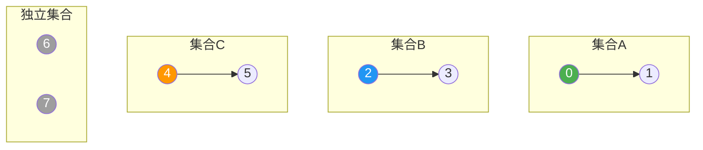
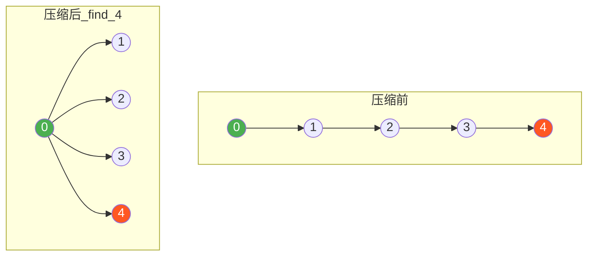
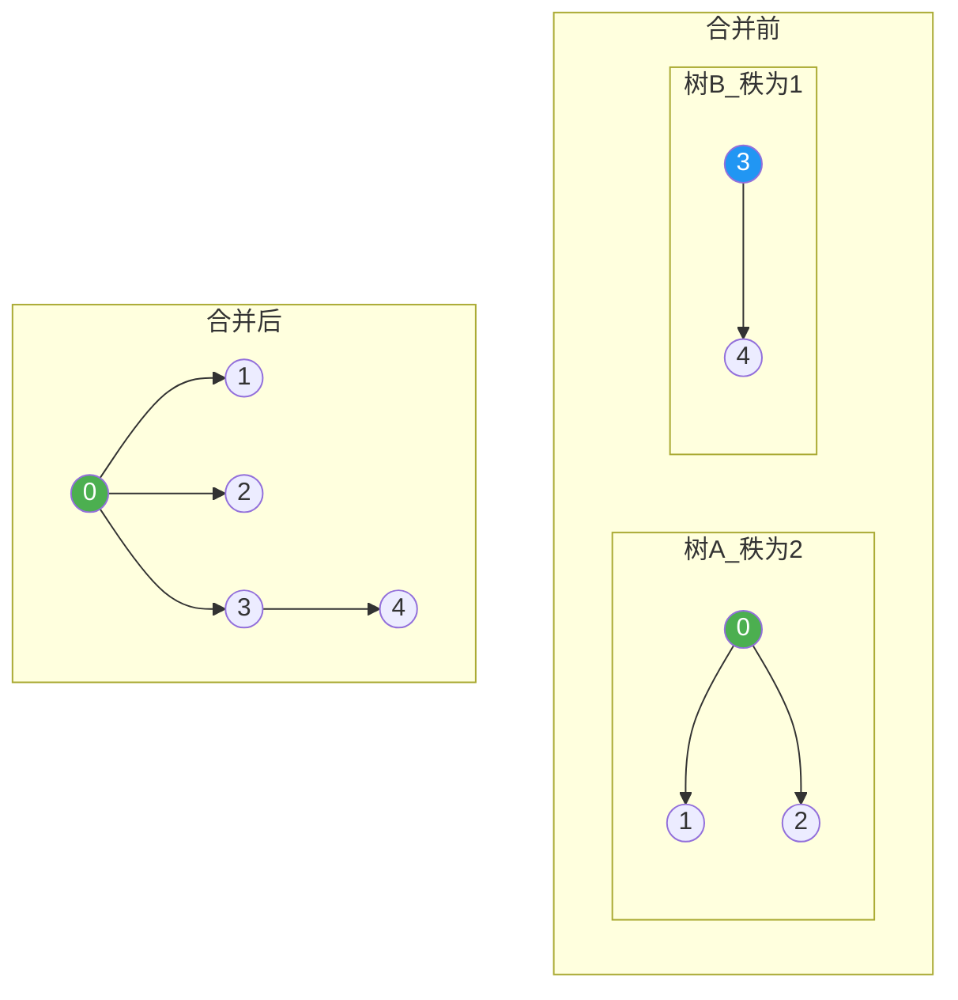
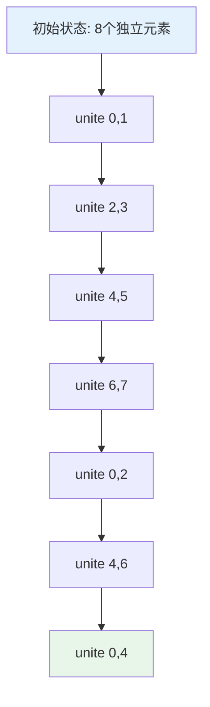
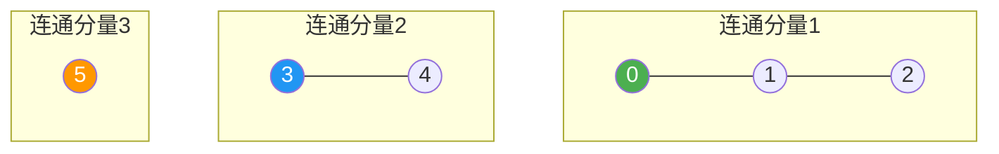
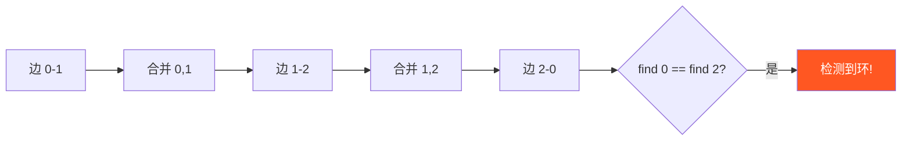
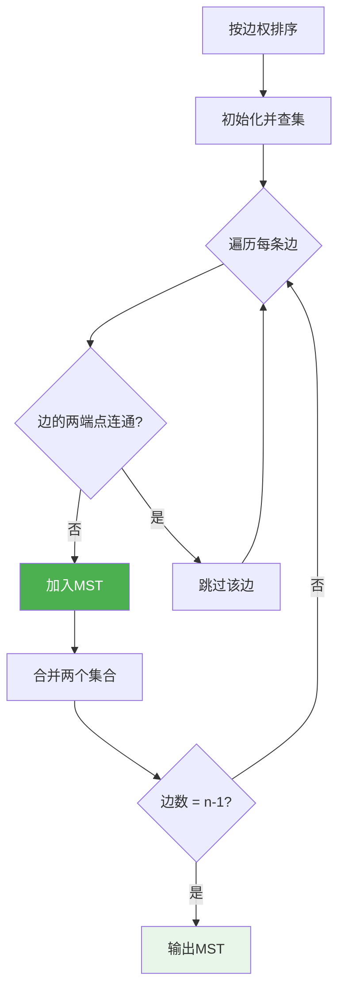
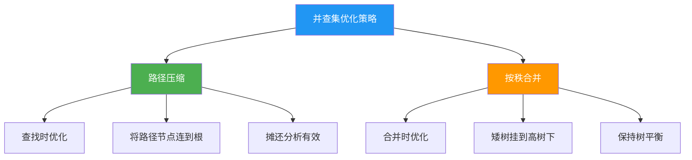

# 并查集

## 概述

并查集（Disjoint Set Union，DSU）是一种树形数据结构，专门用于处理不相交集合的合并与查询问题。它支持高效判断元素是否属于同一集合，是解决动态连通性问题的利器。

<div style="background: #E3F2FD; border-left: 4px solid #2196F3; padding: 12px; margin: 10px 0;">
<strong>核心思想</strong>：将每个集合表示为一棵树，树的根节点作为集合的唯一标识。通过查找根节点判断元素所属集合，通过连接两棵树的根实现集合合并。
</div>

## 并查集特点

| 特性 | 说明 |
|------|------|
| 集合表示 | 每个集合用一棵树表示，根节点为集合代表 |
| 查找操作 | 找到元素所在集合的根（代表元素） |
| 合并操作 | 将两个集合合并为一个集合 |
| 路径压缩 | 查找时将路径上所有节点直接连到根 |
| 按秩合并 | 合并时将矮树挂到高树下 |

## 数据结构可视化

### 初始状态

每个元素自成一个集合，父指针指向自己：

<div style="background-color: #F5F5F5; border-radius: 8px; padding: 20px; margin: 10px 0;">
<p style="margin: 0 0 10px 0;"><strong>数组表示：</strong></p>
<table style="width: 100%; border-collapse: collapse; margin-bottom: 10px;">
<tr style="background-color: #E3F2FD;">
<th style="padding: 8px; border: 1px solid #ddd;">索引</th>
<td style="padding: 8px; border: 1px solid #ddd; text-align: center;">0</td>
<td style="padding: 8px; border: 1px solid #ddd; text-align: center;">1</td>
<td style="padding: 8px; border: 1px solid #ddd; text-align: center;">2</td>
<td style="padding: 8px; border: 1px solid #ddd; text-align: center;">3</td>
<td style="padding: 8px; border: 1px solid #ddd; text-align: center;">4</td>
<td style="padding: 8px; border: 1px solid #ddd; text-align: center;">5</td>
<td style="padding: 8px; border: 1px solid #ddd; text-align: center;">6</td>
<td style="padding: 8px; border: 1px solid #ddd; text-align: center;">7</td>
</tr>
<tr>
<th style="padding: 8px; border: 1px solid #ddd; background-color: #E3F2FD;">parent</th>
<td style="padding: 8px; border: 1px solid #ddd; text-align: center;">0</td>
<td style="padding: 8px; border: 1px solid #ddd; text-align: center;">1</td>
<td style="padding: 8px; border: 1px solid #ddd; text-align: center;">2</td>
<td style="padding: 8px; border: 1px solid #ddd; text-align: center;">3</td>
<td style="padding: 8px; border: 1px solid #ddd; text-align: center;">4</td>
<td style="padding: 8px; border: 1px solid #ddd; text-align: center;">5</td>
<td style="padding: 8px; border: 1px solid #ddd; text-align: center;">6</td>
<td style="padding: 8px; border: 1px solid #ddd; text-align: center;">7</td>
</tr>
<tr>
<th style="padding: 8px; border: 1px solid #ddd; background-color: #E3F2FD;">rank</th>
<td style="padding: 8px; border: 1px solid #ddd; text-align: center;">0</td>
<td style="padding: 8px; border: 1px solid #ddd; text-align: center;">0</td>
<td style="padding: 8px; border: 1px solid #ddd; text-align: center;">0</td>
<td style="padding: 8px; border: 1px solid #ddd; text-align: center;">0</td>
<td style="padding: 8px; border: 1px solid #ddd; text-align: center;">0</td>
<td style="padding: 8px; border: 1px solid #ddd; text-align: center;">0</td>
<td style="padding: 8px; border: 1px solid #ddd; text-align: center;">0</td>
<td style="padding: 8px; border: 1px solid #ddd; text-align: center;">0</td>
</tr>
</table>
<p style="margin: 0; color: #666;"><strong>树形结构：</strong>每个元素独立，自成一棵单节点树</p>
</div>

### 合并操作可视化

执行合并操作 `unite(0, 1)`, `unite(2, 3)`, `unite(4, 5)`：



### 路径压缩原理

查找元素时，将路径上所有节点直接连接到根节点：



<div style="background: #E8F5E9; border-left: 4px solid #4CAF50; padding: 12px; margin: 10px 0;">
<strong>路径压缩效果</strong>：查找节点 4 后，节点 1、2、3、4 都直接连接到根节点 0，后续查找这些节点的时间复杂度降为 O(1)。
</div>

### 按秩合并原理

合并时将秩（树高）较小的树挂到秩较大的树下：



## 基本实现

### 数据结构定义

```c
typedef struct {
    int *parent;    // 父节点数组，parent[i]表示节点i的父节点
    int *rank;      // 秩数组，rank[i]表示以i为根的树的高度
    int n;          // 元素个数
} UnionFind;
```

### 初始化

```c
UnionFind* createUF(int n) {
    UnionFind *uf = (UnionFind*)malloc(sizeof(UnionFind));
    uf->parent = (int*)malloc(sizeof(int) * n);
    uf->rank = (int*)calloc(n, sizeof(int));
    uf->n = n;
    
    // 初始时每个元素的父节点是自己
    for (int i = 0; i < n; i++) {
        uf->parent[i] = i;
    }
    
    return uf;
}
```

### 基本查找（无优化）

```c
int find(UnionFind *uf, int x) {
    while (uf->parent[x] != x) {
        x = uf->parent[x];
    }
    return x;
}
```

### 基本合并

```c
void unite(UnionFind *uf, int x, int y) {
    int rootX = find(uf, x);
    int rootY = find(uf, y);
    
    if (rootX != rootY) {
        uf->parent[rootX] = rootY;
    }
}
```

### 连通性判断

```c
int connected(UnionFind *uf, int x, int y) {
    return find(uf, x) == find(uf, y);
}
```

## 路径压缩优化

### 递归实现

```c
int findCompressed(UnionFind *uf, int x) {
    if (uf->parent[x] != x) {
        uf->parent[x] = findCompressed(uf, uf->parent[x]);
    }
    return uf->parent[x];
}
```

**执行过程示例**（查找节点 4）：

<div style="background-color: #F5F5F5; border-radius: 8px; padding: 20px; margin: 10px 0;">
<p style="margin: 0 0 10px 0;"><strong>初始状态：</strong>parent = [0, 0, 1, 2, 3] （链状结构 0←1←2←3←4）</p>

<div style="background-color: #E3F2FD; border-left: 4px solid #2196F3; padding: 10px; margin: 10px 0;">
<p style="margin: 0;"><strong>递归调用栈：</strong></p>
</div>
<pre style="margin: 10px 0; padding: 10px; background-color: #fff; border-radius: 4px; overflow-x: auto;">
findCompressed(4)
  → findCompressed(3)  // parent[4]=3
    → findCompressed(2)  // parent[3]=2
      → findCompressed(1)  // parent[2]=1
        → findCompressed(0)  // parent[1]=0
        → 返回 0
      → parent[1] = 0, 返回 0
    → parent[2] = 0, 返回 0
  → parent[3] = 0, 返回 0
→ parent[4] = 0, 返回 0
</pre>

<div style="background-color: #E8F5E9; border-left: 4px solid #4CAF50; padding: 10px; margin-top: 10px;">
<p style="margin: 0;"><strong>最终状态：</strong>parent = [0, 0, 0, 0, 0]</p>
<p style="margin: 5px 0 0 0; color: #666;">所有节点直接连到根，路径压缩完成</p>
</div>
</div>

### 迭代实现（两次遍历）

```c
int findIterative(UnionFind *uf, int x) {
    // 第一次遍历：找到根节点
    int root = x;
    while (uf->parent[root] != root) {
        root = uf->parent[root];
    }
    
    // 第二次遍历：路径压缩
    while (uf->parent[x] != root) {
        int next = uf->parent[x];
        uf->parent[x] = root;
        x = next;
    }
    
    return root;
}
```

## 按秩合并优化

```c
void uniteByRank(UnionFind *uf, int x, int y) {
    int rootX = findCompressed(uf, x);
    int rootY = findCompressed(uf, y);
    
    if (rootX == rootY) return;  // 已在同一集合
    
    // 按秩合并：将矮树挂到高树下
    if (uf->rank[rootX] < uf->rank[rootY]) {
        uf->parent[rootX] = rootY;
    } else if (uf->rank[rootX] > uf->rank[rootY]) {
        uf->parent[rootY] = rootX;
    } else {
        // 秩相等时，任选一个作为根，秩加1
        uf->parent[rootY] = rootX;
        uf->rank[rootX]++;
    }
}
```

**按秩合并过程示例**：

<div style="background-color: #F5F5F5; border-radius: 8px; padding: 20px; margin: 10px 0;">
<p style="margin: 0 0 10px 0;"><strong>初始：两个秩为1的树</strong></p>
<pre style="margin: 10px 0; padding: 10px; background-color: #fff; border-radius: 4px;">
  0           3
  |           |
  1           4
</pre>

<div style="background-color: #E3F2FD; border-left: 4px solid #2196F3; padding: 10px; margin: 10px 0;">
<p style="margin: 0;"><strong>合并 uniteByRank(0, 3)：</strong></p>
</div>
<p style="margin: 5px 0 0 0; color: #666;">• rank[0] = 1, rank[3] = 1 （秩相等）</p>
<p style="margin: 5px 0 0 0; color: #666;">• parent[3] = 0 （将树3挂到树0下）</p>
<p style="margin: 5px 0 0 0; color: #666;">• rank[0]++ = 2 （根的秩加1）</p>

<div style="background-color: #E8F5E9; border-left: 4px solid #4CAF50; padding: 10px; margin-top: 10px;">
<p style="margin: 0;"><strong>结果：</strong></p>
</div>
<pre style="margin: 10px 0 0 0; padding: 10px; background-color: #fff; border-radius: 4px;">
    0
   / \
  1   3
      |
      4
</pre>
</div>

## C++ 实现

```cpp
class UnionFind {
private:
    std::vector<int> parent;   // 父节点数组
    std::vector<int> rank_;    // 秩数组
    int count_;                // 连通分量个数
    
public:
    UnionFind(int n) : parent(n), rank_(n, 0), count_(n) {
        for (int i = 0; i < n; i++) {
            parent[i] = i;
        }
    }
    
    int find(int x) {
        if (parent[x] != x) {
            parent[x] = find(parent[x]);  // 路径压缩
        }
        return parent[x];
    }
    
    void unite(int x, int y) {
        int rootX = find(x);
        int rootY = find(y);
        
        if (rootX == rootY) return;
        
        // 按秩合并
        if (rank_[rootX] < rank_[rootY]) {
            parent[rootX] = rootY;
        } else if (rank_[rootX] > rank_[rootY]) {
            parent[rootY] = rootX;
        } else {
            parent[rootY] = rootX;
            rank_[rootX]++;
        }
        
        count_--;
    }
    
    bool connected(int x, int y) {
        return find(x) == find(y);
    }
    
    int count() const { return count_; }
};
```

## 操作过程可视化

### 完整操作流程



### 操作后数据状态

<div style="background-color: #F5F5F5; border-radius: 8px; padding: 20px; margin: 10px 0;">
<p style="margin: 0 0 10px 0;"><strong>操作序列：</strong>unite(0,1), unite(2,3), unite(0,2), unite(4,5), unite(0,4)</p>

<div style="background-color: #E8F5E9; border-left: 4px solid #4CAF50; padding: 10px; margin: 10px 0;">
<p style="margin: 0;"><strong>最终状态：</strong></p>
</div>

<table style="width: 100%; border-collapse: collapse; margin-bottom: 10px;">
<tr style="background-color: #E3F2FD;">
<th style="padding: 8px; border: 1px solid #ddd;">数组</th>
<td style="padding: 8px; border: 1px solid #ddd; text-align: center;">0</td>
<td style="padding: 8px; border: 1px solid #ddd; text-align: center;">1</td>
<td style="padding: 8px; border: 1px solid #ddd; text-align: center;">2</td>
<td style="padding: 8px; border: 1px solid #ddd; text-align: center;">3</td>
<td style="padding: 8px; border: 1px solid #ddd; text-align: center;">4</td>
<td style="padding: 8px; border: 1px solid #ddd; text-align: center;">5</td>
<td style="padding: 8px; border: 1px solid #ddd; text-align: center;">6</td>
<td style="padding: 8px; border: 1px solid #ddd; text-align: center;">7</td>
</tr>
<tr>
<th style="padding: 8px; border: 1px solid #ddd; background-color: #E3F2FD;">parent</th>
<td style="padding: 8px; border: 1px solid #ddd; text-align: center;">0</td>
<td style="padding: 8px; border: 1px solid #ddd; text-align: center;">0</td>
<td style="padding: 8px; border: 1px solid #ddd; text-align: center;">0</td>
<td style="padding: 8px; border: 1px solid #ddd; text-align: center;">2</td>
<td style="padding: 8px; border: 1px solid #ddd; text-align: center;">0</td>
<td style="padding: 8px; border: 1px solid #ddd; text-align: center;">4</td>
<td style="padding: 8px; border: 1px solid #ddd; text-align: center;">4</td>
<td style="padding: 8px; border: 1px solid #ddd; text-align: center;">6</td>
</tr>
<tr>
<th style="padding: 8px; border: 1px solid #ddd; background-color: #E3F2FD;">rank</th>
<td style="padding: 8px; border: 1px solid #ddd; text-align: center;">2</td>
<td style="padding: 8px; border: 1px solid #ddd; text-align: center;">0</td>
<td style="padding: 8px; border: 1px solid #ddd; text-align: center;">1</td>
<td style="padding: 8px; border: 1px solid #ddd; text-align: center;">0</td>
<td style="padding: 8px; border: 1px solid #ddd; text-align: center;">1</td>
<td style="padding: 8px; border: 1px solid #ddd; text-align: center;">0</td>
<td style="padding: 8px; border: 1px solid #ddd; text-align: center;">0</td>
<td style="padding: 8px; border: 1px solid #ddd; text-align: center;">0</td>
</tr>
</table>

<p style="margin: 10px 0 5px 0;"><strong>树形结构：</strong></p>
<pre style="margin: 0; padding: 10px; background-color: #fff; border-radius: 4px;">
       0
     / | \
    1  2  4
       |  |
       3  5
</pre>
<p style="margin: 10px 0 0 0; color: #666;"><strong>说明：</strong></p>
<p style="margin: 5px 0 0 20px; color: #666;">• 节点 0 是根，秩为 2</p>
<p style="margin: 5px 0 0 20px; color: #666;">• 节点 1, 2, 4 直接连接到 0</p>
<p style="margin: 5px 0 0 20px; color: #666;">• 节点 3 连接到 2，节点 5 连接到 4</p>
</div>

## 应用场景

### 1. 连通分量计数

```c
int connectedComponents(int n, int edges[][2], int m) {
    UnionFind *uf = createUF(n);
    
    for (int i = 0; i < m; i++) {
        uniteByRank(uf, edges[i][0], edges[i][1]);
    }
    
    // 统计根节点个数
    int count = 0;
    for (int i = 0; i < n; i++) {
        if (findCompressed(uf, i) == i) {
            count++;
        }
    }
    
    return count;
}
```

**连通分量可视化**：



### 2. 环检测

```c
int hasCycle(int n, int edges[][2], int m) {
    UnionFind *uf = createUF(n);
    
    for (int i = 0; i < m; i++) {
        int u = edges[i][0];
        int v = edges[i][1];
        
        // 如果边的两个端点已在同一集合，说明存在环
        if (connected(uf, u, v)) {
            return 1;
        }
        
        uniteByRank(uf, u, v);
    }
    
    return 0;
}
```

**环检测过程**：



### 3. Kruskal 最小生成树

```c
typedef struct {
    int u, v, weight;
} Edge;

int compareEdges(const void *a, const void *b) {
    return ((Edge*)a)->weight - ((Edge*)b)->weight;
}

void kruskalMST(Edge edges[], int m, int n) {
    // 按边权排序
    qsort(edges, m, sizeof(Edge), compareEdges);
    
    UnionFind *uf = createUF(n);
    int mstWeight = 0;
    int edgeCount = 0;
    
    printf("Minimum Spanning Tree edges:\n");
    
    for (int i = 0; i < m && edgeCount < n - 1; i++) {
        int u = edges[i].u;
        int v = edges[i].v;
        
        // 不构成环则加入MST
        if (!connected(uf, u, v)) {
            uniteByRank(uf, u, v);
            printf("%d - %d: %d\n", u, v, edges[i].weight);
            mstWeight += edges[i].weight;
            edgeCount++;
        }
    }
    
    printf("Total weight: %d\n", mstWeight);
}
```

**Kruskal算法过程**：



### 4. 带权并查集

用于处理节点间存在权值关系的问题（如食物链、差分约束）：

```c
typedef struct {
    int *parent;
    int *weight;    // 节点到父节点的权值
    int n;
} WeightedUF;

WeightedUF* createWeightedUF(int n) {
    WeightedUF *uf = (WeightedUF*)malloc(sizeof(WeightedUF));
    uf->parent = (int*)malloc(sizeof(int) * n);
    uf->weight = (int*)malloc(sizeof(int) * n);
    uf->n = n;
    
    for (int i = 0; i < n; i++) {
        uf->parent[i] = i;
        uf->weight[i] = 0;
    }
    
    return uf;
}

// 带权查找，返回根节点并计算到根的总权值
int findWeighted(WeightedUF *uf, int x, int *w) {
    if (uf->parent[x] == x) {
        *w = 0;
        return x;
    }
    
    int root = findWeighted(uf, uf->parent[x], w);
    *w += uf->weight[x];  // 累加路径上的权值
    uf->weight[x] = *w - (uf->weight[uf->parent[x]] - uf->weight[x]);
    uf->parent[x] = root;
    
    return root;
}
```

## 时间复杂度分析

| 操作 | 无优化 | 仅路径压缩 | 仅按秩合并 | 路径压缩+按秩合并 |
|------|--------|-----------|-----------|------------------|
| 查找 | O(n) | O(log n) | O(log n) | O(α(n)) |
| 合并 | O(n) | O(log n) | O(log n) | O(α(n)) |
| 初始化 | O(n) | O(n) | O(n) | O(n) |

<div style="background: #FFF3E0; border-left: 4px solid #FF9800; padding: 12px; margin: 10px 0;">
<strong>反阿克曼函数 α(n)</strong>：增长极其缓慢的函数，对于实际应用中任何可能的 n 值，α(n) ≤ 4。因此，同时使用路径压缩和按秩合并的并查集，其操作时间复杂度在实际应用中可视为常数 O(1)。
</div>

### 复杂度对比

<div style="background-color: #F5F5F5; border-radius: 8px; padding: 20px; margin: 10px 0;">
<p style="margin: 0 0 10px 0;"><strong>假设：</strong>操作次数 m = 10⁶, 元素个数 n = 10⁶</p>

<table style="width: 100%; border-collapse: collapse;">
<tr style="background-color: #E3F2FD;">
<th style="padding: 10px; border: 1px solid #ddd; text-align: left;">优化策略</th>
<th style="padding: 10px; border: 1px solid #ddd; text-align: left;">时间复杂度</th>
<th style="padding: 10px; border: 1px solid #ddd; text-align: left;">实际耗时</th>
<th style="padding: 10px; border: 1px solid #ddd; text-align: left;">评估</th>
</tr>
<tr>
<td style="padding: 10px; border: 1px solid #ddd;">无优化</td>
<td style="padding: 10px; border: 1px solid #ddd;">O(m × n)</td>
<td style="padding: 10px; border: 1px solid #ddd;">10¹²</td>
<td style="padding: 10px; border: 1px solid #ddd; color: #F44336;"><strong>超时</strong></td>
</tr>
<tr>
<td style="padding: 10px; border: 1px solid #ddd;">仅路径压缩</td>
<td style="padding: 10px; border: 1px solid #ddd;">O(m × log n)</td>
<td style="padding: 10px; border: 1px solid #ddd;">≈ 2×10⁷</td>
<td style="padding: 10px; border: 1px solid #ddd; color: #FF9800;"><strong>可接受</strong></td>
</tr>
<tr>
<td style="padding: 10px; border: 1px solid #ddd;">路径压缩+按秩合并</td>
<td style="padding: 10px; border: 1px solid #ddd;">O(m × α(n))</td>
<td style="padding: 10px; border: 1px solid #ddd;">≈ 4×10⁶</td>
<td style="padding: 10px; border: 1px solid #ddd; color: #4CAF50;"><strong>极快</strong></td>
</tr>
</table>
</div>

## 空间复杂度

| 实现 | 空间复杂度 | 说明 |
|------|-----------|------|
| 基本实现 | O(n) | 仅需 parent 数组 |
| 按秩合并 | O(n) | 额外需要 rank 数组 |
| 带权并查集 | O(n) | 额外需要 weight 数组 |

## 优化策略对比



<div style="background: #E8F5E9; border-left: 4px solid #4CAF50; padding: 12px; margin: 10px 0;">
<strong>最佳实践</strong>：同时使用路径压缩和按秩合并，可以达到近乎线性的时间复杂度 O(m·α(n))，这是并查集的标准高效实现。
</div>

## 典型应用场景总结

| 应用场景 | 描述 | 时间复杂度 |
|---------|------|-----------|
| 连通分量 | 图的连通分量计数 | O(E·α(V)) |
| 最小生成树 | Kruskal 算法 | O(E·logE) |
| 环检测 | 判断无向图是否有环 | O(E·α(V)) |
| 等价类 | 划分等价关系 | O(n·α(n)) |
| 社交网络 | 朋友圈、群组划分 | O(n·α(n)) |
| 电网连接 | 动态连通性维护 | O(Q·α(n)) |
| 食物链问题 | 带权并查集应用 | O(n·α(n)) |

## 实际问题示例

### LeetCode 547. 省份数量

```cpp
int findCircleNum(vector<vector<int>>& isConnected) {
    int n = isConnected.size();
    UnionFind uf(n);
    
    for (int i = 0; i < n; i++) {
        for (int j = i + 1; j < n; j++) {
            if (isConnected[i][j]) {
                uf.unite(i, j);
            }
        }
    }
    
    return uf.count();
}
```

### LeetCode 200. 岛屿数量

```cpp
int numIslands(vector<vector<char>>& grid) {
    if (grid.empty()) return 0;
    int m = grid.size(), n = grid[0].size();
    UnionFind uf(m * n);
    int water = 0;
    
    for (int i = 0; i < m; i++) {
        for (int j = 0; j < n; j++) {
            if (grid[i][j] == '0') {
                water++;
                continue;
            }
            if (i > 0 && grid[i-1][j] == '1') 
                uf.unite(i*n+j, (i-1)*n+j);
            if (j > 0 && grid[i][j-1] == '1') 
                uf.unite(i*n+j, i*n+j-1);
        }
    }
    
    return uf.count() - water;
}
```

## 参考资料

- 《算法导论》第21章：用于不相交集合的数据结构
- 《数据结构与算法分析》第8章：不相交集合
- Tarjan, R. E. (1975). Efficiency of a Good But Not Linear Set Union Algorithm
