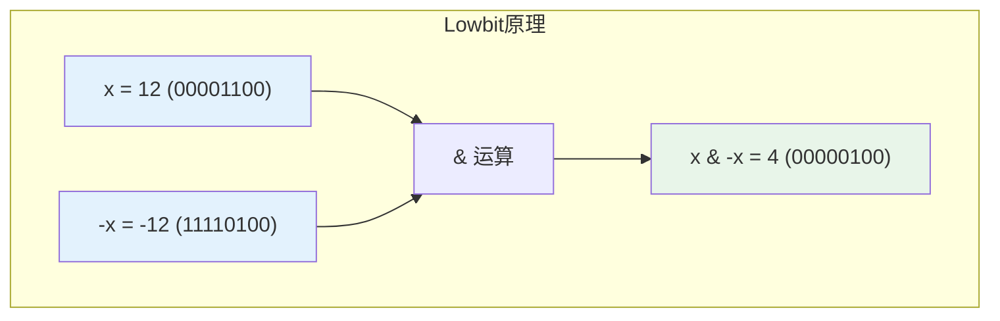
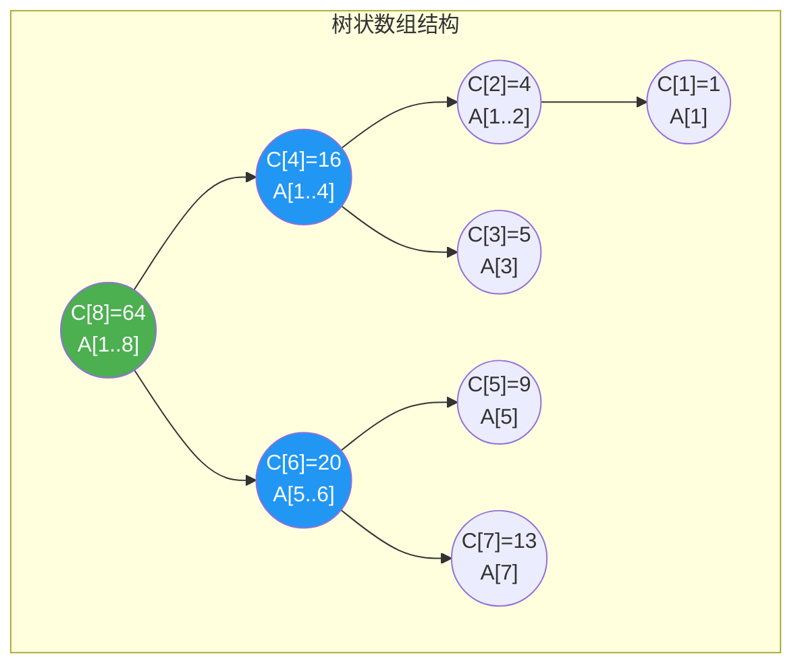
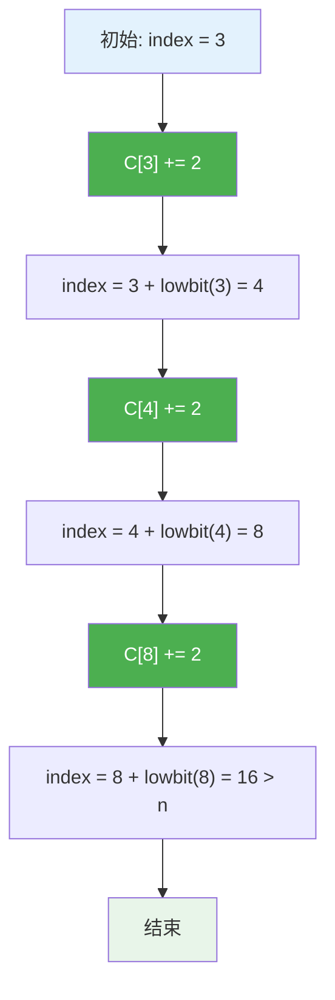
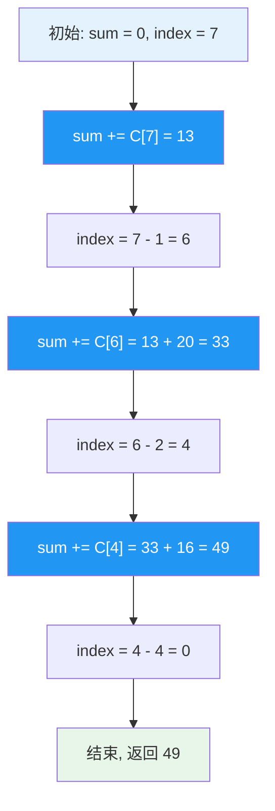
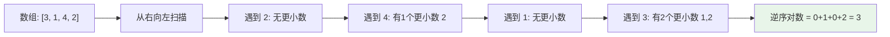
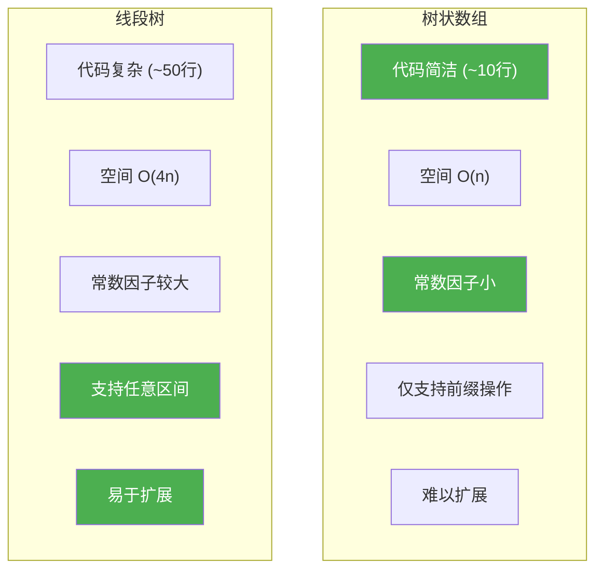

# 树状数组

## 概述

树状数组（Binary Indexed Tree，BIT），又称二叉索引树或 Fenwick Tree，是一种支持单点修改和区间查询的高效数据结构。它通过巧妙的二进制分解，将线性数组组织成树形结构，实现了 O(log n) 的更新和查询效率。

<div style="background: #E3F2FD; border-left: 4px solid #2196F3; padding: 12px; margin: 10px 0;">
<strong>核心优势</strong>：代码极其简洁（核心仅需10行左右），常数因子小，实际运行效率往往优于线段树。适用于单点修改+区间查询、区间修改+单点查询等场景。
</div>

## Lowbit 函数详解

### 定义

Lowbit 函数返回一个数二进制表示中最低位 1 代表的值：

```c
int lowbit(int x) {
    return x & (-x);
}
```

### 原理解析

利用补码特性：`-x = ~x + 1`

<div style="background-color: #F5F5F5; border-radius: 8px; padding: 20px; margin: 10px 0;">
<p style="margin: 0 0 10px 0;"><strong>计算示例：x = 12</strong></p>
<pre style="margin: 0; padding: 10px; background-color: #fff; border-radius: 4px; overflow-x: auto;">
x  = 12 = 00001100 (二进制)
~x =    = 11110011
-x =    = 11110100 (补码)

x & (-x) = 00001100 & 11110100 = 00000100 = 4
</pre>
</div>

### Lowbit 值表

<div style="background-color: #F5F5F5; border-radius: 8px; padding: 20px; margin: 10px 0;">
<table style="width: 100%; border-collapse: collapse;">
<tr style="background-color: #E3F2FD;">
<th style="padding: 10px; border: 1px solid #ddd; text-align: center;">x</th>
<th style="padding: 10px; border: 1px solid #ddd; text-align: center;">二进制</th>
<th style="padding: 10px; border: 1px solid #ddd; text-align: center;">lowbit(x)</th>
<th style="padding: 10px; border: 1px solid #ddd; text-align: left;">含义</th>
</tr>
<tr>
<td style="padding: 10px; border: 1px solid #ddd; text-align: center;">1</td>
<td style="padding: 10px; border: 1px solid #ddd; text-align: center; font-family: monospace;">0001</td>
<td style="padding: 10px; border: 1px solid #ddd; text-align: center;">1</td>
<td style="padding: 10px; border: 1px solid #ddd;">最低位是第0位</td>
</tr>
<tr>
<td style="padding: 10px; border: 1px solid #ddd; text-align: center;">2</td>
<td style="padding: 10px; border: 1px solid #ddd; text-align: center; font-family: monospace;">0010</td>
<td style="padding: 10px; border: 1px solid #ddd; text-align: center;">2</td>
<td style="padding: 10px; border: 1px solid #ddd;">最低位是第1位</td>
</tr>
<tr>
<td style="padding: 10px; border: 1px solid #ddd; text-align: center;">3</td>
<td style="padding: 10px; border: 1px solid #ddd; text-align: center; font-family: monospace;">0011</td>
<td style="padding: 10px; border: 1px solid #ddd; text-align: center;">1</td>
<td style="padding: 10px; border: 1px solid #ddd;">最低位是第0位</td>
</tr>
<tr>
<td style="padding: 10px; border: 1px solid #ddd; text-align: center;">4</td>
<td style="padding: 10px; border: 1px solid #ddd; text-align: center; font-family: monospace;">0100</td>
<td style="padding: 10px; border: 1px solid #ddd; text-align: center;">4</td>
<td style="padding: 10px; border: 1px solid #ddd;">最低位是第2位</td>
</tr>
<tr>
<td style="padding: 10px; border: 1px solid #ddd; text-align: center;">5</td>
<td style="padding: 10px; border: 1px solid #ddd; text-align: center; font-family: monospace;">0101</td>
<td style="padding: 10px; border: 1px solid #ddd; text-align: center;">1</td>
<td style="padding: 10px; border: 1px solid #ddd;">最低位是第0位</td>
</tr>
<tr>
<td style="padding: 10px; border: 1px solid #ddd; text-align: center;">6</td>
<td style="padding: 10px; border: 1px solid #ddd; text-align: center; font-family: monospace;">0110</td>
<td style="padding: 10px; border: 1px solid #ddd; text-align: center;">2</td>
<td style="padding: 10px; border: 1px solid #ddd;">最低位是第1位</td>
</tr>
<tr>
<td style="padding: 10px; border: 1px solid #ddd; text-align: center;">7</td>
<td style="padding: 10px; border: 1px solid #ddd; text-align: center; font-family: monospace;">0111</td>
<td style="padding: 10px; border: 1px solid #ddd; text-align: center;">1</td>
<td style="padding: 10px; border: 1px solid #ddd;">最低位是第0位</td>
</tr>
<tr>
<td style="padding: 10px; border: 1px solid #ddd; text-align: center;">8</td>
<td style="padding: 10px; border: 1px solid #ddd; text-align: center; font-family: monospace;">1000</td>
<td style="padding: 10px; border: 1px solid #ddd; text-align: center;">8</td>
<td style="padding: 10px; border: 1px solid #ddd;">最低位是第3位</td>
</tr>
</table>
</div>

### 可视化



## 树状数组结构

### 结构定义

树状数组将原数组 A 映射到辅助数组 C，其中：

- `C[i]` 存储 A 数组中从 `i - lowbit(i) + 1` 到 `i` 的元素和
- 即 `C[i] = A[i - lowbit(i) + 1] + ... + A[i]`

### 结构可视化

假设原数组 `A = [1, 3, 5, 7, 9, 11, 13, 15]`（索引从1开始）：

```
原数组 A:
索引:   1   2   3   4   5   6   7   8
值:    [1] [3] [5] [7] [9][11][13][15]

树状数组 C:
C[1] = A[1]                    = 1
C[2] = A[1] + A[2]             = 4
C[3] = A[3]                    = 5
C[4] = A[1] + A[2] + A[3] + A[4] = 16
C[5] = A[5]                    = 9
C[6] = A[5] + A[6]             = 20
C[7] = A[7]                    = 13
C[8] = A[1] + ... + A[8]       = 64
```

### 树形结构图



### 覆盖关系图

```
索引 i  | lowbit(i) | C[i] 覆盖范围 | 管理的A元素
--------|-----------|--------------|------------------
   1    |     1     |    [1, 1]    | A[1]
   2    |     2     |    [1, 2]    | A[1], A[2]
   3    |     1     |    [3, 3]    | A[3]
   4    |     4     |    [1, 4]    | A[1], A[2], A[3], A[4]
   5    |     1     |    [5, 5]    | A[5]
   6    |     2     |    [5, 6]    | A[5], A[6]
   7    |     1     |    [7, 7]    | A[7]
   8    |     8     |    [1, 8]    | A[1]..A[8]
```

### ASCII 内存布局

```
        索引:  0   1   2   3   4   5   6   7   8
              ┌───┬───┬───┬───┬───┬───┬───┬───┬───┐
原数组 A:     │ - │ 1 │ 3 │ 5 │ 7 │ 9 │11 │13 │15 │
              └───┴───┴───┴───┴───┴───┴───┴───┴───┘
              ┌───┬───┬───┬───┬───┬───┬───┬───┬───┐
树状数组 C:   │ - │ 1 │ 4 │ 5 │16 │ 9 │20 │13 │64 │
              └───┴───┴───┴───┴───┴───┴───┴───┴───┘
                ↑   ↑   ↑   ↑   ↑   ↑   ↑   ↑   ↑
               不用 │   │   │   │   │   │   │   │
                   └───┼───┘   │   │   │   │   │
                      C[2]    └───┼───┘   │   │
                     覆盖2个      C[4]    └───┼───┘
                     元素       覆盖4个      C[8]
                                元素        覆盖8个
                                           元素
```

## 核心操作详解

### 单点更新

更新 A[i] 时，需要更新所有包含 A[i] 的 C[j]，即 `j = i, i + lowbit(i), ...`

```c
void update(int tree[], int n, int index, int value) {
    while (index <= n) {
        tree[index] += value;
        index += lowbit(index);  // 跳到下一个需要更新的节点
    }
}
```

**更新过程示例**：更新 A[3] 加 2



```
更新 A[3] += 2 的过程:

步骤1: index = 3, C[3] += 2 (5→7)
步骤2: index = 3 + 1 = 4, C[4] += 2 (16→18)
步骤3: index = 4 + 4 = 8, C[8] += 2 (64→66)
步骤4: index = 8 + 8 = 16 > 8, 结束

更新后:
C[3] = 7, C[4] = 18, C[8] = 66
```

### 前缀查询

查询 A[1] + A[2] + ... + A[i]，通过累加 C 数组的特定元素实现：

```c
int query(int tree[], int index) {
    int sum = 0;
    while (index > 0) {
        sum += tree[index];
        index -= lowbit(index);  // 跳到前一个区间
    }
    return sum;
}
```

**查询过程示例**：查询 sum[1..7]



```
查询 sum[1..7] 的过程:

步骤1: index = 7, sum += C[7] = 13
步骤2: index = 7 - 1 = 6, sum += C[6] = 13 + 20 = 33
步骤3: index = 6 - 2 = 4, sum += C[4] = 33 + 16 = 49
步骤4: index = 4 - 4 = 0, 结束

结果: sum[1..7] = C[7] + C[6] + C[4] = 13 + 20 + 16 = 49
验证: A[1]+...+A[7] = 1+3+5+7+9+11+13 = 49 ✓
```

### 区间查询

利用前缀和思想，区间 [l, r] 的和等于 sum[1..r] - sum[1..l-1]：

```c
int rangeQuery(int tree[], int l, int r) {
    return query(tree, r) - query(tree, l - 1);
}
```

**查询过程示例**：查询 sum[3..6]

```
sum[3..6] = sum[1..6] - sum[1..2]

sum[1..6] = C[6] + C[4] = 20 + 16 = 36
sum[1..2] = C[2] = 4

结果: sum[3..6] = 36 - 4 = 32
验证: A[3] + A[4] + A[5] + A[6] = 5 + 7 + 9 + 11 = 32 ✓
```

## 完整实现

### 数据结构定义

```c
#include <stdlib.h>
#include <string.h>

typedef struct {
    int *tree;    // 树状数组
    int *arr;     // 原数组（用于差值计算）
    int n;        // 数组大小
} BIT;
```

### 创建与初始化

```c
BIT* createBIT(int n) {
    BIT *bit = (BIT*)malloc(sizeof(BIT));
    bit->n = n;
    bit->tree = (int*)calloc(n + 1, sizeof(int));
    bit->arr = (int*)calloc(n + 1, sizeof(int));
    return bit;
}

void initBIT(BIT *bit, int arr[], int n) {
    for (int i = 1; i <= n; i++) {
        bit->arr[i] = arr[i - 1];
        update(bit->tree, n, i, arr[i - 1]);
    }
}
```

### 完整操作接口

```c
void updateBIT(BIT *bit, int index, int value) {
    int delta = value - bit->arr[index];
    bit->arr[index] = value;
    update(bit->tree, bit->n, index, delta);
}

int queryBIT(BIT *bit, int index) {
    return query(bit->tree, index);
}

int rangeQueryBIT(BIT *bit, int l, int r) {
    return rangeQuery(bit->tree, l, r);
}

void destroyBIT(BIT *bit) {
    free(bit->tree);
    free(bit->arr);
    free(bit);
}
```

### O(n) 建树优化

```c
void buildBIT(int tree[], int arr[], int n) {
    for (int i = 1; i <= n; i++) {
        tree[i] += arr[i];
        int j = i + lowbit(i);
        if (j <= n) {
            tree[j] += tree[i];
        }
    }
}
```

<div style="background: #E8F5E9; border-left: 4px solid #4CAF50; padding: 12px; margin: 10px 0;">
<strong>建树优化</strong>：传统建树需要 O(n log n)，利用父子关系可优化到 O(n)。对于每个节点，将其值累加到父节点。
</div>

## 区间更新 + 单点查询

利用差分思想，将"区间更新+单点查询"转化为"单点更新+前缀查询"：

```c
typedef struct {
    int *diff;    // 差分数组的树状数组
    int n;
} BITDiff;

BITDiff* createBITDiff(int n) {
    BITDiff *bit = (BITDiff*)malloc(sizeof(BITDiff));
    bit->n = n;
    bit->diff = (int*)calloc(n + 1, sizeof(int));
    return bit;
}

// 区间 [l, r] 每个元素加 value
void rangeUpdateDiff(BITDiff *bit, int l, int r, int value) {
    // 差分数组: D[l] += value, D[r+1] -= value
    int index = l;
    while (index <= bit->n) {
        bit->diff[index] += value;
        index += lowbit(index);
    }
    
    index = r + 1;
    while (index <= bit->n) {
        bit->diff[index] -= value;
        index += lowbit(index);
    }
}

// 查询单点值（差分前缀和）
int pointQueryDiff(BITDiff *bit, int index) {
    int sum = 0;
    while (index > 0) {
        sum += bit->diff[index];
        index -= lowbit(index);
    }
    return sum;
}
```

**差分原理可视化**：

```
原数组 A:           [1,  3,  5,  7,  9, 11, 13, 15]
差分数组 D:         [1,  2,  2,  2,  2,  2,  2,  2]
                       ↑                       ↑
                    D[1]=A[1]              D[i]=A[i]-A[i-1]

区间 [3, 6] 加 10:
修改差分数组: D[3] += 10, D[7] -= 10

差分数组变为:       [1,  2, 12,  2,  2,  2, -8,  2]

还原数组:
A[1] = D[1] = 1
A[2] = D[1] + D[2] = 3
A[3] = D[1] + D[2] + D[3] = 15  (原值5+10=15) ✓
A[4] = ... = 17  (原值7+10=17) ✓
A[5] = ... = 19  (原值9+10=19) ✓
A[6] = ... = 21  (原值11+10=21) ✓
A[7] = ... = 13  (不变) ✓
```

## C++ 模板实现

```cpp
template<typename T>
class BIT {
private:
    std::vector<T> tree;
    int n;
    
public:
    BIT(int size) : n(size), tree(size + 1, 0) {}
    
    void update(int index, T value) {
        while (index <= n) {
            tree[index] += value;
            index += index & (-index);
        }
    }
    
    T query(int index) {
        T sum = 0;
        while (index > 0) {
            sum += tree[index];
            index -= index & (-index);
        }
        return sum;
    }
    
    T rangeQuery(int l, int r) {
        return query(r) - query(l - 1);
    }
    
    // 二分查找第k小（需要值域树状数组）
    int findKth(int k) {
        int pos = 0;
        int bitMask = 1;
        while (bitMask <= n) bitMask <<= 1;
        bitMask >>= 1;
        
        for (; bitMask; bitMask >>= 1) {
            int next = pos + bitMask;
            if (next <= n && tree[next] < k) {
                k -= tree[next];
                pos = next;
            }
        }
        return pos + 1;
    }
};
```

## 应用实例

### 1. 逆序对计数

```c
long long countInversions(int nums[], int n) {
    // 离散化
    int *sorted = (int*)malloc(sizeof(int) * n);
    memcpy(sorted, nums, sizeof(int) * n);
    // 排序并离散化...
    
    int maxVal = n;  // 离散化后值域为 [1, n]
    int *tree = (int*)calloc(maxVal + 1, sizeof(int));
    long long count = 0;
    
    // 从右向左扫描
    for (int i = n - 1; i >= 0; i--) {
        // 查询比当前数小的数的个数
        int smaller = query(tree, nums[i] - 1);
        count += smaller;
        // 将当前数加入树状数组
        update(tree, maxVal, nums[i], 1);
    }
    
    free(tree);
    free(sorted);
    return count;
}
```

**逆序对原理**：



### 2. 动态求第 K 小

```c
int findKth(int tree[], int n, int k) {
    int pos = 0;
    int bitMask = 1;
    
    // 找到最大的2的幂次
    while (bitMask <= n) bitMask <<= 1;
    bitMask >>= 1;
    
    // 二分查找
    for (; bitMask; bitMask >>= 1) {
        int next = pos + bitMask;
        if (next <= n && tree[next] < k) {
            k -= tree[next];
            pos = next;
        }
    }
    
    return pos + 1;
}
```

**查找过程示例**：

```
树状数组表示频率统计: tree[i] 表示值 <= i 的元素个数
查找第 k=5 小的元素

步骤1: bitMask = 8, pos = 0, next = 8
       tree[8] = 7 >= 5, 不跳

步骤2: bitMask = 4, pos = 0, next = 4
       tree[4] = 4 < 5, k = 5-4 = 1, pos = 4

步骤3: bitMask = 2, pos = 4, next = 6
       tree[6] = 5 >= 1, 不跳

步骤4: bitMask = 1, pos = 4, next = 5
       tree[5] = 4 < 1? 否, 不跳

结果: pos + 1 = 5, 第5小的元素是5
```

### 3. 区间最值（变种）

```cpp
class BITMax {
private:
    std::vector<int> tree;
    int n;
    
public:
    BITMax(int size) : n(size), tree(size + 1, INT_MIN) {}
    
    void update(int index, int value) {
        while (index <= n) {
            tree[index] = std::max(tree[index], value);
            index += index & (-index);
        }
    }
    
    int query(int index) {
        int result = INT_MIN;
        while (index > 0) {
            result = std::max(result, tree[index]);
            index -= index & (-index);
        }
        return result;
    }
};
```

## 树状数组 vs 线段树



| 特性 | 树状数组 | 线段树 |
|------|---------|--------|
| 代码复杂度 | 简单（~10行） | 复杂（~50行） |
| 空间复杂度 | O(n) | O(4n) |
| 单点修改 | O(log n) | O(log n) |
| 区间查询 | O(log n) | O(log n) |
| 区间修改 | 需要差分变体 | 原生支持 |
| 可扩展性 | 较差 | 强（支持各种操作） |
| 常数因子 | 小 | 大 |
| 适用场景 | 单点更新+区间查询 | 复杂区间操作 |

<div style="background: #FFF3E0; border-left: 4px solid #FF9800; padding: 12px; margin: 10px 0;">
<strong>选择建议</strong>：如果只需要单点修改+区间查询，优先选择树状数组（代码简洁、效率高）；如果需要区间修改、区间最值等复杂操作，选择线段树。
</div>

## 时间复杂度分析

| 操作 | 时间复杂度 | 说明 |
|------|-----------|------|
| 建树 | O(n log n) 或 O(n) | O(n) 建树需要优化 |
| 单点更新 | O(log n) | 最多更新 log n 个节点 |
| 前缀查询 | O(log n) | 最多查询 log n 个节点 |
| 区间查询 | O(log n) | 两次前缀查询 |
| 区间更新（差分） | O(log n) | 两次单点更新 |

### 复杂度推导

```
更新操作:
- 每次迭代 index += lowbit(index)
- index 的二进制末尾 0 的数量至少增加 1
- 最多迭代 log₂n 次

查询操作:
- 每次迭代 index -= lowbit(index)
- index 的二进制 1 的数量至少减少 1
- 最多迭代 log₂n 次
```

## 空间复杂度

| 实现 | 空间复杂度 | 说明 |
|------|-----------|------|
| 基本实现 | O(n) | 仅需 tree 数组 |
| 完整实现 | O(n) | tree + arr 数组 |
| 差分实现 | O(n) | 仅需 diff 数组 |

## 二维树状数组

支持矩阵区域更新和查询：

```cpp
class BIT2D {
private:
    std::vector<std::vector<int>> tree;
    int n, m;
    
public:
    BIT2D(int rows, int cols) : n(rows), m(cols), 
                                tree(rows + 1, std::vector<int>(cols + 1, 0)) {}
    
    void update(int x, int y, int value) {
        for (int i = x; i <= n; i += i & (-i)) {
            for (int j = y; j <= m; j += j & (-j)) {
                tree[i][j] += value;
            }
        }
    }
    
    int query(int x, int y) {
        int sum = 0;
        for (int i = x; i > 0; i -= i & (-i)) {
            for (int j = y; j > 0; j -= j & (-j)) {
                sum += tree[i][j];
            }
        }
        return sum;
    }
    
    int rangeQuery(int x1, int y1, int x2, int y2) {
        return query(x2, y2) - query(x1-1, y2) 
               - query(x2, y1-1) + query(x1-1, y1-1);
    }
};
```

## 典型应用场景总结

| 应用场景 | 描述 | 时间复杂度 |
|---------|------|-----------|
| 区间求和 | 动态维护前缀和 | O(log n) |
| 逆序对 | 计数排序思想 | O(n log n) |
| 动态排名 | 实时统计第K大/小 | O(log n) |
| 频率统计 | 元素计数 | O(log n) |
| 区间更新 | 差分思想 | O(log n) |
| 二维区域和 | 矩阵区域查询 | O(log²n) |

## 实际问题示例

### LeetCode 307. 区域和检索 - 数组可修改

```cpp
class NumArray {
private:
    BIT<int> bit;
    vector<int> nums;
    
public:
    NumArray(vector<int>& nums) : bit(nums.size()), nums(nums) {
        for (int i = 0; i < nums.size(); i++) {
            bit.update(i + 1, nums[i]);
        }
    }
    
    void update(int index, int val) {
        int delta = val - nums[index];
        nums[index] = val;
        bit.update(index + 1, delta);
    }
    
    int sumRange(int left, int right) {
        return bit.rangeQuery(left + 1, right + 1);
    }
};
```

### LeetCode 315. 计算右侧小于当前元素的个数

```cpp
vector<int> countSmaller(vector<int>& nums) {
    int n = nums.size();
    vector<int> result(n);
    
    // 离散化
    vector<int> sorted = nums;
    sort(sorted.begin(), sorted.end());
    sorted.erase(unique(sorted.begin(), sorted.end()), sorted.end());
    
    int maxVal = sorted.size();
    BIT<int> bit(maxVal);
    
    auto rank = [&](int x) {
        return lower_bound(sorted.begin(), sorted.end(), x) 
               - sorted.begin() + 1;
    };
    
    for (int i = n - 1; i >= 0; i--) {
        int r = rank(nums[i]);
        result[i] = bit.query(r - 1);
        bit.update(r, 1);
    }
    
    return result;
}
```

## 参考资料

- Fenwick, P. M. (1994). A New Data Structure for Cumulative Frequency Tables
- 《算法竞赛入门经典》树状数组章节
- 《挑战程序设计竞赛》数据结构章节
