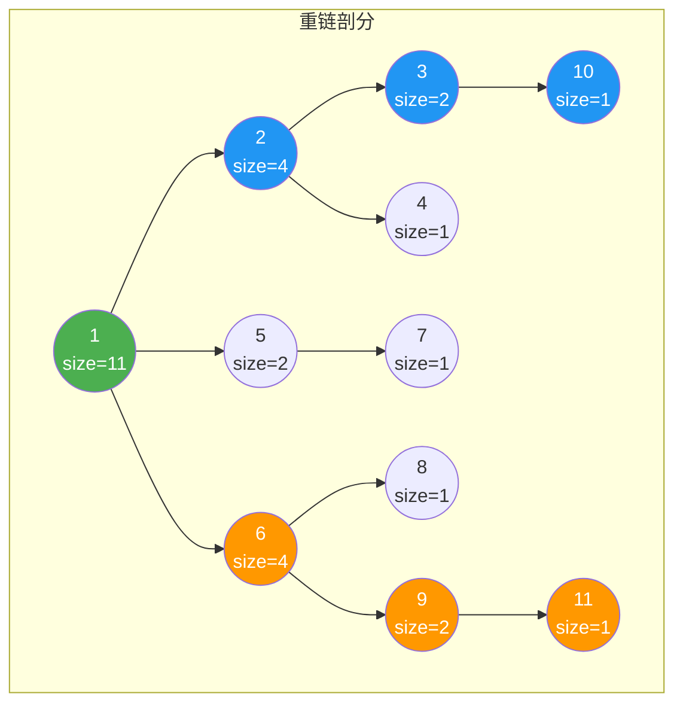
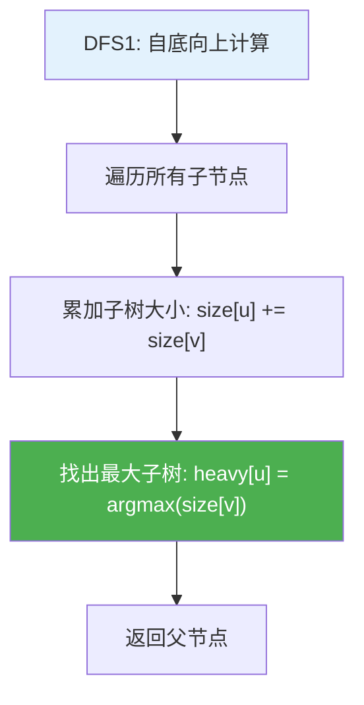
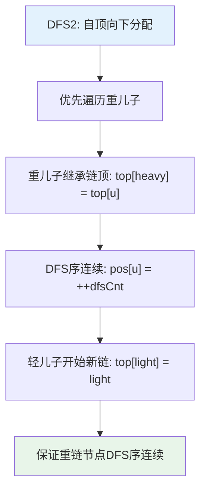
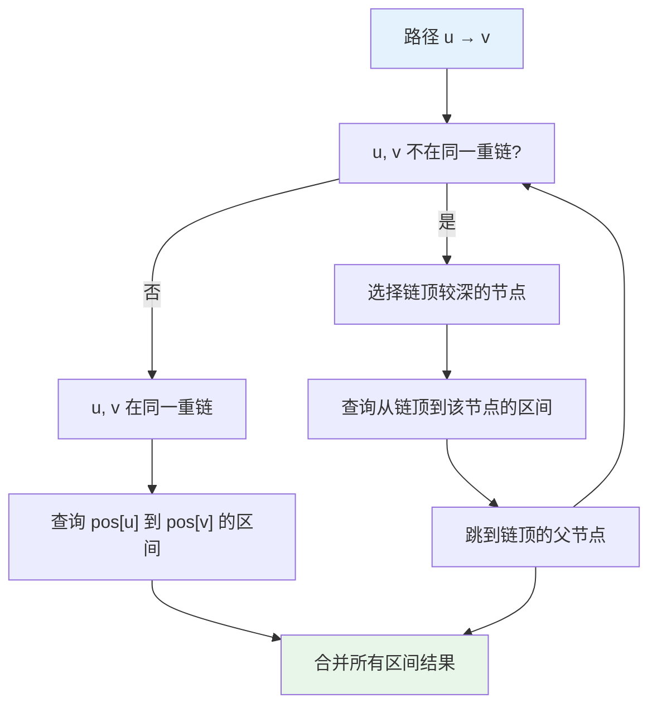
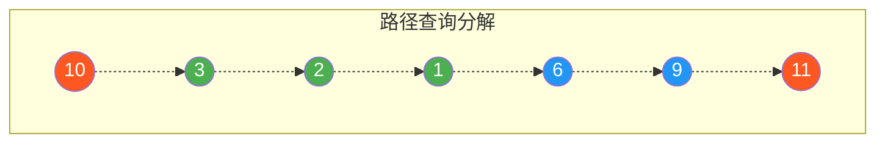

# 树链剖分

## 概述

树链剖分（Heavy-Light Decomposition，HLD）是一种将树分解为若干条不相交链的技术。通过将树上的路径问题转化为若干连续区间问题，结合线段树等数据结构，可以高效处理树上路径查询和修改问题。

<div style="background: #E3F2FD; border-left: 4px solid #2196F3; padding: 12px; margin: 10px 0;">
<strong>核心思想</strong>：将树分解为重链和轻边，使得任意路径最多由 O(log n) 条重链组成。每条重链上的节点 DFS 序连续，可用线段树维护。
</div>

## 重链剖分原理

### 基本概念

| 概念 | 定义 | 说明 |
|------|------|------|
| 子树大小 | size[u] | 以 u 为根的子树节点数 |
| 重儿子 | heavy[u] | 使 size[v] 最大的子节点 v |
| 轻儿子 | 其他儿子 | 除重儿子外的所有子节点 |
| 重边 | (u, heavy[u]) | 连接节点与其重儿子的边 |
| 轻边 | 其他边 | 连接节点与其轻儿子的边 |
| 重链 | 连续重边 | 由重边首尾相连形成的路径 |
| 链顶 | top[u] | 节点 u 所在重链的顶部节点 |

### 重链性质

<div style="background: #E8F5E9; border-left: 4px solid #4CAF50; padding: 12px; margin: 10px 0;">
<strong>关键性质</strong>：从任意节点到根的路径上，最多经过 O(log n) 条轻边。
<br><br>
<strong>证明</strong>：设当前节点为 u，经过轻边到达父节点 p。因为 u 是 p 的轻儿子，所以 size[u] ≤ size[p]/2。每经过一条轻边，子树大小至少减半，因此最多经过 log n 条轻边。
</div>

### 重链剖分可视化

<div style="background: #F5F5F5; border-radius: 8px; padding: 20px; margin: 10px 0;">
<p style="font-weight: bold; margin: 0 0 15px 0;">示例树结构</p>
<div style="display: flex; justify-content: center; margin-bottom: 20px;">
<svg width="400" height="280" viewBox="0 0 400 280">
  <!-- 连线 -->
  <line x1="200" y1="40" x2="100" y2="100" stroke="#bdbdbd" stroke-width="2"/>
  <line x1="200" y1="40" x2="200" y2="100" stroke="#bdbdbd" stroke-width="2"/>
  <line x1="200" y1="40" x2="300" y2="100" stroke="#bdbdbd" stroke-width="2"/>
  <line x1="100" y1="120" x2="60" y2="180" stroke="#bdbdbd" stroke-width="2"/>
  <line x1="100" y1="120" x2="140" y2="180" stroke="#bdbdbd" stroke-width="2"/>
  <line x1="200" y1="120" x2="200" y2="180" stroke="#bdbdbd" stroke-width="2"/>
  <line x1="300" y1="120" x2="260" y2="180" stroke="#bdbdbd" stroke-width="2"/>
  <line x1="300" y1="120" x2="340" y2="180" stroke="#bdbdbd" stroke-width="2"/>
  <line x1="60" y1="200" x2="60" y2="250" stroke="#bdbdbd" stroke-width="2"/>
  <line x1="340" y1="200" x2="340" y2="250" stroke="#bdbdbd" stroke-width="2"/>
  <!-- 节点 -->
  <circle cx="200" cy="30" r="18" fill="#4CAF50" stroke="#388E3C" stroke-width="2"/>
  <text x="200" y="35" text-anchor="middle" fill="white" font-weight="bold" font-size="14">1</text>
  <circle cx="100" cy="110" r="18" fill="#2196F3" stroke="#1976D2" stroke-width="2"/>
  <text x="100" y="115" text-anchor="middle" fill="white" font-weight="bold" font-size="14">2</text>
  <circle cx="200" cy="110" r="18" fill="#9E9E9E" stroke="#757575" stroke-width="2"/>
  <text x="200" y="115" text-anchor="middle" fill="white" font-weight="bold" font-size="14">5</text>
  <circle cx="300" cy="110" r="18" fill="#FF9800" stroke="#F57C00" stroke-width="2"/>
  <text x="300" y="115" text-anchor="middle" fill="white" font-weight="bold" font-size="14">6</text>
  <circle cx="60" cy="190" r="18" fill="#2196F3" stroke="#1976D2" stroke-width="2"/>
  <text x="60" y="195" text-anchor="middle" fill="white" font-weight="bold" font-size="14">3</text>
  <circle cx="140" cy="190" r="18" fill="#9E9E9E" stroke="#757575" stroke-width="2"/>
  <text x="140" y="195" text-anchor="middle" fill="white" font-weight="bold" font-size="14">4</text>
  <circle cx="200" cy="190" r="18" fill="#9E9E9E" stroke="#757575" stroke-width="2"/>
  <text x="200" y="195" text-anchor="middle" fill="white" font-weight="bold" font-size="14">7</text>
  <circle cx="260" cy="190" r="18" fill="#9E9E9E" stroke="#757575" stroke-width="2"/>
  <text x="260" y="195" text-anchor="middle" fill="white" font-weight="bold" font-size="14">8</text>
  <circle cx="340" cy="190" r="18" fill="#FF9800" stroke="#F57C00" stroke-width="2"/>
  <text x="340" y="195" text-anchor="middle" fill="white" font-weight="bold" font-size="14">9</text>
  <circle cx="60" cy="260" r="18" fill="#2196F3" stroke="#1976D2" stroke-width="2"/>
  <text x="60" y="265" text-anchor="middle" fill="white" font-weight="bold" font-size="14">10</text>
  <circle cx="340" cy="260" r="18" fill="#FF9800" stroke="#F57C00" stroke-width="2"/>
  <text x="340" y="265" text-anchor="middle" fill="white" font-weight="bold" font-size="14">11</text>
</svg>
</div>
<div style="display: flex; gap: 10px; justify-content: center; flex-wrap: wrap; margin-bottom: 15px;">
<span style="padding: 4px 12px; background: #4CAF50; color: white; border-radius: 4px; font-size: 13px;">根节点</span>
<span style="padding: 4px 12px; background: #2196F3; color: white; border-radius: 4px; font-size: 13px;">重链1</span>
<span style="padding: 4px 12px; background: #FF9800; color: white; border-radius: 4px; font-size: 13px;">重链3</span>
<span style="padding: 4px 12px; background: #9E9E9E; color: white; border-radius: 4px; font-size: 13px;">其他节点</span>
</div>
<p style="font-weight: bold; margin: 15px 0 10px 0;">节点大小 (size)：</p>
<table style="width: 100%; border-collapse: collapse; font-size: 13px;">
<tr><td style="padding: 4px; border-bottom: 1px solid #e0e0e0;">size[1] = 11</td><td style="padding: 4px; border-bottom: 1px solid #e0e0e0;">整棵树</td></tr>
<tr><td style="padding: 4px; border-bottom: 1px solid #e0e0e0;">size[2] = 4</td><td style="padding: 4px; border-bottom: 1px solid #e0e0e0;">节点 2,3,4,10</td></tr>
<tr><td style="padding: 4px; border-bottom: 1px solid #e0e0e0;">size[3] = 2</td><td style="padding: 4px; border-bottom: 1px solid #e0e0e0;">节点 3,10</td></tr>
<tr><td style="padding: 4px; border-bottom: 1px solid #e0e0e0;">size[5] = 2</td><td style="padding: 4px; border-bottom: 1px solid #e0e0e0;">节点 5,7</td></tr>
<tr><td style="padding: 4px; border-bottom: 1px solid #e0e0e0;">size[6] = 4</td><td style="padding: 4px; border-bottom: 1px solid #e0e0e0;">节点 6,8,9,11</td></tr>
<tr><td style="padding: 4px; border-bottom: 1px solid #e0e0e0;">size[9] = 2</td><td style="padding: 4px; border-bottom: 1px solid #e0e0e0;">节点 9,11</td></tr>
<tr><td style="padding: 4px;">size[其他] = 1</td><td style="padding: 4px;">叶子节点</td></tr>
</table>
</div>



<div style="background: #F5F5F5; border-radius: 8px; padding: 20px; margin: 10px 0;">
<p style="font-weight: bold; margin: 0 0 15px 0;">重儿子标记 (heavy)</p>
<div style="display: grid; grid-template-columns: repeat(2, 1fr); gap: 8px; font-size: 13px; margin-bottom: 15px;">
<div style="padding: 8px; background: #E3F2FD; border-radius: 4px;"><strong>heavy[1] = 2</strong><br/>size[2]=4 &gt; size[5]=2, size[6]=4</div>
<div style="padding: 8px; background: #E3F2FD; border-radius: 4px;"><strong>heavy[2] = 3</strong><br/>size[3]=2 &gt; size[4]=1</div>
<div style="padding: 8px; background: #E3F2FD; border-radius: 4px;"><strong>heavy[3] = 10</strong><br/>唯一子节点</div>
<div style="padding: 8px; background: #E3F2FD; border-radius: 4px;"><strong>heavy[6] = 9</strong><br/>size[9]=2 &gt; size[8]=1</div>
<div style="padding: 8px; background: #E3F2FD; border-radius: 4px;"><strong>heavy[9] = 11</strong><br/>唯一子节点</div>
</div>
<div style="display: flex; gap: 20px; flex-wrap: wrap;">
<div style="flex: 1; min-width: 200px;">
<p style="font-weight: bold; margin: 0 0 8px 0; color: #4CAF50;">重边（粗线）</p>
<div style="padding: 10px; background: #E8F5E9; border-radius: 4px; font-family: monospace; font-size: 13px;">1-2, 2-3, 3-10, 6-9, 9-11</div>
</div>
<div style="flex: 1; min-width: 200px;">
<p style="font-weight: bold; margin: 0 0 8px 0; color: #F44336;">轻边（细线）</p>
<div style="padding: 10px; background: #FFEBEE; border-radius: 4px; font-family: monospace; font-size: 13px;">1-5, 1-6, 2-4, 5-7, 6-8</div>
</div>
</div>
<p style="font-weight: bold; margin: 15px 0 8px 0;">重链划分</p>
<div style="display: flex; gap: 8px; flex-wrap: wrap;">
<span style="padding: 6px 12px; background: #4CAF50; color: white; border-radius: 4px; font-size: 13px;">链1: 1 → 2 → 3 → 10</span>
<span style="padding: 6px 12px; background: #2196F3; color: white; border-radius: 4px; font-size: 13px;">链2: 5 → 7</span>
<span style="padding: 6px 12px; background: #FF9800; color: white; border-radius: 4px; font-size: 13px;">链3: 6 → 9 → 11</span>
<span style="padding: 6px 12px; background: #9E9E9E; color: white; border-radius: 4px; font-size: 13px;">链4: 4</span>
<span style="padding: 6px 12px; background: #9E9E9E; color: white; border-radius: 4px; font-size: 13px;">链5: 8</span>
</div>
</div>

## DFS 序与链顶

### 两遍 DFS 过程

**第一遍 DFS：求子树大小和重儿子**



**第二遍 DFS：求链顶和 DFS 序**



### DFS 序分配

<div style="background: #F5F5F5; border-radius: 8px; padding: 20px; margin: 10px 0;">
<p style="font-weight: bold; margin: 0 0 15px 0;">第二遍 DFS 执行过程</p>
<div style="font-family: monospace; font-size: 12px; line-height: 1.8; background: #fff; padding: 15px; border-radius: 4px; overflow-x: auto;">
<div style="color: #4CAF50;">DFS2(1, 1):  <span style="color: #2196F3;">top[1]=1</span>, <span style="color: #FF9800;">pos[1]=1</span></div>
<div style="padding-left: 20px; color: #4CAF50;">→ DFS2(2, 1):  <span style="color: #2196F3;">top[2]=1</span>, <span style="color: #FF9800;">pos[2]=2</span> <span style="color: #757575;">(重儿子，继承链顶)</span></div>
<div style="padding-left: 40px; color: #4CAF50;">→ DFS2(3, 1):  <span style="color: #2196F3;">top[3]=1</span>, <span style="color: #FF9800;">pos[3]=3</span></div>
<div style="padding-left: 60px; color: #4CAF50;">→ DFS2(10, 1):  <span style="color: #2196F3;">top[10]=1</span>, <span style="color: #FF9800;">pos[10]=4</span></div>
<div style="padding-left: 40px; color: #F44336;">→ DFS2(4, 4):  <span style="color: #2196F3;">top[4]=4</span>, <span style="color: #FF9800;">pos[4]=5</span> <span style="color: #757575;">(轻儿子，开始新链)</span></div>
<div style="padding-left: 20px; color: #F44336;">→ DFS2(5, 5):  <span style="color: #2196F3;">top[5]=5</span>, <span style="color: #FF9800;">pos[5]=6</span> <span style="color: #757575;">(轻儿子，开始新链)</span></div>
<div style="padding-left: 40px; color: #4CAF50;">→ DFS2(7, 5):  <span style="color: #2196F3;">top[7]=5</span>, <span style="color: #FF9800;">pos[7]=7</span></div>
<div style="padding-left: 20px; color: #F44336;">→ DFS2(6, 6):  <span style="color: #2196F3;">top[6]=6</span>, <span style="color: #FF9800;">pos[6]=8</span> <span style="color: #757575;">(轻儿子，开始新链)</span></div>
<div style="padding-left: 40px; color: #4CAF50;">→ DFS2(9, 6):  <span style="color: #2196F3;">top[9]=6</span>, <span style="color: #FF9800;">pos[9]=9</span> <span style="color: #757575;">(重儿子，继承链顶)</span></div>
<div style="padding-left: 60px; color: #4CAF50;">→ DFS2(11, 6):  <span style="color: #2196F3;">top[11]=6</span>, <span style="color: #FF9800;">pos[11]=10</span></div>
<div style="padding-left: 40px; color: #F44336;">→ DFS2(8, 8):  <span style="color: #2196F3;">top[8]=8</span>, <span style="color: #FF9800;">pos[8]=11</span></div>
</div>
<p style="font-weight: bold; margin: 15px 0 8px 0;">最终结果</p>
<table style="width: 100%; border-collapse: collapse; font-size: 12px; text-align: center;">
<tr style="background: #E3F2FD;"><th style="padding: 6px; border: 1px solid #bbb;">节点</th><td style="padding: 6px; border: 1px solid #ddd;">1</td><td style="padding: 6px; border: 1px solid #ddd;">2</td><td style="padding: 6px; border: 1px solid #ddd;">3</td><td style="padding: 6px; border: 1px solid #ddd;">4</td><td style="padding: 6px; border: 1px solid #ddd;">5</td><td style="padding: 6px; border: 1px solid #ddd;">6</td><td style="padding: 6px; border: 1px solid #ddd;">7</td><td style="padding: 6px; border: 1px solid #ddd;">8</td><td style="padding: 6px; border: 1px solid #ddd;">9</td><td style="padding: 6px; border: 1px solid #ddd;">10</td><td style="padding: 6px; border: 1px solid #ddd;">11</td></tr>
<tr><td style="padding: 6px; border: 1px solid #ddd; background: #E3F2FD; font-weight: bold;">pos</td><td style="padding: 6px; border: 1px solid #ddd;">1</td><td style="padding: 6px; border: 1px solid #ddd;">2</td><td style="padding: 6px; border: 1px solid #ddd;">3</td><td style="padding: 6px; border: 1px solid #ddd;">5</td><td style="padding: 6px; border: 1px solid #ddd;">6</td><td style="padding: 6px; border: 1px solid #ddd;">8</td><td style="padding: 6px; border: 1px solid #ddd;">7</td><td style="padding: 6px; border: 1px solid #ddd;">11</td><td style="padding: 6px; border: 1px solid #ddd;">9</td><td style="padding: 6px; border: 1px solid #ddd;">4</td><td style="padding: 6px; border: 1px solid #ddd;">10</td></tr>
<tr><td style="padding: 6px; border: 1px solid #ddd; background: #E3F2FD; font-weight: bold;">top</td><td style="padding: 6px; border: 1px solid #ddd;">1</td><td style="padding: 6px; border: 1px solid #ddd;">1</td><td style="padding: 6px; border: 1px solid #ddd;">1</td><td style="padding: 6px; border: 1px solid #ddd;">4</td><td style="padding: 6px; border: 1px solid #ddd;">5</td><td style="padding: 6px; border: 1px solid #ddd;">6</td><td style="padding: 6px; border: 1px solid #ddd;">5</td><td style="padding: 6px; border: 1px solid #ddd;">8</td><td style="padding: 6px; border: 1px solid #ddd;">6</td><td style="padding: 6px; border: 1px solid #ddd;">1</td><td style="padding: 6px; border: 1px solid #ddd;">6</td></tr>
</table>
</div>

**DFS 序与重链对应关系**：

<div style="background: #F5F5F5; border-radius: 8px; padding: 20px; margin: 10px 0; overflow-x: auto;">
<table style="border-collapse: collapse; font-size: 12px; text-align: center; width: 100%;">
<tr style="background: #E3F2FD;"><th style="padding: 6px; border: 1px solid #bbb;">DFS序</th><td style="padding: 6px; border: 1px solid #ddd; background: #E8F5E9;">1</td><td style="padding: 6px; border: 1px solid #ddd; background: #E8F5E9;">2</td><td style="padding: 6px; border: 1px solid #ddd; background: #E8F5E9;">3</td><td style="padding: 6px; border: 1px solid #ddd; background: #E8F5E9;">4</td><td style="padding: 6px; border: 1px solid #ddd;">5</td><td style="padding: 6px; border: 1px solid #ddd; background: #FFF3E0;">6</td><td style="padding: 6px; border: 1px solid #ddd; background: #FFF3E0;">7</td><td style="padding: 6px; border: 1px solid #ddd; background: #E3F2FD;">8</td><td style="padding: 6px; border: 1px solid #ddd; background: #E3F2FD;">9</td><td style="padding: 6px; border: 1px solid #ddd; background: #E3F2FD;">10</td><td style="padding: 6px; border: 1px solid #ddd;">11</td></tr>
<tr><td style="padding: 6px; border: 1px solid #ddd; background: #E3F2FD; font-weight: bold;">节点</td><td style="padding: 6px; border: 1px solid #ddd;">1</td><td style="padding: 6px; border: 1px solid #ddd;">2</td><td style="padding: 6px; border: 1px solid #ddd;">3</td><td style="padding: 6px; border: 1px solid #ddd;">10</td><td style="padding: 6px; border: 1px solid #ddd;">4</td><td style="padding: 6px; border: 1px solid #ddd;">5</td><td style="padding: 6px; border: 1px solid #ddd;">7</td><td style="padding: 6px; border: 1px solid #ddd;">6</td><td style="padding: 6px; border: 1px solid #ddd;">9</td><td style="padding: 6px; border: 1px solid #ddd;">11</td><td style="padding: 6px; border: 1px solid #ddd;">8</td></tr>
<tr><td style="padding: 6px; border: 1px solid #ddd; background: #E3F2FD; font-weight: bold;">链顶</td><td style="padding: 6px; border: 1px solid #ddd;">1</td><td style="padding: 6px; border: 1px solid #ddd;">1</td><td style="padding: 6px; border: 1px solid #ddd;">1</td><td style="padding: 6px; border: 1px solid #ddd;">1</td><td style="padding: 6px; border: 1px solid #ddd;">4</td><td style="padding: 6px; border: 1px solid #ddd;">5</td><td style="padding: 6px; border: 1px solid #ddd;">5</td><td style="padding: 6px; border: 1px solid #ddd;">6</td><td style="padding: 6px; border: 1px solid #ddd;">6</td><td style="padding: 6px; border: 1px solid #ddd;">6</td><td style="padding: 6px; border: 1px solid #ddd;">8</td></tr>
<tr><td style="padding: 6px; border: 1px solid #ddd; background: #E3F2FD; font-weight: bold;">重链</td><td colspan="4" style="padding: 6px; border: 1px solid #ddd; background: #E8F5E9; color: #4CAF50; font-weight: bold;">重链1</td><td style="padding: 6px; border: 1px solid #ddd; color: #F44336;">轻链</td><td colspan="2" style="padding: 6px; border: 1px solid #ddd; background: #FFF3E0; color: #FF9800; font-weight: bold;">重链2</td><td colspan="3" style="padding: 6px; border: 1px solid #ddd; background: #E3F2FD; color: #2196F3; font-weight: bold;">重链3</td><td style="padding: 6px; border: 1px solid #ddd; color: #F44336;">轻链</td></tr>
</table>
</div>

<div style="background: #FFF3E0; border-left: 4px solid #FF9800; padding: 12px; margin: 10px 0;">
<strong>关键观察</strong>：同一重链上的节点 DFS 序连续！这使得我们可以用线段树高效维护重链上的信息。
</div>

## 数据结构定义

```c
#define MAXN 100005

int n;
int head[MAXN], to[2 * MAXN], next[2 * MAXN], edgeCnt;  // 邻接表
int weight[MAXN];        // 节点权值
int parent[MAXN];        // 父节点
int depth[MAXN];         // 深度
int size[MAXN];          // 子树大小
int heavy[MAXN];         // 重儿子
int top[MAXN];           // 链顶
int pos[MAXN];           // DFS序
int dfsOrder[MAXN];      // DFS序对应的节点
int dfsCnt;              // DFS序计数器

void addEdge(int u, int v) {
    to[++edgeCnt] = v;
    next[edgeCnt] = head[u];
    head[u] = edgeCnt;
}
```

## 第一遍 DFS：求重儿子

```c
void dfs1(int u, int p, int d) {
    parent[u] = p;
    depth[u] = d;
    size[u] = 1;
    heavy[u] = -1;
    
    int maxSize = 0;
    
    for (int e = head[u]; e; e = next[e]) {
        int v = to[e];
        if (v == p) continue;
        
        dfs1(v, u, d + 1);
        size[u] += size[v];
        
        // 找子树最大的儿子作为重儿子
        if (size[v] > maxSize) {
            maxSize = size[v];
            heavy[u] = v;
        }
    }
}
```

## 第二遍 DFS：求链顶和 DFS 序

```c
void dfs2(int u, int t) {
    top[u] = t;              // 设置链顶
    pos[u] = ++dfsCnt;       // 分配DFS序
    dfsOrder[dfsCnt] = u;    // 记录DFS序对应节点
    
    // 优先遍历重儿子（保证重链DFS序连续）
    if (heavy[u] != -1) {
        dfs2(heavy[u], t);   // 重儿子继承链顶
    }
    
    // 遍历轻儿子
    for (int e = head[u]; e; e = next[e]) {
        int v = to[e];
        if (v == parent[u] || v == heavy[u]) continue;
        dfs2(v, v);          // 轻儿子开始新链
    }
}
```

## 路径查询

### 原理

路径查询的核心是将路径分解为若干重链片段：



### 实现代码

```c
int tree[4 * MAXN];

void build(int node, int l, int r) {
    if (l == r) {
        tree[node] = weight[dfsOrder[l]];
        return;
    }
    
    int mid = (l + r) / 2;
    build(2 * node, l, mid);
    build(2 * node + 1, mid + 1, r);
    tree[node] = tree[2 * node] + tree[2 * node + 1];
}

int queryTree(int node, int l, int r, int ql, int qr) {
    if (ql <= l && r <= qr) return tree[node];
    if (r < ql || l > qr) return 0;
    
    int mid = (l + r) / 2;
    return queryTree(2 * node, l, mid, ql, qr) + 
           queryTree(2 * node + 1, mid + 1, r, ql, qr);
}

int queryPath(int u, int v) {
    int result = 0;
    
    // 当 u 和 v 不在同一重链时
    while (top[u] != top[v]) {
        // 让链顶较深的节点往上跳
        if (depth[top[u]] < depth[top[v]]) {
            int temp = u; u = v; v = temp;
        }
        
        // 查询从链顶到 u 的区间
        result += queryTree(1, 1, n, pos[top[u]], pos[u]);
        // 跳到链顶的父节点
        u = parent[top[u]];
    }
    
    // u 和 v 在同一重链上
    if (depth[u] > depth[v]) {
        int temp = u; u = v; v = temp;
    }
    
    result += queryTree(1, 1, n, pos[u], pos[v]);
    
    return result;
}
```

### 查询示例

<div style="background: #F5F5F5; border-radius: 8px; padding: 20px; margin: 10px 0;">
<p style="font-weight: bold; margin: 0 0 15px 0;">查询路径 10 → 11 的和</p>
<div style="display: grid; gap: 10px;">
<div style="padding: 12px; background: #E3F2FD; border-radius: 4px; border-left: 4px solid #2196F3;">
<p style="margin: 0 0 5px 0; font-weight: bold; color: #2196F3;">步骤1</p>
<p style="margin: 0; font-size: 13px;">top[10]=1, top[11]=6, 不在同一链</p>
<p style="margin: 0; font-size: 13px;">depth[top[10]]=1 &lt; depth[top[11]]=3</p>
<p style="margin: 0; font-size: 13px;">交换: u=11, v=10</p>
</div>
<div style="padding: 12px; background: #FFF3E0; border-radius: 4px; border-left: 4px solid #FF9800;">
<p style="margin: 0 0 5px 0; font-weight: bold; color: #FF9800;">步骤2</p>
<p style="margin: 0; font-size: 13px;">查询 [pos[6], pos[11]] = [8, 10]</p>
<p style="margin: 0; font-size: 13px;">result += queryTree(8, 10)</p>
<p style="margin: 0; font-size: 13px;">u = parent[6] = 1</p>
</div>
<div style="padding: 12px; background: #E8F5E9; border-radius: 4px; border-left: 4px solid #4CAF50;">
<p style="margin: 0 0 5px 0; font-weight: bold; color: #4CAF50;">步骤3</p>
<p style="margin: 0; font-size: 13px;">top[1]=1, top[10]=1, 在同一链</p>
<p style="margin: 0; font-size: 13px;">depth[1]=0 &lt; depth[10]=3</p>
<p style="margin: 0; font-size: 13px;">查询 [pos[1], pos[10]] = [1, 4]</p>
<p style="margin: 0; font-size: 13px;">result += queryTree(1, 4)</p>
</div>
</div>
<p style="font-weight: bold; margin: 15px 0 8px 0;">路径分解为两个区间</p>
<div style="display: flex; gap: 10px; flex-wrap: wrap;">
<span style="padding: 8px 12px; background: #E3F2FD; border-radius: 4px; font-size: 13px;"><strong>[8, 10]</strong>: 节点 6, 9, 11 (重链3的一部分)</span>
<span style="padding: 8px 12px; background: #E8F5E9; border-radius: 4px; font-size: 13px;"><strong>[1, 4]</strong>: 节点 1, 2, 3, 10 (重链1)</span>
</div>
</div>



## 路径更新

```c
void updateTree(int node, int l, int r, int idx, int val) {
    if (l == r) {
        tree[node] = val;
        return;
    }
    
    int mid = (l + r) / 2;
    if (idx <= mid) {
        updateTree(2 * node, l, mid, idx, val);
    } else {
        updateTree(2 * node + 1, mid + 1, r, idx, val);
    }
    tree[node] = tree[2 * node] + tree[2 * node + 1];
}

void updatePoint(int u, int val) {
    weight[u] = val;
    updateTree(1, 1, n, pos[u], val);
}
```

### 区间路径更新

```c
void updateRangeTree(int node, int l, int r, int ql, int qr, int val);

void updatePath(int u, int v, int val) {
    while (top[u] != top[v]) {
        if (depth[top[u]] < depth[top[v]]) {
            int temp = u; u = v; v = temp;
        }
        updateRangeTree(1, 1, n, pos[top[u]], pos[u], val);
        u = parent[top[u]];
    }
    
    if (depth[u] > depth[v]) {
        int temp = u; u = v; v = temp;
    }
    updateRangeTree(1, 1, n, pos[u], pos[v], val);
}
```

## 最近公共祖先（LCA）

利用树链剖分求 LCA：

```c
int lca(int u, int v) {
    // 让 u 和 v 跳到同一重链
    while (top[u] != top[v]) {
        if (depth[top[u]] < depth[top[v]]) {
            int temp = u; u = v; v = temp;
        }
        u = parent[top[u]];  // 跳过整条重链
    }
    
    // 在同一重链上，深度浅的是 LCA
    return (depth[u] < depth[v]) ? u : v;
}
```

**LCA 查询示例**：

<div style="background: #F5F5F5; border-radius: 8px; padding: 20px; margin: 10px 0;">
<p style="font-weight: bold; margin: 0 0 15px 0;">求 LCA(10, 11)</p>
<div style="display: grid; gap: 10px;">
<div style="padding: 12px; background: #E3F2FD; border-radius: 4px; border-left: 4px solid #2196F3;">
<p style="margin: 0 0 5px 0; font-weight: bold; color: #2196F3;">步骤1</p>
<p style="margin: 0; font-size: 13px;">top[10]=1, top[11]=6, 不在同一链</p>
<p style="margin: 0; font-size: 13px;">depth[top[10]]=1 &lt; depth[top[11]]=3</p>
<p style="margin: 0; font-size: 13px;">交换: u=11, v=10</p>
<p style="margin: 0; font-size: 13px;">u = parent[top[11]] = parent[6] = 1</p>
</div>
<div style="padding: 12px; background: #E8F5E9; border-radius: 4px; border-left: 4px solid #4CAF50;">
<p style="margin: 0 0 5px 0; font-weight: bold; color: #4CAF50;">步骤2</p>
<p style="margin: 0; font-size: 13px;">top[1]=1, top[10]=1, 在同一链</p>
<p style="margin: 0; font-size: 13px;">depth[1]=0 &lt; depth[10]=3</p>
</div>
</div>
<div style="margin-top: 15px; padding: 12px; background: #4CAF50; color: white; border-radius: 4px; text-align: center; font-weight: bold;">
结果: LCA(10, 11) = 1
</div>
</div>

## 子树操作

子树内的节点 DFS 序连续，可直接查询：

```c
// 查询子树和
int querySubtree(int u) {
    return queryTree(1, 1, n, pos[u], pos[u] + size[u] - 1);
}

// 更新子树
void updateSubtree(int u, int val) {
    updateRangeTree(1, 1, n, pos[u], pos[u] + size[u] - 1, val);
}
```

<div style="background: #E8F5E9; border-left: 4px solid #4CAF50; padding: 12px; margin: 10px 0;">
<strong>子树操作的优势</strong>：子树内所有节点的 DFS 序形成连续区间 [pos[u], pos[u] + size[u] - 1]，可以在 O(log n) 时间内完成子树查询/更新，无需路径分解。
</div>

## C++ 实现

```cpp
#include <vector>
#include <algorithm>

class HeavyLightDecomposition {
private:
    std::vector<std::vector<int>> adj;
    std::vector<int> parent, depth, size, heavy, top, pos;
    std::vector<int> values, tree;
    int n, dfsCnt;
    
    void dfs1(int u, int p) {
        parent[u] = p;
        size[u] = 1;
        heavy[u] = -1;
        int maxSize = 0;
        
        for (int v : adj[u]) {
            if (v == p) continue;
            depth[v] = depth[u] + 1;
            dfs1(v, u);
            size[u] += size[v];
            if (size[v] > maxSize) {
                maxSize = size[v];
                heavy[u] = v;
            }
        }
    }
    
    void dfs2(int u, int t) {
        top[u] = t;
        pos[u] = ++dfsCnt;
        
        if (heavy[u] != -1) dfs2(heavy[u], t);
        
        for (int v : adj[u]) {
            if (v == parent[u] || v == heavy[u]) continue;
            dfs2(v, v);
        }
    }
    
    void build(int node, int l, int r) {
        if (l == r) {
            tree[node] = values[pos[l]];
            return;
        }
        int mid = (l + r) / 2;
        build(2 * node, l, mid);
        build(2 * node + 1, mid + 1, r);
        tree[node] = tree[2 * node] + tree[2 * node + 1];
    }
    
    int queryTree(int node, int l, int r, int ql, int qr) {
        if (ql <= l && r <= qr) return tree[node];
        if (r < ql || l > qr) return 0;
        int mid = (l + r) / 2;
        return queryTree(2 * node, l, mid, ql, qr) + 
               queryTree(2 * node + 1, mid + 1, r, ql, qr);
    }
    
public:
    HeavyLightDecomposition(int n) : n(n), adj(n + 1), parent(n + 1), 
        depth(n + 1), size(n + 1), heavy(n + 1), top(n + 1), 
        pos(n + 1), values(n + 1), tree(4 * n + 5), dfsCnt(0) {}
    
    void addEdge(int u, int v) {
        adj[u].push_back(v);
        adj[v].push_back(u);
    }
    
    void build() {
        dfs1(1, 0);
        dfs2(1, 1);
        build(1, 1, n);
    }
    
    int queryPath(int u, int v) {
        int result = 0;
        while (top[u] != top[v]) {
            if (depth[top[u]] < depth[top[v]]) std::swap(u, v);
            result += queryTree(1, 1, n, pos[top[u]], pos[u]);
            u = parent[top[u]];
        }
        if (depth[u] > depth[v]) std::swap(u, v);
        result += queryTree(1, 1, n, pos[u], pos[v]);
        return result;
    }
    
    int querySubtree(int u) {
        return queryTree(1, 1, n, pos[u], pos[u] + size[u] - 1);
    }
    
    int lca(int u, int v) {
        while (top[u] != top[v]) {
            if (depth[top[u]] < depth[top[v]]) std::swap(u, v);
            u = parent[top[u]];
        }
        return (depth[u] < depth[v]) ? u : v;
    }
    
    int dist(int u, int v) {
        return depth[u] + depth[v] - 2 * depth[lca(u, v)];
    }
};
```

## 时间复杂度分析

| 操作 | 时间复杂度 | 说明 |
|------|-----------|------|
| 预处理 | O(n) | 两遍 DFS |
| 路径查询 | O(log² n) | 最多 O(log n) 条重链，每条 O(log n) |
| 路径更新 | O(log² n) | 同路径查询 |
| LCA | O(log n) | 最多跳 O(log n) 次 |
| 子树查询 | O(log n) | 单次线段树查询 |
| 子树更新 | O(log n) | 单次线段树更新 |

### 复杂度推导

<div style="background: #F5F5F5; border-radius: 8px; padding: 20px; margin: 10px 0;">
<p style="font-weight: bold; margin: 0 0 10px 0;">路径查询复杂度分析</p>
<ul style="margin: 0; padding-left: 20px; font-size: 14px; line-height: 1.8;">
<li>路径分解为若干重链片段</li>
<li>每条重链对应一个区间查询 O(log n)</li>
<li>从节点到根最多经过 O(log n) 条轻边</li>
<li>因此最多产生 O(log n) 条重链片段</li>
<li>总复杂度: <strong style="color: #F44336;">O(log n) × O(log n) = O(log² n)</strong></li>
</ul>
</div>

<div style="background: #FFF3E0; border-left: 4px solid #FF9800; padding: 12px; margin: 10px 0;">
<strong>优化提示</strong>：使用支持 O(log n) 区间查询的数据结构（如线段树）时，路径操作为 O(log²n)。若使用更高效的数据结构（如 Splay 树），可优化到 O(log n)。
</div>

## 空间复杂度

| 数据 | 空间复杂度 | 说明 |
|------|-----------|------|
| 邻接表 | O(n) | 存储树结构 |
| 剖分信息 | O(n) | parent, depth, size, heavy, top, pos |
| 线段树 | O(n) | 4n 大小 |
| **总计** | **O(n)** | 线性空间 |

## 剖分类型对比

| 剖分类型 | 链数上界 | 适用场景 |
|---------|---------|---------|
| 重链剖分 | O(log n) | 通用，路径操作 |
| 长链剖分 | O(√n) | 子树深度相关问题 |
| 轻重链剖分 | O(log n) | 实际常数更优 |

## 应用场景

### 1. 树上路径查询

```cpp
// 路径和
int pathSum(int u, int v) { return queryPath(u, v); }

// 路径最大值（线段树改为维护最大值）
int pathMax(int u, int v);

// 路径第K大（需要可持久化线段树）
int pathKth(int u, int v, int k);
```

### 2. 树上路径更新

```cpp
// 路径加
void pathAdd(int u, int v, int val);

// 路径赋值
void pathAssign(int u, int v, int val);

// 路径翻转（01树）
void pathFlip(int u, int v);
```

### 3. 子树操作

```cpp
// 子树和
int subtreeSum(int u) { return querySubtree(u); }

// 子树加
void subtreeAdd(int u, int val);
```

### 4. 树上差分

```cpp
// 路径修改转单点修改
void pathDiff(int u, int v, int val) {
    int l = lca(u, v);
    diff[u] += val;
    diff[v] += val;
    diff[l] -= val;
    diff[parent[l]] -= val;
}
```

## 典型问题示例

### LeetCode 2642. 设计图最短路径（树特例）

```cpp
class TreePathQuery {
private:
    HeavyLightDecomposition hld;
    
public:
    TreePathQuery(int n, vector<vector<int>>& edges, vector<int>& values) 
        : hld(n) {
        for (auto& e : edges) {
            hld.addEdge(e[0] + 1, e[1] + 1);
        }
        hld.build();
    }
    
    int queryPath(int u, int v) {
        return hld.queryPath(u + 1, v + 1);
    }
};
```

## 树链剖分 vs 其他方法

| 方法 | 路径查询 | 子树查询 | LCA | 实现复杂度 |
|------|---------|---------|------|-----------|
| 树链剖分 | O(log²n) | O(log n) | O(log n) | 中等 |
| 树上差分 | O(n) | O(n) | O(log n) | 简单 |
| 欧拉序+RMQ | 不支持 | O(log n) | O(1) | 简单 |
| 点分治 | O(n log n) | 不支持 | 不支持 | 复杂 |

<div style="background: #E8F5E9; border-left: 4px solid #4CAF50; padding: 12px; margin: 10px 0;">
<strong>选择建议</strong>：当需要同时支持路径查询、子树查询、LCA 等多种操作时，树链剖分是最通用和高效的方案。
</div>

## 参考资料

- 《算法竞赛入门经典》树链剖分章节
- Heavy-Light Decomposition 论文 (Sleator & Tarjan, 1983)
- 《挑战程序设计竞赛》树链剖分应用
