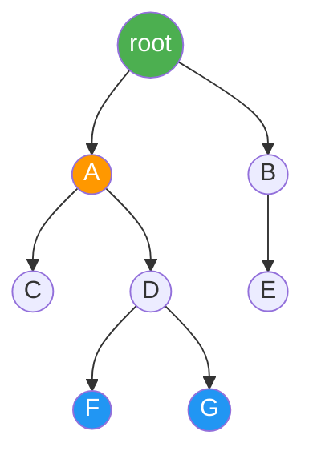
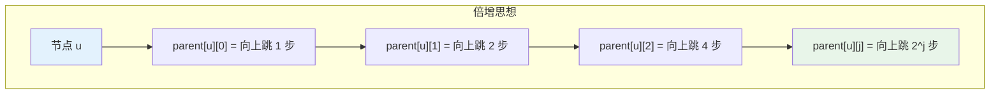
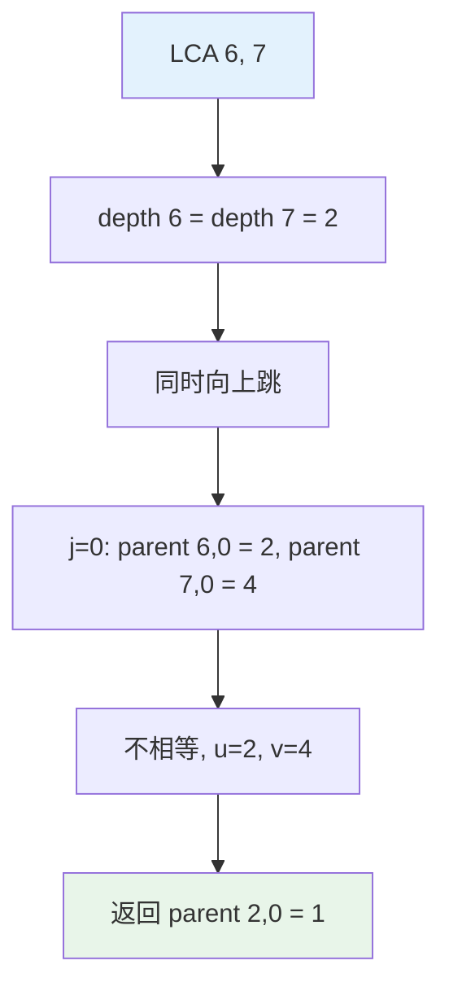
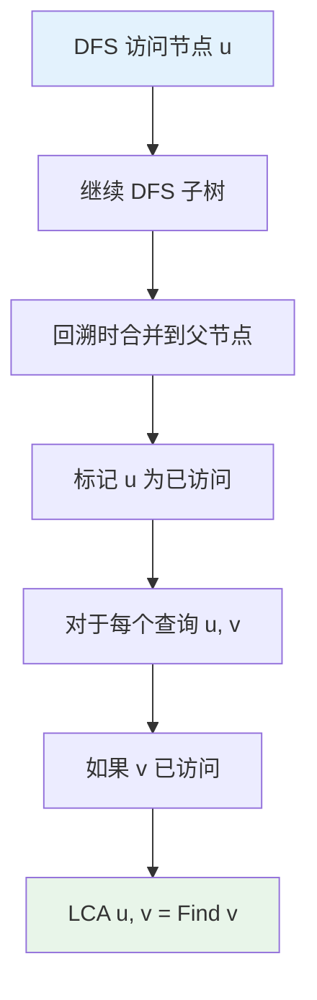
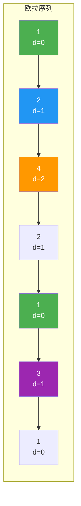
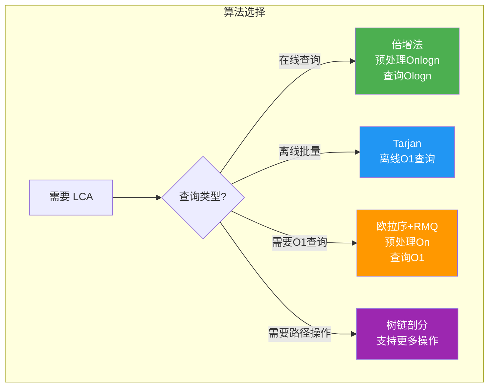

# 最近公共祖先（LCA）

## 概述

最近公共祖先（Lowest Common Ancestor，LCA）是树结构中的重要概念。对于树中的两个节点 u 和 v，它们的 LCA 是同时拥有 u 和 v 作为后代的最深节点。

<div style="background: #E3F2FD; border-left: 4px solid #2196F3; padding: 12px; margin: 10px 0;">
<strong>核心应用</strong>：树上距离计算、路径查询、树上差分、虚树构建等问题的基石。
</div>

## LCA 定义与性质

### 定义

设 root 为树的根节点，对于节点 u 和 v：

- **公共祖先**：节点 w 满足 w 是 u 的祖先且 w 是 v 的祖先
- **最近公共祖先**：所有公共祖先中深度最大的那个

### 数学表示

<div style="background: #E3F2FD; border-radius: 8px; padding: 15px; margin: 10px 0; font-family: monospace;">
LCA(u, v) = argmax{ depth[w] | w 是 u 和 v 的公共祖先 }
</div>

### 性质

| 性质 | 描述 |
|------|------|
| 自反性 | LCA(u, u) = u |
| 对称性 | LCA(u, v) = LCA(v, u) |
| 祗辈关系 | 若 u 是 v 的祖先，则 LCA(u, v) = u |
| 路径关系 | LCA(u, v) 在 u 到 v 的唯一路径上 |
| 深度公式 | dist(u, v) = depth[u] + depth[v] - 2 × depth[LCA(u, v)] |

### LCA 可视化



<div style="background: #F5F5F5; border-radius: 8px; padding: 20px; margin: 10px 0;">
<p style="font-weight: bold; margin: 0 0 10px 0;">示例说明</p>
<div style="display: grid; gap: 8px; font-size: 13px;">
<div style="padding: 10px; background: #E8F5E9; border-radius: 4px;"><strong>LCA(F, G) = D</strong> — F 和 G 的父节点</div>
<div style="padding: 10px; background: #E3F2FD; border-radius: 4px;"><strong>LCA(F, C) = A</strong> — F 的祖先路径: F→D→A→root, C 的祖先路径: C→A→root, 最近的交点是 A</div>
<div style="padding: 10px; background: #FFF3E0; border-radius: 4px;"><strong>LCA(F, E) = root</strong> — F 和 E 分别在左右子树，LCA 是根</div>
<div style="padding: 10px; background: #FFEBEE; border-radius: 4px;"><strong>LCA(D, F) = D</strong> — D 是 F 的祖先</div>
</div>
</div>

## 方法一：暴力法

### 思想

先让深度大的节点向上跳到同一深度，然后两个节点同时向上跳直到相遇。

### 实现

```c
int parent[MAXN];
int depth[MAXN];

int lcaNaive(int u, int v) {
    // 将 u 调整到更深的节点
    while (depth[u] > depth[v]) u = parent[u];
    while (depth[v] > depth[u]) v = parent[v];
    
    // 同时向上跳直到相遇
    while (u != v) {
        u = parent[u];
        v = parent[v];
    }
    return u;
}
```

### 时间复杂度

| 操作 | 复杂度 | 说明 |
|------|--------|------|
| 预处理 | O(n) | 一遍 DFS 求深度和父节点 |
| 查询 | O(n) | 最坏情况跳 n 次 |

## 方法二：倍增法（Binary Lifting）

### 思想

预处理每个节点向上跳 2^j 步到达的祖先，查询时利用二进制分解快速上跳。

### 原理图解



**递推关系**：

<div style="background: #E3F2FD; border-radius: 8px; padding: 15px; margin: 10px 0;">
<div style="font-family: monospace; font-size: 14px; margin-bottom: 10px;"><strong>parent[u][j] = parent[parent[u][j-1]][j-1]</strong></div>
<p style="margin: 0; font-size: 13px; color: #1976D2;">解释: 从 u 跳 2^j 步 = 从 u 跳 2^(j-1) 步，再跳 2^(j-1) 步</p>
</div>

### 可视化示例

<div style="background: #F5F5F5; border-radius: 8px; padding: 20px; margin: 10px 0;">
<p style="font-weight: bold; margin: 0 0 15px 0;">树结构与倍增数组</p>
<div style="display: flex; gap: 20px; flex-wrap: wrap;">
<div style="flex: 1; min-width: 200px;">
<div style="display: flex; justify-content: center; margin-bottom: 15px;">
<svg width="200" height="180" viewBox="0 0 200 180">
  <line x1="100" y1="30" x2="50" y2="70" stroke="#bdbdbd" stroke-width="2"/>
  <line x1="100" y1="30" x2="100" y2="70" stroke="#bdbdbd" stroke-width="2"/>
  <line x1="100" y1="30" x2="150" y2="70" stroke="#bdbdbd" stroke-width="2"/>
  <line x1="50" y1="90" x2="30" y2="130" stroke="#bdbdbd" stroke-width="2"/>
  <line x1="50" y1="90" x2="70" y2="130" stroke="#bdbdbd" stroke-width="2"/>
  <line x1="150" y1="90" x2="150" y2="130" stroke="#bdbdbd" stroke-width="2"/>
  <circle cx="100" cy="20" r="16" fill="#4CAF50" stroke="#388E3C" stroke-width="2"/>
  <text x="100" y="25" text-anchor="middle" fill="white" font-weight="bold" font-size="14">1</text>
  <circle cx="50" cy="80" r="16" fill="#2196F3" stroke="#1976D2" stroke-width="2"/>
  <text x="50" y="85" text-anchor="middle" fill="white" font-weight="bold" font-size="14">2</text>
  <circle cx="100" cy="80" r="16" fill="#9E9E9E" stroke="#757575" stroke-width="2"/>
  <text x="100" y="85" text-anchor="middle" fill="white" font-weight="bold" font-size="14">3</text>
  <circle cx="150" cy="80" r="16" fill="#FF9800" stroke="#F57C00" stroke-width="2"/>
  <text x="150" y="85" text-anchor="middle" fill="white" font-weight="bold" font-size="14">4</text>
  <circle cx="30" cy="140" r="14" fill="#9E9E9E" stroke="#757575" stroke-width="2"/>
  <text x="30" y="145" text-anchor="middle" fill="white" font-weight="bold" font-size="12">5</text>
  <circle cx="70" cy="140" r="14" fill="#2196F3" stroke="#1976D2" stroke-width="2"/>
  <text x="70" y="145" text-anchor="middle" fill="white" font-weight="bold" font-size="12">6</text>
  <circle cx="150" cy="140" r="14" fill="#FF9800" stroke="#F57C00" stroke-width="2"/>
  <text x="150" y="145" text-anchor="middle" fill="white" font-weight="bold" font-size="12">7</text>
</svg>
</div>
</div>
<div style="flex: 1; min-width: 250px;">
<div style="padding: 12px; background: #FFF3E0; border-radius: 4px; margin-bottom: 10px;">
<p style="margin: 0 0 8px 0; font-weight: bold; color: #FF9800;">节点 7 的倍增数组</p>
<div style="font-family: monospace; font-size: 12px; line-height: 1.6;">
<div>parent[7][0] = <span style="color: #FF9800;">4</span> <span style="color: #757575;">(跳 1 步)</span></div>
<div>parent[7][1] = <span style="color: #4CAF50;">1</span> <span style="color: #757575;">(跳 2 步: 7→4→1)</span></div>
<div>parent[7][2] = <span style="color: #F44336;">-1</span> <span style="color: #757575;">(跳 4 步: 超出根节点)</span></div>
</div>
</div>
<div style="padding: 12px; background: #E3F2FD; border-radius: 4px;">
<p style="margin: 0 0 8px 0; font-weight: bold; color: #2196F3;">节点 6 的倍增数组</p>
<div style="font-family: monospace; font-size: 12px; line-height: 1.6;">
<div>parent[6][0] = <span style="color: #2196F3;">2</span> <span style="color: #757575;">(跳 1 步)</span></div>
<div>parent[6][1] = <span style="color: #4CAF50;">1</span> <span style="color: #757575;">(跳 2 步: 6→2→1)</span></div>
<div>parent[6][2] = <span style="color: #F44336;">-1</span> <span style="color: #757575;">(跳 4 步: 超出根节点)</span></div>
</div>
</div>
</div>
</div>
</div>

### 预处理

```c
int parent[MAXN][20];  // parent[u][j] = u 向上跳 2^j 步的祖先
int depth[MAXN];
int maxLog;

void dfs(int u, int p, int d, int *adj[], int n) {
    parent[u][0] = p;
    depth[u] = d;
    
    for (int i = 0; i < n; i++) {
        if (adj[u][i] && i != p) {
            dfs(i, u, d + 1, adj, n);
        }
    }
}

void preprocess(int n, int root, int *adj[]) {
    dfs(root, -1, 0, adj, n);
    
    maxLog = 0;
    while ((1 << maxLog) <= n) maxLog++;
    
    // 递推计算倍增数组
    for (int j = 1; j < maxLog; j++) {
        for (int i = 0; i < n; i++) {
            if (parent[i][j - 1] != -1) {
                parent[i][j] = parent[parent[i][j - 1]][j - 1];
            } else {
                parent[i][j] = -1;
            }
        }
    }
}
```

### 查询 LCA

```c
int lcaBinaryLifting(int u, int v) {
    // 确保 u 是更深的节点
    if (depth[u] < depth[v]) {
        int temp = u; u = v; v = temp;
    }
    
    // 将 u 向上跳到与 v 同一深度
    int diff = depth[u] - depth[v];
    for (int j = 0; j < maxLog; j++) {
        if ((diff >> j) & 1) {
            u = parent[u][j];
        }
    }
    
    // 如果 u == v，则 v 就是 LCA
    if (u == v) return u;
    
    // 同时向上跳，找到 LCA
    for (int j = maxLog - 1; j >= 0; j--) {
        if (parent[u][j] != parent[v][j]) {
            u = parent[u][j];
            v = parent[v][j];
        }
    }
    
    return parent[u][0];
}
```

### 查询过程示例

<div style="background: #F5F5F5; border-radius: 8px; padding: 20px; margin: 10px 0;">
<p style="font-weight: bold; margin: 0 0 15px 0;">求 LCA(6, 7)</p>
<p style="margin: 0 0 10px 0; font-size: 13px;">depth[6] = 2, depth[7] = 2</p>
<div style="display: grid; gap: 10px;">
<div style="padding: 12px; background: #E3F2FD; border-radius: 4px; border-left: 4px solid #2196F3;">
<p style="margin: 0 0 5px 0; font-weight: bold; color: #2196F3;">步骤1</p>
<p style="margin: 0; font-size: 13px;">深度相同，跳过调整</p>
</div>
<div style="padding: 12px; background: #FFF3E0; border-radius: 4px; border-left: 4px solid #FF9800;">
<p style="margin: 0 0 5px 0; font-weight: bold; color: #FF9800;">步骤2</p>
<p style="margin: 0; font-size: 13px;">同时向上跳</p>
<div style="font-family: monospace; font-size: 12px; margin-top: 8px; line-height: 1.6;">
<div>j=2: parent[6][2] = -1, parent[7][2] = -1, 相等，不跳</div>
<div>j=1: parent[6][1] = 1, parent[7][1] = 1, 相等，不跳</div>
<div>j=0: parent[6][0] = 2, parent[7][0] = 4, 不相等 → u = 2, v = 4</div>
</div>
</div>
<div style="padding: 12px; background: #E8F5E9; border-radius: 4px; border-left: 4px solid #4CAF50;">
<p style="margin: 0 0 5px 0; font-weight: bold; color: #4CAF50;">步骤3</p>
<p style="margin: 0; font-size: 13px;">返回 parent[2][0] = 1</p>
</div>
</div>
<div style="margin-top: 15px; padding: 12px; background: #4CAF50; color: white; border-radius: 4px; text-align: center; font-weight: bold;">
结果: LCA(6, 7) = 1
</div>
</div>



### 时间复杂度

| 操作 | 复杂度 | 说明 |
|------|--------|------|
| 预处理 | O(n log n) | 每个节点 log n 个祖先 |
| 查询 | O(log n) | 最多跳 log n 次 |

## 方法三：Tarjan 离线算法

### 思想

利用并查集和 DFS，在遍历树的同时回答所有查询。对于节点 u，当访问其子树 v 后，将 v 合并到 u，然后回答 u 与其他已访问节点的 LCA 查询。

### 原理图解



### 核心思想

<div style="background: #E8F5E9; border-radius: 8px; padding: 15px; margin: 10px 0;">
<p style="margin: 0 0 8px 0; font-weight: bold; color: #4CAF50;">DFS 过程中的关键观察</p>
<p style="margin: 0; font-size: 13px;">当 DFS 完成子树 v 的遍历后，v 及其所有后代都会被合并到 v 的父节点。此时，对于已访问的节点 w，Find(w) 就是 v 和 w 的 LCA。</p>
</div>

### 实现

```c
#include <string.h>

int parentSet[MAXN];     // 并查集父节点
int visited[MAXN];       // 访问标记
int ancestor[MAXN];      // 当前集合的祖先

typedef struct Query {
    int v;
    int index;
    struct Query *next;
} Query;

Query *queries[MAXN];    // 查询链表
int lcaResult[MAXN];     // LCA 结果

int findSet(int x) {
    if (parentSet[x] != x) {
        parentSet[x] = findSet(parentSet[x]);
    }
    return parentSet[x];
}

void unionSet(int x, int y) {
    parentSet[findSet(x)] = findSet(y);
}

void tarjan(int u, int *adj[], int n) {
    parentSet[u] = u;
    ancestor[u] = u;
    
    // 遍历子树
    for (int v = 0; v < n; v++) {
        if (adj[u][v] && !visited[v]) {
            tarjan(v, adj, n);
            unionSet(v, u);
            ancestor[findSet(u)] = u;
        }
    }
    
    visited[u] = 1;
    
    // 回答查询
    Query *q = queries[u];
    while (q != NULL) {
        if (visited[q->v]) {
            lcaResult[q->index] = ancestor[findSet(q->v)];
        }
        q = q->next;
    }
}
```

### 执行过程示例

<div style="background: #F5F5F5; border-radius: 8px; padding: 20px; margin: 10px 0;">
<p style="font-weight: bold; margin: 0 0 15px 0;">Tarjan 算法执行过程</p>
<div style="display: flex; gap: 20px; flex-wrap: wrap; margin-bottom: 15px;">
<div style="flex: 1; min-width: 150px;">
<svg width="150" height="140" viewBox="0 0 150 140">
  <line x1="75" y1="25" x2="40" y2="60" stroke="#bdbdbd" stroke-width="2"/>
  <line x1="75" y1="25" x2="110" y2="60" stroke="#bdbdbd" stroke-width="2"/>
  <line x1="40" y1="75" x2="20" y2="110" stroke="#bdbdbd" stroke-width="2"/>
  <line x1="40" y1="75" x2="60" y2="110" stroke="#bdbdbd" stroke-width="2"/>
  <circle cx="75" cy="20" r="16" fill="#4CAF50" stroke="#388E3C" stroke-width="2"/>
  <text x="75" y="25" text-anchor="middle" fill="white" font-weight="bold" font-size="14">1</text>
  <circle cx="40" cy="68" r="16" fill="#2196F3" stroke="#1976D2" stroke-width="2"/>
  <text x="40" y="73" text-anchor="middle" fill="white" font-weight="bold" font-size="14">2</text>
  <circle cx="110" cy="68" r="16" fill="#9E9E9E" stroke="#757575" stroke-width="2"/>
  <text x="110" y="73" text-anchor="middle" fill="white" font-weight="bold" font-size="14">3</text>
  <circle cx="20" cy="118" r="14" fill="#FF9800" stroke="#F57C00" stroke-width="2"/>
  <text x="20" y="123" text-anchor="middle" fill="white" font-weight="bold" font-size="12">4</text>
  <circle cx="60" cy="118" r="14" fill="#FF9800" stroke="#F57C00" stroke-width="2"/>
  <text x="60" y="123" text-anchor="middle" fill="white" font-weight="bold" font-size="12">5</text>
</svg>
</div>
<div style="flex: 2; min-width: 250px;">
<p style="margin: 0 0 8px 0; font-weight: bold;">查询: LCA(4, 5), LCA(4, 3)</p>
</div>
</div>
<div style="font-size: 12px; line-height: 1.8;">
<div style="padding: 8px; background: #E3F2FD; border-radius: 4px; margin-bottom: 6px;"><strong style="color: #2196F3;">1.</strong> DFS 到 4，visited[4] = 1，无查询可回答</div>
<div style="padding: 8px; background: #FFF3E0; border-radius: 4px; margin-bottom: 6px;"><strong style="color: #FF9800;">2.</strong> 回溯到 2，合并 4 到 2，ancestor[2] = 2</div>
<div style="padding: 8px; background: #E8F5E9; border-radius: 4px; margin-bottom: 6px;"><strong style="color: #4CAF50;">3.</strong> DFS 到 5，visited[5] = 1，查询 LCA(4, 5): visited[4] = 1 → <strong>结果 = 2</strong></div>
<div style="padding: 8px; background: #FFF3E0; border-radius: 4px; margin-bottom: 6px;"><strong style="color: #FF9800;">4.</strong> 回溯到 2，合并 5 到 2</div>
<div style="padding: 8px; background: #FFF3E0; border-radius: 4px; margin-bottom: 6px;"><strong style="color: #FF9800;">5.</strong> 回溯到 1，合并 2 到 1，ancestor[1] = 1</div>
<div style="padding: 8px; background: #E8F5E9; border-radius: 4px;"><strong style="color: #4CAF50;">6.</strong> DFS 到 3，visited[3] = 1，查询 LCA(4, 3): visited[4] = 1 → <strong>结果 = 1</strong></div>
</div>
</div>

### 时间复杂度

| 操作 | 复杂度 | 说明 |
|------|--------|------|
| 预处理 | O(n) | 建邻接表 |
| 查询 | O(1) 摊还 | 离线处理所有查询 |
| 空间 | O(n + q) | 并查集 + 查询存储 |

<div style="background: #FFF3E0; border-left: 4px solid #FF9800; padding: 12px; margin: 10px 0;">
<strong>注意</strong>：Tarjan 算法是离线算法，需要预先知道所有查询。如果查询在线到来，无法使用此方法。
</div>

## 方法四：欧拉序 + RMQ

### 思想

将树转换为欧拉序列，LCA 问题转化为 RMQ（区间最值查询）问题。

### 欧拉序

DFS 遍历时，每次访问节点（进入和离开）都记录：

<div style="background: #F5F5F5; border-radius: 8px; padding: 20px; margin: 10px 0;">
<div style="display: flex; gap: 20px; flex-wrap: wrap;">
<div style="flex: 1; min-width: 120px;">
<svg width="120" height="130" viewBox="0 0 120 130">
  <line x1="60" y1="25" x2="35" y2="60" stroke="#bdbdbd" stroke-width="2"/>
  <line x1="60" y1="25" x2="85" y2="60" stroke="#bdbdbd" stroke-width="2"/>
  <line x1="35" y1="75" x2="35" y2="105" stroke="#bdbdbd" stroke-width="2"/>
  <circle cx="60" cy="20" r="16" fill="#4CAF50" stroke="#388E3C" stroke-width="2"/>
  <text x="60" y="25" text-anchor="middle" fill="white" font-weight="bold" font-size="14">1</text>
  <circle cx="35" cy="68" r="16" fill="#2196F3" stroke="#1976D2" stroke-width="2"/>
  <text x="35" y="73" text-anchor="middle" fill="white" font-weight="bold" font-size="14">2</text>
  <circle cx="85" cy="68" r="16" fill="#9E9E9E" stroke="#757575" stroke-width="2"/>
  <text x="85" y="73" text-anchor="middle" fill="white" font-weight="bold" font-size="14">3</text>
  <circle cx="35" cy="115" r="14" fill="#FF9800" stroke="#F57C00" stroke-width="2"/>
  <text x="35" y="120" text-anchor="middle" fill="white" font-weight="bold" font-size="12">4</text>
</svg>
</div>
<div style="flex: 2; min-width: 280px;">
<p style="font-weight: bold; margin: 0 0 10px 0;">欧拉序 (记录进入和回溯)</p>
<div style="font-size: 13px; line-height: 1.8;">
<p style="margin: 0 0 8px 0;">访问 1 → 访问 2 → 访问 4 → 回溯 4 → 回溯 2 → 访问 3 → 回溯 3 → 回溯 1</p>
</div>
<div style="display: grid; gap: 8px; margin-top: 10px;">
<div style="padding: 10px; background: #E3F2FD; border-radius: 4px;"><strong>欧拉序列:</strong> [1, 2, 4, 2, 1, 3, 1]</div>
<div style="padding: 10px; background: #FFF3E0; border-radius: 4px;"><strong>深度序列:</strong> [0, 1, 2, 1, 0, 1, 0]</div>
<div style="padding: 10px; background: #E8F5E9; border-radius: 4px;"><strong>首次出现:</strong> first[1]=0, first[2]=1, first[3]=5, first[4]=2</div>
</div>
</div>
</div>
</div>

### 关键性质

<div style="background: #E8F5E9; border-left: 4px solid #4CAF50; padding: 12px; margin: 10px 0;">
<strong>定理</strong>：LCA(u, v) 等于欧拉序中从 first[u] 到 first[v] 区间内深度最小的节点。
</div>

### 可视化



<div style="background: #F5F5F5; border-radius: 8px; padding: 20px; margin: 10px 0;">
<p style="font-weight: bold; margin: 0 0 15px 0;">求 LCA(4, 3)</p>
<div style="display: grid; gap: 10px;">
<div style="padding: 12px; background: #E3F2FD; border-radius: 4px;">
<p style="margin: 0; font-size: 13px;">first[4] = 2, first[3] = 5</p>
<p style="margin: 5px 0 0 0; font-size: 13px;">区间 [2, 5] 对应: [4, 2, 1, 3]</p>
</div>
<div style="padding: 12px; background: #FFF3E0; border-radius: 4px;">
<p style="margin: 0; font-size: 13px;">深度: [2, 1, 0, 1]</p>
<p style="margin: 5px 0 0 0; font-size: 13px;">深度最小的节点是 <strong style="color: #4CAF50;">1</strong></p>
</div>
</div>
<div style="margin-top: 15px; padding: 12px; background: #4CAF50; color: white; border-radius: 4px; text-align: center; font-weight: bold;">
结果: LCA(4, 3) = 1
</div>
</div>

### 实现

```c
int euler[2 * MAXN];        // 欧拉序列
int depthEuler[2 * MAXN];   // 欧拉序列对应的深度
int firstOccur[MAXN];       // 每个节点首次出现的位置
int eulerCnt;
int st[2 * MAXN][20];       // Sparse Table

void dfsEuler(int u, int p, int d, int *adj[], int n) {
    firstOccur[u] = eulerCnt;
    euler[eulerCnt] = u;
    depthEuler[eulerCnt] = d;
    eulerCnt++;
    
    for (int v = 0; v < n; v++) {
        if (adj[u][v] && v != p) {
            dfsEuler(v, u, d + 1, adj, n);
            euler[eulerCnt] = u;          // 回溯时记录
            depthEuler[eulerCnt] = d;
            eulerCnt++;
        }
    }
}

void buildRMQ(int n) {
    // 初始化
    for (int i = 0; i < eulerCnt; i++) {
        st[i][0] = i;
    }
    
    // 构建 Sparse Table
    for (int j = 1; (1 << j) <= eulerCnt; j++) {
        for (int i = 0; i + (1 << j) <= eulerCnt; i++) {
            int a = st[i][j - 1];
            int b = st[i + (1 << (j - 1))][j - 1];
            st[i][j] = (depthEuler[a] < depthEuler[b]) ? a : b;
        }
    }
}

int lcaRMQ(int u, int v) {
    int l = firstOccur[u];
    int r = firstOccur[v];
    if (l > r) { int temp = l; l = r; r = temp; }
    
    // RMQ 查询
    int k = 0;
    while ((1 << (k + 1)) <= r - l + 1) k++;
    
    int a = st[l][k];
    int b = st[r - (1 << k) + 1][k];
    
    return euler[(depthEuler[a] < depthEuler[b]) ? a : b];
}
```

### 时间复杂度

| 操作 | 复杂度 | 说明 |
|------|--------|------|
| 预处理 | O(n) | 欧拉序 + Sparse Table |
| 查询 | O(1) | RMQ 查询 |
| 空间 | O(n log n) | Sparse Table |

## 方法五：树链剖分

利用重链剖分求 LCA（详见 020-树链剖分）：

```c
int lca(int u, int v) {
    while (top[u] != top[v]) {
        if (depth[top[u]] < depth[top[v]]) {
            int temp = u; u = v; v = temp;
        }
        u = parent[top[u]];
    }
    return (depth[u] < depth[v]) ? u : v;
}
```

时间复杂度：预处理 O(n)，查询 O(log n)。

## C++ 完整实现

```cpp
#include <vector>
#include <algorithm>

class LCA {
private:
    std::vector<std::vector<int>> adj;
    std::vector<std::vector<int>> parent;
    std::vector<int> depth;
    int n, maxLog;
    
    void dfs(int u, int p, int d) {
        parent[u][0] = p;
        depth[u] = d;
        
        for (int v : adj[u]) {
            if (v != p) {
                dfs(v, u, d + 1);
            }
        }
    }
    
public:
    LCA(int n) : n(n), adj(n + 1), depth(n + 1) {
        maxLog = 0;
        while ((1 << maxLog) <= n) maxLog++;
        parent.assign(n + 1, std::vector<int>(maxLog, -1));
    }
    
    void addEdge(int u, int v) {
        adj[u].push_back(v);
        adj[v].push_back(u);
    }
    
    void build(int root) {
        dfs(root, -1, 0);
        
        for (int j = 1; j < maxLog; j++) {
            for (int i = 1; i <= n; i++) {
                if (parent[i][j - 1] != -1) {
                    parent[i][j] = parent[parent[i][j - 1]][j - 1];
                }
            }
        }
    }
    
    int lca(int u, int v) {
        if (depth[u] < depth[v]) std::swap(u, v);
        
        int diff = depth[u] - depth[v];
        for (int j = 0; j < maxLog; j++) {
            if ((diff >> j) & 1) {
                u = parent[u][j];
            }
        }
        
        if (u == v) return u;
        
        for (int j = maxLog - 1; j >= 0; j--) {
            if (parent[u][j] != parent[v][j]) {
                u = parent[u][j];
                v = parent[v][j];
            }
        }
        
        return parent[u][0];
    }
    
    int dist(int u, int v) {
        return depth[u] + depth[v] - 2 * depth[lca(u, v)];
    }
    
    // 判断 a 是否在 u 到 v 的路径上
    bool onPath(int a, int u, int v) {
        int l = lca(u, v);
        return lca(a, u) == a && lca(a, v) == l;
    }
    
    // 求 u 到 v 路径上的第 k 个节点
    int kthNode(int u, int v, int k) {
        int l = lca(u, v);
        int d1 = depth[u] - depth[l];
        
        if (k <= d1) {
            // 在 u 到 l 的路径上
            for (int j = 0; j < maxLog; j++) {
                if ((k >> j) & 1) {
                    u = parent[u][j];
                }
            }
            return u;
        } else {
            // 在 l 到 v 的路径上
            int d2 = depth[v] - depth[l];
            k = d1 + d2 - k;
            for (int j = 0; j < maxLog; j++) {
                if ((k >> j) & 1) {
                    v = parent[v][j];
                }
            }
            return v;
        }
    }
};
```

## 算法对比



| 算法 | 预处理 | 查询 | 空间 | 特点 |
|------|--------|------|------|------|
| 暴力 | O(n) | O(n) | O(n) | 实现简单 |
| 倍增 | O(n log n) | O(log n) | O(n log n) | **最常用**，支持在线 |
| Tarjan | O(n) | O(1) 摊还 | O(n + q) | 离线算法 |
| RMQ | O(n log n) | O(1) | O(n log n) | 查询最快 |
| 树链剖分 | O(n) | O(log n) | O(n) | 支持路径操作 |

<div style="background: #E8F5E9; border-left: 4px solid #4CAF50; padding: 12px; margin: 10px 0;">
<strong>推荐</strong>：大多数情况下使用倍增法，代码简洁、支持在线查询、复杂度合理。如果需要 O(1) 查询，使用欧拉序 + RMQ。如果需要同时支持路径操作，使用树链剖分。
</div>

## 扩展应用

### 1. 树上距离

```cpp
int dist(int u, int v) {
    return depth[u] + depth[v] - 2 * depth[lca(u, v)];
}
```

### 2. 路径上的第 K 个节点

```cpp
int kthOnPath(int u, int v, int k) {
    int l = lca(u, v);
    int d1 = depth[u] - depth[l];
    if (k <= d1) return jump(u, k);
    return jump(v, depth[v] - depth[l] - (k - d1));
}
```

### 3. 虚树构建

保留关键点及其两两 LCA，用于树上 DP 优化：

```cpp
vector<int> buildVirtualTree(vector<int>& keyNodes) {
    vector<int> nodes = keyNodes;
    for (int i = 0; i < keyNodes.size(); i++) {
        for (int j = i + 1; j < keyNodes.size(); j++) {
            nodes.push_back(lca(keyNodes[i], keyNodes[j]));
        }
    }
    sort(nodes.begin(), nodes.end(), [&](int a, int b) {
        return depth[a] > depth[b];
    });
    nodes.erase(unique(nodes.begin(), nodes.end()), nodes.end());
    return nodes;
}
```

### 4. 树上差分

路径修改转单点修改：

```cpp
// 路径 u-v 加 val
void pathDiff(int u, int v, int val) {
    int l = lca(u, v);
    diff[u] += val;
    diff[v] += val;
    diff[l] -= val;
    if (parent[l][0] != -1) diff[parent[l][0]] -= val;
}

// 最终节点值 = 子树 diff 和
```

### 5. 多个节点的 LCA

```cpp
int multiLCA(vector<int>& nodes) {
    int result = nodes[0];
    for (int i = 1; i < nodes.size(); i++) {
        result = lca(result, nodes[i]);
    }
    return result;
}
```

## 典型问题示例

### LeetCode 236. 二叉树的最近公共祖先

```cpp
TreeNode* lowestCommonAncestor(TreeNode* root, TreeNode* p, TreeNode* q) {
    if (!root || root == p || root == q) return root;
    
    TreeNode* left = lowestCommonAncestor(root->left, p, q);
    TreeNode* right = lowestCommonAncestor(root->right, p, q);
    
    if (left && right) return root;
    return left ? left : right;
}
```

### LeetCode 1740. 找到二叉树中的距离

```cpp
int findDistance(TreeNode* root, TreeNode* p, TreeNode* q) {
    TreeNode* l = lowestCommonAncestor(root, p, q);
    return depth(p, l) + depth(q, l);
}

int depth(TreeNode* node, TreeNode* ancestor) {
    int d = 0;
    while (node != ancestor) {
        node = node->parent;
        d++;
    }
    return d;
}
```

## 参考资料

- 《算法竞赛入门经典》LCA 章节
- Tarjan, R. E. (1979). Applications of Path Compression on Balanced Trees
- Bender, M. A., & Farach-Colton, M. (2000). The LCA Problem Revisited
